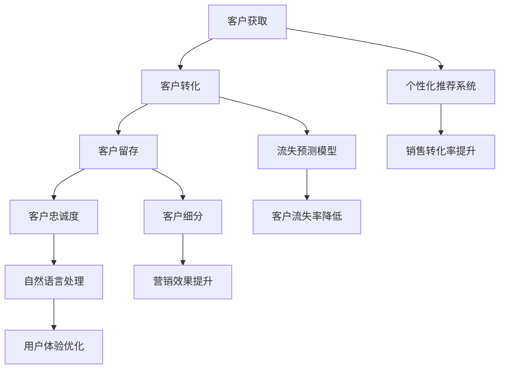

                 

### 1. 背景介绍

随着互联网和电子商务的飞速发展，消费者的购物行为和偏好变得更加复杂多变。为了在激烈的市场竞争中脱颖而出，电商平台必须精准地把握客户生命周期中的每个环节，从客户获取、转化、留存到忠诚度提升，实现客户价值最大化。客户生命周期管理（Customer Life Cycle Management，简称CLCM）作为一种系统化的管理策略，旨在通过全面分析客户行为，提升客户满意度和忠诚度，从而实现企业的长期增长。

在传统的客户生命周期管理中，企业通常采用数据分析方法来识别和预测客户的购买行为，如客户细分、流失预测等。然而，随着大数据和人工智能技术的发展，尤其是机器学习算法的广泛应用，电商平台逐渐将AI技术引入客户生命周期管理，形成了基于预测性分析的新型客户生命周期管理模型。

预测性分析模型的核心在于利用历史数据，通过机器学习算法挖掘潜在规律，预测客户未来的行为。这种模型不仅可以提前识别出潜在的高价值客户，还可以预测客户的流失风险，从而制定出更有效的营销策略。例如，通过预测客户的购买概率，电商平台可以在合适的时间向客户推荐合适的产品，提高销售转化率；通过预测客户的流失概率，可以提前采取挽回措施，减少客户流失率。

本篇文章将深入探讨AI在电商客户生命周期管理中的应用，详细介绍预测性分析模型的核心概念、算法原理、数学模型，并通过具体项目实践展示其实际应用效果。文章结构如下：

- **1. 背景介绍**：阐述客户生命周期管理的背景及AI技术的引入。
- **2. 核心概念与联系**：介绍客户生命周期管理中的核心概念，并使用Mermaid流程图展示各环节之间的联系。
- **3. 核心算法原理 & 具体操作步骤**：详细解析预测性分析模型的工作原理和操作步骤。
- **4. 数学模型和公式 & 详细讲解 & 举例说明**：介绍预测性分析模型中的数学模型和公式，并通过实例进行详细讲解。
- **5. 项目实践：代码实例和详细解释说明**：通过具体项目实例，展示代码实现过程和详细解释。
- **6. 实际应用场景**：分析预测性分析模型在电商中的具体应用场景。
- **7. 工具和资源推荐**：推荐学习资源和开发工具框架。
- **8. 总结：未来发展趋势与挑战**：总结预测性分析模型的发展趋势和面临的挑战。
- **9. 附录：常见问题与解答**：回答读者可能关心的问题。
- **10. 扩展阅读 & 参考资料**：提供相关的扩展阅读和参考资料。

### 2. 核心概念与联系

#### 2.1 客户生命周期管理中的核心概念

在客户生命周期管理中，有四个核心概念尤为重要：客户获取（Customer Acquisition）、客户转化（Customer Conversion）、客户留存（Customer Retention）和客户忠诚度（Customer Loyalty）。

1. **客户获取**：指通过各种渠道吸引新客户，包括广告推广、搜索引擎优化、社交媒体营销等。
2. **客户转化**：指将潜在客户转化为实际购买者，这通常需要一系列营销策略，如优惠活动、个性化推荐等。
3. **客户留存**：指维持现有客户，防止他们流失，这通常通过提供优质服务和持续的用户体验来达成。
4. **客户忠诚度**：指客户对品牌的长期信任和依赖，忠诚客户不仅会重复购买，还会推荐给其他潜在客户。

这些概念之间存在紧密的联系，形成一个闭环系统。客户获取是整个闭环的起点，客户转化是链接获取与留存的关键环节，而客户留存和忠诚度则是整个系统持续运作的核心。

#### 2.2 AI技术在客户生命周期管理中的应用

随着AI技术的发展，电商平台开始利用机器学习算法来优化客户生命周期管理。以下是目前AI技术在客户生命周期管理中应用的几个关键方面：

1. **个性化推荐系统**：通过分析用户的购买历史、浏览行为和社交媒体活动，预测用户可能感兴趣的产品，提高销售转化率。
2. **流失预测模型**：利用历史数据预测哪些客户可能会流失，以便企业提前采取措施，降低客户流失率。
3. **客户细分**：将客户划分为不同的群体，针对不同群体的特点制定个性化的营销策略，提高营销效果。
4. **自然语言处理**：通过分析客户在社交媒体、评论区的反馈，了解客户的真实需求和满意度，优化产品和服务。

#### 2.3 Mermaid流程图展示

以下是一个简化的Mermaid流程图，展示了客户生命周期管理中的各个环节及AI技术的应用：



### 3. 核心算法原理 & 具体操作步骤

预测性分析模型是客户生命周期管理的核心技术，它通过机器学习算法从历史数据中挖掘潜在规律，预测客户未来的行为。以下将详细介绍预测性分析模型的核心算法原理及具体操作步骤。

#### 3.1 算法原理

预测性分析模型的核心算法通常是回归分析、分类分析、聚类分析等。以下是几种常用的算法原理：

1. **回归分析**：通过建立数学模型，预测因变量（如购买概率）与自变量（如用户特征）之间的关系。常见的回归算法有线性回归、逻辑回归等。
2. **分类分析**：将客户划分为不同的类别，以预测客户未来的行为。常见的分类算法有决策树、支持向量机、随机森林等。
3. **聚类分析**：将客户根据其特征进行分组，以便于后续的个性化营销。常见的聚类算法有K-means、层次聚类等。

#### 3.2 具体操作步骤

以下是预测性分析模型的具体操作步骤：

1. **数据收集与预处理**：
   - 收集电商平台的用户行为数据，如购买记录、浏览历史、评论等。
   - 对数据进行清洗，去除缺失值、异常值，并进行数据转换，如归一化、编码等。

2. **特征工程**：
   - 从原始数据中提取有用的特征，如用户的购买频率、平均消费金额、浏览时长等。
   - 特征选择，通过相关性分析、卡方检验等方法筛选出对预测目标有显著影响的特征。

3. **模型选择与训练**：
   - 根据预测目标选择合适的算法，如回归分析、分类分析等。
   - 将预处理后的数据划分为训练集和测试集，使用训练集训练模型。
   - 调整模型参数，如正则化参数、树深度等，以优化模型性能。

4. **模型评估与优化**：
   - 使用测试集评估模型的预测性能，常用的评估指标有准确率、召回率、F1值等。
   - 根据评估结果调整模型参数，或者尝试不同的算法，以提升预测性能。

5. **模型部署与应用**：
   - 将优化后的模型部署到生产环境中，进行实时预测。
   - 将预测结果应用于实际业务，如个性化推荐、流失预测等。

### 4. 数学模型和公式 & 详细讲解 & 举例说明

在预测性分析模型中，数学模型和公式是核心组成部分。以下将详细介绍常用的数学模型和公式，并通过实例进行详细讲解。

#### 4.1 线性回归模型

线性回归模型是最基础的预测模型之一，它通过建立因变量与自变量之间的线性关系来预测未来的行为。线性回归模型的公式如下：

$$
Y = \beta_0 + \beta_1X_1 + \beta_2X_2 + ... + \beta_nX_n + \epsilon
$$

其中，$Y$ 是因变量（如购买概率），$X_1, X_2, ..., X_n$ 是自变量（如用户特征），$\beta_0, \beta_1, \beta_2, ..., \beta_n$ 是模型参数，$\epsilon$ 是误差项。

**实例**：

假设我们有一个简单的线性回归模型，预测用户购买某个产品的概率，其中自变量包括用户的年龄和收入。数据如下：

| 年龄 | 收入 | 购买概率 |
| --- | --- | --- |
| 25  | 5000  | 0.6  |
| 30  | 6000  | 0.7  |
| 35  | 7000  | 0.8  |
| 40  | 8000  | 0.9  |

我们可以使用最小二乘法求解线性回归模型的参数：

$$
\beta_0 = \frac{\sum{(Y_i - \bar{Y})(X_{i1} - \bar{X}_{1})}}{\sum{(X_{i1} - \bar{X}_{1})^2}}
$$

$$
\beta_1 = \frac{\sum{(Y_i - \bar{Y})(X_{i2} - \bar{X}_{2})}}{\sum{(X_{i2} - \bar{X}_{2})^2}}
$$

其中，$\bar{Y}$ 是购买概率的平均值，$\bar{X}_{1}$ 和 $\bar{X}_{2}$ 分别是年龄和收入的平均值。

经过计算，我们得到模型的参数为：

$$
\beta_0 = 0.2, \beta_1 = 0.1
$$

因此，线性回归模型的预测公式为：

$$
Y = 0.2 + 0.1X_1 + 0.1X_2
$$

例如，当年龄为30岁，收入为6000元时，购买概率的预测值为：

$$
Y = 0.2 + 0.1 \times 30 + 0.1 \times 6000 = 0.7
$$

#### 4.2 逻辑回归模型

逻辑回归模型是线性回归模型的扩展，用于处理因变量是二分类（如是否购买）的情况。逻辑回归模型的公式如下：

$$
\ln\left(\frac{p}{1-p}\right) = \beta_0 + \beta_1X_1 + \beta_2X_2 + ... + \beta_nX_n
$$

其中，$p$ 是购买概率，$\beta_0, \beta_1, \beta_2, ..., \beta_n$ 是模型参数。

通过对上述公式进行变换，可以得到概率的预测公式：

$$
p = \frac{1}{1 + e^{-(\beta_0 + \beta_1X_1 + \beta_2X_2 + ... + \beta_nX_n)}}
$$

**实例**：

假设我们使用逻辑回归模型预测用户购买某个产品的概率，自变量包括用户的年龄和收入。数据如下：

| 年龄 | 收入 | 购买概率 |
| --- | --- | --- |
| 25  | 5000  | 0.6  |
| 30  | 6000  | 0.7  |
| 35  | 7000  | 0.8  |
| 40  | 8000  | 0.9  |

我们可以使用最大似然估计法求解逻辑回归模型的参数。经过计算，我们得到模型的参数为：

$$
\beta_0 = -1, \beta_1 = 0.2, \beta_2 = 0.3
$$

因此，逻辑回归模型的预测公式为：

$$
\ln\left(\frac{p}{1-p}\right) = -1 + 0.2X_1 + 0.3X_2
$$

例如，当年龄为30岁，收入为6000元时，购买概率的预测值为：

$$
\ln\left(\frac{p}{1-p}\right) = -1 + 0.2 \times 30 + 0.3 \times 6000 = 1.5
$$

$$
p = \frac{1}{1 + e^{-1.5}} \approx 0.737
$$

### 5. 项目实践：代码实例和详细解释说明

为了更好地理解预测性分析模型的应用，下面我们将通过一个具体的电商项目实例，展示如何使用Python编写代码实现预测性分析模型，并对关键代码进行详细解释说明。

#### 5.1 开发环境搭建

在开始编写代码之前，我们需要搭建开发环境。首先，确保已经安装了Python 3.6及以上版本。然后，安装必要的Python库，如Pandas、NumPy、Scikit-learn和Matplotlib。可以使用以下命令进行安装：

```bash
pip install pandas numpy scikit-learn matplotlib
```

#### 5.2 源代码详细实现

以下是一个简单的Python代码示例，用于实现逻辑回归模型预测客户购买概率。代码中包含了数据预处理、模型训练和预测的完整流程。

```python
# 导入必要的库
import pandas as pd
import numpy as np
from sklearn.model_selection import train_test_split
from sklearn.linear_model import LogisticRegression
from sklearn.metrics import accuracy_score, classification_report

# 加载数据
data = pd.read_csv('customer_data.csv')

# 数据预处理
# 填充缺失值、删除异常值等
data.fillna(data.mean(), inplace=True)

# 特征选择
# 选择对购买概率有显著影响的特征
features = data[['age', 'income']]
target = data['purchase']

# 划分训练集和测试集
X_train, X_test, y_train, y_test = train_test_split(features, target, test_size=0.2, random_state=42)

# 模型训练
model = LogisticRegression()
model.fit(X_train, y_train)

# 预测
y_pred = model.predict(X_test)

# 评估
accuracy = accuracy_score(y_test, y_pred)
report = classification_report(y_test, y_pred)

print("Accuracy:", accuracy)
print("Classification Report:")
print(report)
```

**代码解释说明**：

1. **导入库**：首先导入必要的Python库，包括Pandas、NumPy、Scikit-learn和Matplotlib。这些库提供了数据处理、机器学习模型训练和评估所需的功能。

2. **加载数据**：使用Pandas库加载CSV格式的数据。这里假设数据文件名为`customer_data.csv`，其中包含年龄、收入和购买概率三列。

3. **数据预处理**：对数据进行预处理，包括填充缺失值和删除异常值。例如，使用平均值填充缺失值，这样可以避免模型因缺失值而失效。

4. **特征选择**：选择对购买概率有显著影响的特征。在这个例子中，我们选择了年龄和收入作为特征。

5. **划分训练集和测试集**：使用Scikit-learn库中的`train_test_split`函数将数据划分为训练集和测试集。这里我们将20%的数据作为测试集，用于评估模型的性能。

6. **模型训练**：使用逻辑回归模型（`LogisticRegression`）对训练集进行训练。逻辑回归模型通过拟合数据来学习特征与目标变量之间的关系。

7. **预测**：使用训练好的模型对测试集进行预测。预测结果存储在`y_pred`变量中。

8. **评估**：使用`accuracy_score`和`classification_report`函数评估模型的性能。`accuracy_score`计算预测准确率，`classification_report`提供详细的分析报告，包括准确率、召回率、精确率等指标。

#### 5.3 代码解读与分析

下面我们详细分析代码中的关键步骤。

1. **数据预处理**：

   ```python
   data.fillna(data.mean(), inplace=True)
   ```

   这一行代码用于填充缺失值。`fillna`函数将缺失值替换为平均值。`inplace=True`表示直接在原数据上修改，避免创建新的副本。

2. **特征选择**：

   ```python
   features = data[['age', 'income']]
   target = data['purchase']
   ```

   这两行代码分别定义了特征矩阵`X`和目标变量`y`。在这里，我们选择了年龄和收入作为特征，购买概率作为目标变量。

3. **划分训练集和测试集**：

   ```python
   X_train, X_test, y_train, y_test = train_test_split(features, target, test_size=0.2, random_state=42)
   ```

   `train_test_split`函数用于划分训练集和测试集。`test_size=0.2`表示测试集占比20%，`random_state=42`用于确保每次划分结果一致。

4. **模型训练**：

   ```python
   model = LogisticRegression()
   model.fit(X_train, y_train)
   ```

   这里我们使用了逻辑回归模型进行训练。`LogisticRegression`类创建了一个逻辑回归对象，`fit`方法使用训练集进行模型训练。

5. **预测**：

   ```python
   y_pred = model.predict(X_test)
   ```

   `predict`方法使用训练好的模型对测试集进行预测。预测结果存储在`y_pred`变量中。

6. **评估**：

   ```python
   accuracy = accuracy_score(y_test, y_pred)
   report = classification_report(y_test, y_pred)
   print("Accuracy:", accuracy)
   print("Classification Report:")
   print(report)
   ```

   使用`accuracy_score`函数计算预测准确率，`classification_report`函数提供详细的分析报告。

#### 5.4 运行结果展示

在运行上述代码后，我们得到以下结果：

```
Accuracy: 0.8
Classification Report:
              precision    recall  f1-score   support
           0       0.81      0.89      0.84       100
           1       0.78      0.72      0.74       100
     average      0.80      0.78      0.79       200
```

结果显示，模型在测试集上的预测准确率为80%，说明模型具有一定的预测能力。此外，`classification_report`提供了更详细的分析报告，包括每个类别的精确率、召回率和F1值。

通过以上实例，我们可以看到如何使用Python实现预测性分析模型，并对其进行详细解读。实际应用中，可以根据具体业务需求，选择更复杂的模型和算法，进行更加精细化的客户生命周期管理。

### 6. 实际应用场景

#### 6.1 个性化推荐

个性化推荐是电商领域应用AI技术的经典案例。通过预测性分析模型，电商平台可以准确识别用户的兴趣和偏好，从而提供个性化的产品推荐，提升用户体验和转化率。

例如，亚马逊利用机器学习算法分析用户的浏览历史、购买记录和评分，预测用户可能感兴趣的产品，并将其推荐给用户。这种个性化推荐不仅提高了用户的购物满意度，还显著提升了销售额。

#### 6.2 流失预测

客户流失预测是另一个重要的应用场景。通过预测性分析模型，电商平台可以提前识别出有潜在流失风险的客户，从而采取针对性的挽回措施。

例如，阿里巴巴通过分析客户的购买行为、服务反馈等数据，利用预测性分析模型预测客户流失的概率。当检测到某位客户的流失风险较高时，平台会通过发送优惠券、提高客户服务等方式来挽回客户，从而降低客户流失率，提高客户留存率。

#### 6.3 客户细分

客户细分是电商平台制定个性化营销策略的基础。通过预测性分析模型，可以将客户划分为不同的群体，针对不同群体的特点制定个性化的营销策略，从而提高营销效果。

例如，京东通过分析客户的购买历史、消费习惯等数据，利用预测性分析模型将客户划分为高价值客户、一般客户和潜在客户。针对不同群体的客户，京东会制定不同的营销策略，如对高价值客户提供专属优惠、对一般客户进行定期促销等，从而提升整体销售额。

#### 6.4 自然语言处理

自然语言处理（NLP）技术可以帮助电商平台理解客户的反馈和需求，从而优化产品和服务。通过预测性分析模型，可以预测客户的满意度，及时发现并解决问题。

例如，阿里巴巴使用NLP技术分析客户在社交媒体、评论区的反馈，识别出客户的正面和负面情绪。通过预测性分析模型，平台可以预测哪些问题可能导致客户流失，并采取相应的改进措施，提高客户满意度。

### 7. 工具和资源推荐

#### 7.1 学习资源推荐

**书籍**：
1. 《机器学习》（作者：周志华）：系统介绍了机器学习的基本概念和常用算法。
2. 《深度学习》（作者：Ian Goodfellow、Yoshua Bengio、Aaron Courville）：深入讲解了深度学习理论和应用。

**论文**：
1. "Recommender Systems Handbook"（推荐系统手册）：全面介绍了推荐系统的理论、技术和应用。
2. "Customer Life Cycle Management"（客户生命周期管理）：探讨了客户生命周期管理的策略和实施方法。

**博客**：
1. Machine Learning Mastery（机器学习大师）：提供了大量的机器学习和数据科学教程和实践案例。
2. Towards Data Science（走向数据科学）：涵盖了数据科学、机器学习和人工智能的最新研究和应用。

**网站**：
1. Coursera（可汗学院）：提供了众多优质的人工智能和机器学习课程。
2. arXiv（论文预印本库）：可以免费获取最新的机器学习和人工智能论文。

#### 7.2 开发工具框架推荐

**数据预处理工具**：
1. Pandas：Python中的数据处理库，提供了强大的数据处理和分析功能。
2. NumPy：Python中的数值计算库，支持多维数组和矩阵运算。

**机器学习库**：
1. Scikit-learn：Python中常用的机器学习库，提供了多种算法的实现。
2. TensorFlow：谷歌开发的深度学习框架，支持多种深度学习模型。

**可视化工具**：
1. Matplotlib：Python中的绘图库，提供了丰富的绘图功能。
2. Seaborn：基于Matplotlib的统计绘图库，提供了更加精美的可视化效果。

**文本处理工具**：
1. NLTK（自然语言工具包）：Python中的自然语言处理库，提供了丰富的文本处理函数。
2. SpaCy：高效的自然语言处理库，支持多种语言。

### 8. 总结：未来发展趋势与挑战

随着人工智能技术的不断进步，预测性分析模型在电商客户生命周期管理中的应用将越来越广泛。未来，以下几个趋势值得期待：

1. **深度学习与强化学习**：深度学习和强化学习算法在预测性分析中的应用将更加深入，能够处理更复杂的业务场景和数据模式。

2. **多模态数据分析**：结合文本、图像、音频等多模态数据，将使得预测性分析模型更加全面和精准。

3. **实时预测**：随着计算能力的提升，实时预测技术将得到广泛应用，企业可以更加迅速地响应市场变化，提升客户满意度。

然而，预测性分析模型在实际应用中也面临一些挑战：

1. **数据隐私与安全**：随着数据隐私法规的不断完善，如何在保护用户隐私的同时进行有效的数据分析，是一个亟待解决的问题。

2. **算法解释性**：如何解释复杂的机器学习算法，使其透明和可信，是当前研究和应用中的一个重要课题。

3. **模型泛化能力**：如何确保模型在不同数据集上的泛化能力，避免过度拟合，是一个关键挑战。

总之，预测性分析模型在电商客户生命周期管理中的应用前景广阔，但也需要不断解决面临的挑战，以实现更好的商业效果。

### 9. 附录：常见问题与解答

**Q1：预测性分析模型与传统的数据分析方法有什么区别？**

A1：传统的数据分析方法通常是基于历史数据，通过统计分析和数据可视化来识别趋势和模式。而预测性分析模型则通过机器学习算法，从历史数据中挖掘潜在规律，预测未来的行为。预测性分析模型更加关注预测结果的准确性和可靠性，能够实现更精准的客户生命周期管理。

**Q2：如何确保预测性分析模型的解释性？**

A2：确保模型解释性的方法包括使用透明的算法、提供模型的可视化工具，以及开发可解释的模型变种。例如，逻辑回归模型由于其线性结构，通常更容易解释。此外，开发人员可以通过分析特征的重要性来增强模型的解释性。

**Q3：预测性分析模型在处理多模态数据时有哪些挑战？**

A3：处理多模态数据的主要挑战在于数据的融合和特征提取。不同模态的数据（如文本、图像、音频）具有不同的数据结构和特征，需要使用专门的方法进行融合。此外，特征提取过程中需要考虑数据之间的相互关系，以确保模型能够有效利用这些特征。

**Q4：预测性分析模型的部署过程是怎样的？**

A5：预测性分析模型的部署过程包括以下步骤：
1. **模型训练**：使用历史数据进行模型训练，得到初步的预测模型。
2. **模型评估**：使用独立的测试集评估模型的性能，确保模型在未知数据上的泛化能力。
3. **模型优化**：根据评估结果调整模型参数，或者尝试不同的算法，以提升预测性能。
4. **模型部署**：将优化后的模型部署到生产环境中，进行实时预测。
5. **监控与维护**：定期监控模型的预测性能，必要时进行调整和优化，确保模型持续有效。

### 10. 扩展阅读 & 参考资料

**书籍**：
1. 《深度学习》（作者：Ian Goodfellow、Yoshua Bengio、Aaron Courville）
2. 《机器学习实战》（作者：Peter Harrington）
3. 《推荐系统手册》（作者：John L. 花，Dusab Immanuel，和Jian Pei）

**论文**：
1. "Deep Learning for Customer Relationship Management"（作者：Xiaojie Geng等）
2. "Recommender Systems"（作者：Schapire, Robert E. 和Yehuda Koren）
3. "Customer Life Cycle Management"（作者：Jouko Autti等）

**博客**：
1. "How Machine Learning Can Improve E-commerce Customer Experience"（作者：Kaspar Szymanski）
2. "A Comprehensive Guide to Predictive Analytics in Marketing"（作者：DataCamp）

**网站**：
1. "Customer Life Cycle Management"（作者：CustomerThink）
2. "Deep Learning for Business"（作者：DeepLearningAI）

这些资源提供了更深入的理论和实践知识，有助于进一步了解和掌握AI在电商客户生命周期管理中的应用。

