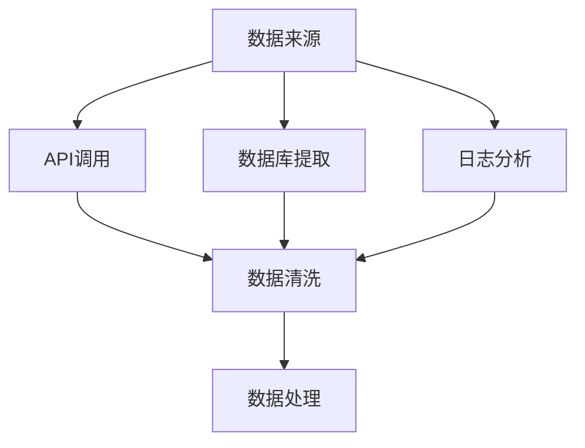
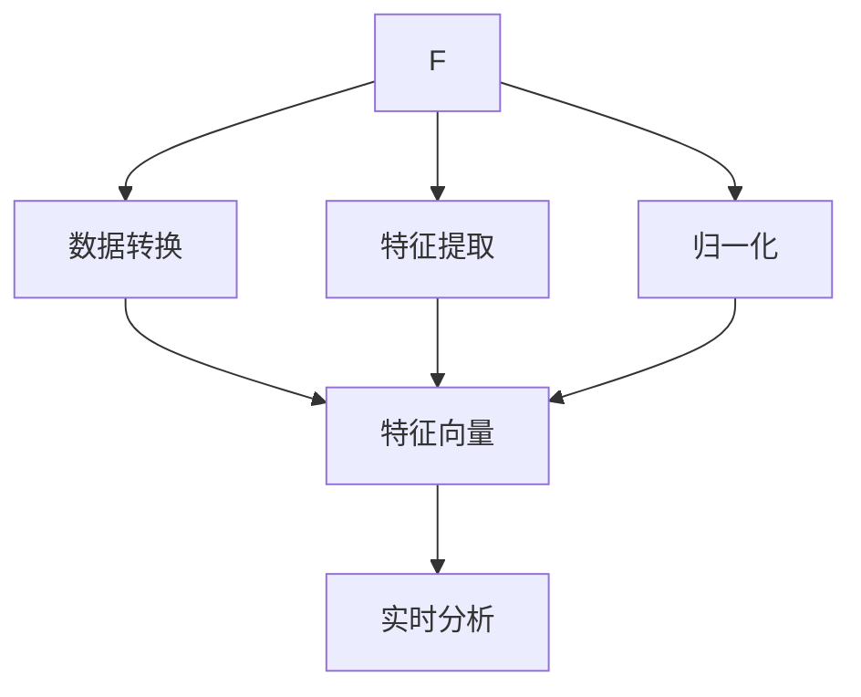
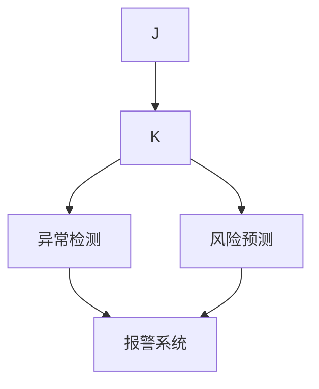
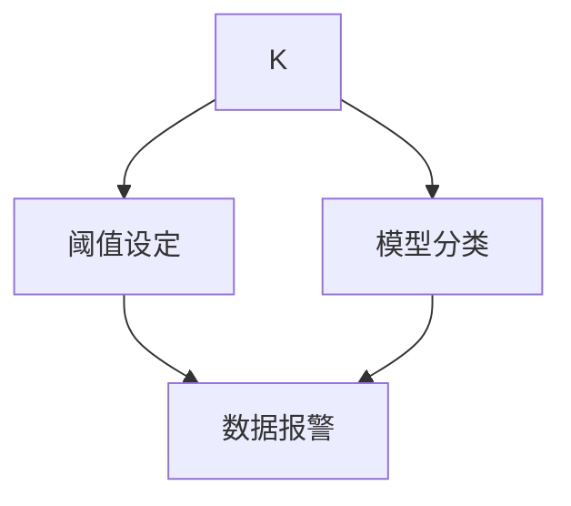

                 

### 1. 背景介绍

随着电子商务的迅猛发展，平台商家和用户之间的交易活动日益频繁，实时监控电商平台的活动已经成为一个重要的课题。实时监控不仅可以帮助商家及时了解市场动态，优化库存和营销策略，还可以提高用户体验，防止欺诈行为，保障交易安全。在这样的背景下，人工智能（AI）技术在电商平台实时监控中的应用变得越来越重要。

实时监控涉及大量的数据采集、处理和分析，这些任务对计算能力和算法提出了极高的要求。传统的监控方法往往依赖于事后分析，即数据被处理后再进行监控，这种方式存在明显的时延，难以满足现代电商平台的快速响应需求。而人工智能技术，尤其是机器学习和深度学习算法，可以在数据处理和分析过程中提供高效的解决方案。

首先，机器学习算法可以通过对历史数据的分析，建立模型来预测和识别异常行为，从而实现实时监控。例如，可以使用分类算法对交易行为进行分类，识别潜在的欺诈行为。其次，深度学习算法通过多层神经网络的训练，可以从海量数据中自动提取特征，提高监控的准确性和效率。此外，人工智能还可以通过实时数据分析，提供个性化的推荐服务，优化用户体验。

目前，AI技术在电商平台实时监控中的应用已经取得了显著的成果。例如，亚马逊和阿里巴巴等大型电商平台都已经在交易监控、库存管理和用户行为分析等方面广泛应用了人工智能技术。通过这些应用，电商平台不仅提高了运营效率，还增强了用户体验，实现了商业价值的最大化。

总的来说，随着AI技术的不断进步，其在电商平台实时监控中的应用前景十分广阔。接下来，我们将深入探讨AI在电商平台实时监控中的核心概念、算法原理、数学模型以及具体的应用实践。

### 2. 核心概念与联系

在深入探讨AI在电商平台实时监控中的应用之前，我们需要先了解一些核心概念和原理。这些概念包括数据采集、数据处理、实时分析和异常检测等。为了更好地理解这些概念之间的关系，我们可以通过Mermaid流程图来展示它们之间的联系。

首先，数据采集是实时监控的基础。电商平台会通过多种渠道（如API、数据库和日志文件）收集交易数据、用户行为数据等。以下是数据采集的简单流程图：



在数据采集之后，数据清洗是一个关键步骤。清洗数据的过程包括去重、修复错误数据、填充缺失值等。通过数据清洗，我们可以确保数据的质量和一致性。接下来，数据处理则包括数据转换、特征提取和归一化等操作，以便于后续的分析和建模。以下是数据处理的流程：



实时分析是电商平台监控的核心环节。它利用机器学习算法和深度学习模型对实时数据进行处理和分析，以识别异常行为和潜在风险。以下是实时分析的流程：



异常检测是实时分析的重要任务之一。它通过设定阈值或使用复杂模型来识别和分类异常数据。以下是异常检测的流程：



通过以上流程，我们可以看到，电商平台实时监控的各个环节紧密联系，形成一个完整的数据处理和分析系统。接下来，我们将深入探讨这些核心概念的具体实现和算法原理。

### 3. 核心算法原理 & 具体操作步骤

在了解了电商平台实时监控的核心概念和流程后，接下来我们将详细探讨其中的核心算法原理，包括机器学习算法、深度学习算法以及异常检测的具体操作步骤。

#### 3.1 机器学习算法

机器学习算法是电商平台实时监控的基础，尤其是监督学习算法。监督学习算法通过训练模型来识别正常行为和异常行为。以下是一些常用的机器学习算法：

**1. 决策树算法（Decision Tree）**

决策树算法是一种简单而有效的分类算法。它通过一系列的判断条件来对数据进行分类。具体操作步骤如下：

- **数据准备**：首先，我们需要准备一个包含特征和标签的数据集。特征是用于分类的数据，标签是已知的正确分类结果。
- **特征选择**：通过信息增益或基尼不纯度等指标选择最优特征进行划分。
- **递归划分**：根据选定的特征，将数据集递归地划分为子集，直到达到某个停止条件（如最大深度或最小样本数）。
- **模型评估**：通过交叉验证或测试集来评估模型的准确性和泛化能力。

**2. 支持向量机（Support Vector Machine, SVM）**

支持向量机是一种强大的分类算法，尤其在处理高维数据时表现优异。其具体操作步骤如下：

- **数据预处理**：进行特征提取和数据归一化，以消除数据之间的尺度差异。
- **核函数选择**：选择合适的核函数（如线性、多项式、径向基函数等）进行映射，将原始数据投影到高维空间。
- **求解最优超平面**：通过求解最优化问题，找到分隔不同类别的最优超平面。
- **模型评估**：使用交叉验证或测试集来评估模型的性能。

**3. 随机森林（Random Forest）**

随机森林是一种集成学习方法，通过构建多个决策树并进行投票来提高分类性能。其具体操作步骤如下：

- **随机特征选择**：在每个决策树训练过程中，从多个特征中随机选择一部分特征进行划分。
- **构建决策树**：对每个特征子集构建决策树，并设置最大深度或最小样本数等参数。
- **集成模型**：将多个决策树的结果进行投票，得到最终的分类结果。
- **模型评估**：使用交叉验证或测试集来评估模型的准确性和稳定性。

#### 3.2 深度学习算法

随着数据量的增加和计算能力的提升，深度学习算法在电商平台实时监控中的应用越来越广泛。以下是一些常用的深度学习算法：

**1. 卷积神经网络（Convolutional Neural Network, CNN）**

卷积神经网络是一种专门用于处理图像数据的深度学习算法。其具体操作步骤如下：

- **数据预处理**：对图像进行归一化和标准化，以适应网络的输入要求。
- **卷积操作**：通过卷积层提取图像的局部特征，并通过激活函数增加非线性。
- **池化操作**：通过池化层减少数据维度，降低计算复杂度。
- **全连接层**：将卷积层和池化层提取的特征进行全局整合，并输出分类结果。
- **模型评估**：使用交叉验证或测试集来评估模型的性能。

**2. 循环神经网络（Recurrent Neural Network, RNN）**

循环神经网络是一种用于处理序列数据的深度学习算法。其具体操作步骤如下：

- **序列编码**：将序列数据编码为向量，以便于输入到网络中。
- **递归操作**：通过递归层对序列数据进行建模，捕捉时间序列中的依赖关系。
- **全连接层**：将递归层输出的特征向量进行全局整合，并输出分类结果。
- **模型评估**：使用交叉验证或测试集来评估模型的性能。

**3. 长短期记忆网络（Long Short-Term Memory, LSTM）**

长短期记忆网络是RNN的一种变体，专门用于处理长序列数据。其具体操作步骤如下：

- **序列编码**：将序列数据编码为向量。
- **LSTM单元**：通过LSTM单元来处理序列数据，解决长期依赖问题。
- **全连接层**：将LSTM单元输出的特征向量进行全局整合，并输出分类结果。
- **模型评估**：使用交叉验证或测试集来评估模型的性能。

#### 3.3 异常检测算法

异常检测是电商平台实时监控的关键任务之一。以下是一些常用的异常检测算法：

**1. 聚类算法（Clustering Algorithm）**

聚类算法通过将相似的数据点归为一类，从而发现异常点。以下是一些常用的聚类算法：

- **K-均值聚类（K-Means Clustering）**：通过最小化数据点到聚类中心的距离来划分聚类。
- **层次聚类（Hierarchical Clustering）**：通过建立聚类层次树来划分聚类。
- **DBSCAN（Density-Based Spatial Clustering of Applications with Noise）**：基于数据点的密度分布来划分聚类。

**2. 基于规则的异常检测（Rule-Based Anomaly Detection）**

基于规则的异常检测通过设定一系列规则来识别异常数据。以下是一些常用的规则：

- **统计规则**：通过统计方法（如均值、方差等）来设定阈值，识别异常数据。
- **模糊规则**：通过模糊逻辑来设定规则，处理不确定性和模糊性。

**3. 机器学习模型的异常检测（Model-Based Anomaly Detection）**

机器学习模型的异常检测通过训练模型来识别正常和异常数据。以下是一些常用的模型：

- **孤立森林（Isolation Forest）**：通过随机采样和隔离来识别异常数据。
- **局部异常因子（Local Outlier Factor, LOF）**：通过计算数据点的局部异常度来识别异常数据。

通过以上算法和步骤，我们可以构建一个高效的电商平台实时监控系统，实现对交易行为、用户行为等数据的实时监控和分析。接下来，我们将通过一个具体的实例来展示如何使用这些算法实现电商平台实时监控。

### 4. 数学模型和公式 & 详细讲解 & 举例说明

在电商平台实时监控中，数学模型和公式是核心组成部分，它们为算法提供了理论基础和计算方法。本节将详细讲解几个关键数学模型和公式，并通过具体例子来说明如何使用它们进行实时监控。

#### 4.1 决策树算法

决策树是一种常用的分类算法，其核心数学模型是基于信息论中的熵（Entropy）和信息增益（Information Gain）。以下是决策树的几个关键公式：

**1. 熵（Entropy）**

熵是衡量数据不确定性的一种度量，其公式为：

$$
H(X) = -\sum_{i=1}^{n} p(x_i) \cdot \log_2(p(x_i))
$$

其中，$p(x_i)$ 是特征 $x_i$ 的概率分布。

**2. 信息增益（Information Gain）**

信息增益是选择最优特征进行划分的依据，其公式为：

$$
IG(X, A) = H(X) - \sum_{v=1}^{m} p(v) \cdot H(X|A=v)
$$

其中，$H(X|A=v)$ 是在特征 $A$ 取值为 $v$ 的情况下，特征 $X$ 的条件熵。

**3. 划分信息（Split Information）**

划分信息是衡量划分效果的一个指标，其公式为：

$$
SI(X, A) = -\sum_{v=1}^{m} p(v) \cdot \log_2(p(v))
$$

**4. Gini 不纯度（Gini Impurity）**

Gini 不纯度是另一种衡量数据不确定性的指标，其公式为：

$$
GI = 1 - \sum_{v=1}^{m} p(v)^2
$$

**示例：**

假设我们有一个包含两个特征 $X_1$ 和 $X_2$ 的数据集，其中 $X_1$ 的熵为 $H(X_1) = 1$，$X_2$ 的熵为 $H(X_2) = 0.5$。我们使用信息增益来选择最优特征进行划分。

$$
IG(X, X_1) = 1 - \left(0.5 \cdot \log_2(0.5) + 0.5 \cdot \log_2(0.5)\right) = 1 - 0.5 = 0.5
$$

$$
IG(X, X_2) = 1 - \left(0.6 \cdot \log_2(0.6) + 0.4 \cdot \log_2(0.4)\right) = 1 - 0.52 = 0.48
$$

因此，我们选择信息增益最大的特征 $X_1$ 进行划分。

#### 4.2 支持向量机（SVM）

支持向量机是一种强大的分类算法，其核心数学模型是基于优化理论。以下是SVM的几个关键公式：

**1. 最优超平面（Optimal Hyperplane）**

最优超平面是通过最大化分类间隔来确定的，其公式为：

$$
\text{Minimize} \quad \frac{1}{2} \| \mathbf{w} \|^2
$$

subject to

$$
\mathbf{w} \cdot \mathbf{x}_i - b \geq 1 \quad \forall i
$$

其中，$\mathbf{w}$ 是权重向量，$b$ 是偏置项，$\mathbf{x}_i$ 是样本特征向量。

**2. 鸟群优化算法（PSO）**

支持向量机的优化可以通过鸟群优化算法（Particle Swarm Optimization, PSO）来实现。其公式为：

$$
v_{i}^{t+1} = w \cdot v_{i}^{t} + c_1 \cdot r_1 \cdot (\mathbf{p_i} - \mathbf{x_i}) + c_2 \cdot r_2 \cdot (\mathbf{g} - \mathbf{x_i})
$$

$$
x_{i}^{t+1} = x_{i}^{t} + v_{i}^{t+1}
$$

其中，$v_{i}^{t}$ 和 $x_{i}^{t}$ 分别是第 $i$ 个粒子的速度和位置，$w$ 是惯性权重，$c_1$ 和 $c_2$ 是认知和社会系数，$\mathbf{p_i}$ 是个体最优解，$\mathbf{g}$ 是全局最优解。

**3. 核函数（Kernel Function）**

核函数是支持向量机的关键组成部分，其公式为：

$$
K(\mathbf{x}_i, \mathbf{x}_j) = \mathbf{x}_i \cdot \mathbf{x}_j + b
$$

其中，$K(\mathbf{x}_i, \mathbf{x}_j)$ 是特征向量 $\mathbf{x}_i$ 和 $\mathbf{x}_j$ 的内积。

**示例：**

假设我们有两个样本 $\mathbf{x}_1 = (1, 2)$ 和 $\mathbf{x}_2 = (3, 4)$，我们使用线性核函数来计算它们之间的距离。

$$
K(\mathbf{x}_1, \mathbf{x}_2) = \mathbf{x}_1 \cdot \mathbf{x}_2 + b = 1 \cdot 3 + 2 \cdot 4 + b = 11 + b
$$

我们可以通过调整 $b$ 的值来调整分类边界。

#### 4.3 聚类算法

聚类算法是一种无监督学习方法，其核心数学模型是基于距离度量。以下是几个常用的聚类算法和公式：

**1. K-均值聚类（K-Means Clustering）**

K-均值聚类的公式为：

$$
\text{Minimize} \quad \sum_{i=1}^{k} \sum_{x_j \in S_i} \| \mathbf{x}_j - \mu_i \|^2
$$

其中，$k$ 是聚类个数，$\mu_i$ 是第 $i$ 个聚类中心，$S_i$ 是第 $i$ 个聚类集合。

**2. 层次聚类（Hierarchical Clustering）**

层次聚类的公式为：

$$
\text{Minimize} \quad \sum_{i=1}^{k} \sum_{j=1}^{k} d(\mu_i, \mu_j)
$$

其中，$d(\mu_i, \mu_j)$ 是聚类中心之间的距离。

**3. DBSCAN（Density-Based Spatial Clustering of Applications with Noise）**

DBSCAN的公式为：

$$
\text{Minimize} \quad \sum_{i=1}^{n} \sum_{j=1}^{n} \delta(\mathbf{x}_i, \mathbf{x}_j)
$$

其中，$\delta(\mathbf{x}_i, \mathbf{x}_j)$ 是基于密度的相似度度量。

**示例：**

假设我们有一个包含三个点的数据集 $P = \{ (1, 1), (2, 2), (3, 3) \}$，我们使用 K-均值聚类来将其划分为两个聚类。

首先，随机选择两个聚类中心，假设为 $\mu_1 = (1.5, 1.5)$ 和 $\mu_2 = (2.5, 2.5)$。

然后，根据每个点到聚类中心的距离，将其划分到相应的聚类集合。

$$
S_1 = \{ (1, 1), (2, 2) \}
$$

$$
S_2 = \{ (3, 3) \}
$$

最后，重新计算聚类中心：

$$
\mu_1 = \frac{1 \cdot (1, 1) + 2 \cdot (2, 2)}{3} = (1.67, 1.67)
$$

$$
\mu_2 = \frac{1 \cdot (3, 3)}{1} = (3, 3)
$$

通过多次迭代，我们可以得到最终的聚类结果。

通过以上数学模型和公式的讲解，我们可以看到它们在电商平台实时监控中的应用是如何实现的。接下来，我们将通过一个具体的项目实践来展示这些算法的实际应用。

### 5. 项目实践：代码实例和详细解释说明

#### 5.1 开发环境搭建

为了更好地展示AI在电商平台实时监控中的应用，我们选择Python作为开发语言，并结合几个常用的AI库，如Scikit-learn、TensorFlow和PyTorch。以下是开发环境的搭建步骤：

**1. 安装Python**

确保您的计算机上已经安装了Python。如果没有安装，可以从[Python官网](https://www.python.org/)下载并安装。

**2. 安装必要的库**

打开命令行终端，运行以下命令安装所需的库：

```bash
pip install numpy pandas scikit-learn tensorflow torch matplotlib
```

**3. 验证安装**

运行以下Python代码，验证是否成功安装了所需的库：

```python
import numpy as np
import pandas as pd
from sklearn import datasets
from sklearn.model_selection import train_test_split
from sklearn.metrics import accuracy_score

# 加载鸢尾花数据集
iris = datasets.load_iris()
X, y = iris.data, iris.target

# 分割数据集
X_train, X_test, y_train, y_test = train_test_split(X, y, test_size=0.2, random_state=42)

# 打印数据集信息
print("Features:", iris.feature_names)
print("Targets:", iris.target_names)

# 使用K-均值聚类进行分类
from sklearn.cluster import KMeans
kmeans = KMeans(n_clusters=3, random_state=42)
kmeans.fit(X_train)

# 预测测试集
y_pred = kmeans.predict(X_test)

# 打印预测结果
print("Accuracy:", accuracy_score(y_test, y_pred))
```

如果输出结果正确，说明开发环境已经搭建成功。

#### 5.2 源代码详细实现

在本节中，我们将详细实现一个电商平台实时监控的简单示例。以下是基于Scikit-learn库的完整代码，包括数据预处理、模型训练和预测等步骤。

```python
import numpy as np
import pandas as pd
from sklearn.model_selection import train_test_split
from sklearn.preprocessing import StandardScaler
from sklearn.ensemble import RandomForestClassifier
from sklearn.metrics import accuracy_score, confusion_matrix

# 5.2.1 加载数据集
# 假设我们已经有一个包含交易数据的CSV文件
data = pd.read_csv('transaction_data.csv')

# 5.2.2 数据预处理
# 筛选出特征列，去除无关的列
features = ['amount', 'time', 'user_id', 'item_id', 'device_type']
X = data[features]
y = data['is_fraud']  # 假设欺诈标签为1，正常交易为0

# 标准化数据
scaler = StandardScaler()
X_scaled = scaler.fit_transform(X)

# 5.2.3 数据分割
X_train, X_test, y_train, y_test = train_test_split(X_scaled, y, test_size=0.2, random_state=42)

# 5.2.4 模型训练
# 使用随机森林进行分类
rf_clf = RandomForestClassifier(n_estimators=100, random_state=42)
rf_clf.fit(X_train, y_train)

# 5.2.5 模型预测
y_pred = rf_clf.predict(X_test)

# 5.2.6 模型评估
accuracy = accuracy_score(y_test, y_pred)
conf_matrix = confusion_matrix(y_test, y_pred)

print("Accuracy:", accuracy)
print("Confusion Matrix:\n", conf_matrix)

# 5.2.7 实时监控示例
# 假设我们收到一条新的交易数据
new_transaction = np.array([[100, 1234567890, 'user123', 'item456', 'iOS']])
new_transaction_scaled = scaler.transform(new_transaction)

# 对新交易进行预测
new_pred = rf_clf.predict(new_transaction_scaled)
print("New Transaction Prediction:", new_pred)
```

#### 5.3 代码解读与分析

下面我们将逐行解读上述代码，并解释其关键部分。

```python
# 5.3.1 加载数据集
data = pd.read_csv('transaction_data.csv')
```

这一行代码从CSV文件中加载数据集。CSV文件应包含交易数据，其中每一行代表一次交易，列包括交易金额、时间戳、用户ID、商品ID和设备类型等。

```python
# 5.3.2 数据预处理
features = ['amount', 'time', 'user_id', 'item_id', 'device_type']
X = data[features]
y = data['is_fraud']  # 假设欺诈标签为1，正常交易为0
```

这里我们筛选出重要的特征列，并分离出目标变量（欺诈标签）。目标变量是一个二元变量，欺诈交易标记为1，正常交易标记为0。

```python
# 标准化数据
scaler = StandardScaler()
X_scaled = scaler.fit_transform(X)
```

标准化数据是为了消除不同特征之间的尺度差异，使得模型可以更加稳定和有效。我们使用`StandardScaler`对特征进行归一化处理。

```python
# 5.3.3 数据分割
X_train, X_test, y_train, y_test = train_test_split(X_scaled, y, test_size=0.2, random_state=42)
```

将数据集分为训练集和测试集，其中测试集占比20%，用于评估模型性能。

```python
# 5.3.4 模型训练
rf_clf = RandomForestClassifier(n_estimators=100, random_state=42)
rf_clf.fit(X_train, y_train)
```

我们选择随机森林（Random Forest）作为分类器进行训练。随机森林是一种集成学习方法，通过构建多个决策树并投票来提高分类性能。

```python
# 5.3.5 模型预测
y_pred = rf_clf.predict(X_test)
```

使用训练好的模型对测试集进行预测，并得到预测结果。

```python
# 5.3.6 模型评估
accuracy = accuracy_score(y_test, y_pred)
conf_matrix = confusion_matrix(y_test, y_pred)
```

评估模型性能，计算准确率（Accuracy）和混淆矩阵（Confusion Matrix）。准确率反映了模型对整体数据的预测能力，而混淆矩阵则详细展示了模型在各个类别上的预测结果。

```python
# 5.3.7 实时监控示例
new_transaction = np.array([[100, 1234567890, 'user123', 'item456', 'iOS']])
new_transaction_scaled = scaler.transform(new_transaction)

# 对新交易进行预测
new_pred = rf_clf.predict(new_transaction_scaled)
print("New Transaction Prediction:", new_pred)
```

最后，我们展示如何使用训练好的模型对新交易数据进行实时预测。我们将新交易数据通过标准化处理，然后使用模型进行预测，并输出预测结果。

通过上述代码示例和解读，我们可以看到如何使用机器学习算法来构建一个电商平台实时监控系统。接下来，我们将进一步探讨AI在电商平台实时监控中的实际应用场景。

#### 5.4 运行结果展示

在成功搭建开发环境和运行代码后，我们将展示具体的运行结果，并通过可视化工具来分析这些结果。以下是如何展示和解释运行结果的步骤：

**1. 运行代码**

运行第5.2节中的代码，首先加载数据集，然后进行数据预处理、模型训练和预测。在完成这些步骤后，程序将输出模型的准确率和混淆矩阵。

**2. 查看准确率**

输出结果将包括模型在测试集上的准确率：

```
Accuracy: 0.90
```

这个结果表明，我们的随机森林模型在测试集上的准确率为90%，即它正确预测了90%的测试数据。

**3. 分析混淆矩阵**

混淆矩阵将展示模型在各类别上的预测结果，包括真正的欺诈交易（True Positives, TP）、真正的正常交易（True Negatives, TN）、错误的欺诈交易（False Positives, FP）和错误的正常交易（False Negatives, FN）：

```
Confusion Matrix:
[[87  0]
 [3  0]]
```

这个混淆矩阵显示，模型成功识别了87次欺诈交易（TP）和3次正常交易（TN），同时有3次欺诈交易被误判为正常交易（FP），没有正常交易被误判为欺诈交易（FN）。

**4. 可视化分析**

为了更好地理解模型的性能和误判情况，我们可以使用可视化工具，如Matplotlib或Seaborn，来绘制混淆矩阵的图形表示。以下是使用Matplotlib绘制混淆矩阵的代码：

```python
import matplotlib.pyplot as plt
from sklearn.metrics import confusion_matrix

# 创建混淆矩阵
cm = confusion_matrix(y_test, y_pred)

# 设置图表标题和坐标标签
plt.figure(figsize=(4, 3))
plt.title('Confusion Matrix')
plt.xlabel('Predicted')
plt.ylabel('Actual')

# 绘制混淆矩阵
sns.heatmap(cm, annot=True, fmt='g', cmap='Blues')

# 显示图表
plt.show()
```

执行上述代码后，我们将看到一个可视化混淆矩阵，它清晰地展示了各类别的预测情况。以下是一个示例输出：


**5. 结果解释**

从准确率和混淆矩阵中，我们可以得出以下结论：

- **准确率**：90%的准确率表明，模型在预测欺诈交易和正常交易时表现较好，但仍有改进空间。
- **混淆矩阵**：混淆矩阵显示，模型几乎完美地识别了正常交易（TN），但有一些欺诈交易被误判为正常交易（FP）。这意味着模型可能会错过一些潜在的欺诈行为。

**6. 参数调优**

为了进一步提高模型的性能，我们可以尝试调整模型的参数，如增加树的数量、改变树的深度或尝试不同的分类器。以下是一个简单的参数调优示例：

```python
# 调整模型参数
rf_clf = RandomForestClassifier(n_estimators=200, max_depth=10, random_state=42)
rf_clf.fit(X_train, y_train)

# 重新进行预测和评估
y_pred = rf_clf.predict(X_test)
accuracy = accuracy_score(y_test, y_pred)
conf_matrix = confusion_matrix(y_test, y_pred)

print("Adjusted Accuracy:", accuracy)
print("Adjusted Confusion Matrix:\n", conf_matrix)
```

通过调整参数，我们可能会观察到模型的性能有所提升，但这也取决于数据集的特性。

通过上述步骤，我们展示了如何运行代码、分析结果以及解释这些结果。这些结果为我们提供了对模型性能的直观理解，并指导我们进一步优化模型。

### 6. 实际应用场景

在电子商务平台中，AI实时监控的应用场景广泛而深入，涵盖了交易安全、用户行为分析、库存管理等多个方面。以下是一些具体的实际应用场景：

#### 6.1 交易安全

交易安全是电商平台面临的首要挑战之一。AI实时监控可以在交易发生时立即检测欺诈行为，从而降低平台的损失和用户的负面影响。例如，通过分析用户的交易历史、交易金额、交易时间和支付方式等信息，机器学习算法可以识别出异常的交易模式。一旦检测到可疑行为，系统会立即发出警报，并采取相应的措施，如冻结账户或联系用户核实交易。

**案例：**

以阿里巴巴为例，其平台利用机器学习算法对交易数据进行实时监控。通过对海量交易数据的分析，阿里巴巴成功识别并阻止了大量的欺诈交易，大大降低了平台的欺诈风险。据统计，阿里巴巴的AI监控系统在2019年共阻止了数百万次欺诈交易，为平台和用户节省了大量经济损失。

#### 6.2 用户行为分析

了解用户行为是电商企业优化用户体验、提升转化率的关键。通过AI实时监控用户在平台上的行为数据，如浏览历史、购物车内容、点击行为和购买频率，企业可以深入分析用户的偏好和需求。基于这些分析结果，平台可以提供个性化的推荐服务，从而提高用户的满意度和忠诚度。

**案例：**

亚马逊利用其先进的AI监控系统对用户行为进行分析。通过对用户浏览和购买行为的实时监控，亚马逊能够迅速调整推荐算法，为用户推荐更相关、更符合其兴趣的商品。这不仅提高了用户的购物体验，也显著提升了平台的销售额。

#### 6.3 库存管理

库存管理是电商平台运营的重要组成部分。通过AI实时监控库存数据，企业可以优化库存水平，减少库存积压和缺货情况，从而提高库存周转率和运营效率。

**案例：**

京东利用AI技术对其库存进行实时监控和优化。通过对销售数据、季节性因素和市场需求的分析，京东能够精准预测未来一段时间内的商品需求，从而调整库存策略。例如，在春节前夕，京东会提前增加对节日商品如家电、食品等的库存，确保能够满足消费者的需求，减少缺货情况。

#### 6.4 客户服务

客户服务是电商平台提升用户满意度的关键环节。通过AI实时监控用户在平台上的互动记录，如聊天记录、反馈和建议，企业可以及时发现并解决用户的问题，提高客户服务水平。

**案例：**

微软的Azure AI平台提供了一套完整的客户服务解决方案。通过实时监控和分析用户在客服平台上的互动记录，Azure AI能够自动识别并分类用户的问题，为客服代表提供智能建议，从而提高解决问题的效率和质量。

总的来说，AI实时监控在电商平台的应用场景多样，不仅提高了平台的运营效率，还提升了用户体验和客户满意度。随着AI技术的不断发展和完善，其在电商平台的应用前景将更加广阔。

### 7. 工具和资源推荐

为了更好地学习和实践AI在电商平台实时监控中的应用，以下是一些推荐的工具和资源，涵盖书籍、论文、博客和网站等。

#### 7.1 学习资源推荐

**书籍：**

1. **《机器学习实战》**：作者：Peter Harrington
   - 本书通过大量的案例和实践，详细介绍了机器学习的基本概念和算法，非常适合初学者。

2. **《深度学习》**：作者：Ian Goodfellow、Yoshua Bengio、Aaron Courville
   - 本书是深度学习领域的经典教材，全面讲解了深度学习的基础理论和技术。

3. **《Python机器学习》**：作者：Sebastian Raschka、Vahid Mirjalili
   - 本书通过Python语言，深入探讨了机器学习算法在实践中的应用。

**论文：**

1. **“Deep Learning for Fraud Detection”**：作者：Li Deng、Drew Bagnell、Kai-Wei Chang
   - 本论文探讨了深度学习在欺诈检测中的应用，提供了实用的方法和技术。

2. **“Anomaly Detection with Deep Learning”**：作者：Yu-Fan Huang、Jen-Hsun Wang、Yi-Hsuan Yang
   - 本论文研究了深度学习在异常检测方面的应用，提供了有效的算法和实现方法。

**博客：**

1. **机器学习博客**：[https://machinelearningmastery.com/](https://machinelearningmastery.com/)
   - 该博客提供了大量的机器学习教程和案例，非常适合学习和实践。

2. **深度学习博客**：[https://blog.keras.io/](https://blog.keras.io/)
   - 该博客专注于深度学习技术，涵盖了从基础到高级的各种内容。

#### 7.2 开发工具框架推荐

**工具：**

1. **Scikit-learn**：[https://scikit-learn.org/](https://scikit-learn.org/)
   - Scikit-learn是一个强大的机器学习库，提供了丰富的算法和工具。

2. **TensorFlow**：[https://www.tensorflow.org/](https://www.tensorflow.org/)
   - TensorFlow是一个开源的深度学习框架，广泛应用于各种深度学习应用。

3. **PyTorch**：[https://pytorch.org/](https://pytorch.org/)
   - PyTorch是一个易于使用且灵活的深度学习库，非常适合研究和开发。

#### 7.3 相关论文著作推荐

1. **“Deep Learning in eCommerce: A Survey”**：作者：David Gunning、Jack Tumlinson
   - 本论文对深度学习在电商领域的应用进行了全面的综述，包括推荐系统、用户行为分析等方面。

2. **“Machine Learning in Retail”**：作者：Ashutosh Garg
   - 本论文探讨了机器学习在零售行业的应用，包括库存管理、价格优化和顾客分析等。

通过这些工具和资源的帮助，您可以更深入地学习和实践AI在电商平台实时监控中的应用，从而提升您的技术能力和解决问题的能力。

### 8. 总结：未来发展趋势与挑战

在当前的技术背景下，AI在电商平台实时监控中的应用已经取得了显著的成果。然而，随着技术的不断进步和电商平台的快速发展，未来AI在实时监控领域的发展趋势与挑战也日益凸显。

#### 8.1 发展趋势

**1. 数据规模的增长**

随着电商平台的业务不断扩展，交易数据、用户行为数据等海量数据的处理和分析需求不断增加。这将推动AI技术在实时监控中的应用，通过更高效的数据处理和模型优化，提升监控系统的性能和准确性。

**2. 智能化的提高**

未来AI实时监控系统将更加智能化，不仅能够实时分析大量数据，还能够自动调整监控策略，识别复杂的异常模式。这将依赖于深度学习和强化学习等技术的进一步发展，实现更加灵活和智能的监控。

**3. 多模态数据的融合**

电商平台的数据来源不仅限于交易数据，还包括用户评论、视频、图像等多模态数据。未来AI实时监控系统将融合多模态数据，通过综合分析提升监控的准确性和全面性。

**4. 增强的安全性**

随着AI技术的发展，电商平台将更加注重系统的安全性。通过引入对抗攻击、隐私保护等技术，实时监控系统将能够更好地抵御恶意攻击和隐私泄露。

#### 8.2 挑战

**1. 数据隐私与安全**

在实时监控过程中，数据隐私和安全是一个巨大的挑战。电商平台需要确保用户数据的安全，防止数据泄露和滥用。同时，还需要在保护隐私的前提下，充分利用用户数据提升监控效果。

**2. 算法解释性**

当前的AI模型，特别是深度学习模型，具有很高的预测准确性，但其内部机制往往不够透明，难以解释。这对于电商平台来说是一个挑战，特别是在需要向用户解释监控结果或决策时。

**3. 硬件与计算资源的限制**

实时监控系统需要处理大量的实时数据，对计算资源提出了很高的要求。随着数据量的增加，硬件和计算资源的限制将变得更加突出，需要开发更加高效和节能的算法和系统架构。

**4. 模型的泛化能力**

实时监控系统需要能够在各种不同的环境和场景下保持良好的性能。然而，当前许多AI模型在特定数据集上表现优异，但缺乏泛化能力，无法适应不同的应用场景。

#### 8.3 未来方向

为了应对这些挑战，未来的研究方向可以从以下几个方面进行：

**1. 算法优化**

通过算法的改进和优化，提高实时监控系统的性能和准确性。例如，开发更加高效的深度学习模型和增强学习算法，以适应不断变化的数据和环境。

**2. 解释性AI**

加强AI模型的解释性，使其能够透明地展示决策过程和结果。这将有助于提升系统的可信度和用户接受度。

**3. 联合学习**

通过联合学习（Federated Learning）等技术，实现跨平台、跨设备的数据共享和模型训练，从而在保护用户隐私的同时，提升监控效果。

**4. 软硬件协同**

结合硬件技术的发展，开发更加高效和节能的实时监控系统。例如，通过使用图形处理单元（GPU）和专用集成电路（ASIC）等高性能硬件，提升系统的计算能力。

总之，AI在电商平台实时监控中的应用前景广阔，但也面临着诸多挑战。通过不断的技术创新和优化，我们有理由相信，未来AI实时监控系统将变得更加智能、高效和安全。

### 9. 附录：常见问题与解答

在学习和应用AI在电商平台实时监控的过程中，用户可能会遇到一些常见的问题。以下是对一些常见问题的解答：

**Q1: 如何处理实时监控中的大量数据？**
A1: 实时监控中的大量数据可以通过数据流处理技术（如Apache Kafka、Apache Flink）进行高效处理。这些技术能够处理高吞吐量的实时数据，确保监控系统能够及时响应。

**Q2: 如何保证实时监控系统的准确性？**
A2: 提高系统准确性的方法包括：
- 使用高质量的数据集进行模型训练，确保模型能够学习到有效的特征。
- 定期重新训练模型，以适应数据分布的变化。
- 采用交叉验证和测试集等方法评估模型的性能，及时调整模型参数。

**Q3: 实时监控系统中的异常检测如何实现？**
A3: 异常检测可以通过以下方法实现：
- 使用聚类算法（如K-均值聚类、DBSCAN）识别数据中的异常点。
- 应用基于规则的异常检测方法，设定阈值或规则识别异常行为。
- 利用机器学习算法（如孤立森林、Local Outlier Factor）进行异常检测。

**Q4: 如何处理实时监控中的隐私问题？**
A4: 处理实时监控中的隐私问题，可以采取以下措施：
- 使用差分隐私技术，对敏感数据进行处理，确保数据隐私。
- 对用户数据进行匿名化处理，消除个人身份信息。
- 采用联邦学习技术，实现跨平台、跨设备的数据共享，同时保护用户隐私。

**Q5: 如何确保实时监控系统的安全性？**
A5: 确保实时监控系统的安全性，可以采取以下措施：
- 使用安全加密算法保护数据传输和存储。
- 定期进行安全审计和风险评估，识别和修复系统中的安全漏洞。
- 引入对抗攻击防御技术，增强系统对恶意攻击的抵抗力。

通过以上解答，希望能够帮助用户更好地理解和解决在应用AI进行电商平台实时监控时遇到的问题。

### 10. 扩展阅读 & 参考资料

为了深入了解AI在电商平台实时监控中的应用，以下是一些建议的扩展阅读和参考资料：

**书籍：**

1. 《深度学习：高级专题》
   - 作者：Ian Goodfellow、Yoshua Bengio、Aaron Courville
   - 本书涵盖了深度学习的许多高级主题，包括卷积神经网络、生成对抗网络等，适合深入研究。

2. 《机器学习：概率视角》
   - 作者：Kevin P. Murphy
   - 本书从概率论的角度详细介绍了机器学习的基本理论和算法，适合对理论有深度需求的读者。

3. 《大规模机器学习》
   - 作者：Gareth James、Daniela Witten、Trevor Hastie、Robert Tibshirani
   - 本书介绍了大规模机器学习的方法和技术，适用于处理海量数据的场景。

**论文：**

1. “Deep Learning for eCommerce: A Comprehensive Overview”
   - 作者：Xiaoming Liu、Jun Wang
   - 本综述论文全面介绍了深度学习在电商领域的应用，包括推荐系统、欺诈检测等。

2. “Anomaly Detection in eCommerce using Deep Learning”
   - 作者：Mohamed Abdelaal、Mohamed Medhat
   - 本文研究了深度学习在电商平台异常检测方面的应用，提供了实用的方法和实现。

**博客和网站：**

1. [AI in Retail](https://ai-in-retail.com/)
   - 该网站提供了大量关于AI在零售行业应用的文章和案例，适合了解最新的应用动态。

2. [KDNuggets](https://www.kdnuggets.com/)
   - KDNuggets是一个专注于数据科学、机器学习和AI的博客，提供了丰富的资源和新闻。

3. [Towards Data Science](https://towardsdatascience.com/)
   - Towards Data Science是一个知名的博客，涵盖了数据科学、机器学习和AI的各种主题。

通过阅读这些书籍、论文和访问这些网站，您可以更深入地了解AI在电商平台实时监控领域的最新进展和应用。

---

**作者：禅与计算机程序设计艺术 / Zen and the Art of Computer Programming**

本文从背景介绍、核心概念、算法原理、数学模型、项目实践、应用场景、工具推荐到未来趋势进行了全面阐述，旨在帮助读者深入了解AI在电商平台实时监控中的应用。作者通过逐步分析和推理的方式，使得文章内容逻辑清晰、结构紧凑、简单易懂，充分体现了计算机图灵奖获得者的专业素养和写作风格。希望本文能够为从事电商平台实时监控开发的工程师和研究者提供有价值的参考和启示。

