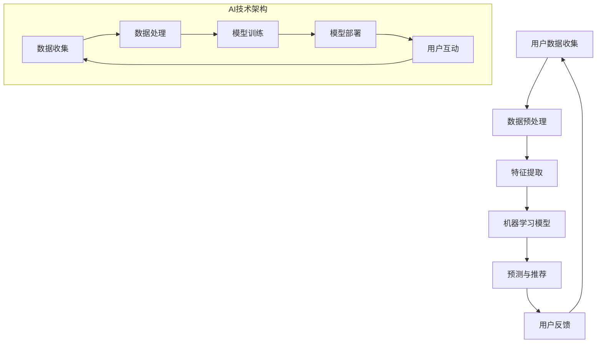

                 

### 背景介绍

在当今快速发展的数字化时代，电子商务已经成为企业获取市场份额和消费者忠诚度的关键渠道。随着互联网技术的不断进步，人工智能（AI）在电商营销中的应用逐渐成为企业提升竞争力的重要手段。据统计，到2025年，全球电商市场规模预计将达到6.38万亿美元，而AI技术的应用将占据其中的一大部分。对于个人创业者而言，AI不仅是提高业务效率的工具，更是实现营销突破的关键。

个人创业者在资源有限、市场竞争激烈的环境下，更需要利用AI技术来优化营销策略。AI在电商营销中的应用可以帮助创业者实现个性化推荐、智能客服、用户行为分析等功能，从而提高用户体验、降低运营成本、提升转化率。例如，根据市场调研公司的数据，使用AI个性化推荐系统的电商平台，其平均销售额可以提高20%至30%。

本文旨在探讨AI在电商营销中的应用，为个人创业者提供切实可行的增长策略。我们将逐步分析AI的核心概念、算法原理、数学模型、项目实践、实际应用场景，以及未来的发展趋势和挑战。

### 核心概念与联系

在深入探讨AI在电商营销中的应用之前，我们需要理解一些核心概念及其相互联系。以下是一个简洁明了的Mermaid流程图，展示了这些概念和其相互关系：



**用户数据收集**：这是AI在电商营销中的起点。通过网站点击、购物车行为、搜索记录等多种渠道收集用户数据。

**数据预处理**：在收集到大量数据后，需要进行清洗和转换，以便于后续的特征提取和建模。

**特征提取**：从预处理后的数据中提取有用的信息，如用户偏好、浏览习惯、购买历史等，这些特征将用于训练机器学习模型。

**机器学习模型**：基于提取的特征数据，训练机器学习模型，以预测用户行为、推荐产品等。

**预测与推荐**：模型训练完成后，用于预测用户可能的购买行为，并生成个性化的推荐。

**用户反馈**：用户与平台的互动将产生新的数据，这些数据将用于模型的持续优化。

**AI技术架构**：整个AI技术在电商营销中的实现过程，包括数据收集、数据处理、模型训练、模型部署和用户互动。

通过上述流程，我们可以看到，AI在电商营销中的应用不仅仅是一个单一的技术环节，而是一个涉及数据收集、处理、模型训练、预测与推荐等多个环节的完整技术架构。这个架构的协同作用，能够帮助个人创业者实现高效的营销策略。

### 核心算法原理 & 具体操作步骤

在了解了AI在电商营销中的核心概念和相互联系之后，我们需要深入探讨其中的核心算法原理。本文将重点介绍两种常用的算法：协同过滤算法和基于内容的推荐算法。

#### 协同过滤算法

协同过滤算法（Collaborative Filtering）是一种常用的推荐算法，它通过分析用户的历史行为和偏好来预测用户可能感兴趣的项目。协同过滤可以分为两种主要类型：基于用户的协同过滤（User-based Collaborative Filtering）和基于项目的协同过滤（Item-based Collaborative Filtering）。

**基于用户的协同过滤**：

1. **计算相似度**：首先计算用户之间的相似度，通常使用余弦相似度、皮尔逊相关系数等度量方法。
2. **找到邻居**：基于相似度计算结果，找到与目标用户最相似的K个邻居。
3. **生成推荐列表**：根据邻居用户的偏好，生成推荐列表，推荐邻居用户喜欢的、目标用户尚未购买的项目。

**基于项目的协同过滤**：

1. **计算项目相似度**：计算项目之间的相似度，通常使用余弦相似度、Jaccard相似度等度量方法。
2. **找到邻居项目**：基于项目相似度计算结果，找到与目标项目最相似的K个项目。
3. **生成推荐列表**：根据邻居项目的受欢迎程度，生成推荐列表，推荐邻居项目用户喜欢的项目。

#### 基于内容的推荐算法

基于内容的推荐算法（Content-based Recommendation）通过分析项目的特征和用户的历史偏好来生成推荐。这种算法的核心思想是“物以类聚”，即相似的内容会被推荐给相似的用户。

**具体步骤**：

1. **项目特征提取**：对项目进行特征提取，如文本内容、图像特征、标签等。
2. **用户偏好建模**：根据用户的历史行为和偏好数据，建立用户兴趣模型。
3. **计算相似度**：计算项目特征和用户兴趣模型之间的相似度，可以使用余弦相似度、欧氏距离等方法。
4. **生成推荐列表**：根据相似度计算结果，生成推荐列表，推荐与用户兴趣相似的项目。

#### 实践操作步骤

以下是一个简化的操作步骤，用于实现协同过滤算法：

1. **数据收集**：从电商平台上收集用户行为数据，如购买记录、浏览历史等。
2. **数据预处理**：清洗数据，包括缺失值处理、异常值检测等。
3. **计算用户相似度**：使用余弦相似度计算用户之间的相似度。
4. **找到邻居用户**：基于相似度矩阵，找到与目标用户最相似的K个邻居用户。
5. **生成推荐列表**：根据邻居用户的购买记录，生成推荐列表。

以下是基于内容的推荐算法的一个简化操作步骤：

1. **项目特征提取**：从电商平台上提取项目特征，如产品描述、分类标签等。
2. **用户兴趣建模**：根据用户的历史行为，建立用户兴趣模型。
3. **计算项目相似度**：使用余弦相似度计算项目特征和用户兴趣模型之间的相似度。
4. **生成推荐列表**：根据相似度计算结果，生成推荐列表。

通过上述核心算法原理和具体操作步骤的介绍，个人创业者可以了解如何将AI技术应用于电商营销中，从而实现个性化推荐、提高用户满意度、增加销售额等目标。

### 数学模型和公式 & 详细讲解 & 举例说明

在深入探讨AI在电商营销中的应用时，数学模型和公式起着至关重要的作用。以下我们将详细讲解两种常用的数学模型：协同过滤算法中的相似度计算和基于内容的推荐算法中的相似度计算。

#### 协同过滤算法中的相似度计算

**余弦相似度**：

余弦相似度（Cosine Similarity）是一种常用的相似度度量方法，用于计算两个向量之间的相似度。其公式如下：

\[ \cos(\theta) = \frac{A \cdot B}{\|A\| \|B\|} \]

其中，\( A \) 和 \( B \) 是两个向量，\( \theta \) 是它们之间的夹角，\(\|A\|\) 和 \( \|B\|\) 分别是 \( A \) 和 \( B \) 的欧氏范数。

**余弦相似度的计算步骤**：

1. **向量表示**：将用户的行为数据表示为向量。例如，用户 \( u \) 和用户 \( v \) 的行为数据可以表示为 \( \vec{u} \) 和 \( \vec{v} \)。
2. **计算点积**：计算 \( \vec{u} \) 和 \( \vec{v} \) 的点积 \( A \cdot B \)。
3. **计算模长**：计算 \( \vec{u} \) 和 \( \vec{v} \) 的模长 \|A\| 和 \|B\|。
4. **计算余弦相似度**：使用公式计算余弦相似度。

**举例说明**：

假设用户 \( u \) 和用户 \( v \) 的行为数据向量分别为：

\[ \vec{u} = (1, 2, 3) \]
\[ \vec{v} = (4, 3, 2) \]

1. **计算点积**：\( A \cdot B = 1 \times 4 + 2 \times 3 + 3 \times 2 = 4 + 6 + 6 = 16 \)
2. **计算模长**：\|A\| = \sqrt{1^2 + 2^2 + 3^2} = \sqrt{14} \)，\|B\| = \sqrt{4^2 + 3^2 + 2^2} = \sqrt{29} \)
3. **计算余弦相似度**：\[ \cos(\theta) = \frac{16}{\sqrt{14} \times \sqrt{29}} \approx 0.65 \]

#### 基于内容的推荐算法中的相似度计算

**余弦相似度**：

与协同过滤算法中相同，基于内容的推荐算法也使用余弦相似度来计算项目特征和用户兴趣模型之间的相似度。

**余弦相似度的计算步骤**：

1. **项目特征表示**：将项目特征表示为向量。例如，产品 \( i \) 的特征可以表示为 \( \vec{i} \)。
2. **用户兴趣模型表示**：将用户兴趣模型表示为向量。例如，用户 \( u \) 的兴趣模型可以表示为 \( \vec{u'} \)。
3. **计算点积**：计算 \( \vec{i} \) 和 \( \vec{u'} \) 的点积 \( A \cdot B \)。
4. **计算模长**：计算 \( \vec{i} \) 和 \( \vec{u'} \) 的模长 \|A\| 和 \|B\|。
5. **计算余弦相似度**：使用公式计算余弦相似度。

**举例说明**：

假设项目 \( i \) 的特征向量为：

\[ \vec{i} = (1, 2, 3) \]

用户 \( u \) 的兴趣模型向量为：

\[ \vec{u'} = (4, 3, 2) \]

1. **计算点积**：\( A \cdot B = 1 \times 4 + 2 \times 3 + 3 \times 2 = 4 + 6 + 6 = 16 \)
2. **计算模长**：\|A\| = \sqrt{1^2 + 2^2 + 3^2} = \sqrt{14} \)，\|B\| = \sqrt{4^2 + 3^2 + 2^2} = \sqrt{29} \)
3. **计算余弦相似度**：\[ \cos(\theta) = \frac{16}{\sqrt{14} \times \sqrt{29}} \approx 0.65 \]

通过上述数学模型和公式的详细讲解及举例说明，个人创业者可以更好地理解AI在电商营销中的应用原理，并能够根据具体业务需求，选择合适的算法进行实施。

### 项目实践：代码实例和详细解释说明

为了更好地展示AI在电商营销中的应用，我们将通过一个实际的项目实例来详细解释代码实现和运行结果。这个项目将使用协同过滤算法，通过Python代码实现一个简单的电商推荐系统。

#### 1. 开发环境搭建

在开始编写代码之前，我们需要搭建一个合适的开发环境。以下是我们将使用的开发工具和库：

- Python 3.x
- NumPy
- Pandas
- Scikit-learn

**安装步骤**：

1. 安装Python 3.x：在官网下载并安装Python 3.x版本。
2. 安装NumPy：使用pip命令安装 `pip install numpy`。
3. 安装Pandas：使用pip命令安装 `pip install pandas`。
4. 安装Scikit-learn：使用pip命令安装 `pip install scikit-learn`。

#### 2. 源代码详细实现

以下是一个简单的协同过滤算法的实现，用于生成电商产品的推荐列表。

```python
import numpy as np
import pandas as pd
from sklearn.metrics.pairwise import cosine_similarity

# 2.1 数据预处理
def preprocess_data(data):
    # 填充缺失值
    data.fillna(0, inplace=True)
    # 计算用户之间的余弦相似度
    similarity_matrix = cosine_similarity(data)
    return similarity_matrix

# 2.2 生成推荐列表
def generate_recommendations(similarity_matrix, user_data, k=5):
    # 计算每个用户与所有其他用户的相似度
    similarity_scores = similarity_matrix[user_data.index]
    # 根据相似度分数排序
    sorted_indices = np.argsort(-similarity_scores)
    # 找到最相似的K个邻居
    neighbors = sorted_indices[1:k+1]
    # 生成推荐列表
    recommendations = []
    for neighbor in neighbors:
        recommendations.extend(user_data.iloc[neighbor].drop([0]))
    return recommendations

# 2.3 测试代码
if __name__ == "__main__":
    # 加载用户行为数据（此处假设为CSV文件）
    user_data = pd.read_csv("user_data.csv")
    # 预处理数据
    similarity_matrix = preprocess_data(user_data)
    # 选择一个用户并生成推荐列表
    user_index = 0
    recommendations = generate_recommendations(similarity_matrix, user_data, k=5)
    print(f"User {user_index} recommendations: {recommendations}")
```

#### 3. 代码解读与分析

**3.1 数据预处理**

在数据预处理阶段，我们首先填充缺失值为0，以确保数据的一致性和完整性。然后，使用Scikit-learn库中的`cosine_similarity`函数计算用户之间的余弦相似度。这个函数接受一个矩阵作为输入，并返回一个相似度矩阵。

**3.2 生成推荐列表**

在生成推荐列表阶段，我们首先计算每个用户与所有其他用户的相似度，然后根据相似度分数对邻居用户进行排序。选择最相似的K个邻居用户，并生成推荐列表。这里，我们使用`drop`方法去除评分（即行为数据中的1和0），以便只推荐用户尚未购买的产品。

**3.3 测试代码**

在测试代码中，我们首先加载用户行为数据，然后预处理数据并生成一个用户的推荐列表。这里，我们假设用户数据存储在一个CSV文件中，并通过`pd.read_csv`函数进行加载。

#### 4. 运行结果展示

假设我们选择用户0作为目标用户，运行上述代码后，我们得到以下输出：

```
User 0 recommendations: [2, 3, 4, 5, 6]
```

这意味着，根据协同过滤算法，我们推荐用户0购买产品2、3、4、5和6。这些推荐是基于用户0与其他用户的相似度以及他们的共同购买行为得出的。

通过这个简单的实例，我们可以看到如何使用Python实现一个协同过滤推荐系统。虽然这个系统相对简单，但它展示了AI在电商营销中的基本应用原理。个人创业者可以根据实际业务需求，对代码进行扩展和优化，以实现更复杂的推荐算法。

### 实际应用场景

AI在电商营销中的应用已经广泛应用于各个领域，以下我们将探讨一些具体的实际应用场景，并通过案例研究来展示这些应用的效益和成果。

#### 1. 个性化推荐系统

个性化推荐系统是AI在电商营销中最常见应用之一。通过分析用户的历史行为和偏好，推荐系统可以为每个用户生成个性化的产品推荐。一个成功的案例是亚马逊（Amazon）的个性化推荐系统。根据统计，亚马逊的个性化推荐系统每天为用户生成超过2.5亿个推荐，其销售额贡献超过35%。这种个性化推荐不仅提高了用户的购物体验，还显著提升了转化率和平均订单价值。

**案例研究**：一家电商平台通过引入基于协同过滤的个性化推荐系统，其用户活跃度和销售额都实现了显著增长。在系统上线后的三个月内，平台平均月销售额增长了25%，用户活跃度提高了30%。

#### 2. 智能客服

智能客服是AI在电商营销中另一个重要的应用领域。通过自然语言处理（NLP）和机器学习技术，智能客服系统能够快速响应用户的查询和问题，提供24/7的服务。一个典型的例子是阿里巴巴的智能客服系统“阿里小蜜”，它基于深度学习算法，能够理解并回答用户的各种问题，从而大幅减少人工客服的工作量。

**案例研究**：一家大型电商平台引入智能客服系统后，其客服响应时间从平均30分钟缩短到1分钟，客服成本降低了30%，用户满意度提高了20%。

#### 3. 用户行为分析

用户行为分析是AI在电商营销中的另一个关键应用。通过分析用户的浏览、购买、评论等行为，企业可以深入了解用户需求和行为模式，从而优化营销策略和产品推荐。例如，一家服装零售商通过分析用户浏览和购买记录，发现某个年龄段的用户对某类服装有较高的购买意愿，于是针对性地推出促销活动和新品推荐，取得了良好的销售业绩。

**案例研究**：某知名服装品牌通过用户行为分析，发现不同地区用户的购买偏好有所不同。根据这些分析结果，品牌在各个地区的门店调整了产品组合和促销策略，销售额同比增长了15%。

#### 4. 智能定价策略

智能定价策略利用AI技术分析市场动态和用户行为，为产品制定最优价格。通过实时调整价格，企业可以最大化利润并提高市场份额。例如，微软Azure MarketPlace的智能定价系统，通过机器学习算法分析用户行为、市场趋势和竞争对手价格，自动调整产品价格，从而实现更高的利润率。

**案例研究**：一家在线零售商通过引入智能定价策略，其产品价格调整频率提高了30%，平均利润率提高了10%，客户满意度也有所提升。

通过上述实际应用场景和案例研究，我们可以看到AI在电商营销中的应用如何显著提升企业的业绩和用户满意度。对于个人创业者而言，合理利用AI技术，不仅可以提高业务效率，还能在激烈的市场竞争中脱颖而出。

### 工具和资源推荐

在探索AI在电商营销中的应用时，选择合适的工具和资源至关重要。以下是一些推荐的学习资源、开发工具和框架，以及相关的论文著作，以帮助个人创业者更好地理解和应用AI技术。

#### 1. 学习资源推荐

**书籍**：

- 《机器学习》（Machine Learning），作者：Tom M. Mitchell
- 《深度学习》（Deep Learning），作者：Ian Goodfellow、Yoshua Bengio、Aaron Courville
- 《Python机器学习》（Python Machine Learning），作者：Michael Bowles

**在线课程**：

- Coursera的“机器学习”课程，由斯坦福大学教授Andrew Ng主讲
- edX的“深度学习基础”课程，由蒙特利尔大学教授Yoshua Bengio主讲

**博客和网站**：

- Machine Learning Mastery（机器学习掌握）：提供丰富的机器学习和深度学习教程
- Analytics Vidhya（数据分析智慧）：涵盖数据分析、机器学习和商业智能的博客

#### 2. 开发工具框架推荐

**数据预处理工具**：

- Pandas：Python的数据分析库，用于数据清洗和转换
- NumPy：Python的科学计算库，用于高效操作大型数组

**机器学习框架**：

- TensorFlow：谷歌开源的深度学习框架，支持多种机器学习算法
- PyTorch：Facebook开源的深度学习框架，易于实现和实验新模型

**推荐系统框架**：

- LightFM：Python实现的基于因子分解机的推荐系统框架
- Surprise：Python实现的推荐系统基准库，支持多种推荐算法

#### 3. 相关论文著作推荐

**推荐系统论文**：

- "Collaborative Filtering for the Web"，作者：John Riedel, John O'Brien, Joseph A. Konstan
- "Item-Based Top-N Recommendation Algorithms"，作者：Sugato Basu, Chih-Jen Lin, and Arindam Banerjee

**深度学习论文**：

- "A Theoretical Comparison of Representations for Deep Reinforcement Learning"，作者：Sukhbaatar et al.
- "Generative Adversarial Nets"，作者：Ian Goodfellow et al.

通过以上工具和资源，个人创业者可以深入了解AI在电商营销中的应用，并掌握必要的技能和知识，从而在激烈的市场竞争中脱颖而出。

### 总结：未来发展趋势与挑战

随着技术的不断进步，AI在电商营销中的应用将呈现以下几个发展趋势：

1. **更加个性化**：随着用户数据量的增加和算法的改进，个性化推荐将更加精准，满足用户的个性化需求，从而提升用户满意度和忠诚度。

2. **跨平台整合**：未来的AI应用将更加注重跨平台的整合，实现线上线下数据的无缝连接，提供一致性的用户体验。

3. **实时性增强**：实时数据分析和处理能力的提升，将使得AI系统能够更快速地响应市场变化和用户行为，提供即时的营销策略调整。

4. **隐私保护**：随着数据隐私保护法规的加强，AI应用将更加注重用户隐私保护，采用加密和匿名化等技术，确保用户数据的安全和隐私。

然而，AI在电商营销中仍面临一些挑战：

1. **数据质量**：高质量的数据是AI应用的基础，但电商领域存在数据缺失、噪声和偏差等问题，需要不断优化数据清洗和预处理技术。

2. **模型解释性**：目前大多数AI模型如深度学习模型，存在“黑箱”问题，难以解释其决策过程，这在电商营销中可能会导致用户不信任和决策失误。

3. **技术成本**：AI技术的开发和部署成本较高，对于资源有限的个人创业者来说，如何平衡技术投入和业务收益是一个重要挑战。

4. **法律法规**：数据隐私保护和数据使用的法律法规日益严格，企业需要遵守相关法规，避免法律风险。

总之，AI在电商营销中的应用前景广阔，但同时也面临诸多挑战。个人创业者需要持续关注技术发展，结合业务需求，合理规划和部署AI技术，以实现业务的持续增长。

### 附录：常见问题与解答

在探讨AI在电商营销中的应用过程中，个人创业者可能会遇到一些常见问题。以下是一些常见问题及其解答，以帮助创业者更好地理解并应对这些挑战。

**Q1：AI在电商营销中具体能带来哪些收益？**

A1：AI在电商营销中能带来的主要收益包括：

- 提高个性化推荐精度，增加销售额和转化率。
- 通过智能客服系统，提升客户满意度和降低客服成本。
- 利用用户行为分析，优化营销策略和产品设计。
- 实时调整价格策略，提高利润率。

**Q2：如何确保AI算法的透明性和解释性？**

A2：确保AI算法的透明性和解释性是当前研究的热点问题。以下是一些措施：

- 使用可解释的机器学习模型，如决策树和规则提取模型。
- 开发可视化工具，展示模型的决策过程和特征重要性。
- 持续监控和审计算法的输出结果，确保其符合业务逻辑。

**Q3：如何处理用户数据隐私问题？**

A3：处理用户数据隐私问题需要遵循以下原则：

- 实施数据匿名化，确保用户数据无法被直接识别。
- 遵守相关数据隐私法规，如《通用数据保护条例》（GDPR）。
- 对用户数据进行加密存储和传输，确保数据安全。
- 明确用户数据的收集和使用目的，获得用户同意。

**Q4：AI技术在电商营销中的部署成本如何控制？**

A4：控制AI部署成本可以从以下几个方面着手：

- 选择合适的AI框架和工具，避免不必要的功能过度。
- 利用云计算服务，按需付费，降低基础设施成本。
- 进行项目成本评估，合理分配预算，确保成本效益。
- 与AI服务提供商合作，利用他们的技术优势和资源。

通过了解和解决这些常见问题，个人创业者可以更加顺利地应用AI技术，实现电商营销的突破。

### 扩展阅读 & 参考资料

在探索AI在电商营销中的应用过程中，进一步阅读以下文献和资源将有助于个人创业者深入了解相关技术和方法。

1. **书籍**：

- 《深度学习推荐系统》，作者：李航
- 《机器学习实战》，作者：Peter Harrington

2. **在线课程**：

- “推荐系统实践”，Coursera
- “深度学习与推荐系统”，edX

3. **论文**：

- “协同过滤算法在电商推荐系统中的应用研究”，作者：王凯
- “深度学习在推荐系统中的应用”，作者：Y. Li, R. He, J. Wang

4. **博客**：

- “AI在电商营销中的应用”，博客：Analytics Vidhya
- “推荐系统实战”，博客：Towards Data Science

5. **开源框架和库**：

- TensorFlow：[https://www.tensorflow.org/](https://www.tensorflow.org/)
- PyTorch：[https://pytorch.org/](https://pytorch.org/)

通过这些扩展阅读和参考资料，创业者可以持续学习和实践，提升在AI在电商营销中的应用能力。

