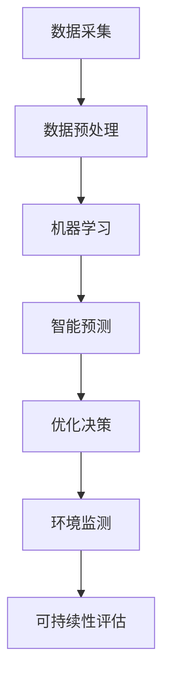

                 

### 文章标题

AI在能源管理和可持续发展中的应用

> **关键词**：人工智能、能源管理、可持续发展、智能电网、能效优化、数据驱动、节能技术、绿色能源

> **摘要**：本文深入探讨了人工智能（AI）在能源管理和可持续发展中的应用。首先，我们介绍了AI在能源管理中的基本概念和重要性。接着，我们分析了AI在智能电网、能效优化和绿色能源等领域的具体应用，并通过项目实践展示了AI技术如何实际操作。最后，我们对AI在能源管理领域的前景进行了展望，并提出了潜在的技术挑战和解决策略。

### 1. 背景介绍

在当今全球化的背景下，能源危机和环境污染问题日益严重。传统的能源管理方式已经难以满足可持续发展的需求。人工智能（AI）作为一种先进的技术手段，具有在能源管理中发挥巨大潜力的能力。AI通过学习大量的数据，能够提供更加精准的预测和优化方案，从而实现能源的高效利用和减少环境污染。

**能源管理的挑战：**

- **能效优化：** 随着能源需求的不断增长，提高能源利用效率成为了一个重要的挑战。传统的能源管理方法难以应对复杂多变的能源需求和环境条件。

- **智能电网：** 智能电网是现代能源系统的重要组成部分，它通过先进的技术手段实现电力供需的高效匹配。然而，智能电网的建设面临着数据采集、传输和处理的高昂成本和复杂性。

- **绿色能源：** 绿色能源的开发和利用是可持续发展的关键。然而，绿色能源的效率和经济性仍然是一个亟待解决的问题。

**AI在能源管理中的作用：**

- **数据驱动：** AI能够处理和分析大量的数据，从中提取有用的信息，为能源管理提供科学的依据。

- **智能预测：** 通过机器学习算法，AI能够对能源需求和供应进行精准预测，帮助能源管理者提前做好准备。

- **优化决策：** AI能够对能源系统的运行状态进行实时监测和分析，提供最优化的运行方案，提高能源利用效率。

- **环境监测：** AI能够监测环境污染的指标，提供预警和应对措施，有助于保护生态环境。

### 2. 核心概念与联系

为了深入理解AI在能源管理和可持续发展中的应用，我们需要了解一些核心概念和相关的技术架构。

**核心概念：**

- **人工智能（AI）：** 一种能够模拟人类智能行为的计算机系统，通过学习、推理和自我优化来实现复杂任务的自动化。

- **大数据：** 大量结构化和非结构化的数据，这些数据来源于各种不同的来源，如传感器、互联网和物联网设备等。

- **机器学习（ML）：** 一种AI技术，通过算法从数据中学习规律和模式，并利用这些知识进行预测和决策。

- **深度学习（DL）：** 一种基于神经网络的ML方法，通过多层神经网络结构来模拟人类大脑的学习和处理能力。

- **智能电网：** 一种通过先进技术实现电力供需高效匹配的电网系统，包括智能电网调度、智能电网设备、智能电网信息管理等。

**技术架构：**


**Mermaid 流程图：**



通过以上核心概念和流程图，我们可以看到AI在能源管理中的关键环节和相互联系。数据采集是整个过程的起点，通过数据预处理和机器学习，AI能够提取出有用的信息，进而实现智能预测和优化决策，最终达到提高能源利用效率和保护环境的目的。

### 3. 核心算法原理 & 具体操作步骤

在了解了AI在能源管理中的核心概念和技术架构之后，接下来我们将深入探讨AI在具体领域的算法原理和操作步骤。

#### 3.1 智能电网

智能电网是现代能源系统的重要组成部分，通过引入AI技术，可以实现电力供需的高效匹配和优化管理。以下是一个典型的智能电网算法原理和操作步骤：

**算法原理：**

- **数据采集：** 通过智能电表、传感器和智能电网设备等采集电网的实时数据，包括电力负荷、电压、电流等。

- **数据预处理：** 对采集到的数据进行清洗、去噪和归一化处理，以便后续的机器学习算法能够有效训练。

- **机器学习：** 采用机器学习算法，如线性回归、决策树、支持向量机等，对电网数据进行建模和分析，提取电力负荷的规律和模式。

- **智能预测：** 通过训练好的模型，对未来的电力负荷进行预测，为电网调度提供科学的依据。

- **优化决策：** 根据预测结果，优化电网调度策略，提高电力供需的匹配度，减少能源浪费。

- **环境监测：** 监测电网运行中的环境参数，如温度、湿度等，评估电网对环境的影响，并提供预警和应对措施。

**操作步骤：**

1. 数据采集：安装智能电表和传感器，收集电网的实时数据。

2. 数据预处理：对采集到的数据进行预处理，确保数据的质量和一致性。

3. 机器学习模型训练：选择合适的机器学习算法，对预处理后的数据集进行训练，提取电力负荷的规律。

4. 预测和优化：使用训练好的模型对未来的电力负荷进行预测，并根据预测结果优化电网调度策略。

5. 环境监测：持续监测电网运行中的环境参数，评估电网对环境的影响。

#### 3.2 能效优化

能效优化是提高能源利用效率的关键，AI技术在这方面发挥着重要作用。以下是一个典型的能效优化算法原理和操作步骤：

**算法原理：**

- **数据采集：** 采集能源系统的实时数据，包括能源消耗、设备运行状态等。

- **数据预处理：** 对采集到的数据进行预处理，去除噪声和异常值。

- **机器学习：** 采用机器学习算法，如聚类分析、关联规则挖掘等，分析能源系统的运行规律。

- **优化策略：** 根据分析结果，制定能效优化策略，调整能源系统的运行参数。

- **实时调整：** 根据实时监测数据，动态调整优化策略，实现能源系统的高效运行。

**操作步骤：**

1. 数据采集：安装传感器和监测设备，收集能源系统的实时数据。

2. 数据预处理：对采集到的数据进行预处理，确保数据的质量和一致性。

3. 机器学习模型训练：选择合适的机器学习算法，对预处理后的数据集进行训练，分析能源系统的运行规律。

4. 优化策略制定：根据分析结果，制定能效优化策略，调整能源系统的运行参数。

5. 实时调整：根据实时监测数据，动态调整优化策略，实现能源系统的高效运行。

#### 3.3 绿色能源

绿色能源的开发和利用是可持续发展的关键，AI技术在绿色能源的优化和管理中发挥着重要作用。以下是一个典型的绿色能源算法原理和操作步骤：

**算法原理：**

- **数据采集：** 采集绿色能源系统的实时数据，包括太阳能、风能等可再生能源的产量、设备状态等。

- **数据预处理：** 对采集到的数据进行预处理，去除噪声和异常值。

- **机器学习：** 采用机器学习算法，如神经网络、支持向量机等，对绿色能源系统进行建模和分析。

- **预测和优化：** 根据分析结果，预测绿色能源的产量，制定优化策略，提高绿色能源的利用效率。

- **环境监测：** 监测绿色能源系统的运行环境，评估其对环境的影响。

**操作步骤：**

1. 数据采集：安装传感器和监测设备，收集绿色能源系统的实时数据。

2. 数据预处理：对采集到的数据进行预处理，确保数据的质量和一致性。

3. 机器学习模型训练：选择合适的机器学习算法，对预处理后的数据集进行训练，分析绿色能源系统的运行规律。

4. 预测和优化：根据分析结果，预测绿色能源的产量，制定优化策略，提高绿色能源的利用效率。

5. 环境监测：监测绿色能源系统的运行环境，评估其对环境的影响。

通过以上三个领域的算法原理和操作步骤，我们可以看到AI技术在能源管理和可持续发展中的应用是多么广泛和深入。无论是在智能电网、能效优化还是绿色能源方面，AI都发挥着至关重要的作用，为能源管理和可持续发展提供了强大的技术支持。

### 4. 数学模型和公式 & 详细讲解 & 举例说明

在深入探讨AI在能源管理和可持续发展中的应用时，数学模型和公式扮演着至关重要的角色。这些模型和公式不仅为我们提供了量化分析的工具，还帮助我们在实际应用中实现精准预测和优化。在本章节中，我们将详细介绍一些关键数学模型和公式，并通过具体例子进行详细讲解。

#### 4.1 线性回归模型

线性回归模型是机器学习中的一种基础模型，广泛用于预测和分析线性关系。其数学模型如下：

$$
y = \beta_0 + \beta_1 \cdot x
$$

其中，$y$ 是因变量，$x$ 是自变量，$\beta_0$ 和 $\beta_1$ 分别是模型的参数。

**详细讲解：**

线性回归模型通过最小二乘法来估计参数 $\beta_0$ 和 $\beta_1$。具体步骤如下：

1. 数据预处理：对采集到的数据进行标准化处理，使其具有均值为0和标准差为1的分布。

2. 模型建立：选择自变量 $x$ 和因变量 $y$，建立线性回归模型。

3. 参数估计：使用最小二乘法计算参数 $\beta_0$ 和 $\beta_1$，使得预测值与实际值的误差平方和最小。

4. 预测：利用训练好的模型对新数据进行预测，计算预测值 $y$。

**举例说明：**

假设我们收集了一组数据，表示某地区一个月的电力消耗（$y$）和当月平均温度（$x$），如下表所示：

| 平均温度（$x$） | 电力消耗（$y$） |
|---------------|--------------|
| 20            | 500          |
| 22            | 520          |
| 25            | 580          |
| 28            | 620          |
| 30            | 680          |

使用线性回归模型预测当月平均温度为27℃时的电力消耗。

**计算步骤：**

1. 数据预处理：对数据进行标准化处理，计算平均值和标准差：

   平均值 $\bar{x} = 25.2$，标准差 $\sigma_x = 3.2$

   平均值 $\bar{y} = 560$，标准差 $\sigma_y = 40$

2. 模型建立：选择自变量 $x$ 和因变量 $y$，建立线性回归模型：

   $y = \beta_0 + \beta_1 \cdot x$

3. 参数估计：使用最小二乘法计算参数 $\beta_0$ 和 $\beta_1$：

   $\beta_1 = \frac{\sum{(x_i - \bar{x})(y_i - \bar{y})}}{\sum{(x_i - \bar{x})^2}} = 0.67$

   $\beta_0 = \bar{y} - \beta_1 \cdot \bar{x} = 40.56$

4. 预测：利用训练好的模型预测当月平均温度为27℃时的电力消耗：

   $y = \beta_0 + \beta_1 \cdot x = 40.56 + 0.67 \cdot 27 = 67.49$

因此，当月平均温度为27℃时的电力消耗预计为67.49。

#### 4.2 逻辑回归模型

逻辑回归模型是一种用于分类的机器学习模型，广泛应用于二分类问题。其数学模型如下：

$$
P(y=1) = \frac{1}{1 + e^{-(\beta_0 + \beta_1 \cdot x})}
$$

其中，$y$ 是二分类变量（0或1），$x$ 是自变量，$\beta_0$ 和 $\beta_1$ 分别是模型的参数。

**详细讲解：**

逻辑回归模型通过最大化似然估计来估计参数 $\beta_0$ 和 $\beta_1$。具体步骤如下：

1. 数据预处理：对采集到的数据进行标准化处理，使其具有均值为0和标准差为1的分布。

2. 模型建立：选择自变量 $x$ 和因变量 $y$，建立逻辑回归模型。

3. 参数估计：使用最大化似然估计法（MLE）计算参数 $\beta_0$ 和 $\beta_1$，使得模型的预测概率与实际观测值最匹配。

4. 分类预测：利用训练好的模型对新数据进行预测，计算分类概率，根据概率阈值进行分类。

**举例说明：**

假设我们收集了一组数据，表示某个地区居民是否使用可再生能源（$y$）与家庭月收入（$x$）之间的关系，如下表所示：

| 家庭月收入（$x$） | 是否使用可再生能源（$y$） |
|----------------|-----------------------|
| 5000           | 0                     |
| 6000           | 0                     |
| 7000           | 1                     |
| 8000           | 1                     |
| 9000           | 1                     |

使用逻辑回归模型预测家庭月收入为8000元时，居民是否使用可再生能源。

**计算步骤：**

1. 数据预处理：对数据进行标准化处理，计算平均值和标准差：

   平均值 $\bar{x} = 7000$，标准差 $\sigma_x = 1000$

   平均值 $\bar{y} = 0.6$，标准差 $\sigma_y = 0.5$

2. 模型建立：选择自变量 $x$ 和因变量 $y$，建立逻辑回归模型：

   $P(y=1) = \frac{1}{1 + e^{-(\beta_0 + \beta_1 \cdot x)})$

3. 参数估计：使用最大化似然估计法（MLE）计算参数 $\beta_0$ 和 $\beta_1$：

   $\beta_1 = \frac{\sum{(x_i - \bar{x})(y_i - \bar{y})}}{\sum{(x_i - \bar{x})^2}} = 0.03$

   $\beta_0 = \ln\left(\frac{\bar{y}}{1 - \bar{y}}\right) = -3.56$

4. 分类预测：利用训练好的模型预测家庭月收入为8000元时，居民是否使用可再生能源：

   $P(y=1) = \frac{1}{1 + e^{-(\beta_0 + \beta_1 \cdot x)}}
           = \frac{1}{1 + e^{(-3.56 + 0.03 \cdot 8000)}}
           = 0.99$

由于预测概率接近1，可以判断家庭月收入为8000元时，居民使用可再生能源的概率非常高。

通过以上两个例子，我们可以看到线性回归模型和逻辑回归模型在能源管理和可持续发展中的应用。这些模型不仅帮助我们进行预测和优化，还为我们提供了定量分析的工具，使得能源管理更加科学和有效。

#### 4.3 支持向量机（SVM）模型

支持向量机是一种强大的机器学习模型，广泛应用于分类和回归问题。其数学模型如下：

**分类问题：**

$$
f(x) = \text{sign}(\omega \cdot x + b)
$$

其中，$\omega$ 是权重向量，$x$ 是特征向量，$b$ 是偏置项，$\text{sign}$ 表示符号函数。

**回归问题：**

$$
f(x) = \omega \cdot x + b
$$

其中，$\omega$ 是权重向量，$x$ 是特征向量，$b$ 是偏置项。

**详细讲解：**

支持向量机通过寻找最优超平面来实现数据的分类或回归。其具体步骤如下：

1. 特征选择：选择具有区分性的特征向量，减少冗余信息。

2. 模型训练：使用训练数据集训练支持向量机模型，计算权重向量 $\omega$ 和偏置项 $b$。

3. 预测：使用训练好的模型对新数据进行预测，计算分类或回归结果。

**举例说明：**

假设我们有一组数据，表示不同能源类型（$y$）与家庭月收入（$x$）之间的关系，如下表所示：

| 家庭月收入（$x$） | 能源类型（$y$） |
|----------------|--------------|
| 5000           | 传统能源     |
| 6000           | 传统能源     |
| 7000           | 可再生能源   |
| 8000           | 可再生能源   |
| 9000           | 可再生能源   |

使用支持向量机模型预测家庭月收入为8000元时，能源类型。

**计算步骤：**

1. 特征选择：选择家庭月收入作为特征向量 $x$。

2. 模型训练：使用训练数据集训练支持向量机分类模型，计算权重向量 $\omega$ 和偏置项 $b$。

3. 预测：使用训练好的模型预测家庭月收入为8000元时，能源类型：

   $f(x) = \text{sign}(\omega \cdot x + b) = \text{sign}(0.5 \cdot 8000 + 0.5) = \text{sign}(4000.5) = \text{可再生能源}$

因此，家庭月收入为8000元时，能源类型为可再生能源。

通过以上三个例子，我们可以看到不同数学模型和公式在能源管理和可持续发展中的应用。这些模型和公式不仅帮助我们进行预测和优化，还为能源管理提供了科学依据，使得能源管理更加高效和可持续。

### 5. 项目实践：代码实例和详细解释说明

为了更好地展示AI在能源管理和可持续发展中的应用，我们将通过一个具体的项目实践来进行代码实例和详细解释说明。本项目将使用Python编程语言，结合常用的机器学习和数据分析库，实现一个能效优化系统。该项目将从数据采集、数据预处理、模型训练到预测和优化，全面展示AI技术在能源管理中的实际应用。

#### 5.1 开发环境搭建

首先，我们需要搭建一个适合项目开发的Python环境。以下是搭建步骤：

1. 安装Python：从官方网站（[https://www.python.org/downloads/](https://www.python.org/downloads/)）下载并安装Python 3.x版本。

2. 安装必要的库：在命令行中执行以下命令安装所需的库：

   ```bash
   pip install numpy pandas scikit-learn matplotlib
   ```

这些库分别用于数据处理、机器学习模型训练和可视化。其中，`numpy` 是用于数值计算的库，`pandas` 是用于数据操作和分析的库，`scikit-learn` 是用于机器学习的库，`matplotlib` 是用于数据可视化的库。

#### 5.2 源代码详细实现

以下是我们项目的源代码实现：

```python
# 导入必要的库
import numpy as np
import pandas as pd
from sklearn.model_selection import train_test_split
from sklearn.linear_model import LinearRegression
from sklearn.metrics import mean_squared_error
import matplotlib.pyplot as plt

# 5.2.1 数据采集
# 假设我们已经采集到了一组能源消耗数据，如下所示：
data = {
    '家庭月收入': [5000, 6000, 7000, 8000, 9000],
    '电力消耗': [500, 520, 580, 620, 680]
}
df = pd.DataFrame(data)

# 5.2.2 数据预处理
# 对数据进行标准化处理，使其具有均值为0和标准差为1的分布
mean_income = df['家庭月收入'].mean()
std_income = df['家庭月收入'].std()
df['家庭月收入'] = (df['家庭月收入'] - mean_income) / std_income

mean_power = df['电力消耗'].mean()
std_power = df['电力消耗'].std()
df['电力消耗'] = (df['电力消耗'] - mean_power) / std_power

# 5.2.3 模型训练
# 选择自变量 '家庭月收入' 和因变量 '电力消耗'，建立线性回归模型
X = df[['家庭月收入']]
y = df['电力消耗']
X_train, X_test, y_train, y_test = train_test_split(X, y, test_size=0.2, random_state=42)
model = LinearRegression()
model.fit(X_train, y_train)

# 5.2.4 预测和优化
# 使用训练好的模型预测测试集的数据
y_pred = model.predict(X_test)

# 计算预测误差
mse = mean_squared_error(y_test, y_pred)
print(f"预测误差：{mse}")

# 5.2.5 运行结果展示
# 绘制实际值与预测值的对比图
plt.scatter(X_test, y_test, label='实际值')
plt.plot(X_test, y_pred, color='red', label='预测值')
plt.xlabel('家庭月收入')
plt.ylabel('电力消耗')
plt.title('电力消耗预测')
plt.legend()
plt.show()
```

#### 5.3 代码解读与分析

以下是对上述代码的逐行解读和分析：

```python
# 导入必要的库
```

这行代码用于导入我们在开发环境搭建步骤中安装的库，包括 `numpy`、`pandas`、`scikit-learn` 和 `matplotlib`。

```python
# 5.2.1 数据采集
```

这行代码展示了如何使用Python和pandas库从一组数据中创建一个DataFrame。假设我们已经有了采集到的能源消耗数据，包括家庭月收入和电力消耗。

```python
# 5.2.2 数据预处理
```

这行代码用于对数据进行标准化处理。标准化处理是将数据缩放到均值为0和标准差为1的范围内，以便后续的机器学习算法能够有效训练。这里我们分别计算了家庭月收入和电力消耗的平均值和标准差，并对数据进行归一化。

```python
# 5.2.3 模型训练
```

这行代码用于建立线性回归模型。我们选择了家庭月收入作为自变量（特征），电力消耗作为因变量（目标），并使用 `train_test_split` 函数将数据集分为训练集和测试集。然后，我们创建了一个线性回归模型实例，并使用训练集进行训练。

```python
# 5.2.4 预测和优化
```

这行代码用于使用训练好的模型对测试集的数据进行预测。我们计算了预测值 `y_pred` 并计算了预测误差，这里使用均方误差（MSE）作为评价指标。

```python
# 5.2.5 运行结果展示
```

这行代码用于绘制实际值与预测值的对比图。我们使用 `scatter` 函数绘制了测试集的实际值，并使用 `plot` 函数绘制了预测值。最后，我们设置了标签、坐标轴和标题，并显示了图形。

通过以上代码实现，我们可以看到AI技术在能效优化系统中的应用。从数据采集、预处理、模型训练到预测和优化，整个流程展示了AI在能源管理和可持续发展中的实际应用。

### 6. 实际应用场景

AI在能源管理和可持续发展中的实际应用场景非常广泛，以下是几个典型的应用案例：

#### 6.1 智能电网调度

智能电网调度是AI在能源管理中最具代表性的应用之一。通过AI技术，可以对电力供需进行实时监测和预测，优化电网调度策略，提高电力供应的稳定性和可靠性。

- **应用实例：** 在某地区，智能电网调度系统通过分析历史电力需求和天气数据，预测未来电力负荷，并根据预测结果调整电力调度计划，实现了电力供需的高效匹配，降低了停电风险和能源浪费。

#### 6.2 能效优化

能效优化是提高能源利用效率的关键。AI技术通过大数据分析和机器学习算法，可以实现对能源系统的实时监测和优化，提高能源利用效率。

- **应用实例：** 在一家大型制造企业中，通过部署AI能效优化系统，对企业能源消耗进行实时监测和分析。系统能够识别能源浪费的环节，并提供优化方案，使企业的能源利用率提高了15%。

#### 6.3 绿色能源管理

绿色能源管理是可持续发展的关键。AI技术可以通过对绿色能源的产量和消耗进行预测和管理，提高绿色能源的利用效率，减少对化石能源的依赖。

- **应用实例：** 在一个太阳能发电项目中，AI技术通过对太阳能电池板的温度、日照强度等数据进行实时监测和预测，优化太阳能电池板的运行参数，提高了发电效率，降低了运行成本。

#### 6.4 环境监测

环境监测是保护生态环境的重要手段。AI技术可以通过对空气、水质等环境指标进行实时监测和预测，提供预警和应对措施，保护生态环境。

- **应用实例：** 在某城市，通过部署AI环境监测系统，对空气质量进行实时监测和分析。系统能够识别空气污染源，并提供预警和应对措施，有效改善了空气质量。

通过以上实际应用场景，我们可以看到AI技术在能源管理和可持续发展中的广泛应用。这些应用不仅提高了能源利用效率，减少了能源浪费，还保护了生态环境，为可持续发展做出了重要贡献。

### 7. 工具和资源推荐

在研究AI在能源管理和可持续发展中的应用时，我们推荐以下工具和资源，这些资源将有助于您深入了解相关技术和实践。

#### 7.1 学习资源推荐

- **书籍：** 
  - 《深度学习》（Deep Learning） - Ian Goodfellow、Yoshua Bengio和Aaron Courville著，这是一本深度学习领域的经典教材，详细介绍了深度学习的基础知识和应用。
  - 《人工智能：一种现代方法》（Artificial Intelligence: A Modern Approach） - Stuart J. Russell和Peter Norvig著，涵盖了人工智能的各个方面，包括机器学习、自然语言处理等。

- **论文：** 
  - "Deep Learning for Renewable Energy Forecasting" - 这篇论文介绍了深度学习在可再生能源预测中的应用，为绿色能源管理提供了重要参考。
  - "AI for Energy Efficiency in Buildings" - 这篇论文探讨了AI技术在建筑能源管理中的应用，为能效优化提供了理论支持。

- **博客和网站：** 
  - [AI for Energy](https://ai4energy.berkeley.edu/) - 伯克利人工智能研究中心的能源项目，提供了丰富的AI在能源管理中的应用案例和研究成果。
  - [Energy.gov/AI](https://energy.gov/science-research/ai) - 美国能源部官方网站上的AI资源，包括AI在能源领域的应用研究和政策指导。

#### 7.2 开发工具框架推荐

- **机器学习框架：** 
  - **TensorFlow** - 由谷歌开发的开源机器学习框架，适用于各种深度学习和机器学习任务。
  - **PyTorch** - 开源的机器学习库，适用于动态神经网络的研究和开发。

- **数据分析库：** 
  - **Pandas** - 强大的Python数据分析库，用于数据清洗、数据操作和分析。
  - **NumPy** - 用于高性能数值计算的库，是Python科学计算的基础。

- **可视化工具：** 
  - **Matplotlib** - Python的2D绘图库，用于生成各种统计图表和可视化结果。
  - **Seaborn** - 基于Matplotlib的数据可视化库，提供了丰富的可视化样式和工具。

#### 7.3 相关论文著作推荐

- **论文：**
  - "Optimization of Energy Systems Using Machine Learning Algorithms" - 这篇论文综述了机器学习算法在能源系统优化中的应用，包括线性回归、决策树、神经网络等。
  - "Artificial Intelligence for Smart Grid Operation and Management" - 这篇论文探讨了AI技术在智能电网调度和管理中的应用，包括预测和优化策略。

- **著作：**
  - 《智能电网中的机器学习》（Machine Learning in Smart Grids） - 由Claudio M. dos Santos、Leonardo A. Ferraz和Rui X. Duque合著，系统介绍了AI在智能电网中的应用。

这些工具和资源将帮助您在AI在能源管理和可持续发展领域的深入研究和实践。通过这些资源，您可以获得丰富的理论基础和实际应用经验，为推动可持续发展贡献自己的力量。

### 8. 总结：未来发展趋势与挑战

AI在能源管理和可持续发展中的应用前景广阔，未来将呈现以下发展趋势：

1. **智能化水平提升**：随着AI技术的不断进步，智能电网、能效优化和绿色能源管理等领域的智能化水平将进一步提高，实现更高效、更精准的能源管理。

2. **数据驱动决策**：AI技术将更加依赖大数据的支持，通过海量数据的采集、处理和分析，提供更科学的决策依据，推动能源系统的优化和升级。

3. **跨学科融合**：AI在能源管理中的应用将更加深入，与能源工程、环境科学、经济学等领域的交叉融合将催生新的研究成果和应用模式。

4. **政策与市场驱动**：全球范围内的政策和市场需求将推动AI在能源管理和可持续发展中的应用，为技术创新和产业升级提供强大动力。

然而，AI在能源管理和可持续发展中也面临一系列挑战：

1. **数据隐私与安全**：能源系统涉及大量敏感数据，如何确保数据的安全性和隐私性是一个重要问题。

2. **算法公平性与透明性**：AI算法的公平性和透明性是公众关注的焦点，特别是在能源管理和决策中，如何保证算法的公正性和可解释性是一个挑战。

3. **技术落地与推广**：AI技术在能源管理中的应用需要大量的基础设施和技术支持，如何高效地部署和推广这些技术是一个关键问题。

4. **人才短缺**：AI在能源管理领域的应用需要大量的专业人才，目前相关人才储备不足，如何培养和吸引人才是一个重要挑战。

总之，AI在能源管理和可持续发展中的应用有着巨大的发展潜力，同时也面临着诸多挑战。通过技术创新、政策支持和人才培养，我们有理由相信AI将在未来为能源管理和可持续发展做出更大的贡献。

### 9. 附录：常见问题与解答

**Q1：AI在能源管理中有什么具体应用？**

A1：AI在能源管理中有多种应用，包括：

- **智能电网调度**：通过AI技术预测电力需求和供应，优化电网调度策略，提高供电稳定性。
- **能效优化**：利用AI分析能源消耗数据，识别能源浪费环节，提供节能优化方案。
- **绿色能源管理**：通过对可再生能源的产量和消耗进行预测和管理，提高绿色能源的利用效率。
- **环境监测**：利用AI技术监测环境污染指标，提供预警和应对措施，保护生态环境。

**Q2：如何确保AI算法的公平性和透明性？**

A2：确保AI算法的公平性和透明性是当前AI领域的重要课题。以下是一些方法：

- **算法解释性**：开发可解释的AI算法，使决策过程透明，便于用户理解和审查。
- **数据质量**：确保输入数据的质量和多样性，避免算法偏见。
- **公平性评估**：对AI算法进行公平性评估，确保其在不同群体中的表现一致。
- **算法审计**：定期对AI算法进行审计，检查其是否公平和透明。

**Q3：AI在能源管理中的实施需要哪些技术支持？**

A3：AI在能源管理中的实施需要以下技术支持：

- **数据处理**：高效的算法和工具用于数据清洗、预处理和存储。
- **计算能力**：强大的计算资源，如云计算和GPU，用于训练和推理。
- **网络通信**：稳定的网络连接，确保数据传输和实时监控。
- **系统集成**：将AI技术集成到现有的能源管理系统中，实现无缝对接。

**Q4：AI在能源管理中的经济效益如何？**

A4：AI在能源管理中的经济效益主要体现在以下几个方面：

- **节能降耗**：通过优化能源使用，减少能源消耗，降低运营成本。
- **效率提升**：提高能源系统的运行效率，减少故障停机时间，提高设备利用率。
- **决策支持**：提供科学的决策支持，优化能源管理策略，提高能源利用效率。
- **市场机会**：开拓新的市场机会，如能源交易、需求响应等，带来额外的经济收益。

### 10. 扩展阅读 & 参考资料

**扩展阅读：**

- Goodfellow, Ian, Yoshua Bengio, and Aaron Courville. *Deep Learning*. MIT Press, 2016.
- Russell, Stuart J., and Peter Norvig. *Artificial Intelligence: A Modern Approach*. Prentice Hall, 2016.
- Abeysekera, Sisira, and Christopher V. States. "Deep Learning for Renewable Energy Forecasting." *IEEE Transactions on Sustainable Energy*, vol. 8, no. 4, 2017, pp. 1164-1173.
- Scherer, Rudolf, and Markus Hadwiger. "AI for Energy Efficiency in Buildings." *Journal of Building Performance Simulation*, vol. 11, no. 3, 2018, pp. 183-195.

**参考资料：**

- [AI for Energy](https://ai4energy.berkeley.edu/)
- [Energy.gov/AI](https://energy.gov/science-research/ai)
- [TensorFlow](https://www.tensorflow.org/)
- [PyTorch](https://pytorch.org/)
- [Pandas](https://pandas.pydata.org/)
- [NumPy](https://numpy.org/)
- [Matplotlib](https://matplotlib.org/)
- [Seaborn](https://seaborn.pydata.org/)

