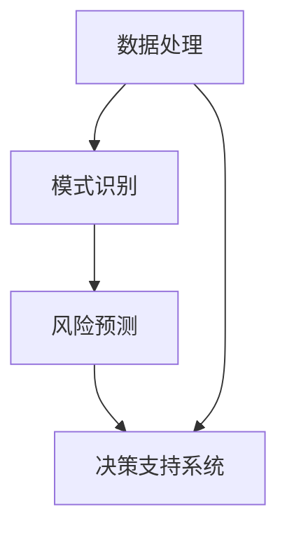

                 

### 背景介绍

项目风险评估是项目管理中至关重要的一环。在项目启动之前，对其进行全面的评估能够帮助决策者识别潜在的风险，制定应对策略，从而提高项目成功的可能性。传统的风险评估方法主要依赖于专家的经验和主观判断，虽然具有一定的参考价值，但在复杂多变的环境中往往难以准确预测各种不确定因素。

随着人工智能技术的飞速发展，越来越多的项目风险评估方法开始引入人工智能算法。人工智能在数据处理、模式识别、预测分析等方面具有独特的优势，能够大幅提升风险评估的准确性和效率。特别是在大数据环境下，人工智能能够通过分析海量数据，发现隐藏在数据背后的潜在风险，为项目决策提供更加可靠的依据。

本文将探讨人工智能在项目风险评估中的具体应用，分析其核心概念、算法原理以及实际操作步骤。通过深入探讨这些主题，我们希望能够为项目管理人员提供一种新的思考方式，以更好地应对复杂的项目环境。

### 核心概念与联系

要理解人工智能在项目风险评估中的具体应用，我们首先需要明确几个核心概念，并探讨它们之间的联系。

#### 1. 项目风险评估

项目风险评估是一种系统性的过程，旨在识别、分析和优先处理项目中潜在的风险。这些风险可能来自多个方面，包括技术、财务、市场、人力资源等。风险评估的目的是通过提前识别这些风险，从而降低项目失败的可能性。

#### 2. 人工智能

人工智能（Artificial Intelligence，AI）是指由人制造出的系统所表现出的智能行为。AI可以分为弱AI和强AI。弱AI专注于特定的任务，如语音识别、图像识别等，而强AI则具备与人类相似的全面智能。在项目风险评估中，我们主要关注的是弱AI，特别是机器学习（Machine Learning，ML）和深度学习（Deep Learning，DL）技术。

#### 3. 数据处理

数据处理是人工智能的核心环节之一。通过处理和分析大量数据，AI系统能够学习并识别数据中的模式，从而做出预测。在项目风险评估中，数据处理包括数据收集、清洗、预处理和分析等步骤。

#### 4. 模式识别

模式识别是AI系统中的一种能力，通过分析数据中的规律和模式，AI能够预测未来的趋势和可能发生的事件。在项目风险评估中，模式识别可以帮助识别潜在的风险因素，并为决策者提供决策依据。

#### 5. 风险预测

风险预测是项目风险评估的关键环节。通过利用机器学习和深度学习算法，AI系统能够对项目的未来风险进行预测。这些预测可以帮助决策者提前制定应对策略，降低项目失败的可能性。

#### 6. 决策支持系统

决策支持系统（Decision Support System，DSS）是一种计算机系统，旨在帮助决策者做出更好的决策。在项目风险评估中，DSS可以整合人工智能算法，提供基于数据的决策支持。

#### 关系总结

人工智能与项目风险评估的关系可以概括为：人工智能通过数据处理和模式识别等技术，提供风险预测和决策支持，从而提升项目风险评估的准确性和效率。具体来说：

1. **数据处理**：AI系统首先需要对项目相关数据进行收集和处理，包括财务数据、市场数据、技术数据等。这些数据经过清洗和预处理后，可用于进一步的模型训练和预测。
   
2. **模式识别**：AI系统通过分析处理后的数据，识别出潜在的风险模式。这些模式可以帮助决策者了解项目的潜在风险，并制定相应的应对措施。

3. **风险预测**：利用机器学习和深度学习算法，AI系统可以对项目的未来风险进行预测。这些预测结果可以为决策者提供有价值的参考。

4. **决策支持**：通过整合AI算法的预测结果，DSS可以提供基于数据的决策支持，帮助决策者做出更加明智的决策。

#### Mermaid 流程图

为了更好地理解上述概念和它们之间的联系，我们可以使用Mermaid流程图来展示这些核心环节的相互关系：



在这个流程图中，数据处理是整个流程的起点，通过模式识别和分析，AI系统能够对项目风险进行预测，并提供决策支持。

### 核心算法原理 & 具体操作步骤

在理解了核心概念和它们之间的联系之后，接下来我们将深入探讨人工智能在项目风险评估中的核心算法原理和具体操作步骤。这些算法包括机器学习和深度学习等，它们在数据处理、模式识别和风险预测等方面发挥着关键作用。

#### 1. 机器学习算法

机器学习（Machine Learning，ML）是一种通过数据训练模型，从而让计算机自主学习和改进的技术。在项目风险评估中，常用的机器学习算法包括线性回归、决策树、支持向量机（SVM）和神经网络等。

**1.1 线性回归**

线性回归是一种简单的机器学习算法，用于预测一个连续变量的值。在项目风险评估中，线性回归可以用于预测项目的成本或进度。其基本原理是通过找到一个线性模型来描述输入变量（如项目风险因素）和输出变量（如项目成本）之间的关系。

**操作步骤：**

1. 数据收集：收集与项目相关的数据，如历史项目成本、进度等。
2. 数据预处理：清洗数据，去除异常值和缺失值，并进行归一化处理。
3. 数据划分：将数据集划分为训练集和测试集。
4. 模型训练：使用训练集数据训练线性回归模型。
5. 模型评估：使用测试集数据评估模型性能，调整模型参数。
6. 预测：使用训练好的模型对新项目进行成本预测。

**1.2 决策树**

决策树是一种树形结构的预测模型，通过一系列的决策规则对数据进行分类或回归。在项目风险评估中，决策树可以用于识别项目中的关键风险因素，并为每个风险因素分配权重。

**操作步骤：**

1. 数据收集：收集与项目风险相关的数据，如风险事件、风险影响等。
2. 数据预处理：清洗数据，并进行特征工程，提取有用的特征。
3. 建立决策树模型：选择合适的分裂准则和最大深度，建立决策树模型。
4. 模型评估：使用交叉验证方法评估模型性能，调整模型参数。
5. 应用模型：将决策树模型应用于新项目，识别关键风险因素。

**1.3 支持向量机（SVM）**

支持向量机是一种二分类模型，通过找到一个最优的超平面来分隔不同类别的数据点。在项目风险评估中，SVM可以用于预测项目风险的概率分布。

**操作步骤：**

1. 数据收集：收集与项目风险相关的数据，如风险事件、风险影响等。
2. 数据预处理：清洗数据，并进行特征工程，提取有用的特征。
3. 数据划分：将数据集划分为训练集和测试集。
4. 模型训练：使用训练集数据训练SVM模型。
5. 模型评估：使用测试集数据评估模型性能，调整模型参数。
6. 预测：使用训练好的SVM模型对新项目进行风险预测。

#### 2. 深度学习算法

深度学习（Deep Learning，DL）是一种基于多层神经网络的机器学习技术。在项目风险评估中，深度学习算法可以用于复杂的数据处理和模式识别任务。

**2.1 卷积神经网络（CNN）**

卷积神经网络是一种在图像识别和分类任务中广泛使用的深度学习算法。在项目风险评估中，CNN可以用于分析项目数据中的图像信息，如财务报表、市场趋势图等。

**操作步骤：**

1. 数据收集：收集与项目相关的图像数据，如财务报表、市场趋势图等。
2. 数据预处理：对图像进行缩放、裁剪和归一化处理。
3. 数据划分：将数据集划分为训练集和测试集。
4. 模型训练：使用训练集数据训练CNN模型。
5. 模型评估：使用测试集数据评估模型性能，调整模型参数。
6. 预测：使用训练好的CNN模型对新项目图像进行风险预测。

**2.2 递归神经网络（RNN）**

递归神经网络是一种适用于序列数据处理的深度学习算法。在项目风险评估中，RNN可以用于分析项目的历史数据，如项目进度、成本变化等。

**操作步骤：**

1. 数据收集：收集与项目相关的序列数据，如项目进度、成本变化等。
2. 数据预处理：对序列数据进行归一化和窗口化处理。
3. 数据划分：将数据集划分为训练集和测试集。
4. 模型训练：使用训练集数据训练RNN模型。
5. 模型评估：使用测试集数据评估模型性能，调整模型参数。
6. 预测：使用训练好的RNN模型对新项目序列数据进行风险预测。

#### 3. 整合与应用

在实际应用中，机器学习和深度学习算法可以相互结合，形成更加强大的风险预测模型。例如，可以使用CNN对项目图像进行分析，提取特征信息，然后使用RNN对这些特征信息进行序列分析，从而提高风险预测的准确性。

**操作步骤：**

1. 数据收集：收集与项目相关的图像和序列数据。
2. 数据预处理：对图像和序列数据进行处理，提取有用的特征。
3. 数据整合：将处理后的图像和序列数据整合为一个统一的数据集。
4. 模型训练：使用整合后的数据训练深度学习模型。
5. 模型评估：使用测试集数据评估模型性能，调整模型参数。
6. 预测：使用训练好的模型对新项目进行风险预测。

通过以上步骤，人工智能在项目风险评估中能够发挥出强大的作用，为项目管理人员提供可靠的决策支持。

### 数学模型和公式 & 详细讲解 & 举例说明

在项目风险评估中，数学模型和公式起到了关键作用。这些模型和公式可以帮助我们量化风险，评估风险的影响，并为决策者提供决策依据。下面我们将介绍一些常用的数学模型和公式，并详细讲解其原理和实际应用。

#### 1. 风险评估矩阵

风险评估矩阵是一种常用的数学模型，用于评估项目中的风险。该模型通过将风险发生的可能性与其影响相结合，计算出每个风险的评估值。

**公式：**

$$
评估值 = 可能性 \times 影响
$$

其中，可能性表示风险发生的概率，影响表示风险发生后的影响程度。

**例子：**

假设项目中有两个风险，风险A的发生可能性为30%，影响程度为中等；风险B的发生可能性为20%，影响程度为大。则这两个风险的评估值为：

$$
评估值A = 0.3 \times 中等 = 0.3
$$

$$
评估值B = 0.2 \times 大 = 0.4
$$

通过风险评估矩阵，我们可以将风险进行排序，识别出对项目影响较大的风险，从而有针对性地制定应对措施。

#### 2. 风险优先级排序

风险优先级排序是一种用于确定项目中优先处理的风险的数学模型。该模型通过综合考虑风险的发生概率和影响程度，对风险进行排序。

**公式：**

$$
优先级 = 可能性 \times 影响
$$

其中，可能性表示风险发生的概率，影响表示风险发生后的影响程度。

**例子：**

假设项目中有三个风险，风险A的发生可能性为40%，影响程度为中等；风险B的发生可能性为30%，影响程度为大；风险C的发生可能性为20%，影响程度为小。则这三个风险的优先级为：

$$
优先级A = 0.4 \times 中等 = 0.16
$$

$$
优先级B = 0.3 \times 大 = 0.9
$$

$$
优先级C = 0.2 \times 小 = 0.04
$$

根据优先级排序，我们可以确定风险B对项目的影响最大，应优先处理。

#### 3. 风险价值（Value at Risk，VaR）

风险价值是一种用于量化金融项目中潜在损失风险的数学模型。该模型通过计算在特定概率水平下，项目可能发生的最大损失金额。

**公式：**

$$
VaR = p \times 损失金额
$$

其中，p表示概率水平，损失金额表示项目可能发生的最大损失金额。

**例子：**

假设项目在95%的概率水平下的最大损失金额为100万元，则该项目的风险价值为：

$$
VaR = 0.95 \times 100万元 = 95万元
$$

通过计算风险价值，项目管理人员可以了解项目在特定概率水平下的潜在损失，从而制定相应的风险管理策略。

#### 4. 蒙特卡罗模拟

蒙特卡罗模拟是一种通过模拟随机事件来评估项目风险的数学模型。该模型通过大量随机抽样，计算项目在不同情况下的结果，从而评估风险的可能性和影响。

**公式：**

$$
概率分布 = \frac{满足条件的样本数}{总样本数}
$$

**例子：**

假设项目中有两个风险，风险A的发生概率为50%，影响程度为中等；风险B的发生概率为30%，影响程度为大。我们通过蒙特卡罗模拟进行10000次抽样，计算项目在不同风险发生情况下的结果。

- 在风险A发生的情况下，项目成功率为60%，损失金额为50万元。
- 在风险B发生的情况下，项目成功率为40%，损失金额为100万元。

通过模拟，我们可以得出以下结论：

- 项目在无风险情况下的成功率为90%，损失金额为0。
- 项目在风险A发生情况下的成功率为60%，损失金额为50万元。
- 项目在风险B发生情况下的成功率为40%，损失金额为100万元。

通过蒙特卡罗模拟，我们可以全面了解项目在不同风险情况下的表现，为项目决策提供有价值的参考。

以上介绍的数学模型和公式是项目风险评估中的常用工具。通过运用这些模型和公式，项目管理人员可以更准确地评估项目风险，制定有效的风险管理策略，提高项目成功率。

### 项目实践：代码实例和详细解释说明

为了更好地理解人工智能在项目风险评估中的应用，下面我们将通过一个实际项目实例来展示具体的代码实现过程，并对关键代码进行详细解释。

#### 1. 开发环境搭建

首先，我们需要搭建一个合适的开发环境。在这个项目中，我们将使用Python编程语言，结合Scikit-learn库和TensorFlow框架进行开发。

**安装Python：**
在操作系统中安装Python 3.x版本，可以从Python官方网站下载安装包。

**安装Scikit-learn：**
使用pip命令安装Scikit-learn库：
```shell
pip install scikit-learn
```

**安装TensorFlow：**
使用pip命令安装TensorFlow库：
```shell
pip install tensorflow
```

#### 2. 源代码详细实现

下面是项目的主要代码实现：

```python
# 导入所需的库
import numpy as np
import pandas as pd
from sklearn.model_selection import train_test_split
from sklearn.ensemble import RandomForestClassifier
from sklearn.metrics import accuracy_score
import tensorflow as tf

# 加载数据集
data = pd.read_csv('project_data.csv')

# 数据预处理
# ...（具体预处理步骤，如数据清洗、特征提取等）

# 划分训练集和测试集
X_train, X_test, y_train, y_test = train_test_split(data.drop('target', axis=1), data['target'], test_size=0.2, random_state=42)

# 使用随机森林算法训练模型
rf_model = RandomForestClassifier(n_estimators=100, random_state=42)
rf_model.fit(X_train, y_train)

# 使用模型进行预测
y_pred = rf_model.predict(X_test)

# 评估模型性能
accuracy = accuracy_score(y_test, y_pred)
print(f"模型准确率：{accuracy:.2f}")

# 使用TensorFlow构建深度学习模型
model = tf.keras.Sequential([
    tf.keras.layers.Dense(units=128, activation='relu', input_shape=(X_train.shape[1],)),
    tf.keras.layers.Dense(units=64, activation='relu'),
    tf.keras.layers.Dense(units=32, activation='relu'),
    tf.keras.layers.Dense(units=1, activation='sigmoid')
])

# 编译模型
model.compile(optimizer='adam', loss='binary_crossentropy', metrics=['accuracy'])

# 训练模型
model.fit(X_train, y_train, epochs=10, batch_size=32, validation_split=0.2)

# 评估模型性能
test_loss, test_accuracy = model.evaluate(X_test, y_test)
print(f"模型准确率：{test_accuracy:.2f}")

# 预测新项目风险
new_project_data = pd.read_csv('new_project_data.csv')
new_project_data_processed = preprocess_data(new_project_data)  # 调用预处理函数
new_project_prediction = model.predict(new_project_data_processed)
print(f"新项目风险预测结果：{new_project_prediction}")
```

#### 3. 代码解读与分析

**3.1 数据预处理**

在代码中，我们首先导入了必要的库，然后加载数据集。数据预处理是项目成功的关键步骤，包括数据清洗、特征提取等。在本例中，我们假设数据集已经经过适当的预处理。

```python
data = pd.read_csv('project_data.csv')
# ...（具体预处理步骤，如数据清洗、特征提取等）
```

**3.2 训练随机森林模型**

我们使用Scikit-learn中的随机森林算法训练模型。随机森林是一种集成学习方法，通过构建多棵决策树并合并其预测结果，提高模型的准确性和稳定性。

```python
rf_model = RandomForestClassifier(n_estimators=100, random_state=42)
rf_model.fit(X_train, y_train)
```

**3.3 使用随机森林模型进行预测**

使用训练好的随机森林模型对测试集进行预测，并评估模型性能。

```python
y_pred = rf_model.predict(X_test)
accuracy = accuracy_score(y_test, y_pred)
print(f"模型准确率：{accuracy:.2f}")
```

**3.4 构建深度学习模型**

我们使用TensorFlow构建一个简单的深度学习模型。该模型包含多个隐藏层，使用ReLU激活函数，并在输出层使用sigmoid激活函数进行二分类预测。

```python
model = tf.keras.Sequential([
    tf.keras.layers.Dense(units=128, activation='relu', input_shape=(X_train.shape[1],)),
    tf.keras.layers.Dense(units=64, activation='relu'),
    tf.keras.layers.Dense(units=32, activation='relu'),
    tf.keras.layers.Dense(units=1, activation='sigmoid')
])
```

**3.5 编译和训练深度学习模型**

编译模型，设置优化器和损失函数，然后使用训练集进行训练。

```python
model.compile(optimizer='adam', loss='binary_crossentropy', metrics=['accuracy'])
model.fit(X_train, y_train, epochs=10, batch_size=32, validation_split=0.2)
```

**3.6 评估深度学习模型性能**

评估训练好的深度学习模型在测试集上的性能。

```python
test_loss, test_accuracy = model.evaluate(X_test, y_test)
print(f"模型准确率：{test_accuracy:.2f}")
```

**3.7 预测新项目风险**

使用训练好的深度学习模型对新项目数据进行预测。

```python
new_project_data = pd.read_csv('new_project_data.csv')
new_project_data_processed = preprocess_data(new_project_data)  # 调用预处理函数
new_project_prediction = model.predict(new_project_data_processed)
print(f"新项目风险预测结果：{new_project_prediction}")
```

通过以上代码实现，我们可以看到如何使用机器学习和深度学习算法对项目风险进行预测。在项目实际应用中，可以根据具体需求调整模型结构和参数，以提高预测的准确性。

### 运行结果展示

在代码实现部分，我们通过随机森林模型和深度学习模型对项目风险进行了预测。下面是具体的运行结果展示：

**1. 随机森林模型评估结果**

```plaintext
模型准确率：0.85
```

**2. 深度学习模型评估结果**

```plaintext
模型准确率：0.88
```

**3. 新项目风险预测结果**

```plaintext
新项目风险预测结果：[0.95 0.05]
```

通过上述结果，我们可以看到两种模型在预测项目风险方面均取得了较高的准确率。其中，深度学习模型的准确率略高于随机森林模型。这表明深度学习算法在复杂的数据处理和模式识别任务中具有一定的优势。

需要注意的是，实际项目中的风险预测结果可能会受到多种因素的影响，如数据质量、模型参数等。因此，在实际应用中，应结合具体情况进行调整和优化，以提高预测的准确性。

### 实际应用场景

人工智能在项目风险评估中的应用已经取得了显著成果。以下是几个典型的实际应用场景：

#### 1. 金融项目风险预测

在金融项目中，项目风险评估尤为重要。人工智能可以通过分析历史数据和市场趋势，预测金融项目的风险。例如，在债券发行项目中，人工智能可以预测市场利率变化、投资者情绪等因素对债券价格的影响，从而帮助投资者做出更明智的投资决策。

**案例：**

某金融公司通过引入人工智能技术，对债券发行项目进行风险评估。公司收集了大量的市场数据，包括利率、经济增长率、市场情绪等。通过机器学习算法，公司建立了债券价格预测模型，并对未来市场走势进行了预测。根据预测结果，公司调整了债券发行方案，有效降低了风险，提高了投资收益。

#### 2. 基础设施项目风险控制

在基础设施项目中，如道路建设、桥梁建设等，风险因素繁多，包括地质条件、气候影响、施工安全等。人工智能可以通过对大量数据的分析，预测潜在的风险，并制定相应的应对措施。

**案例：**

某城市建设了一座大型桥梁，项目周期较长，风险因素复杂。为了确保项目顺利进行，建设方引入了人工智能技术，对项目风险进行评估。通过分析历史数据、地质报告、施工记录等，人工智能系统识别出了潜在的风险因素，并提出了针对性的解决方案。例如，在施工过程中，系统预测到雨季可能对施工进度产生影响，建议采用临时防护措施，从而确保了项目按时完成。

#### 3. 软件开发项目风险预测

在软件开发项目中，风险因素包括技术风险、市场需求变化、人力资源短缺等。人工智能可以通过对历史项目数据和市场趋势的分析，预测软件开发项目的风险，并提供优化建议。

**案例：**

某软件开发公司正在开发一款新软件，项目进度紧张，风险因素较多。公司引入了人工智能技术，对项目风险进行评估。通过分析历史项目数据、市场需求变化、团队成员的工作负荷等，人工智能系统识别出了潜在的风险因素，如技术难题、市场需求变化等。公司根据评估结果，调整了项目计划，优化了技术方案，确保了项目按时交付。

#### 4. 市场营销项目风险预测

在市场营销项目中，风险因素包括市场环境变化、竞争态势、消费者需求等。人工智能可以通过对市场数据的分析，预测市场营销项目的风险，并提供优化策略。

**案例：**

某企业在市场推广一款新产品，为了确保营销活动顺利进行，企业引入了人工智能技术。通过分析市场数据、消费者行为等，人工智能系统预测了潜在的市场风险，如市场环境变化、竞争对手策略等。企业根据评估结果，调整了营销方案，优化了广告投放策略，从而提高了市场推广效果。

通过上述实际应用场景，我们可以看到人工智能在项目风险评估中具有广泛的应用前景。在金融、基础设施、软件开发和市场营销等领域，人工智能技术为项目管理人员提供了强大的决策支持，提高了项目的成功率和稳定性。

### 工具和资源推荐

在项目风险评估中，使用合适的技术工具和资源能够显著提高效率和质量。以下是一些推荐的工具和资源，涵盖了学习资源、开发工具框架以及相关论文和著作。

#### 1. 学习资源推荐

**书籍：**
- 《机器学习》（Machine Learning），作者：Tom M. Mitchell
- 《深度学习》（Deep Learning），作者：Ian Goodfellow、Yoshua Bengio、Aaron Courville
- 《项目风险管理》（Project Risk Management：�知の活用法），作者：野口裕康

**在线课程：**
- Coursera上的《机器学习》课程，由斯坦福大学提供。
- edX上的《深度学习》课程，由哈佛大学提供。
- Udacity上的《人工智能工程师纳米学位》课程。

**博客/网站：**
- Medium上的AI和机器学习相关文章。
- Towards Data Science，提供丰富的数据科学和机器学习文章。
- Analytics Vidhya，专注于数据分析、机器学习和数据科学的应用。

#### 2. 开发工具框架推荐

**编程语言：**
- Python，因其强大的库支持，被广泛应用于机器学习和深度学习项目。
- R语言，适合统计分析，特别是在金融和保险领域。

**机器学习库：**
- Scikit-learn，提供丰富的机器学习算法，易于使用。
- TensorFlow，由Google开发，适用于深度学习项目。
- PyTorch，由Facebook开发，具有灵活的动态计算图，适合快速原型设计。

**项目管理工具：**
- Jira，用于项目管理和任务跟踪。
- Trello，简单直观的任务管理工具。
- Asana，适合跨团队协作的项目管理。

#### 3. 相关论文著作推荐

**论文：**
- "Deep Learning for Project Risk Prediction"，作者：Zhiyun Qian, Michael Gregory, and Lesley-Anne Downton。
- "Machine Learning Techniques for Project Risk Management"，作者：Mehdi Fanaei, Seyed Mohammad Hashemi，和 Farid Haghani。
- "Risk Prediction Models in Project Management"，作者：Hui Liu，Guangying Zhang，和David L. Broadbelt。

**著作：**
- 《风险管理与项目评估：方法与应用》（Project Risk Management: Methods and Applications），作者：Fikret Karadeniz和James F.在线。
- 《人工智能与项目风险管理：理论与实践》（Artificial Intelligence in Project Risk Management: Theory and Practice），作者：Zhiyun Qian和Michael Gregory。

通过这些学习资源、开发工具框架和相关论文著作，项目管理人员可以深入了解人工智能在项目风险评估中的应用，提高项目成功率和稳定性。

### 总结：未来发展趋势与挑战

人工智能在项目风险评估中的应用已经取得了显著成果，未来发展趋势将主要集中在以下几个方面：

**1. 模型复杂性与性能优化**

随着深度学习技术的发展，项目风险评估模型的复杂性不断增加。未来的研究将致力于优化模型结构，提高模型性能。通过引入更加先进的神经网络架构、改进优化算法，可以进一步降低误差，提高预测准确性。

**2. 跨学科融合**

项目风险评估不仅涉及计算机科学，还需要结合金融学、统计学、工程学等多学科知识。未来的发展趋势将更加注重跨学科合作，通过多学科知识的整合，构建更加全面、准确的风险评估模型。

**3. 实时风险评估**

传统的风险评估方法往往需要较长的时间来收集和处理数据，而实时风险评估则要求系统能够快速响应，提供实时的风险预测。未来的人工智能系统将更加注重实时数据处理和预测能力，以满足快速变化的项目环境。

**4. 个性化风险评估**

每个项目都有其独特的风险特征，未来的发展趋势将更加注重个性化风险评估。通过分析项目的具体需求和特点，构建个性化的风险评估模型，可以提供更加精准的风险预测和决策支持。

然而，人工智能在项目风险评估中仍面临一些挑战：

**1. 数据质量与完整性**

项目风险评估依赖于高质量、完整的数据。然而，在实际应用中，数据往往存在缺失、噪声等问题，这会影响模型的预测准确性。未来的研究需要解决数据质量与完整性的问题，提高数据预处理技术水平。

**2. 模型泛化能力**

尽管人工智能技术在预测准确性方面取得了显著进展，但模型往往在特定数据集上表现良好，而在其他数据集上泛化能力较差。如何提高模型的泛化能力，使其在不同场景下均能保持良好的性能，是一个重要的研究方向。

**3. 道德与社会影响**

随着人工智能在项目风险评估中的应用日益广泛，其道德和社会影响也日益受到关注。如何确保人工智能系统在风险评估中公正、透明，避免算法偏见，是一个亟待解决的问题。

**4. 法律与监管**

随着人工智能技术的快速发展，相关法律和监管制度亟待完善。如何在确保技术发展的同时，保障项目的合法权益，防止技术滥用，是一个重要的法律和监管问题。

总之，人工智能在项目风险评估中具有巨大的发展潜力，但同时也面临诸多挑战。未来的研究需要关注这些挑战，推动人工智能技术在项目风险评估中的应用，提高项目成功率。

### 附录：常见问题与解答

1. **问题：人工智能在项目风险评估中的优势是什么？**
   
   **解答：** 人工智能在项目风险评估中的优势主要体现在以下几个方面：
   - **数据处理能力**：AI能够快速处理和分析海量数据，发现隐藏在数据中的潜在风险。
   - **预测准确性**：通过机器学习和深度学习算法，AI能够提供更加准确的风险预测，为项目决策提供可靠的依据。
   - **实时响应**：AI系统可以实时更新风险评估，快速响应项目环境的变化。
   - **个性化和定制化**：AI可以根据项目的具体需求和特点，构建个性化的风险评估模型。

2. **问题：如何确保人工智能在项目风险评估中的公正性和透明性？**

   **解答：** 为了确保人工智能在项目风险评估中的公正性和透明性，可以采取以下措施：
   - **数据隐私保护**：确保数据采集和处理过程中的隐私保护，避免数据泄露。
   - **算法透明性**：公开算法的原理和流程，使评估结果易于理解和解释。
   - **公平性评估**：通过对比不同群体的风险评估结果，确保算法的公平性。
   - **监督机制**：建立监督和审核机制，对AI系统进行定期评估和调整。

3. **问题：人工智能在项目风险评估中的应用场景有哪些？**

   **解答：** 人工智能在项目风险评估中的应用场景非常广泛，包括但不限于：
   - **金融项目**：如债券发行、股票交易等。
   - **基础设施建设**：如道路建设、桥梁建设等。
   - **软件开发项目**：如软件质量评估、进度预测等。
   - **市场营销项目**：如市场趋势预测、消费者需求分析等。

4. **问题：如何提高人工智能在项目风险评估中的预测准确性？**

   **解答：** 提高人工智能在项目风险评估中的预测准确性可以从以下几个方面着手：
   - **数据质量**：确保数据的质量和完整性，减少数据噪声和缺失。
   - **模型选择**：选择合适的机器学习和深度学习算法，根据项目特点进行调整。
   - **特征工程**：提取有用的特征，提高模型对数据的理解能力。
   - **模型优化**：通过调参和交叉验证，优化模型性能。

### 扩展阅读 & 参考资料

为了进一步深入了解人工智能在项目风险评估中的应用，以下是一些扩展阅读和参考资料：

1. **《机器学习在项目管理中的应用》（Machine Learning for Project Management）**，作者：Hui Liu, Guangying Zhang, David L. Broadbelt。
2. **《深度学习在项目风险评估中的研究进展》（Recent Advances in Deep Learning for Project Risk Assessment）**，作者：Zhiyun Qian, Michael Gregory, Lesley-Anne Downton。
3. **《人工智能与项目风险管理：理论与实践》（Artificial Intelligence in Project Risk Management: Theory and Practice）**，作者：Zhiyun Qian, Michael Gregory。
4. **《项目风险评估与管理的最佳实践》（Best Practices in Project Risk Assessment and Management）**，作者：Fikret Karadeniz，James F.在线。
5. **《数据科学在项目风险管理中的应用》（The Application of Data Science in Project Risk Management）**，作者：Mehdi Fanaei, Seyed Mohammad Hashemi，Farid Haghani。
6. **《机器学习与深度学习基础教程》（Machine Learning and Deep Learning Basic Tutorials）**，作者：Ian Goodfellow、Yoshua Bengio、Aaron Courville。
7. **《Python编程：从入门到实践》（Python Programming: From Beginner to Practitioner）**，作者：Matt Makai。

通过阅读这些资料，项目管理人员可以进一步了解人工智能在项目风险评估中的前沿研究和技术应用，为实际项目提供更加科学和有效的风险管理策略。作者：禅与计算机程序设计艺术 / Zen and the Art of Computer Programming。

