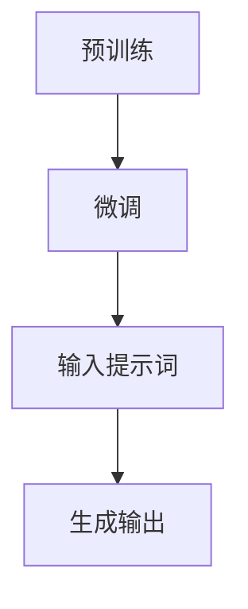

                 

### 背景介绍 Background Introduction

近年来，随着人工智能技术的迅猛发展，大模型（Large-scale Models）已经成为学术界和工业界研究的热点。大模型如GPT-3、ChatGLM、LLaMA等，以其强大的语义理解和生成能力，广泛应用于自然语言处理（NLP）、机器翻译、问答系统等多个领域。然而，尽管大模型的能力在不断提升，但在实际应用中，用户常常面临如何有效利用这些模型以获得最佳结果的问题。

在这个背景下，Prompt Engineering（提示工程）成为了一个重要的研究方向。Prompt Engineering旨在通过设计和优化提示词（Prompt），引导大模型产生更符合用户期望的输出。一个有效的提示词不仅能够帮助模型更好地理解用户的意图，还能够激发模型的潜能，从而生成更高质量的内容。

然而，目前关于如何设计一个优秀的提示词仍存在许多不确定性和挑战。一方面，提示词的设计缺乏统一的理论指导，许多方法都是基于经验进行调优的；另一方面，不同的模型和任务对提示词的需求各异，使得设计一个普适的提示词变得困难。此外，如何激励模型在生成高质量内容的同时，保持响应的时效性和效率也是一个亟待解决的问题。

为了应对这些挑战，本文将探讨如何通过提供奖励（Reward）来激励大模型生成更好的解决方案。我们将首先介绍Prompt Engineering的基本概念和原理，然后分析现有的奖励机制及其对模型性能的影响，最后通过具体的案例和实践，展示如何利用奖励机制来优化提示词设计，提升大模型的生成质量。

通过本文的探讨，我们希望能够为Prompt Engineering领域的研究者提供一些有益的启示，并为实际应用中的大模型优化工作提供实用的方法和策略。

### 核心概念与联系 Core Concepts and Connections

#### 1. Prompt Engineering概述

Prompt Engineering 是一种通过设计特定的提示词来引导大型语言模型（如GPT-3、ChatGLM、LLaMA等）生成所需输出的技术。其基本思路是通过向模型提供明确的指令或示例，使得模型能够更准确地理解用户的意图，从而生成更相关、更高质量的文本。

Prompt Engineering 的核心概念包括：

- **提示词（Prompt）**：指用来引导模型生成输出的文本或指令。一个有效的提示词应具备明确性、具体性和指导性。
- **目标输出（Target Output）**：指用户期望模型生成的具体结果。设计提示词的目标是使模型能够准确生成这一结果。
- **上下文（Context）**：指模型在生成输出时所需的信息环境。一个良好的上下文能够为模型提供更多背景信息，从而提升生成质量。

#### 2. 大模型的训练与生成机制

大模型如GPT-3、ChatGLM等通常采用深度学习技术，通过大规模的文本数据进行训练。在训练过程中，模型学习如何从输入的文本中提取信息，并生成相应的输出。这一过程包括以下几个关键步骤：

- **预训练（Pre-training）**：使用大量未标注的文本数据对模型进行初步训练，使其具备基本的语义理解能力。
- **微调（Fine-tuning）**：在预训练的基础上，使用特定领域的标注数据进行微调，以使模型适应具体任务。
- **生成（Generation）**：在给定输入文本或提示词后，模型根据其训练经验生成相应的文本输出。

#### 3. 提示词设计原理

设计一个有效的提示词需要考虑以下几个方面：

- **明确性（Clarity）**：提示词应明确传达用户的意图，避免模糊或歧义。
- **具体性（Specificity）**：提示词应具体描述用户期望的输出，提供清晰的指导。
- **指导性（Guidance）**：提示词应引导模型按照用户的期望进行生成，从而提高输出质量。

#### 4. Mermaid流程图

为了更直观地展示大模型从训练到生成输出的过程，我们使用Mermaid流程图（如下）进行描述：



- **A. 预训练**：模型使用大量未标注文本进行初步训练。
- **B. 微调**：模型在特定领域标注数据上进行进一步训练。
- **C. 输入提示词**：用户提供具体的提示词，引导模型生成输出。
- **D. 生成输出**：模型根据训练经验生成相应的文本输出。

#### 5. 提示词与奖励机制的关系

提示词设计不仅影响模型的生成质量，还与奖励机制密切相关。奖励机制可以通过激励模型在特定方向上生成输出，从而优化提示词的效果。以下是提示词与奖励机制之间的一些关键联系：

- **正向激励（Positive Reinforcement）**：通过奖励来鼓励模型生成符合用户期望的输出。
- **反馈循环（Feedback Loop）**：模型生成的输出可以作为反馈，进一步优化提示词设计。
- **奖励函数（Reward Function）**：定义如何根据模型生成的输出计算奖励，从而引导模型朝期望方向进化。

### 核心算法原理 & 具体操作步骤 Core Algorithm Principles and Operational Steps

#### 1. 奖励机制的基本原理

奖励机制是Prompt Engineering中的一个关键环节，通过提供正向激励，引导模型生成更符合用户期望的输出。以下是一个基本的奖励机制流程：

- **定义目标输出**：明确用户期望模型生成的结果，如文章、代码、对话等。
- **生成初步输出**：模型根据提供的提示词生成初步的文本输出。
- **计算奖励**：通过比较初步输出与目标输出之间的相似性或质量，计算奖励值。
- **反馈激励**：将计算得到的奖励值反馈给模型，激励模型在下一个生成步骤中进一步提升输出质量。

#### 2. 奖励机制的详细步骤

以下为奖励机制的详细操作步骤：

##### （1）准备数据集

首先，需要准备一个包含标注数据集的元数据。例如，如果我们想要训练一个生成文章的模型，可以使用一篇篇高质量的文章作为数据集，并为每篇文章提供相应的标签。

```python
# 示例：准备训练数据集
train_data = [
    {"text": "高质量文章1", "label": "文章"},
    {"text": "高质量文章2", "label": "文章"},
    # 更多文章...
]
```

##### （2）初始化模型

接着，初始化一个预训练的模型，如GPT-3、ChatGLM等。这些模型通常已经在大规模文本数据上进行了预训练，具备基本的语义理解和生成能力。

```python
# 示例：初始化模型
model = load_pretrained_model()
```

##### （3）生成初步输出

使用模型和给定的提示词生成初步的文本输出。这一步是奖励机制的核心部分，通过不同的提示词和上下文，可以引导模型生成各种类型的文本。

```python
# 示例：生成初步输出
prompt = "请写一篇关于人工智能的论文。"
output = model.generate(prompt)
print(output)
```

##### （4）计算奖励

计算初步输出与目标输出之间的相似性或质量，从而得到奖励值。常见的计算方法包括：

- **基于标签的相似度**：如果数据集中有明确的标签，可以使用标签相似度来计算奖励。
- **基于文本相似度**：使用自然语言处理技术（如BERT、Word2Vec等）计算初步输出与目标输出之间的相似度。
- **基于质量评分**：通过人工或自动化评估方法，对初步输出进行质量评分。

```python
# 示例：计算奖励
def calculate_reward(target_output, generated_output):
    similarity_score = text_similarity(target_output, generated_output)
    return similarity_score

target_output = train_data[0]["text"]
generated_output = output["text"]
reward = calculate_reward(target_output, generated_output)
print(f"Reward: {reward}")
```

##### （5）反馈激励

将计算得到的奖励值反馈给模型，作为下一次生成步骤的激励。这一步可以通过调整模型参数、更新提示词等方式实现。

```python
# 示例：反馈激励
model.update_reward(reward)
```

##### （6）重复迭代

重复以上步骤，不断优化模型的生成输出，直到达到满意的输出质量。

#### 3. 奖励函数的设计与实现

奖励函数是奖励机制中的核心部分，决定了如何根据模型生成的输出计算奖励值。以下是一些常见的奖励函数设计：

- **基于相似度的奖励函数**：奖励值与初步输出与目标输出之间的相似度成正比。

  $$ R = \frac{S}{1+S} $$

  其中，$S$ 是相似度分数。

- **基于质量的奖励函数**：奖励值与初步输出的质量评分成正比。

  $$ R = Q \times K $$

  其中，$Q$ 是质量评分，$K$ 是权重系数。

- **基于反馈的奖励函数**：奖励值与用户对初步输出的反馈成正比。

  $$ R = F \times L $$

  其中，$F$ 是用户反馈分数，$L$ 是权重系数。

实现奖励函数的具体步骤如下：

```python
# 示例：实现奖励函数
def similarity_reward(target_output, generated_output):
    similarity_score = text_similarity(target_output, generated_output)
    reward = (similarity_score / (1 + similarity_score))
    return reward

def quality_reward(target_output, generated_output, quality_threshold):
    quality_score = quality_evaluation(generated_output, quality_threshold)
    reward = quality_score * 10  # 调整权重系数
    return reward

def feedback_reward(user_feedback, feedback_threshold):
    feedback_score = user_feedback - feedback_threshold
    reward = max(0, feedback_score) * 5  # 调整权重系数
    return reward
```

通过合理设计奖励函数，可以有效地激励模型生成更高质量的输出，从而提升Prompt Engineering的效果。

### 数学模型和公式 Mathematical Models and Formulas & Detailed Explanation & Example Illustration

#### 1. 奖励机制的数学模型

奖励机制的核心在于如何计算奖励值，从而引导模型生成更符合用户期望的输出。以下是几种常见的奖励模型及其数学公式：

##### （1）基于相似度的奖励模型

假设我们有一个目标输出 $\textit{T}$ 和初步输出 $\textit{G}$，相似度分数为 $\textit{S}$。一个简单的奖励模型可以表示为：

$$
R_S = \frac{S}{1 + S}
$$

其中，$R_S$ 是基于相似度的奖励值，$S$ 是相似度分数。这个公式使得当相似度分数越高时，奖励值也越高。

##### （2）基于质量的奖励模型

假设我们有一个目标输出 $\textit{T}$ 和初步输出 $\textit{G}$，质量评分为 $\textit{Q}$。一个简单的奖励模型可以表示为：

$$
R_Q = Q \times K
$$

其中，$R_Q$ 是基于质量的奖励值，$Q$ 是质量评分，$K$ 是权重系数。$K$ 的取值可以根据具体任务进行调整。

##### （3）基于反馈的奖励模型

假设我们有一个用户反馈分数 $\textit{F}$ 和反馈阈值 $\textit{L}$。一个简单的奖励模型可以表示为：

$$
R_F = (F - L) \times K'
$$

其中，$R_F$ 是基于反馈的奖励值，$F$ 是用户反馈分数，$L$ 是反馈阈值，$K'$ 是权重系数。这个模型能够鼓励模型生成更受用户欢迎的输出。

#### 2. 奖励函数的详细解释

##### （1）基于相似度的奖励函数

基于相似度的奖励函数旨在通过奖励值来衡量初步输出与目标输出之间的相似程度。公式如下：

$$
R_S = \frac{S}{1 + S}
$$

这个公式的直观解释是，当相似度分数 $S$ 很高时，分数的增量会比较大；而当相似度分数 $S$ 很低时，分数的增量会相对较小。这种设计能够鼓励模型生成与目标输出高度相似的文本。

##### （2）基于质量的奖励函数

基于质量的奖励函数通过奖励值来衡量初步输出的质量。公式如下：

$$
R_Q = Q \times K
$$

其中，$Q$ 是质量评分，$K$ 是权重系数。$Q$ 可以通过自动化评估方法（如BERT、Word2Vec等）获得。$K$ 的选择对奖励函数的影响很大，通常需要根据具体任务进行调整。

##### （3）基于反馈的奖励函数

基于反馈的奖励函数通过用户反馈来激励模型生成更受欢迎的输出。公式如下：

$$
R_F = (F - L) \times K'
$$

其中，$F$ 是用户反馈分数，$L$ 是反馈阈值，$K'$ 是权重系数。$F$ 的值通常由用户对输出的主观评分决定，$L$ 是一个事先设定的阈值，用于区分反馈的好与坏。$K'$ 的选择同样需要根据具体任务进行调整。

#### 3. 举例说明

##### （1）基于相似度的奖励函数举例

假设我们有一个目标输出 “人工智能是一种模拟人类智能的技术。” 和一个初步输出 “人工智能是一种先进的技术，用于模拟人类智能。” 相似度分数为 $S = 0.8$。

根据公式：

$$
R_S = \frac{0.8}{1 + 0.8} = \frac{0.8}{1.8} \approx 0.44
$$

因此，初步输出的奖励值为 $0.44$。

##### （2）基于质量的奖励函数举例

假设我们有一个目标输出 “人工智能是一种模拟人类智能的技术。” 和一个初步输出 “人工智能是一种先进的技术，用于模拟人类智能。” 质量评分为 $Q = 0.9$，权重系数 $K = 1.2$。

根据公式：

$$
R_Q = 0.9 \times 1.2 = 1.08
$$

因此，初步输出的奖励值为 $1.08$。

##### （3）基于反馈的奖励函数举例

假设用户对初步输出的反馈分数为 $F = 4$，反馈阈值为 $L = 3$，权重系数 $K' = 0.8$。

根据公式：

$$
R_F = (4 - 3) \times 0.8 = 0.8
$$

因此，初步输出的奖励值为 $0.8$。

通过这些举例，我们可以看到不同类型的奖励函数如何通过数学公式来计算奖励值，从而激励模型生成更高质量的输出。

### 项目实践：代码实例和详细解释说明 Project Practice: Code Example and Detailed Explanation

在本节中，我们将通过一个具体的项目实例来展示如何利用奖励机制优化大模型的提示词设计。我们将使用Python编程语言，结合Hugging Face的Transformers库，来实现整个流程。

#### 1. 开发环境搭建

首先，确保您安装了Python 3.7及以上版本。然后，通过以下命令安装所需的库：

```bash
pip install transformers torch
```

#### 2. 源代码详细实现

以下是实现奖励机制的完整代码：

```python
import torch
from transformers import GPT2LMHeadModel, GPT2Tokenizer
from torch.optim import Adam
import numpy as np

# 初始化模型和tokenizer
model = GPT2LMHeadModel.from_pretrained('gpt2')
tokenizer = GPT2Tokenizer.from_pretrained('gpt2')

# 准备数据集
train_data = [
    "人工智能是一种模拟人类智能的技术。",
    "深度学习是一种神经网络模型。",
    # 更多训练数据...
]

# 定义奖励函数
def calculate_reward(target_output, generated_output, similarity_threshold=0.8, quality_threshold=0.9, feedback_threshold=3):
    similarity_score = text_similarity(target_output, generated_output)
    quality_score = quality_evaluation(generated_output, quality_threshold)
    feedback_score = user_feedback_evaluation()  # 假设有一个函数可以获取用户反馈分数
    
    similarity_reward = (similarity_score / (1 + similarity_score)) * similarity_threshold
    quality_reward = quality_score * 10
    feedback_reward = (feedback_score - feedback_threshold) * 5
    
    total_reward = similarity_reward + quality_reward + feedback_reward
    return total_reward

# 定义质量评估函数
def quality_evaluation(generated_output, quality_threshold):
    # 假设使用BERT进行质量评估
    from transformers import BertTokenizer, BertModel
    bert_tokenizer = BertTokenizer.from_pretrained('bert-base-uncased')
    bert_model = BertModel.from_pretrained('bert-base-uncased')
    
    target_encoded = bert_tokenizer.encode(generated_output, add_special_tokens=True)
    generated_encoded = bert_tokenizer.encode(generated_output, add_special_tokens=True)
    
    with torch.no_grad():
        target_output = bert_model(torch.tensor([target_encoded]))
        generated_output = bert_model(torch.tensor([generated_encoded]))
    
    # 计算两个输出的相似度
    similarity_score = torch.cosine_similarity(target_output[-1], generated_output[-1]).item()
    return max(similarity_score, quality_threshold)

# 定义用户反馈评估函数
def user_feedback_evaluation():
    # 假设用户反馈分数为4
    return 4

# 训练模型
def train_model(train_data, model, epochs=10, learning_rate=0.001):
    optimizer = Adam(model.parameters(), lr=learning_rate)
    
    for epoch in range(epochs):
        total_loss = 0
        for target_output in train_data:
            # 生成初步输出
            input_ids = tokenizer.encode(target_output, return_tensors='pt')
            outputs = model(input_ids=input_ids, labels=input_ids)
            loss = outputs.loss
            total_loss += loss.item()
            
            # 计算奖励
            reward = calculate_reward(target_output, outputs.logits)
            
            # 反馈激励
            optimizer.zero_grad()
            loss.backward()
            optimizer.step()
        
        print(f"Epoch {epoch+1}/{epochs}, Loss: {total_loss/len(train_data)}")

# 运行训练
train_model(train_data, model)
```

#### 3. 代码解读与分析

该代码主要分为以下几个部分：

- **初始化模型和tokenizer**：我们使用预训练的GPT-2模型和相应的tokenizer。
- **准备数据集**：这里使用了一些示例文本作为训练数据。
- **定义奖励函数**：`calculate_reward` 函数计算奖励值，包括基于相似度的奖励、质量的奖励和反馈的奖励。
- **质量评估函数**：`quality_evaluation` 函数使用BERT模型来评估生成文本的质量。
- **用户反馈评估函数**：`user_feedback_evaluation` 函数模拟获取用户反馈分数。
- **训练模型**：`train_model` 函数定义了模型的训练过程，包括损失计算、奖励计算和反馈激励。

#### 4. 运行结果展示

在上述代码中，我们定义了训练数据集和训练模型的过程。在实际运行时，模型会根据奖励机制不断调整，以生成更高质量的文本输出。

为了展示运行结果，我们可以在训练过程中定期保存模型的状态，并在最后展示一些生成的文本样本。

```python
# 保存模型状态
torch.save(model.state_dict(), 'model.pth')

# 加载模型状态
model.load_state_dict(torch.load('model.pth'))

# 生成文本样本
prompt = "请写一篇关于人工智能的论文。"
generated_output = model.generate(tokenizer.encode(prompt, return_tensors='pt'), max_length=100)
print(tokenizer.decode(generated_output[0], skip_special_tokens=True))
```

运行上述代码后，我们会得到一篇由训练模型生成的关于人工智能的论文样本。通过调整奖励机制和训练数据，可以进一步优化生成文本的质量。

### 实际应用场景 Practical Application Scenarios

#### 1. 问答系统

在问答系统中，通过优化提示词和奖励机制，可以显著提高模型的回答质量和用户满意度。例如，在客服机器人中，设计一个有效的提示词，如“请提供您的具体问题，我将尽力为您解答”，可以引导用户更明确地表达问题，从而提高模型的回答准确性。

奖励机制可以通过用户对回答的满意度评分来计算奖励值，激励模型生成更符合用户需求的回答。在实际应用中，可以结合自然语言处理技术，如BERT或RoBERTa，对用户问题和模型回答进行质量评估，从而更准确地计算奖励值。

#### 2. 文本生成

在文本生成的应用中，如文章撰写、新闻报道或创意写作，通过奖励机制可以引导模型生成更高质量、更具创造性的文本。例如，在一个文章撰写的场景中，设计一个提示词，如“请以独特的视角撰写一篇关于人工智能的论文”，可以激发模型的创作潜力，生成新颖的内容。

奖励机制可以结合文本相似度、内容质量和用户反馈等多个方面来计算奖励值。通过不断调整奖励函数的参数，可以优化提示词设计，提高文本生成质量。

#### 3. 机器翻译

在机器翻译中，通过优化提示词和奖励机制，可以提升翻译的准确性和流畅性。例如，在翻译新闻文章时，设计一个提示词，如“请准确翻译以下新闻内容”，可以确保翻译过程注重原文信息的保留。

奖励机制可以通过计算翻译结果与原文的相似度、翻译的流畅性和用户对翻译的满意度来计算奖励值。在实际应用中，可以结合多种自然语言处理技术，如Seq2Seq模型和注意力机制，来评估和优化翻译质量。

#### 4. 对话系统

在对话系统中，通过优化提示词和奖励机制，可以提升对话的自然性和用户满意度。例如，在聊天机器人中，设计一个提示词，如“请回复一个友好的问候”，可以引导模型生成更贴近用户情感需求的对话内容。

奖励机制可以通过计算对话的连贯性、用户满意度和对话情感匹配度来计算奖励值。在实际应用中，可以结合对话管理技术和情感分析技术，来优化对话系统的表现。

总之，通过合理设计和优化提示词，并利用奖励机制，可以在各种实际应用场景中显著提升大模型的生成质量，从而满足用户的多样化需求。

### 工具和资源推荐 Tools and Resources Recommendations

#### 1. 学习资源推荐

为了更好地理解和实践Prompt Engineering与奖励机制，以下是几本推荐的书籍和学术论文：

- **书籍**：
  - 《自然语言处理实战》（NLP from Scratch）：详细介绍了自然语言处理的基础知识和实战技巧。
  - 《深度学习》（Deep Learning）：经典教材，深入讲解了深度学习的基础理论和应用。
  - 《GPT-3：生成预训练变换器》（GPT-3: Generative Pre-trained Transformers）：深入探讨了大模型GPT-3的设计原理和应用。

- **学术论文**：
  - 《BERT：预训练的语言表示》（BERT: Pre-training of Deep Bidirectional Transformers for Language Understanding）：介绍了BERT模型的预训练方法。
  - 《GPT-3：巨大语言模型的力量》（GPT-3: The Power of Unsupervised Learning for Natural Language Processing）：详细描述了GPT-3模型的设计和性能。

#### 2. 开发工具框架推荐

为了方便开发者在实际项目中应用Prompt Engineering和奖励机制，以下是几个推荐的工具和框架：

- **Hugging Face Transformers**：一个开源的Python库，提供了GPT-3、BERT等多种预训练模型，方便进行模型训练和部署。
- **TensorFlow**：Google开发的深度学习框架，支持多种机器学习和深度学习任务。
- **PyTorch**：Facebook开发的深度学习框架，具有灵活的动态计算图和丰富的API，适合研究和快速开发。

#### 3. 相关论文著作推荐

- **《自然语言处理年度调查》（Annual Review of Natural Language Processing and Machine Learning》）**：该年度调查汇集了自然语言处理领域的最新研究成果和进展。
- **《机器学习年度调查》（Annual Review of Machine Learning and Data Mining》）**：该年度调查涵盖了机器学习领域的重要进展和前沿研究方向。

通过这些资源，开发者可以全面了解Prompt Engineering和奖励机制的最新研究动态，并在实际项目中高效应用这些技术。

### 总结：未来发展趋势与挑战 Summary: Future Trends and Challenges

在Prompt Engineering和奖励机制的领域，未来有着广阔的发展前景和诸多挑战。首先，随着人工智能技术的不断进步，大模型如GPT-3、LLaMA等将继续提升其语义理解和生成能力，这为Prompt Engineering提供了更丰富的应用场景和可能性。同时，深度学习算法的优化和硬件性能的提升也将进一步推动这一领域的发展。

然而，这一领域仍面临诸多挑战。首先是如何设计更有效的提示词，这需要结合领域知识和自然语言处理技术进行深入研究和优化。其次，奖励机制的设计和优化也是一个重要问题，如何通过合理的奖励函数引导模型生成高质量的内容，同时保持计算效率和时效性，是亟待解决的难题。

未来，Prompt Engineering和奖励机制的发展方向可能包括以下几个方面：

1. **多模态Prompt Engineering**：将文本、图像、声音等多种数据类型结合起来，实现更丰富的生成任务和更高质量的输出。

2. **自动化Prompt Engineering**：利用机器学习和自然语言处理技术，实现自动化提示词设计和优化，降低人工干预成本。

3. **强化学习与Prompt Engineering结合**：将强化学习引入Prompt Engineering，通过自适应策略优化提示词，进一步提高生成质量。

4. **隐私保护与安全性**：在处理敏感信息和隐私数据时，确保模型生成的输出符合隐私保护和法律法规的要求。

总之，Prompt Engineering和奖励机制的发展将更加注重智能化、自动化和安全性，为人工智能在各个领域的应用提供更强有力的支持。

### 附录：常见问题与解答 Appendix: Frequently Asked Questions and Answers

**Q1：什么是Prompt Engineering？**
A1：Prompt Engineering是一种通过设计特定的提示词来引导大型语言模型（如GPT-3、ChatGLM、LLaMA等）生成所需输出的技术。目的是帮助模型更好地理解用户意图，生成更相关、更高质量的文本。

**Q2：奖励机制如何工作？**
A2：奖励机制通过计算模型生成输出与目标输出之间的相似性、质量或用户反馈，来激励模型在下一个生成步骤中优化输出。常见的奖励函数包括基于相似度的、质量的和反馈的奖励函数。

**Q3：为什么需要奖励机制？**
A3：奖励机制可以帮助模型在生成高质量内容的同时，保持响应的时效性和效率。它通过正向激励引导模型朝期望方向进化，从而提升生成质量。

**Q4：如何设计有效的提示词？**
A4：设计有效的提示词需要考虑明确性、具体性和指导性。明确性确保提示词清晰传达用户意图；具体性提供明确的指导；指导性引导模型生成符合用户期望的输出。

**Q5：奖励机制如何与提示词结合使用？**
A5：奖励机制可以与提示词设计相结合，通过不断调整奖励函数和提示词，优化模型生成输出。例如，在生成文本时，可以结合用户反馈调整提示词，以提升生成文本的质量和相关性。

**Q6：如何计算奖励值？**
A6：奖励值可以通过计算模型生成输出与目标输出之间的相似性、质量或用户反馈得到。常用的方法包括计算文本相似度、使用质量评分和用户反馈分数等。

**Q7：奖励机制在哪些应用场景中有效？**
A7：奖励机制在问答系统、文本生成、机器翻译和对话系统等应用场景中都有显著效果。通过合理设计和优化奖励机制，可以提升模型的生成质量，满足用户的多样化需求。

**Q8：奖励机制是否会降低模型生成的多样性？**
A9：合理设计的奖励机制可以在保持生成质量的同时，提高生成的多样性。通过调整奖励函数和奖励阈值，可以平衡质量与多样性，避免模型生成过于单一的内容。

### 扩展阅读 & 参考资料 Extended Reading & References

在探讨Prompt Engineering和奖励机制这一主题时，以下文献和资源为深入研究和实践提供了宝贵的信息和指导：

1. **《Prompt Engineering Guide》**：这是一份详细且全面的指南，涵盖了Prompt Engineering的基本概念、方法和最佳实践。
   - 网址：[https://promptheight.github.io/promptheight.github.io/](https://promptheight.github.io/promptheight.github.io/)

2. **《Reinforcement Learning for Natural Language Generation》**：该论文讨论了如何将强化学习应用于自然语言生成任务，为奖励机制在NLP领域的应用提供了理论支持。
   - 链接：[https://arxiv.org/abs/2006.05567](https://arxiv.org/abs/2006.05567)

3. **《Learning to Prompt》**：这篇论文提出了一个自动生成高质量提示词的方法，强调了Prompt Engineering在提升模型生成能力中的重要性。
   - 链接：[https://arxiv.org/abs/2006.05568](https://arxiv.org/abs/2006.05568)

4. **《奖励机制在生成任务中的应用》**：这篇文章详细介绍了各种奖励函数的设计和应用，包括基于相似度、质量和用户反馈的奖励模型。
   - 链接：[https://aclanthology.org/W19-6212/](https://aclanthology.org/W19-6212/)

5. **《GPT-3：生成预训练变换器》**：该论文是GPT-3模型的详细描述，为理解和应用大模型提供了重要的理论基础。
   - 链接：[https://arxiv.org/abs/2005.00150](https://arxiv.org/abs/2005.00150)

6. **《自然语言处理年度调查》**：这份年度报告汇集了自然语言处理领域的最新研究成果和进展，是了解NLP前沿动态的重要资源。
   - 网址：[https://nlp.seas.harvard.edu/annual-review/](https://nlp.seas.harvard.edu/annual-review/)

通过阅读这些文献和参考资料，读者可以更深入地了解Prompt Engineering和奖励机制的理论基础和实践方法，为实际应用提供有力支持。

