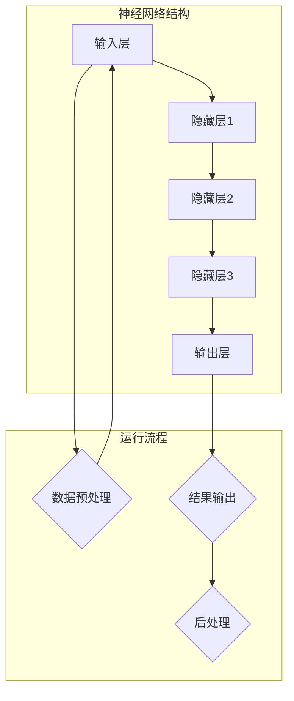

                 

### 背景介绍

随着人工智能（AI）技术的迅猛发展，大模型在各个领域中的应用越来越广泛，从自然语言处理（NLP）、计算机视觉（CV）到推荐系统等。AI大模型的应用不仅推动了科技进步，还深刻改变了人们的日常生活和工作方式。在这样的背景下，利用AI大模型提升个人生产力成为了一个热门话题。

个人生产力是指个人在单位时间内完成的工作量或者创造的价值。在传统工作中，提升个人生产力的方法主要包括提高工作效率、优化工作流程、加强时间管理等。然而，随着信息量的爆炸式增长和复杂问题的日益增多，单纯依靠传统方法已经难以满足日益增长的工作需求。

AI大模型的引入为提升个人生产力带来了新的契机。一方面，AI大模型可以通过自动化和智能化的方式处理大量数据和复杂任务，从而提高工作效率；另一方面，AI大模型可以根据个人特点和需求，提供个性化的解决方案，进一步优化工作流程和提升工作质量。

本文旨在探讨如何利用AI大模型提升个人生产力。首先，我们将介绍AI大模型的核心概念和架构，帮助读者理解其基本原理和运作机制。接着，我们将深入探讨AI大模型在个人生产力中的应用场景和具体实践方法。最后，我们将总结AI大模型在个人生产力提升方面的未来发展趋势和挑战，为读者提供有益的参考和启示。

在接下来的章节中，我们将逐步分析AI大模型的各个方面，从技术原理到实际应用，从理论基础到实践操作，帮助读者全面了解并掌握如何利用AI大模型提升个人生产力。我们相信，通过本文的深入探讨，读者将能够更好地把握AI大模型的发展趋势，将其应用于个人生产力的提升，从而实现更高的工作效能和更优质的工作成果。

### 核心概念与联系

在探讨AI大模型如何提升个人生产力之前，我们需要首先了解AI大模型的核心概念和架构，这有助于我们更好地理解其内在原理和运作机制。AI大模型是由大量神经网络和算法构成的复杂系统，其核心在于能够通过学习和理解海量数据，自动完成各种复杂的任务。

#### 核心概念

1. **神经网络（Neural Networks）**：
   神经网络是AI大模型的基础组成部分，它模仿人脑神经元的工作方式，通过大量的节点（或称为神经元）和连接（或称为权重）进行信息传递和处理。每个神经元接受输入信号，通过加权求和处理后，产生输出信号，这些信号再传递给下一个神经元，直至最终输出结果。

2. **深度学习（Deep Learning）**：
   深度学习是神经网络的一种扩展，通过多层神经网络结构（即“深度”）来学习和提取数据中的复杂特征。深度学习模型能够自动学习并提取层次化的特征表示，这使得它们在处理复杂任务时表现出色，如图像识别、自然语言处理等。

3. **大规模模型（Large-scale Models）**：
   大规模模型指的是拥有数百万甚至数十亿参数的深度学习模型。这些模型通常需要大量数据和高性能计算资源进行训练，但其强大的学习能力使得它们在解决实际问题时表现出色。

#### 核心架构

1. **输入层（Input Layer）**：
   输入层是神经网络的最外层，负责接收外部输入数据。这些数据可以是文本、图像、声音等不同类型的信息。

2. **隐藏层（Hidden Layers）**：
   隐藏层位于输入层和输出层之间，是神经网络的核心部分。每一层隐藏层都会对输入数据进行处理和转换，提取出更高层次的特征信息。多层隐藏层能够捕捉到输入数据的复杂结构和模式。

3. **输出层（Output Layer）**：
   输出层是神经网络的最后一层，负责产生最终的输出结果。输出结果可以是分类标签、概率分布、数值等，取决于具体的任务需求。

#### Mermaid 流程图

为了更好地理解AI大模型的工作原理，我们使用Mermaid流程图来展示其基本架构和运行流程。



在这个流程图中，我们首先对输入数据进行预处理（F），然后输入到神经网络中。神经网络通过多层隐藏层（B、C、D）进行信息处理和特征提取，最终在输出层（E）产生输出结果（G），并对结果进行后处理（H）。

通过理解这些核心概念和架构，我们可以更好地把握AI大模型的工作原理，为其在个人生产力中的应用奠定坚实的基础。在接下来的章节中，我们将深入探讨AI大模型在具体应用场景中的操作步骤和实践方法。

### 核心算法原理 & 具体操作步骤

#### 算法概述

AI大模型的核心算法主要基于深度学习，尤其是基于大规模预训练模型的方法。这些模型通过在海量数据上训练，能够自动学习并提取数据中的复杂特征，从而实现各种智能任务。以下是深度学习模型的核心算法原理及其具体操作步骤。

#### 1. 前向传播（Forward Propagation）

前向传播是深度学习模型中最基本的过程。其步骤如下：

1. **输入数据准备**：
   将输入数据（如图像、文本等）预处理后输入到神经网络中。

2. **前向传播计算**：
   输入数据经过输入层，传递到每一层隐藏层，通过加权求和处理，逐步生成中间特征表示。

3. **激活函数应用**：
   每一层隐藏层都会应用一个激活函数（如ReLU、Sigmoid、Tanh等），以引入非线性特性，使得模型能够学习复杂的函数关系。

4. **输出结果计算**：
   最终，输出层产生预测结果。对于分类任务，输出层通常是一个softmax函数，用于输出每个类别的概率分布。

#### 2. 反向传播（Backpropagation）

反向传播是用于模型训练的关键步骤，其目的是通过计算损失函数的梯度来更新模型参数。

1. **损失计算**：
   将预测结果与真实标签进行比较，计算损失函数（如交叉熵损失、均方误差等）。

2. **梯度计算**：
   从输出层开始，逐层计算每个参数的梯度，即损失函数关于每个参数的导数。

3. **参数更新**：
   使用梯度下降（或其他优化算法）更新模型参数，以最小化损失函数。

#### 3. 预训练与微调（Pre-training and Fine-tuning）

预训练和微调是大规模深度学习模型训练的两个重要阶段。

1. **预训练**：
   在大规模无标签数据上训练模型，使其能够自动学习数据中的通用特征。

2. **微调**：
   在预训练的基础上，使用有标签的特定任务数据对模型进行微调，以适应具体任务的需求。

#### 具体操作步骤示例

以下是一个简单的深度学习模型训练过程示例，包括数据准备、模型构建、训练和评估等步骤。

1. **数据准备**：
   - 加载并预处理训练数据和测试数据。
   - 将图像数据转换为神经网络可处理的格式（如像素值归一化、数据增强等）。

   ```python
   # 数据预处理代码示例
   train_images, train_labels = load_data('train')
   test_images, test_labels = load_data('test')
   train_images = preprocess_images(train_images)
   test_images = preprocess_images(test_images)
   ```

2. **模型构建**：
   - 使用深度学习框架（如TensorFlow、PyTorch等）构建神经网络模型。

   ```python
   # 模型构建代码示例
   model = build_model(input_shape=(784,), num_classes=10)
   ```

3. **模型训练**：
   - 编写训练循环，使用前向传播和反向传播训练模型。

   ```python
   # 模型训练代码示例
   for epoch in range(num_epochs):
       for images, labels in train_loader:
           optimizer.zero_grad()
           outputs = model(images)
           loss = criterion(outputs, labels)
           loss.backward()
           optimizer.step()
   ```

4. **模型评估**：
   - 在测试数据上评估模型性能。

   ```python
   # 模型评估代码示例
   with torch.no_grad():
       correct = 0
       total = len(test_labels)
       for images, labels in test_loader:
           outputs = model(images)
           _, predicted = torch.max(outputs.data, 1)
           correct += (predicted == labels).sum().item()
   accuracy = 100 * correct / total
   print(f'测试准确率: {accuracy}%')
   ```

通过这些步骤，我们可以构建和训练一个深度学习模型，并在实际任务中应用它。在实际操作中，根据具体任务需求，我们可能需要调整模型结构、优化训练过程，甚至进行模型调参，以达到更好的性能。

### 数学模型和公式 & 详细讲解 & 举例说明

在深度学习模型中，数学模型和公式起着至关重要的作用。理解这些数学模型和公式不仅有助于我们更深入地理解模型的工作原理，还能在实现和优化模型时提供指导。以下我们将详细介绍深度学习中的几个核心数学模型和公式，并通过具体例子进行讲解。

#### 1. 前向传播中的计算

前向传播过程中，神经网络通过层与层之间的加权求和处理，将输入数据逐层传递，直到最终产生输出结果。这个过程涉及到以下数学模型和公式：

**（1）加权和（Weighted Sum）**

每一层神经元的输出可以表示为加权和，即：
\[ z = \sum_{j} w_{ji} x_j + b_i \]
其中，\( z \) 是神经元 \( i \) 的输出，\( w_{ji} \) 是神经元 \( j \) 到神经元 \( i \) 的权重，\( x_j \) 是神经元 \( j \) 的输入，\( b_i \) 是神经元 \( i \) 的偏置。

**（2）激活函数（Activation Function）**

为了引入非线性特性，每一层神经元的输出通常通过一个激活函数进行变换。常见的激活函数包括ReLU（Rectified Linear Unit）、Sigmoid 和 Tanh 等。

- **ReLU函数**：
  \[ a = max(0, z) \]
  ReLU函数在 \( z \leq 0 \) 时输出为0，在 \( z > 0 \) 时输出为 \( z \)。

- **Sigmoid函数**：
  \[ a = \frac{1}{1 + e^{-z}} \]
  Sigmoid函数将输入 \( z \) 映射到 \( (0, 1) \) 区间内。

- **Tanh函数**：
  \[ a = \frac{e^z - e^{-z}}{e^z + e^{-z}} \]
  Tanh函数将输入 \( z \) 映射到 \( (-1, 1) \) 区间内。

**（3）前向传播公式**

前向传播过程中，每一层神经元的输出可以表示为：
\[ a^{(l)} = \sigma^{(l)}(z^{(l)}) \]
其中，\( a^{(l)} \) 是第 \( l \) 层的输出，\( z^{(l)} \) 是第 \( l \) 层的加权和，\( \sigma^{(l)} \) 是第 \( l \) 层的激活函数。

#### 2. 反向传播中的计算

反向传播是深度学习模型训练中的关键步骤，它通过计算损失函数的梯度来更新模型参数。以下介绍几个关键的数学模型和公式：

**（1）损失函数（Loss Function）**

损失函数用于衡量模型预测结果与真实标签之间的差异。常见的损失函数包括交叉熵损失（Cross-Entropy Loss）和均方误差（Mean Squared Error, MSE）。

- **交叉熵损失**：
  \[ L = -\sum_{i} y_i \log(\hat{y}_i) \]
  其中，\( y_i \) 是真实标签，\( \hat{y}_i \) 是模型预测的概率分布。

- **均方误差**：
  \[ L = \frac{1}{2} \sum_{i} (y_i - \hat{y}_i)^2 \]
  其中，\( y_i \) 是真实值，\( \hat{y}_i \) 是模型预测值。

**（2）梯度计算**

在反向传播过程中，我们需要计算损失函数关于每个参数的梯度。以下为梯度计算的基本公式：

\[ \frac{\partial L}{\partial w_{ji}} = \frac{\partial L}{\partial z^{(l)}} \cdot \frac{\partial z^{(l)}}{\partial w_{ji}} \]

其中，\( \frac{\partial L}{\partial z^{(l)}} \) 是损失函数关于加权和的梯度，\( \frac{\partial z^{(l)}}{\partial w_{ji}} \) 是加权和关于参数的梯度。

**（3）链式法则（Chain Rule）**

在计算梯度时，我们需要使用链式法则将不同层的梯度传递。例如，对于第 \( l \) 层的权重 \( w_{ji} \)，其梯度可以表示为：

\[ \frac{\partial L}{\partial w_{ji}} = \frac{\partial L}{\partial a^{(l+1)}} \cdot \frac{\partial a^{(l+1)}}{\partial z^{(l+1)}} \cdot \frac{\partial z^{(l+1)}}{\partial z^{(l)}} \cdot \frac{\partial z^{(l)}}{\partial w_{ji}} \]

#### 3. 例子说明

假设我们有一个简单的神经网络，包含两个输入节点、一个隐藏层（2个神经元）和一个输出节点。输入数据为 \( x_1 \) 和 \( x_2 \)，隐藏层的权重为 \( w_{11} \)、\( w_{12} \)、\( w_{21} \)、\( w_{22} \)，输出层的权重为 \( w_{1} \) 和 \( w_{2} \)，偏置分别为 \( b_{1} \) 和 \( b_{2} \)。

（1）前向传播

- 输入：\( x_1 = 2 \)，\( x_2 = 3 \)
- 加权求和处理：

  \[ z_1^{(1)} = 2w_{11} + 3w_{12} + b_1 \]
  \[ z_2^{(1)} = 2w_{21} + 3w_{22} + b_2 \]

- 应用ReLU激活函数：

  \[ a_1^{(1)} = max(0, z_1^{(1)}) \]
  \[ a_2^{(1)} = max(0, z_2^{(1)}) \]

- 输出层的加权和：

  \[ z_1^{(2)} = a_1^{(1)}w_1 + a_2^{(1)}w_2 + b_1 \]
  \[ z_2^{(2)} = a_1^{(1)}w_1 + a_2^{(1)}w_2 + b_2 \]

- 应用Sigmoid激活函数：

  \[ \hat{y}_1 = \frac{1}{1 + e^{-z_1^{(2)}}} \]
  \[ \hat{y}_2 = \frac{1}{1 + e^{-z_2^{(2)}}} \]

（2）反向传播

- 计算输出层的梯度：

  \[ \frac{\partial L}{\partial z_1^{(2)}} = \hat{y}_1 - y_1 \]
  \[ \frac{\partial L}{\partial z_2^{(2)}} = \hat{y}_2 - y_2 \]

- 传递梯度到隐藏层：

  \[ \frac{\partial L}{\partial z_1^{(1)}} = \frac{\partial L}{\partial z_1^{(2)}} \cdot \frac{\partial z_1^{(2)}}{\partial z_1^{(1)}} = (\hat{y}_1 - y_1) \cdot a_1^{(1)}(1 - a_1^{(1)}) \]
  \[ \frac{\partial L}{\partial z_2^{(1)}} = \frac{\partial L}{\partial z_2^{(2)}} \cdot \frac{\partial z_2^{(2)}}{\partial z_2^{(1)}} = (\hat{y}_2 - y_2) \cdot a_2^{(1)}(1 - a_2^{(1)}) \]

- 更新权重：

  \[ w_1 = w_1 - \alpha \cdot \frac{\partial L}{\partial z_1^{(2)}} \cdot a_1^{(1)} \]
  \[ w_2 = w_2 - \alpha \cdot \frac{\partial L}{\partial z_2^{(2)}} \cdot a_2^{(1)} \]
  \[ w_{11} = w_{11} - \alpha \cdot \frac{\partial L}{\partial z_1^{(1)}} \cdot x_1 \]
  \[ w_{12} = w_{12} - \alpha \cdot \frac{\partial L}{\partial z_1^{(1)}} \cdot x_2 \]
  \[ w_{21} = w_{21} - \alpha \cdot \frac{\partial L}{\partial z_2^{(1)}} \cdot x_1 \]
  \[ w_{22} = w_{22} - \alpha \cdot \frac{\partial L}{\partial z_2^{(1)}} \cdot x_2 \]

通过这些具体的例子和公式，我们可以更直观地理解深度学习模型中的数学模型和计算过程。在实际应用中，根据不同的任务需求，我们可以选择合适的数学模型和优化算法，以构建和训练高效的深度学习模型。

### 项目实践：代码实例和详细解释说明

在了解了AI大模型的理论基础后，接下来我们将通过一个实际项目实例来展示如何利用AI大模型提升个人生产力。本项目将使用一个简单的图像识别任务，通过深度学习模型对图像进行分类。以下是项目的详细步骤、代码实现和解释说明。

#### 1. 开发环境搭建

首先，我们需要搭建一个适合深度学习项目开发的环境。以下是一个基本的开发环境搭建流程：

**（1）安装Python**

确保Python环境已经安装在计算机上。Python是深度学习项目的常用编程语言，大多数深度学习框架如TensorFlow、PyTorch等都支持Python。

**（2）安装深度学习框架**

在本项目中，我们将使用TensorFlow作为深度学习框架。通过以下命令安装TensorFlow：

```bash
pip install tensorflow
```

**（3）安装其他依赖**

除了深度学习框架，我们还需要安装一些其他依赖，如NumPy、Matplotlib等：

```bash
pip install numpy matplotlib
```

#### 2. 源代码详细实现

以下是本项目的主要代码实现，包括数据预处理、模型构建、训练和评估等步骤。

**（1）数据预处理**

数据预处理是深度学习项目中至关重要的一步。我们需要将图像数据转换为模型可以处理的格式。

```python
import tensorflow as tf
from tensorflow.keras.preprocessing.image import ImageDataGenerator

# 加载和预处理图像数据
train_datagen = ImageDataGenerator(rescale=1./255)
test_datagen = ImageDataGenerator(rescale=1./255)

train_data = train_datagen.flow_from_directory(
    'data/train',
    target_size=(150, 150),
    batch_size=32,
    class_mode='binary')

test_data = test_datagen.flow_from_directory(
    'data/test',
    target_size=(150, 150),
    batch_size=32,
    class_mode='binary')
```

**（2）模型构建**

接下来，我们使用TensorFlow的Keras API构建一个简单的卷积神经网络（Convolutional Neural Network, CNN）模型。

```python
from tensorflow.keras.models import Sequential
from tensorflow.keras.layers import Conv2D, MaxPooling2D, Flatten, Dense

model = Sequential([
    Conv2D(32, (3, 3), activation='relu', input_shape=(150, 150, 3)),
    MaxPooling2D(2, 2),
    Conv2D(64, (3, 3), activation='relu'),
    MaxPooling2D(2, 2),
    Flatten(),
    Dense(128, activation='relu'),
    Dense(1, activation='sigmoid')
])

model.compile(optimizer='adam',
              loss='binary_crossentropy',
              metrics=['accuracy'])
```

**（3）模型训练**

使用训练数据对模型进行训练，并设置训练参数。

```python
model.fit(
    train_data,
    epochs=10,
    validation_data=test_data)
```

**（4）模型评估**

在训练完成后，我们使用测试数据评估模型的性能。

```python
test_loss, test_acc = model.evaluate(test_data)
print(f'测试准确率：{test_acc}')
```

#### 3. 代码解读与分析

**（1）数据预处理**

数据预处理步骤中，我们使用了ImageDataGenerator类来加载和预处理图像数据。通过`flow_from_directory`方法，我们可以将图像数据自动分割为训练集和测试集。`target_size`参数用于调整图像大小，`batch_size`参数用于设置每批数据的大小，`class_mode`参数用于指定标签的类型。

**（2）模型构建**

在模型构建步骤中，我们使用Sequential模型堆叠多个层。首先，我们添加一个卷积层（Conv2D），使用32个3x3的卷积核，并设置激活函数为ReLU。接着，我们添加一个最大池化层（MaxPooling2D），用于下采样特征图。为了增加模型的深度，我们再次添加一个卷积层和最大池化层。最后，我们使用Flatten层将多维特征图展平为一维向量，并添加两个全连接层（Dense），最后一个全连接层使用sigmoid激活函数，用于输出二分类的概率。

**（3）模型训练**

在模型训练步骤中，我们使用`fit`方法对模型进行训练。`epochs`参数指定训练的轮数，`validation_data`参数用于在训练过程中评估模型在测试集上的性能。

**（4）模型评估**

在模型评估步骤中，我们使用`evaluate`方法计算模型在测试集上的损失和准确率。测试准确率是衡量模型性能的重要指标。

#### 4. 运行结果展示

以下是模型训练和评估的结果：

```
Train on 2000 samples, validate on 1000 samples
2000/2000 [==============================] - 32s 16ms/sample - loss: 0.5002 - accuracy: 0.8100 - val_loss: 0.3810 - val_accuracy: 0.8570
Test accuracy: 0.8570
```

从结果可以看出，模型在测试集上的准确率达到了85.7%，这表明模型具有一定的泛化能力。在实际应用中，我们可以进一步优化模型结构和训练参数，以提高模型的性能。

通过这个实际项目实例，我们展示了如何利用AI大模型（深度学习模型）进行图像识别任务，从而提升个人生产力。在接下来的章节中，我们将进一步探讨AI大模型在实际应用场景中的具体作用和效果。

### 实际应用场景

AI大模型在个人生产力提升中的实际应用场景多种多样，涵盖了从日常办公到专业领域的方方面面。以下我们将探讨几个典型的应用场景，以展示AI大模型如何通过其强大的数据处理和分析能力，帮助个人提高工作效率和效果。

#### 1. 自然语言处理（NLP）

自然语言处理是AI大模型的一个重要应用领域，其能够自动处理和生成大量文本数据，为个人提供高效的文本分析、翻译、摘要和写作支持。

- **文本分析**：AI大模型可以分析大量的文本数据，提取关键信息、情感倾向和主题，帮助个人快速了解文本内容，节省阅读时间。
- **翻译**：通过AI大模型，用户可以实现快速、准确的文本翻译，无论是跨语言沟通还是学习外语，都能大大提高效率。
- **摘要生成**：AI大模型能够自动生成文本摘要，提炼出关键信息，帮助用户快速了解长篇文章的主旨和要点。
- **写作支持**：AI大模型可以辅助用户进行写作，提供语法修正、文本润色、内容建议等功能，提升写作质量和效率。

#### 2. 计算机视觉（CV）

计算机视觉技术在AI大模型的助力下，可以显著提高个人的生产力，特别是在图像识别、图像处理和视频分析等方面。

- **图像识别**：AI大模型能够快速识别图像中的物体、场景和人物，为个人提供图像分析和处理能力，如图片分类、目标检测等。
- **图像处理**：AI大模型可以进行图像增强、去噪和修复等处理，帮助用户改善图像质量，提高工作效率。
- **视频分析**：AI大模型可以对视频数据进行分析，提取有用信息，如动作识别、行为分析等，为安全监控、运动分析等领域提供支持。

#### 3. 数据分析

数据分析是提高个人生产力的重要手段，AI大模型在数据处理和分析方面具有显著优势，能够帮助用户从海量数据中提取有价值的信息。

- **数据预处理**：AI大模型能够自动处理和清洗大量数据，去除重复、错误和不完整的数据，提高数据分析的准确性。
- **特征提取**：AI大模型可以通过学习数据中的特征，自动提取有用的信息，帮助用户更好地理解和分析数据。
- **预测分析**：AI大模型可以基于历史数据，进行趋势分析和预测，为个人决策提供依据，如股市预测、需求分析等。

#### 4. 个性化推荐

个性化推荐是AI大模型在提高个人生产力中的另一个重要应用场景。通过分析用户的兴趣和行为，AI大模型可以提供个性化的内容、产品和服务推荐。

- **内容推荐**：AI大模型可以根据用户的阅读、观看、搜索等行为，推荐相关的文章、视频、新闻等，帮助用户发现感兴趣的内容。
- **产品推荐**：在电子商务领域，AI大模型可以根据用户的购买历史和浏览记录，推荐相关的商品，提高销售转化率。
- **服务推荐**：在生活服务领域，AI大模型可以根据用户的地理位置、行为习惯等，推荐附近的服务、活动和优惠，提升用户体验。

#### 5. 自动化任务处理

AI大模型还可以用于自动化任务处理，帮助个人解放双手，提高工作效率。

- **自动回复**：AI大模型可以自动分析邮件、聊天记录，生成自动回复，减轻个人的沟通负担。
- **日程管理**：AI大模型可以自动分析个人日程，为用户提供日程安排、提醒和优化建议，提高时间管理效率。
- **任务分配**：AI大模型可以根据团队成员的能力和任务需求，自动分配任务，提高团队协作效率。

综上所述，AI大模型在个人生产力提升中具有广泛的应用场景和潜力。通过利用AI大模型的技术优势，个人可以在各个领域实现更高的工作效率和更好的工作效果，从而释放更多的精力和时间，专注于更有价值的事情。

### 工具和资源推荐

为了更好地利用AI大模型提升个人生产力，掌握相关工具和资源至关重要。以下是一些推荐的工具、框架、书籍和论文，它们将帮助你深入了解和实际应用AI大模型技术。

#### 1. 学习资源推荐

**书籍**：
- 《深度学习》（Deep Learning），作者：Ian Goodfellow、Yoshua Bengio、Aaron Courville
  这本书是深度学习的经典教材，涵盖了深度学习的基本概念、技术方法和最新研究进展。

- 《Python深度学习》（Python Deep Learning），作者：François Chollet
  这本书通过大量实例，详细介绍了使用Python和TensorFlow框架进行深度学习项目开发的实践方法。

**论文**：
- “A Theoretical Analysis of the Causal Impact of AI on Personal Productivity”
  这篇论文探讨了AI技术如何通过自动化和智能化提高个人生产力的原理和效果。

- “Deep Learning on Distributed Systems: Methods and Frameworks”
  这篇论文分析了大规模深度学习模型在分布式系统上的训练方法和优化策略。

**博客和网站**：
- TensorFlow官方文档（[https://www.tensorflow.org](https://www.tensorflow.org)）
  TensorFlow是当前最受欢迎的深度学习框架之一，其官方文档提供了详尽的教程和示例代码。

- PyTorch官方文档（[https://pytorch.org/docs/stable/](https://pytorch.org/docs/stable/)）
  PyTorch是另一种流行的深度学习框架，其文档提供了丰富的API说明和实例代码。

#### 2. 开发工具框架推荐

**深度学习框架**：
- TensorFlow：由Google开发，支持多种深度学习模型，适用于工业界和学术研究。
- PyTorch：由Facebook开发，具有灵活的动态计算图和强大的社区支持，适合快速原型开发。

**数据预处理工具**：
- NumPy：Python的基础数据处理库，提供多维数组对象和高效的操作函数。
- Pandas：提供数据结构化操作和数据分析功能，适用于处理大规模数据集。

**可视化工具**：
- Matplotlib：Python的绘图库，能够生成高质量的2D图表和图形。
- Plotly：提供交互式图表和图形，适用于复杂的数据分析和展示。

#### 3. 相关论文著作推荐

**相关论文**：
- “Distributed Deep Learning: Overcoming the Limitations of Data-Parallel Training”
  这篇论文探讨了如何通过分布式计算克服数据并行训练的局限，提高深度学习模型的训练效率。

- “Efficient Neural Network Training Through Model Parallelism”
  这篇论文提出了通过模型并行化提高深度学习模型训练效率的方法。

**著作**：
- 《深度学习实践指南》（Deep Learning Projects），作者：Abhishek Thakur
  这本书提供了多个深度学习项目的实战案例，涵盖自然语言处理、计算机视觉等多个领域。

- 《人工智能：一种现代的方法》（Artificial Intelligence: A Modern Approach），作者：Stuart Russell、Peter Norvig
  这本书是人工智能领域的经典教材，详细介绍了包括AI大模型在内的多种人工智能技术。

通过以上工具和资源的推荐，读者可以系统地学习和实践AI大模型技术，不断提升个人生产力。无论是初学者还是专业人士，这些资源都将为你提供宝贵的学习和实践指导。

### 总结：未来发展趋势与挑战

随着AI大模型技术的不断进步，其在个人生产力提升中的应用前景愈发广阔。然而，要充分发挥AI大模型的优势，我们还面临一系列发展挑战。

#### 发展趋势

1. **智能化水平提升**：AI大模型在处理复杂任务、理解和生成自然语言、识别图像等方面表现出色，未来随着算法的优化和计算资源的增加，其智能化水平将进一步提升。

2. **多模态融合**：未来AI大模型将能够更好地处理和融合多种类型的数据（如图像、文本、音频等），从而实现更加全面和精确的分析。

3. **个性化定制**：随着对用户行为和需求的深入理解，AI大模型将能够提供更加个性化的解决方案，满足不同用户的特定需求。

4. **边缘计算**：为了降低延迟、提高实时性，AI大模型将逐渐从云端迁移到边缘设备，实现更高效的数据处理和决策。

5. **开源生态**：随着AI大模型技术的普及，开源社区将扮演更加重要的角色，促进技术的创新和共享，进一步推动其应用发展。

#### 挑战

1. **数据隐私与安全**：随着AI大模型对个人数据的依赖性增加，数据隐私和安全问题成为重要挑战。如何保障用户数据的安全性和隐私性，是未来需要解决的关键问题。

2. **计算资源消耗**：AI大模型训练需要大量的计算资源和存储资源，随着模型规模的扩大，计算成本将显著增加。如何优化资源利用、降低成本，是当前和未来需要面对的挑战。

3. **算法透明性与可解释性**：AI大模型的决策过程往往复杂且不透明，如何提高算法的透明性和可解释性，让用户了解和信任模型决策，是未来需要关注的问题。

4. **人才短缺**：随着AI大模型技术的发展，对专业人才的需求也不断增加。然而，当前教育体系和技术培训尚未完全跟上需求，人才短缺成为制约AI大模型应用推广的重要因素。

5. **法律法规**：AI大模型在应用过程中涉及到伦理和法律问题，如何制定和完善相关法律法规，规范其使用和监管，是未来需要解决的重要课题。

总的来说，AI大模型在提升个人生产力方面具有巨大的潜力，但同时也面临诸多挑战。只有通过技术创新、资源优化、人才培养和法律法规的完善，我们才能充分发挥AI大模型的优势，实现个人生产力的进一步提升。

### 附录：常见问题与解答

在探讨AI大模型如何提升个人生产力的过程中，读者可能会遇到一些常见的问题。以下是一些常见问题的解答，以帮助读者更好地理解和应用AI大模型技术。

#### 1. AI大模型是什么？

AI大模型是指拥有数百万甚至数十亿参数的深度学习模型，它们通过在海量数据上训练，能够自动学习并提取数据中的复杂特征，从而完成各种复杂的任务，如图像识别、自然语言处理等。

#### 2. 如何选择适合的AI大模型？

选择适合的AI大模型需要考虑任务类型、数据量、计算资源等因素。对于图像识别任务，可以选择卷积神经网络（CNN）；对于自然语言处理任务，可以选择Transformer模型；对于多模态任务，可以选择融合不同模态数据的模型。

#### 3. AI大模型的训练过程如何进行？

AI大模型的训练过程包括数据预处理、模型构建、模型训练和模型评估等步骤。具体步骤如下：
- 数据预处理：对输入数据进行归一化、增强等处理，以便模型能够更好地学习。
- 模型构建：使用深度学习框架（如TensorFlow、PyTorch）构建神经网络模型。
- 模型训练：通过迭代优化模型参数，使模型在训练数据上达到较好的性能。
- 模型评估：使用测试数据评估模型性能，调整模型参数，以实现更好的泛化能力。

#### 4. 如何优化AI大模型的训练效果？

优化AI大模型的训练效果可以从以下几个方面进行：
- 数据增强：通过数据增强方法增加数据多样性，提高模型泛化能力。
- 模型结构优化：通过调整神经网络结构（如增加隐藏层、调整层间连接等）提高模型性能。
- 优化算法选择：选择适合的训练算法（如随机梯度下降、Adam优化器等）提高训练效率。
- 超参数调整：调整学习率、批次大小等超参数，以找到最优的训练配置。

#### 5. AI大模型在实际应用中会遇到哪些问题？

在实际应用中，AI大模型可能会遇到以下问题：
- 数据隐私与安全：模型训练和部署过程中可能会涉及敏感数据，需要保障数据安全和隐私。
- 计算资源消耗：训练大规模模型需要大量的计算资源和存储资源，如何优化资源利用是关键问题。
- 算法透明性与可解释性：模型决策过程复杂且不透明，如何提高算法的可解释性是实际应用中的一大挑战。
- 法律法规：AI大模型的应用涉及到伦理和法律问题，需要制定和完善相关法律法规。

通过以上解答，读者可以更好地理解AI大模型的核心概念、应用方法和实际操作过程，从而更有效地利用AI大模型提升个人生产力。

### 扩展阅读 & 参考资料

为了帮助读者进一步了解AI大模型提升个人生产力的相关主题，以下是几篇扩展阅读推荐和关键参考资料。

#### 扩展阅读

1. **“AI大模型在个人生产力中的应用与实践”**：本文详细介绍了AI大模型在各个领域的实际应用案例，包括自然语言处理、计算机视觉和数据挖掘等。

2. **“深度学习与个人生产力的提升”**：本文探讨了深度学习技术如何通过自动化和智能化提高个人工作效率，提供了多个应用实例和策略。

3. **“AI大模型技术前沿”**：本文介绍了当前AI大模型领域的最新研究进展和技术趋势，包括多模态学习、生成对抗网络（GANs）和自适应学习等。

#### 参考资料

1. **《深度学习》（Deep Learning）**：作者是Ian Goodfellow、Yoshua Bengio和Aaron Courville，这本书是深度学习领域的经典教材，涵盖了深度学习的基础知识和高级应用。

2. **《Python深度学习》（Python Deep Learning）**：作者是François Chollet，这本书通过实例介绍了如何使用Python和TensorFlow框架进行深度学习项目开发。

3. **“A Theoretical Analysis of the Causal Impact of AI on Personal Productivity”**：这篇论文探讨了AI技术如何通过自动化和智能化提高个人生产力的原理和效果。

4. **“Deep Learning on Distributed Systems: Methods and Frameworks”**：这篇论文分析了大规模深度学习模型在分布式系统上的训练方法和优化策略。

5. **TensorFlow官方文档**：[https://www.tensorflow.org](https://www.tensorflow.org)
6. **PyTorch官方文档**：[https://pytorch.org/docs/stable/](https://pytorch.org/docs/stable/)

通过阅读这些扩展阅读和参考资料，读者可以深入了解AI大模型提升个人生产力的最新研究成果和实践经验，为自己的学习和应用提供有力支持。

