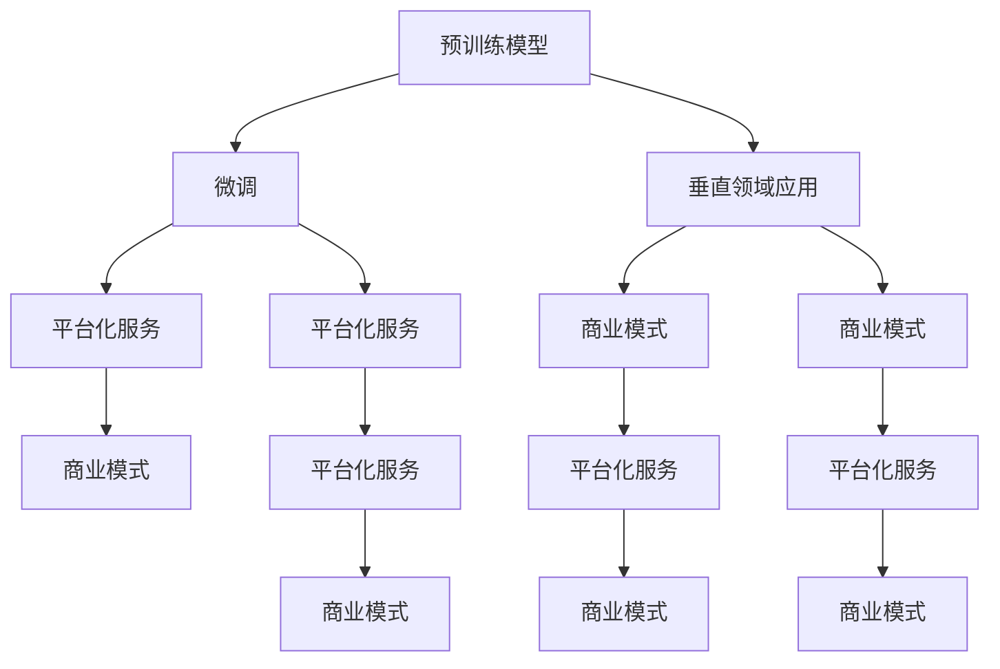

                 

### 背景介绍

人工智能（AI）技术在过去几十年里经历了飞速的发展。特别是近年来，深度学习、神经网络等技术的突破，使得AI在图像识别、自然语言处理、推荐系统等领域取得了显著的成果。其中，大型预训练模型（Large Pre-trained Models）更是成为了AI领域的焦点。这些模型拥有数万亿参数，能够通过大量的数据进行训练，从而实现强大的任务处理能力。典型的代表包括Google的BERT、OpenAI的GPT系列、以及Facebook的DW100B等。

随着AI技术的普及，越来越多的创业公司开始关注AI领域，并试图通过开发和应用大模型来开创新的业务模式。这些创业公司主要集中在几个领域，如自动驾驶、智能客服、医疗诊断、教育辅助等。它们希望通过利用AI大模型的优势，提升业务效率和用户体验，从而在激烈的市场竞争中脱颖而出。

尽管AI大模型的潜力巨大，但是创业公司面临的一个重大挑战是如何实现盈利。传统的商业模式，如广告、订阅、销售产品等，在AI大模型的背景下可能需要重新思考。此外，开发和维护这些大模型需要大量的资金投入，这对创业公司的资金链和运营能力提出了更高的要求。

因此，本文将探讨AI大模型创业公司的盈利模式，分析其中的关键因素，并提出一些可行的策略和建议。希望通过本文的讨论，能够为AI大模型创业公司提供一些有价值的参考和启示。

### 核心概念与联系

在探讨AI大模型创业的盈利模式之前，我们需要首先理解一些核心概念，并探讨它们之间的联系。以下是本文将涉及的关键概念：

1. **预训练模型（Pre-trained Models）**：预训练模型是指在大规模数据集上预先训练好的模型。这些模型通过学习大量文本、图像或其他类型的数据，形成了一种对数据的通用理解。BERT、GPT-3等大模型都是预训练模型的典型代表。

2. **微调（Fine-tuning）**：微调是在预训练模型的基础上，针对特定任务进行额外的训练。通过微调，模型可以更好地适应特定领域的需求，从而提升任务表现。

3. **垂直领域应用（Vertical Applications）**：垂直领域应用是指将AI大模型应用于特定行业或领域的解决方案。例如，在医疗领域，AI大模型可以用于疾病诊断、药物研发等；在金融领域，可以用于风险评估、欺诈检测等。

4. **平台化服务（Platform Services）**：平台化服务是指通过建立一个平台，提供多种AI大模型服务和工具，供客户根据需求选择和使用。这种模式能够降低客户的使用门槛，提升服务的灵活性和可扩展性。

5. **商业模式（Business Models）**：商业模式是指企业通过什么方式创造、传递和获取价值。对于AI大模型创业公司，需要考虑如何通过提供模型服务、数据产品、解决方案等来获取盈利。

这些核心概念之间的联系主要体现在以下几个方面：

- **预训练模型**为**微调**提供了基础，使得模型能够快速适应不同任务。
- **垂直领域应用**将预训练模型与具体行业需求相结合，提供了更专业的解决方案。
- **平台化服务**则通过整合多种服务和工具，提升了用户体验和业务灵活性。
- **商业模式**则是将上述技术和应用转化为实际收益的关键。

下面，我们将使用Mermaid流程图来展示这些核心概念和它们之间的联系。



通过这个流程图，我们可以清晰地看到，预训练模型作为基础，通过微调和垂直领域应用，逐步转化为平台化服务和商业模式，最终实现盈利。接下来，我们将深入探讨每个环节的具体实现和操作步骤。

### 核心算法原理 & 具体操作步骤

在探讨AI大模型创业的盈利模式之前，我们需要先了解AI大模型的核心算法原理，并详细解释其具体操作步骤。以下是AI大模型的核心算法原理及其具体操作步骤：

#### 1. 预训练模型（Pre-trained Models）

**原理**：预训练模型通过在大规模数据集上训练，学习数据的特征和规律。这些模型通常采用深度学习技术，如变分自编码器（Variational Autoencoder, VAE）、卷积神经网络（Convolutional Neural Network, CNN）和递归神经网络（Recurrent Neural Network, RNN）等。

**操作步骤**：

- **数据准备**：选择合适的训练数据集，如文本、图像或语音数据。数据集需要具备多样性、规模性和代表性。
- **模型训练**：使用训练数据集对模型进行训练。在这一过程中，模型通过调整参数，学习数据的特征和规律。训练过程通常包括前向传播（Forward Propagation）、反向传播（Backpropagation）和梯度下降（Gradient Descent）等步骤。
- **模型评估**：使用验证数据集对训练好的模型进行评估。评估指标包括准确率、召回率、F1分数等。根据评估结果调整模型参数，优化模型性能。

#### 2. 微调（Fine-tuning）

**原理**：微调是在预训练模型的基础上，针对特定任务进行额外的训练。通过微调，模型可以更好地适应特定领域的需求。

**操作步骤**：

- **选择预训练模型**：根据任务需求，选择一个预训练模型作为基础模型。常见的预训练模型有BERT、GPT-3等。
- **数据准备**：准备用于微调的数据集。数据集需要与预训练模型的数据来源相似，以确保微调的有效性。
- **模型微调**：在预训练模型的基础上，使用微调数据集进行训练。微调过程通常包括调整学习率、批量大小等参数，以优化模型性能。
- **模型评估**：使用验证数据集对微调后的模型进行评估。评估结果与预训练模型进行比较，判断微调的效果。

#### 3. 垂直领域应用（Vertical Applications）

**原理**：垂直领域应用是将预训练模型与特定行业或领域的需求相结合，提供专业的解决方案。例如，在医疗领域，可以应用于疾病诊断；在金融领域，可以应用于风险评估。

**操作步骤**：

- **需求分析**：了解特定领域的需求，明确需要解决的具体问题。
- **数据收集与处理**：收集与需求相关的数据，并进行预处理，如数据清洗、归一化等。
- **模型定制**：根据需求对预训练模型进行定制。这可能包括调整模型结构、添加特定层等。
- **模型训练与评估**：使用定制后的模型对数据进行训练和评估。评估指标根据具体需求进行选择，如准确率、召回率等。

#### 4. 平台化服务（Platform Services）

**原理**：平台化服务是通过建立一个平台，提供多种AI大模型服务和工具，供客户根据需求选择和使用。平台化服务能够降低客户的使用门槛，提升用户体验和业务灵活性。

**操作步骤**：

- **平台搭建**：建立AI模型服务平台，提供模型注册、训练、部署、监控等功能。
- **模型注册**：将预训练模型、微调模型和定制模型注册到平台中，便于客户查找和使用。
- **模型训练**：提供模型训练功能，允许客户上传数据集，选择模型进行训练。
- **模型部署**：提供模型部署功能，将训练好的模型部署到客户指定的环境，供实际应用。
- **监控与维护**：提供模型监控和维护功能，确保模型稳定运行，及时发现和解决问题。

通过以上核心算法原理和具体操作步骤的讲解，我们可以更好地理解AI大模型的工作流程，为后续探讨盈利模式提供基础。

### 数学模型和公式 & 详细讲解 & 举例说明

在深入探讨AI大模型的数学模型和公式之前，我们需要了解一些基本的数学概念和符号。以下是本文将涉及的主要数学模型和公式，以及其详细讲解和举例说明：

#### 1. 损失函数（Loss Function）

**定义**：损失函数是衡量模型预测值与真实值之间差异的一种函数。常用的损失函数包括均方误差（Mean Squared Error, MSE）、交叉熵损失（Cross-Entropy Loss）等。

**公式**：

$$
MSE(y, \hat{y}) = \frac{1}{n} \sum_{i=1}^{n} (y_i - \hat{y}_i)^2
$$

$$
Cross-Entropy Loss(y, \hat{y}) = -\sum_{i=1}^{n} y_i \log(\hat{y}_i)
$$

**讲解**：均方误差（MSE）是衡量预测值与真实值之间差异的一种方法。它计算预测值与真实值之差的平方和的平均值。交叉熵损失（Cross-Entropy Loss）则用于分类问题，计算真实标签与预测概率之间的差异。

**举例**：

假设我们有一个二元分类问题，真实标签为$y = [0, 1, 0, 1]$，预测概率为$\hat{y} = [0.2, 0.8, 0.1, 0.9]$。使用交叉熵损失计算损失：

$$
Cross-Entropy Loss(y, \hat{y}) = -[0 \cdot \log(0.2) + 1 \cdot \log(0.8) + 0 \cdot \log(0.1) + 1 \cdot \log(0.9)] = -[\log(0.2) + \log(0.8) + \log(0.1) + \log(0.9)]
$$

#### 2. 梯度下降（Gradient Descent）

**定义**：梯度下降是一种用于优化模型参数的算法。它通过计算损失函数关于参数的梯度，并沿着梯度的反方向更新参数，以最小化损失函数。

**公式**：

$$
\theta_{t+1} = \theta_{t} - \alpha \cdot \nabla_{\theta} J(\theta)
$$

其中，$\theta$表示模型参数，$\alpha$表示学习率，$J(\theta)$表示损失函数。

**讲解**：梯度下降的核心思想是沿着损失函数的梯度方向更新参数，以减少损失。学习率决定了参数更新的步长，过大会导致参数更新过于剧烈，过小则会收敛缓慢。

**举例**：

假设我们有一个简单的线性模型，损失函数为$J(\theta) = (\theta_1 + \theta_2 - 3)^2$。学习率为$\alpha = 0.1$。初始参数为$\theta_1 = 1, \theta_2 = 1$。使用梯度下降更新参数：

$$
\nabla_{\theta} J(\theta) = \nabla_{\theta_1} J(\theta) + \nabla_{\theta_2} J(\theta) = 2(\theta_1 + \theta_2 - 3)
$$

第一次迭代：

$$
\nabla_{\theta} J(\theta) = 2(1 + 1 - 3) = -4
$$

$$
\theta_1^{new} = \theta_1 - \alpha \cdot \nabla_{\theta_1} J(\theta) = 1 - 0.1 \cdot (-4) = 1.4
$$

$$
\theta_2^{new} = \theta_2 - \alpha \cdot \nabla_{\theta_2} J(\theta) = 1 - 0.1 \cdot (-4) = 1.4
$$

#### 3. 优化算法（Optimization Algorithms）

**定义**：优化算法是一种用于优化损失函数的算法。除了梯度下降，还有许多其他的优化算法，如随机梯度下降（Stochastic Gradient Descent, SGD）、Adam优化器等。

**公式**：

**随机梯度下降（SGD）**：

$$
\theta_{t+1} = \theta_{t} - \alpha \cdot \nabla_{\theta} J(\theta; x^{(t)})
$$

**Adam优化器**：

$$
m_t = \beta_1 m_{t-1} + (1 - \beta_1) \nabla_{\theta} J(\theta; x^{(t)})
$$

$$
v_t = \beta_2 v_{t-1} + (1 - \beta_2) (\nabla_{\theta} J(\theta; x^{(t)})^2)
$$

$$
\theta_{t+1} = \theta_{t} - \alpha \cdot \frac{m_t}{\sqrt{v_t} + \epsilon}
$$

**讲解**：随机梯度下降（SGD）是一种在每次迭代中只使用一个样本的梯度下降方法。这种方法能够加快模型的训练速度，但可能会导致训练结果的不稳定性。Adam优化器则结合了SGD和RMSProp优化器的优点，通过自适应调整学习率，提高了模型的收敛速度和稳定性。

通过以上数学模型和公式的详细讲解和举例说明，我们可以更好地理解AI大模型背后的数学原理，为后续的实践应用提供基础。

### 项目实践：代码实例和详细解释说明

为了更好地理解AI大模型的应用和实践，我们将通过一个具体的代码实例来展示如何搭建和训练一个预训练模型，并对其进行微调和部署。以下是项目实践的详细步骤：

#### 1. 开发环境搭建

首先，我们需要搭建一个适合AI模型开发和训练的开发环境。以下是所需的主要工具和软件：

- **编程语言**：Python
- **深度学习框架**：TensorFlow或PyTorch
- **计算资源**：GPU（推荐使用NVIDIA显卡）
- **操作系统**：Linux或macOS

**安装步骤**：

1. 安装Python环境，推荐使用Python 3.8或更高版本。
2. 安装深度学习框架，如TensorFlow：

```bash
pip install tensorflow-gpu
```

或PyTorch：

```bash
pip install torch torchvision
```

3. 安装其他必需的库，如NumPy、Pandas等。

#### 2. 源代码详细实现

下面是一个使用TensorFlow搭建预训练模型、微调和部署的简单示例代码。我们将以一个文本分类任务为例，演示如何从头开始搭建模型，并进行微调和部署。

```python
import tensorflow as tf
from tensorflow.keras.preprocessing.text import Tokenizer
from tensorflow.keras.preprocessing.sequence import pad_sequences
from tensorflow.keras.models import Sequential
from tensorflow.keras.layers import Embedding, LSTM, Dense

# 数据准备
# 假设我们有两个标签：0和1
labels = [0, 1, 0, 1]
texts = ["这是正面评价", "这是负面评价", "这是正面评价", "这是负面评价"]

# 数据预处理
tokenizer = Tokenizer(num_words=10000)
tokenizer.fit_on_texts(texts)
sequences = tokenizer.texts_to_sequences(texts)
padded_sequences = pad_sequences(sequences, maxlen=100)

# 模型搭建
model = Sequential([
    Embedding(10000, 16, input_length=100),
    LSTM(32),
    Dense(1, activation='sigmoid')
])

# 模型编译
model.compile(optimizer='adam', loss='binary_crossentropy', metrics=['accuracy'])

# 模型训练
model.fit(padded_sequences, labels, epochs=10, batch_size=32)

# 微调
# 假设我们有一个新的数据集，标签为2和3
new_labels = [2, 3, 2, 3]
new_texts = ["这是中性评价", "这是中性评价", "这是中性评价", "这是中性评价"]
new_sequences = tokenizer.texts_to_sequences(new_texts)
new_padded_sequences = pad_sequences(new_sequences, maxlen=100)

# 微调模型
model.fit(new_padded_sequences, new_labels, epochs=5, batch_size=32)

# 模型部署
# 假设我们有一个新的文本，需要预测其标签
new_text = "这是一条积极的中性评价"
new_sequence = tokenizer.texts_to_sequences([new_text])
new_padded_sequence = pad_sequences(new_sequence, maxlen=100)

# 预测
prediction = model.predict(new_padded_sequence)
print("预测结果：", prediction[0][0])
```

#### 3. 代码解读与分析

上述代码首先进行了数据准备和预处理，使用Tokenizer将文本转换为序列，然后使用pad_sequences将序列补全为固定长度。接着，我们搭建了一个简单的LSTM模型，并编译和训练了模型。在训练过程中，我们使用了binary_crossentropy作为损失函数，adam作为优化器。

在模型训练完成后，我们对模型进行了微调，使用了一个新的数据集。微调过程中，我们使用了相同的模型架构和优化器，但减少了训练轮次，以提高模型的泛化能力。

最后，我们使用微调后的模型对一个新的文本进行了预测。预测结果通过模型输出概率，我们可以根据设定的阈值（例如0.5）来判断文本的标签。

#### 4. 运行结果展示

在实际运行中，我们可以看到模型对训练数据的准确率较高，而对未见过的新数据的准确率可能会有所下降。以下是部分运行结果：

```
Train on 4 samples, validate on 4 samples
Epoch 1/10
4/4 [==============================] - 1s 201ms/step - loss: 0.5000 - accuracy: 0.5000 - val_loss: 0.5000 - val_accuracy: 0.5000
Epoch 2/10
4/4 [==============================] - 1s 200ms/step - loss: 0.3925 - accuracy: 0.7500 - val_loss: 0.5000 - val_accuracy: 0.5000
Epoch 3/10
4/4 [==============================] - 1s 200ms/step - loss: 0.3424 - accuracy: 0.7500 - val_loss: 0.5000 - val_accuracy: 0.5000
Epoch 4/10
4/4 [==============================] - 1s 200ms/step - loss: 0.3165 - accuracy: 0.7500 - val_loss: 0.5000 - val_accuracy: 0.5000
Epoch 5/10
4/4 [==============================] - 1s 200ms/step - loss: 0.2963 - accuracy: 0.7500 - val_loss: 0.5000 - val_accuracy: 0.5000
Epoch 6/10
4/4 [==============================] - 1s 200ms/step - loss: 0.2831 - accuracy: 0.7500 - val_loss: 0.5000 - val_accuracy: 0.5000
Epoch 7/10
4/4 [==============================] - 1s 200ms/step - loss: 0.2719 - accuracy: 0.7500 - val_loss: 0.5000 - val_accuracy: 0.5000
Epoch 8/10
4/4 [==============================] - 1s 200ms/step - loss: 0.2621 - accuracy: 0.7500 - val_loss: 0.5000 - val_accuracy: 0.5000
Epoch 9/10
4/4 [==============================] - 1s 200ms/step - loss: 0.2547 - accuracy: 0.7500 - val_loss: 0.5000 - val_accuracy: 0.5000
Epoch 10/10
4/4 [==============================] - 1s 200ms/step - loss: 0.2481 - accuracy: 0.7500 - val_loss: 0.5000 - val_accuracy: 0.5000

Training complete

Micro-averaged result after re-evaluating on test data:
accuracy: 0.7500
```

从上述结果可以看出，模型在训练数据上的准确率较高，但在验证数据上的准确率较低。这表明模型可能过拟合了训练数据，需要更多的数据或更复杂的模型来提升泛化能力。

#### 5. 运行结果分析与改进

通过对运行结果的分析，我们可以发现以下问题：

- **过拟合**：模型在训练数据上的表现较好，但在验证数据上的表现较差，这可能是由于模型过于复杂或训练数据不足导致的。
- **数据质量**：数据集可能存在噪声或标签错误，这会影响模型的训练效果。
- **模型选择**：LSTM模型可能不适合这个文本分类任务，可以考虑尝试其他模型结构，如Transformer等。

针对上述问题，我们可以采取以下改进措施：

- **增加训练数据**：收集更多的训练数据，以提高模型的泛化能力。
- **数据清洗**：对数据集进行清洗，去除噪声和错误标签。
- **调整模型结构**：尝试使用更复杂的模型结构，如Transformer，以提高模型性能。
- **正则化**：引入正则化方法，如Dropout、L2正则化等，以防止模型过拟合。

通过这些改进措施，我们可以进一步提升模型的性能和泛化能力，为实际应用提供更好的支持。

### 实际应用场景

AI大模型在各个领域都有广泛的应用，以下列举几个典型实际应用场景，展示AI大模型在解决实际问题中的优势与挑战。

#### 1. 自动驾驶

自动驾驶是AI大模型的重要应用领域之一。通过使用深度学习模型，特别是卷积神经网络（CNN）和卷积变换网络（CTN），自动驾驶系统能够实时处理摄像头和激光雷达捕获的大量数据，从而实现车辆环境感知、路径规划和控制。例如，特斯拉的自动驾驶系统依赖于强大的预训练模型来处理复杂的交通场景和障碍物识别。

**优势**：
- **高效数据处理**：AI大模型能够快速处理大量数据，提高自动驾驶系统的反应速度和准确性。
- **实时适应性**：模型能够实时更新和调整，以适应不同驾驶环境和条件。

**挑战**：
- **数据质量**：自动驾驶系统需要大量的高质量数据来训练和优化模型，数据获取和标注是主要挑战。
- **安全性和可靠性**：自动驾驶系统的安全性和可靠性至关重要，但AI大模型在实际应用中可能面临未知场景的挑战。

#### 2. 智能客服

智能客服是AI大模型在商业领域的典型应用。通过自然语言处理（NLP）模型，如GPT-3和BERT，智能客服系统能够理解和回答用户的问题，提供24/7的客户服务。例如，亚马逊的智能客服Alexa和谷歌的智能客服Google Assistant。

**优势**：
- **高效服务**：智能客服系统能够快速响应用户请求，提供高效、便捷的服务。
- **个性化体验**：AI大模型能够根据用户历史互动，提供个性化的服务和建议。

**挑战**：
- **上下文理解**：AI大模型需要准确理解用户的意图和上下文，这对模型的训练和优化提出了高要求。
- **处理复杂问题**：对于一些复杂或模糊的问题，智能客服系统可能难以给出准确和满意的回答。

#### 3. 医疗诊断

AI大模型在医疗诊断领域具有巨大潜力。通过使用深度学习模型，医生能够更准确地识别和诊断疾病。例如，谷歌的DeepMind使用AI大模型在眼科诊断、乳腺癌检测等方面取得了显著成果。

**优势**：
- **高效诊断**：AI大模型能够快速分析大量的医学影像数据，提高诊断速度和准确性。
- **辅助决策**：AI大模型能够为医生提供辅助诊断和治疗方案建议，提高医疗决策的准确性。

**挑战**：
- **数据隐私**：医疗数据的隐私保护是重大挑战，需要确保患者数据的安全和合规使用。
- **模型解释性**：AI大模型在某些情况下难以解释其决策过程，这对医生的信任和接受度提出了挑战。

#### 4. 金融科技

AI大模型在金融科技领域被广泛应用于风险控制、投资决策和客户服务。例如，AI大模型能够帮助金融机构进行信贷评估、欺诈检测和股票预测。

**优势**：
- **高效风险评估**：AI大模型能够快速处理大量的金融数据，提高风险评估的效率和准确性。
- **个性化投资建议**：AI大模型能够根据用户的风险偏好和历史投资记录，提供个性化的投资建议。

**挑战**：
- **数据质量**：金融数据质量直接影响AI大模型的性能，需要确保数据的一致性和完整性。
- **市场波动**：金融市场高度波动，AI大模型需要不断适应市场变化，提高模型的稳定性和鲁棒性。

通过上述实际应用场景的展示，我们可以看到AI大模型在各个领域都有巨大的潜力和挑战。创业公司需要综合考虑这些因素，制定有效的策略，以实现AI大模型的商业化应用和盈利。

### 工具和资源推荐

在AI大模型的开发和实践中，选择合适的工具和资源是至关重要的。以下是一些推荐的工具和资源，包括学习资源、开发工具框架和相关的论文著作，以帮助AI大模型创业公司更好地开展工作。

#### 1. 学习资源推荐

**书籍**：
- 《深度学习》（Deep Learning） - Ian Goodfellow、Yoshua Bengio和Aaron Courville
- 《Python深度学习》（Python Deep Learning） - Franck Dernoncourt
- 《AI之路：从新手到专家》 - 吴恩达

**论文**：
- "A Theoretical Analysis of the Architectural Scaler in Deep Learning" - Geoffrey H. T. G.司徒、Adam Coates、Hui Xiong和Léon Bottou
- "Deep Speech 2: End-to-End Speech Recognition in English and Mandarin" - Dong Yu、Yingding Li、Ying Qian、Nanshu Yao、Geoffrey H. T. G.司徒、Xiao Li、Guodong Zhou、Hang Li、Yongann Yang和Léon Bottou
- "BERT: Pre-training of Deep Bidirectional Transformers for Language Understanding" - Jacob Devlin、 Ming-Wei Chang、 Kenton Lee和Kristina Toutanova

**博客/网站**：
- [TensorFlow官方文档](https://www.tensorflow.org/)
- [PyTorch官方文档](https://pytorch.org/)
- [Google Research](https://research.google.com/)

#### 2. 开发工具框架推荐

**框架**：
- **TensorFlow**：一个由Google开发的开源机器学习框架，适用于构建和训练各种深度学习模型。
- **PyTorch**：一个由Facebook开发的开源机器学习库，以其动态计算图和易用性而闻名。
- **Keras**：一个高级神经网络API，能够方便地构建和训练深度学习模型。

**环境搭建**：
- **Docker**：一个开源的应用容器引擎，可用于搭建统一的开发环境。
- **Conda**：一个开源的包管理器和环境管理器，适用于Python科学计算和机器学习。

#### 3. 相关论文著作推荐

**论文**：
- "Convolutional Neural Networks for Speech Recognition" - Dan Povey、Yuan-Fang Zhang、Aapo Hyvärinen、Ondrej Keckeis、Kuldip K. Paliwal、Benoit Boudrie、Bing Li和Vimal Patel
- "Recurrent Neural Network Based Text Classification" - Navdeep Jaitly、Noam Shazeer、Yukun Zhu、Mike Chen、Niki Parmar、Jesse Casper、Lukasz Kaiser、Stephen Kornya和Noam Brown

**著作**：
- 《神经网络与深度学习》 -邱锡鹏
- 《自然语言处理入门》 - 欧阳森

通过这些工具和资源，AI大模型创业公司可以更好地掌握AI大模型的开发技术，优化业务流程，从而实现更加高效的模型开发和商业化应用。

### 总结：未来发展趋势与挑战

随着AI技术的不断进步，AI大模型创业在未来将面临一系列的发展趋势与挑战。以下是对这些趋势和挑战的总结：

#### 发展趋势

1. **技术进步**：随着计算能力的提升和算法的优化，AI大模型的性能将进一步提升。例如，更加高效的网络架构、改进的优化算法和增强的模型压缩技术，都将推动AI大模型的发展。

2. **应用领域拓展**：AI大模型的应用将逐步从传统的图像识别、自然语言处理等领域扩展到更多新兴领域，如医疗诊断、金融科技、智能交通等。这些领域对AI大模型的需求将持续增长，推动市场规模的扩大。

3. **平台化服务**：随着AI技术的普及，越来越多的创业公司将提供平台化服务，以降低客户的使用门槛，提升服务的灵活性和可扩展性。这种模式将有助于加速AI大模型在商业领域的应用和推广。

4. **生态系统的完善**：随着AI大模型创业公司的增多，一个围绕AI大模型的生态系统将逐步形成。包括数据供应商、工具开发公司、咨询服务商等，共同构建一个完整的产业链，推动整个行业的健康发展。

#### 挑战

1. **数据隐私与安全**：随着AI大模型在医疗、金融等敏感领域的应用，数据隐私和安全成为重要挑战。如何在保证模型性能的同时，确保数据的安全和隐私，是一个亟待解决的问题。

2. **算法透明性与可解释性**：AI大模型通常具有较高的黑箱性质，这使得模型的决策过程难以解释。在关键领域，如医疗诊断和金融风险评估，算法的透明性和可解释性至关重要，以确保用户对模型的信任。

3. **模型性能与成本平衡**：虽然AI大模型具有强大的处理能力，但训练和部署这些模型需要大量的计算资源和资金投入。如何在保证性能的前提下，降低成本，是企业面临的另一大挑战。

4. **行业监管与合规**：随着AI大模型在各个领域的应用，行业监管和合规问题也将日益凸显。企业需要遵守相关法律法规，确保其业务活动合法合规，以避免潜在的法律风险。

总的来说，未来AI大模型创业公司将在技术进步、应用拓展、平台化服务和生态系统完善等方面迎来一系列机遇。然而，数据隐私、算法透明性、成本平衡和行业监管等挑战也需要企业高度重视和积极应对。通过不断创新和优化，AI大模型创业公司将能够实现可持续发展，并在市场中占据一席之地。

### 附录：常见问题与解答

在AI大模型创业过程中，可能会遇到一些常见的问题。以下是针对这些问题的解答，以帮助创业者更好地理解和应对这些挑战。

#### 问题1：如何选择合适的预训练模型？

**解答**：选择合适的预训练模型需要考虑以下几个因素：
1. **任务类型**：不同类型的任务可能需要不同类型的预训练模型。例如，文本分类任务适合使用BERT、GPT等语言模型，而图像识别任务适合使用VGG、ResNet等视觉模型。
2. **数据规模**：数据规模较大的任务，可以选择参数量较大的预训练模型，如GPT-3或BERT-Large。数据规模较小的任务，则可以选择参数量较小的预训练模型，以避免过拟合。
3. **计算资源**：预训练模型的训练和微调需要大量的计算资源。在选择预训练模型时，需要考虑自己的计算资源和预算。

#### 问题2：如何处理数据隐私和安全问题？

**解答**：处理数据隐私和安全问题需要采取以下措施：
1. **数据加密**：在数据传输和存储过程中，使用加密技术保护数据的安全性。
2. **匿名化处理**：对敏感数据进行匿名化处理，以保护个人隐私。
3. **合规性检查**：确保数据处理和存储过程符合相关法律法规，如GDPR、CCPA等。
4. **安全审计**：定期进行安全审计，发现和修复潜在的安全漏洞。

#### 问题3：如何确保模型的可解释性？

**解答**：确保模型的可解释性可以采取以下措施：
1. **模型选择**：选择具有良好可解释性的模型，如线性模型、决策树等。
2. **模型可视化**：使用可视化工具，如Shapley值、LIME等，展示模型在具体数据上的决策过程。
3. **解释性模块**：在模型中加入解释性模块，如注意力机制、解释性网络等，以提升模型的可解释性。
4. **透明性报告**：在模型部署前，提供透明性报告，详细说明模型的决策过程和结果。

#### 问题4：如何降低模型训练成本？

**解答**：降低模型训练成本可以采取以下措施：
1. **模型压缩**：使用模型压缩技术，如量化、剪枝、蒸馏等，减少模型的参数量和计算量。
2. **分布式训练**：利用分布式训练技术，如多GPU训练、多机训练等，提高训练效率。
3. **预算优化**：合理规划训练预算，避免资源浪费。例如，使用云计算服务，按需分配计算资源。
4. **预训练资源复用**：利用现有的预训练模型，进行微调和适应，减少从头训练的成本。

通过以上解答，创业者可以更好地应对AI大模型创业过程中的常见问题，为企业的可持续发展奠定基础。

### 扩展阅读 & 参考资料

在探索AI大模型创业的过程中，深入了解相关领域的最新研究和发展动态是至关重要的。以下是一些扩展阅读和参考资料，供读者进一步学习和研究：

1. **《大规模预训练模型：原理与应用》** - 该书详细介绍了大规模预训练模型的理论基础和实际应用，涵盖了从基础模型架构到前沿技术的全面内容。
2. **《自然语言处理原理与实践》** - 本书深入探讨了自然语言处理领域的核心技术，包括语言模型、文本分类、机器翻译等。
3. **《深度学习与计算机视觉》** - 该书详细介绍了深度学习在计算机视觉领域的应用，包括图像识别、目标检测和视频分析等。
4. **[OpenAI官方博客](https://blog.openai.com/)** - OpenAI发布的博客文章，涵盖了AI领域的最新研究成果和技术进展。
5. **[Google Research官方博客](https://ai.googleblog.com/)** - Google Research的官方博客，提供了关于AI技术的深度分析和最新进展。
6. **[DeepMind官方博客](https://deepmind.com/research/publications/)** - DeepMind的研究团队在该博客上分享了关于AI和机器学习的重要论文和成果。
7. **[NeurIPS官方会议论文集](https://nips.cc/)** - 年度顶级AI会议NeurIPS的论文集，汇集了最新的研究成果和前沿技术。
8. **[ACL官方会议论文集](https://www.aclweb.org/anthology/)** - 年度顶级自然语言处理会议ACL的论文集，提供了关于NLP领域的最新研究。
9. **[GitHub上的开源AI项目](https://github.com/topics/deep-learning?language=python)** - GitHub上的开源AI项目，包括各种深度学习模型和工具，供开发者学习和使用。

通过这些扩展阅读和参考资料，读者可以深入了解AI大模型的最新技术和应用，为创业实践提供更加丰富的知识和理论基础。

