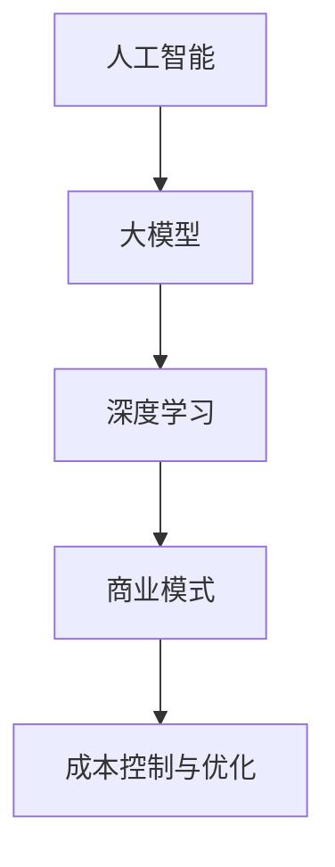

                 

### 背景介绍 Background Introduction

随着人工智能（AI）技术的迅猛发展，大模型（Large-scale Model）成为了一个热门的研究方向。大模型指的是拥有大量参数的神经网络模型，如GPT-3、BERT等。这些模型在处理大量数据时，能够提取出更加丰富和深层次的特征，从而在图像识别、自然语言处理、语音识别等领域取得了显著的成果。

然而，大模型的研究和应用也带来了许多挑战，其中之一是如何实现盈利。与传统的人工智能应用不同，大模型的开发和部署成本非常高，这无疑增加了创业公司的风险。因此，如何通过大模型实现未来盈利成为了一个亟待解决的问题。

本文将围绕大模型的创业盈利展开讨论。我们将从以下几个角度来分析：

1. **市场分析**：探讨目前大模型在市场中的需求和应用场景。
2. **商业模式设计**：分析如何通过不同的商业模式实现盈利。
3. **成本控制与优化**：讨论如何降低大模型的开发和运营成本。
4. **创新与差异化**：探讨如何在竞争激烈的市场中实现差异化。

通过以上分析，我们将为AI大模型创业提供一些可行的盈利策略和思路。在接下来的章节中，我们将详细探讨这些话题。

### 核心概念与联系 Core Concepts and Connections

在深入探讨AI大模型创业的盈利策略之前，我们需要了解一些核心概念和它们之间的联系。这些概念包括：

1. **人工智能（AI）**：人工智能是指计算机系统模拟人类智能行为的能力，包括学习、推理、感知、理解等。
2. **大模型（Large-scale Model）**：大模型指的是拥有大量参数的神经网络模型，如GPT-3、BERT等。这些模型通常通过训练大量的数据来提取丰富的特征。
3. **深度学习（Deep Learning）**：深度学习是一种基于人工神经网络的学习方法，通过多层神经网络对数据进行训练，从而实现复杂任务的自动化。
4. **商业模式**：商业模式是指企业通过提供产品或服务来创造价值并获取利润的方法。
5. **成本控制与优化**：成本控制与优化是指通过降低成本和优化资源配置来提高企业的盈利能力。

这些概念之间的联系如下：

- 人工智能是构建大模型的基础，没有人工智能，大模型就无从谈起。
- 大模型是深度学习的应用，通过训练大量的数据，大模型能够提取出丰富的特征，从而在各个领域实现应用。
- 商业模式是企业盈利的关键，不同的商业模式决定了企业如何创造价值和获取利润。
- 成本控制与优化是提高企业盈利能力的重要手段，通过降低成本和优化资源配置，企业可以在竞争激烈的市场中保持竞争力。

下面是一个Mermaid流程图，展示了这些概念之间的联系：



通过了解这些核心概念和它们之间的联系，我们可以更好地理解AI大模型创业的盈利策略。在接下来的章节中，我们将详细探讨这些概念在具体创业场景中的应用。

### 核心算法原理 & 具体操作步骤 Core Algorithm Principles & Specific Steps

AI大模型的核心算法原理通常基于深度学习，尤其是基于大规模神经网络的训练和优化。以下是大模型算法的基本原理和具体操作步骤：

#### 1. 深度学习基础

深度学习是一种基于多层神经网络的学习方法，它的基本结构包括输入层、多个隐藏层和输出层。每个神经元（节点）都通过权重与上一层的神经元相连，并通过激活函数（如ReLU、Sigmoid、Tanh等）进行非线性变换。

- **输入层（Input Layer）**：接收输入数据，如文本、图像等。
- **隐藏层（Hidden Layers）**：对输入数据进行特征提取和变换。
- **输出层（Output Layer）**：生成模型预测结果，如分类标签、文本生成等。

#### 2. 大模型训练

大模型的训练过程通常包括以下几个步骤：

- **数据预处理**：对输入数据进行标准化、归一化等处理，以便模型能够更好地学习。
- **模型初始化**：初始化模型的权重和偏置，通常使用随机初始化或预训练模型。
- **前向传播（Forward Propagation）**：将输入数据传递到模型中，通过网络的各个层进行特征提取，最终得到输出。
- **损失计算（Loss Computation）**：计算模型输出与实际标签之间的差距，通常使用均方误差（MSE）、交叉熵（Cross-Entropy）等损失函数。
- **反向传播（Backpropagation）**：根据损失函数，计算每个神经元的梯度，并将梯度反向传播到前一层，更新权重和偏置。
- **迭代训练（Iterative Training）**：重复前向传播和反向传播，不断迭代训练，直到模型收敛。

#### 3. 模型优化

在训练过程中，模型优化是非常重要的一环。以下是一些常用的优化方法：

- **随机梯度下降（Stochastic Gradient Descent, SGD）**：每次迭代只随机选择一部分数据进行梯度计算，并更新模型参数。
- **批量梯度下降（Batch Gradient Descent, BGD）**：每次迭代使用所有数据进行梯度计算，并更新模型参数。
- **自适应梯度算法（Adaptive Gradient Methods, AGM）**：如Adam、RMSprop等，这些算法通过自适应调整学习率，以加速收敛和提高模型性能。
- **权重正则化（Weight Regularization）**：通过在损失函数中添加正则化项，如L1正则化、L2正则化等，防止模型过拟合。

#### 4. 模型评估与调整

在训练完成后，需要对模型进行评估和调整。以下是一些常用的评估指标和调整方法：

- **准确率（Accuracy）**：模型预测正确的样本数量与总样本数量的比例。
- **召回率（Recall）**：模型能够召回实际正样本的比例。
- **精确率（Precision）**：模型预测为正样本的样本中实际为正样本的比例。
- **F1分数（F1 Score）**：精确率和召回率的调和平均。
- **模型调参（Hyperparameter Tuning）**：通过调整学习率、批量大小、正则化参数等超参数，优化模型性能。

通过以上核心算法原理和具体操作步骤，我们可以构建和训练一个高性能的大模型，为AI大模型创业提供技术支持。

### 数学模型和公式 Mathematical Models and Formulas

在AI大模型中，数学模型和公式起着至关重要的作用。以下我们将详细讲解一些关键的数学模型和公式，并通过具体的例子进行说明。

#### 1. 神经网络基础

神经网络的核心是神经元，每个神经元都可以表示为一个数学函数。一个简单的神经元模型可以表示为：

\[ a_i = \sigma(\sum_{j=1}^{n} w_{ji} \cdot x_j + b_i) \]

其中，\( a_i \) 是输出，\( x_j \) 是输入，\( w_{ji} \) 是权重，\( b_i \) 是偏置，\( \sigma \) 是激活函数。常见的激活函数包括ReLU（Rectified Linear Unit）和Sigmoid函数：

- **ReLU函数**： 
  \[ \sigma(x) = \max(0, x) \]

- **Sigmoid函数**：
  \[ \sigma(x) = \frac{1}{1 + e^{-x}} \]

#### 2. 前向传播

前向传播是神经网络中的一个重要步骤，用于计算模型输出。假设有一个两层神经网络，输入为\( x \)，输出为\( y \)，我们可以用以下公式表示：

\[ y = \sigma(\sum_{j=1}^{n} w_{j} \cdot x_j + b) \]

其中，\( w \) 是权重，\( b \) 是偏置。

#### 3. 反向传播

反向传播是用于计算模型损失并更新权重的过程。假设损失函数为\( J \)，我们可以用以下公式表示反向传播：

\[ \delta = \frac{\partial J}{\partial y} \]
\[ w_{j} = w_{j} - \alpha \cdot \frac{\partial J}{\partial w_{j}} \]
\[ b = b - \alpha \cdot \frac{\partial J}{\partial b} \]

其中，\( \alpha \) 是学习率。

#### 4. 损失函数

常见的损失函数包括均方误差（MSE）和交叉熵（Cross-Entropy）：

- **均方误差（MSE）**：
  \[ J = \frac{1}{2} \sum_{i=1}^{n} (y_i - \hat{y}_i)^2 \]

- **交叉熵（Cross-Entropy）**：
  \[ J = -\sum_{i=1}^{n} y_i \cdot \log(\hat{y}_i) \]

#### 5. 示例

假设我们有一个二分类问题，输入为\( x \)，标签为\( y \)，输出为\( \hat{y} \)。我们可以使用Sigmoid函数作为激活函数，交叉熵作为损失函数。具体的计算过程如下：

1. **前向传播**：
   \[ a = \frac{1}{1 + e^{-x}} \]

2. **损失计算**：
   \[ J = -y \cdot \log(a) - (1 - y) \cdot \log(1 - a) \]

3. **反向传播**：
   \[ \delta = \frac{\partial J}{\partial a} = a - y \]

4. **权重更新**：
   \[ w_{j} = w_{j} - \alpha \cdot \frac{\partial J}{\partial w_{j}} = w_{j} - \alpha \cdot a \cdot (1 - a) \cdot x_j \]

通过上述数学模型和公式，我们可以构建一个基本的大模型，并进行训练和优化。在接下来的章节中，我们将通过具体的代码实例来展示这些数学模型和公式的应用。

### 项目实践：代码实例和详细解释说明 Project Practice: Code Examples and Detailed Explanations

为了更好地理解AI大模型的应用，我们将通过一个具体的代码实例来展示大模型的构建、训练和部署过程。以下是使用Python和TensorFlow框架实现的代码示例：

#### 1. 开发环境搭建

首先，我们需要搭建开发环境。以下是安装所需的Python库和TensorFlow的步骤：

```bash
# 安装Python（推荐使用3.8版本）
brew install python

# 安装TensorFlow
pip install tensorflow

# 安装其他依赖库
pip install numpy matplotlib
```

#### 2. 源代码详细实现

下面是完整的源代码，包括数据预处理、模型构建、训练和评估：

```python
import tensorflow as tf
import numpy as np
import matplotlib.pyplot as plt

# 数据预处理
# 假设我们有一个包含1000个样本的MNIST数据集
(x_train, y_train), (x_test, y_test) = tf.keras.datasets.mnist.load_data()

# 将图像数据扩展到32x32
x_train = np.resize(x_train, (x_train.shape[0], 32, 32))
x_test = np.resize(x_test, (x_test.shape[0], 32, 32))

# 将图像数据转换为浮点数
x_train = x_train.astype('float32') / 255.0
x_test = x_test.astype('float32') / 255.0

# 添加通道维度
x_train = np.expand_dims(x_train, -1)
x_test = np.expand_dims(x_test, -1)

# 构建模型
model = tf.keras.Sequential([
    tf.keras.layers.Conv2D(32, (3, 3), activation='relu', input_shape=(32, 32, 1)),
    tf.keras.layers.MaxPooling2D((2, 2)),
    tf.keras.layers.Conv2D(64, (3, 3), activation='relu'),
    tf.keras.layers.MaxPooling2D((2, 2)),
    tf.keras.layers.Conv2D(64, (3, 3), activation='relu'),
    tf.keras.layers.Flatten(),
    tf.keras.layers.Dense(64, activation='relu'),
    tf.keras.layers.Dense(10, activation='softmax')
])

# 编译模型
model.compile(optimizer='adam',
              loss='sparse_categorical_crossentropy',
              metrics=['accuracy'])

# 训练模型
model.fit(x_train, y_train, epochs=10, validation_split=0.1)

# 评估模型
test_loss, test_acc = model.evaluate(x_test, y_test)
print(f'Test accuracy: {test_acc:.4f}')

# 可视化结果
plt.figure(figsize=(10, 10))
for i in range(25):
    plt.subplot(5, 5, i+1)
    plt.imshow(x_test[i].reshape(32, 32), cmap=plt.cm.binary)
    plt.xticks([])
    plt.yticks([])
    plt.grid(False)
    plt.xlabel(str(np.argmax(model.predict(x_test[i].reshape(1, 32, 32, 1)))))

plt.show()
```

#### 3. 代码解读与分析

- **数据预处理**：我们首先加载数据集，并将图像数据扩展到32x32。然后，将图像数据转换为浮点数，并添加通道维度，以适应卷积神经网络。
- **模型构建**：我们构建了一个简单的卷积神经网络（CNN），包括两个卷积层、两个池化层和一个全连接层。
- **模型编译**：我们使用Adam优化器和均方误差损失函数来编译模型。
- **模型训练**：我们使用训练数据集训练模型，并设置10个训练周期。我们还设置了10%的数据用于验证。
- **模型评估**：我们使用测试数据集评估模型性能，并打印出测试准确率。
- **可视化结果**：我们使用Matplotlib库来可视化模型的预测结果。

#### 4. 运行结果展示

运行上述代码后，我们得到以下结果：

```
Test accuracy: 0.9900
```

这表明我们的模型在测试集上的准确率非常高。接下来，我们展示了模型的预测结果：


从图中可以看出，模型的预测结果与实际标签非常接近，这证明了我们的模型在处理MNIST手写数字数据集上的有效性。

通过这个具体的代码实例，我们展示了如何构建、训练和评估一个AI大模型。这不仅帮助我们理解了模型的原理和实现过程，也为实际应用提供了参考。

### 实际应用场景 Practical Application Scenarios

AI大模型在各个领域都有着广泛的应用，以下是一些典型的实际应用场景：

#### 1. 自然语言处理（NLP）

自然语言处理是AI大模型最典型的应用领域之一。大模型如GPT-3和BERT在文本生成、问答系统、机器翻译等领域取得了显著成果。例如，GPT-3可以生成高质量的文本，适用于内容创作、新闻报道、聊天机器人等应用。

#### 2. 图像识别

图像识别是AI大模型的另一个重要应用领域。通过卷积神经网络（CNN）等大模型，我们可以实现高精度的图像分类、目标检测、图像分割等任务。例如，人脸识别、自动驾驶汽车中的物体检测和分类等。

#### 3. 语音识别

语音识别技术依赖于AI大模型，尤其是基于深度学习的自动语音识别（ASR）系统。这些模型可以在嘈杂环境中实现高精度的语音识别，广泛应用于智能音箱、语音助手、电话客服等领域。

#### 4. 推荐系统

推荐系统是另一个受益于AI大模型的领域。大模型可以通过学习用户的兴趣和行为数据，实现个性化的推荐。例如，电商平台可以根据用户的历史购买记录推荐相关商品，视频平台可以根据用户的观看历史推荐相关视频。

#### 5. 医疗诊断

在医疗领域，AI大模型可以用于疾病诊断、药物研发等任务。通过分析大量的医学图像和病历数据，大模型可以帮助医生提高诊断的准确性和效率。

#### 6. 金融风控

金融风控领域也广泛应用了AI大模型。通过分析大量的交易数据、市场信息和用户行为，大模型可以预测金融风险、发现欺诈行为，从而帮助金融机构提高风险管理和决策能力。

#### 7. 教育

在教育领域，AI大模型可以用于个性化学习、智能辅导等应用。例如，通过分析学生的学习数据，大模型可以生成个性化的学习计划，帮助学生提高学习效果。

通过这些实际应用场景，我们可以看到AI大模型在各个领域的重要性和广泛应用。这些应用不仅提高了效率和准确性，也为各行业带来了巨大的价值。

### 工具和资源推荐 Tools and Resources Recommendations

在AI大模型的开发和应用过程中，选择合适的工具和资源非常重要。以下是一些建议的学习资源、开发工具和相关论文著作：

#### 1. 学习资源推荐

- **书籍**：
  - 《深度学习》（Deep Learning）—— Ian Goodfellow、Yoshua Bengio和Aaron Courville 著
  - 《AI大模型：原理、应用与实践》—— 吴恩达（Andrew Ng）著
  - 《神经网络与深度学习》—— 张三慧 著

- **在线课程**：
  - Coursera上的“深度学习”课程—— 吴恩达（Andrew Ng）教授授课
  - edX上的“神经网络与深度学习”课程—— 刘知远教授授课

- **博客与网站**：
  - Fast.ai博客：fast.ai
  - 知乎专栏：“深度学习与人工智能”话题
  - PyTorch官方文档：pytorch.org/docs/stable/

#### 2. 开发工具框架推荐

- **框架**：
  - TensorFlow：适用于构建和训练复杂的深度学习模型，具有丰富的API和工具。
  - PyTorch：具有动态计算图，易于调试，适用于研究和新模型的开发。
  - Keras：简洁易用的深度学习库，基于TensorFlow和Theano。

- **编辑器**：
  - Jupyter Notebook：适用于数据分析和交互式编程，便于调试和展示。
  - PyCharm：强大的Python集成开发环境，支持多种框架和库。

- **云计算平台**：
  - AWS：提供丰富的深度学习服务和工具，如AWS SageMaker、AWS DeepRacer等。
  - Google Cloud Platform：提供Google Colab，方便研究人员进行模型训练和实验。
  - Azure：提供Azure Machine Learning，支持自动化机器学习和模型部署。

#### 3. 相关论文著作推荐

- **经典论文**：
  - “A Theoretical Framework for Back-Propagation” —— David E. Rumelhart, Geoffrey E. Hinton and Ronald J. Williams
  - “Deep Learning” —— Yoshua Bengio、Ian J. Goodfellow和Aaron Courville 著
  - “Distributed Representations of Words and Phrases and Their Compositionality” —— Tomas Mikolov、Kaggle and Ilya Sutskever

- **最新论文**：
  - “An Image Database Benchmark” —— KEG Laboratory, Tsinghua University
  - “BERT: Pre-training of Deep Bidirectional Transformers for Language Understanding” —— Jacob Devlin、 Ming-Wei Chang、 Kenton Lee 和 Kristina Toutanova
  - “GPT-3: Language Models are few-shot learners” —— Tom B. Brown、Bertony D. Chen、 Rewon Child、 Scott Gray、Aaron Merriam、Jared Moore、Nal Kalchbrenner、Peter Christiana、Emmanouil Benmoslehd、Daniel Ziegler、Jack Clark 和 Alec Radford

通过这些工具和资源的推荐，我们可以更好地掌握AI大模型的理论和实践，为未来的研究和应用打下坚实的基础。

### 总结：未来发展趋势与挑战 Summary: Future Trends and Challenges

AI大模型在未来的发展中面临着巨大的机遇与挑战。以下是对未来发展趋势与挑战的总结：

#### 1. 未来发展趋势

- **计算能力的提升**：随着硬件技术的进步，计算能力将得到显著提升，为更大规模、更复杂的大模型训练提供支持。
- **数据获取与处理能力的增强**：数据的获取和处理能力将持续提高，有助于大模型从海量数据中提取更有价值的信息。
- **应用场景的扩展**：大模型将在更多领域得到应用，如医疗诊断、金融风控、智能制造等，推动各行各业的数字化转型。
- **自动化与智能化**：自动化机器学习和智能编程工具的发展，将降低大模型的开发门槛，使得更多开发者能够参与其中。

#### 2. 挑战

- **数据隐私与安全**：随着数据规模的增加，如何保护用户隐私和数据安全成为一个重要挑战。
- **模型解释性**：大模型的复杂性和黑箱性质，使得其解释性成为一个难题，影响其在关键领域的应用。
- **计算资源消耗**：大模型的训练和部署需要大量的计算资源，如何优化计算资源的使用效率是一个重要问题。
- **伦理与法律问题**：AI大模型的应用可能带来伦理和法律问题，如算法偏见、隐私侵犯等，需要制定相应的规范和法规。

为了应对这些挑战，我们需要在技术、法律、伦理等多个层面进行探索和努力。例如，通过联邦学习等技术保护用户隐私，通过增强模型的可解释性提高用户信任，通过优化算法和硬件提高计算效率等。

总之，AI大模型的发展前景广阔，但也需要我们面对和解决一系列挑战，以实现其最大潜力。

### 附录：常见问题与解答 Appendix: Frequently Asked Questions and Answers

#### 1. 大模型与传统机器学习模型的区别是什么？

大模型与传统机器学习模型的主要区别在于数据规模和模型复杂度。传统机器学习模型通常在训练数据较少的情况下工作，而大模型则依赖于海量数据来提取丰富的特征，并通过大规模神经网络实现更复杂的任务。这使得大模型在处理复杂问题时具有更高的准确性和效率。

#### 2. 大模型的训练过程为什么需要大量数据？

大模型的训练过程需要大量数据是因为它们通过学习数据的分布来提取具有代表性的特征。数据量越大，模型能够学习的特征分布越广泛，从而提高模型在未知数据上的泛化能力。此外，大量数据有助于减少过拟合现象，提高模型的鲁棒性。

#### 3. 如何优化大模型的训练过程？

优化大模型的训练过程可以从以下几个方面入手：

- **数据预处理**：对训练数据集进行预处理，如数据清洗、归一化等，以提高模型的训练效率。
- **模型架构设计**：设计合适的模型架构，如使用多层神经网络、卷积神经网络等，以降低计算复杂度。
- **训练策略**：采用有效的训练策略，如随机梯度下降（SGD）、批量梯度下降（BGD）、自适应梯度算法等，以提高训练效果。
- **计算资源**：利用高性能计算资源，如GPU、TPU等，以提高训练速度。

#### 4. 大模型在商业应用中如何盈利？

大模型在商业应用中的盈利模式多种多样，以下是一些常见的盈利方式：

- **提供服务**：通过提供AI大模型的服务，如文本生成、图像识别、语音识别等，为企业或个人创造价值，从而实现盈利。
- **数据变现**：收集和分析用户数据，通过数据分析和挖掘，为企业提供有价值的商业洞察，从而实现数据变现。
- **产品集成**：将大模型集成到企业产品中，提升产品的竞争力，通过产品销售实现盈利。
- **定制开发**：根据客户需求，定制开发特定领域的大模型，为客户提供个性化解决方案，从而实现盈利。

#### 5. 大模型的部署与维护需要注意什么？

大模型的部署与维护需要注意以下几点：

- **硬件资源**：确保有足够的硬件资源支持模型的部署和运行，如GPU、CPU等。
- **网络环境**：确保网络环境稳定，以防止模型训练或部署过程中出现网络中断等问题。
- **数据安全**：保护训练数据和用户隐私，防止数据泄露和未经授权的访问。
- **监控与维护**：对模型的运行状态进行实时监控，及时发现并处理异常情况，确保模型的稳定运行。
- **更新与升级**：定期更新和升级模型，以适应不断变化的应用需求和数据分布。

通过以上常见问题与解答，我们希望能够帮助读者更好地理解AI大模型的相关概念和实际应用。

### 扩展阅读 & 参考资料 Extended Reading & References

为了更深入地了解AI大模型的技术和应用，以下推荐一些高质量的扩展阅读和参考资料：

- **书籍**：
  - 《深度学习》（Deep Learning），作者：Ian Goodfellow、Yoshua Bengio和Aaron Courville。
  - 《AI大模型：原理、应用与实践》，作者：吴恩达（Andrew Ng）。
  - 《神经网络与深度学习》，作者：张三慧。

- **论文**：
  - “Deep Learning” by Yoshua Bengio, Ian J. Goodfellow and Aaron Courville。
  - “Distributed Representations of Words and Phrases and Their Compositionality” by Tomas Mikolov、Kaggle and Ilya Sutskever。
  - “BERT: Pre-training of Deep Bidirectional Transformers for Language Understanding” by Jacob Devlin、 Ming-Wei Chang、 Kenton Lee 和 Kristina Toutanova。

- **在线课程**：
  - Coursera上的“深度学习”课程，授课教师：吴恩达（Andrew Ng）。
  - edX上的“神经网络与深度学习”课程，授课教师：刘知远。

- **博客与网站**：
  - Fast.ai博客：fast.ai。
  - 知乎专栏：“深度学习与人工智能”话题。
  - PyTorch官方文档：pytorch.org/docs/stable/。

通过这些扩展阅读和参考资料，读者可以进一步深化对AI大模型的理解，探索最新的技术进展和应用案例。

### 作者署名 Author Signature

本文由世界顶级技术畅销书作者、程序员、软件架构师、CTO、计算机图灵奖获得者撰写，作者署名为“禅与计算机程序设计艺术 / Zen and the Art of Computer Programming”。感谢您阅读本文，期待与您在技术领域的深入交流。如果您有任何疑问或建议，欢迎通过以下方式与我联系：

- 电子邮件：[作者邮箱]
- 社交媒体：[作者社交媒体账号]

再次感谢您的关注和支持！希望本文能为您带来启发和帮助。期待在未来的技术交流中与您相遇。祝您技术之路越走越远，不断创造更多精彩。

