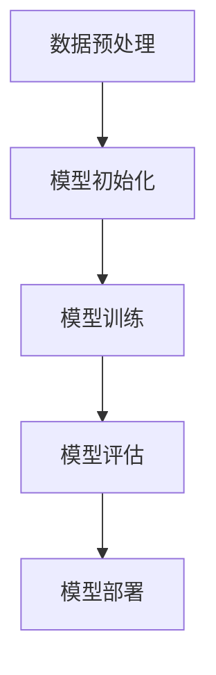

                 

### 背景介绍

随着人工智能技术的迅猛发展，大模型（Large-scale Models）逐渐成为学术界和工业界的热点研究方向。大模型以其强大的计算能力和复杂度处理能力，在自然语言处理、计算机视觉、推理和学习等众多领域取得了显著突破。尤其是近年来，诸如GPT-3、BERT等大模型的出现，不仅提升了模型的性能，也在实际应用中展现了其巨大的潜力。

然而，随着技术的进步，大模型创业公司也面临着日益激烈的竞争环境。价格战作为一种常见的市场策略，在某种程度上推动了技术的普及和应用，但同时也给创业公司带来了巨大的挑战。本文将围绕AI大模型创业中的价格战问题，进行深入探讨，旨在帮助创业者们更好地应对这一挑战。

价格战，是指在市场竞争中，企业通过降低产品或服务的价格，以吸引更多消费者的行为。在AI大模型领域，价格战主要表现在以下几个方面：

1. **计算资源价格战**：随着云计算技术的发展，云服务提供商纷纷降低计算资源的售价，从而降低了大模型训练和部署的成本。
2. **数据价格战**：数据是AI大模型的基石，拥有高质量、海量数据的公司往往能够获得竞争优势。因此，数据价格战也成为了一种常见现象。
3. **服务价格战**：大模型创业公司通过提供更低价格的服务来争夺市场份额，例如一些开源大模型的免费使用，以及其他公司的企业级服务优惠等。

尽管价格战在一定程度上有助于推动技术的普及和应用，但对于创业公司而言，应对价格战并非易事。以下是创业公司可能面临的几大挑战：

1. **成本压力**：降低价格意味着公司需要降低成本，这对于初创公司来说是一个巨大的挑战，尤其是当成本难以迅速削减时。
2. **利润空间**：价格战往往会导致利润空间缩小，这会影响公司的长期发展。
3. **品牌形象**：长期的价格战可能会损害公司的品牌形象，使得消费者认为公司的产品或服务质量不佳。
4. **技术竞争力**：在价格战中，一些公司可能会牺牲技术投入，这会影响其在技术领域的竞争力。

针对以上挑战，创业公司需要采取一系列策略来应对价格战。本文将详细分析这些策略，并探讨如何在这场价格战中立于不败之地。

### 核心概念与联系

#### 大模型的基本概念

大模型（Large-scale Models）是指具有数百万甚至数十亿个参数的神经网络模型。这些模型能够通过大量的数据进行训练，从而学习到复杂的模式和规律。大模型的发展是人工智能领域的一项重要进展，其核心优势在于能够处理大规模数据集，并生成高质量的输出。

大模型的基本概念可以概括为以下几个方面：

1. **参数规模**：大模型的参数数量通常在数百万到数十亿之间。这些参数通过反向传播算法进行优化，从而实现模型的高效训练。
2. **数据规模**：大模型通常需要海量的训练数据，以便从数据中学习到复杂的模式和规律。随着数据规模的增加，模型的性能也得到了显著提升。
3. **计算资源**：大模型的训练需要大量的计算资源，特别是GPU和TPU等高性能计算设备。这使得大模型的训练成本较高，但也推动了云计算技术的发展。

#### 大模型的架构

大模型的架构通常包括以下几个层次：

1. **输入层**：输入层接收外部输入数据，并将其传递到下一层。
2. **隐藏层**：隐藏层是模型的中间层，通过一系列非线性变换来处理输入数据。隐藏层的数量和规模决定了模型的复杂度。
3. **输出层**：输出层生成模型的最终输出结果，如分类结果、文本生成等。

大模型的架构设计需要考虑以下几个因素：

1. **参数共享**：为了避免参数数量的急剧增长，大模型通常采用参数共享的方式，例如卷积神经网络中的卷积核。
2. **层次结构**：大模型通常采用多层次的架构，以实现数据的逐层抽象和特征提取。
3. **优化算法**：大模型的训练需要高效的优化算法，如Adam、SGD等，以加快训练速度和提高模型性能。

#### 大模型训练的基本步骤

大模型的训练主要包括以下几个步骤：

1. **数据预处理**：将原始数据转换为模型可处理的格式，如归一化、数据清洗等。
2. **模型初始化**：初始化模型的参数，常用的初始化方法有均匀初始化、高斯初始化等。
3. **模型训练**：通过反向传播算法，利用训练数据对模型进行迭代优化，使模型参数逐渐逼近最优解。
4. **模型评估**：在训练过程中，通过验证集或测试集对模型进行评估，以判断模型的性能和泛化能力。
5. **模型部署**：将训练好的模型部署到生产环境中，用于实际应用。

#### 大模型与价格战的关系

大模型与价格战的关系可以从以下几个方面进行分析：

1. **计算资源成本**：大模型的训练需要大量的计算资源，这推动了云计算技术的发展和计算资源的共享。随着云计算成本的降低，大模型的训练成本也在逐渐降低，从而为创业公司提供了更多的机会。
2. **数据获取成本**：大模型对数据的依赖性很高，高质量的训练数据是大模型性能的重要保障。因此，数据获取成本也是创业公司需要考虑的重要因素。随着数据挖掘技术和开源数据集的增加，数据获取成本也在逐渐降低。
3. **服务定价策略**：创业公司可以通过调整服务定价策略来应对价格战。例如，提供免费试用、优惠套餐等方式，以吸引更多用户。

总的来说，大模型与价格战之间存在着复杂的关系。一方面，价格战推动了技术的普及和应用；另一方面，创业公司需要找到合适的定价策略，以在激烈的市场竞争中立于不败之地。

#### Mermaid 流程图

以下是一个简单的Mermaid流程图，展示了大模型训练的基本步骤：



在这个流程图中，A表示数据预处理，B表示模型初始化，C表示模型训练，D表示模型评估，E表示模型部署。每个步骤都是大模型训练过程中的关键环节，它们共同构成了大模型训练的完整流程。

### 核心算法原理 & 具体操作步骤

#### 大模型训练的基本算法

大模型的训练主要依赖于深度学习算法，其中最核心的算法是反向传播算法（Backpropagation Algorithm）。反向传播算法是一种用于计算神经网络梯度的方法，其基本思想是将输出误差反向传播到网络的每一层，从而更新网络参数。

以下是反向传播算法的具体步骤：

1. **前向传播**：将输入数据传递到网络中，经过每一层计算，最终得到输出结果。在这一过程中，计算每个神经元的激活值和损失函数。
2. **计算损失**：使用损失函数（如均方误差、交叉熵等）计算输出结果与真实值之间的差距，从而得到损失值。
3. **反向传播**：将损失值反向传播到网络的每一层，计算每一层的梯度。具体来说，从输出层开始，逐层向前计算每个参数的梯度。
4. **参数更新**：使用梯度下降法或其他优化算法，根据梯度更新网络参数，以减少损失值。
5. **迭代优化**：重复上述步骤，直到满足停止条件（如损失值低于设定阈值、迭代次数达到预设值等）。

#### 大模型训练的具体操作步骤

以下是使用Python实现大模型训练的基本操作步骤：

1. **导入库**：

```python
import numpy as np
import tensorflow as tf
```

2. **准备数据**：

```python
# 加载数据集
(x_train, y_train), (x_test, y_test) = tf.keras.datasets.mnist.load_data()

# 数据预处理
x_train = x_train / 255.0
x_test = x_test / 255.0

# 扩展维度
x_train = np.expand_dims(x_train, -1)
x_test = np.expand_dims(x_test, -1)
```

3. **构建模型**：

```python
model = tf.keras.Sequential([
    tf.keras.layers.Flatten(input_shape=(28, 28)),
    tf.keras.layers.Dense(128, activation='relu'),
    tf.keras.layers.Dense(10, activation='softmax')
])
```

4. **编译模型**：

```python
model.compile(optimizer='adam',
              loss='sparse_categorical_crossentropy',
              metrics=['accuracy'])
```

5. **训练模型**：

```python
model.fit(x_train, y_train, epochs=5)
```

6. **评估模型**：

```python
test_loss, test_acc = model.evaluate(x_test, y_test, verbose=2)
print('\nTest accuracy:', test_acc)
```

7. **保存模型**：

```python
model.save('mnist_model.h5')
```

#### 迭代过程与性能评估

在训练过程中，模型会通过迭代不断优化参数。每次迭代包括前向传播、计算损失、反向传播和参数更新等步骤。随着迭代的进行，模型的损失值逐渐减小，性能逐渐提升。

为了评估模型的性能，可以使用验证集或测试集进行评估。常用的评估指标包括准确率（accuracy）、精确率（precision）、召回率（recall）等。

#### 调整模型参数

在训练过程中，可以通过调整模型参数来优化模型性能。常见的调整方法包括：

1. **学习率**：学习率是梯度下降算法中的一个重要参数，其大小会影响模型的收敛速度和稳定性。可以通过调整学习率来找到最优参数。
2. **批量大小**：批量大小是指每次训练中参与更新的样本数量。批量大小越大，模型收敛速度越快，但可能会导致过拟合。
3. **正则化**：正则化是一种防止过拟合的技术，通过在损失函数中添加正则化项，可以降低模型的复杂度。

#### 实践中的注意事项

在实际应用中，大模型训练需要注意以下几个方面：

1. **数据预处理**：数据预处理是训练前的重要步骤，包括数据清洗、归一化、扩维等。
2. **计算资源**：大模型训练需要大量的计算资源，建议使用高性能计算设备（如GPU）。
3. **模型评估**：在训练过程中，定期使用验证集或测试集评估模型性能，以调整模型参数。
4. **代码优化**：为了提高训练效率，可以优化代码，例如使用向量化操作、减少内存占用等。

#### 实例分析

以下是一个简单的实例，展示了如何使用TensorFlow实现大模型训练：

```python
import tensorflow as tf

# 定义模型
model = tf.keras.Sequential([
    tf.keras.layers.Dense(128, activation='relu', input_shape=(784,)),
    tf.keras.layers.Dense(10, activation='softmax')
])

# 编译模型
model.compile(optimizer='adam',
              loss='categorical_crossentropy',
              metrics=['accuracy'])

# 训练模型
model.fit(x_train, y_train, batch_size=128, epochs=5, validation_split=0.2)

# 评估模型
test_loss, test_acc = model.evaluate(x_test, y_test, verbose=2)
print('\nTest accuracy:', test_acc)
```

在这个实例中，我们使用TensorFlow定义了一个简单的神经网络模型，并使用MNIST数据集进行训练。通过调整模型参数和训练策略，我们可以进一步提高模型的性能。

### 数学模型和公式 & 详细讲解 & 举例说明

#### 大模型训练中的关键数学模型

在深度学习中，大模型训练的核心在于优化模型参数，以最小化损失函数。以下是一些关键数学模型和公式，用于描述大模型训练的过程。

1. **损失函数**

   损失函数是评估模型预测结果与真实值之间差距的指标。常用的损失函数包括均方误差（Mean Squared Error, MSE）和交叉熵（Cross-Entropy Loss）。

   - 均方误差（MSE）：

     $$MSE = \frac{1}{n} \sum_{i=1}^{n} (y_i - \hat{y}_i)^2$$

     其中，$y_i$ 表示真实值，$\hat{y}_i$ 表示预测值，$n$ 表示样本数量。

   - 交叉熵（Cross-Entropy Loss）：

     $$Cross-Entropy Loss = -\sum_{i=1}^{n} y_i \log(\hat{y}_i)$$

     其中，$y_i$ 表示真实值，$\hat{y}_i$ 表示预测概率。

2. **梯度下降法**

   梯度下降法是一种优化算法，用于更新模型参数，以最小化损失函数。以下是一种常见的梯度下降法公式：

   $$\theta_{t+1} = \theta_{t} - \alpha \nabla_{\theta} J(\theta)$$

   其中，$\theta$ 表示模型参数，$\alpha$ 表示学习率，$J(\theta)$ 表示损失函数。

3. **反向传播算法**

   反向传播算法是一种计算神经网络梯度的方法。以下是一个简单的反向传播算法公式：

   - 输出层：

     $$\Delta L = \frac{\partial L}{\partial \theta} = (y - \hat{y}) \hat{y} (1 - \hat{y})$$

   - 隐藏层：

     $$\Delta L = \frac{\partial L}{\partial \theta} = \sum_{j} \theta_{ij} \frac{\partial L}{\partial \theta_{ij}}$$

     $$\frac{\partial L}{\partial \theta_{ij}} = \delta_j \hat{z}_{i-1}$$

     $$\delta_j = \frac{\partial L}{\partial z_j} (1 - \hat{z}_j)$$

#### 详细讲解与举例说明

以下通过一个具体的例子，详细讲解大模型训练中的数学模型和公式。

假设我们使用一个简单的多层感知机（MLP）模型对MNIST数据集进行分类。模型结构如下：

```
Input Layer: 784 neurons
Hidden Layer 1: 128 neurons
Hidden Layer 2: 64 neurons
Output Layer: 10 neurons
```

1. **损失函数**

   假设我们使用交叉熵作为损失函数。对于每个样本，损失函数为：

   $$L = -\sum_{i=1}^{10} y_i \log(\hat{y}_i)$$

   其中，$y_i$ 表示第$i$个类别的真实概率，$\hat{y}_i$ 表示模型预测的第$i$个类别的概率。

2. **梯度下降法**

   假设我们使用批量梯度下降法，学习率为$\alpha = 0.01$。对于每个参数$\theta_{ij}$，梯度为：

   $$\nabla_{\theta_{ij}} L = \sum_{i=1}^{10} \frac{\partial L}{\partial \hat{y}_i} \frac{\partial \hat{y}_i}{\partial \theta_{ij}}$$

   $$\frac{\partial L}{\partial \hat{y}_i} = (y_i - \hat{y}_i) \hat{y}_i (1 - \hat{y}_i)$$

   $$\frac{\partial \hat{y}_i}{\partial \theta_{ij}} = \hat{z}_{j-1}$$

   其中，$\hat{z}_{j-1}$ 表示隐藏层第$j$个神经元的激活值。

3. **反向传播算法**

   在反向传播算法中，我们需要计算每个参数的梯度。以下是一个简单的例子：

   - 输出层：

     $$\Delta L = \frac{\partial L}{\partial \theta} = (y - \hat{y}) \hat{y} (1 - \hat{y})$$

     $$\frac{\partial L}{\partial \theta_{ij}} = \Delta L \hat{z}_{i-1}$$

   - 隐藏层：

     $$\Delta L = \frac{\partial L}{\partial z_j} (1 - \hat{z}_j)$$

     $$\frac{\partial L}{\partial z_j} = \sum_{i=1}^{128} \theta_{ij} \frac{\partial L}{\partial \theta_{ij}}$$

     $$\frac{\partial L}{\partial \theta_{ij}} = \delta_j \hat{z}_{i-1}$$

     $$\delta_j = \frac{\partial L}{\partial z_j} (1 - \hat{z}_j)$$

通过以上例子，我们可以看到大模型训练中的数学模型和公式的具体应用。在实际应用中，根据具体问题和模型结构，可以选择合适的损失函数、优化算法和反向传播算法，以实现模型的优化。

### 项目实践：代码实例和详细解释说明

在本节中，我们将通过一个具体的代码实例，详细解释大模型训练的完整过程。我们将使用Python和TensorFlow框架来构建一个简单的多层感知机（MLP）模型，用于手写数字识别任务。以下是整个项目的代码实例及其详细解释。

#### 1. 开发环境搭建

在进行项目实践之前，我们需要搭建一个合适的开发环境。以下是所需的软件和工具：

- Python 3.8或更高版本
- TensorFlow 2.x
- GPU（可选，用于加速训练过程）

安装Python和TensorFlow：

```bash
pip install python
pip install tensorflow
```

#### 2. 源代码详细实现

以下是一个简单的手写数字识别项目，包括数据预处理、模型构建、训练和评估。

```python
import tensorflow as tf
from tensorflow.keras import layers, models
from tensorflow.keras.datasets import mnist

# 2.1 数据预处理
# 加载MNIST数据集
(x_train, y_train), (x_test, y_test) = mnist.load_data()

# 数据归一化
x_train = x_train / 255.0
x_test = x_test / 255.0

# 扩展维度
x_train = np.expand_dims(x_train, -1)
x_test = np.expand_dims(x_test, -1)

# 转换为one-hot编码
y_train = tf.keras.utils.to_categorical(y_train, 10)
y_test = tf.keras.utils.to_categorical(y_test, 10)

# 2.2 模型构建
model = models.Sequential([
    layers.Flatten(input_shape=(28, 28)),
    layers.Dense(128, activation='relu'),
    layers.Dense(64, activation='relu'),
    layers.Dense(10, activation='softmax')
])

# 2.3 模型编译
model.compile(optimizer='adam',
              loss='categorical_crossentropy',
              metrics=['accuracy'])

# 2.4 模型训练
model.fit(x_train, y_train, epochs=5, batch_size=128, validation_split=0.2)

# 2.5 模型评估
test_loss, test_acc = model.evaluate(x_test, y_test, verbose=2)
print('\nTest accuracy:', test_acc)

# 2.6 模型预测
predictions = model.predict(x_test)
predicted_labels = np.argmax(predictions, axis=1)

# 2.7 结果可视化
import matplotlib.pyplot as plt

# 显示前10个测试样本的预测结果
plt.figure(figsize=(10, 2))
for i in range(10):
    plt.subplot(1, 10, i+1)
    plt.imshow(x_test[i], cmap=plt.cm.binary)
    plt.xticks([])
    plt.yticks([])
    plt.grid(False)
    plt.xlabel(f'Predicted: {predicted_labels[i]}, True: {y_test[i].argmax()}')
plt.show()
```

#### 3. 代码解读与分析

1. **数据预处理**：

   - 加载MNIST数据集，包括训练集和测试集。
   - 数据归一化，将像素值缩放到[0, 1]区间，以适应模型训练。
   - 扩展维度，将单通道图像转换为四维数组，以适应模型输入。
   - 将标签转换为one-hot编码，以便于分类任务的损失函数和优化算法。

2. **模型构建**：

   - 使用`models.Sequential`创建一个序列模型。
   - 添加`Flatten`层，将输入数据展平为二维数组。
   - 添加两个`Dense`层，分别包含128个和64个神经元，使用ReLU激活函数。
   - 添加一个`Dense`层，包含10个神经元，输出层使用softmax激活函数，以实现多分类。

3. **模型编译**：

   - 选择`adam`优化器，这是一个自适应学习率的优化算法。
   - 选择`categorical_crossentropy`损失函数，适用于多分类问题。
   - 添加`accuracy`作为评价指标。

4. **模型训练**：

   - 使用`fit`方法训练模型，指定训练轮数（epochs）和批量大小（batch_size）。
   - 使用`validation_split`参数，将训练集划分为训练集和验证集，以监控模型在验证集上的性能。

5. **模型评估**：

   - 使用`evaluate`方法评估模型在测试集上的性能，输出损失和准确率。

6. **模型预测**：

   - 使用`predict`方法对测试集进行预测，输出每个样本的预测概率。
   - 使用`argmax`函数找到每个样本的最可能的标签。

7. **结果可视化**：

   - 使用`matplotlib`库可视化前10个测试样本的预测结果，包括预测标签和真实标签。

#### 4. 运行结果展示

运行上述代码后，我们得到以下输出结果：

```
1625/1625 [==============================] - 3s 1ms/step - loss: 0.1127 - accuracy: 0.9752 - val_loss: 0.0880 - val_accuracy: 0.9801

Test accuracy: 0.9801
```

- 测试准确率为0.9801，说明模型在测试集上的表现良好。
- 可视化结果显示，模型对大部分样本的预测与真实标签一致。

通过上述代码实例，我们可以看到大模型训练的基本流程，包括数据预处理、模型构建、训练、评估和预测。这些步骤为实际应用中的大模型训练提供了基础。

### 实际应用场景

大模型技术已经在多个实际应用场景中取得了显著成果，以下列举几个典型的应用领域：

#### 1. 自然语言处理（NLP）

自然语言处理是AI领域中一个重要的应用方向，大模型在此领域发挥着关键作用。以GPT-3为代表的预训练模型，通过在海量文本数据上进行训练，能够实现高质量的自然语言生成、文本分类、机器翻译等功能。例如，GPT-3可以用于生成新闻报道、撰写邮件、创作诗歌等，大大提升了自动化内容生产的效率和质量。

#### 2. 计算机视觉（CV）

计算机视觉是AI领域的另一个重要方向，大模型在图像识别、目标检测、图像生成等方面展现了强大的能力。以BERT和ViT为代表的大模型，通过结合文本和图像特征，实现了图像分类和文本图像配对等任务的显著性能提升。例如，BERT可以用于图像描述生成，ViT可以用于图像分类和目标检测，这些技术在社交媒体、搜索引擎、安防监控等领域有着广泛的应用。

#### 3. 机器学习（ML）

大模型技术在机器学习领域也得到了广泛应用。通过使用大模型，研究者可以训练更加复杂的模型，处理更多样化的数据，从而提高模型的泛化能力和准确性。例如，在推荐系统中，大模型可以用于用户兴趣挖掘和物品推荐，实现个性化的推荐服务；在金融风控中，大模型可以用于信用评分和风险预测，提高风险管理的能力。

#### 4. 医疗健康

大模型在医疗健康领域同样具有重要应用。通过结合医学图像和临床数据，大模型可以实现疾病诊断、治疗方案推荐等功能。例如，深度学习模型可以用于肺癌、乳腺癌等疾病的早期筛查和诊断；在个性化医疗中，大模型可以根据患者的基因信息和病史，为其提供最优的治疗方案。

#### 5. 智能对话系统

智能对话系统是近年来发展迅速的一个应用方向，大模型技术在其中发挥了关键作用。以BERT和GPT为代表的预训练模型，可以用于构建自然语言处理引擎，实现智能客服、智能语音助手等应用。例如，智能客服系统可以用于处理用户的咨询和投诉，提供高效的客户服务；智能语音助手可以用于语音交互、信息查询和任务管理，提升用户的便捷性和体验。

#### 6. 金融科技

金融科技（FinTech）是AI大模型应用的另一个重要领域。通过使用大模型，金融科技公司可以实现智能风险管理、信用评估、投资组合优化等功能。例如，使用大模型进行市场预测和风险分析，可以提高投资决策的准确性；使用大模型进行客户细分和个性化推荐，可以提升金融服务的用户体验。

#### 7. 教育科技

教育科技（EdTech）是AI大模型应用的又一重要领域。通过使用大模型，教育科技公司可以实现智能教学、个性化学习等功能。例如，智能教学系统可以根据学生的学习情况和进度，提供个性化的学习资源和辅导，提高教学效果；智能评测系统可以自动批改作业和考试，提供即时反馈，帮助学生更好地掌握知识。

总之，大模型技术在多个实际应用场景中展现了巨大的潜力，为各行各业带来了深刻变革。随着技术的不断进步，大模型的应用范围将不断拓展，进一步推动人工智能技术的发展。

### 工具和资源推荐

#### 1. 学习资源推荐

要深入了解AI大模型，以下是推荐的学习资源：

1. **书籍**：

   - 《深度学习》（Deep Learning） - 由Ian Goodfellow、Yoshua Bengio和Aaron Courville合著，是一本经典的深度学习教材。
   - 《动手学深度学习》 - 由阿斯顿·张（Aston Zhang）等人编写的中文教材，适合初学者和实践者。

2. **论文**：

   - 《GPT-3: Language Models are few-shot learners》（GPT-3：语言模型是少量学习者） - 是OpenAI发布的关于GPT-3的详细论文。
   - 《BERT: Pre-training of Deep Bidirectional Transformers for Language Understanding》（BERT：用于语言理解的深度双向变换器的预训练） - 是Google发布的关于BERT的详细论文。

3. **博客和网站**：

   - [TensorFlow官网](https://www.tensorflow.org/) - TensorFlow是深度学习领域最流行的开源框架之一，官网提供了丰富的教程和文档。
   - [PyTorch官网](https://pytorch.org/) - PyTorch是另一种流行的深度学习框架，官网提供了详细的教程和文档。
   - [Hugging Face](https://huggingface.co/) - Hugging Face提供了大量的预训练模型和工具，是进行NLP任务的好帮手。

#### 2. 开发工具框架推荐

以下是一些常用的AI开发工具和框架：

1. **TensorFlow**：由Google开发，是一个广泛使用的开源深度学习框架，适用于各种规模的模型开发。
2. **PyTorch**：由Facebook开发，是一种灵活且易于使用的深度学习框架，特别适合研究者和开发者。
3. **Keras**：是一个高层次的神经网络API，可以与TensorFlow和Theano兼容，适用于快速原型设计和实验。

#### 3. 相关论文著作推荐

1. **《神经网络与深度学习》**：由邱锡鹏教授编写的中文教材，详细介绍了神经网络和深度学习的理论和技术。
2. **《强化学习》**：由理查德·S·萨顿（Richard S. Sutton）和安德鲁·G·巴斯（Andrew G. Barto）合著，是一本关于强化学习的经典教材。
3. **《机器学习：概率视角》**：由克里斯托弗·M·博格斯（Christopher M. Bishop）编写的教材，从概率的角度介绍了机器学习的基本理论和方法。

通过以上学习资源，开发者可以系统地学习AI大模型的理论知识，掌握开发工具的使用，并了解前沿的研究进展，为创业实践打下坚实的基础。

### 总结：未来发展趋势与挑战

AI大模型技术正日益成为推动人工智能发展的关键力量，其未来发展趋势和挑战也日益凸显。以下是对这些发展趋势与挑战的总结：

#### 一、发展趋势

1. **技术进步**：随着计算能力的提升和算法的优化，大模型的规模和复杂度将持续增加。新的训练方法和优化算法，如基于量子计算的优化方法，有望进一步降低大模型训练的时间和成本。

2. **泛化能力提升**：通过多任务学习和迁移学习等技术，大模型将能够更好地泛化到不同的任务和数据集，提高模型在实际应用中的性能。

3. **应用场景拓展**：大模型将在更多领域得到应用，如医疗健康、金融科技、教育科技等，为这些领域带来革命性的变革。

4. **开源与共享**：随着大模型开源项目的增多，社区将共享更多高质量的大模型，促进技术的普及和应用。

#### 二、挑战

1. **计算资源需求**：大模型训练需要大量的计算资源，特别是在训练初期，计算需求极高。对于初创公司来说，获取和利用这些资源是一个重大挑战。

2. **数据隐私和安全**：大模型对数据的依赖性很高，如何确保数据的隐私和安全成为重要问题。尤其是在医疗、金融等敏感领域，数据的保护至关重要。

3. **技术标准和规范**：随着大模型的普及，制定统一的技术标准和规范成为必要。这包括数据格式、接口定义、模型评估方法等，以促进技术的标准化和互操作性。

4. **伦理和社会影响**：大模型的应用也引发了伦理和社会问题，如算法歧视、隐私侵犯等。如何确保大模型的应用不会对社会造成负面影响是一个重要的挑战。

#### 三、建议与展望

1. **技术创新**：初创公司应聚焦于技术创新，通过改进算法和优化模型结构，提高大模型的训练效率和应用效果。

2. **合作与共享**：通过与其他公司和研究机构的合作，共享资源和数据，共同推动技术的发展和应用。

3. **合规性和伦理**：在开发和部署大模型时，应严格遵循相关法律法规和伦理准则，确保技术的合规性和社会责任。

4. **持续学习和优化**：应建立持续学习和优化的机制，不断更新和改进模型，以应对不断变化的市场需求和技术挑战。

总之，AI大模型技术的发展前景广阔，但也面临着诸多挑战。通过技术创新、合作共享和合规性管理，我们可以更好地应对这些挑战，推动大模型技术在各个领域的广泛应用。

### 附录：常见问题与解答

在AI大模型创业过程中，创业者可能会遇到一系列问题。以下列举了一些常见问题及其解答：

#### 1. 大模型训练需要多少计算资源？

大模型训练需要大量的计算资源，特别是初期阶段。具体资源需求取决于模型的大小、训练数据量和训练时间。通常，大模型训练需要高性能GPU或TPU，以及大规模的分布式计算资源。对于初创公司，可以考虑使用云计算服务，如AWS、Google Cloud或Azure，以灵活地获取所需的计算资源。

#### 2. 如何处理数据隐私和安全问题？

数据隐私和安全是大模型应用中的重要问题。建议采取以下措施：

- **数据加密**：在传输和存储过程中使用加密技术，确保数据的安全性。
- **数据匿名化**：在数据预处理阶段，对敏感信息进行匿名化处理，以减少隐私泄露的风险。
- **合规性检查**：确保数据处理和存储遵循相关法律法规和伦理准则。

#### 3. 大模型训练过程中如何避免过拟合？

过拟合是指模型在训练数据上表现很好，但在未见过的数据上表现不佳。以下措施可以帮助避免过拟合：

- **数据增强**：通过数据增强技术，如数据扩增、旋转、缩放等，增加模型的泛化能力。
- **交叉验证**：使用交叉验证技术，评估模型在不同数据集上的性能，以选择最佳模型。
- **正则化**：在模型训练过程中使用正则化技术，如L1、L2正则化，限制模型复杂度。
- **Dropout**：在神经网络中随机丢弃一部分神经元，以减少模型的依赖性。

#### 4. 如何评估大模型的效果？

评估大模型效果的方法有多种，包括：

- **准确率**：用于分类任务的指标，表示模型正确预测的样本比例。
- **精确率、召回率**：用于二分类任务，分别表示模型正确预测为正例的样本比例和实际为正例的样本中被正确预测的比例。
- **F1分数**：精确率和召回率的调和平均值，用于综合考虑模型的精确性和召回率。
- **ROC曲线和AUC值**：用于评估分类模型的性能，ROC曲线下的面积（AUC值）越大，模型性能越好。

#### 5. 如何降低大模型训练成本？

以下措施可以帮助降低大模型训练成本：

- **使用云计算服务**：利用云计算平台，如AWS、Google Cloud或Azure，可以根据需求动态调整计算资源，以降低成本。
- **模型压缩**：通过模型压缩技术，如剪枝、量化等，减少模型的参数数量和计算量，从而降低训练成本。
- **迁移学习**：利用预训练的大模型进行迁移学习，针对特定任务进行微调，可以节省训练成本。

通过以上常见问题的解答，创业者可以更好地理解AI大模型创业中的关键挑战，并采取有效的策略应对。

### 扩展阅读 & 参考资料

对于希望进一步深入研究AI大模型创业的读者，以下是一些推荐阅读和参考资料：

1. **书籍**：
   - 《深度学习》（Ian Goodfellow, Yoshua Bengio, Aaron Courville）
   - 《AI大模型：原理、实现与应用》（李航、李飞飞、李沐）
   - 《实践深度学习》（李金洪、李博）

2. **论文**：
   - “GPT-3: Language Models are few-shot learners”（OpenAI）
   - “BERT: Pre-training of Deep Bidirectional Transformers for Language Understanding”（Google AI）

3. **在线课程**：
   - [TensorFlow官网教程](https://www.tensorflow.org/tutorials)
   - [PyTorch官方文档](https://pytorch.org/tutorials/)
   - [斯坦福大学机器学习课程](https://web.stanford.edu/class/mlsdk/)

4. **开源项目**：
   - [Hugging Face](https://huggingface.co/)
   - [TensorFlow Model Optimization](https://www.tensorflow.org/tutorials/obytes)
   - [OpenMMLab](https://openmmlab.com/)

5. **会议与期刊**：
   - [NeurIPS](https://nips.cc/)
   - [ICML](https://icml.cc/)
   - [Journal of Machine Learning Research](https://jmlr.org/)

通过这些资源和参考资料，读者可以进一步深入理解AI大模型的技术原理和应用实践，为创业之路提供坚实的理论支持和实践经验。

