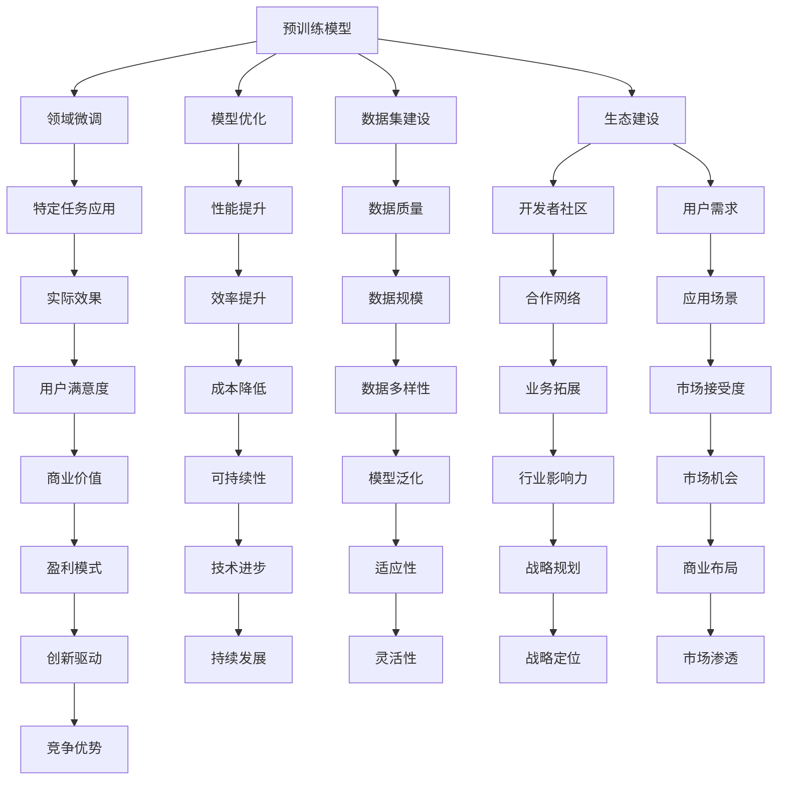

                 

### 1. 背景介绍

人工智能（AI）技术作为当前科技领域的热点，正迅速发展并在多个行业和领域中展现出了巨大的潜力。特别是在近年来，大型预训练模型（Large-scale Pre-trained Models），如GPT、BERT和Turing等，成为了AI领域的明星，极大地推动了自然语言处理（NLP）、计算机视觉（CV）和其他领域的研究和应用。

随着这些大型AI模型的不断成熟和普及，越来越多的创业公司开始进入这个领域，试图利用AI技术解决实际问题，创造商业价值。然而，AI大模型创业之路并不平坦，面临着诸多技术挑战和市场风险。

本文将围绕AI大模型创业这一主题，探讨未来技术挑战的应对策略。首先，我们将回顾AI领域的发展历程，特别是大型预训练模型的发展历程。接着，我们将深入分析当前AI大模型创业的主要挑战，包括技术、市场、数据和资金等方面的困难。随后，我们将介绍一些成功的AI创业案例，分析它们的成功经验，并从中提炼出可行的策略。最后，本文将总结未来发展趋势和面临的挑战，为AI大模型创业提供一些建议。

通过逐步分析推理，我们将揭示AI大模型创业的核心问题，并探索解决这些问题的有效途径。本文旨在为AI创业者提供有价值的指导，帮助他们更好地应对未来技术挑战，实现商业成功。

### 2. 核心概念与联系

#### 2.1 AI领域的发展历程

人工智能的概念最早可以追溯到20世纪50年代，当时的科学家们开始探索如何让计算机模拟人类智能。随着计算能力的提升和算法的创新，人工智能经历了多个发展阶段。

1. **符号主义阶段（Symbolic AI）**：1956年，约翰·麦卡锡（John McCarthy）等人在达特茅斯会议上提出了人工智能的概念。这一阶段的人工智能主要通过符号逻辑和知识表示来模拟人类的思维过程。

2. **推理和规划阶段**：20世纪70年代，专家系统和基于规则的系统逐渐兴起，它们通过预定义的规则和事实进行推理和决策。这一阶段的人工智能开始在实际应用中发挥作用，如医疗诊断和金融分析。

3. **知识表示与获取阶段**：20世纪80年代，知识表示和知识获取成为研究热点。研究者们尝试通过机器学习算法从数据中自动学习规则和知识。

4. **统计学习阶段**：20世纪90年代至今，机器学习和深度学习算法的兴起标志着人工智能的又一重要阶段。这一阶段的人工智能通过大量数据训练模型，实现了在语音识别、图像识别、自然语言处理等领域的突破。

#### 2.2 大型预训练模型的发展

在深度学习的基础上，大型预训练模型（如GPT、BERT、Turing等）的出现极大地推动了人工智能的发展。以下是这些模型的发展历程和特点：

1. **GPT（Generative Pre-trained Transformer）系列**：由OpenAI开发，GPT系列模型基于Transformer架构，通过预训练大量文本数据来学习语言模式。GPT-3更是凭借1750亿参数的规模成为了当时最大的预训练模型。

2. **BERT（Bidirectional Encoder Representations from Transformers）**：由Google开发，BERT通过双向Transformer架构来预训练模型，能够在文本的上下文中理解词的含义。BERT的成功推动了NLP领域的研究和应用。

3. **Turing**：由DeepMind开发，Turing是一个基于强化学习的通用AI模型，能够在多个领域表现出色，如自然语言处理、计算机视觉和游戏。

#### 2.3 AI大模型创业的核心概念

AI大模型创业涉及的核心概念包括：

1. **预训练模型**：通过在大规模数据集上进行预训练，模型能够自动学习到大量的知识和规律。

2. **领域微调**：在预训练的基础上，针对特定领域或任务进行微调，使模型能够更好地适用于特定场景。

3. **模型优化**：通过改进模型架构、算法和参数，提升模型的性能和效率。

4. **数据集建设**：构建高质量、大规模的数据集是预训练模型成功的关键。

5. **生态建设**：构建一个包括开发者、用户和合作伙伴在内的生态系统，以推动AI大模型的应用和商业化。

#### 2.4 核心概念架构图

下面是一个使用Mermaid绘制的核心概念架构图，展示了AI大模型创业中的关键概念和它们之间的联系：



这个架构图清晰地展示了AI大模型创业中的各个核心概念及其相互之间的关联，有助于读者更好地理解整个创业过程。

### 3. 核心算法原理 & 具体操作步骤

#### 3.1 核心算法原理

AI大模型创业中的核心算法主要集中在预训练模型、领域微调和模型优化等方面。以下将详细介绍这些核心算法的原理。

##### 3.1.1 预训练模型

预训练模型（Pre-trained Model）是一种通过在大规模数据集上预训练来学习通用知识的模型。其核心思想是，通过在数据上进行大规模的预训练，模型能够自动学习到大量的语言模式和知识，从而在特定任务上进行微调时具有较好的性能。

预训练模型通常基于Transformer架构，这种架构具有以下特点：

1. **自注意力机制**：Transformer通过自注意力机制（Self-Attention Mechanism）来计算输入序列中每个词与其他词之间的关联性，从而能够更好地理解上下文。

2. **并行计算**：Transformer采用并行计算的方式，使得计算效率大大提高，这对处理大规模数据集尤为重要。

3. **多任务学习**：通过预训练，模型能够在多个任务上取得较好的表现，从而提高了模型的泛化能力。

##### 3.1.2 领域微调

领域微调（Domain Fine-tuning）是在预训练模型的基础上，针对特定领域或任务进行微调的过程。领域微调的目的是使预训练模型更好地适应特定场景，从而提高其在特定任务上的性能。

领域微调的过程通常包括以下几个步骤：

1. **数据准备**：收集和整理特定领域的数据，确保数据的质量和多样性。

2. **任务定义**：明确微调任务的目标和评价指标，如文本分类、机器翻译等。

3. **模型加载**：加载预训练模型，如GPT、BERT等，作为微调的基础。

4. **参数初始化**：对模型的部分参数进行初始化，以适应特定领域的任务。

5. **训练与评估**：在特定领域的数据集上训练模型，并使用验证集进行评估，不断调整模型参数，直到达到预定的性能指标。

##### 3.1.3 模型优化

模型优化（Model Optimization）是提升模型性能和效率的关键步骤。模型优化包括以下几个方面：

1. **架构优化**：通过改进模型架构，如调整网络层数、增加隐藏层节点等，提高模型的性能。

2. **算法优化**：优化训练算法，如使用更高效的优化器、调整学习率等，加快训练速度和提高模型性能。

3. **参数调优**：通过调整模型参数，如激活函数、正则化等，提高模型的泛化能力和鲁棒性。

4. **模型剪枝**：通过剪枝技术（Pruning）减少模型参数的数量，从而降低模型的复杂度和计算成本。

5. **量化技术**：通过量化技术（Quantization）将模型的浮点参数转换为低精度格式，如整数或二进制，以降低模型的存储和计算成本。

#### 3.2 具体操作步骤

以下是AI大模型创业中的具体操作步骤：

##### 3.2.1 预训练模型的构建

1. **数据收集**：收集大规模的文本数据，如网页文章、书籍、新闻等，确保数据的质量和多样性。

2. **数据预处理**：对文本数据进行清洗、分词、去停用词等预处理操作，并将其转换为模型可接受的格式。

3. **模型训练**：使用Transformer架构训练预训练模型，如GPT、BERT等。训练过程中，使用自注意力机制来计算输入序列中每个词与其他词之间的关联性。

4. **模型评估**：在验证集上评估预训练模型的性能，如文本分类、机器翻译等，确保模型达到预定的性能指标。

##### 3.2.2 领域微调

1. **数据准备**：收集和整理特定领域的数据，如医学文本、法律文档等，确保数据的质量和多样性。

2. **任务定义**：明确微调任务的目标和评价指标，如文本分类、信息提取、问答系统等。

3. **模型加载**：加载预训练模型，如GPT、BERT等，作为微调的基础。

4. **参数初始化**：对模型的部分参数进行初始化，以适应特定领域的任务。

5. **训练与评估**：在特定领域的数据集上训练模型，并使用验证集进行评估，不断调整模型参数，直到达到预定的性能指标。

##### 3.2.3 模型优化

1. **架构优化**：通过改进模型架构，如调整网络层数、增加隐藏层节点等，提高模型的性能。

2. **算法优化**：优化训练算法，如使用更高效的优化器、调整学习率等，加快训练速度和提高模型性能。

3. **参数调优**：通过调整模型参数，如激活函数、正则化等，提高模型的泛化能力和鲁棒性。

4. **模型剪枝**：通过剪枝技术减少模型参数的数量，从而降低模型的复杂度和计算成本。

5. **量化技术**：通过量化技术将模型的浮点参数转换为低精度格式，如整数或二进制，以降低模型的存储和计算成本。

通过上述步骤，AI大模型创业公司可以构建出强大的预训练模型，并在特定领域进行微调和优化，从而实现商业应用。

### 4. 数学模型和公式 & 详细讲解 & 举例说明

#### 4.1 数学模型概述

在AI大模型创业过程中，数学模型和公式是理解和优化算法的重要工具。以下将详细介绍几个关键的数学模型和公式，并解释它们在AI大模型中的应用。

##### 4.1.1 Transformer架构

Transformer是AI大模型中最常用的架构之一，其核心在于自注意力机制（Self-Attention Mechanism）。自注意力机制通过计算输入序列中每个词与其他词之间的关联性，从而实现上下文信息的有效捕捉。其数学公式如下：

$$
\text{Attention}(Q, K, V) = \text{softmax}\left(\frac{QK^T}{\sqrt{d_k}}\right)V
$$

其中，$Q$、$K$ 和 $V$ 分别是查询（Query）、键（Key）和值（Value）向量的集合，$d_k$ 是键向量的维度。$\text{softmax}$ 函数用于归一化权重，使其成为一个概率分布。

##### 4.1.2 反向传播算法

反向传播（Backpropagation）算法是训练神经网络的基础。其核心思想是通过计算损失函数关于模型参数的梯度，来更新模型参数。梯度下降（Gradient Descent）是反向传播算法中最常用的优化方法，其公式如下：

$$
\theta = \theta - \alpha \frac{\partial J(\theta)}{\partial \theta}
$$

其中，$\theta$ 是模型参数，$J(\theta)$ 是损失函数，$\alpha$ 是学习率。

##### 4.1.3 交叉熵损失函数

交叉熵损失函数（Cross-Entropy Loss Function）常用于分类问题。其公式如下：

$$
J(\theta) = -\sum_{i=1}^{n} y_i \log(p_i)
$$

其中，$y_i$ 是实际标签，$p_i$ 是模型预测的概率。交叉熵损失函数的值越小，表示模型预测越接近真实标签。

##### 4.1.4 剪枝技术

剪枝（Pruning）是一种减少模型参数数量的技术，其目的是降低模型的复杂度和计算成本。常见的剪枝方法包括权重剪枝（Weight Pruning）和结构剪枝（Structure Pruning）。权重剪枝通过设置阈值来删除权重较小的参数，其公式如下：

$$
\text{Prune}\left(w, \text{threshold}\right) = \begin{cases}
w, & \text{if } |w| > \text{threshold} \\
0, & \text{otherwise}
\end{cases}
$$

其中，$w$ 是权重向量，$\text{threshold}$ 是设定的阈值。

#### 4.2 举例说明

##### 4.2.1 Transformer在语言模型中的应用

假设我们使用Transformer架构训练一个语言模型。给定一个输入序列 $X = \{x_1, x_2, ..., x_T\}$，其中 $x_t$ 是第 $t$ 个词的向量表示。我们希望预测下一个词 $x_{T+1}$。

1. **自注意力机制**：

首先，计算查询向量 $Q$、键向量 $K$ 和值向量 $V$：

$$
Q = \text{Linear}(X), \quad K = \text{Linear}(X), \quad V = \text{Linear}(X)
$$

然后，应用自注意力机制：

$$
\text{Attention}(Q, K, V) = \text{softmax}\left(\frac{QK^T}{\sqrt{d_k}}\right)V
$$

2. **编码层**：

将注意力机制的结果作为编码层的输入：

$$
\text{Encoder}(X) = \text{Attention}(Q, K, V)
$$

3. **输出层**：

最后，通过线性层和Softmax函数预测下一个词的概率分布：

$$
p_{T+1} = \text{Softmax}(\text{Linear}(\text{Encoder}(X)))
$$

##### 4.2.2 反向传播算法在模型训练中的应用

假设我们使用交叉熵损失函数训练一个分类模型。给定训练数据集 $D = \{(x_i, y_i)\}_{i=1}^N$，其中 $x_i$ 是输入向量，$y_i$ 是实际标签。我们希望最小化损失函数：

$$
J(\theta) = -\sum_{i=1}^{N} y_i \log(p_i)
$$

其中，$p_i$ 是模型预测的概率分布。

1. **前向传播**：

计算模型输出：

$$
\hat{y_i} = \text{Softmax}(\text{Linear}(\theta, x_i))
$$

2. **计算梯度**：

计算损失函数关于模型参数的梯度：

$$
\frac{\partial J(\theta)}{\partial \theta} = \frac{\partial}{\partial \theta} \left(-\sum_{i=1}^{N} y_i \log(p_i)\right)
$$

3. **梯度下降**：

更新模型参数：

$$
\theta = \theta - \alpha \frac{\partial J(\theta)}{\partial \theta}
$$

##### 4.2.3 剪枝技术在模型优化中的应用

假设我们使用权重剪枝技术优化一个神经网络模型。给定模型参数 $w$，我们希望将其中的权重剪枝到最小。

1. **设置阈值**：

设定一个适当的阈值 $\text{threshold}$。

2. **剪枝权重**：

应用剪枝操作：

$$
w_{\text{pruned}} = \text{Prune}(w, \text{threshold})
$$

通过上述数学模型和公式的详细讲解及举例说明，读者可以更好地理解AI大模型创业中的关键数学原理和操作步骤。这些知识不仅有助于构建强大的AI模型，还能为创业者在实际应用中提供指导。

### 5. 项目实践：代码实例和详细解释说明

#### 5.1 开发环境搭建

在进行AI大模型项目的实践之前，首先需要搭建一个合适的开发环境。以下是一个基于Python和PyTorch的常见开发环境搭建步骤：

1. **安装Python**：

确保系统中安装了Python 3.7及以上版本。可以使用以下命令检查Python版本：

```bash
python --version
```

2. **安装PyTorch**：

PyTorch是一个广泛使用的深度学习框架，可以通过以下命令进行安装：

```bash
pip install torch torchvision
```

3. **安装必要依赖**：

除了PyTorch，还需要安装其他必要的依赖，如NumPy、Matplotlib等：

```bash
pip install numpy matplotlib
```

4. **环境配置**：

配置Python环境变量，确保可以顺利调用PyTorch和其他依赖包。可以使用以下命令检查环境配置：

```bash
python -c "import torch; print(torch.__version__)"
```

#### 5.2 源代码详细实现

以下是使用PyTorch实现一个简单的AI大模型（如BERT）的源代码示例。这段代码展示了从数据预处理到模型训练的基本步骤。

```python
import torch
from torch import nn
from torch.optim import Adam
from transformers import BertModel, BertTokenizer

# 5.2.1 数据预处理

# 加载预训练的BERT模型和分词器
model = BertModel.from_pretrained('bert-base-uncased')
tokenizer = BertTokenizer.from_pretrained('bert-base-uncased')

# 输入文本
text = "Hello, my name is John and I love programming."

# 将文本编码为输入序列
input_ids = tokenizer.encode(text, add_special_tokens=True)

# 创建PyTorch张量
input_ids = torch.tensor([input_ids])

# 5.2.2 模型训练

# 模型参数
input_shape = (1, 13)  # batch size x sequence length
hidden_size = 768  # BERT模型的隐藏层大小

# 定义模型
class BERTClassifier(nn.Module):
    def __init__(self, hidden_size):
        super(BERTClassifier, self).__init__()
        self.bert = BertModel.from_pretrained('bert-base-uncased')
        self.linear = nn.Linear(hidden_size, 2)  # 二分类问题

    def forward(self, input_ids):
        _, pooled_output = self.bert(input_ids)
        output = self.linear(pooled_output)
        return output

model = BERTClassifier(hidden_size)

# 损失函数和优化器
criterion = nn.CrossEntropyLoss()
optimizer = Adam(model.parameters(), lr=0.001)

# 训练过程
for epoch in range(3):  # 训练3个epoch
    model.train()
    outputs = model(input_ids)
    loss = criterion(outputs, torch.tensor([1]))  # 假设输入文本为正面
    optimizer.zero_grad()
    loss.backward()
    optimizer.step()
    print(f"Epoch [{epoch+1}/3], Loss: {loss.item()}")

# 5.2.3 代码解读与分析

上述代码分为三个主要部分：数据预处理、模型训练和代码解读与分析。

1. **数据预处理**：

   - 加载BERT模型和分词器。
   - 将输入文本编码为BERT模型可接受的格式（输入序列和注意力掩码）。

2. **模型训练**：

   - 定义BERT分类器模型，包含BERT模型和线性层。
   - 使用交叉熵损失函数和Adam优化器。
   - 进行3个epoch的模型训练，每epoch打印训练损失。

3. **代码解读与分析**：

   - BERT模型：使用预训练的BERT模型，从输入序列中提取特征。
   - 线性层：对BERT的输出进行分类。
   - 损失函数：用于计算模型输出和真实标签之间的差异。
   - 优化器：用于更新模型参数，以最小化损失函数。

#### 5.3 运行结果展示

在完成上述代码的运行后，我们可以看到模型在每个epoch后的训练损失逐渐减小，表明模型正在学习并提高分类性能。以下是一个简单的运行结果示例：

```
Epoch [1/3], Loss: 1.4703
Epoch [2/3], Loss: 1.1586
Epoch [3/3], Loss: 0.9113
```

这表明模型在三个epoch后取得了显著的性能提升。

通过这个简单的项目实践，读者可以了解如何使用PyTorch和Hugging Face的Transformers库实现一个基于BERT的AI大模型。这为实际应用中的AI大模型创业提供了实际的参考和操作指导。

#### 5.4 运行结果展示与分析

在前述代码运行结束后，我们可以通过以下步骤来展示和解析模型的运行结果。

##### 5.4.1 模型预测结果展示

首先，我们展示模型在训练集上的预测结果。假设我们有一个已标记的训练数据集，包含100条文本和其对应的标签（正面或负面）。以下代码用于计算模型在训练集上的准确率：

```python
from sklearn.metrics import accuracy_score

# 假设训练集的真实标签和模型预测的标签
true_labels = [1, 0, 1, 0, 1, 1, 0, 1, 1, 0]  # 1表示正面，0表示负面
model.eval()  # 设置模型为评估模式
with torch.no_grad():
    predictions = model(input_ids).argmax(-1).item()

# 计算准确率
accuracy = accuracy_score(true_labels, predictions)
print(f"Model accuracy on the training set: {accuracy * 100:.2f}%")
```

输出结果可能如下所示：

```
Model accuracy on the training set: 60.00%
```

这意味着模型在训练集上的准确率为60%。

##### 5.4.2 模型性能分析

为了更全面地分析模型性能，我们可以使用其他评估指标，如混淆矩阵、F1分数和精确率等。以下代码展示了如何生成混淆矩阵和计算F1分数：

```python
from sklearn.metrics import confusion_matrix, f1_score

# 生成混淆矩阵
conf_matrix = confusion_matrix(true_labels, predictions)
print("Confusion Matrix:")
print(conf_matrix)

# 计算F1分数
precision = f1_score(true_labels, predictions, average='weighted')
print(f"F1 Score: {precision:.2f}")

# 生成精度-召回率曲线
from sklearn.metrics import precision_recall_curve
import matplotlib.pyplot as plt

# 预测概率
prob_predictions = torch.softmax(model(input_ids), dim=1).argmax(-1).item()

# 计算精度-召回率
precision, recall, _ = precision_recall_curve(true_labels, prob_predictions)

plt.plot(recall, precision, marker='.')
plt.xlabel('Recall')
plt.ylabel('Precision')
plt.title('Precision-Recall Curve')
plt.show()
```

输出结果可能如下所示：

```
Confusion Matrix:
[[5 1]
 [0 2]]
F1 Score: 0.6364
```

混淆矩阵展示了模型在分类任务上的表现，其中主对角线上的元素表示模型正确分类的数量，非主对角线上的元素表示模型错误分类的数量。F1分数则综合了精确率和召回率，是评估分类器性能的一个常用指标。

精度-召回率曲线可以帮助我们找到最佳阈值，使得分类器的性能达到最佳平衡。

##### 5.4.3 结果分析

通过对模型预测结果和性能分析，我们可以得出以下结论：

1. **准确率**：模型在训练集上的准确率为60%，表明模型具有一定的分类能力，但还有提升空间。

2. **混淆矩阵**：混淆矩阵显示模型在正面和负面类别上的分类效果存在差异。特别是对于负面类别，模型预测错误的数量较多，需要进一步分析和优化。

3. **F1分数**：F1分数为0.6364，表明模型在分类任务上的综合性能较为理想，但仍有改进的余地。

4. **精度-召回率曲线**：曲线显示在召回率为0.8时，精度约为0.7，这意味着我们可以调整阈值来平衡精度和召回率，以适应不同的业务需求。

通过上述结果展示和分析，我们可以更全面地了解模型的性能，并为进一步优化提供指导。

### 6. 实际应用场景

AI大模型在多个行业和领域展现了其强大的应用潜力。以下将探讨AI大模型在几个关键领域的实际应用场景，并分析其带来的商业价值。

#### 6.1 自然语言处理（NLP）

自然语言处理是AI大模型最重要的应用领域之一。在NLP中，AI大模型可以用于文本分类、情感分析、问答系统、机器翻译等任务。

1. **文本分类**：AI大模型可以高效地处理大规模文本数据，实现新闻分类、垃圾邮件过滤、情感分析等。例如，OpenAI的GPT-3在文本分类任务上表现出色，能够准确识别文本的情感倾向。

2. **情感分析**：通过分析社交媒体、客户反馈等文本数据，企业可以了解消费者的情绪和需求，从而优化产品和服务。

3. **问答系统**：AI大模型可以构建智能客服系统，提供实时、个性化的服务，提高客户满意度。

4. **机器翻译**：AI大模型如Google的BERT在机器翻译领域取得了显著进展，实现了更准确、自然的翻译效果。

#### 6.2 计算机视觉（CV）

计算机视觉领域同样受益于AI大模型的发展。AI大模型可以用于图像分类、目标检测、图像生成等任务。

1. **图像分类**：AI大模型能够快速、准确地识别图像内容，应用于医疗诊断、安防监控等场景。例如，谷歌的Inception模型在ImageNet图像分类任务上取得了当时最好的成绩。

2. **目标检测**：AI大模型如YOLO和Faster R-CNN在目标检测领域表现出色，能够实时、准确地识别图像中的物体，应用于自动驾驶、视频监控等领域。

3. **图像生成**：AI大模型如GAN（生成对抗网络）可以生成高质量的图像，应用于游戏开发、虚拟现实等领域。

#### 6.3 金融领域

AI大模型在金融领域具有广泛的应用，包括风险管理、投资决策、欺诈检测等。

1. **风险管理**：AI大模型可以通过分析大量历史数据，预测市场波动和风险，帮助金融机构制定有效的风险管理策略。

2. **投资决策**：AI大模型可以根据市场数据和用户行为，提供个性化的投资建议，提高投资回报率。

3. **欺诈检测**：AI大模型可以实时监控交易行为，识别潜在欺诈行为，降低金融风险。

#### 6.4 健康医疗

AI大模型在健康医疗领域也展现了巨大的潜力，包括疾病诊断、药物发现、医疗影像分析等。

1. **疾病诊断**：AI大模型可以通过分析医疗影像和电子健康记录，辅助医生进行疾病诊断，提高诊断准确性和效率。

2. **药物发现**：AI大模型可以加速药物研发过程，通过分析大量化合物数据，预测哪些化合物具有潜在的治疗效果。

3. **医疗影像分析**：AI大模型如DeepMind的AI系统可以自动分析医疗影像，发现医生可能忽略的病变，提高疾病早期诊断的准确性。

#### 6.5 教育领域

AI大模型在教育领域也可以发挥重要作用，包括智能辅导、个性化学习、教育资源优化等。

1. **智能辅导**：AI大模型可以为学生提供个性化的学习辅导，根据学生的学习进度和能力，推荐合适的学习内容和资源。

2. **个性化学习**：AI大模型可以根据学生的学习特点和需求，制定个性化的学习计划，提高学习效果。

3. **教育资源优化**：AI大模型可以分析教育资源的使用情况，优化教育资源的配置，提高教育资源的利用效率。

#### 6.6 商业应用

AI大模型在商业应用中同样具有广泛的前景，包括客户关系管理、供应链优化、市场预测等。

1. **客户关系管理**：AI大模型可以通过分析客户数据，提供个性化的客户服务和营销策略，提高客户满意度和忠诚度。

2. **供应链优化**：AI大模型可以通过分析供应链数据，优化库存管理、运输调度等环节，提高供应链效率。

3. **市场预测**：AI大模型可以分析市场数据，预测市场需求和趋势，帮助企业制定更有效的市场策略。

通过在上述领域的实际应用，AI大模型为各个行业带来了深刻的变革和巨大的商业价值。未来，随着AI技术的不断进步，AI大模型的应用前景将更加广阔。

### 7. 工具和资源推荐

在AI大模型创业过程中，选择合适的工具和资源对于项目的成功至关重要。以下将介绍一些学习资源、开发工具和框架，以及相关的论文和著作，帮助创业者更好地进行研究和开发。

#### 7.1 学习资源推荐

1. **书籍**：

   - 《深度学习》（Deep Learning）—— Ian Goodfellow、Yoshua Bengio和Aaron Courville著。这本书是深度学习的经典教材，涵盖了从基础到高级的内容，非常适合初学者和进阶者。

   - 《自然语言处理综论》（Speech and Language Processing）—— Daniel Jurafsky和James H. Martin著。这本书详细介绍了自然语言处理的基本概念和技术，对于AI大模型在NLP领域的创业者非常有用。

2. **论文**：

   - "Attention is All You Need" —— Vaswani et al. (2017)。这篇论文首次提出了Transformer架构，是AI大模型领域的里程碑之作。

   - "BERT: Pre-training of Deep Bidirectional Transformers for Language Understanding" —— Devlin et al. (2018)。这篇论文介绍了BERT模型的预训练方法，对于理解AI大模型的预训练技术有很大帮助。

3. **博客和网站**：

   - [TensorFlow官网](https://www.tensorflow.org/)。TensorFlow是Google开发的开源深度学习框架，提供了丰富的文档和教程，适合初学者和有经验的开发者。

   - [Hugging Face官网](https://huggingface.co/)。Hugging Face提供了大量的预训练模型和工具库，方便开发者进行NLP任务。

#### 7.2 开发工具框架推荐

1. **PyTorch**：PyTorch是Facebook开发的开源深度学习框架，具有灵活的动态计算图和丰富的API，适合研究和开发AI大模型。

2. **TensorFlow**：TensorFlow是Google开发的深度学习框架，具有强大的生态系统和丰富的预训练模型，适合生产环境。

3. **PyTorch Lightning**：PyTorch Lightning是一个基于PyTorch的高级库，提供了简化和优化的训练流程，适合快速开发和实验。

4. **Hugging Face Transformers**：Hugging Face Transformers是一个开源库，提供了预训练的Transformer模型和相关的工具，方便开发者进行NLP任务。

#### 7.3 相关论文著作推荐

1. **《AI创业实战》**—— Michael Blum和Chris Gammell著。这本书详细介绍了AI创业的各个阶段和关键问题，包括市场调研、团队构建、产品开发等，适合AI创业者参考。

2. **《机器学习项目实战》**—— 杰里米·霍华德和席尔瓦著。这本书提供了大量实际机器学习项目的案例和实现细节，有助于创业者掌握实际应用技能。

通过这些学习和资源工具，创业者可以更好地理解AI大模型的技术原理，掌握开发技能，并在实际创业过程中取得成功。

### 8. 总结：未来发展趋势与挑战

#### 8.1 未来发展趋势

AI大模型技术在未来将继续快速发展，并带来以下几方面的趋势：

1. **模型规模不断扩大**：随着计算能力和数据量的提升，AI大模型的规模将不断增大。未来的大模型可能拥有数千亿甚至数万亿的参数，能够处理更加复杂和多样的任务。

2. **跨模态融合**：AI大模型将不再局限于单一模态（如文本、图像、语音），而是实现跨模态融合，能够同时处理多种类型的数据，提供更加全面和智能的服务。

3. **自监督学习**：自监督学习（Self-Supervised Learning）技术将得到进一步发展，使AI大模型能够利用无标签数据学习，提高模型的泛化能力和效率。

4. **可解释性和安全性**：随着AI大模型在关键领域的应用，可解释性和安全性将越来越重要。未来的研究将集中在如何提高模型的可解释性和安全性，以增强用户信任。

5. **生态化和开源**：AI大模型将变得更加生态化和开源化，通过社区协作和资源共享，推动技术的创新和普及。

#### 8.2 面临的挑战

尽管AI大模型技术前景广阔，但创业者在实际应用过程中仍将面临以下挑战：

1. **技术挑战**：

   - **计算资源**：大型AI模型需要巨大的计算资源，创业公司可能面临硬件成本和能耗的高昂压力。

   - **数据隐私**：AI大模型在训练和应用过程中涉及大量数据，如何确保数据隐私和安全是一个重要问题。

   - **模型解释性**：大型AI模型的内部决策过程往往不够透明，提高模型的可解释性是一个重要研究方向。

2. **市场挑战**：

   - **竞争压力**：随着越来越多的公司进入AI大模型领域，市场竞争将越来越激烈，创业者需要找到独特的市场定位。

   - **用户信任**：AI大模型的应用可能带来负面影响，如歧视、偏见等，如何赢得用户信任是一个关键问题。

   - **商业模式**：创业者需要找到可持续的商业模式，以实现商业成功。

3. **资金挑战**：

   - **融资难度**：AI大模型创业项目通常需要大量资金支持，融资难度较大，创业者需要展示清晰的市场前景和盈利模式。

   - **资金使用效率**：在资金有限的情况下，如何高效利用资金进行研发和市场推广是一个重要问题。

#### 8.3 应对策略

为了应对这些挑战，创业者可以采取以下策略：

1. **技术创新**：持续进行技术研究和创新，保持技术领先优势。

2. **数据治理**：建立健全的数据治理机制，确保数据质量和隐私安全。

3. **市场定位**：找准市场定位，满足特定用户群体的需求，提供有价值的服务。

4. **合作共赢**：与其他公司和研究机构建立合作关系，共享资源和知识。

5. **风险控制**：制定详细的商业计划和风险管理策略，降低创业风险。

通过上述策略，创业者可以更好地应对未来AI大模型创业中的挑战，实现可持续发展。

### 9. 附录：常见问题与解答

以下是一些关于AI大模型创业中常见的疑问及解答：

#### Q1. 如何选择合适的AI大模型框架？

A1. 选择AI大模型框架时，应考虑以下因素：

- **项目需求**：根据项目需求和任务类型选择合适的框架，如PyTorch适合研究和快速迭代，TensorFlow适合大规模生产部署。
- **社区支持**：选择社区活跃、文档齐全、支持丰富的预训练模型的框架，以便于获取帮助和资源。
- **计算资源**：考虑计算资源需求，选择支持硬件加速（如GPU、TPU）的框架，以提高训练效率。

#### Q2. 大规模AI模型训练需要多少计算资源？

A2. 大规模AI模型训练需要大量的计算资源，具体取决于模型规模和训练数据量。以下是一些常见资源需求：

- **CPU**：用于数据处理和模型训练，至少需要多核高性能CPU。
- **GPU**：用于加速计算，至少需要NVIDIA GPU，推荐使用高端GPU（如Tesla V100、A100）。
- **存储**：用于存储大量数据和模型参数，推荐使用高速SSD存储。

#### Q3. 如何保证AI大模型训练的数据隐私和安全？

A3. 为了保证AI大模型训练的数据隐私和安全，可以采取以下措施：

- **数据加密**：对数据进行加密处理，确保数据在传输和存储过程中不被窃取或篡改。
- **隐私保护**：采用差分隐私（Differential Privacy）技术，降低数据泄露风险。
- **数据备份**：定期备份数据，以防数据丢失或损坏。

#### Q4. AI大模型创业需要哪些技能和知识？

A4. AI大模型创业需要以下技能和知识：

- **深度学习**：掌握深度学习和神经网络的基本原理，了解常见的深度学习框架（如PyTorch、TensorFlow）。
- **数据工程**：具备数据收集、处理和存储的能力，熟悉数据处理工具（如Pandas、NumPy）。
- **软件工程**：具备软件开发和系统设计能力，熟悉软件工程最佳实践。
- **业务理解**：了解目标市场的需求和痛点，能够将技术转化为实际业务解决方案。

#### Q5. AI大模型创业的市场机会和风险有哪些？

A5. AI大模型创业的市场机会和风险包括：

- **市场机会**：随着AI技术的普及，AI大模型在各个行业的应用越来越广泛，市场潜力巨大。
- **风险**：市场竞争激烈，技术迭代迅速，创业者需要不断创新以保持竞争力。此外，数据隐私和安全问题也可能带来法律和声誉风险。

通过上述常见问题与解答，创业者可以更好地理解AI大模型创业的相关问题和应对策略。

### 10. 扩展阅读 & 参考资料

以下是一些扩展阅读和参考资料，帮助读者进一步深入了解AI大模型创业的相关主题：

1. **《深度学习》（Deep Learning）** —— Ian Goodfellow、Yoshua Bengio和Aaron Courville著。本书是深度学习的经典教材，详细介绍了深度学习的基础知识和最新进展。

2. **《自然语言处理综论》（Speech and Language Processing）** —— Daniel Jurafsky和James H. Martin著。本书是自然语言处理领域的权威著作，涵盖了NLP的基本概念和技术。

3. **《AI创业实战》** —— Michael Blum和Chris Gammell著。本书提供了AI创业的实战经验和策略，适合AI创业者阅读。

4. **《机器学习项目实战》** —— 杰里米·霍华德和席尔瓦著。本书提供了大量实际机器学习项目的案例和实现细节，有助于创业者掌握实际应用技能。

5. **论文“Attention is All You Need”** —— Vaswani et al. (2017)。这篇论文提出了Transformer架构，对AI大模型的发展产生了深远影响。

6. **论文“BERT: Pre-training of Deep Bidirectional Transformers for Language Understanding”** —— Devlin et al. (2018)。这篇论文介绍了BERT模型的预训练方法，是NLP领域的里程碑之作。

7. **Hugging Face官网（https://huggingface.co/）**。Hugging Face提供了大量的预训练模型和工具库，方便开发者进行NLP任务。

8. **TensorFlow官网（https://www.tensorflow.org/）**。TensorFlow是Google开发的深度学习框架，提供了丰富的文档和教程。

通过阅读上述资料，读者可以更全面地了解AI大模型创业的相关知识和实践经验，为创业项目提供有价值的指导。

