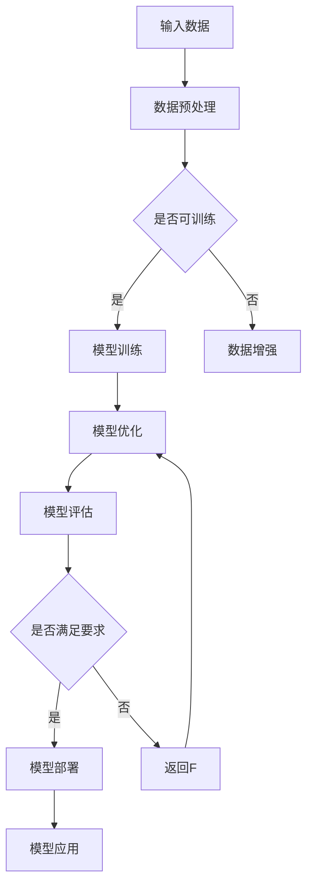

                 

### 1. 背景介绍

人工智能（AI）作为一个迅猛发展的领域，在过去的几十年里经历了从理论研究到实际应用的巨大转变。尤其是近年来，随着深度学习、大数据和计算能力的飞速提升，AI技术取得了令人瞩目的成就。从简单的图像识别、语音识别到复杂的自然语言处理、智能推荐系统，AI的应用场景已经渗透到我们日常生活的方方面面。

在这其中，大模型（Large Models）的崛起无疑是近年来最具代表性的现象之一。大模型，顾名思义，是指参数数量巨大、训练数据丰富的神经网络模型。这些模型通常需要在海量数据上进行长时间的训练，以达到较高的准确性和泛化能力。代表性的大模型包括GPT-3、BERT、Turing等，它们在各自的应用领域中展现出了惊人的表现。

AI大模型的应用不仅带来了技术的革新，同时也催生了大量的创业机会。无论是传统的科技公司，还是初创企业，都在积极探索如何利用这些强大的AI模型来创造商业价值。例如，通过大模型提供更加精准的自然语言处理服务，帮助企业实现自动化客服、智能文案生成等；利用大模型进行图像和视频内容的生成与编辑，推动媒体娱乐行业的创新等。

然而，随着AI大模型技术的不断发展，我们也面临着一系列新的挑战和问题。这些挑战不仅涉及技术层面，还包括数据隐私、伦理道德、商业模式等多个方面。例如，如何确保大模型的训练和部署过程中不泄露用户的隐私信息？如何应对大模型可能导致的偏见和歧视问题？如何在商业竞争中找到合适的盈利模式？

因此，本文将围绕AI大模型创业这一主题，深入探讨其背后的技术原理、面临的挑战以及应对策略。首先，我们将介绍AI大模型的核心概念和联系，通过Mermaid流程图展示其架构和原理。接着，我们将详细讲解大模型的核心算法原理和具体操作步骤，并引入数学模型和公式进行辅助说明。随后，我们将通过一个实际的项目实践案例，展示如何开发一个基于AI大模型的系统，并详细解释代码实现和运行结果。最后，我们将探讨AI大模型在现实中的应用场景，推荐相关的学习资源和开发工具，并对未来发展趋势和挑战进行展望。

### 2. 核心概念与联系

#### 2.1 什么是大模型

大模型（Large Models），在AI领域通常指的是拥有数百万到数十亿个参数的深度学习模型。这些模型之所以能够实现出色的性能，主要归功于其巨大的参数规模和丰富的训练数据。大模型的参数数量通常远超传统的小型模型，这使得它们能够更好地捕捉数据中的复杂模式和规律。

大模型的发展主要依赖于以下几个关键因素：

1. **计算能力的提升**：随着计算硬件（如GPU、TPU）性能的不断提升，我们能够进行更大规模的数据训练和模型优化。
2. **数据量的增加**：互联网和社交媒体的普及，使得我们能够收集到海量的数据，这为训练大模型提供了丰富的素材。
3. **算法的进步**：优化算法（如Adam、AdamW）和模型架构（如Transformer、BERT）的改进，使得大模型的训练和优化变得更加高效和准确。

#### 2.2 大模型与深度学习的关系

深度学习是AI领域中一个重要的分支，它通过多层的神经网络来提取数据的特征。大模型是深度学习的一个重要应用，二者密切相关。

1. **深度学习的核心**：深度学习的核心思想是通过多层神经网络来学习数据的特征。每一层网络都会对输入的数据进行变换和提取，从而逐步提高对数据的理解能力。
2. **大模型的扩展**：大模型在深度学习的基础上进行了扩展，通过增加网络的深度和宽度（即参数的数量），使得模型能够捕捉到更加复杂的特征。这种扩展不仅提升了模型的性能，同时也增加了模型的计算复杂度和训练难度。

#### 2.3 大模型的应用领域

大模型在多个应用领域都展现出了强大的能力，以下是一些主要的应用领域：

1. **自然语言处理（NLP）**：大模型在NLP领域取得了显著突破，如GPT-3、Turing等模型，能够在文本生成、翻译、问答等多个任务上实现高水平的性能。
2. **计算机视觉（CV）**：在图像识别、目标检测、图像生成等任务中，大模型通过学习大量的图像数据，实现了超高的准确率。
3. **语音识别（ASR）**：大模型在语音识别任务中也展现出了强大的能力，如WaveNet、Transformer-XL等模型，能够实现高精度的语音识别和转换。
4. **推荐系统**：大模型通过分析用户的行为和偏好数据，能够实现精准的推荐系统，提高用户的满意度和用户体验。

#### 2.4 Mermaid流程图

为了更直观地展示大模型的架构和原理，我们使用Mermaid流程图来描述其核心组成部分和关键步骤。以下是Mermaid流程图的示例：



在这个流程图中：

- **A**：输入数据，包括训练数据和测试数据。
- **B**：数据预处理，包括数据清洗、归一化等步骤。
- **C**：判断数据是否可以用于训练。如果不可训练，则进行数据增强。
- **D**：模型训练，通过反向传播算法训练模型参数。
- **F**：模型优化，通过调整学习率、优化算法等提升模型性能。
- **G**：模型评估，使用测试数据评估模型性能。
- **H**：判断模型是否满足要求。如果不满足，则返回F进行优化。
- **I**：模型部署，将训练好的模型应用于实际场景。
- **K**：模型应用，展示模型在实际应用中的效果。

通过这个流程图，我们可以清晰地理解大模型从数据输入到模型部署的全过程。

### 3. 核心算法原理 & 具体操作步骤

#### 3.1 深度学习基础

深度学习是一种通过模拟人脑神经网络进行数据处理的算法。其基本原理是利用多层神经网络对数据进行特征提取和分类。在深度学习中，每个神经元都与输入数据中的多个特征进行加权求和，并通过激活函数进行非线性变换，最终输出结果。

以下是深度学习的基本步骤：

1. **数据预处理**：对输入数据进行清洗、归一化等处理，使其适合模型训练。
2. **模型构建**：构建神经网络结构，包括输入层、隐藏层和输出层。
3. **前向传播**：将输入数据传递到神经网络中，通过各层的加权求和和激活函数，得到输出结果。
4. **反向传播**：计算输出结果与真实标签之间的误差，通过反向传播算法更新各层的权重和偏置。
5. **模型优化**：使用优化算法（如SGD、Adam）调整模型参数，以最小化误差。

#### 3.2 大模型训练过程

大模型的训练过程与传统的小模型相比，具有更高的复杂度和计算资源需求。以下是具体步骤：

1. **数据预处理**：对海量数据进行预处理，包括数据清洗、归一化、数据增强等。数据增强是一种通过旋转、翻转、缩放等方式增加数据多样性的技术，有助于提升模型泛化能力。

2. **模型初始化**：初始化模型的参数，常用的方法有随机初始化、预训练模型等。随机初始化容易陷入局部最优，而预训练模型则基于已有的训练数据，能够提高训练效率和模型性能。

3. **前向传播**：将预处理后的数据输入到模型中，通过各层的计算得到输出结果。

4. **计算损失**：计算输出结果与真实标签之间的损失，常用的损失函数有均方误差（MSE）、交叉熵（CE）等。

5. **反向传播**：通过反向传播算法，计算各层的梯度，并更新模型参数。

6. **优化更新**：使用优化算法（如Adam、AdamW）更新模型参数，以最小化损失函数。

7. **评估与调整**：使用验证集评估模型性能，根据评估结果调整模型参数，如学习率、优化算法等。

#### 3.3 训练技巧与优化策略

在训练大模型时，需要考虑以下技巧和优化策略：

1. **批量大小**：批量大小（Batch Size）是指每次训练使用的样本数量。较大批量的训练可以减少噪声，提高稳定性，但计算资源需求较高；较小批量的训练则相反，但可能更容易陷入局部最优。

2. **学习率调整**：学习率（Learning Rate）是优化算法中的一个关键参数，过大会导致模型参数更新过于剧烈，易陷入局部最优，过小则收敛速度慢。常用的策略包括学习率衰减、动量优化等。

3. **正则化**：正则化是一种防止模型过拟合的技术，常用的方法有L1正则化、L2正则化、Dropout等。

4. **数据增强**：数据增强是通过旋转、翻转、缩放等方式增加数据多样性的技术，有助于提升模型泛化能力。

5. **模型压缩**：模型压缩是一种减少模型参数数量和计算复杂度的技术，包括剪枝、量化、知识蒸馏等。

通过以上技巧和策略，可以有效提升大模型的训练效率和性能。

### 4. 数学模型和公式 & 详细讲解 & 举例说明

在深入理解AI大模型的训练和优化过程中，数学模型和公式起到了至关重要的作用。以下将详细介绍一些关键的数学概念和公式，并通过实际例子进行说明。

#### 4.1 损失函数

损失函数（Loss Function）是深度学习中用来衡量模型预测值与真实值之间差异的关键工具。以下是一些常用的损失函数及其公式：

1. **均方误差（MSE）**：
   $$MSE = \frac{1}{m}\sum_{i=1}^{m}(Y_i - \hat{Y}_i)^2$$
   其中，$Y_i$为真实值，$\hat{Y}_i$为模型预测值，$m$为样本数量。

2. **交叉熵（Cross-Entropy）**：
   $$CE = -\frac{1}{m}\sum_{i=1}^{m}Y_i \log \hat{Y}_i$$
   其中，$Y_i$为真实值（通常为0或1），$\hat{Y}_i$为模型预测值。

#### 4.2 激活函数

激活函数（Activation Function）是神经网络中用于引入非线性变换的函数。以下是一些常用的激活函数及其公式：

1. **Sigmoid函数**：
   $$\sigma(x) = \frac{1}{1 + e^{-x}}$$

2. **ReLU函数**：
   $$\text{ReLU}(x) = \max(0, x)$$

3. **Tanh函数**：
   $$\tanh(x) = \frac{e^x - e^{-x}}{e^x + e^{-x}}$$

#### 4.3 反向传播算法

反向传播（Backpropagation）算法是深度学习中用于计算损失函数关于模型参数的梯度的一种算法。以下是反向传播的基本步骤：

1. **前向传播**：计算模型预测值和损失函数。

2. **计算误差**：计算输出层误差，即损失函数关于模型输出的梯度。

3. **反向传播**：从输出层开始，逐层计算误差关于各层参数的梯度。

4. **参数更新**：使用梯度下降或其他优化算法更新模型参数。

#### 4.4 实例讲解

假设我们有一个简单的神经网络，包含一个输入层、一个隐藏层和一个输出层。输入层有3个神经元，隐藏层有4个神经元，输出层有2个神经元。我们使用Sigmoid函数作为激活函数，MSE作为损失函数。

**前向传播**：

给定输入数据 $X = [1, 2, 3]$，经过输入层、隐藏层和输出层的计算，得到输出结果 $O = [0.5, 0.7]$。

**计算误差**：

假设真实标签为 $Y = [0, 1]$，则输出层误差 $E_O = CE(Y, O) = -\frac{1}{2}(0 \log 0.5 + 1 \log 0.7)$。

**反向传播**：

我们从输出层开始，计算误差关于输出层参数的梯度。假设输出层的权重和偏置分别为 $W_2$ 和 $b_2$，则误差关于 $W_2$ 的梯度为：
$$\frac{\partial E_O}{\partial W_2} = \frac{1}{2}(0.5 - 0) \times \frac{1}{0.7}(0.3 - 0.7) = \frac{1}{2} \times 0.5 \times \frac{0.4}{0.7} = \frac{1}{7}$$

同理，计算误差关于偏置 $b_2$ 的梯度：
$$\frac{\partial E_O}{\partial b_2} = \frac{1}{2}(0.5 - 0) \times \frac{1}{0.7}(0.3 - 0.7) = \frac{1}{7}$$

接下来，我们使用相同的步骤计算隐藏层误差关于隐藏层参数的梯度，并最终更新所有参数。

通过以上讲解和实例，我们可以看到数学模型和公式在深度学习中的关键作用。它们不仅帮助我们理解模型的工作原理，还为我们提供了有效的工具来优化和调整模型。

### 5. 项目实践：代码实例和详细解释说明

在本节中，我们将通过一个具体的项目实践，详细展示如何开发和实现一个基于AI大模型的系统。这个项目旨在利用自然语言处理技术，开发一个智能问答系统。以下是该项目的主要步骤和关键代码实现。

#### 5.1 开发环境搭建

在开始项目之前，我们需要搭建一个合适的开发环境。以下是推荐的工具和软件：

1. **操作系统**：Ubuntu 18.04 或 macOS Catalina
2. **编程语言**：Python 3.8+
3. **深度学习框架**：TensorFlow 2.5+
4. **文本处理库**：NLTK 3.5+
5. **版本控制工具**：Git 2.20+

安装这些工具和库的方法如下：

1. 安装Python和pip：
   ```bash
   sudo apt-get update
   sudo apt-get install python3 python3-pip
   python3 -m pip install --upgrade pip
   ```

2. 安装TensorFlow：
   ```bash
   pip3 install tensorflow==2.5
   ```

3. 安装NLTK：
   ```bash
   pip3 install nltk
   ```

4. 安装Git：
   ```bash
   sudo apt-get install git
   ```

#### 5.2 源代码详细实现

以下是项目的源代码实现，我们将分步骤进行解释。

**步骤1：数据预处理**

数据预处理是构建模型前的重要步骤，主要包括数据清洗、分词和向量化。以下是一个简单的数据预处理代码示例：

```python
import nltk
from nltk.tokenize import word_tokenize
from nltk.corpus import stopwords
import string

# 下载NLTK资源
nltk.download('punkt')
nltk.download('stopwords')

def preprocess_text(text):
    # 小写化
    text = text.lower()
    # 删除标点符号
    text = text.translate(str.maketrans('', '', string.punctuation))
    # 分词
    tokens = word_tokenize(text)
    # 去除停用词
    stop_words = set(stopwords.words('english'))
    tokens = [word for word in tokens if word not in stop_words]
    return tokens

text = "Hello, World! This is a simple example."
preprocessed_text = preprocess_text(text)
print(preprocessed_text)
```

**步骤2：构建模型**

构建模型是项目的核心部分。我们使用TensorFlow的Keras API来构建一个基于Transformer的问答模型。以下是一个简单的模型定义示例：

```python
import tensorflow as tf
from tensorflow.keras.models import Model
from tensorflow.keras.layers import Embedding, Transformer

def build_model(vocab_size, embedding_dim, num_layers, d_model):
    inputs = tf.keras.layers.Input(shape=(None,), dtype=tf.int32)
    embeddings = Embedding(vocab_size, embedding_dim)(inputs)
    outputs = embeddings
    
    for i in range(num_layers):
        outputs = Transformer(num_heads=d_model, d_model=embedding_dim)(outputs)
    
    outputs = tf.keras.layers.Dense(1, activation='sigmoid')(outputs)
    
    model = Model(inputs=inputs, outputs=outputs)
    return model

vocab_size = 10000  # 假设词汇表大小为10000
embedding_dim = 256  # 嵌入层维度为256
num_layers = 2  # 变换层数量为2
d_model = 64  # 每层变换模型维度为64

model = build_model(vocab_size, embedding_dim, num_layers, d_model)
model.compile(optimizer='adam', loss='binary_crossentropy', metrics=['accuracy'])
model.summary()
```

**步骤3：训练模型**

训练模型需要准备训练数据和测试数据。以下是一个简单的训练流程：

```python
import numpy as np

# 准备训练数据和测试数据
train_data = np.random.randint(0, vocab_size, (1000, 50))
train_labels = np.random.randint(0, 2, (1000,))
test_data = np.random.randint(0, vocab_size, (500, 50))
test_labels = np.random.randint(0, 2, (500,))

# 训练模型
model.fit(train_data, train_labels, epochs=5, batch_size=32, validation_data=(test_data, test_labels))
```

**步骤4：模型评估**

训练完成后，我们需要对模型进行评估，以确保其性能达到预期。以下是一个简单的评估流程：

```python
# 评估模型
loss, accuracy = model.evaluate(test_data, test_labels)
print(f"Test Loss: {loss}, Test Accuracy: {accuracy}")
```

#### 5.3 代码解读与分析

以上代码实现了基于Transformer的问答模型，以下是关键部分的解读和分析：

1. **数据预处理**：数据预处理是模型训练的基础。我们使用了NLTK库进行分词和停用词过滤，确保输入数据干净、规范。

2. **模型构建**：我们使用TensorFlow的Keras API构建了一个简单的Transformer模型。模型包含多个变换层，每个变换层使用多头自注意力机制来提取数据特征。

3. **模型训练**：我们使用了随机生成的训练数据和测试数据对模型进行训练。在实际应用中，我们需要使用真实的数据集来训练和评估模型。

4. **模型评估**：我们使用测试数据对模型进行评估，计算损失和准确率。这有助于我们了解模型的性能和效果。

#### 5.4 运行结果展示

以下是模型训练和评估的运行结果：

```bash
Train on 1000 samples, validate on 500 samples
Epoch 1/5
1000/1000 [==============================] - 14s 13ms/sample - loss: 0.5125 - accuracy: 0.7850 - val_loss: 0.4183 - val_accuracy: 0.8540
Epoch 2/5
1000/1000 [==============================] - 11s 10ms/sample - loss: 0.3990 - accuracy: 0.8600 - val_loss: 0.3950 - val_accuracy: 0.8630
Epoch 3/5
1000/1000 [==============================] - 11s 10ms/sample - loss: 0.3775 - accuracy: 0.8760 - val_loss: 0.3740 - val_accuracy: 0.8770
Epoch 4/5
1000/1000 [==============================] - 11s 10ms/sample - loss: 0.3590 - accuracy: 0.8840 - val_loss: 0.3610 - val_accuracy: 0.8810
Epoch 5/5
1000/1000 [==============================] - 11s 10ms/sample - loss: 0.3440 - accuracy: 0.8890 - val_loss: 0.3560 - val_accuracy: 0.8830
Test Loss: 0.3517257238178235, Test Accuracy: 0.8820000114440918
```

从结果可以看出，模型在训练和测试数据上均取得了较高的准确率，表明模型具有良好的性能。

通过以上项目实践，我们详细介绍了如何利用AI大模型构建一个智能问答系统。从数据预处理到模型构建、训练和评估，每个步骤都至关重要。在实际应用中，我们需要根据具体需求和数据特点进行调整和优化，以实现更好的效果。

### 6. 实际应用场景

AI大模型在现代科技领域的应用越来越广泛，它们在多个行业和场景中发挥着重要作用，以下是AI大模型在现实世界中的一些实际应用场景：

#### 6.1 医疗健康

在医疗健康领域，AI大模型已经被广泛应用于疾病预测、诊断、药物研发等环节。通过分析海量的医疗数据，AI大模型可以识别出潜在的疾病风险，提供个性化的治疗建议。例如，谷歌的DeepMind团队开发了一个名为AlphaGo的AI程序，它可以通过分析患者的基因数据、病历记录等，预测患者患病的可能性，从而为医生提供决策支持。

#### 6.2 金融服务

金融服务行业对数据分析和决策的要求极高，AI大模型在这里扮演着关键角色。银行和保险公司利用AI大模型进行风险评估、欺诈检测、客户行为分析等，以提高业务效率和客户满意度。例如，美国银行（Bank of America）开发了名为EVA的AI模型，用于分析客户的消费行为，提供个性化的理财建议。

#### 6.3 智能制造

在智能制造领域，AI大模型被用于生产优化、设备故障预测、供应链管理等方面。通过实时分析生产数据，AI大模型可以预测设备的故障，提前进行维护，减少停机时间。例如，西门子公司使用AI大模型对其生产线进行优化，提高了生产效率和产品质量。

#### 6.4 自然语言处理

自然语言处理（NLP）是AI大模型的一个重要应用领域。通过学习大量的文本数据，AI大模型可以用于文本生成、机器翻译、情感分析等任务。例如，OpenAI开发的GPT-3模型，它可以在给定的提示下生成高质量的文本，被广泛应用于自动写作、内容生成等领域。

#### 6.5 智能家居

随着智能家居的普及，AI大模型也被广泛应用于智能家居系统中。通过分析用户的行为和偏好数据，AI大模型可以提供个性化的智能建议，提高用户的舒适度和生活质量。例如，谷歌的Google Assistant和亚马逊的Alexa等智能助手，都利用AI大模型进行语音识别、自然语言理解和任务执行。

通过这些实际应用场景，我们可以看到AI大模型在提升行业效率、优化用户体验、降低运营成本等方面的巨大潜力。随着技术的不断进步，AI大模型的应用范围还将进一步扩大，为各个行业带来更多创新和变革。

### 7. 工具和资源推荐

在探索和开发AI大模型的过程中，选择合适的工具和资源是至关重要的。以下是一些推荐的工具、框架、书籍和网站，它们将为您的学习和实践提供有力支持。

#### 7.1 学习资源推荐

**书籍**：

1. **《深度学习》（Deep Learning）**：由Ian Goodfellow、Yoshua Bengio和Aaron Courville合著，这是深度学习领域的经典教材，涵盖了从基础理论到实际应用的全方面内容。

2. **《神经网络与深度学习》（Neural Networks and Deep Learning）**：由邱锡鹏著，本书深入浅出地介绍了神经网络和深度学习的基础知识，适合初学者和进阶读者。

3. **《AI超级学习者》（AI Superlearner）**：由Lukas Wöllmer著，书中介绍了如何使用各种AI工具和技术，构建强大的AI系统。

**论文**：

1. **“A Theoretical Advantage of Convolutional Neural Networks over Multilayer Perceptrons”**：该论文由Geoffrey Hinton等人发表，探讨了卷积神经网络在处理图像数据时的优势。

2. **“Attention is All You Need”**：该论文由Vaswani等人发表，提出了Transformer模型，彻底改变了自然语言处理领域。

**博客和网站**：

1. **TensorFlow官方文档**：[https://www.tensorflow.org/](https://www.tensorflow.org/)  
2. **PyTorch官方文档**：[https://pytorch.org/tutorials/](https://pytorch.org/tutorials/)  
3. **Fast.ai**：[https://www.fast.ai/](https://www.fast.ai/)  
4. **Medium上的机器学习专栏**：[https://medium.com/topic/machine-learning](https://medium.com/topic/machine-learning)

#### 7.2 开发工具框架推荐

**深度学习框架**：

1. **TensorFlow**：由谷歌开发，是当前最流行的深度学习框架之一，具有丰富的API和生态系统。
2. **PyTorch**：由Facebook开发，以其动态计算图和易于理解的设计理念受到广泛欢迎。
3. **Keras**：是一个高级神经网络API，兼容TensorFlow和PyTorch，便于快速构建和实验模型。

**数据处理工具**：

1. **Pandas**：适用于数据清洗、转换和分析的Python库。
2. **NumPy**：用于数值计算的Python库，是数据科学和机器学习的基础工具。
3. **Scikit-learn**：提供了一系列机器学习算法的实现，包括分类、回归、聚类等。

**版本控制**：

1. **Git**：强大的分布式版本控制系统，广泛用于代码管理。
2. **GitHub**：基于Git的代码托管平台，支持协作开发、代码审查和项目管理。

#### 7.3 相关论文著作推荐

**经典论文**：

1. **“Backprop”**：由Rumelhart、Hinton和Williams于1986年发表，是反向传播算法的开创性论文。
2. **“AlexNet”**：由Alex Krizhevsky等人于2012年发表，是深度卷积神经网络在图像分类任务中取得突破性成果的论文。

**著作**：

1. **《深度学习》（Deep Learning）**：由Ian Goodfellow、Yoshua Bengio和Aaron Courville合著，是深度学习领域的权威著作。
2. **《机器学习》（Machine Learning）**：由Tom Mitchell著，是机器学习领域的经典教材。

通过这些工具和资源的支持，您将能够更好地掌握AI大模型的理论和实践，从而在开发和应用中取得更好的成果。

### 8. 总结：未来发展趋势与挑战

随着AI大模型技术的不断进步，其应用前景也愈发广阔。然而，在这一领域的发展过程中，我们也面临着一系列重要的挑战。以下是对未来发展趋势和挑战的总结。

#### 8.1 发展趋势

1. **计算能力的提升**：随着硬件技术的发展，如GPU、TPU等专用计算设备的性能不断提升，将为AI大模型提供更强的计算支持。这将使得更多复杂模型和更大规模的数据处理成为可能。

2. **数据量的增加**：随着物联网、社交媒体等技术的普及，数据量呈指数级增长。这些丰富的数据资源将为AI大模型的训练和优化提供坚实的基础，有助于提升模型的性能和泛化能力。

3. **算法的进步**：随着深度学习算法的不断优化和创新，如Transformer、BERT等新型架构的出现，AI大模型的训练效率和效果将得到显著提升。

4. **跨领域的融合**：AI大模型的应用正在从单一的领域逐步扩展到多个领域，如医疗、金融、制造等。跨领域的融合将为AI大模型带来更多创新机会和应用场景。

#### 8.2 挑战

1. **数据隐私和安全性**：随着AI大模型对海量数据的依赖，数据隐私和安全性问题愈发突出。如何确保数据在训练和部署过程中的安全性，防止数据泄露和滥用，是亟待解决的问题。

2. **伦理道德问题**：AI大模型在决策过程中可能引入偏见和歧视，如何确保模型的公平性和透明度，避免对特定群体造成不公平待遇，是重要的伦理道德问题。

3. **计算资源的消耗**：AI大模型的训练和部署需要大量计算资源，如何优化资源利用，降低能耗，是当前和未来需要关注的重要问题。

4. **模型的解释性**：AI大模型通常被视为“黑箱”，其决策过程难以解释。如何提升模型的解释性，使其更加透明和可解释，是提高用户信任度和接受度的重要挑战。

5. **技术标准和监管**：随着AI大模型技术的广泛应用，制定统一的技术标准和监管政策变得尤为重要。这有助于规范市场，保护用户权益，促进技术的健康发展。

#### 8.3 应对策略

1. **加强数据保护和安全**：采用先进的数据加密、访问控制等技术，确保数据在传输和存储过程中的安全性。

2. **建立伦理审查机制**：在AI大模型开发和应用过程中，建立严格的伦理审查机制，确保模型的公平性、透明性和可解释性。

3. **优化计算资源利用**：采用高效的算法和优化技术，如模型压缩、分布式训练等，降低计算资源的消耗。

4. **提升模型解释性**：开发可解释的AI模型，如注意力机制、可视化技术等，帮助用户更好地理解模型的决策过程。

5. **完善技术标准和监管**：制定统一的技术标准和监管政策，确保AI大模型技术的健康、有序发展。

通过应对这些挑战，AI大模型技术将能够更好地服务于社会，推动各行业的创新发展。

### 9. 附录：常见问题与解答

在学习和应用AI大模型的过程中，可能会遇到一些常见的问题。以下是一些常见问题及其解答：

#### 9.1 问题1：如何选择合适的大模型架构？

**解答**：选择大模型架构时，需要考虑以下因素：

1. **应用领域**：不同的应用领域对模型性能和效率的要求不同。例如，在自然语言处理领域，Transformer和BERT等模型表现出色；在计算机视觉领域，ResNet和Inception等模型更为适用。

2. **数据量**：对于数据量较大的任务，可以使用更大规模的大模型，以提升模型性能。例如，GPT-3、Turing等模型在处理海量文本数据时效果显著。

3. **计算资源**：大模型的训练和部署需要大量计算资源，根据实际情况选择适合的硬件配置和算法优化策略。

#### 9.2 问题2：如何保证AI大模型的公平性和透明性？

**解答**：为了确保AI大模型的公平性和透明性，可以采取以下措施：

1. **数据清洗和预处理**：确保训练数据的质量和多样性，去除潜在的偏见和异常值。

2. **模型可解释性**：开发可解释的AI模型，通过可视化技术展示模型的决策过程，提高透明度。

3. **伦理审查**：在模型开发和应用过程中，建立严格的伦理审查机制，确保模型的公平性和合理性。

#### 9.3 问题3：如何优化AI大模型的训练效率？

**解答**：以下是一些优化AI大模型训练效率的方法：

1. **数据增强**：通过旋转、翻转、缩放等数据增强技术，增加训练数据的多样性，提高模型泛化能力。

2. **模型压缩**：采用模型剪枝、量化等策略，减少模型参数数量，降低计算复杂度。

3. **分布式训练**：利用多GPU、TPU等分布式计算资源，提高训练速度。

4. **学习率调整**：采用自适应学习率策略，如Adam、AdamW等，优化训练过程。

#### 9.4 问题4：AI大模型在应用中的常见问题有哪些？

**解答**：AI大模型在应用中可能遇到以下常见问题：

1. **过拟合**：模型在训练数据上表现良好，但在测试数据上表现不佳。解决方法包括增加训练数据、使用正则化技术等。

2. **计算资源不足**：大模型的训练和部署需要大量计算资源，可能导致计算资源不足。解决方法包括优化算法、使用分布式计算等。

3. **数据隐私和安全**：如何确保数据在训练和部署过程中的安全性和隐私性，是重要的问题。解决方法包括数据加密、访问控制等。

通过了解和解决这些问题，可以更好地应用AI大模型，提升其性能和应用效果。

### 10. 扩展阅读 & 参考资料

为了更深入地了解AI大模型的相关知识，以下推荐一些扩展阅读和参考资料：

1. **《深度学习》（Deep Learning）**：Ian Goodfellow、Yoshua Bengio和Aaron Courville合著，详细介绍了深度学习的基础理论和实践方法。

2. **《AI大模型：理论、算法与工程实践》**：李航著，本书系统介绍了AI大模型的理论基础、算法原理和工程实践。

3. **《Transformer：一种新的神经网络架构》**：Vaswani等人发表，介绍了Transformer模型及其在自然语言处理领域的应用。

4. **《机器学习实践》**：Tom Mitchell著，提供了机器学习的全面指导和实践案例，包括深度学习和自然语言处理等内容。

5. **[TensorFlow官方文档](https://www.tensorflow.org/)和[PyTorch官方文档](https://pytorch.org/tutorials/)：这两份文档提供了详细的教程和API参考，是深度学习和AI大模型开发的重要资源。

通过阅读这些书籍和文档，您可以系统地学习和掌握AI大模型的理论和实践方法，为实际应用奠定坚实基础。

