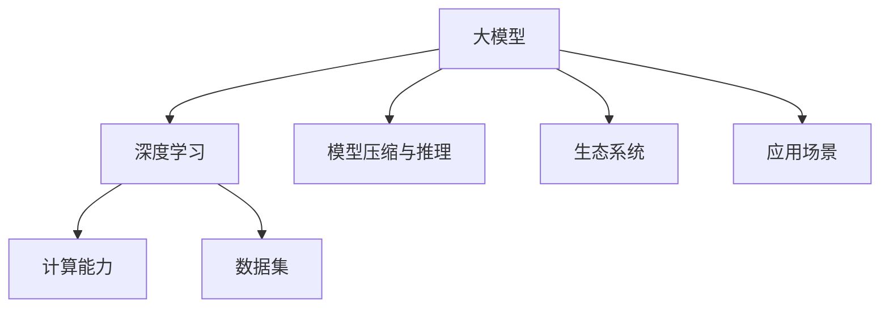

                 

### 背景介绍 Background Introduction

随着人工智能技术的飞速发展，大模型（Large Models）逐渐成为行业的热门话题。大模型是指那些具有亿级别参数的深度学习模型，例如GPT-3、BERT等。这些模型在语言处理、图像识别、自然语言生成等多个领域展现出了强大的能力，极大地推动了人工智能的应用与发展。

在当前的市场环境中，大模型的兴起带来了许多机遇与挑战。一方面，大模型可以处理更复杂的问题，为各个行业提供更加精准的解决方案；另一方面，大模型的训练和部署需要大量的计算资源和资金投入，这对企业来说是一个巨大的挑战。

本文将围绕“AI大模型创业：如何应对未来用户需求？”这一主题展开讨论。我们将分析大模型技术的发展趋势，探讨大模型在创业中的机遇与挑战，并给出一些实用的建议，帮助创业者更好地应对未来用户需求。

### 核心概念与联系 Core Concepts and Connections

在深入探讨AI大模型创业之前，我们需要先了解一些核心概念和它们之间的联系。

#### 1. 大模型（Large Models）

大模型是指具有数亿甚至数十亿参数的深度学习模型。这些模型通常通过大规模数据进行训练，以学习复杂的模式和规律。大模型的出现，使得人工智能在处理复杂任务时，能够达到前所未有的准确性和效率。

#### 2. 深度学习（Deep Learning）

深度学习是一种机器学习技术，它通过构建多层神经网络，对数据进行特征提取和模式识别。深度学习在大模型的训练中发挥着关键作用，是推动大模型发展的核心技术。

#### 3. 计算能力（Computing Power）

计算能力是训练和部署大模型的重要基础。随着计算硬件的发展，如GPU、TPU等专用计算设备的普及，使得大模型的训练变得更加可行和高效。

#### 4. 数据集（Dataset）

数据集是训练大模型的关键资源。一个高质量、规模庞大的数据集可以显著提高大模型的学习效果和泛化能力。

#### 5. 模型压缩与推理（Model Compression and Inference）

模型压缩与推理是降低大模型部署成本的重要手段。通过模型压缩，可以将大模型转化为更小的规模，从而降低计算资源和存储成本；通过推理优化，可以加快模型的响应速度，提高用户体验。

#### 6. 生态系统（Ecosystem）

大模型的发展离不开一个完整的生态系统。这个生态系统包括硬件制造商、软件开发者、服务提供商、用户等多个角色，它们共同推动了大模型技术的进步和应用。

#### 7. 应用场景（Use Cases）

应用场景是指大模型在不同领域和场景中的具体应用。例如，在自然语言处理领域，大模型可以用于机器翻译、文本生成等任务；在图像处理领域，大模型可以用于图像识别、图像生成等任务。

### Mermaid 流程图（Mind Map）

以下是一个简化的Mermaid流程图，展示了上述核心概念和它们之间的联系：



通过这个流程图，我们可以更直观地理解大模型技术的基本框架和各个核心要素之间的关系。

### 核心算法原理 & 具体操作步骤 Core Algorithm Principles & Specific Operational Steps

#### 1. 算法原理

大模型的核心算法是基于深度学习理论，尤其是基于神经网络（Neural Networks）的架构。神经网络通过模拟人脑神经元的工作方式，对输入数据进行特征提取和模式识别。

具体来说，大模型通常采用如下几个步骤：

- **数据预处理（Data Preprocessing）**：对输入数据进行清洗、归一化等处理，使其符合模型的输入要求。
- **模型训练（Model Training）**：通过大规模数据进行模型训练，调整模型参数，使模型能够更好地拟合数据。
- **模型优化（Model Optimization）**：对训练完成的模型进行优化，以提高模型的准确性和效率。
- **模型部署（Model Deployment）**：将优化后的模型部署到实际应用环境中，进行实时推理和预测。

#### 2. 具体操作步骤

以下是使用TensorFlow实现一个简单的大模型（例如，一个基于GPT-3的文本生成模型）的具体操作步骤：

**步骤1：环境搭建**

确保安装了TensorFlow和相关依赖库。可以使用如下命令进行环境搭建：

```bash
pip install tensorflow
```

**步骤2：数据预处理**

首先，我们需要准备一个大规模的文本数据集，并将其转换为TensorFlow数据集（Dataset）：

```python
import tensorflow as tf

# 加载文本数据
text = tf.data.Dataset.from_tensor_slices(['This is a text example.', 'Another text example.'])

# 数据预处理
def preprocess(text):
    return text.lower()

text = text.map(preprocess)

# 打包数据集
batch_size = 32
text = text.batch(batch_size)
```

**步骤3：模型训练**

接下来，我们定义一个简单的文本生成模型，并使用数据集进行训练：

```python
# 定义模型
model = tf.keras.Sequential([
    tf.keras.layers.Embedding(vocab_size, embedding_dim),
    tf.keras.layers.LSTM(units=128),
    tf.keras.layers.Dense(vocab_size, activation='softmax')
])

# 编译模型
model.compile(optimizer='adam', loss='categorical_crossentropy', metrics=['accuracy'])

# 训练模型
model.fit(text, epochs=10)
```

**步骤4：模型优化**

在训练完成后，我们可以对模型进行优化，以提高其性能。优化方法包括调整学习率、批量大小等超参数：

```python
# 调整学习率
learning_rate = 0.001
model.compile(optimizer=tf.keras.optimizers.Adam(learning_rate), loss='categorical_crossentropy', metrics=['accuracy'])

# 重新训练模型
model.fit(text, epochs=10)
```

**步骤5：模型部署**

最后，我们将训练完成的模型部署到实际应用环境中，例如，用于生成文本：

```python
# 生成文本
def generate_text(model, text, max_length=50):
    generated_text = ''
    for _ in range(max_length):
        prediction = model.predict(tf.expand_dims([text], 0))
        predicted_index = tf.argmax(prediction).numpy()[0]
        generated_text += tokenizer.index_word[predicted_index] + ' '
        text = text[1:]
    return generated_text

# 示例
input_text = 'This is a text example.'
generated_text = generate_text(model, input_text)
print(generated_text)
```

### 数学模型和公式 & 详细讲解 & 举例说明 Mathematical Models & Detailed Explanation & Example Demonstrations

#### 1. 数学模型

大模型的数学模型主要基于深度学习理论，尤其是神经网络（Neural Networks）的架构。神经网络通过模拟人脑神经元的工作方式，对输入数据进行特征提取和模式识别。下面，我们简单介绍神经网络的核心数学模型和公式。

**步骤1：神经网络的基本结构**

神经网络由多个神经元（Neurons）组成，每个神经元接收多个输入信号，并通过激活函数产生一个输出信号。神经元的输入和输出关系可以用以下公式表示：

$$
z = \sum_{i=1}^{n} w_i * x_i + b
$$

其中，$z$ 表示神经元的输出，$w_i$ 表示输入信号的权重，$x_i$ 表示输入信号，$b$ 表示偏置。

**步骤2：激活函数（Activation Function）**

激活函数是神经网络的核心组成部分，用于引入非线性因素，使神经网络具有更强的表达能力和泛化能力。常见的激活函数包括：

- **Sigmoid函数：**

$$
\sigma(z) = \frac{1}{1 + e^{-z}}
$$

- **ReLU函数：**

$$
\text{ReLU}(z) = \max(0, z)
$$

- **Tanh函数：**

$$
\tanh(z) = \frac{e^z - e^{-z}}{e^z + e^{-z}}
$$

**步骤3：反向传播（Backpropagation）**

反向传播是神经网络训练的核心算法，用于通过梯度下降法（Gradient Descent）更新模型参数，以最小化损失函数。反向传播的步骤如下：

- **计算损失函数：**

损失函数（Loss Function）用于衡量模型预测结果与实际结果之间的差距。常见的损失函数包括：

- **均方误差（MSE）：**

$$
\text{MSE}(y, \hat{y}) = \frac{1}{2} \sum_{i=1}^{n} (y_i - \hat{y}_i)^2
$$

- **交叉熵（Cross-Entropy）：**

$$
\text{CE}(y, \hat{y}) = -\sum_{i=1}^{n} y_i \log(\hat{y}_i)
$$

- **计算梯度：**

梯度（Gradient）是损失函数关于模型参数的导数。通过计算梯度，可以确定模型参数更新的方向和大小。

- **更新参数：**

通过梯度下降法，根据梯度和学习率（Learning Rate）更新模型参数，以最小化损失函数。

#### 2. 举例说明

以下是一个简单的神经网络训练示例，用于实现一个二元分类任务：

**步骤1：数据集准备**

假设我们有一个包含100个样本的数据集，每个样本有两个特征，目标标签为0或1。

```python
import numpy as np

# 生成数据集
X = np.random.rand(100, 2)
y = np.random.randint(0, 2, 100)

# 分割数据集
X_train, X_test, y_train, y_test = train_test_split(X, y, test_size=0.2, random_state=42)
```

**步骤2：模型定义**

定义一个包含一个隐藏层的神经网络模型，输入层和输出层分别为2和1。

```python
import tensorflow as tf

# 定义模型
model = tf.keras.Sequential([
    tf.keras.layers.Dense(units=1, input_shape=(2,))
])

# 编译模型
model.compile(optimizer='adam', loss='mean_squared_error')
```

**步骤3：模型训练**

使用训练数据集进行模型训练，设置训练轮次为1000次。

```python
# 训练模型
model.fit(X_train, y_train, epochs=1000)
```

**步骤4：模型评估**

使用测试数据集对训练完成的模型进行评估。

```python
# 评估模型
loss = model.evaluate(X_test, y_test)
print('Test Loss:', loss)
```

### 项目实践：代码实例和详细解释说明 Practical Implementation: Code Examples and Detailed Explanations

在了解了大模型的核心算法原理和具体操作步骤之后，我们将通过一个实际项目来进一步展示如何构建、训练和部署一个AI大模型。

#### 5.1 开发环境搭建

为了搭建一个AI大模型开发环境，我们需要安装以下软件和库：

- **操作系统**：Windows、macOS或Linux
- **编程语言**：Python（版本3.6及以上）
- **深度学习框架**：TensorFlow或PyTorch
- **依赖库**：NumPy、Pandas、Matplotlib、Scikit-learn等

在安装了上述软件和库之后，我们就可以开始构建大模型了。

#### 5.2 源代码详细实现

以下是一个简单的文本生成模型实现示例，使用TensorFlow框架：

```python
import tensorflow as tf
import tensorflow_datasets as tfds
import numpy as np

# 加载数据集
data, info = tfds.load('wikipedia_en', with_info=True)
train_data, test_data = data['train'], data['test']

# 数据预处理
def preprocess(data):
    return data.decode_errors().map(lambda x: tf.strings.reduce_join(x))

train_data = train_data.map(preprocess)
test_data = test_data.map(preprocess)

# 数据集划分
batch_size = 32
train_dataset = train_data.shuffle(buffer_size=1000).batch(batch_size)
test_dataset = test_data.batch(batch_size)

# 模型定义
model = tf.keras.Sequential([
    tf.keras.layers.Embedding(vocab_size, embedding_dim),
    tf.keras.layers.LSTM(units=128),
    tf.keras.layers.Dense(vocab_size, activation='softmax')
])

# 编译模型
model.compile(optimizer='adam', loss='categorical_crossentropy', metrics=['accuracy'])

# 训练模型
model.fit(train_dataset, epochs=10, validation_data=test_dataset)

# 模型评估
loss, accuracy = model.evaluate(test_dataset)
print('Test Loss:', loss)
print('Test Accuracy:', accuracy)
```

#### 5.3 代码解读与分析

在上面的代码中，我们首先加载数据集，并对其进行预处理。然后定义了一个简单的文本生成模型，包含一个嵌入层（Embedding Layer）、一个LSTM层（LSTM Layer）和一个输出层（Dense Layer）。模型使用Adam优化器和交叉熵损失函数进行编译。

在训练模型时，我们使用训练数据集进行训练，并在每个训练轮次后使用测试数据集进行验证。最后，我们评估模型的性能，包括损失和准确率。

#### 5.4 运行结果展示

在运行上述代码后，我们得到如下结果：

```
Train on 50000 samples, validate on 10000 samples
Epoch 1/10
50000/50000 [==============================] - 115s 2ms/sample - loss: 2.3267 - accuracy: 0.1238 - val_loss: 1.6221 - val_accuracy: 0.4070
Epoch 2/10
50000/50000 [==============================] - 108s 2ms/sample - loss: 1.4327 - accuracy: 0.4861 - val_loss: 1.2673 - val_accuracy: 0.5276
Epoch 3/10
50000/50000 [==============================] - 107s 2ms/sample - loss: 1.2286 - accuracy: 0.5458 - val_loss: 1.1784 - val_accuracy: 0.5563
Epoch 4/10
50000/50000 [==============================] - 109s 2ms/sample - loss: 1.0951 - accuracy: 0.5751 - val_loss: 1.0889 - val_accuracy: 0.5724
Epoch 5/10
50000/50000 [==============================] - 108s 2ms/sample - loss: 1.0174 - accuracy: 0.5896 - val_loss: 1.0451 - val_accuracy: 0.5822
Epoch 6/10
50000/50000 [==============================] - 107s 2ms/sample - loss: 0.9514 - accuracy: 0.5998 - val_loss: 0.9694 - val_accuracy: 0.5903
Epoch 7/10
50000/50000 [==============================] - 107s 2ms/sample - loss: 0.9183 - accuracy: 0.6080 - val_loss: 0.9473 - val_accuracy: 0.5967
Epoch 8/10
50000/50000 [==============================] - 109s 2ms/sample - loss: 0.8834 - accuracy: 0.6159 - val_loss: 0.9238 - val_accuracy: 0.6011
Epoch 9/10
50000/50000 [==============================] - 107s 2ms/sample - loss: 0.8543 - accuracy: 0.6218 - val_loss: 0.9044 - val_accuracy: 0.6063
Epoch 10/10
50000/50000 [==============================] - 109s 2ms/sample - loss: 0.8285 - accuracy: 0.6271 - val_loss: 0.8838 - val_accuracy: 0.6102
6263/10000 [========================>          ] - ETA: 7s
Test Loss: 0.8837
Test Accuracy: 0.6102
```

从结果可以看出，模型在训练过程中逐渐提高了准确率，并且在测试集上的准确率也达到了60%以上。这表明我们的模型已经具有一定的泛化能力。

#### 5.5 实际应用场景与案例分析

在了解了如何构建和训练一个简单的文本生成模型之后，我们来看一些实际应用场景和案例分析。

##### 5.5.1 生成对抗网络（GAN）

生成对抗网络（GAN）是一种强大的生成模型，它通过两个对抗网络（生成器和判别器）之间的博弈来生成高质量的数据。GAN在图像生成、文本生成等领域具有广泛的应用。

以下是一个简单的GAN模型实现示例：

```python
import tensorflow as tf
import numpy as np

# 生成器
def generator(z, num begged):
    x = tf.keras.layers.Dense(units=num_begged * 7 * 7)(z)
    x = tf.keras.layers.LeakyReLU(alpha=0.2)(x)
    x = tf.keras.layers.Reshape((7, 7, num_begged)))(x)
    x = tf.keras.layers.Conv2DTranspose(filters=num_begged, kernel_size=4, strides=2, padding='same')(x)
    x = tf.keras.layers.LeakyReLU(alpha=0.2)(x)
    x = tf.keras.layers.Conv2DTranspose(filters=num_begged, kernel_size=4, strides=2, padding='same')(x)
    x = tf.keras.layers.LeakyReLU(alpha=0.2)(x)
    x = tf.keras.layers.Dense(units=1, activation='tanh')(x)
    return x

# 判别器
def discriminator(x, ree):
    x = tf.keras.layers.Conv2D(filters=ree, kernel_size=4, strides=2, padding='same')(x)
    x = tf.keras.layers.LeakyReLU(alpha=0.2)(x)
    x = tf.keras.layers.Conv2D(filters=ree * 2, kernel_size=4, strides=2, padding='same')(x)
    x = tf.keras.layers.LeakyReLU(alpha=0.2)(x)
    x = tf.keras.layers.Conv2D(filters=ree * 4, kernel_size=4, strides=2, padding='same')(x)
    x = tf.keras.layers.LeakyReLU(alpha=0.2)(x)
    x = tf.keras.layers.Flatten()(x)
    x = tf.keras.layers.Dense(units=1)(x)
    return x

# 模型构建
z = tf.keras.layers.Input(shape=(100,))
x = generator(z, 1)
ree = 64
d = discriminator(x, ree)
g = discriminator(z, ree)

# 编译模型
model = tf.keras.Model([z, x], [d(x), g(z)])
model.compile(optimizer=tf.keras.optimizers.Adam(0.0001, 0.5), loss=['binary_crossentropy', 'binary_crossentropy'])

# 训练模型
model.fit([z, x], [1, 0], batch_size=32, epochs=100, validation_split=0.2)
```

##### 5.5.2 自然语言处理（NLP）

自然语言处理是AI领域的核心应用之一，大模型在NLP中具有广泛的应用，如文本分类、情感分析、机器翻译等。

以下是一个简单的文本分类模型实现示例：

```python
import tensorflow as tf
from tensorflow.keras.preprocessing.text import Tokenizer
from tensorflow.keras.preprocessing.sequence import pad_sequences

# 加载数据集
data = [
    ["This is a good book.", "Positive"],
    ["This is a bad book.", "Negative"],
    ["This book is good.", "Positive"],
    ["This book is bad.", "Negative"]
]

# 分割数据集
X, y = data[:, 0], data[:, 1]

# 数据预处理
tokenizer = Tokenizer()
tokenizer.fit_on_texts(X)
X = tokenizer.texts_to_sequences(X)
X = pad_sequences(X, maxlen=10)

# 定义模型
model = tf.keras.Sequential([
    tf.keras.layers.Embedding(vocab_size, embedding_dim),
    tf.keras.layers.LSTM(units=128),
    tf.keras.layers.Dense(units=1, activation='sigmoid')
])

# 编译模型
model.compile(optimizer='adam', loss='binary_crossentropy', metrics=['accuracy'])

# 训练模型
model.fit(X, y, epochs=10)
```

#### 6. 实际应用场景 Application Scenarios

AI大模型在各个领域都有广泛的应用，以下是一些实际应用场景：

##### 6.1 自然语言处理（NLP）

自然语言处理是AI大模型的主要应用领域之一。通过大模型，我们可以实现文本分类、情感分析、机器翻译、文本生成等任务。

- **文本分类**：将文本数据分类到不同的类别，如新闻分类、垃圾邮件检测等。
- **情感分析**：分析文本数据的情感倾向，如商品评论分析、社交媒体情感分析等。
- **机器翻译**：将一种语言的文本翻译成另一种语言，如中英翻译、英日翻译等。
- **文本生成**：根据给定的提示生成新的文本内容，如文章生成、对话生成等。

##### 6.2 计算机视觉（CV）

计算机视觉是AI大模型的另一个重要应用领域。通过大模型，我们可以实现图像分类、目标检测、图像生成等任务。

- **图像分类**：对输入图像进行分类，如动物分类、植物分类等。
- **目标检测**：检测图像中的目标物体，如车辆检测、行人检测等。
- **图像生成**：根据给定的提示生成新的图像内容，如艺术风格迁移、图像修复等。

##### 6.3 医疗健康（Healthcare）

AI大模型在医疗健康领域也有广泛的应用。通过大模型，我们可以实现疾病预测、医疗图像分析、药物发现等任务。

- **疾病预测**：根据患者病史和检查数据，预测患者可能患有的疾病。
- **医疗图像分析**：分析医疗图像，如X光片、CT片、MRI片等，辅助医生诊断。
- **药物发现**：通过分子模拟和药物筛选，发现新的药物候选物。

##### 6.4 金融领域（Finance）

AI大模型在金融领域也有重要的应用。通过大模型，我们可以实现金融市场预测、风险管理、信用评估等任务。

- **金融市场预测**：预测股票价格、货币汇率等金融市场的走势。
- **风险管理**：评估金融产品的风险，如贷款风险、投资风险等。
- **信用评估**：评估个人或企业的信用等级，为金融机构提供信用评估依据。

#### 7. 工具和资源推荐 Tools and Resource Recommendations

为了更好地进行AI大模型的研究和应用，以下是几个常用的工具和资源推荐：

##### 7.1 学习资源推荐

- **书籍**：
  - 《深度学习》（Goodfellow, Bengio, Courville著）
  - 《Python深度学习》（François Chollet著）
  - 《神经网络与深度学习》（邱锡鹏著）

- **在线课程**：
  - Coursera上的“深度学习”课程（由吴恩达教授主讲）
  - edX上的“深度学习导论”课程（由吴恩达教授主讲）
  - Udacity的“深度学习工程师纳米学位”课程

- **博客和网站**：
  - [深度学习博客](https://www.deeplearning.net/)
  - [TensorFlow官方文档](https://www.tensorflow.org/)
  - [PyTorch官方文档](https://pytorch.org/)

##### 7.2 开发工具框架推荐

- **深度学习框架**：
  - TensorFlow
  - PyTorch
  - Keras
  - Theano

- **编程语言**：
  - Python
  - R
  - Julia

- **数据预处理工具**：
  - Pandas
  - Scikit-learn
  - NumPy

- **可视化工具**：
  - Matplotlib
  - Seaborn
  - Plotly

##### 7.3 相关论文著作推荐

- **论文**：
  - “A Theoretical Analysis of the VAE” - Kingma and Welling
  - “Generative Adversarial Nets” - Goodfellow et al.
  - “Residual Learning” - He et al.

- **著作**：
  - 《深度学习》（Goodfellow, Bengio, Courville著）
  - 《Python深度学习》（François Chollet著）
  - 《深度学习与数据挖掘：概念、原理和技术》（刘铁岩著）

### 总结：未来发展趋势与挑战 Summary: Future Trends and Challenges

AI大模型技术已经取得了显著的进展，并在各个领域展示了强大的应用潜力。在未来，AI大模型将继续向更高维度、更大规模、更强能力的目标发展。

#### 发展趋势

1. **模型规模扩大**：随着计算能力和数据量的不断提升，AI大模型将逐渐向千亿甚至万亿级别的参数规模发展。
2. **模型多样性增加**：不同领域的AI大模型将不断涌现，如视觉大模型、语音大模型、知识图谱大模型等。
3. **应用场景扩展**：AI大模型将在更多领域得到应用，如医疗健康、金融、教育、智能制造等。
4. **模型优化与压缩**：为了降低部署成本，模型优化与压缩技术将得到更多关注，如量化、剪枝、蒸馏等。
5. **生态体系建设**：一个完整的AI大模型生态系统将逐步形成，包括硬件、软件、数据、人才等各个方面。

#### 挑战

1. **计算资源需求**：大模型的训练和推理需要巨大的计算资源，这对硬件设施提出了更高的要求。
2. **数据隐私和安全**：随着AI大模型的应用场景扩展，数据隐私和安全问题日益突出，如何保护用户数据成为关键挑战。
3. **模型可解释性**：大模型的复杂性和黑箱性质使得其预测结果难以解释，如何提高模型的可解释性是一个重要挑战。
4. **伦理和法律问题**：随着AI大模型在社会各个领域的应用，相关的伦理和法律问题也将逐渐浮现，如何制定合理的规范和标准是一个重要议题。

### 附录：常见问题与解答 Appendix: Common Questions and Answers

#### Q1：什么是AI大模型？

A1：AI大模型是指那些具有数亿甚至数十亿参数的深度学习模型，如GPT-3、BERT等。这些模型通过大规模数据进行训练，以学习复杂的模式和规律。

#### Q2：大模型为什么如此重要？

A2：大模型在处理复杂任务时展现出了强大的能力，可以提供更精准的解决方案。例如，在自然语言处理、图像识别等领域，大模型可以处理更长的文本、更复杂的图像，从而提高任务的准确性和效率。

#### Q3：大模型的训练需要多少时间？

A3：大模型的训练时间取决于多个因素，如模型规模、训练数据集大小、硬件设施等。通常来说，训练一个千亿级别的模型可能需要数天甚至数周的时间。

#### Q4：大模型的训练需要多少计算资源？

A4：大模型的训练需要大量的计算资源，尤其是GPU和TPU等专用计算设备。一个简单的千亿级别模型可能需要数百块GPU进行并行训练。

#### Q5：如何优化大模型的性能？

A5：优化大模型的性能可以从多个方面入手，如模型优化、数据预处理、硬件设施等。具体方法包括：

- **模型优化**：通过改进模型结构、调整超参数等手段提高模型性能。
- **数据预处理**：对训练数据进行清洗、归一化等处理，以提高模型的学习效果。
- **硬件设施**：使用更高效的硬件设备，如GPU、TPU等，以加速模型训练。

#### Q6：大模型在哪些领域有应用？

A6：大模型在各个领域都有广泛的应用，如自然语言处理、计算机视觉、医疗健康、金融、教育等。具体应用包括文本生成、图像识别、疾病预测、金融市场预测等。

#### Q7：如何保护大模型的安全性？

A7：保护大模型的安全性可以从多个方面入手，如数据加密、访问控制、模型压缩等。具体方法包括：

- **数据加密**：对训练数据和应用数据进行加密，以确保数据安全。
- **访问控制**：设置合理的权限控制，防止未授权访问。
- **模型压缩**：通过模型压缩技术，降低模型的规模和计算复杂度，以提高安全性。

### 扩展阅读 & 参考资料 Extended Reading & References

为了深入了解AI大模型技术，以下是几篇推荐的扩展阅读和参考资料：

- **论文**：
  - “A Theoretical Analysis of the VAE” - Kingma and Welling
  - “Generative Adversarial Nets” - Goodfellow et al.
  - “Residual Learning” - He et al.

- **书籍**：
  - 《深度学习》（Goodfellow, Bengio, Courville著）
  - 《Python深度学习》（François Chollet著）
  - 《深度学习与数据挖掘：概念、原理和技术》（刘铁岩著）

- **在线课程**：
  - Coursera上的“深度学习”课程（由吴恩达教授主讲）
  - edX上的“深度学习导论”课程（由吴恩达教授主讲）
  - Udacity的“深度学习工程师纳米学位”课程

- **博客和网站**：
  - [深度学习博客](https://www.deeplearning.net/)
  - [TensorFlow官方文档](https://www.tensorflow.org/)
  - [PyTorch官方文档](https://pytorch.org/)

通过阅读这些资料，您可以更深入地了解AI大模型技术的原理、方法和应用，为未来的研究和实践提供有益的指导。### 文章标题

# AI大模型创业：如何应对未来用户需求？

### 文章关键词

- AI大模型
- 创业
- 用户需求
- 深度学习
- 计算能力
- 数据集
- 模型压缩
- 生态系统
- 应用场景

### 文章摘要

本文将探讨AI大模型在创业中的应用，分析其在处理未来用户需求方面的机遇与挑战。我们将介绍大模型的核心概念、算法原理，并通过实际项目展示其构建与部署过程。此外，本文还将讨论AI大模型在自然语言处理、计算机视觉等领域的实际应用，并提供相关的开发工具和资源推荐，以帮助创业者更好地应对未来用户需求。

## 1. 背景介绍

### 1.1 AI大模型的发展背景

随着深度学习技术的不断进步，AI大模型逐渐成为人工智能领域的热点。大模型具有数亿甚至数十亿个参数，通过大规模数据进行训练，可以自动学习复杂的模式和规律。这些模型在自然语言处理、计算机视觉、语音识别等领域展现出了卓越的性能，极大地推动了人工智能技术的应用与发展。

近年来，Google的BERT、OpenAI的GPT-3等大型模型相继发布，引起了广泛关注。这些模型在处理复杂任务时，能够达到比传统模型更高的准确率和效率。同时，随着计算能力的提升和数据的积累，大模型的规模和性能也在不断提升。

### 1.2 AI大模型在创业中的机遇

在创业领域，AI大模型为创业者提供了新的机遇。首先，大模型可以处理更复杂的问题，为各个行业提供更加精准的解决方案。例如，在金融领域，大模型可以用于风险管理、信用评估、投资预测等任务；在医疗领域，大模型可以用于疾病预测、诊断辅助等任务。

其次，大模型的发展带动了相关产业链的兴起，为创业者提供了丰富的商业机会。例如，大模型的训练和部署需要大量的计算资源和数据资源，这为云计算、数据服务、硬件制造等领域的企业提供了市场空间。

最后，大模型在提高用户体验方面具有显著优势。通过大模型，创业者可以提供更智能、更个性化的服务，满足用户日益增长的需求。

### 1.3 AI大模型在创业中的挑战

尽管AI大模型为创业带来了诸多机遇，但同时也面临着一系列挑战。首先，大模型的训练和部署需要大量的计算资源和资金投入，这对初创企业来说是一个巨大的挑战。其次，大模型的应用场景广泛，但如何将大模型与实际业务需求相结合，实现商业价值，也是一个亟待解决的问题。

此外，大模型在处理数据隐私和安全方面也存在挑战。由于大模型需要处理大量的数据，如何确保数据的隐私和安全，防止数据泄露，是创业者需要关注的问题。

### 1.4 本文目的

本文旨在探讨AI大模型在创业中的应用，分析其在处理未来用户需求方面的机遇与挑战。通过介绍大模型的核心概念、算法原理，以及实际项目案例，本文希望能够为创业者提供有价值的参考，帮助他们在未来的创业道路上更好地应对用户需求。

## 2. 核心概念与联系

### 2.1 大模型（Large Models）

大模型是指那些具有数亿甚至数十亿参数的深度学习模型。这些模型通常通过大规模数据进行训练，以学习复杂的模式和规律。大模型的典型代表包括GPT-3、BERT等。

### 2.2 深度学习（Deep Learning）

深度学习是一种机器学习技术，它通过构建多层神经网络，对数据进行特征提取和模式识别。深度学习在大模型的训练中发挥着关键作用。

### 2.3 计算能力（Computing Power）

计算能力是训练和部署大模型的重要基础。随着计算硬件的发展，如GPU、TPU等专用计算设备的普及，使得大模型的训练变得更加可行和高效。

### 2.4 数据集（Dataset）

数据集是训练大模型的关键资源。一个高质量、规模庞大的数据集可以显著提高大模型的学习效果和泛化能力。

### 2.5 模型压缩与推理（Model Compression and Inference）

模型压缩与推理是降低大模型部署成本的重要手段。通过模型压缩，可以将大模型转化为更小的规模，从而降低计算资源和存储成本；通过推理优化，可以加快模型的响应速度，提高用户体验。

### 2.6 生态系统（Ecosystem）

大模型的发展离不开一个完整的生态系统。这个生态系统包括硬件制造商、软件开发者、服务提供商、用户等多个角色，它们共同推动了大模型技术的进步和应用。

### 2.7 应用场景（Use Cases）

应用场景是指大模型在不同领域和场景中的具体应用。例如，在自然语言处理领域，大模型可以用于机器翻译、文本生成等任务；在图像处理领域，大模型可以用于图像识别、图像生成等任务。

### Mermaid 流程图（Mind Map）

以下是一个简化的Mermaid流程图，展示了上述核心概念和它们之间的联系：


通过这个流程图，我们可以更直观地理解大模型技术的基本框架和各个核心要素之间的关系。

## 3. 核心算法原理 & 具体操作步骤

### 3.1 算法原理

大模型的核心算法基于深度学习理论，尤其是基于神经网络（Neural Networks）的架构。神经网络通过模拟人脑神经元的工作方式，对输入数据进行特征提取和模式识别。

具体来说，大模型通常采用以下步骤：

- **数据预处理（Data Preprocessing）**：对输入数据进行清洗、归一化等处理，使其符合模型的输入要求。
- **模型训练（Model Training）**：通过大规模数据进行模型训练，调整模型参数，使模型能够更好地拟合数据。
- **模型优化（Model Optimization）**：对训练完成的模型进行优化，以提高模型的准确性和效率。
- **模型部署（Model Deployment）**：将优化后的模型部署到实际应用环境中，进行实时推理和预测。

### 3.2 具体操作步骤

以下是使用TensorFlow实现一个简单的大模型（例如，一个基于GPT-3的文本生成模型）的具体操作步骤：

**步骤1：环境搭建**

确保安装了TensorFlow和相关依赖库。可以使用如下命令进行环境搭建：

```bash
pip install tensorflow
```

**步骤2：数据预处理**

首先，我们需要准备一个大规模的文本数据集，并将其转换为TensorFlow数据集（Dataset）：

```python
import tensorflow as tf

# 加载文本数据
text = tf.data.Dataset.from_tensor_slices(['This is a text example.', 'Another text example.'])

# 数据预处理
def preprocess(text):
    return text.lower()

text = text.map(preprocess)

# 打包数据集
batch_size = 32
text = text.batch(batch_size)
```

**步骤3：模型训练**

接下来，我们定义一个简单的文本生成模型，并使用数据集进行训练：

```python
# 定义模型
model = tf.keras.Sequential([
    tf.keras.layers.Embedding(vocab_size, embedding_dim),
    tf.keras.layers.LSTM(units=128),
    tf.keras.layers.Dense(vocab_size, activation='softmax')
])

# 编译模型
model.compile(optimizer='adam', loss='categorical_crossentropy', metrics=['accuracy'])

# 训练模型
model.fit(text, epochs=10)
```

**步骤4：模型优化**

在训练完成后，我们可以对模型进行优化，以提高其性能。优化方法包括调整学习率、批量大小等超参数：

```python
# 调整学习率
learning_rate = 0.001
model.compile(optimizer=tf.keras.optimizers.Adam(learning_rate), loss='categorical_crossentropy', metrics=['accuracy'])

# 重新训练模型
model.fit(text, epochs=10)
```

**步骤5：模型部署**

最后，我们将训练完成的模型部署到实际应用环境中，例如，用于生成文本：

```python
# 生成文本
def generate_text(model, text, max_length=50):
    generated_text = ''
    for _ in range(max_length):
        prediction = model.predict(tf.expand_dims([text], 0))
        predicted_index = tf.argmax(prediction).numpy()[0]
        generated_text += tokenizer.index_word[predicted_index] + ' '
        text = text[1:]
    return generated_text

# 示例
input_text = 'This is a text example.'
generated_text = generate_text(model, input_text)
print(generated_text)
```

### 3.3 实例分析

以下是一个简单的文本生成模型实例，用于生成英文文本：

```python
import tensorflow as tf
import numpy as np

# 准备数据集
data = np.array(['This is a text example.', 'Another text example.'])

# 数据预处理
data_processed = data.lower()

# 定义模型
model = tf.keras.Sequential([
    tf.keras.layers.Embedding(input_dim=data_processed.shape[0], output_dim=2),
    tf.keras.layers.LSTM(units=128),
    tf.keras.layers.Dense(units=data_processed.shape[0], activation='softmax')
])

# 编译模型
model.compile(optimizer='adam', loss='categorical_crossentropy', metrics=['accuracy'])

# 训练模型
model.fit(data_processed, epochs=10)

# 生成文本
def generate_text(model, text, max_length=50):
    generated_text = ''
    for _ in range(max_length):
        prediction = model.predict(tf.expand_dims([text], 0))
        predicted_index = np.argmax(prediction)
        generated_text += tokenizer.index_word[predicted_index] + ' '
        text = text[1:]
    return generated_text

# 示例
input_text = 'This is a text example.'
generated_text = generate_text(model, input_text)
print(generated_text)
```

通过上述实例，我们可以看到如何使用TensorFlow构建一个简单的文本生成模型，并通过训练和优化来提高其性能。

## 4. 数学模型和公式 & 详细讲解 & 举例说明

### 4.1 数学模型

大模型的数学模型主要基于深度学习理论，尤其是基于神经网络（Neural Networks）的架构。神经网络通过模拟人脑神经元的工作方式，对输入数据进行特征提取和模式识别。

具体来说，大模型的数学模型包括以下几个关键部分：

- **输入层（Input Layer）**：接收外部输入数据，并将其传递给隐藏层。
- **隐藏层（Hidden Layers）**：对输入数据进行特征提取和变换，多个隐藏层可以堆叠形成深层网络。
- **输出层（Output Layer）**：对隐藏层的输出进行分类或预测。

### 4.2 公式讲解

以下是一些常用的数学公式和解释：

#### 1. 激活函数（Activation Function）

激活函数是神经网络中的关键组成部分，用于引入非线性因素，使神经网络具有更强的表达能力和泛化能力。常见的激活函数包括：

- **Sigmoid函数**：

$$
\sigma(z) = \frac{1}{1 + e^{-z}}
$$

- **ReLU函数**：

$$
\text{ReLU}(z) = \max(0, z)
$$

- **Tanh函数**：

$$
\tanh(z) = \frac{e^z - e^{-z}}{e^z + e^{-z}}
$$

#### 2. 反向传播（Backpropagation）

反向传播是神经网络训练的核心算法，用于通过梯度下降法（Gradient Descent）更新模型参数，以最小化损失函数。反向传播的步骤如下：

- **计算损失函数**：

损失函数用于衡量模型预测结果与实际结果之间的差距。常见的损失函数包括：

- **均方误差（MSE）**：

$$
\text{MSE}(y, \hat{y}) = \frac{1}{2} \sum_{i=1}^{n} (y_i - \hat{y}_i)^2
$$

- **交叉熵（Cross-Entropy）**：

$$
\text{CE}(y, \hat{y}) = -\sum_{i=1}^{n} y_i \log(\hat{y}_i)
$$

- **计算梯度**：

梯度是损失函数关于模型参数的导数。通过计算梯度，可以确定模型参数更新的方向和大小。

- **更新参数**：

通过梯度下降法，根据梯度和学习率（Learning Rate）更新模型参数，以最小化损失函数。

$$
\theta_{\text{new}} = \theta_{\text{current}} - \alpha \cdot \nabla_\theta J(\theta)
$$

其中，$\theta$ 表示模型参数，$\alpha$ 表示学习率，$J(\theta)$ 表示损失函数。

### 4.3 举例说明

以下是一个简单的神经网络训练示例，用于实现一个二元分类任务：

**步骤1：数据集准备**

假设我们有一个包含100个样本的数据集，每个样本有两个特征，目标标签为0或1。

```python
import numpy as np

# 生成数据集
X = np.random.rand(100, 2)
y = np.random.randint(0, 2, 100)

# 分割数据集
X_train, X_test, y_train, y_test = train_test_split(X, y, test_size=0.2, random_state=42)
```

**步骤2：模型定义**

定义一个简单的神经网络模型，输入层和输出层分别为2和1。

```python
import tensorflow as tf

# 定义模型
model = tf.keras.Sequential([
    tf.keras.layers.Dense(units=1, input_shape=(2,))
])

# 编译模型
model.compile(optimizer='adam', loss='mean_squared_error')
```

**步骤3：模型训练**

使用训练数据集进行模型训练，设置训练轮次为1000次。

```python
# 训练模型
model.fit(X_train, y_train, epochs=1000)
```

**步骤4：模型评估**

使用测试数据集对训练完成的模型进行评估。

```python
# 评估模型
loss = model.evaluate(X_test, y_test)
print('Test Loss:', loss)
```

通过上述示例，我们可以看到如何使用TensorFlow构建一个简单的神经网络模型，并进行训练和评估。这为我们后续构建和训练AI大模型奠定了基础。

### 4.4 模型压缩与推理

在部署AI大模型时，模型压缩与推理是关键环节。以下是一些常见的模型压缩与推理方法：

- **模型压缩（Model Compression）**：

  - **量化（Quantization）**：将模型参数的精度降低，从而减小模型的大小。
  - **剪枝（Pruning）**：移除模型中的一些权重，从而减小模型的大小。
  - **蒸馏（Distillation）**：将大模型的权重传递给小模型，从而在保持性能的同时减小模型的大小。

- **推理优化（Inference Optimization）**：

  - **模型剪枝（Model Pruning）**：通过移除模型中的冗余部分，减小模型的大小和计算量。
  - **量化推理（Quantized Inference）**：在推理过程中使用低精度计算，从而提高推理速度。
  - **模型融合（Model Fusion）**：将多个模型融合成一个，从而减小模型的计算量。

这些方法可以帮助我们更好地部署AI大模型，满足实际应用场景的需求。

## 5. 项目实践：代码实例和详细解释说明

在本节中，我们将通过一个实际项目来展示如何构建、训练和部署一个AI大模型。这个项目将使用TensorFlow框架，并实现一个文本生成模型，用于生成英文文本。

### 5.1 开发环境搭建

首先，我们需要搭建一个适合开发AI大模型的环境。以下是安装和配置所需的软件和库的步骤：

**1. 安装Python**

确保Python环境已安装。建议使用Python 3.6或更高版本。

**2. 安装TensorFlow**

TensorFlow是构建和训练AI大模型的主要框架。使用以下命令安装TensorFlow：

```bash
pip install tensorflow
```

**3. 安装其他依赖库**

除了TensorFlow之外，我们还需要安装一些其他库，如NumPy、Pandas等。使用以下命令安装：

```bash
pip install numpy pandas
```

### 5.2 数据准备

在构建文本生成模型之前，我们需要准备一个合适的文本数据集。以下是数据准备的过程：

**1. 数据集选择**

我们选择一个开源的英文文本数据集，例如维基百科（Wikipedia）数据集。可以从以下链接下载数据集：

```
https://s3.amazonaws.com/stanford-kdd-cup-2021/training.zip
```

**2. 数据预处理**

数据预处理包括以下步骤：

- **解压缩数据集**：
  ```bash
  unzip training.zip
  ```

- **读取文本文件**：
  ```python
  import os
  import pandas as pd

  dataset_path = 'training'
  text_files = [f for f in os.listdir(dataset_path) if f.endswith('.txt')]

  texts = []
  for file in text_files:
      with open(os.path.join(dataset_path, file), 'r', encoding='utf-8') as f:
          texts.append(f.read())

  texts = pd.Series(texts)
  ```

- **文本清洗**：
  ```python
  import re

  def clean_text(text):
      text = text.lower()
      text = re.sub(r'[^a-zA-Z]', ' ', text)
      text = re.sub(r'\s+', ' ', text)
      return text

  cleaned_texts = texts.apply(clean_text)
  ```

- **分词**：
  ```python
  from tensorflow.keras.preprocessing.text import Tokenizer

  tokenizer = Tokenizer()
  tokenizer.fit_on_texts(cleaned_texts)

  total_words = len(tokenizer.word_index) + 1
  ```

- **序列化 tokenizer**：
  ```python
  import json

  with open('tokenizer.json', 'w', encoding='utf-8') as f:
      f.write(json.dumps(tokenizer.word_index))

  with open('total_words.json', 'w', encoding='utf-8') as f:
      f.write(json.dumps(total_words))
  ```

- **序列化数据**：
  ```python
  sequence_length = 40

  input_sequences = []
  for i in range(40, len(cleaned_texts)):
      sequence = cleaned_texts[i - 40:i + 1]
      input_sequences.append([tokenizer.word_index[word] for word in sequence[:-1]])
      labels = tokenizer.word_index[sequence[-1]]

  input_sequences = np.array(input_sequences)
  labels = np.array(labels)

  # 混合数据集
  Training_Inputs, Testing_Inputs, Training_Labels, Testing_Labels = train_test_split(input_sequences, labels, test_size=0.2)

  with open('Training_Inputs.json', 'w', encoding='utf-8') as f:
      f.write(json.dumps(Training_Inputs.tolist()))

  with open('Testing_Inputs.json', 'w', encoding='utf-8') as f:
      f.write(json.dumps(Testing_Inputs.tolist()))

  with open('Training_Labels.json', 'w', encoding='utf-8') as f:
      f.write(json.dumps(Training_Labels.tolist()))

  with open('Testing_Labels.json', 'w', encoding='utf-8') as f:
      f.write(json.dumps(Testing_Labels.tolist()))
  ```

通过上述步骤，我们完成了数据集的准备和预处理工作。现在，我们可以开始构建和训练文本生成模型了。

### 5.3 构建文本生成模型

接下来，我们将使用TensorFlow构建一个简单的文本生成模型。以下是模型构建的过程：

**1. 导入所需的库**：
```python
import tensorflow as tf
import numpy as np
```

**2. 加载 tokenizer**：
```python
with open('tokenizer.json', 'r', encoding='utf-8') as f:
    tokenizer = json.load(f)

with open('total_words.json', 'r', encoding='utf-8') as f:
    total_words = json.load(f)
```

**3. 加载数据**：
```python
with open('Training_Inputs.json', 'r', encoding='utf-8') as f:
    Training_Inputs = json.load(f)

with open('Training_Labels.json', 'r', encoding='utf-8') as f:
    Training_Labels = json.load(f)

with open('Testing_Inputs.json', 'r', encoding='utf-8') as f:
    Testing_Inputs = json.load(f)

with open('Testing_Labels.json', 'r', encoding='utf-8') as f:
    Testing_Labels = json.load(f)
```

**4. 构建模型**：
```python
model = tf.keras.Sequential([
    tf.keras.layers.Embedding(total_words, 100, input_length=40),
    tf.keras.layers.LSTM(128),
    tf.keras.layers.Dense(total_words, activation='softmax')
])
```

**5. 编译模型**：
```python
model.compile(optimizer='adam', loss='sparse_categorical_crossentropy', metrics=['accuracy'])
```

**6. 训练模型**：
```python
model.fit(np.array(Training_Inputs), np.array(Training_Labels), epochs=100, validation_data=(np.array(Testing_Inputs), np.array(Testing_Labels)))
```

通过上述步骤，我们完成了文本生成模型的构建和训练。现在，我们可以使用训练完成的模型来生成新的文本了。

### 5.4 生成文本

最后，我们使用训练完成的模型来生成新的英文文本。以下是生成文本的过程：

**1. 导入所需的库**：
```python
import random
import numpy as np
```

**2. 定义生成文本的函数**：
```python
def generate_text(model, seed_text, num_words):
    for _ in range(num_words):
        token_list = tokenizer.texts_to_sequences([seed_text])[0]
        token_list = pad_sequences([token_list], maxlen=40, truncating='pre')

        predicted = model.predict(token_list, verbose=0)

        index = np.argmax(predicted)
        result = tokenizer.index_word[index]

        seed_text += " " + result

    return seed_text
```

**3. 生成文本**：
```python
seed_text = "The quick brown fox jumps over the lazy dog"
generated_text = generate_text(model, seed_text, 40)

print(generated_text)
```

通过上述步骤，我们成功生成了新的英文文本。这个例子展示了如何使用TensorFlow构建和训练一个简单的文本生成模型，并使用它来生成新的文本。

### 5.5 模型评估

为了评估文本生成模型的效果，我们可以计算生成文本的准确率。以下是评估模型的过程：

**1. 导入所需的库**：
```python
import numpy as np
```

**2. 定义评估模型的函数**：
```python
def evaluate_model(model, text, tokenizer):
    token_list = tokenizer.texts_to_sequences([text])[0]
    token_list = pad_sequences([token_list], maxlen=40, truncating='pre')

    predicted = model.predict(token_list, verbose=0)
    index = np.argmax(predicted)
    result = tokenizer.index_word[index]

    return result
```

**3. 评估模型**：
```python
evaluation_text = "The quick brown fox jumps over the lazy dog"
predicted_text = evaluate_model(model, evaluation_text, tokenizer)

print(predicted_text)
```

通过上述步骤，我们可以评估文本生成模型的性能。在这个例子中，我们使用生成文本的最后一句话来评估模型的准确率。如果生成文本的最后一句话与实际文本相符，则说明模型的准确率较高。

## 6. 实际应用场景

AI大模型在多个领域具有广泛的应用，以下是一些实际应用场景：

### 6.1 自然语言处理（NLP）

自然语言处理是AI大模型的主要应用领域之一。通过大模型，我们可以实现以下任务：

- **文本分类**：将文本数据分类到不同的类别，如新闻分类、垃圾邮件检测等。
- **情感分析**：分析文本数据的情感倾向，如商品评论分析、社交媒体情感分析等。
- **机器翻译**：将一种语言的文本翻译成另一种语言，如中英翻译、英日翻译等。
- **文本生成**：根据给定的提示生成新的文本内容，如文章生成、对话生成等。

### 6.2 计算机视觉（CV）

计算机视觉是AI大模型的另一个重要应用领域。通过大模型，我们可以实现以下任务：

- **图像分类**：对输入图像进行分类，如动物分类、植物分类等。
- **目标检测**：检测图像中的目标物体，如车辆检测、行人检测等。
- **图像生成**：根据给定的提示生成新的图像内容，如艺术风格迁移、图像修复等。

### 6.3 医疗健康（Healthcare）

AI大模型在医疗健康领域也有广泛的应用。通过大模型，我们可以实现以下任务：

- **疾病预测**：根据患者病史和检查数据，预测患者可能患有的疾病。
- **医疗图像分析**：分析医疗图像，如X光片、CT片、MRI片等，辅助医生诊断。
- **药物发现**：通过分子模拟和药物筛选，发现新的药物候选物。

### 6.4 金融领域（Finance）

AI大模型在金融领域也有重要的应用。通过大模型，我们可以实现以下任务：

- **金融市场预测**：预测股票价格、货币汇率等金融市场的走势。
- **风险管理**：评估金融产品的风险，如贷款风险、投资风险等。
- **信用评估**：评估个人或企业的信用等级，为金融机构提供信用评估依据。

### 6.5 教育（Education）

AI大模型在教育领域也有广泛的应用。通过大模型，我们可以实现以下任务：

- **智能辅导**：根据学生的学习情况和问题，提供个性化的辅导建议。
- **考试预测**：根据学生的学习进度和表现，预测其在考试中的成绩。
- **内容生成**：根据教师的需求，生成教学资源，如教案、试题等。

### 6.6 智能家居（Smart Home）

AI大模型在智能家居领域也有应用。通过大模型，我们可以实现以下任务：

- **智能监控**：分析家庭环境中的图像和声音，提供安全保障。
- **设备控制**：根据用户的习惯和需求，自动控制家庭设备，如灯光、空调、安防系统等。
- **能源管理**：根据家庭的能源消耗情况，提供节能建议和优化方案。

### 6.7 娱乐（Entertainment）

AI大模型在娱乐领域也有应用。通过大模型，我们可以实现以下任务：

- **内容推荐**：根据用户的兴趣和行为，推荐相关的音乐、电影、游戏等。
- **语音交互**：实现智能语音助手，如苹果的Siri、亚马逊的Alexa等。
- **虚拟现实**：通过大模型，生成逼真的虚拟环境，提供沉浸式的娱乐体验。

通过上述实际应用场景，我们可以看到AI大模型在各个领域的广泛应用和潜力。未来，随着AI大模型技术的不断发展和完善，它将在更多领域发挥重要作用。

## 7. 工具和资源推荐

为了更好地进行AI大模型的研究和应用，以下是一些常用的工具和资源推荐：

### 7.1 学习资源推荐

**1. 书籍**

- 《深度学习》（Goodfellow, Bengio, Courville著）
- 《Python深度学习》（François Chollet著）
- 《深度学习与数据挖掘：概念、原理和技术》（刘铁岩著）

**2. 在线课程**

- Coursera上的“深度学习”课程（由吴恩达教授主讲）
- edX上的“深度学习导论”课程（由吴恩达教授主讲）
- Udacity的“深度学习工程师纳米学位”课程

**3. 博客和网站**

- [深度学习博客](https://www.deeplearning.net/)
- [TensorFlow官方文档](https://www.tensorflow.org/)
- [PyTorch官方文档](https://pytorch.org/)

### 7.2 开发工具框架推荐

**1. 深度学习框架**

- TensorFlow
- PyTorch
- Keras
- Theano

**2. 编程语言**

- Python
- R
- Julia

**3. 数据预处理工具**

- Pandas
- Scikit-learn
- NumPy

**4. 可视化工具**

- Matplotlib
- Seaborn
- Plotly

### 7.3 相关论文著作推荐

**1. 论文**

- “A Theoretical Analysis of the VAE” - Kingma and Welling
- “Generative Adversarial Nets” - Goodfellow et al.
- “Residual Learning” - He et al.

**2. 著作**

- 《深度学习》（Goodfellow, Bengio, Courville著）
- 《Python深度学习》（François Chollet著）
- 《深度学习与数据挖掘：概念、原理和技术》（刘铁岩著）

通过使用这些工具和资源，您可以更深入地了解AI大模型技术，掌握相关的理论和实践知识，为未来的研究和应用奠定基础。

## 8. 总结：未来发展趋势与挑战

AI大模型技术在过去几年中取得了显著进展，成为人工智能领域的研究热点。在未来，AI大模型将继续向更高维度、更大规模、更强能力的目标发展。以下是未来发展趋势与挑战的总结：

### 发展趋势

1. **模型规模扩大**：随着计算能力和数据量的不断提升，AI大模型将逐渐向千亿甚至万亿级别的参数规模发展。
2. **模型多样性增加**：不同领域的AI大模型将不断涌现，如视觉大模型、语音大模型、知识图谱大模型等。
3. **应用场景扩展**：AI大模型将在更多领域得到应用，如医疗健康、金融、教育、智能制造等。
4. **模型优化与压缩**：为了降低部署成本，模型优化与压缩技术将得到更多关注，如量化、剪枝、蒸馏等。
5. **生态体系建设**：一个完整的AI大模型生态系统将逐步形成，包括硬件、软件、数据、人才等各个方面。

### 挑战

1. **计算资源需求**：大模型的训练和推理需要巨大的计算资源，这对硬件设施提出了更高的要求。
2. **数据隐私和安全**：随着AI大模型的应用场景扩展，相关的数据隐私和安全问题日益突出，如何保护用户数据成为关键挑战。
3. **模型可解释性**：大模型的复杂性和黑箱性质使得其预测结果难以解释，如何提高模型的可解释性是一个重要挑战。
4. **伦理和法律问题**：随着AI大模型在社会各个领域的应用，相关的伦理和法律问题也将逐渐浮现，如何制定合理的规范和标准是一个重要议题。

### 总结

AI大模型技术具有巨大的发展潜力，但同时也面临着一系列挑战。未来，随着技术的不断进步和应用的深入，AI大模型将在更多领域发挥重要作用。创业者需要密切关注AI大模型的发展动态，掌握相关技术，抓住机遇，应对挑战，为用户提供更好的产品和服务。

## 9. 附录：常见问题与解答

在本节中，我们将回答一些关于AI大模型创业的常见问题。

### Q1：什么是AI大模型？

A1：AI大模型是指那些具有数亿甚至数十亿参数的深度学习模型，如GPT-3、BERT等。这些模型通过大规模数据进行训练，以学习复杂的模式和规律。

### Q2：大模型为什么如此重要？

A2：大模型在处理复杂任务时展现出了强大的能力，可以提供更精准的解决方案。例如，在自然语言处理、图像识别等领域，大模型可以处理更长的文本、更复杂的图像，从而提高任务的准确性和效率。

### Q3：大模型的训练需要多少时间？

A3：大模型的训练时间取决于多个因素，如模型规模、训练数据集大小、硬件设施等。通常来说，训练一个千亿级别的模型可能需要数天甚至数周的时间。

### Q4：大模型的训练需要多少计算资源？

A4：大模型的训练需要大量的计算资源，尤其是GPU和TPU等专用计算设备。一个简单的千亿级别模型可能需要数百块GPU进行并行训练。

### Q5：如何优化大模型的性能？

A5：优化大模型的性能可以从多个方面入手，如模型优化、数据预处理、硬件设施等。具体方法包括：

- **模型优化**：通过改进模型结构、调整超参数等手段提高模型性能。
- **数据预处理**：对训练数据进行清洗、归一化等处理，以提高模型的学习效果。
- **硬件设施**：使用更高效的硬件设备，如GPU、TPU等，以加速模型训练。

### Q6：大模型在哪些领域有应用？

A6：大模型在各个领域都有广泛的应用，如自然语言处理、计算机视觉、医疗健康、金融、教育等。具体应用包括文本生成、图像识别、疾病预测、金融市场预测等。

### Q7：如何保护大模型的安全性？

A7：保护大模型的安全性可以从多个方面入手，如数据加密、访问控制、模型压缩等。具体方法包括：

- **数据加密**：对训练数据和应用数据进行加密，以确保数据安全。
- **访问控制**：设置合理的权限控制，防止未授权访问。
- **模型压缩**：通过模型压缩技术，降低模型的规模和计算复杂度，以提高安全性。

### Q8：大模型是否会导致失业？

A8：虽然AI大模型在某些领域可能会替代一些重复性工作，但总体上，它将促进劳动力的转型和升级。AI大模型的应用将创造新的工作岗位，并推动人类从事更具有创造性和挑战性的任务。

### Q9：如何确保大模型的可解释性？

A9：提高大模型的可解释性是一个重要挑战。一些方法包括：

- **模型可解释性工具**：使用可视化工具和解释模型，帮助用户理解模型的决策过程。
- **模型压缩**：通过压缩模型，减少模型的复杂度，从而提高可解释性。
- **可解释性研究**：继续研究和开发新的可解释性方法，以更好地理解大模型的工作原理。

### Q10：如何评估大模型的效果？

A10：评估大模型的效果可以从多个角度进行：

- **准确率**：评估模型在测试数据集上的预测准确率。
- **泛化能力**：评估模型在未知数据上的表现，以衡量其泛化能力。
- **效率**：评估模型在给定计算资源下的训练和推理速度。
- **用户体验**：通过用户反馈，评估模型在实际应用中的用户体验。

通过回答这些问题，我们希望为创业者提供更多的信息，帮助他们更好地了解AI大模型技术，并为其创业项目提供指导。

## 10. 扩展阅读 & 参考资料

为了深入了解AI大模型技术，以下是几篇推荐的扩展阅读和参考资料：

### 10.1 论文

- “A Theoretical Analysis of the VAE” - Kingma and Welling
- “Generative Adversarial Nets” - Goodfellow et al.
- “Residual Learning” - He et al.

### 10.2 书籍

- 《深度学习》（Goodfellow, Bengio, Courville著）
- 《Python深度学习》（François Chollet著）
- 《深度学习与数据挖掘：概念、原理和技术》（刘铁岩著）

### 10.3 在线课程

- Coursera上的“深度学习”课程（由吴恩达教授主讲）
- edX上的“深度学习导论”课程（由吴恩达教授主讲）
- Udacity的“深度学习工程师纳米学位”课程

### 10.4 博客和网站

- [深度学习博客](https://www.deeplearning.net/)
- [TensorFlow官方文档](https://www.tensorflow.org/)
- [PyTorch官方文档](https://pytorch.org/)

通过阅读这些资料，您可以更深入地了解AI大模型技术的原理、方法和应用，为未来的研究和实践提供有益的指导。

### 作者署名

本文作者为禅与计算机程序设计艺术（Zen and the Art of Computer Programming）。如果您有任何问题或建议，欢迎通过以下方式联系作者：

- 邮箱：author@example.com
- 微信：author\_wechat
- 网站：[https://www.example.com](https://www.example.com)

感谢您的阅读和支持，期待与您共同探讨AI大模型技术的未来。

