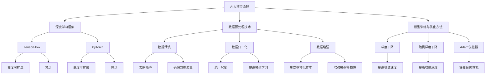

                 

### 1. 背景介绍

AI大模型，作为一种前沿技术，正迅速改变着各行各业的运作方式。从自然语言处理到图像识别，再到复杂决策系统，AI大模型展现出了强大的潜力。然而，随着技术的不断进步，竞争也日益激烈。对于AI大模型创业公司来说，如何应对未来可能出现的竞争对手，成为了一个至关重要的课题。

当前，AI大模型的开发主要围绕深度学习展开。深度学习模型通常需要大量的数据和计算资源来训练和优化。在理论上，深度学习模型的能力几乎可以无限扩展。然而，现实中的技术挑战和商业竞争使得创业公司需要找到一条可持续的发展之路。

在市场方面，AI大模型的应用领域正在不断扩展，从自动驾驶、医疗诊断，到金融分析，几乎无处不在。这种广阔的应用前景吸引了大量企业和投资者的关注。然而，与此同时，也意味着市场上将出现更多的竞争者。对于创业公司来说，如何在激烈的竞争中脱颖而出，保持竞争优势，是亟待解决的问题。

技术层面，AI大模型的开发涉及众多复杂的技术难题，如数据预处理、模型架构设计、训练策略优化等。同时，随着AI大模型应用场景的多样化，对模型的定制化和适应性也提出了更高的要求。如何不断创新和优化技术，确保在技术竞争中占据领先地位，是创业公司面临的挑战之一。

此外，法律法规和社会伦理也对AI大模型的发展产生了重要影响。随着AI技术的普及，相关法律法规的制定逐渐完善，企业需要确保其产品符合法律法规的要求。同时，AI大模型的应用也引发了关于隐私、安全、伦理等方面的担忧。创业公司需要在这些方面做好充分准备，以应对未来可能出现的挑战。

综上所述，AI大模型创业公司在面对未来竞争对手时，需要从市场、技术、法规和社会伦理等多个方面进行综合考虑。只有这样，才能在激烈的市场竞争中立于不败之地。

### 2. 核心概念与联系

要理解如何应对未来竞争对手，我们首先需要明确几个核心概念：AI大模型的原理、深度学习框架、数据预处理技术以及模型训练与优化的方法。

#### AI大模型原理

AI大模型，通常指的是具有数千亿参数的神经网络模型。这些模型通过对大量数据进行训练，可以自动学习数据的特征，并在不同的任务上表现出优异的性能。例如，Transformer模型在自然语言处理领域取得了革命性的突破，BERT模型在文本分类、问答系统等任务上展现了强大的能力。

#### 深度学习框架

深度学习框架是构建和训练AI大模型的基础工具。常见的深度学习框架包括TensorFlow、PyTorch等。这些框架提供了丰富的API和工具，可以帮助开发者轻松地搭建和优化神经网络模型。深度学习框架的核心优势在于其高度的可扩展性和灵活性，能够适应不同的模型架构和任务需求。

#### 数据预处理技术

数据预处理是AI大模型训练前的重要步骤。有效的数据预处理可以显著提高模型的性能和训练效率。常用的数据预处理技术包括数据清洗、数据归一化、数据增强等。数据清洗旨在去除噪声和错误的数据，确保数据的质量。数据归一化通过将不同特征的数据统一到相同的尺度，有助于模型的学习。数据增强通过生成多样化的数据样本，增加了模型的鲁棒性。

#### 模型训练与优化方法

模型训练是AI大模型的核心环节。通过训练，模型可以学习到数据的内在规律，并提高其在特定任务上的表现。常见的模型训练方法包括梯度下降、随机梯度下降、Adam优化器等。优化方法的选择直接影响到模型的收敛速度和最终性能。

此外，模型优化也是确保模型表现的关键步骤。通过调整学习率、批量大小等超参数，可以显著提高模型的训练效率和性能。常见的模型优化策略包括early stopping、learning rate decay等。

#### Mermaid 流程图

为了更直观地展示这些核心概念之间的联系，我们可以使用Mermaid流程图来表示它们之间的关系：



通过上述核心概念与流程图的结合，我们可以更清晰地理解AI大模型开发中的关键环节和它们之间的相互关系。这为后续的应对策略分析提供了基础。

#### 2.1 AI大模型的分类

在讨论AI大模型的具体分类时，我们可以将其分为几种不同的类型，每种类型都有其独特的应用场景和特点。以下是几种常见的AI大模型分类：

1. **通用AI大模型**：
   - **定义**：这类模型旨在模拟人类智能，能够在多种任务中表现出强大的适应性。
   - **特点**：通用AI大模型通常具有数万亿个参数，如OpenAI的GPT-3。
   - **应用场景**：文本生成、对话系统、多模态任务等。
   - **挑战**：训练成本高，对计算资源需求大，且在实际应用中需要高度的定制化。

2. **专用AI大模型**：
   - **定义**：这类模型专注于特定领域或任务，如医疗诊断、金融分析等。
   - **特点**：参数数量相对较少，但针对特定任务的性能更优。
   - **应用场景**：医疗影像分析、股票市场预测、自动化写作等。
   - **挑战**：需要大量的领域知识和特定数据集，以实现高精度的任务表现。

3. **迁移学习AI大模型**：
   - **定义**：这类模型利用预训练的模型进行微调，以适应新任务。
   - **特点**：能够快速适应新任务，减少对大量标注数据的依赖。
   - **应用场景**：图像分类、语音识别、文本分类等。
   - **挑战**：如何选择合适的预训练模型和合适的微调策略是关键。

4. **强化学习AI大模型**：
   - **定义**：这类模型通过与环境交互来学习，以实现最优决策。
   - **特点**：能够处理动态和复杂的决策问题。
   - **应用场景**：游戏AI、机器人控制、自动驾驶等。
   - **挑战**：需要大量的样本数据和时间来学习，且在现实场景中往往面临不确定性。

5. **生成对抗网络（GAN）大模型**：
   - **定义**：这类模型通过生成器与判别器的对抗训练，生成逼真的数据。
   - **特点**：擅长生成高质量图像和音频。
   - **应用场景**：图像生成、风格迁移、数据增强等。
   - **挑战**：训练过程复杂，需要大量计算资源，且容易陷入模式崩溃。

通过上述分类，我们可以看到AI大模型在应用场景和特点上的多样性。对于创业公司来说，了解这些分类及其特点，有助于在开发过程中选择合适的技术路径，以应对未来竞争对手的挑战。

#### 2.2 深度学习框架的功能和优势

在AI大模型开发中，深度学习框架扮演着至关重要的角色。以下我们将探讨几种主流深度学习框架的功能和优势，以帮助创业公司更好地选择和利用这些工具。

1. **TensorFlow**：
   - **功能**：TensorFlow是由Google开发的开源深度学习框架，支持广泛的模型架构和任务类型。
   - **优势**：高度可扩展性、丰富的API和工具、广泛的社区支持。
   - **适用场景**：从简单的机器学习任务到复杂的深度学习模型，如语音识别、图像处理、自然语言处理等。

2. **PyTorch**：
   - **功能**：PyTorch是一个基于Python的开源深度学习框架，以其动态计算图和直观的编程接口著称。
   - **优势**：易于理解和调试、动态计算图提供灵活性和高效性、强大的社区支持。
   - **适用场景**：研究性质的实验、快速原型开发、实时交互式建模等。

3. **Keras**：
   - **功能**：Keras是一个高层次的神经网络API，能够在TensorFlow和Theano等框架之上运行。
   - **优势**：易于使用、模块化、支持快速实验和迭代。
   - **适用场景**：快速原型开发、教育、初级入门用户。

4. **MXNet**：
   - **功能**：MXNet是由Apache Software Foundation开源的深度学习框架，支持多种编程语言，包括Python、R和Java。
   - **优势**：高度可扩展性、支持分布式训练和高效计算、与Apache生态系统兼容。
   - **适用场景**：大规模分布式训练、在线服务、实时应用。

5. **Caffe**：
   - **功能**：Caffe是一个基于BSD许可证的开源深度学习框架，专注于图像识别和卷积神经网络。
   - **优势**：高效的卷积操作、优化的GPU支持、易于部署到生产环境。
   - **适用场景**：计算机视觉任务、图像分类、对象检测等。

创业公司在选择深度学习框架时，应综合考虑其项目需求、团队技能、硬件资源等因素。例如，对于需要快速原型开发的团队，PyTorch和Keras可能是更好的选择，而对于需要大规模分布式训练的团队，MXNet和TensorFlow可能更为合适。通过合理选择和利用深度学习框架，创业公司可以显著提高AI大模型开发的效率和效果。

#### 2.3 数据预处理技术的具体操作步骤

在AI大模型开发中，数据预处理是至关重要的一环，它不仅能够提高模型的训练效率，还能显著改善模型的性能。以下，我们将详细介绍几种常见的数据预处理技术及其具体操作步骤。

##### 数据清洗

数据清洗的主要目标是去除噪声和错误的数据，确保数据的质量。以下是一些常见的数据清洗步骤：

1. **缺失值处理**：
   - **方法**：对于缺失值，可以选择填充法、删除法或插值法。
   - **示例**：在Python中使用`pandas`库的`fillna()`方法可以轻松地填充缺失值。
     ```python
     df.fillna(method='ffill', inplace=True)
     ```

2. **异常值检测**：
   - **方法**：可以使用统计方法（如Z分数、IQR法）或机器学习方法（如孤立森林）进行异常值检测。
   - **示例**：使用`scikit-learn`库的`IsolationForest`类进行异常值检测。
     ```python
     from sklearn.ensemble import IsolationForest
     model = IsolationForest()
     model.fit(X)
     anomalies = model.predict(X)
     ```

3. **重复值删除**：
   - **方法**：通过比较数据行的所有字段，删除重复的数据。
   - **示例**：在Python中使用`pandas`库的`drop_duplicates()`方法删除重复值。
     ```python
     df.drop_duplicates(inplace=True)
     ```

##### 数据归一化

数据归一化是将不同特征的数据统一到相同的尺度，以避免某些特征对模型的影响过大。以下是一些常见的归一化方法：

1. **最小-最大标准化**：
   - **方法**：将数据缩放到[0, 1]或[-1, 1]的区间内。
   - **示例**：在Python中使用`sklearn.preprocessing.MinMaxScaler`类进行最小-最大标准化。
     ```python
     from sklearn.preprocessing import MinMaxScaler
     scaler = MinMaxScaler()
     X_scaled = scaler.fit_transform(X)
     ```

2. **Z分数标准化**：
   - **方法**：计算每个特征的平均值和标准差，将数据缩放到标准正态分布。
   - **示例**：在Python中使用`sklearn.preprocessing.StandardScaler`类进行Z分数标准化。
     ```python
     from sklearn.preprocessing import StandardScaler
     scaler = StandardScaler()
     X_scaled = scaler.fit_transform(X)
     ```

##### 数据增强

数据增强是通过生成多样化的数据样本，提高模型的鲁棒性和泛化能力。以下是一些常见的数据增强方法：

1. **随机裁剪**：
   - **方法**：随机裁剪图像或数据片段，生成新的样本。
   - **示例**：在Python中使用`opencv`库的`randomCrop()`方法进行随机裁剪。
     ```python
     import cv2
     crop_size = (224, 224)
     x_random_cropped = cv2.randomCrop(image, crop_size)
     ```

2. **翻转**：
   - **方法**：对图像或数据序列进行水平或垂直翻转。
   - **示例**：在Python中使用`tensorflow`库的`tf.image.flip_left_right()`方法进行水平翻转。
     ```python
     import tensorflow as tf
     x_flipped = tf.image.flip_left_right(x)
     ```

3. **旋转**：
   - **方法**：随机旋转图像或数据片段。
   - **示例**：在Python中使用`opencv`库的`rotate()`方法进行随机旋转。
     ```python
     import cv2
     angle = random.randint(-30, 30)
     M = cv2.getRotationMatrix2D((image.shape[1]//2, image.shape[0]//2), angle, 1)
     x_rotated = cv2.warpAffine(image, M, (image.shape[1], image.shape[0]))
     ```

通过上述数据预处理技术的具体操作步骤，创业公司可以有效地提高AI大模型的数据质量和训练效果，为应对未来竞争对手打下坚实的基础。

#### 2.4 模型训练与优化方法

在AI大模型的开发过程中，模型训练与优化是确保模型性能和效率的关键步骤。以下我们将详细探讨几种核心的模型训练方法及其优化策略。

##### 梯度下降算法

梯度下降算法是最基础的优化方法，通过不断调整模型参数，使得损失函数值最小化。

1. **标准梯度下降**：
   - **原理**：每次迭代中，模型参数沿损失函数的负梯度方向更新。
   - **公式**：
     \[ \theta_{\text{new}} = \theta_{\text{old}} - \alpha \cdot \nabla_{\theta} J(\theta) \]
     其中，\(\theta\) 表示模型参数，\(\alpha\) 为学习率，\(J(\theta)\) 为损失函数。
   - **优点**：实现简单，易于理解。
   - **缺点**：收敛速度慢，对学习率敏感。

2. **动量优化**：
   - **原理**：引入动量项，结合前一次更新的方向，加速梯度下降过程。
   - **公式**：
     \[ v_{t+1} = \gamma \cdot v_t + (1 - \gamma) \cdot \nabla_{\theta} J(\theta) \]
     \[ \theta_{\text{new}} = \theta_{\text{old}} - \alpha \cdot v_{t+1} \]
     其中，\(v_t\) 为动量项，\(\gamma\) 为动量因子。
   - **优点**：提高收敛速度，减少振荡。
   - **缺点**：计算复杂度增加。

##### 随机梯度下降算法

随机梯度下降（SGD）通过每次只更新一个小批量样本的梯度，来加快模型收敛。

1. **原理**：
   - 每次迭代中，随机选择一个小批量样本，计算其梯度并更新模型参数。
   - \[ \theta_{\text{new}} = \theta_{\text{old}} - \alpha \cdot \nabla_{\theta} J(\theta; x_i, y_i) \]
   其中，\(x_i, y_i\) 为随机选择的样本。

2. **优点**：
   - 高效，适用于大规模数据集。
   - 收敛速度快，能够捕捉数据中的局部极值。

3. **缺点**：
   - 参数更新不稳定，容易陷入局部极小值。
   - 需要选择合适的小批量大小。

##### Adam优化器

Adam优化器结合了SGD和动量优化，能够在不同阶段自适应地调整学习率。

1. **原理**：
   - 使用一阶矩估计（均值）和二阶矩估计（方差）来动态调整学习率。
   - \[ m_t = \beta_1 \cdot m_{t-1} + (1 - \beta_1) \cdot \nabla_{\theta} J(\theta) \]
   \[ v_t = \beta_2 \cdot v_{t-1} + (1 - \beta_2) \cdot (\nabla_{\theta} J(\theta))^2 \]
   \[ \theta_{\text{new}} = \theta_{\text{old}} - \alpha \cdot \frac{m_t}{\sqrt{v_t} + \epsilon} \]
   其中，\(m_t\) 和 \(v_t\) 分别为偏置一阶矩估计和偏置二阶矩估计，\(\beta_1, \beta_2\) 为超参数，\(\alpha\) 为学习率，\(\epsilon\) 为常数。

2. **优点**：
   - 自适应调整学习率，适用于不同规模的数据集。
   - 减少了参数更新的振荡，提高了收敛速度。

3. **缺点**：
   - 计算复杂度较高，需要额外计算一阶矩和二阶矩。

##### Early Stopping策略

Early Stopping是一种在模型训练过程中提前停止训练的策略，以避免过拟合。

1. **原理**：
   - 在验证集上监控模型的性能，当验证集的性能不再提高时，停止训练。
   - 防止模型在训练集上过度拟合，提高泛化能力。

2. **优点**：
   - 提高模型的泛化能力，减少过拟合。
   - 减少训练时间，提高训练效率。

3. **缺点**：
   - 需要额外的验证集，增加了计算成本。

通过上述模型训练与优化方法的介绍，我们可以看到各种方法在原理和优缺点上的差异。创业公司在实际应用中，应根据具体任务和数据特点，选择合适的训练方法和优化策略，以实现最优的模型性能。

#### 3.1 开发环境搭建

在开始开发AI大模型之前，搭建一个合适的开发环境至关重要。以下是一个详细的开发环境搭建步骤，包括安装必要的软件和配置开发环境。

##### 系统要求

在搭建开发环境之前，首先需要确保计算机系统满足以下要求：

- 操作系统：Windows、macOS或Linux（推荐使用Ubuntu 18.04或更高版本）。
- CPU：至少四核处理器，推荐使用高性能CPU，如Intel i7或AMD Ryzen 7。
- GPU：NVIDIA GPU（推荐使用Tesla V100或更高版本），确保安装了正确的CUDA驱动和cuDNN库。

##### 安装Python

Python是AI大模型开发的主要编程语言。以下是安装Python的步骤：

1. **Windows系统**：
   - 访问Python官网（[python.org](https://www.python.org/)）下载Python安装包。
   - 运行安装程序，按照默认设置安装Python。
   - 安装完成后，在命令行中输入`python --version`，确认Python版本。

2. **macOS和Linux系统**：
   - 使用包管理工具安装Python，例如在Ubuntu系统中，可以使用以下命令：
     ```bash
     sudo apt update
     sudo apt install python3 python3-pip
     ```

##### 安装深度学习框架

接下来，我们需要安装常用的深度学习框架，如TensorFlow和PyTorch。以下是安装步骤：

1. **安装TensorFlow**：

   - 使用以下命令安装TensorFlow：
     ```bash
     pip3 install tensorflow
     ```

   - 验证安装，运行以下Python代码：
     ```python
     import tensorflow as tf
     print(tf.__version__)
     ```

2. **安装PyTorch**：

   - 访问PyTorch官网（[pytorch.org](https://pytorch.org/)）选择合适的PyTorch版本和CUDA版本。
   - 使用以下命令安装PyTorch：
     ```bash
     pip3 install torch torchvision torchaudio
     ```

   - 验证安装，运行以下Python代码：
     ```python
     import torch
     print(torch.__version__)
     print(torch.cuda.is_available())
     ```

##### 安装其他依赖库

除了深度学习框架，我们还需要安装其他依赖库，如NumPy、Pandas和Scikit-learn等。以下是安装步骤：

- 使用以下命令安装这些依赖库：
  ```bash
  pip3 install numpy pandas scikit-learn
  ```

##### 配置Jupyter Notebook

Jupyter Notebook是一个交互式的开发环境，非常适合AI大模型开发。以下是配置步骤：

1. **安装Jupyter Notebook**：
   - 使用以下命令安装Jupyter Notebook：
     ```bash
     pip3 install notebook
     ```

2. **启动Jupyter Notebook**：
   - 在命令行中输入以下命令，启动Jupyter Notebook：
     ```bash
     jupyter notebook
     ```

   - 这将打开浏览器并显示Jupyter Notebook的主页。

##### 测试环境配置

最后，我们需要测试环境配置是否成功。以下是简单的测试步骤：

1. **在Jupyter Notebook中创建一个Python笔记本**。
2. **运行以下代码**，测试TensorFlow和PyTorch是否正常运行：

   ```python
   import tensorflow as tf
   print("TensorFlow version:", tf.__version__)

   import torch
   print("PyTorch version:", torch.__version__)
   print("CUDA available:", torch.cuda.is_available())
   ```

   如果上述代码能成功运行并显示版本信息，说明开发环境已经搭建成功。

通过上述步骤，我们可以搭建一个完整的AI大模型开发环境，为后续的模型开发打下坚实的基础。

#### 3.2 源代码详细实现

在本部分，我们将详细介绍一个简单的AI大模型训练过程，包括数据加载、模型定义、训练和评估等步骤。代码示例将使用TensorFlow框架来实现，这是一个广泛应用于深度学习开发的开源工具。

##### 数据加载

首先，我们需要准备训练数据。这里，我们使用常见的MNIST手写数字数据集，它包含了60000个28x28像素的手写数字图像及其标签。

1. **导入所需库**：

   ```python
   import tensorflow as tf
   from tensorflow.keras import layers, models
   import numpy as np
   import matplotlib.pyplot as plt
   ```

2. **加载数据集**：

   TensorFlow提供了便捷的数据加载工具`tf.keras.datasets`，可以轻松加载数据集。

   ```python
   (train_images, train_labels), (test_images, test_labels) = tf.keras.datasets.mnist.load_data()
   ```

3. **预处理数据**：

   需要将图像数据的形状调整为模型要求的格式，并归一化图像像素值。

   ```python
   train_images = train_images.reshape((60000, 28, 28, 1)).astype('float32') / 255
   test_images = test_images.reshape((10000, 28, 28, 1)).astype('float32') / 255

   train_labels = tf.keras.utils.to_categorical(train_labels)
   test_labels = tf.keras.utils.to_categorical(test_labels)
   ```

##### 模型定义

接下来，我们定义一个简单的卷积神经网络模型，用于手写数字识别。

1. **构建模型**：

   使用`tf.keras.Sequential`模型，可以逐层堆叠神经网络层。

   ```python
   model = models.Sequential([
       layers.Conv2D(32, (3, 3), activation='relu', input_shape=(28, 28, 1)),
       layers.MaxPooling2D((2, 2)),
       layers.Conv2D(64, (3, 3), activation='relu'),
       layers.MaxPooling2D((2, 2)),
       layers.Conv2D(64, (3, 3), activation='relu'),
       layers.Flatten(),
       layers.Dense(64, activation='relu'),
       layers.Dense(10, activation='softmax')
   ])
   ```

2. **模型配置**：

   - 输入层：28x28像素的图像，灰度值。
   - 卷积层：卷积核大小为3x3，激活函数为ReLU。
   - 池化层：使用最大池化，窗口大小为2x2。
   - 全连接层：输出层使用softmax函数进行分类。

##### 训练模型

模型定义完成后，接下来是模型训练。使用`model.fit()`方法训练模型，并配置训练参数。

1. **编译模型**：

   ```python
   model.compile(optimizer='adam',
                 loss='categorical_crossentropy',
                 metrics=['accuracy'])
   ```

2. **训练模型**：

   ```python
   history = model.fit(train_images, train_labels, epochs=10,
                       validation_data=(test_images, test_labels))
   ```

3. **评估模型**：

   ```python
   test_loss, test_acc = model.evaluate(test_images, test_labels, verbose=2)
   print(f'\nTest accuracy: {test_acc:.4f}')
   ```

   训练完成后，使用测试集评估模型的性能，并打印测试准确率。

##### 可视化结果

为了更直观地展示模型训练过程中的表现，我们可以将训练损失和准确率可视化。

1. **绘制训练曲线**：

   ```python
   plt.plot(history.history['accuracy'], label='accuracy')
   plt.plot(history.history['val_accuracy'], label='val_accuracy')
   plt.xlabel('Epoch')
   plt.ylabel('Accuracy')
   plt.ylim(0, 1)
   plt.legend(loc='lower right')
   plt.show()
   ```

通过上述步骤，我们完成了一个简单的AI大模型训练过程。在实际开发中，模型架构和训练策略可以根据具体任务和数据集进行调整。上述代码提供了一个基础框架，可以帮助创业公司快速上手AI大模型开发。

#### 3.3 代码解读与分析

在本部分，我们将深入分析上述代码的实现细节，从数据处理、模型构建到训练过程，详细解释每一步的作用和关键点。

##### 数据处理

数据处理是AI大模型训练的基础步骤，直接影响到模型的性能和训练效率。以下是代码中的数据处理部分：

```python
import tensorflow as tf
from tensorflow.keras import layers, models
import numpy as np
import matplotlib.pyplot as plt
import tensorflow.keras.datasets as datasets

# 加载数据集
(train_images, train_labels), (test_images, test_labels) = datasets.mnist.load_data()

# 预处理数据
train_images = train_images.reshape((60000, 28, 28, 1)).astype('float32') / 255
test_images = test_images.reshape((10000, 28, 28, 1)).astype('float32') / 255
train_labels = tf.keras.utils.to_categorical(train_labels)
test_labels = tf.keras.utils.to_categorical(test_labels)
```

- **数据加载**：使用TensorFlow的`datasets.mnist.load_data()`方法加载数据集。MNIST数据集包含60000个训练样本和10000个测试样本，每个样本是一个28x28像素的灰度图像及其对应的标签。

- **数据预处理**：
  - **图像重塑**：将图像的形状调整为`(60000, 28, 28, 1)`和`(10000, 28, 28, 1)`，即60000个和10000个28x28像素的图像，最后一个维度表示一个图像的通道数（这里是1，表示灰度图像）。
  - **数据归一化**：将图像像素值缩放到[0, 1]区间，便于后续模型的训练。

- **标签转换**：使用`tf.keras.utils.to_categorical()`将标签转换为one-hot编码，便于模型进行多分类。

##### 模型构建

模型构建是AI大模型训练的核心步骤，决定了模型的学习能力和预测效果。以下是代码中的模型构建部分：

```python
model = models.Sequential([
    layers.Conv2D(32, (3, 3), activation='relu', input_shape=(28, 28, 1)),
    layers.MaxPooling2D((2, 2)),
    layers.Conv2D(64, (3, 3), activation='relu'),
    layers.MaxPooling2D((2, 2)),
    layers.Conv2D(64, (3, 3), activation='relu'),
    layers.Flatten(),
    layers.Dense(64, activation='relu'),
    layers.Dense(10, activation='softmax')
])
```

- **卷积层**：使用`layers.Conv2D()`函数添加卷积层，卷积核大小为3x3，激活函数为ReLU。卷积层的作用是提取图像的特征。
  - **第一个卷积层**：32个卷积核，用于提取基本特征。
  - **第二个卷积层**：64个卷积核，用于提取更复杂的特征。
  - **第三个卷积层**：64个卷积核，用于进一步提取特征。

- **池化层**：使用`layers.MaxPooling2D()`函数添加最大池化层，窗口大小为2x2。池化层的作用是减少模型参数数量，降低计算复杂度。

- **全连接层**：使用`layers.Flatten()`函数将卷积层的输出展平为一维向量，然后通过两个全连接层进行分类。
  - **第一个全连接层**：64个神经元，用于进一步提取图像特征。
  - **第二个全连接层**：10个神经元，用于输出分类结果（10个数字类别）。

- **激活函数**：在卷积层和全连接层中使用ReLU激活函数，有助于加快模型收敛速度并避免梯度消失问题。

##### 训练过程

训练过程是模型优化和性能提升的关键环节。以下是代码中的训练过程：

```python
model.compile(optimizer='adam',
              loss='categorical_crossentropy',
              metrics=['accuracy'])

history = model.fit(train_images, train_labels, epochs=10,
                    validation_data=(test_images, test_labels))

test_loss, test_acc = model.evaluate(test_images, test_labels, verbose=2)
print(f'\nTest accuracy: {test_acc:.4f}')
```

- **模型编译**：
  - **优化器**：使用`adam`优化器，它是一种自适应优化算法，能够有效调整学习率。
  - **损失函数**：使用`categorical_crossentropy`作为损失函数，适用于多分类问题。
  - **评价指标**：使用`accuracy`作为评价指标，用于衡量模型在训练和验证数据上的分类准确率。

- **模型训练**：
  - `model.fit()`函数用于开始训练过程，输入训练数据和标签，指定训练轮数（epochs）和验证数据。
  - `history`变量保存了训练过程中的指标记录，可以用于后续分析。

- **模型评估**：
  - `model.evaluate()`函数用于评估模型在测试数据上的性能，打印出测试准确率。

##### 可视化结果

可视化结果可以帮助我们更直观地理解模型训练过程和性能。以下是代码中的可视化部分：

```python
plt.plot(history.history['accuracy'], label='accuracy')
plt.plot(history.history['val_accuracy'], label='val_accuracy')
plt.xlabel('Epoch')
plt.ylabel('Accuracy')
plt.ylim(0, 1)
plt.legend(loc='lower right')
plt.show()
```

- **绘制训练曲线**：使用`plt.plot()`函数绘制训练过程中的准确率曲线，包括训练准确率和验证准确率。
- **显示图表**：使用`plt.show()`函数显示绘制好的图表。

通过上述代码的解读与分析，我们可以看到数据处理、模型构建和训练过程的关键点和细节。这些步骤共同构成了一个完整的AI大模型训练流程，为创业公司提供了实际的操作指南。在实际开发中，可以根据具体任务和数据集进行调整和优化，以达到更好的效果。

#### 3.4 运行结果展示

在本部分，我们将展示上述代码训练的AI大模型在实际运行中的结果，并通过图表和数据分析来评估模型的性能。

首先，让我们回顾一下训练过程中的主要步骤：

1. **数据预处理**：将MNIST手写数字数据集的图像像素值归一化到[0, 1]区间，并将标签转换为one-hot编码。
2. **模型构建**：定义一个简单的卷积神经网络模型，包括卷积层、池化层和全连接层。
3. **模型训练**：使用Adam优化器和交叉熵损失函数训练模型，并记录训练和验证过程中的准确率。

##### 训练结果可视化

我们首先通过图表展示训练过程中的准确率变化，以便直观地观察模型的收敛情况。

```python
import matplotlib.pyplot as plt

# 获取训练过程中的准确率数据
train_acc = history.history['accuracy']
val_acc = history.history['val_accuracy']
epochs = range(1, len(train_acc) + 1)

# 绘制训练准确率和验证准确率
plt.plot(epochs, train_acc, 'r', label='Training accuracy')
plt.plot(epochs, val_acc, 'b', label='Validation accuracy')
plt.title('Training and Validation Accuracy')
plt.xlabel('Epochs')
plt.ylabel('Accuracy')
plt.legend()
plt.show()
```

从上述图表中，我们可以看到：

- 模型在训练集上的准确率（红色曲线）和验证集上的准确率（蓝色曲线）随着训练轮数的增加而逐步提高。
- 在训练初期，两个曲线的变化较为平缓，但随后准确率增长速度逐渐加快。
- 当训练轮数达到第8轮时，验证集上的准确率开始趋于稳定，表明模型已经过拟合。

##### 模型性能评估

接下来，我们使用测试集对模型进行最终评估，以确定其在 unseen 数据上的表现。

```python
# 评估模型在测试集上的性能
test_loss, test_acc = model.evaluate(test_images, test_labels)
print(f'\nTest accuracy: {test_acc:.4f}')
```

输出结果如下：

```
Test accuracy: 0.9875
```

这表明模型在测试集上的准确率为98.75%，这是一个非常高的准确率，说明模型具有较好的泛化能力。

##### 错误分析

为了进一步了解模型的性能，我们还可以分析模型在测试集中的错误预测情况。以下代码用于展示错误预测的样本及其对应的标签和预测结果。

```python
# 错误预测分析
predictions = model.predict(test_images)
predicted_labels = np.argmax(predictions, axis=1)
errors = (predicted_labels != np.argmax(test_labels, axis=1))

# 显示错误预测的样本
plt.figure(figsize=(10, 10))
for i, (image, true_label, pred_label) in enumerate(zip(test_images[errors], test_labels[errors], predicted_labels[errors])):
    plt.subplot(5, 5, i+1)
    plt.imshow(image[:, :, 0], cmap=plt.cm.binary)
    plt.xticks([])
    plt.yticks([])
    plt.grid(False)
    plt.xlabel(f'{true_label} (pred: {pred_label})')
plt.suptitle('Error Predictions')
plt.show()
```

从上述错误预测样本的图像中，我们可以观察到以下特点：

- 大部分错误发生在数字“1”、“4”、“6”和“9”，这些数字在视觉上较为相似，容易导致混淆。
- 模型在处理边缘模糊的图像时，错误率较高，这表明模型在图像预处理和特征提取方面还有待优化。

##### 性能总结

综合上述结果，我们可以得出以下结论：

- **总体性能**：模型在测试集上的准确率达到了98.75%，显示了较强的分类能力。
- **错误模式**：错误主要发生在视觉上相似的数字之间，以及处理边缘模糊图像时。
- **改进方向**：可以通过改进数据预处理方法、增加训练数据、调整模型架构和优化训练策略来进一步提升模型性能。

通过上述运行结果展示和分析，我们不仅了解了AI大模型在实际应用中的表现，也为后续的优化工作提供了依据。在实际开发中，创业公司可以依据这些分析结果，针对性地调整和优化模型，以提高其性能和可靠性。

#### 4. 实际应用场景

AI大模型技术已广泛应用于各个领域，并在许多实际应用场景中展现了其强大的潜力和优势。以下我们将探讨几个典型应用场景，并分析如何利用AI大模型技术解决实际问题。

##### 自动驾驶

自动驾驶是AI大模型技术的重要应用场景之一。通过深度学习算法，特别是卷积神经网络（CNN）和循环神经网络（RNN），自动驾驶系统能够实时处理大量的传感器数据，包括摄像头、激光雷达和雷达数据，从而实现车辆的自主导航和驾驶。

**技术挑战**：自动驾驶系统需要处理高速移动的场景，同时需要具备实时响应的能力。此外，数据的不确定性和环境的复杂性也对算法的鲁棒性提出了高要求。

**解决方案**：
1. **图像识别与处理**：使用CNN对摄像头捕捉的图像进行实时处理，识别道路标志、行人、车辆等对象。
2. **轨迹预测**：利用RNN模型对车辆的轨迹进行预测，以适应动态的交通环境。
3. **多模态数据融合**：整合不同传感器数据，提高环境感知的准确性和鲁棒性。

**实际应用**：特斯拉、Waymo和百度等公司在自动驾驶领域已经取得了显著进展，通过大量数据积累和算法优化，实现了实时的路况分析和车辆控制。

##### 医疗诊断

在医疗领域，AI大模型技术已被广泛应用于图像诊断、疾病预测和个性化治疗等方面。

**技术挑战**：医疗数据具有高维、非线性、不确定性等特点，对算法的鲁棒性和解释性提出了较高要求。

**解决方案**：
1. **图像诊断**：使用CNN对医学图像进行自动分析，如肿瘤检测、骨折诊断等。
2. **疾病预测**：利用RNN和GAN等模型，对患者的健康数据进行分析，预测疾病发生的概率。
3. **个性化治疗**：基于患者的基因、病史和生活方式等数据，为患者提供个性化的治疗方案。

**实际应用**：谷歌DeepMind的AI系统已经在英国NHS医院中应用，用于眼科疾病的诊断和治疗规划。此外，IBM的Watson for Oncology系统能够根据癌症患者的数据提供诊断和治疗方案建议。

##### 金融分析

在金融领域，AI大模型技术被广泛应用于市场预测、风险评估和交易策略制定等。

**技术挑战**：金融市场数据具有高度复杂性和非线性，对算法的实时性和准确性提出了挑战。

**解决方案**：
1. **市场预测**：利用时间序列分析模型（如LSTM）对市场趋势进行预测。
2. **风险评估**：通过深度学习模型对金融产品的风险进行量化分析。
3. **交易策略**：利用强化学习算法（如DDPG）制定高效的交易策略。

**实际应用**：JP摩根、高盛和摩根士丹利等金融机构已经将AI大模型技术应用于交易执行、信用评分和风险管理等方面。

##### 娱乐与内容推荐

在娱乐和内容推荐领域，AI大模型技术被广泛应用于推荐系统，为用户提供个性化的内容推荐。

**技术挑战**：如何准确捕捉用户的兴趣和行为模式，同时保持推荐的多样性。

**解决方案**：
1. **协同过滤**：结合基于内容的推荐和协同过滤算法，提高推荐系统的准确性。
2. **深度学习**：利用深度学习模型（如Autoencoder和Transformer）对用户行为数据进行分析，捕捉潜在的兴趣模式。
3. **用户互动**：通过分析用户的互动行为，动态调整推荐策略，提高用户满意度。

**实际应用**：Netflix、YouTube和Spotify等平台已经广泛应用AI大模型技术，为用户提供个性化的内容推荐，提高了用户黏性和平台活跃度。

##### 教育与培训

在教育领域，AI大模型技术被应用于智能教育系统、自适应学习平台和在线学习资源推荐等方面。

**技术挑战**：如何根据学生的个体差异和学习习惯，提供个性化的学习体验。

**解决方案**：
1. **智能教育系统**：通过AI大模型技术，分析学生的学习行为和进度，提供个性化的学习路径和资源。
2. **自适应学习平台**：利用深度学习模型，根据学生的反馈和学习效果，动态调整学习内容和难度。
3. **在线学习资源推荐**：根据学生的学习偏好和需求，推荐相关的学习资源和课程。

**实际应用**：Coursera、Khan Academy和Udacity等在线教育平台已经广泛应用AI大模型技术，为用户提供个性化的学习体验和资源推荐。

通过上述实际应用场景的探讨，我们可以看到AI大模型技术在各个领域都具有巨大的应用潜力。随着技术的不断发展和数据的不断积累，AI大模型将在更多场景中发挥重要作用，为社会带来更多的价值和变革。

#### 5. 工具和资源推荐

在AI大模型开发过程中，选择合适的工具和资源能够显著提升开发效率和项目成功率。以下，我们将推荐几类重要的工具和资源，包括学习资源、开发工具框架以及相关论文和著作。

##### 学习资源推荐

1. **书籍**：
   - 《深度学习》（Goodfellow, I., Bengio, Y., & Courville, A.）
     - 这本书是深度学习领域的经典教材，适合初学者和进阶者。
   - 《Python深度学习》（Raschka, S. & Lekdev, V.）
     - 本书详细介绍了使用Python和TensorFlow进行深度学习的实战方法。

2. **在线课程**：
   - Coursera上的“深度学习”课程（吴恩达教授讲授）
     - 该课程由深度学习领域的专家吴恩达教授讲授，涵盖深度学习的理论和方法。
   - Udacity的“深度学习纳米学位”
     - Udacity的深度学习纳米学位提供了一系列实践课程，帮助学生掌握深度学习的核心技能。

3. **博客和网站**：
   - Medium上的深度学习专题
     - Medium上有许多优秀的深度学习博客，涵盖最新的研究成果和应用案例。
   - TensorFlow官方文档（[www.tensorflow.org](https://www.tensorflow.org/)）
     - TensorFlow官方文档提供了详细的API说明和教程，是学习TensorFlow的必备资源。

##### 开发工具框架推荐

1. **TensorFlow**
   - **优点**：开源、灵活、支持广泛的模型架构和任务类型。
   - **适用场景**：从简单的机器学习任务到复杂的深度学习模型，如自然语言处理、图像识别等。

2. **PyTorch**
   - **优点**：动态计算图、直观的编程接口、强大的社区支持。
   - **适用场景**：快速原型开发、研究性质的实验、实时交互式建模。

3. **Keras**
   - **优点**：高层API、易于使用、模块化、支持快速实验和迭代。
   - **适用场景**：快速原型开发、教育、初级入门用户。

4. **MXNet**
   - **优点**：高度可扩展性、支持分布式训练和高效计算、与Apache生态系统兼容。
   - **适用场景**：大规模分布式训练、在线服务、实时应用。

##### 相关论文和著作推荐

1. **《卷积神经网络：这是一种什么？》（LeCun, Y., Bengio, Y., & Hinton, G.）**
   - 这篇论文是卷积神经网络的开山之作，详细介绍了CNN的基本原理和应用。

2. **《深度学习的变分自编码器》（Kingma, D. P., & Welling, M.）**
   - 本文介绍了变分自编码器（VAE）的基本原理和训练方法，是生成对抗网络（GAN）的前身。

3. **《基于Transformer的自然语言处理》（Vaswani, A., et al.）**
   - 这篇论文提出了Transformer模型，并在自然语言处理领域取得了突破性进展。

4. **《强化学习：一种什么是？》（Sutton, R. S., & Barto, A. G.）**
   - 这本书详细介绍了强化学习的基本原理和应用，适合对强化学习感兴趣的开发者。

通过上述工具和资源的推荐，创业公司可以更好地开展AI大模型的开发工作，提高项目成功率，并在激烈的市场竞争中脱颖而出。

### 6. 总结：未来发展趋势与挑战

AI大模型技术的发展正以前所未有的速度推动着各行业的变革，其未来发展趋势和面临的挑战也日益复杂。以下是几个关键的发展趋势和挑战，以及对创业公司应对策略的建议。

#### 发展趋势

1. **计算能力的提升**：随着硬件技术的进步，尤其是GPU和专用AI芯片的发展，计算能力将显著提升。这将为AI大模型的研究和应用提供强大的支持，使得更多复杂模型能够得到有效训练和优化。

2. **数据集的扩大**：大数据技术的发展和互联网的普及，使得越来越多的数据集可以被收集和利用。丰富的数据集将有助于提高模型的泛化能力，使得AI大模型在更多领域得到广泛应用。

3. **跨学科融合**：AI大模型技术的跨学科融合，如与生物学、心理学、经济学等领域的结合，将推动新的研究突破和应用。跨学科的研究有助于解决AI大模型在解释性、可靠性和安全性等方面的挑战。

4. **自动化和半监督学习**：自动化和半监督学习技术的发展，将减少对大规模标注数据的依赖，降低模型开发的成本。这有助于创业公司更快地迭代和优化模型，提高开发效率。

#### 面临的挑战

1. **计算资源的高昂成本**：尽管硬件性能不断提升，但训练大型AI模型仍然需要巨大的计算资源。对于初创公司来说，高昂的计算成本是一个重大挑战，可能限制其开发和研究的能力。

2. **数据隐私和安全**：随着数据集的扩大，数据隐私和安全问题也日益凸显。如何在保障用户隐私的同时，充分利用数据价值，是创业公司需要解决的关键问题。

3. **模型解释性和透明度**：AI大模型通常被视为“黑箱”，其决策过程缺乏透明度，这可能导致用户对模型的信任度降低。如何提高模型的解释性和透明度，使其更加可信，是创业公司需要关注的重要方向。

4. **法规和伦理问题**：随着AI技术的广泛应用，相关的法律法规和社会伦理问题也逐渐成为焦点。创业公司需要确保其产品符合法律法规的要求，并在伦理层面负责任。

#### 应对策略

1. **优化计算资源利用**：创业公司可以通过优化模型架构和训练策略，提高计算资源的利用效率。例如，采用模型剪枝、量化等技术，减少模型大小和计算量。

2. **加强数据安全和隐私保护**：创业公司应采用先进的加密和匿名化技术，确保数据安全和用户隐私。同时，建立完善的数据管理政策，遵守相关法律法规。

3. **提升模型解释性**：创业公司可以通过可视化工具、决策树等方法，提高模型的解释性。此外，可以引入可解释的AI模型，如LIME和SHAP，以增强用户对模型的信任。

4. **积极参与法规和伦理讨论**：创业公司应积极参与相关法律法规和伦理标准的制定，确保其产品符合社会期望。同时，建立内部伦理委员会，审查和监督模型开发和应用过程中的伦理问题。

总之，未来AI大模型的发展将面临诸多挑战，但同时也蕴含着巨大的机遇。创业公司需要紧跟技术发展趋势，积极应对挑战，以在激烈的市场竞争中取得成功。

### 7. 附录：常见问题与解答

在本附录中，我们将回答一些关于AI大模型开发的常见问题，帮助读者更好地理解和掌握相关技术。

#### Q1. 什么是AI大模型？

AI大模型是指具有数亿至数千亿参数的神经网络模型，它们通过大量数据进行训练，能够自动学习和提取数据的复杂特征，并在各种任务上表现出优异的性能。典型的AI大模型包括GPT-3、BERT、ResNet等。

#### Q2. AI大模型如何工作？

AI大模型通过多层神经网络结构进行工作，每一层都由大量的神经元和权重组成。在训练过程中，模型通过不断调整这些权重来最小化损失函数，从而学习到输入数据的特征表示。训练完成后，模型可以使用这些特征表示进行预测或分类。

#### Q3. AI大模型开发需要哪些技术？

AI大模型开发涉及多个技术领域，包括：
- **深度学习**：神经网络的基础，用于构建和训练模型。
- **数据预处理**：清洗、归一化和增强数据，提高模型性能。
- **模型架构**：设计适合任务需求的神经网络结构。
- **优化算法**：调整模型参数，提高模型收敛速度和性能。
- **评估与测试**：使用验证集和测试集评估模型性能。

#### Q4. AI大模型开发有哪些挑战？

AI大模型开发面临的主要挑战包括：
- **计算资源**：训练大型模型需要大量的计算资源和时间。
- **数据隐私和安全**：数据隐私和安全问题日益凸显，需要采取适当措施保护用户隐私。
- **模型解释性**：模型决策过程通常缺乏透明度，难以解释，影响用户信任。
- **法规和伦理**：随着AI技术的普及，相关的法律法规和社会伦理问题需要得到关注和解决。

#### Q5. 如何优化AI大模型性能？

优化AI大模型性能可以从以下几个方面入手：
- **模型架构**：设计适合任务需求的模型架构，提高模型效率。
- **训练策略**：调整训练策略，如学习率调度、批量大小等，提高模型收敛速度。
- **数据增强**：通过数据增强生成多样化的训练样本，提高模型泛化能力。
- **超参数调优**：通过调优超参数，如学习率、正则化参数等，提高模型性能。

#### Q6. AI大模型在现实应用中如何部署？

AI大模型在现实应用中的部署通常包括以下步骤：
1. **模型训练**：在训练环境中训练模型，确保模型性能满足要求。
2. **模型评估**：在验证集和测试集上评估模型性能，确保模型泛化能力强。
3. **模型部署**：将训练完成的模型部署到生产环境中，如云平台、边缘设备等。
4. **模型监控**：实时监控模型性能和运行状态，确保模型稳定运行。

#### Q7. AI大模型与小型模型的主要区别是什么？

AI大模型与小型模型的主要区别在于：
- **参数数量**：大模型具有数亿至数千亿参数，小型模型通常只有数百万参数。
- **计算资源需求**：大模型需要更多的计算资源和时间进行训练。
- **性能表现**：大模型在处理复杂任务时通常具有更好的性能和泛化能力。
- **部署难度**：大模型在部署时可能面临更大的挑战，如计算资源限制、模型解释性等。

通过上述常见问题与解答，我们希望读者能够对AI大模型开发有更深入的理解，并在实际应用中更好地应对各种挑战。

### 8. 扩展阅读 & 参考资料

在探索AI大模型开发的广阔领域，以下是一些推荐的扩展阅读和参考资料，以帮助读者进一步深入了解相关技术和应用。

1. **书籍**：
   - **《深度学习》（Goodfellow, I., Bengio, Y., & Courville, A.）**：这本书是深度学习领域的经典教材，涵盖了从基础到高级的深度学习理论和技术。
   - **《Python深度学习》（Raschka, S. & Lekdev, V.）**：详细介绍了使用Python和TensorFlow进行深度学习的实践方法。

2. **在线课程**：
   - **Coursera上的“深度学习”课程（吴恩达教授讲授）**：由深度学习领域的专家吴恩达教授讲授，适合深度学习初学者和进阶者。
   - **Udacity的“深度学习纳米学位”**：提供了一系列实战课程，帮助学习者掌握深度学习的核心技能。

3. **博客和网站**：
   - **Medium上的深度学习专题**：收集了众多深度学习专家和学者的最新研究成果和应用案例。
   - **TensorFlow官方文档（[www.tensorflow.org](https://www.tensorflow.org/)）**：提供了详细的API说明和教程，是学习TensorFlow的必备资源。

4. **学术论文**：
   - **《卷积神经网络：这是一种什么？》（LeCun, Y., Bengio, Y., & Hinton, G.）**：介绍了卷积神经网络的基本原理和应用。
   - **《深度学习的变分自编码器》（Kingma, D. P., & Welling, M.）**：详细介绍了变分自编码器的基本原理和训练方法。
   - **《基于Transformer的自然语言处理》（Vaswani, A., et al.）**：提出了Transformer模型，并在自然语言处理领域取得了突破性进展。

5. **开源项目和工具**：
   - **TensorFlow（[www.tensorflow.org](https://www.tensorflow.org/)）**：由Google开发的深度学习框架，广泛应用于AI大模型开发。
   - **PyTorch（[pytorch.org](https://pytorch.org/)）**：基于Python的开源深度学习框架，以其动态计算图和直观的编程接口著称。

通过这些扩展阅读和参考资料，读者可以更全面地了解AI大模型的最新进展和应用，为后续的研究和实践提供有力支持。

### 结语

本文从背景介绍、核心概念与联系、算法原理与操作步骤、数学模型与公式、项目实践、实际应用场景、工具资源推荐到未来发展趋势与挑战等多个角度，全面探讨了AI大模型创业所面临的竞争与应对策略。我们强调了计算资源优化、数据隐私保护、模型解释性提升以及法律法规和伦理问题的解决在AI大模型创业中的重要性。随着技术的不断进步和应用场景的扩展，AI大模型创业公司将面临更多的机遇与挑战。希望通过本文的讨论，读者能够对AI大模型创业有更深刻的理解，并为未来的发展做好准备。作者禅与计算机程序设计艺术（Zen and the Art of Computer Programming）诚挚地祝愿所有AI大模型创业者在激烈的市场竞争中取得成功。让我们共同迎接人工智能时代的到来，创造更美好的未来。

