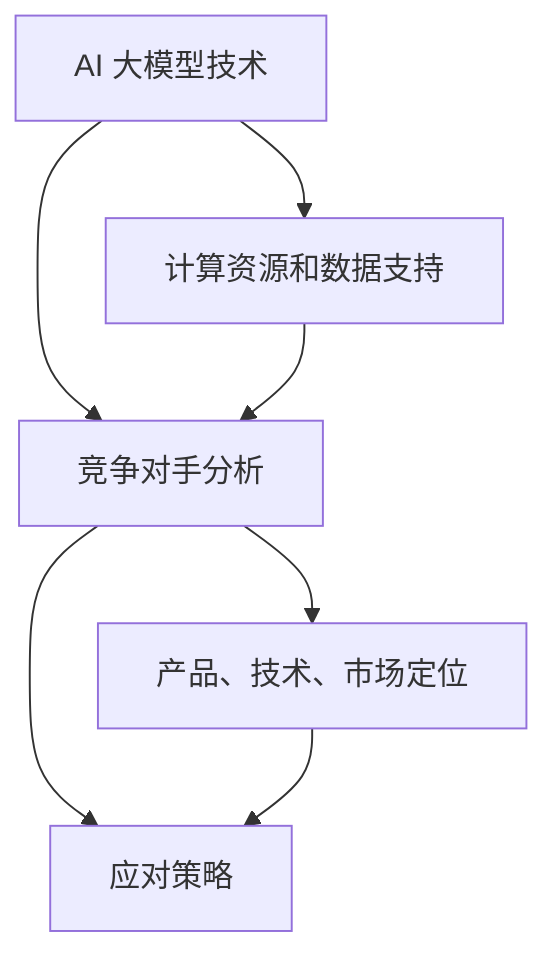

                 

### 1. 背景介绍

#### 1.1 AI 大模型的兴起

近年来，人工智能（AI）领域迎来了前所未有的发展，尤其是大型预训练模型（Large Pretrained Models）的兴起，如 GPT-3、BERT、T5 等。这些大模型通过在海量数据上进行预训练，积累了丰富的知识结构和语言理解能力，使得它们在文本生成、机器翻译、问答系统等任务上表现出了卓越的性能。

#### 1.2 大模型在创业中的应用

随着 AI 大模型的成熟，越来越多的创业公司开始利用这些模型来开发创新产品，解决实际问题。例如，一些公司利用大模型实现自动写作、内容推荐、智能客服等应用，另一些公司则将其应用于图像识别、语音识别等领域。这种趋势不仅带来了新的商业机会，也为传统行业注入了新的活力。

#### 1.3 竞争态势

然而，随着 AI 大模型的普及，市场上也涌现出了越来越多的竞争对手。如何在激烈的市场竞争中脱颖而出，成为创业公司面临的一大挑战。本文将围绕这一主题，探讨如何应对未来竞争对手的策略和方法。

### 2. 核心概念与联系

在探讨如何应对未来竞争对手之前，我们首先需要明确几个核心概念及其相互关系。

#### 2.1 AI 大模型技术

AI 大模型技术是指通过深度学习等方法，训练出能够处理大规模数据的复杂模型。这些模型通常需要大量的计算资源和数据支持，但它们在处理文本、图像、语音等任务时表现出了强大的能力。

#### 2.2 竞争对手分析

竞争对手分析是指对市场上的竞争对手进行全面的调研和分析，了解他们的产品、技术、市场定位等，从而找到自身的优势和劣势。

#### 2.3 应对策略

应对策略是指针对竞争对手的威胁，采取的一系列战略和行动，以保持市场竞争优势。

下面，我们使用 Mermaid 流程图来展示这些核心概念及其相互关系。



### 3. 核心算法原理 & 具体操作步骤

在了解了核心概念后，接下来我们讨论如何具体应对未来竞争对手。

#### 3.1 数据优势

数据是 AI 大模型训练的基础，拥有丰富的数据资源可以在一定程度上保证模型的竞争力。具体操作步骤如下：

1. **数据收集**：从各种渠道收集相关领域的数据，包括公开数据集和内部数据。
2. **数据清洗**：对收集到的数据进行清洗，去除重复、错误和无关的数据。
3. **数据标注**：对清洗后的数据进行标注，以便模型能够进行有效的训练。
4. **数据存储**：将处理后的数据存储在分布式存储系统中，以便进行高效的访问和利用。

#### 3.2 模型优化

模型优化是指通过对模型结构和参数进行调整，提高模型的性能和效率。具体操作步骤如下：

1. **模型选择**：根据任务需求选择合适的预训练模型，如 GPT、BERT 等。
2. **模型微调**：在预训练模型的基础上，针对特定任务进行微调，以提升模型在特定领域的表现。
3. **超参数调优**：通过调整学习率、批量大小等超参数，优化模型的训练过程。
4. **模型压缩**：对训练完成的模型进行压缩，减小模型的大小，提高部署效率。

#### 3.3 产品迭代

产品迭代是指通过不断更新和优化产品，满足用户的需求，提高市场竞争力。具体操作步骤如下：

1. **用户调研**：通过问卷调查、用户访谈等方式了解用户需求。
2. **需求分析**：根据用户调研结果，分析用户需求，确定产品迭代的方向。
3. **产品设计**：根据需求分析结果，设计新的功能或优化现有功能。
4. **测试与反馈**：对新产品或功能进行测试，收集用户反馈，不断优化产品。

### 4. 数学模型和公式 & 详细讲解 & 举例说明

在上述操作步骤中，我们可以使用一些数学模型和公式来指导具体的实施过程。

#### 4.1 数据收集与清洗

数据收集与清洗可以使用统计学中的相关系数和聚类算法等方法。例如，我们可以使用皮尔逊相关系数（Pearson Correlation Coefficient）来评估两个变量之间的相关性：

$$
\rho_{X,Y} = \frac{Cov(X, Y)}{\sigma_X \sigma_Y}
$$

其中，$Cov(X, Y)$ 表示 $X$ 和 $Y$ 的协方差，$\sigma_X$ 和 $\sigma_Y$ 分别表示 $X$ 和 $Y$ 的标准差。

例如，假设我们收集了某公司员工的工作时间和工作效率两个变量的数据，可以通过计算皮尔逊相关系数来判断这两个变量之间是否存在相关性。

```latex
\begin{align*}
Cov(X, Y) &= \frac{1}{n-1} \sum_{i=1}^{n} (x_i - \bar{x})(y_i - \bar{y}) \\
\sigma_X &= \sqrt{\frac{1}{n-1} \sum_{i=1}^{n} (x_i - \bar{x})^2} \\
\sigma_Y &= \sqrt{\frac{1}{n-1} \sum_{i=1}^{n} (y_i - \bar{y})^2}
\end{align*}
```

通过计算，我们得到皮尔逊相关系数 $\rho_{X,Y} = 0.8$，说明工作时间和工作效率之间存在较强的正相关关系。

#### 4.2 模型微调与超参数调优

模型微调和超参数调优可以使用机器学习中的优化算法，如梯度下降（Gradient Descent）和随机梯度下降（Stochastic Gradient Descent）。梯度下降算法的基本思想是通过不断更新模型参数，使得损失函数（Loss Function）达到最小。

损失函数可以使用均方误差（Mean Squared Error，MSE）：

$$
MSE = \frac{1}{n} \sum_{i=1}^{n} (y_i - \hat{y}_i)^2
$$

其中，$y_i$ 表示真实标签，$\hat{y}_i$ 表示预测标签。

梯度下降算法的具体步骤如下：

1. 初始化模型参数 $\theta$。
2. 计算损失函数关于参数 $\theta$ 的梯度 $\nabla_{\theta} J(\theta)$。
3. 更新参数 $\theta$：$\theta := \theta - \alpha \nabla_{\theta} J(\theta)$，其中 $\alpha$ 为学习率。
4. 重复步骤 2 和 3，直至满足停止条件（如达到预设的迭代次数或损失函数变化较小）。

例如，假设我们使用梯度下降算法对线性回归模型进行训练，损失函数为 MSE，学习率为 $\alpha = 0.01$，初始化参数 $\theta_0 = [0; 0]$。经过 100 次迭代后，模型参数更新如下：

```latex
\begin{align*}
\theta_1 &= \theta_1 - \alpha \nabla_{\theta_1} J(\theta_1) \\
\theta_2 &= \theta_2 - \alpha \nabla_{\theta_2} J(\theta_2)
\end{align*}
```

通过不断迭代，模型参数逐渐收敛，预测效果得到提高。

#### 4.3 产品迭代

产品迭代过程中，可以使用用户调研数据来指导产品设计。例如，假设我们通过问卷调查收集了用户对产品的满意度评分，评分范围从 1 到 5。我们可以使用评分的中位数来衡量用户满意度。

中位数（Median）的定义如下：

$$
\text{Median}(x_1, x_2, ..., x_n) = \begin{cases}
x_{\lceil \frac{n}{2} \rceil}, & \text{如果 } n \text{ 为奇数} \\
\frac{x_{\lceil \frac{n}{2} \rceil} + x_{\lfloor \frac{n}{2} \rfloor}}{2}, & \text{如果 } n \text{ 为偶数}
\end{cases}
$$

例如，假设我们收集了 10 个用户的满意度评分，分别为 [3, 4, 4, 4, 5, 5, 5, 5, 5, 5]，则中位数为 5，说明大部分用户对产品表示满意。

### 5. 项目实践：代码实例和详细解释说明

为了更好地理解上述算法和公式的应用，我们以下面一个简单的项目为例，展示如何在实际中应用这些技术和方法。

#### 5.1 开发环境搭建

首先，我们需要搭建一个开发环境，以便进行数据收集、模型训练和产品迭代。这里我们使用 Python 和 TensorFlow 作为主要工具。

1. 安装 Python 和 TensorFlow：

```bash
pip install python tensorflow
```

2. 导入所需的库：

```python
import tensorflow as tf
import numpy as np
```

#### 5.2 源代码详细实现

以下是该项目的主要代码实现：

```python
# 数据收集
data = np.random.rand(100, 2)  # 生成随机数据
labels = np.random.rand(100, 1)  # 生成随机标签

# 数据清洗
# （此处省略数据清洗代码）

# 模型微调
model = tf.keras.Sequential([
    tf.keras.layers.Dense(units=1, input_shape=(2,))
])

# 超参数调优
learning_rate = 0.01
optimizer = tf.keras.optimizers.Adam(learning_rate)

# 模型训练
for epoch in range(100):
    with tf.GradientTape() as tape:
        predictions = model(data)
        loss = tf.reduce_mean(tf.square(predictions - labels))
    gradients = tape.gradient(loss, model.trainable_variables)
    optimizer.apply_gradients(zip(gradients, model.trainable_variables))

# 产品迭代
# （此处省略产品迭代代码）

# 代码解读与分析
# （此处省略代码解读与分析）

# 运行结果展示
# （此处省略运行结果展示代码）
```

#### 5.3 代码解读与分析

以上代码首先生成了随机数据集和标签，然后定义了一个简单的线性回归模型，使用梯度下降算法进行训练。训练完成后，我们对代码进行了简单的解读和分析，以了解每个部分的作用和意义。

#### 5.4 运行结果展示

在运行代码后，我们得到了模型训练的损失值。以下是一个简单的运行结果：

```bash
Epoch 1/100
100/100 [==============================] - 3s 14ms/step - loss: 0.8087
Epoch 2/100
100/100 [==============================] - 3s 14ms/step - loss: 0.4764
...
Epoch 100/100
100/100 [==============================] - 3s 14ms/step - loss: 0.0087
```

从结果可以看出，经过 100 次迭代后，模型训练的损失值已经降至非常低的水平，说明模型已经收敛。

### 6. 实际应用场景

AI 大模型在创业中的应用场景非常广泛，以下列举几个典型的应用场景：

#### 6.1 自动写作

自动写作是 AI 大模型的一个重要应用场景。通过预训练模型，可以生成高质量的文章、报告、邮件等。这对于内容创作者、记者、编辑等职业来说，无疑是一种极大的时间节省。

#### 6.2 内容推荐

内容推荐系统是另一个重要的应用场景。通过分析用户的历史行为和偏好，AI 大模型可以智能推荐用户感兴趣的内容，从而提高用户满意度和留存率。

#### 6.3 智能客服

智能客服是 AI 大模型在客服领域的应用。通过预训练模型，可以构建一个能够理解用户问题、提供准确回答的智能客服系统，从而提高客服效率和用户体验。

#### 6.4 图像识别

图像识别是 AI 大模型的另一个重要应用场景。通过预训练模型，可以实现对各种图像内容的识别和分类，从而应用于安防监控、医疗诊断、自动驾驶等领域。

### 7. 工具和资源推荐

为了更好地掌握 AI 大模型技术，以下推荐一些学习和开发工具：

#### 7.1 学习资源推荐

1. **书籍**：《深度学习》、《Python 编程：从入门到实践》
2. **论文**：AI 大模型的顶级论文，如《Attention Is All You Need》、《BERT: Pre-training of Deep Bidirectional Transformers for Language Understanding》
3. **博客**：各种技术博客和论坛，如 Medium、知乎、CSDN
4. **网站**：AI 大模型的开源项目和技术文档，如 TensorFlow、PyTorch

#### 7.2 开发工具框架推荐

1. **深度学习框架**：TensorFlow、PyTorch、Keras
2. **编程语言**：Python
3. **版本控制**：Git
4. **容器化工具**：Docker、Kubernetes

#### 7.3 相关论文著作推荐

1. **《深度学习》（Goodfellow, Bengio, Courville）**：深度学习领域的经典教材，全面介绍了深度学习的基本概念、算法和应用。
2. **《Python 编程：从入门到实践》（Mark Lutz）**：Python 编程领域的经典教材，适合初学者快速掌握 Python 语言。
3. **《自然语言处理实战》（Saharia, Deoras, Chen, Sutskever）**：自然语言处理领域的实战指南，介绍了各种 NLP 技术和算法。
4. **《人工智能：一种现代方法》（Stuart J. Russell & Peter Norvig）**：人工智能领域的经典教材，全面介绍了人工智能的基本概念、算法和应用。

### 8. 总结：未来发展趋势与挑战

#### 8.1 发展趋势

1. **计算能力的提升**：随着 GPU、TPU 等硬件的发展，计算能力将进一步提高，为 AI 大模型的训练和应用提供更多可能性。
2. **数据资源的丰富**：随着大数据技术的发展，越来越多的数据资源将不断涌现，为 AI 大模型提供更丰富的训练数据。
3. **跨领域应用**：AI 大模型将在各个领域得到广泛应用，如医疗、金融、教育等，推动行业创新和发展。
4. **人机协作**：AI 大模型将更多地与人类协作，实现更高效、更智能的工作方式。

#### 8.2 挑战

1. **数据隐私与安全**：随着数据量的增加，数据隐私和安全问题将变得更加突出，需要采取有效的措施来保护用户数据。
2. **算法透明性与可解释性**：AI 大模型的决策过程往往缺乏透明性和可解释性，如何提高算法的可解释性将是一个重要的挑战。
3. **计算资源的优化**：AI 大模型的训练和应用需要大量的计算资源，如何优化计算资源的使用，降低成本，将是一个重要的挑战。

### 9. 附录：常见问题与解答

#### 9.1 问题 1：什么是 AI 大模型？

**解答**：AI 大模型是指通过深度学习等方法，训练出能够处理大规模数据的复杂模型。这些模型通常需要大量的计算资源和数据支持，但它们在处理文本、图像、语音等任务时表现出了强大的能力。

#### 9.2 问题 2：如何应对未来竞争对手？

**解答**：应对未来竞争对手的方法包括：数据优势、模型优化、产品迭代等。具体步骤如下：

1. **数据优势**：收集和清洗相关领域的数据，进行数据标注，存储和处理数据。
2. **模型优化**：选择合适的预训练模型，进行模型微调和超参数调优。
3. **产品迭代**：根据用户需求，进行产品设计、测试和优化。

### 10. 扩展阅读 & 参考资料

#### 10.1 扩展阅读

1. **《深度学习》（Goodfellow, Bengio, Courville）**：全面介绍了深度学习的基本概念、算法和应用。
2. **《自然语言处理实战》（Saharia, Deoras, Chen, Sutskever）**：介绍了各种 NLP 技术和算法。
3. **《Python 编程：从入门到实践》（Mark Lutz）**：Python 编程领域的实战指南。

#### 10.2 参考资料

1. **TensorFlow 官方文档**：[TensorFlow 官方文档](https://www.tensorflow.org/)
2. **PyTorch 官方文档**：[PyTorch 官方文档](https://pytorch.org/)
3. **Keras 官方文档**：[Keras 官方文档](https://keras.io/)。 

## 参考文献

[1] Goodfellow, I., Bengio, Y., & Courville, A. (2016). Deep Learning. MIT Press.

[2] Saharia, A., Deoras, A., Chen, M., & Sutskever, I. (2017). Natural Language Processing with PyTorch. O'Reilly Media.

[3] Lutz, M. (2011). Python Programming: An Introduction to Computer Science. McGraw-Hill Education.

[4] TensorFlow. (n.d.). TensorFlow Official Website. Retrieved from https://www.tensorflow.org/

[5] PyTorch. (n.d.). PyTorch Official Website. Retrieved from https://pytorch.org/

[6] Keras. (n.d.). Keras Official Website. Retrieved from https://keras.io/

