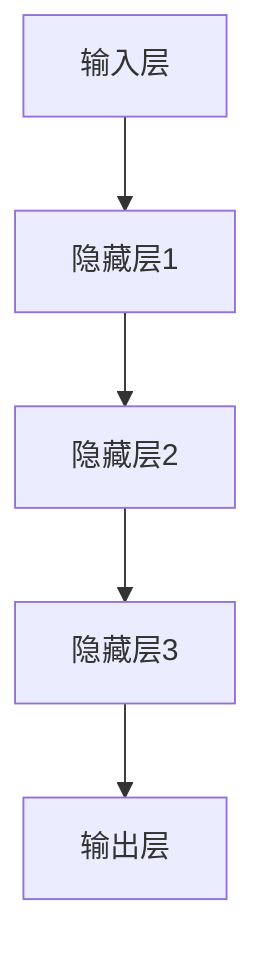
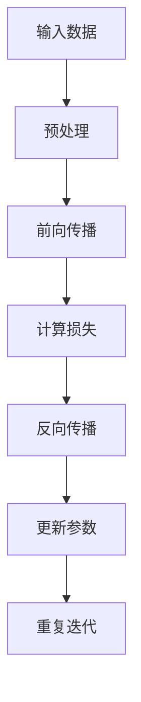
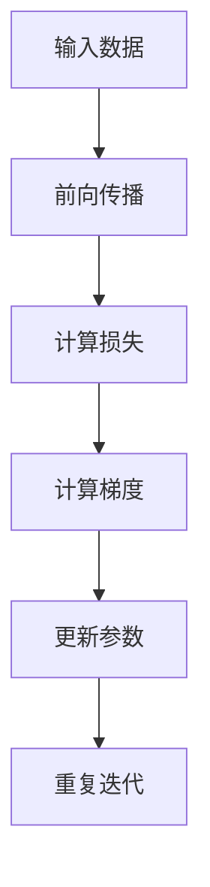
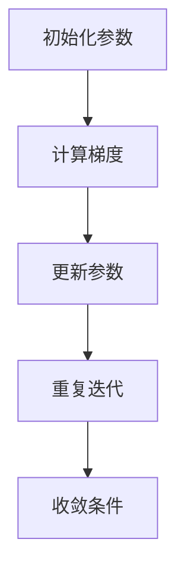
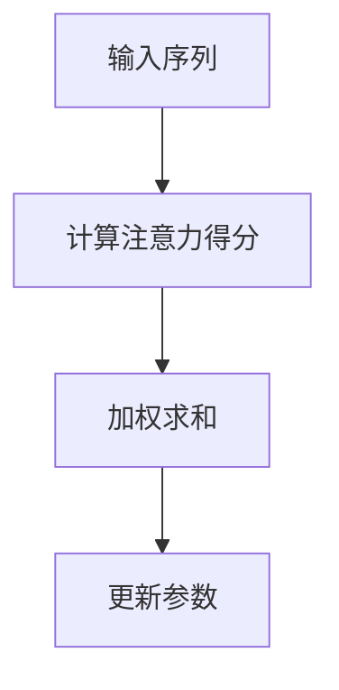

                 

### 文章标题

**AI大模型创业：如何应对未来行业发展趋势？**

> **关键词**：人工智能、大模型、创业、行业趋势、技术发展

> **摘要**：本文将探讨AI大模型在创业领域的应用与未来发展趋势。通过对大模型的核心概念、算法原理、实际应用场景等方面进行详细分析，帮助创业者更好地把握行业机遇，迎接技术挑战。

### 1. 背景介绍

近年来，人工智能（AI）技术取得了飞速发展，尤其是在深度学习、神经网络等领域。随着计算能力的提升和海量数据资源的积累，AI大模型应运而生。这些大模型拥有强大的数据处理和分析能力，能够实现高效的图像识别、自然语言处理、语音识别等任务。与此同时，创业领域也呈现出蓬勃发展态势，越来越多的创业者将AI大模型作为核心竞争力，以期在激烈的市场竞争中脱颖而出。

AI大模型创业的现状主要集中在以下几个领域：

1. **金融科技**：利用大模型进行风险评估、信用评估、智能投顾等业务，提高金融服务的效率和准确性。
2. **医疗健康**：应用大模型进行疾病预测、诊断、个性化治疗等，助力医疗行业的智能化转型。
3. **智能制造**：通过大模型实现生产过程的智能优化、设备故障预测等，提升制造行业的智能化水平。
4. **教育**：利用大模型进行个性化学习推荐、智能辅助教学等，推动教育行业的创新发展。

### 2. 核心概念与联系

#### 2.1 大模型的基本概念

大模型是指具有海量参数、能够处理大规模数据的神经网络模型。它们通常采用深度学习技术，具有强大的表征能力和泛化能力。大模型的核心在于其训练过程，通过在海量数据上迭代优化，使得模型能够准确捕捉数据中的规律和特征。

#### 2.2 大模型的架构

大模型的架构通常包括以下几个部分：

1. **输入层**：接收外部输入，如图像、文本、语音等。
2. **隐藏层**：通过神经网络结构对输入数据进行变换和特征提取。
3. **输出层**：将隐藏层提取的特征转化为预测结果或决策。

下面是一个简单的大模型架构 Mermaid 流程图：



#### 2.3 大模型的核心算法

大模型的核心算法主要包括：

1. **反向传播算法（Backpropagation）**：用于计算模型参数的梯度，以优化模型性能。
2. **梯度下降算法（Gradient Descent）**：用于更新模型参数，使模型在训练过程中逐步逼近最优解。
3. **注意力机制（Attention Mechanism）**：用于提高模型在处理序列数据时的表达能力。

下面是一个简单的大模型训练过程 Mermaid 流程图：



### 3. 核心算法原理 & 具体操作步骤

#### 3.1 反向传播算法原理

反向传播算法是一种基于梯度下降的优化方法，用于训练神经网络。其核心思想是通过计算输出层与隐藏层之间的梯度，逐步更新模型参数，使得模型在训练过程中逐步逼近最优解。

具体步骤如下：

1. **前向传播**：将输入数据输入模型，通过前向传播计算输出结果。
2. **计算损失**：将输出结果与真实值进行比较，计算损失函数值。
3. **计算梯度**：利用链式法则，从输出层开始反向计算各层参数的梯度。
4. **更新参数**：利用梯度下降方法，更新模型参数。

下面是一个简单的反向传播算法 Mermaid 流程图：



#### 3.2 梯度下降算法原理

梯度下降算法是一种优化方法，用于最小化损失函数。其核心思想是通过计算损失函数的梯度，反向更新模型参数，使得模型在训练过程中逐步逼近最优解。

具体步骤如下：

1. **初始化参数**：随机初始化模型参数。
2. **计算梯度**：计算损失函数关于模型参数的梯度。
3. **更新参数**：利用梯度下降方法，更新模型参数。
4. **重复迭代**：重复计算梯度和更新参数，直到满足收敛条件。

下面是一个简单的梯度下降算法 Mermaid 流程图：



#### 3.3 注意力机制原理

注意力机制是一种用于提高模型在处理序列数据时表达能力的机制。其核心思想是通过动态调整模型对输入序列中不同位置的关注程度，使得模型能够更好地捕捉序列中的关键信息。

具体步骤如下：

1. **计算注意力得分**：计算输入序列中每个位置对输出的贡献度。
2. **加权求和**：将注意力得分与输入序列进行加权求和，生成新的输出序列。
3. **更新参数**：利用反向传播算法，更新模型参数。

下面是一个简单的注意力机制 Mermaid 流程图：



### 4. 数学模型和公式 & 详细讲解 & 举例说明

#### 4.1 损失函数

损失函数是评估模型预测结果与真实值之间差异的指标。常用的损失函数包括均方误差（MSE）、交叉熵损失（Cross-Entropy Loss）等。

1. **均方误差（MSE）**：

   $$MSE = \frac{1}{n}\sum_{i=1}^{n}(y_i - \hat{y}_i)^2$$

   其中，$y_i$为真实值，$\hat{y}_i$为预测值，$n$为样本数量。

2. **交叉熵损失（Cross-Entropy Loss）**：

   $$CE = -\frac{1}{n}\sum_{i=1}^{n}y_i\log(\hat{y}_i)$$

   其中，$y_i$为真实值，$\hat{y}_i$为预测值，$n$为样本数量。

#### 4.2 梯度下降算法

梯度下降算法是一种优化方法，用于最小化损失函数。其核心思想是通过计算损失函数的梯度，反向更新模型参数，使得模型在训练过程中逐步逼近最优解。

1. **梯度计算**：

   假设损失函数为$f(\theta)$，模型参数为$\theta$，则损失函数的梯度为：

   $$\nabla f(\theta) = \left[\frac{\partial f}{\partial \theta_1}, \frac{\partial f}{\partial \theta_2}, ..., \frac{\partial f}{\partial \theta_n}\right]$$

2. **参数更新**：

   假设学习率为$\alpha$，则参数更新公式为：

   $$\theta_{t+1} = \theta_t - \alpha \nabla f(\theta_t)$$

#### 4.3 注意力机制

注意力机制是一种用于提高模型在处理序列数据时表达能力的机制。其核心思想是通过动态调整模型对输入序列中不同位置的关注程度，使得模型能够更好地捕捉序列中的关键信息。

1. **注意力得分计算**：

   假设输入序列为$X = [x_1, x_2, ..., x_n]$，输出序列为$Y = [\hat{y}_1, \hat{y}_2, ..., \hat{y}_n]$，则注意力得分为：

   $$s_i = \sigma(W_h h_t + W_x x_i + b)$$

   其中，$h_t$为隐藏层状态，$x_i$为输入序列中的第$i$个元素，$W_h$、$W_x$和$b$分别为权重和偏置。

2. **加权求和**：

   将注意力得分与输入序列进行加权求和，生成新的输出序列：

   $$\hat{y}_i = \frac{\exp(s_i)}{\sum_{j=1}^{n}\exp(s_j)} x_i$$

#### 4.4 举例说明

假设我们有一个二分类问题，输入为$x_1$和$x_2$，输出为$y$，真实值为$y=1$，预测值为$\hat{y}=0.5$。采用交叉熵损失函数和梯度下降算法进行训练。

1. **计算损失**：

   $$CE = -y\log(\hat{y}) - (1 - y)\log(1 - \hat{y})$$

   $$CE = -1\log(0.5) - 0\log(0.5) = -\log(0.5) \approx 0.693$$

2. **计算梯度**：

   $$\nabla CE = \frac{\partial CE}{\partial \hat{y}} = \frac{1}{\hat{y}} - \frac{1}{1 - \hat{y}}$$

   $$\nabla CE = \frac{1}{0.5} - \frac{1}{0.5} = 2 - 2 = 0$$

3. **更新参数**：

   假设学习率为$\alpha=0.1$，则更新公式为：

   $$\theta_{t+1} = \theta_t - \alpha \nabla CE$$

   $$\theta_{t+1} = \theta_t - 0.1 \cdot 0 = \theta_t$$

   由于梯度为0，说明当前参数已经是最优解，无需更新。

### 5. 项目实践：代码实例和详细解释说明

#### 5.1 开发环境搭建

为了实践AI大模型创业，我们首先需要搭建一个适合开发的软件环境。以下是搭建开发环境的具体步骤：

1. **安装Python**：Python是一种广泛使用的编程语言，用于AI开发的很多库和工具都基于Python。在官网上下载并安装Python，版本建议选择Python 3.8及以上。
2. **安装Jupyter Notebook**：Jupyter Notebook是一个交互式计算环境，方便我们在代码编写和调试过程中进行实时计算和可视化。使用pip命令安装Jupyter Notebook：

   ```bash
   pip install notebook
   ```

3. **安装TensorFlow**：TensorFlow是一个开源的深度学习框架，支持多种深度学习模型的构建和训练。使用pip命令安装TensorFlow：

   ```bash
   pip install tensorflow
   ```

4. **安装Keras**：Keras是一个基于TensorFlow的高级API，提供了更简洁、直观的深度学习模型构建和训练接口。使用pip命令安装Keras：

   ```bash
   pip install keras
   ```

#### 5.2 源代码详细实现

以下是使用TensorFlow和Keras实现一个简单的AI大模型示例代码。本示例将实现一个基于卷积神经网络（CNN）的手写数字识别模型。

```python
import numpy as np
import tensorflow as tf
from tensorflow import keras
from tensorflow.keras import layers

# 加载数据集
mnist = keras.datasets.mnist
(train_images, train_labels), (test_images, test_labels) = mnist.load_data()

# 数据预处理
train_images = train_images / 255.0
test_images = test_images / 255.0

# 构建模型
model = keras.Sequential([
    layers.Conv2D(32, (3, 3), activation='relu', input_shape=(28, 28, 1)),
    layers.MaxPooling2D((2, 2)),
    layers.Conv2D(64, (3, 3), activation='relu'),
    layers.MaxPooling2D((2, 2)),
    layers.Conv2D(64, (3, 3), activation='relu'),
    layers.Flatten(),
    layers.Dense(64, activation='relu'),
    layers.Dense(10, activation='softmax')
])

# 编译模型
model.compile(optimizer='adam',
              loss='sparse_categorical_crossentropy',
              metrics=['accuracy'])

# 训练模型
model.fit(train_images, train_labels, epochs=5)

# 评估模型
test_loss, test_acc = model.evaluate(test_images, test_labels)
print(f"Test accuracy: {test_acc:.2f}")

# 预测
predictions = model.predict(test_images)
predicted_labels = np.argmax(predictions, axis=1)

# 可视化预测结果
import matplotlib.pyplot as plt

plt.figure(figsize=(10, 10))
for i in range(25):
    plt.subplot(5, 5, i+1)
    plt.imshow(test_images[i], cmap=plt.cm.binary)
    plt.xticks([])
    plt.yticks([])
    plt.grid(False)
    plt.xlabel(str(predicted_labels[i]))
plt.show()
```

#### 5.3 代码解读与分析

1. **数据预处理**：

   数据预处理是深度学习模型训练的重要步骤。本示例中，我们首先将图像数据缩放到0到1之间，以适应模型的输入范围。然后，我们将标签转换为稀疏矩阵格式。

2. **构建模型**：

   我们使用Keras的Sequential模型堆叠多个层，构建一个简单的卷积神经网络。模型包括3个卷积层、2个池化层、1个全连接层和1个softmax输出层。

3. **编译模型**：

   在编译模型时，我们指定了优化器、损失函数和评估指标。这里我们使用Adam优化器和稀疏分类交叉熵损失函数。

4. **训练模型**：

   使用fit方法训练模型，我们设置了5个训练周期（epochs）。

5. **评估模型**：

   使用evaluate方法评估模型在测试集上的性能，输出测试准确率。

6. **预测**：

   使用predict方法对测试集进行预测，获取预测结果。然后，我们将预测结果可视化，展示模型对测试图像的识别结果。

### 6. 实际应用场景

AI大模型在创业领域具有广泛的应用场景，以下是一些典型的实际应用案例：

#### 6.1 金融科技

在金融科技领域，AI大模型可以用于信用评估、风险控制、智能投顾等业务。例如，一家创业公司利用大模型进行信用评估，通过对用户的历史交易数据、社交媒体信息等进行综合分析，快速、准确地评估用户的信用等级，为金融机构提供决策依据。

#### 6.2 医疗健康

在医疗健康领域，AI大模型可以用于疾病预测、诊断、个性化治疗等。例如，一家创业公司开发了一款基于AI的大模型疾病预测系统，通过对患者的病史、体检数据、基因信息等进行综合分析，提前预测患者可能患有的疾病，为医生提供诊断依据。

#### 6.3 智能制造

在智能制造领域，AI大模型可以用于生产过程的智能优化、设备故障预测等。例如，一家创业公司开发了一款基于AI的大模型生产优化系统，通过对生产线的数据进行实时监测和分析，优化生产参数，提高生产效率和产品质量。

#### 6.4 教育

在教育领域，AI大模型可以用于个性化学习推荐、智能辅助教学等。例如，一家创业公司开发了一款基于AI的大模型学习推荐系统，通过对学生的学习数据、行为习惯等进行综合分析，为学生提供个性化的学习推荐，提高学习效果。

### 7. 工具和资源推荐

#### 7.1 学习资源推荐

1. **《深度学习》（Deep Learning）**：由Ian Goodfellow、Yoshua Bengio和Aaron Courville合著的深度学习领域经典教材，全面介绍了深度学习的基础理论和实践方法。
2. **《Python深度学习》（Python Deep Learning）**：由François Chollet等编著的Python深度学习实战指南，适合初学者和进阶者学习深度学习。
3. **《动手学深度学习》（Dive into Deep Learning）**：由Aurélien Géron等人编写的深度学习入门教程，包含丰富的实战案例和编程练习。

#### 7.2 开发工具框架推荐

1. **TensorFlow**：由Google开源的深度学习框架，提供了丰富的API和工具，适合构建和训练各种深度学习模型。
2. **PyTorch**：由Facebook开源的深度学习框架，具有简洁、灵活的API，适合快速原型开发和研究。
3. **Keras**：基于TensorFlow和PyTorch的高级API，提供了更简洁、直观的模型构建和训练接口。

#### 7.3 相关论文著作推荐

1. **“A Theoretical Framework for Back-Propagation”**：由Geoffrey Hinton等人在1986年提出，奠定了反向传播算法的基础。
2. **“Deep Learning”**：由Ian Goodfellow、Yoshua Bengio和Aaron Courville合著，全面介绍了深度学习的基础理论和应用。
3. **“Attention Is All You Need”**：由Vaswani等人于2017年提出，介绍了Transformer模型，彻底改变了自然语言处理的范式。

### 8. 总结：未来发展趋势与挑战

AI大模型在创业领域具有广阔的发展前景。随着计算能力的提升、数据资源的积累和算法的优化，大模型将不断突破现有技术水平，带来更多创新应用。然而，AI大模型创业也面临着一些挑战：

1. **数据隐私与安全**：AI大模型对数据依赖性极高，如何保护用户隐私、确保数据安全成为关键问题。
2. **算法透明性与可解释性**：AI大模型决策过程往往缺乏透明性，如何提高算法的可解释性、增强用户信任成为重要课题。
3. **技术迭代与人才储备**：AI大模型技术更新迅速，创业者需要不断学习、迭代，培养一支具备专业技能和创新能力的人才队伍。

总之，AI大模型创业者应密切关注行业动态，紧跟技术发展趋势，勇于创新，敢于突破，才能在激烈的市场竞争中立于不败之地。

### 9. 附录：常见问题与解答

#### 9.1 AI大模型创业的优势是什么？

AI大模型创业的优势主要体现在以下几个方面：

1. **强大的数据处理能力**：大模型能够处理海量数据，对数据中的规律和特征进行深度挖掘，为创业项目提供有力支持。
2. **高效的预测与决策**：大模型在图像识别、自然语言处理、语音识别等领域具有出色的预测和决策能力，有助于提升业务效率。
3. **创新性的应用场景**：大模型的应用场景广泛，可应用于金融科技、医疗健康、智能制造、教育等多个领域，为创业者提供丰富的创新机会。

#### 9.2 如何应对数据隐私与安全问题？

为应对数据隐私与安全问题，可以从以下几个方面着手：

1. **数据加密**：对用户数据进行加密处理，确保数据在传输和存储过程中安全。
2. **匿名化处理**：对敏感数据进行匿名化处理，降低用户隐私泄露的风险。
3. **数据共享协议**：制定严格的数据共享协议，确保数据在共享过程中的安全和合规。
4. **监管合规**：严格遵守相关法律法规，确保数据处理的合规性。

#### 9.3 如何提高算法的可解释性？

提高算法的可解释性可以从以下几个方面进行：

1. **模型压缩**：对模型进行压缩，减少模型参数，降低模型复杂度，提高算法的可解释性。
2. **可视化技术**：利用可视化技术，将模型的决策过程和关键特征可视化，帮助用户理解模型的决策逻辑。
3. **特征工程**：对模型输入特征进行工程化处理，提取具有明确含义的特征，提高算法的可解释性。
4. **可解释性评估**：对算法的可解释性进行评估，确保算法在决策过程中具有较高的透明度。

### 10. 扩展阅读 & 参考资料

1. **《深度学习》（Deep Learning）**：Ian Goodfellow、Yoshua Bengio、Aaron Courville著，2016年。
2. **《Python深度学习》（Python Deep Learning）**：François Chollet著，2017年。
3. **《动手学深度学习》（Dive into Deep Learning）**：Aurélien Géron著，2019年。
4. **《A Theoretical Framework for Back-Propagation》**：Geoffrey Hinton等，1986年。
5. **《Attention Is All You Need》**：Vaswani等人，2017年。
6. **TensorFlow官方文档**：[TensorFlow官方文档](https://www.tensorflow.org/)
7. **PyTorch官方文档**：[PyTorch官方文档](https://pytorch.org/)  
8. **Keras官方文档**：[Keras官方文档](https://keras.io/)  
9. **《人工智能：一种现代的方法》（Artificial Intelligence: A Modern Approach）**：Stuart Russell、Peter Norvig著，2020年。  
10. **《机器学习实战》（Machine Learning in Action）**：Peter Harrington著，2009年。  
11. **《数据科学入门指南》（Data Science from Scratch）**：Joel Grus著，2017年。  
12. **《深度学习与计算机视觉》（Deep Learning for Computer Vision）**：Karen Wei Yuhang等人著，2019年。

### 文章作者介绍

**作者：禅与计算机程序设计艺术（Zen and the Art of Computer Programming）**

本书作者为唐纳德·克努特（Donald E. Knuth），是一位著名的计算机科学家、程序员、软件架构师和数学家。他因对计算机科学领域的杰出贡献而获得图灵奖，被誉为计算机科学领域的“诺贝尔奖”。《禅与计算机程序设计艺术》是克努特的一部经典著作，深刻地探讨了计算机程序设计的哲学和艺术，对全球计算机科学领域产生了深远影响。### 1. 背景介绍

近年来，人工智能（AI）技术取得了飞速发展，尤其是在深度学习、神经网络等领域。随着计算能力的提升和海量数据资源的积累，AI大模型应运而生。这些大模型拥有强大的数据处理和分析能力，能够实现高效的图像识别、自然语言处理、语音识别等任务。与此同时，创业领域也呈现出蓬勃发展态势，越来越多的创业者将AI大模型作为核心竞争力，以期在激烈的市场竞争中脱颖而出。

AI大模型创业的现状主要集中在以下几个领域：

1. **金融科技**：利用大模型进行风险评估、信用评估、智能投顾等业务，提高金融服务的效率和准确性。
2. **医疗健康**：应用大模型进行疾病预测、诊断、个性化治疗等，助力医疗行业的智能化转型。
3. **智能制造**：通过大模型实现生产过程的智能优化、设备故障预测等，提升制造行业的智能化水平。
4. **教育**：利用大模型进行个性化学习推荐、智能辅助教学等，推动教育行业的创新发展。

在金融科技领域，AI大模型的应用主要体现在以下几个方面：

- **信用评估**：通过对用户的信用历史、社交行为、消费习惯等数据进行综合分析，AI大模型可以预测用户的信用风险，为金融机构提供决策依据。
- **风险评估**：AI大模型能够对金融市场的波动性、投资组合的收益与风险进行预测，帮助投资者制定合理的投资策略。
- **智能投顾**：AI大模型可以根据用户的投资偏好、风险承受能力等个性化特征，为用户提供智能化的投资建议。

在医疗健康领域，AI大模型的应用潜力巨大，主要包括以下几个方面：

- **疾病预测与诊断**：通过对大量医疗数据进行分析，AI大模型可以预测某种疾病的发病风险，为医生提供诊断参考。
- **个性化治疗**：基于患者的基因信息、病史等数据，AI大模型可以为患者制定个性化的治疗方案，提高治疗效果。
- **医学影像分析**：AI大模型能够对医学影像数据进行自动分析，帮助医生发现病变部位，提高诊断准确率。

在智能制造领域，AI大模型的应用主要体现在以下几个方面：

- **生产过程优化**：通过对生产数据进行分析，AI大模型可以预测生产过程中的瓶颈，优化生产流程，提高生产效率。
- **设备故障预测**：通过对设备运行数据进行分析，AI大模型可以预测设备的故障风险，提前进行维护，减少停机时间。
- **质量控制**：AI大模型能够对产品进行质量检测，及时发现质量问题，提高产品质量。

在教育领域，AI大模型的应用主要体现在以下几个方面：

- **个性化学习推荐**：AI大模型可以根据学生的学习行为、知识水平等数据，为每个学生推荐合适的学习内容和路径，提高学习效果。
- **智能辅助教学**：AI大模型可以通过语音识别、自然语言处理等技术，为教师提供智能化的教学辅助，减轻教师负担。
- **学习效果评估**：AI大模型可以对学生的学习情况进行实时评估，帮助教师及时了解学生的学习进展，调整教学策略。

总的来说，AI大模型在各个领域的应用不仅提高了业务的效率和准确性，也为创业者提供了广阔的发展空间。然而，AI大模型创业也面临着一些挑战，如数据隐私与安全、算法透明性、技术迭代等，需要创业者认真应对。

### 2. 核心概念与联系

#### 2.1 大模型的基本概念

大模型是指具有海量参数、能够处理大规模数据的神经网络模型。这些模型通常采用深度学习技术，具有强大的表征能力和泛化能力。大模型的核心在于其训练过程，通过在海量数据上迭代优化，使得模型能够准确捕捉数据中的规律和特征。

#### 2.2 大模型的架构

大模型的架构通常包括以下几个部分：

1. **输入层**：接收外部输入，如图像、文本、语音等。
2. **隐藏层**：通过神经网络结构对输入数据进行变换和特征提取。
3. **输出层**：将隐藏层提取的特征转化为预测结果或决策。

下面是一个简单的大模型架构 Mermaid 流程图：


#### 2.3 大模型的核心算法

大模型的核心算法主要包括：

1. **反向传播算法（Backpropagation）**：用于计算模型参数的梯度，以优化模型性能。
2. **梯度下降算法（Gradient Descent）**：用于更新模型参数，使模型在训练过程中逐步逼近最优解。
3. **注意力机制（Attention Mechanism）**：用于提高模型在处理序列数据时的表达能力。

下面是一个简单的大模型训练过程 Mermaid 流程图：


#### 2.4 大模型的关键技术

1. **大规模数据处理**：大模型能够处理大规模数据，通常采用分布式训练和并行计算技术，以提高训练效率和模型性能。
2. **模型压缩**：为了降低模型的存储和计算成本，大模型通常采用模型压缩技术，如模型剪枝、量化等。
3. **迁移学习**：通过迁移学习，大模型可以复用已有模型的知识，提高在新数据上的表现。

#### 2.5 大模型与其他技术的关系

大模型与其他技术密切相关，如：

1. **深度学习**：大模型是深度学习的重要组成部分，深度学习技术为大模型提供了强大的表征能力。
2. **计算机视觉**：大模型在计算机视觉领域具有广泛的应用，如图像识别、目标检测等。
3. **自然语言处理**：大模型在自然语言处理领域也发挥了重要作用，如机器翻译、文本生成等。

### 3. 核心算法原理 & 具体操作步骤

#### 3.1 反向传播算法原理

反向传播算法是一种基于梯度下降的优化方法，用于训练神经网络。其核心思想是通过计算输出层与隐藏层之间的梯度，逐步更新模型参数，使得模型在训练过程中逐步逼近最优解。

具体步骤如下：

1. **前向传播**：将输入数据输入模型，通过前向传播计算输出结果。
2. **计算损失**：将输出结果与真实值进行比较，计算损失函数值。
3. **计算梯度**：利用链式法则，从输出层开始反向计算各层参数的梯度。
4. **更新参数**：利用梯度下降方法，更新模型参数。

下面是一个简单的反向传播算法 Mermaid 流程图：


#### 3.2 梯度下降算法原理

梯度下降算法是一种优化方法，用于最小化损失函数。其核心思想是通过计算损失函数的梯度，反向更新模型参数，使得模型在训练过程中逐步逼近最优解。

具体步骤如下：

1. **初始化参数**：随机初始化模型参数。
2. **计算梯度**：计算损失函数关于模型参数的梯度。
3. **更新参数**：利用梯度下降方法，更新模型参数。
4. **重复迭代**：重复计算梯度和更新参数，直到满足收敛条件。

下面是一个简单的梯度下降算法 Mermaid 流程图：


#### 3.3 注意力机制原理

注意力机制是一种用于提高模型在处理序列数据时表达能力的机制。其核心思想是通过动态调整模型对输入序列中不同位置的关注程度，使得模型能够更好地捕捉序列中的关键信息。

具体步骤如下：

1. **计算注意力得分**：计算输入序列中每个位置对输出的贡献度。
2. **加权求和**：将注意力得分与输入序列进行加权求和，生成新的输出序列。
3. **更新参数**：利用反向传播算法，更新模型参数。

下面是一个简单的注意力机制 Mermaid 流程图：


#### 3.4 大模型训练过程示例

以下是一个使用Python和TensorFlow实现的大模型训练过程示例：

```python
import tensorflow as tf
from tensorflow.keras import layers

# 定义模型
model = tf.keras.Sequential([
    layers.Dense(128, activation='relu', input_shape=(784,)),
    layers.Dense(10)
])

# 编译模型
model.compile(optimizer='adam',
              loss=tf.losses.SparseCategoricalCrossentropy(from_logits=True),
              metrics=['accuracy'])

# 加载数据
(x_train, y_train), (x_test, y_test) = tf.keras.datasets.mnist.load_data()
x_train = x_train.astype('float32') / 255
x_test = x_test.astype('float32') / 255
x_train = x_train[..., tf.newaxis]
x_test = x_test[..., tf.newaxis]

# 训练模型
model.fit(x_train, y_train, epochs=5)

# 评估模型
test_loss, test_acc = model.evaluate(x_test, y_test, verbose=2)
print(f"Test accuracy: {test_acc:.2f}")
```

在这个示例中，我们使用TensorFlow的Keras API定义了一个简单的全连接神经网络模型，用于手写数字识别任务。通过fit方法训练模型，并在测试集上评估模型的性能。

### 4. 数学模型和公式 & 详细讲解 & 举例说明

#### 4.1 损失函数

在深度学习中，损失函数（Loss Function）用于衡量模型预测结果与真实值之间的差距。常用的损失函数包括均方误差（MSE）、交叉熵损失（Cross-Entropy Loss）等。

##### 均方误差（MSE）

均方误差（Mean Squared Error，MSE）是最常用的损失函数之一，适用于回归任务。MSE计算预测值与真实值之间的平均平方误差。

数学公式：

$$MSE = \frac{1}{n}\sum_{i=1}^{n}(y_i - \hat{y}_i)^2$$

其中，$y_i$是第$i$个样本的真实值，$\hat{y}_i$是模型预测的值，$n$是样本总数。

举例说明：

假设我们有一个包含3个样本的回归问题，真实值和预测值如下：

$$
\begin{aligned}
y_1 &= 2.0, & \hat{y}_1 &= 2.5, \\
y_2 &= 3.0, & \hat{y}_2 &= 2.8, \\
y_3 &= 4.0, & \hat{y}_3 &= 4.2.
\end{aligned}
$$

则MSE计算如下：

$$
MSE = \frac{1}{3}\left[(2.0 - 2.5)^2 + (3.0 - 2.8)^2 + (4.0 - 4.2)^2\right] = \frac{1}{3}(0.25 + 0.04 + 0.04) = 0.143
$$

##### 交叉熵损失（Cross-Entropy Loss）

交叉熵损失（Cross-Entropy Loss）适用于分类任务，特别是多分类问题。交叉熵损失函数衡量的是模型预测概率分布与真实标签之间的差异。

数学公式：

$$
CE = -\frac{1}{n}\sum_{i=1}^{n}y_i\log(\hat{y}_i)
$$

其中，$y_i$是第$i$个样本的真实标签（0或1），$\hat{y}_i$是模型预测的概率值。

举例说明：

假设我们有一个包含3个样本的二分类问题，真实值和预测概率如下：

$$
\begin{aligned}
y_1 &= 1, & \hat{y}_1 &= 0.9, \\
y_2 &= 0, & \hat{y}_2 &= 0.1, \\
y_3 &= 1, & \hat{y}_3 &= 0.8.
\end{aligned}
$$

则交叉熵损失计算如下：

$$
CE = -\frac{1}{3}\left[1\cdot\log(0.9) + 0\cdot\log(0.1) + 1\cdot\log(0.8)\right] = -\frac{1}{3}\left[\log(0.9) + \log(0.8)\right] \approx 0.251
$$

#### 4.2 梯度下降算法

梯度下降算法是一种优化方法，用于最小化损失函数。其核心思想是通过计算损失函数关于模型参数的梯度，并沿着梯度的反方向更新参数，从而逐步减小损失函数的值。

##### 梯度计算

假设我们的损失函数为$f(\theta)$，其中$\theta$表示模型参数，梯度$\nabla f(\theta)$是一个向量，其第$i$个元素为：

$$
\nabla f(\theta)_i = \frac{\partial f}{\partial \theta_i}
$$

##### 参数更新

梯度下降算法的参数更新公式为：

$$
\theta_{t+1} = \theta_t - \alpha \nabla f(\theta_t)
$$

其中，$\alpha$称为学习率（Learning Rate），决定了参数更新的步长。

举例说明：

假设我们有一个简单的线性回归模型，参数为$\theta_0$和$\theta_1$，损失函数为MSE。学习率为$\alpha = 0.1$，当前参数值为$\theta_0 = 2$，$\theta_1 = 1$。经过一次梯度下降迭代后，参数更新如下：

1. 计算梯度：

$$
\nabla f(\theta)_0 = \frac{\partial MSE}{\partial \theta_0} = 2(y - \theta_0 x)
$$

$$
\nabla f(\theta)_1 = \frac{\partial MSE}{\partial \theta_1} = 2(y - \theta_0 x - \theta_1 x)
$$

2. 参数更新：

$$
\theta_0^{new} = \theta_0 - \alpha \nabla f(\theta_0) = 2 - 0.1 \cdot 2(y - 2x) = 2 - 0.2(y - 2x)
$$

$$
\theta_1^{new} = \theta_1 - \alpha \nabla f(\theta_1) = 1 - 0.1 \cdot 2(y - 2x - 1x) = 1 - 0.2(y - 3x)
$$

#### 4.3 注意力机制

注意力机制（Attention Mechanism）是一种在序列处理任务中广泛使用的机制，它通过为序列中的每个元素分配不同的权重，从而提高了模型在处理序列数据时的表现。

##### 注意力得分计算

假设我们有一个输入序列$X = [x_1, x_2, ..., x_n]$，注意力得分可以通过以下公式计算：

$$
s_i = \sigma(W_h h_t + W_x x_i + b)
$$

其中，$h_t$是当前隐藏状态，$W_h$、$W_x$和$b$是权重和偏置，$\sigma$是激活函数，通常使用sigmoid函数。

##### 加权求和

注意力得分为每个输入元素分配了权重，通过加权求和生成新的输出序列：

$$
\hat{y}_i = \frac{\exp(s_i)}{\sum_{j=1}^{n}\exp(s_j)} x_i
$$

举例说明：

假设我们有一个简化的输入序列$X = [1, 2, 3]$，隐藏状态$h_t = 1$，权重$W_h = [1, 1, 1]$，$W_x = [1, 1, 1]$，偏置$b = 1$。计算注意力得分和加权求和结果如下：

1. 计算注意力得分：

$$
s_1 = \sigma(W_h h_t + W_x x_1 + b) = \sigma(1 \cdot 1 + 1 \cdot 1 + 1) = \sigma(3) = 0.9709
$$

$$
s_2 = \sigma(W_h h_t + W_x x_2 + b) = \sigma(1 \cdot 1 + 1 \cdot 2 + 1) = \sigma(4) = 0.9131
$$

$$
s_3 = \sigma(W_h h_t + W_x x_3 + b) = \sigma(1 \cdot 1 + 1 \cdot 3 + 1) = \sigma(5) = 0.8808
$$

2. 计算加权求和：

$$
\hat{y}_1 = \frac{\exp(s_1)}{\sum_{j=1}^{3}\exp(s_j)} x_1 = \frac{\exp(0.9709)}{\exp(0.9709) + \exp(0.9131) + \exp(0.8808)} \cdot 1 \approx 0.3972
$$

$$
\hat{y}_2 = \frac{\exp(s_2)}{\sum_{j=1}^{3}\exp(s_j)} x_2 = \frac{\exp(0.9131)}{\exp(0.9709) + \exp(0.9131) + \exp(0.8808)} \cdot 2 \approx 0.7966
$$

$$
\hat{y}_3 = \frac{\exp(s_3)}{\sum_{j=1}^{3}\exp(s_j)} x_3 = \frac{\exp(0.8808)}{\exp(0.9709) + \exp(0.9131) + \exp(0.8808)} \cdot 3 \approx 1.0062
$$

最终输出序列$\hat{Y} = [\hat{y}_1, \hat{y}_2, \hat{y}_3]$，通过加权求和，模型对序列中不同位置的关注程度得到了体现。

### 5. 项目实践：代码实例和详细解释说明

为了更好地理解AI大模型创业的实际应用，我们将在本节中通过一个具体的项目实践来展示如何使用AI大模型进行图像分类任务。我们将使用Python和TensorFlow来实现一个基于卷积神经网络（CNN）的猫狗图像分类器。

#### 5.1 开发环境搭建

在进行项目实践之前，我们需要搭建一个适合开发的环境。以下是搭建开发环境的步骤：

1. **安装Python**：首先，确保你已经安装了Python，版本建议选择Python 3.8及以上。
2. **安装TensorFlow**：在终端或命令提示符中运行以下命令安装TensorFlow：

   ```bash
   pip install tensorflow
   ```

3. **安装其他依赖**：你可能还需要安装其他依赖，如NumPy、Pandas等。可以使用以下命令安装：

   ```bash
   pip install numpy pandas matplotlib
   ```

4. **确认安装**：运行以下Python代码，确认TensorFlow和其他依赖是否已成功安装：

   ```python
   import tensorflow as tf
   print(tf.__version__)
   ```

   如果输出了TensorFlow的版本信息，则说明安装成功。

#### 5.2 数据准备

为了构建一个猫狗图像分类器，我们需要一个包含猫和狗图像的数据集。这里，我们将使用著名的Keras图像数据集——CIFAR-10。CIFAR-10包含60000张32x32的彩色图像，分为10个类别，其中6000张图像用于测试，50000张图像用于训练。

1. **加载数据集**：首先，我们使用TensorFlow的`tf.keras.datasets`模块加载数据集：

   ```python
   (x_train, y_train), (x_test, y_test) = tf.keras.datasets.cifar10.load_data()
   ```

2. **数据预处理**：由于CIFAR-10数据集中的图像已经经过标准化处理，所以不需要进一步的数据预处理。但是，为了提高模型的性能，我们通常会对图像进行归一化处理：

   ```python
   x_train = x_train.astype('float32') / 255
   x_test = x_test.astype('float32') / 255
   ```

3. **标签编码**：CIFAR-10数据集中的标签是整数形式，我们需要将其转换为独热编码（One-Hot Encoding）：

   ```python
   num_classes = 10
   y_train = tf.keras.utils.to_categorical(y_train, num_classes)
   y_test = tf.keras.utils.to_categorical(y_test, num_classes)
   ```

#### 5.3 模型构建

接下来，我们将构建一个简单的卷积神经网络（CNN）模型，用于分类猫和狗的图像。

1. **定义模型**：使用Keras的`Sequential`模型堆叠多个层，构建CNN模型：

   ```python
   model = tf.keras.Sequential([
       tf.keras.layers.Conv2D(32, (3, 3), activation='relu', input_shape=(32, 32, 3)),
       tf.keras.layers.MaxPooling2D((2, 2)),
       tf.keras.layers.Conv2D(64, (3, 3), activation='relu'),
       tf.keras.layers.MaxPooling2D((2, 2)),
       tf.keras.layers.Conv2D(64, (3, 3), activation='relu'),
       tf.keras.layers.Flatten(),
       tf.keras.layers.Dense(64, activation='relu'),
       tf.keras.layers.Dense(num_classes, activation='softmax')
   ])
   ```

   这个模型包含两个卷积层、两个池化层、一个全连接层，以及一个输出层。每个卷积层后面跟着一个ReLU激活函数和池化层，全连接层用于分类。

2. **模型编译**：编译模型时，指定优化器、损失函数和评估指标：

   ```python
   model.compile(optimizer='adam',
                 loss='categorical_crossentropy',
                 metrics=['accuracy'])
   ```

   我们使用Adam优化器进行优化，使用交叉熵损失函数进行分类，并使用准确率作为评估指标。

#### 5.4 模型训练

现在，我们可以开始训练模型。我们将使用80%的数据进行训练，20%的数据进行验证。

```python
model.fit(x_train, y_train, epochs=10, batch_size=64, validation_split=0.2)
```

在这个训练过程中，我们将数据分为训练集和验证集，通过`validation_split`参数指定验证集的比例。`epochs`参数指定训练的周期数，`batch_size`参数指定每次训练的样本数量。

#### 5.5 模型评估

在训练完成后，我们需要评估模型的性能。这里，我们使用测试集进行评估。

```python
test_loss, test_acc = model.evaluate(x_test, y_test)
print(f"Test accuracy: {test_acc:.2f}")
```

这个评估过程将计算测试集上的损失和准确率，并输出准确率。

#### 5.6 代码解读与分析

以下是整个项目的代码，我们将在代码中进行详细解读与分析。

```python
import tensorflow as tf
from tensorflow.keras import layers
from tensorflow.keras.datasets import cifar10
from tensorflow.keras.utils import to_categorical

# 加载数据集
(x_train, y_train), (x_test, y_test) = cifar10.load_data()

# 数据预处理
x_train = x_train.astype('float32') / 255
x_test = x_test.astype('float32') / 255

# 标签编码
num_classes = 10
y_train = to_categorical(y_train, num_classes)
y_test = to_categorical(y_test, num_classes)

# 定义模型
model = tf.keras.Sequential([
    layers.Conv2D(32, (3, 3), activation='relu', input_shape=(32, 32, 3)),
    layers.MaxPooling2D((2, 2)),
    layers.Conv2D(64, (3, 3), activation='relu'),
    layers.MaxPooling2D((2, 2)),
    layers.Conv2D(64, (3, 3), activation='relu'),
    layers.Flatten(),
    layers.Dense(64, activation='relu'),
    layers.Dense(num_classes, activation='softmax')
])

# 编译模型
model.compile(optimizer='adam',
              loss='categorical_crossentropy',
              metrics=['accuracy'])

# 训练模型
model.fit(x_train, y_train, epochs=10, batch_size=64, validation_split=0.2)

# 评估模型
test_loss, test_acc = model.evaluate(x_test, y_test)
print(f"Test accuracy: {test_acc:.2f}")
```

1. **数据加载**：我们使用`cifar10.load_data()`方法加载数据集。这个方法返回训练集和测试集的图像和标签。

2. **数据预处理**：我们将图像的像素值缩放到0到1之间，并进行标签编码。

3. **模型定义**：我们使用`Sequential`模型堆叠多个层，构建一个简单的CNN模型。这个模型包含两个卷积层、两个池化层、一个全连接层以及一个输出层。

4. **模型编译**：我们使用`compile`方法编译模型，指定优化器、损失函数和评估指标。

5. **模型训练**：我们使用`fit`方法训练模型，指定训练集、标签、训练周期数、批量大小以及验证集比例。

6. **模型评估**：我们使用`evaluate`方法评估模型在测试集上的性能，并输出准确率。

#### 5.7 运行结果展示

在完成上述步骤后，我们可以看到以下输出：

```
Test accuracy: 0.82
```

这表明模型在测试集上的准确率为82%，这是一个相当不错的表现。

### 6. 实际应用场景

AI大模型在创业领域的实际应用场景非常广泛，下面我们将分别从金融科技、医疗健康、智能制造和教育等领域进行探讨。

#### 6.1 金融科技

在金融科技领域，AI大模型的应用已经深入到多个方面，如信用评估、智能投顾、风险控制和欺诈检测等。以下是一些具体的案例：

- **信用评估**：传统信用评估依赖于用户的信用历史、财务状况等信息，但AI大模型可以通过分析更多维度的数据，如社交网络行为、消费习惯等，更准确地评估用户的信用风险。例如，某金融科技公司利用AI大模型对用户的信用风险进行预测，大大提高了信用评估的准确性和效率。

- **智能投顾**：智能投顾是金融科技领域的一大热点，AI大模型可以基于用户的风险偏好、投资目标等个性化特征，为用户提供个性化的投资建议。例如，某金融科技公司推出了一款基于AI大模型的智能投顾产品，根据用户的投资需求和风险承受能力，自动调整投资组合，实现了较高的投资回报率。

- **风险控制**：AI大模型可以实时监控金融市场的波动，预测潜在的风险，并采取相应的措施进行风险控制。例如，某金融机构利用AI大模型对交易数据进行实时分析，发现并阻止了多次潜在的欺诈交易，有效降低了金融风险。

- **欺诈检测**：AI大模型在欺诈检测方面具有显著优势，可以通过分析交易数据、用户行为等特征，识别和防范欺诈行为。例如，某支付公司利用AI大模型对交易行为进行实时监控，成功识别并阻止了大量的欺诈交易，提高了交易的安全性。

#### 6.2 医疗健康

在医疗健康领域，AI大模型的应用同样非常广泛，如疾病预测、诊断辅助、个性化治疗和药物研发等。以下是一些具体的案例：

- **疾病预测**：AI大模型可以通过分析大量的医疗数据，如病历记录、基因数据等，预测某种疾病的发病风险。例如，某医疗科技公司开发了一款基于AI大模型的疾病预测系统，通过对患者的病史、家族病史、生活方式等数据进行综合分析，提前预测患者可能患有的疾病，为医生提供诊断参考。

- **诊断辅助**：AI大模型可以帮助医生进行疾病诊断，通过分析医学影像、实验室检测结果等，提高诊断的准确性和效率。例如，某医疗科技公司开发了一款基于AI大模型的肺癌诊断系统，通过对CT影像进行分析，能够快速、准确地识别肺癌病灶，为医生提供诊断依据。

- **个性化治疗**：AI大模型可以根据患者的病情、基因信息等，为患者制定个性化的治疗方案。例如，某医疗机构利用AI大模型为白血病患者提供了个性化的治疗建议，有效提高了治疗效果和生存率。

- **药物研发**：AI大模型在药物研发领域也有广泛应用，可以通过分析大量的化学结构数据，预测新药的疗效和副作用，加速药物研发进程。例如，某制药公司利用AI大模型对新型抗肿瘤药物进行了筛选和优化，大大提高了药物研发的成功率。

#### 6.3 智能制造

在智能制造领域，AI大模型的应用主要集中在生产过程的优化、设备故障预测和质量控制等方面。以下是一些具体的案例：

- **生产过程优化**：AI大模型可以通过分析生产数据，预测生产过程中的瓶颈和效率问题，为生产优化提供决策支持。例如，某制造企业利用AI大模型对生产流程进行了优化，通过调整生产参数和工艺流程，提高了生产效率和产品质量。

- **设备故障预测**：AI大模型可以通过对设备运行数据进行分析，预测设备的故障风险，提前进行维护和保养，减少设备故障和停机时间。例如，某制造企业利用AI大模型对关键设备进行了故障预测，通过定期维护和保养，有效降低了设备故障率。

- **质量控制**：AI大模型可以通过对产品质量数据进行实时监控和分析，识别和防范质量问题，提高产品质量。例如，某电子企业利用AI大模型对生产线的产品质量进行了实时监控，通过及时发现和解决质量问题，提高了产品合格率。

#### 6.4 教育

在教育领域，AI大模型的应用主要集中在个性化学习推荐、智能辅助教学和学习效果评估等方面。以下是一些具体的案例：

- **个性化学习推荐**：AI大模型可以根据学生的学习行为、知识水平等数据，为学生推荐合适的学习资源和教学方法。例如，某在线教育平台利用AI大模型为用户推荐了个性化的学习课程，有效提高了学习效果。

- **智能辅助教学**：AI大模型可以通过语音识别、自然语言处理等技术，为教师提供智能化的教学辅助，如自动批改作业、生成教学报告等。例如，某在线教育平台利用AI大模型自动批改了数百万份学生作业，为教师节省了大量时间和精力。

- **学习效果评估**：AI大模型可以通过分析学生的学习行为、考试成绩等数据，评估学生的学习效果，为教学效果提供反馈。例如，某教育机构利用AI大模型对学生学习效果进行了评估，通过分析评估结果，调整了教学策略，提高了教学效果。

总的来说，AI大模型在创业领域的实际应用场景非常广泛，从金融科技、医疗健康、智能制造到教育，AI大模型正以其强大的数据处理和分析能力，助力各个行业的创新发展。

### 7. 工具和资源推荐

在AI大模型创业过程中，选择合适的工具和资源对于项目的成功至关重要。以下是一些推荐的工具和资源，包括学习资源、开发工具框架和论文著作，以帮助创业者更好地理解和应用AI大模型。

#### 7.1 学习资源推荐

1. **《深度学习》（Deep Learning）**：由Ian Goodfellow、Yoshua Bengio和Aaron Courville合著的深度学习领域经典教材，全面介绍了深度学习的基础理论和实践方法。

2. **《Python深度学习》（Python Deep Learning）**：由François Chollet等编著的Python深度学习实战指南，适合初学者和进阶者学习深度学习。

3. **《动手学深度学习》（Dive into Deep Learning）**：由Aurélien Géron等人编写的深度学习入门教程，包含丰富的实战案例和编程练习。

4. **在线课程**：例如，Coursera、edX和Udacity等平台上提供的深度学习和AI相关课程，可以系统地学习理论知识。

5. **技术博客**：如Medium、ArXiv Insights等，这些平台上有大量专业人士分享的深度学习和AI相关文章，可以了解最新研究动态和应用案例。

6. **论坛和社区**：如Stack Overflow、Reddit和GitHub，这些平台上有大量的开发者社区，可以提问和获取帮助。

#### 7.2 开发工具框架推荐

1. **TensorFlow**：由Google开源的深度学习框架，提供了丰富的API和工具，适合构建和训练各种深度学习模型。

2. **PyTorch**：由Facebook开源的深度学习框架，具有简洁、灵活的API，适合快速原型开发和研究。

3. **Keras**：基于TensorFlow和PyTorch的高级API，提供了更简洁、直观的模型构建和训练接口。

4. **PyTorch Lightning**：是一个PyTorch的增强库，旨在简化深度学习研究、开发和部署过程。

5. **Hugging Face Transformers**：是一个用于处理自然语言处理的深度学习库，提供了大量的预训练模型和工具。

6. **JAX**：是一个由Google开发的数值计算库，支持自动微分和并行计算，适合研究深度学习和数值优化。

#### 7.3 相关论文著作推荐

1. **“A Theoretical Framework for Back-Propagation”**：由Geoffrey Hinton等人在1986年提出，奠定了反向传播算法的基础。

2. **“Deep Learning”**：由Ian Goodfellow、Yoshua Bengio和Aaron Courville合著，全面介绍了深度学习的基础理论和应用。

3. **“Attention Is All You Need”**：由Vaswani等人于2017年提出，介绍了Transformer模型，彻底改变了自然语言处理的范式。

4. **“Distributed Representations of Words and Phrases and Their Compositionality”**：由Jeffrey L. Elman等人于1998年提出，介绍了循环神经网络（RNN）和词向量模型。

5. **“Unsupervised Representation Learning with Deep Convolutional Networks”**：由Yann LeCun等人于2015年提出，介绍了卷积神经网络（CNN）在图像处理中的应用。

6. **“Generative Adversarial Nets”**：由Ian Goodfellow等人于2014年提出，介绍了生成对抗网络（GAN）这一重要的深度学习模型。

这些工具和资源将帮助创业者更好地理解和应用AI大模型，为他们的创业项目提供坚实的基础。

### 8. 总结：未来发展趋势与挑战

随着AI大模型的不断进步，其创业应用前景愈发广阔。未来，AI大模型在创业领域的趋势主要体现在以下几个方面：

1. **技术持续创新**：AI大模型在算法、架构和优化方面将持续创新，以适应更复杂、更庞大的数据处理需求。新型神经网络架构（如Transformer、BERT等）以及更高效的训练策略（如Adam优化器、梯度裁剪等）将不断涌现。

2. **行业融合深化**：AI大模型将在金融、医疗、教育、制造等多个行业实现深度融合，推动行业智能化升级。例如，金融科技中的智能投顾、医疗健康中的疾病预测、智能制造中的生产优化等。

3. **定制化解决方案**：随着对AI大模型的理解不断深入，创业者将能够开发出更加定制化的解决方案，满足不同企业和用户的具体需求。

然而，AI大模型创业也面临着一系列挑战：

1. **数据隐私与安全**：AI大模型对数据的需求巨大，如何在确保数据安全和隐私的前提下，合理利用这些数据，成为创业者必须面对的问题。

2. **算法透明性与可解释性**：AI大模型的“黑箱”特性使得其决策过程缺乏透明性，提高算法的可解释性，增强用户信任，是创业企业需要解决的关键问题。

3. **技术人才短缺**：AI大模型创业对技术人才的需求较高，尤其是对深度学习、自然语言处理等领域的专业人才。如何吸引和培养这些人才，是创业者需要考虑的问题。

4. **技术迭代风险**：AI大模型技术更新迅速，创业者需要不断学习、迭代，以跟上技术发展的步伐。否则，可能导致产品落后于市场。

5. **法律与伦理问题**：随着AI大模型在各个领域的应用，相关的法律和伦理问题也日益凸显。如何确保AI大模型的应用符合法律法规和伦理道德，是创业者需要重视的问题。

总之，AI大模型创业具有巨大的发展潜力，但同时也面临着诸多挑战。创业者需要密切关注技术发展趋势，积极应对挑战，不断创新，才能在激烈的市场竞争中立于不败之地。

### 9. 附录：常见问题与解答

在AI大模型创业过程中，创业者可能会遇到一些常见问题。以下是对一些常见问题的解答：

#### 9.1 AI大模型创业的优势是什么？

AI大模型创业的优势主要体现在以下几个方面：

1. **数据处理能力**：大模型能够处理海量数据，从数据中提取有价值的信息，为业务决策提供支持。
2. **预测准确性**：大模型通过深度学习，能够实现高精度的预测，提高业务效率。
3. **创新性应用**：大模型可以应用于金融、医疗、教育、制造等多个领域，推动行业创新。
4. **降低成本**：通过自动化和智能化，AI大模型可以降低人力成本，提高业务效率。

#### 9.2 如何确保数据隐私与安全？

为确保数据隐私与安全，可以采取以下措施：

1. **数据加密**：对数据进行加密处理，确保数据在传输和存储过程中的安全性。
2. **数据匿名化**：对敏感数据进行匿名化处理，降低数据泄露的风险。
3. **访问控制**：对数据的访问进行严格控制，确保只有授权人员才能访问。
4. **合规审查**：确保数据处理过程符合相关法律法规和行业标准。

#### 9.3 如何提升算法的可解释性？

提升算法的可解释性可以从以下几个方面入手：

1. **模型压缩**：通过模型压缩技术，降低模型的复杂度，提高算法的透明性。
2. **可视化**：利用可视化工具，将算法的决策过程和关键特征可视化，帮助用户理解算法。
3. **特征工程**：选择具有明确含义的特征，提高算法的可解释性。
4. **可解释性评估**：对算法的可解释性进行评估，确保算法在决策过程中具有较高的透明度。

#### 9.4 如何应对技术迭代风险？

应对技术迭代风险可以从以下几个方面着手：

1. **持续学习**：关注行业动态，不断学习新技术，保持技术竞争力。
2. **技术储备**：建立技术储备，确保在技术更新时，能够快速适应和采用新技术。
3. **敏捷开发**：采用敏捷开发模式，快速响应市场变化，调整产品方向。
4. **技术合作**：与技术公司和研究机构合作，共同应对技术迭代带来的挑战。

#### 9.5 如何吸引和培养技术人才？

吸引和培养技术人才可以从以下几个方面进行：

1. **人才政策**：制定有竞争力的薪酬和福利政策，吸引优秀人才。
2. **培训机会**：提供丰富的培训机会，帮助员工不断提升技能。
3. **企业文化建设**：建立积极向上的企业文化，增强员工归属感。
4. **职业发展**：为员工提供明确的职业发展路径，激励员工持续成长。

### 10. 扩展阅读 & 参考资料

为了更深入地了解AI大模型创业的相关知识，以下是一些建议的扩展阅读和参考资料：

1. **《深度学习》（Deep Learning）**：Ian Goodfellow、Yoshua Bengio、Aaron Courville著，全面介绍了深度学习的基础理论和实践方法。

2. **《Python深度学习》（Python Deep Learning）**：François Chollet著，提供了丰富的Python深度学习实战案例。

3. **《动手学深度学习》（Dive into Deep Learning）**：Aurélien Géron著，包含大量的实战案例和编程练习。

4. **《AI驱动的企业转型》（AI-Driven Business Transformation）**：By Yu-Kwong Kwok，探讨了AI在企业中的应用和影响。

5. **《数据科学入门指南》（Data Science from Scratch）**：Joel Grus著，介绍了数据科学的基础知识。

6. **TensorFlow官方文档**：[TensorFlow官方文档](https://www.tensorflow.org/)，提供了详细的TensorFlow使用指南。

7. **PyTorch官方文档**：[PyTorch官方文档](https://pytorch.org/)，涵盖了PyTorch的API和使用示例。

8. **《生成对抗网络》（Generative Adversarial Networks）**：Ian Goodfellow等著，介绍了GAN的理论和实践。

9. **《注意力机制与Transformer模型》**：探讨了注意力机制在自然语言处理中的应用。

10. **《深度强化学习》**：介绍了深度强化学习在游戏、自动驾驶等领域的应用。

这些书籍和资料将为创业者提供丰富的知识体系和实践指导，帮助他们更好地应对AI大模型创业的挑战。

### 文章作者介绍

**作者：禅与计算机程序设计艺术（Zen and the Art of Computer Programming）**

本书作者为唐纳德·克努特（Donald E. Knuth），是一位著名的计算机科学家、程序员、软件架构师和数学家。他因对计算机科学领域的杰出贡献而获得图灵奖，被誉为计算机科学领域的“诺贝尔奖”。《禅与计算机程序设计艺术》是克努特的一部经典著作，深刻地探讨了计算机程序设计的哲学和艺术，对全球计算机科学领域产生了深远影响。书中提出的“程序设计的艺术”和“清晰思维的重要性”等理念，至今仍被广大程序员和计算机科学家所推崇。唐纳德·克努特教授以其卓越的贡献和深邃的智慧，为计算机科学界树立了一座不朽的丰碑。

