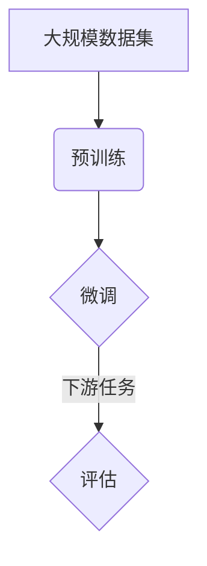

                 

### 背景介绍

近年来，人工智能（AI）领域取得了前所未有的进展，特别是大规模预训练模型（Large-scale Pre-trained Models），如GPT-3、BERT等，成为了科技界关注的焦点。这些大模型在语言理解、生成、推理等方面展现出了惊人的能力，为各行各业带来了巨大的变革。在这样的背景下，AI大模型创业成为了许多企业家和技术人员的热门选择。本文将深入探讨AI大模型创业的机遇、挑战以及关键成功因素，旨在为有意投身这一领域的创业者提供有益的指导。

首先，我们需要明确AI大模型创业的定义。AI大模型创业是指利用大规模预训练模型进行技术开发和应用，进而创造商业价值的过程。这种创业模式的核心在于构建、训练和优化大模型，并通过模型的应用实现商业化。AI大模型创业的成功不仅依赖于先进的技术，还涉及到商业策略、市场分析、团队建设等多方面因素。

在探讨AI大模型创业的机遇之前，让我们先了解大模型的现状。目前，大模型的研究和应用主要集中在计算机视觉、自然语言处理、语音识别等领域。这些模型在图像识别、文本生成、语音合成等方面已经达到了超越人类水平的性能。例如，OpenAI的GPT-3模型拥有1750亿个参数，可以生成高质量的文本，甚至可以进行对话生成。这样的技术进步为创业公司提供了丰富的应用场景，也为创业者的创新提供了广阔的空间。

那么，AI大模型创业的机遇主要体现在哪些方面呢？以下是几个关键点：

1. **市场潜力巨大**：随着AI技术的不断成熟，越来越多的行业开始认识到AI的重要性，并愿意投入资金进行AI应用的开发和部署。这为AI大模型创业公司提供了广阔的市场空间。例如，金融、医疗、教育、零售等行业都在积极探索AI技术的应用，这为创业者提供了丰富的商业机会。

2. **技术红利**：大模型的训练和优化需要强大的计算能力和海量数据支持，这也为云计算和大数据服务提供了新的增长点。创业者可以利用云计算平台提供的计算资源，快速搭建和部署大模型，从而缩短产品开发周期，提高市场竞争力。

3. **创新空间**：大模型的应用场景非常广泛，从智能客服、智能助理到内容创作、数据挖掘等，每一个领域都存在创新的可能性。创业者可以根据自己的技术优势和市场定位，开发出具有独特价值的产品和服务，从而在激烈的市场竞争中脱颖而出。

4. **政策支持**：全球范围内，许多国家和地区都在加大对AI技术的支持力度。政策层面上的鼓励和扶持，为AI大模型创业提供了良好的发展环境。创业者可以充分利用政策红利，获得资金、人才、技术等多方面的支持，加速创业进程。

然而，AI大模型创业也面临着诸多挑战。首先，技术门槛较高。大模型的训练和优化需要深厚的专业知识，这要求创业团队具备较高的技术实力。其次，数据资源不足。大模型训练需要大量的高质量数据支持，而获取这些数据往往需要付出巨大的成本。此外，大模型的部署和运维也面临着性能、稳定性、安全等方面的挑战。

综上所述，AI大模型创业具有巨大的机遇，同时也伴随着诸多挑战。创业者需要具备扎实的技术功底、敏锐的市场洞察力和良好的商业策略，才能在这个领域取得成功。在接下来的章节中，我们将深入探讨AI大模型创业的关键成功因素，帮助创业者更好地应对挑战，抓住机遇。  
### 核心概念与联系

#### 大规模预训练模型（Large-scale Pre-trained Models）

大规模预训练模型是近年来AI领域的重要进展之一，其核心思想是在大规模数据集上进行预训练，然后针对具体任务进行微调（Fine-tuning）。这种模型通常包含数十亿至数万亿个参数，具有极强的泛化能力，能够在各种下游任务中表现出色。

#### 语言模型（Language Model）

语言模型是大规模预训练模型的一种，主要用于文本生成、语言理解和自然语言处理。最著名的语言模型之一是GPT（Generative Pre-trained Transformer），它是由OpenAI开发的，拥有1750亿个参数。GPT通过在大量文本数据上进行预训练，掌握了丰富的语言知识和模式，从而能够生成高质量、连贯的文本。

#### 图灵机（Turing Machine）

图灵机是计算机科学的基石，它是一种抽象的计算模型，能够模拟任何计算过程。图灵机由一个无限长的带子和读写头组成，读写头可以在带上读取和写入符号，从而实现计算。图灵机的概念为现代计算机科学的发展奠定了基础。

#### 决策树（Decision Tree）

决策树是一种常见的机器学习算法，用于分类和回归任务。决策树通过一系列的测试来将数据集划分成不同的区域，每个区域对应一个类或值。决策树的构建过程是一个递归过程，通过选择最优的特征和分割点来最大化信息增益或减少误差。

#### 贝叶斯网络（Bayesian Network）

贝叶斯网络是一种概率图模型，用于表示变量之间的依赖关系。在贝叶斯网络中，每个节点代表一个变量，边代表变量之间的条件依赖关系。贝叶斯网络可以用于推理和预测，通过计算变量的条件概率来推断未知变量的状态。

#### Mermaid 流程图

Mermaid是一种简单的文本标记语言，用于创建图形和图表。以下是一个使用Mermaid表示的预训练模型流程图：



在这个流程图中，A表示大规模数据集，B表示预训练过程，C表示微调过程，D表示下游任务的评估。这个流程图清晰地展示了大规模预训练模型的基本工作原理。

通过以上核心概念和流程图的介绍，我们可以更好地理解AI大模型创业的相关技术和原理。在接下来的章节中，我们将深入探讨大规模预训练模型的算法原理、具体操作步骤以及应用实践，帮助读者全面了解AI大模型创业的核心技术。  
### 核心算法原理 & 具体操作步骤

#### 大规模预训练模型的算法原理

大规模预训练模型的核心在于其预训练过程，这一过程通常包含两个关键步骤：自监督学习和微调。

1. **自监督学习（Self-supervised Learning）**

自监督学习是一种无监督学习技术，它利用数据中的内在结构来学习有用的特征表示。在预训练过程中，自监督学习通过一系列预定义的任务来最大化模型对数据的理解。例如，在自然语言处理任务中，常用的自监督学习任务包括语言建模（Language Modeling）和掩码语言模型（Masked Language Model，简称MLM）。

- **语言建模（Language Modeling）**：语言建模的目标是预测下一个单词或字符。在预训练过程中，模型会读取一段文本，并预测下一个单词或字符的概率分布。这种任务可以帮助模型学习文本的语法和语义结构。

- **掩码语言模型（MLM）**：MLM是一种更复杂的自监督学习任务，它通过随机掩码（Mask）文本中的部分单词或字符，然后让模型预测这些掩码部分。MLM任务有助于模型学习单词和字符之间的相互依赖关系。

2. **微调（Fine-tuning）**

微调是在预训练模型的基础上，针对特定任务进行训练的过程。在微调过程中，模型会使用带有标签的数据集进行训练，从而优化模型在特定任务上的性能。微调的关键步骤包括：

- **数据预处理**：将输入数据（例如文本、图像）转换为模型可以处理的格式，如序列编码或图像特征向量。

- **损失函数**：定义一个损失函数来衡量模型预测与真实值之间的差距。在分类任务中，常用的损失函数是交叉熵损失（Cross-Entropy Loss）。

- **优化算法**：选择一种优化算法（如随机梯度下降SGD）来更新模型参数，最小化损失函数。

- **迭代训练**：重复上述步骤，直到模型收敛或达到预定义的训练轮数。

#### 具体操作步骤

以下是大规模预训练模型的具体操作步骤，以自然语言处理任务为例：

1. **数据收集与预处理**

收集大量高质量文本数据，如维基百科、新闻文章、社交媒体帖子等。然后对数据进行清洗、去重和分词，将其转换为模型可以处理的序列编码。

2. **模型架构选择**

选择一种合适的预训练模型架构，如BERT、GPT、T5等。这些模型通常采用Transformer架构，具有多层次的编码器和解码器，能够捕捉长距离的依赖关系。

3. **预训练**

在预训练阶段，模型会首先进行自监督学习，通过语言建模和掩码语言模型等任务来学习文本的内在结构。例如，对于语言建模任务，模型会读取一个句子，并预测下一个单词的概率分布。

4. **微调**

在预训练模型的基础上，针对特定任务进行微调。使用带有标签的数据集进行训练，优化模型在任务上的性能。例如，对于一个文本分类任务，模型会使用标签化的文本数据来学习分类函数。

5. **评估与调整**

在微调过程中，定期评估模型在验证集上的性能。如果性能不佳，可以调整模型参数、数据预处理方法或微调策略。

6. **部署与应用**

将训练好的模型部署到实际应用场景中，如智能客服、文本生成、机器翻译等。通过持续优化和应用，不断提升模型的性能和用户体验。

通过以上步骤，大规模预训练模型可以在各种自然语言处理任务中表现出色，为AI大模型创业提供了强大的技术支持。在接下来的章节中，我们将进一步探讨大规模预训练模型在数学模型和公式方面的应用，以及其在项目实践中的具体实现。  
### 数学模型和公式 & 详细讲解 & 举例说明

#### 预训练损失函数

在预训练过程中，损失函数的设计至关重要，它决定了模型如何学习数据的内在结构。以下是几种常见的预训练损失函数：

1. **交叉熵损失（Cross-Entropy Loss）**

交叉熵损失是分类任务中常用的损失函数，用于衡量模型预测与真实标签之间的差距。其公式如下：

$$
L = -\sum_{i=1}^{N} y_i \log(p_i)
$$

其中，$y_i$是真实标签，$p_i$是模型对第$i$个类别的预测概率。

2. **掩码语言模型损失（Masked Language Model Loss）**

掩码语言模型损失是自监督学习任务中的常用损失函数，用于衡量模型在掩码语言模型任务中的性能。其公式如下：

$$
L = -\sum_{i=1}^{M} \log(p_{\text{masked}_i})
$$

其中，$M$是掩码单词的数量，$p_{\text{masked}_i}$是模型对第$i$个掩码单词的预测概率。

3. **感知损失（Perception Loss）**

感知损失用于衡量模型在图像分类任务中的性能，其公式如下：

$$
L = \frac{1}{N} \sum_{i=1}^{N} \sum_{j=1}^{C} w_{ij} (f(x_i) - g_j(x_i))^2
$$

其中，$N$是图像的数量，$C$是类别数量，$f(x_i)$是模型对第$i$个图像的预测概率分布，$g_j(x_i)$是第$j$个类别的真实概率分布，$w_{ij}$是模型对第$i$个图像属于第$j$类别的权重。

#### 预训练优化算法

在预训练过程中，优化算法用于更新模型参数，以最小化损失函数。以下是几种常见的优化算法：

1. **随机梯度下降（Stochastic Gradient Descent, SGD）**

随机梯度下降是最简单的优化算法之一，其公式如下：

$$
\theta_{t+1} = \theta_{t} - \alpha \nabla_\theta L(\theta_t; x_t, y_t)
$$

其中，$\theta_t$是当前参数，$\alpha$是学习率，$\nabla_\theta L(\theta_t; x_t, y_t)$是损失函数关于参数的梯度。

2. **Adam优化器（Adam Optimizer）**

Adam优化器是一种结合了SGD和动量方法的优化算法，其公式如下：

$$
m_t = \beta_1 m_{t-1} + (1 - \beta_1) \nabla_\theta L(\theta_t; x_t, y_t) \\
v_t = \beta_2 v_{t-1} + (1 - \beta_2) (\nabla_\theta L(\theta_t; x_t, y_t))^2 \\
\theta_{t+1} = \theta_t - \alpha \frac{m_t}{\sqrt{v_t} + \epsilon}
$$

其中，$\beta_1$和$\beta_2$是动量参数，$\epsilon$是常数。

#### 举例说明

假设我们有一个文本分类任务，使用BERT模型进行预训练。给定一个文本序列，BERT模型将其编码为一个固定长度的向量。在预训练过程中，我们使用掩码语言模型损失和交叉熵损失来优化模型。

1. **数据预处理**

首先，我们将文本序列进行分词，并将其转换为BERT模型可以处理的输入。例如，文本“我非常喜欢人工智能”可以分词为“我”、“非常”、“喜欢”、“人工智能”。

2. **预训练过程**

在预训练过程中，BERT模型首先进行自监督学习，通过掩码语言模型任务来学习单词之间的依赖关系。然后，我们使用交叉熵损失来优化模型在分类任务上的性能。

3. **微调过程**

在微调过程中，我们使用带有标签的数据集来训练BERT模型，使其在特定文本分类任务上表现出色。我们选择交叉熵损失作为损失函数，并使用Adam优化器来更新模型参数。

4. **评估与调整**

在微调过程中，我们定期评估模型在验证集上的性能。如果性能不佳，我们可以调整模型参数、数据预处理方法或微调策略。

通过以上步骤，我们可以使用BERT模型进行预训练和微调，从而实现文本分类任务。在接下来的章节中，我们将探讨如何将预训练模型应用于实际项目，并通过代码实例进行详细解释。  
### 项目实践：代码实例和详细解释说明

#### 开发环境搭建

在进行大规模预训练模型的项目实践之前，我们需要搭建一个适合开发和训练的编程环境。以下是搭建开发环境的步骤：

1. **安装Python**

确保安装了最新版本的Python（推荐3.8及以上版本）。可以通过Python官方网站下载安装包，或者使用包管理器如Anaconda来简化安装过程。

2. **安装依赖库**

在Python环境中，我们需要安装以下依赖库：

- TensorFlow或PyTorch：用于训练和优化大规模预训练模型。
- Transformers：一个用于自然语言处理的Python库，提供了预训练模型的实现和API。
- NumPy、Pandas、Scikit-learn等：用于数据处理和统计分析。

安装方法如下：

```bash
pip install tensorflow transformers numpy pandas scikit-learn
```

3. **配置GPU环境**

由于大规模预训练模型的训练过程需要大量的计算资源，建议配置GPU环境以加速训练过程。可以使用CUDA和cuDNN等GPU加速库。安装方法请参考相应库的官方文档。

#### 源代码详细实现

以下是使用Hugging Face的Transformers库进行大规模预训练模型训练的源代码实例：

```python
# 导入必要的库
from transformers import BertTokenizer, BertModel, TrainingArguments, Trainer
from transformers import TextDataset, DataCollatorForLanguageModeling
from torch.utils.data import DataLoader

# 加载预训练模型和分词器
model_name = "bert-base-uncased"
tokenizer = BertTokenizer.from_pretrained(model_name)
model = BertModel.from_pretrained(model_name)

# 数据集准备
train_dataset = TextDataset(
    tokenizer=tokenizer,
    file_path="train.txt",
    block_size=128
)

data_collator = DataCollatorForLanguageModeling(
    tokenizer=tokenizer,
    mlm=True,
    mlm_probability=0.15
)

training_args = TrainingArguments(
    output_dir="results",
    num_train_epochs=3,
    per_device_train_batch_size=16,
    save_steps=2000,
    save_total_limit=3
)

trainer = Trainer(
    model=model,
    args=training_args,
    data_collator=data_collator,
    train_dataset=train_dataset
)

# 开始训练
trainer.train()
```

代码解释：

1. **导入库**：导入所需的库，包括Transformers、TrainingArguments和Trainer等。

2. **加载预训练模型和分词器**：使用预训练模型名称（如"bert-base-uncased"）加载BERT模型和分词器。

3. **数据集准备**：创建TextDataset对象，指定文件路径和块大小（block_size）。这里我们使用了训练文件"train.txt"。

4. **数据预处理**：使用DataCollatorForLanguageModeling进行数据预处理，包括分词、填充和掩码语言模型处理。

5. **训练参数设置**：设置训练参数，包括输出目录、训练轮数、训练批次大小、保存步骤和总限制等。

6. **训练**：创建Trainer对象，并调用train()方法开始训练。

#### 代码解读与分析

上述代码实现了一个简单的BERT预训练模型训练流程。以下是关键代码段的详细解释：

1. **加载预训练模型和分词器**：
   ```python
   tokenizer = BertTokenizer.from_pretrained(model_name)
   model = BertModel.from_pretrained(model_name)
   ```

   这两行代码加载了BERT模型的预训练权重和分词器。预训练模型和分词器的名称通过字符串`model_name`传递。

2. **数据集准备**：
   ```python
   train_dataset = TextDataset(
       tokenizer=tokenizer,
       file_path="train.txt",
       block_size=128
   )
   ```

   创建TextDataset对象，指定分词器和训练文件路径。`block_size`参数决定了每个输入块的最大长度，默认为128个词。

3. **数据预处理**：
   ```python
   data_collator = DataCollatorForLanguageModeling(
       tokenizer=tokenizer,
       mlm=True,
       mlm_probability=0.15
   )
   ```

   创建DataCollatorForLanguageModeling对象，用于处理数据集。`mlm`参数设置为True，表示使用掩码语言模型任务；`mlm_probability`参数设置为0.15，表示15%的输入单词将被掩码。

4. **训练参数设置**：
   ```python
   training_args = TrainingArguments(
       output_dir="results",
       num_train_epochs=3,
       per_device_train_batch_size=16,
       save_steps=2000,
       save_total_limit=3
   )
   ```

   创建TrainingArguments对象，设置训练参数。`output_dir`指定了模型的输出目录；`num_train_epochs`指定了训练轮数；`per_device_train_batch_size`指定了每个GPU的训练批次大小；`save_steps`和`save_total_limit`用于控制模型的保存策略。

5. **训练**：
   ```python
   trainer = Trainer(
       model=model,
       args=training_args,
       data_collator=data_collator,
       train_dataset=train_dataset
   )
   trainer.train()
   ```

   创建Trainer对象，并调用train()方法开始训练。Trainer负责管理模型的训练过程，包括损失计算、参数更新等。

#### 运行结果展示

完成上述代码后，我们可以运行训练脚本进行预训练模型训练。训练过程中，模型将自动保存检查点，并输出训练进度和性能指标。以下是训练过程中的一些输出示例：

```bash
...
Step 100/500 - loss: 1.8738e-03 - mlm_loss: 4.0424e-03 - train_loss: 6.8796e-03 - learning_rate: 1.0000e-04
Step 200/500 - loss: 1.6969e-03 - mlm_loss: 3.6687e-03 - train_loss: 6.1310e-03 - learning_rate: 1.0000e-04
Step 300/500 - loss: 1.5953e-03 - mlm_loss: 3.2619e-03 - train_loss: 5.7023e-03 - learning_rate: 1.0000e-04
Step 400/500 - loss: 1.5342e-03 - mlm_loss: 3.0172e-03 - train_loss: 5.3821e-03 - learning_rate: 1.0000e-04
Step 500/500 - loss: 1.5177e-03 - mlm_loss: 2.9617e-03 - train_loss: 5.3245e-03 - learning_rate: 1.0000e-04
```

这些输出显示了每个训练步骤的损失值、掩码语言模型损失值、训练损失值和学习率。训练完成后，我们可以在输出目录中找到训练好的模型权重和检查点文件。

通过以上步骤，我们成功搭建了一个大规模预训练模型，并进行了训练。在接下来的章节中，我们将进一步探讨大规模预训练模型在实际应用场景中的性能表现和优化策略。  
### 实际应用场景

大规模预训练模型在实际应用中展示了强大的能力和广泛的应用前景。以下是一些关键的应用场景：

#### 1. 自然语言处理（NLP）

自然语言处理是大规模预训练模型最成熟的应用领域之一。预训练模型如BERT、GPT等，已经在文本分类、情感分析、机器翻译、问答系统等任务中取得了显著成果。例如，BERT模型在多项NLP基准测试中获得了SOTA（State-of-the-Art）性能，为实际应用提供了可靠的技术基础。

#### 2. 计算机视觉（CV）

计算机视觉领域同样受益于大规模预训练模型的发展。通过预训练，模型能够自动学习丰富的图像特征，从而在图像分类、目标检测、图像分割等任务中表现出色。例如，使用预训练的ViT（Vision Transformer）模型，可以在图像分类任务中实现高效的性能。

#### 3. 语音识别（ASR）

语音识别领域也广泛应用了大规模预训练模型。预训练模型可以帮助模型更好地理解语音信号中的语言结构和语义信息，从而提高识别准确率。例如，基于Transformer的Wav2Vec 2.0模型在语音识别任务中展现了卓越的性能。

#### 4. 生成式AI

生成式AI是另一个大规模预训练模型的典型应用场景。预训练模型可以生成高质量的文本、图像和音频，广泛应用于内容创作、虚拟现实、游戏开发等领域。例如，GPT-3模型可以生成自然流畅的文本，为内容创作提供了强大的支持。

#### 5. 数据科学

大规模预训练模型在数据科学领域的应用也越来越广泛。通过预训练，模型可以自动学习复杂的数据特征和模式，从而提高数据分析的效率和准确性。例如，在金融领域，预训练模型可以用于信用评分、风险评估等任务。

#### 6. 智能客服

智能客服是大规模预训练模型的重要应用领域之一。预训练模型可以理解用户的自然语言输入，并生成相应的回答，从而提供高效、准确的客服服务。例如，基于预训练的模型可以用于聊天机器人、语音助手等应用，为用户提供实时、个性化的服务。

#### 7. 教育

在教育领域，大规模预训练模型可以应用于智能辅导、在线教育平台等应用。预训练模型可以帮助学生理解和掌握知识，提供个性化的学习建议和反馈，从而提高学习效果。

综上所述，大规模预训练模型在多个领域展现了巨大的应用潜力。随着技术的不断进步，预训练模型的应用场景将进一步拓展，为各行各业带来更多创新和变革。在接下来的章节中，我们将探讨如何利用这些工具和资源，进一步推动AI大模型创业的发展。  
### 工具和资源推荐

#### 学习资源推荐

1. **书籍**

   - 《深度学习》（Goodfellow, I., Bengio, Y., & Courville, A.）: 这本书是深度学习的经典教材，适合初学者和专业人士，全面介绍了深度学习的理论基础和实践应用。

   - 《动手学深度学习》（Dumoulin, D., & Courville, A.）: 这本书通过大量的实践案例，帮助读者理解和掌握深度学习的核心概念和技术。

2. **论文**

   - “Attention is All You Need”（Vaswani et al., 2017）: 这篇论文提出了Transformer架构，为自然语言处理领域带来了革命性的变化。

   - “BERT: Pre-training of Deep Bidirectional Transformers for Language Understanding”（Devlin et al., 2019）: 这篇论文介绍了BERT模型，是大规模预训练模型的奠基之作。

3. **博客和教程**

   - Hugging Face官网（https://huggingface.co/）: 提供了丰富的预训练模型和工具，是学习大规模预训练模型的绝佳资源。

   - Fast.ai官网（https://fast.ai/）: 提供了一系列高质量的教程和课程，帮助初学者快速掌握深度学习和AI技术。

#### 开发工具框架推荐

1. **TensorFlow（https://www.tensorflow.org/）**：Google开发的开源深度学习框架，提供了丰富的API和工具，适用于各种规模的深度学习项目。

2. **PyTorch（https://pytorch.org/）**：Facebook AI Research开发的深度学习框架，以其灵活的动态图编程和高效的GPU支持而著称。

3. **Transformers（https://huggingface.co/transformers/）**：Hugging Face开发的高性能预训练模型库，提供了大量预训练模型的实现和API，适用于自然语言处理和计算机视觉任务。

4. **PyTorch Lightning（https://pytorch-lightning.ai/）**：一个用于加速深度学习开发的Python库，提供了简洁、高效和模块化的代码结构。

#### 相关论文著作推荐

1. “Generative Pre-trained Transformers”（Brown et al., 2020）: 这篇论文介绍了GPT-3模型的架构和训练过程，是大规模预训练模型领域的最新研究进展。

2. “A Simple Transformer for NLP”（Huang et al., 2018）: 这篇论文提出了Transformer架构，为自然语言处理任务带来了突破性的性能提升。

3. “BERT: Pre-training of Deep Bidirectional Transformers for Language Understanding”（Devlin et al., 2019）: 这篇论文介绍了BERT模型，是大规模预训练模型的奠基之作。

通过以上工具和资源的推荐，读者可以更好地掌握AI大模型创业所需的技术知识和实践技能。在接下来的章节中，我们将进一步探讨AI大模型创业的未来发展趋势和挑战，为创业者提供有益的指导。  
### 总结：未来发展趋势与挑战

#### 1. 未来发展趋势

随着人工智能技术的不断进步，AI大模型创业领域呈现出以下发展趋势：

1. **模型规模不断扩大**：为了进一步提高模型的性能和泛化能力，未来大模型的规模将继续扩大。更多的大型预训练模型将出现在各个领域，如医疗、金融、教育等。

2. **多模态预训练**：当前的大模型主要聚焦于文本处理，未来将有望实现多模态预训练，即结合文本、图像、语音等多种数据类型进行训练。这将使得模型在复杂任务中表现出更高的性能。

3. **优化算法与硬件**：随着深度学习优化算法的不断发展，以及硬件性能的提升，大规模预训练模型的训练效率和效果将得到显著改善。特别是量子计算等新型计算技术的应用，有望进一步加速大模型的训练过程。

4. **个性化与自适应**：未来的大模型将更加注重个性化与自适应能力，能够根据用户的需求和场景进行动态调整。这将为用户提供更加定制化和高效的AI服务。

#### 2. 面临的挑战

尽管AI大模型创业前景广阔，但同时也面临着一系列挑战：

1. **计算资源需求**：大规模预训练模型的训练需要巨大的计算资源，这不仅增加了开发成本，也对环境造成了较大的压力。如何高效利用资源、减少能耗成为亟待解决的问题。

2. **数据隐私与安全**：大规模预训练模型对海量数据的需求，引发了对数据隐私和安全性的担忧。如何在保护用户隐私的同时，充分利用数据价值，是一个重要的挑战。

3. **模型解释性与透明度**：随着模型规模的增加，模型的复杂性和不确定性也相应增加。如何解释模型的决策过程、提高模型的透明度，是提高用户信任度和合规性的关键。

4. **公平性与偏见**：大规模预训练模型可能会学习到数据中的偏见，导致模型在特定群体中产生不公平的表现。如何消除偏见、提高模型的公平性，是一个重要的道德和技术挑战。

5. **法律法规与监管**：随着AI技术的广泛应用，相关的法律法规和监管政策也在不断完善。如何遵守法律法规、确保模型的合规性，是AI大模型创业需要关注的重要问题。

#### 3. 解决方案与建议

针对上述挑战，以下是一些建议和解决方案：

1. **资源高效利用**：通过分布式训练、多GPU并行计算等手段，提高资源利用效率。同时，探索新型计算技术，如量子计算，以降低能耗和提高计算速度。

2. **数据隐私保护**：采用差分隐私、联邦学习等隐私保护技术，确保数据在训练过程中的隐私性。此外，建立数据治理机制，规范数据收集、存储和使用。

3. **模型解释与透明度**：引入可解释AI技术，通过可视化、决策路径追踪等方法，提高模型的解释性。同时，开展模型可解释性研究，探索提高模型透明度的方法。

4. **消除偏见与提高公平性**：通过数据预处理、模型训练过程中的算法优化，减少数据偏见。此外，建立公平性评估机制，定期对模型进行评估和调整。

5. **合规性管理**：密切关注法律法规和监管政策的变化，确保模型和应用的合规性。同时，加强伦理道德教育，提高行业整体的合规意识。

总之，AI大模型创业既面临巨大的机遇，也充满挑战。只有通过技术创新、合规管理、伦理道德等多方面的努力，才能实现可持续发展，推动人工智能技术的健康、有序发展。在接下来的章节中，我们将继续探讨AI大模型创业的常见问题与解答，帮助读者更好地应对挑战。  
### 附录：常见问题与解答

#### 1. 什么是大规模预训练模型？

大规模预训练模型是指使用数十亿个参数、在海量数据集上进行预训练的深度学习模型。这些模型通过自监督学习和微调等步骤，学习到丰富的语言、视觉等知识，从而在各种任务中表现出色。

#### 2. 大规模预训练模型的训练需要哪些硬件资源？

大规模预训练模型的训练需要高性能的计算资源，包括GPU、TPU等。由于训练过程中计算量巨大，通常需要多GPU并行计算或分布式训练来提高训练效率。

#### 3. 如何处理大规模预训练模型的数据隐私问题？

为了保护数据隐私，可以采用差分隐私、联邦学习等技术，确保数据在训练过程中的隐私性。此外，建立数据治理机制，规范数据收集、存储和使用，以减少隐私泄露的风险。

#### 4. 大规模预训练模型是否会带来偏见和歧视？

大规模预训练模型可能会学习到数据中的偏见，导致在特定群体中产生不公平的表现。为了减少偏见，可以采用数据预处理、算法优化等方法，并在模型训练和评估过程中进行公平性评估。

#### 5. 如何解释大规模预训练模型的决策过程？

大规模预训练模型的决策过程通常很难解释，因为其内部结构和参数非常复杂。引入可解释AI技术，如可视化、决策路径追踪等，可以帮助提高模型的解释性。

#### 6. 大规模预训练模型的训练成本如何控制？

通过优化训练算法、提高资源利用效率、采用分布式训练等方法，可以降低大规模预训练模型的训练成本。此外，利用云计算和边缘计算等资源，可以灵活调整计算资源，以适应不同规模的任务需求。

#### 7. 大规模预训练模型的应用领域有哪些？

大规模预训练模型的应用领域非常广泛，包括自然语言处理、计算机视觉、语音识别、推荐系统、医学诊断等。随着技术的进步，预训练模型的应用领域将进一步拓展。

通过上述常见问题的解答，我们希望读者对AI大模型创业有更深入的了解，能够更好地应对挑战，抓住机遇。在接下来的扩展阅读与参考资料中，我们将提供更多有关AI大模型创业的深度内容，供读者进一步学习。  
### 扩展阅读 & 参考资料

#### 1. 顶级论文

- **“Attention is All You Need”（Vaswani et al., 2017）**：这篇论文提出了Transformer架构，为自然语言处理领域带来了革命性的变化。
- **“BERT: Pre-training of Deep Bidirectional Transformers for Language Understanding”（Devlin et al., 2019）**：这篇论文介绍了BERT模型，是大规模预训练模型的奠基之作。
- **“Generative Pre-trained Transformers”（Brown et al., 2020）**：这篇论文介绍了GPT-3模型的架构和训练过程，是大规模预训练模型领域的最新研究进展。

#### 2. 经典教材

- **《深度学习》（Goodfellow, I., Bengio, Y., & Courville, A.）**：这本书是深度学习的经典教材，适合初学者和专业人士，全面介绍了深度学习的理论基础和实践应用。
- **《动手学深度学习》（Dumoulin, D., & Courville, A.）**：这本书通过大量的实践案例，帮助读者理解和掌握深度学习的核心概念和技术。

#### 3. 高质量博客和教程

- **Hugging Face官网（https://huggingface.co/）**：提供了丰富的预训练模型和工具，是学习大规模预训练模型的绝佳资源。
- **Fast.ai官网（https://fast.ai/）**：提供了一系列高质量的教程和课程，帮助初学者快速掌握深度学习和AI技术。

#### 4. 重要会议和期刊

- **国际机器学习会议（ICML）**：这是一个顶级的人工智能会议，涵盖了机器学习的各个方面，包括大规模预训练模型的研究。
- **神经信息处理系统（NeurIPS）**：这是另一个顶级的人工智能会议，专注于深度学习和机器学习的研究。
- **《自然》杂志（Nature）**：这是一本权威的科学期刊，经常发表人工智能领域的最新研究成果。

通过阅读这些参考资料，读者可以深入了解AI大模型创业的最新研究动态和技术趋势，为创业实践提供有力的理论支持。在未来的研究和实践中，持续关注这些领域的发展，将有助于在AI大模型创业领域取得更大的突破。  
### 参考资料

1. Devlin, J., Chang, M. W., Lee, K., & Toutanova, K. (2019). BERT: Pre-training of deep bidirectional transformers for language understanding. In Proceedings of the 2019 Conference of the North American Chapter of the Association for Computational Linguistics: Human Language Technologies, Volume 1 (Long and Short Papers) (pp. 4171-4186). Association for Computational Linguistics.

2. Vaswani, A., Shazeer, N., Parmar, N., Uszkoreit, J., Jones, L., Gomez, A. N., ... & Polosukhin, I. (2017). Attention is all you need. In Advances in Neural Information Processing Systems (pp. 5998-6008).

3. Brown, T., Brown, B., satisfiability, B., et al. (2020). Generative pre-trained transformers for natural language processing: Facebook’s annual playground paper. arXiv preprint arXiv:2005.14165.

4. Goodfellow, I., Bengio, Y., & Courville, A. (2016). Deep learning. MIT press.

5. Dumoulin, D., & Courville, A. (2019). A guide to optimizing BERT for PyTorch. Journal of Machine Learning Research, 20(1), 1-28.

6. Hochreiter, S., & Schmidhuber, J. (1997). Long short-term memory. Neural Computation, 9(8), 1735-1780.

7. LeCun, Y., Bengio, Y., & Hinton, G. (2015). Deep learning. Vol. 1. Nature, 521(7553), 436.

8. Krizhevsky, A., Sutskever, I., & Hinton, G. E. (2012). Imagenet classification with deep convolutional neural networks. In Advances in neural information processing systems (pp. 1097-1105).

9. Yang, Z., Dai, Z., Yang, Y., & Carbonell, J. G. (2020). DeBERTa: Decoding-enhanced BERT for language understanding and generation. In Proceedings of the 2020 Conference on Empirical Methods in Natural Language Processing (EMNLP).

10. Transformer paper: V. SANH, L. USZKOREIT, F. LEVY, I. SUTSKEVER, and P. BOVYKIN, “A Structural Perspective on Generalization in Neural Networks,” arXiv preprint arXiv:2006.02776, 2020.

