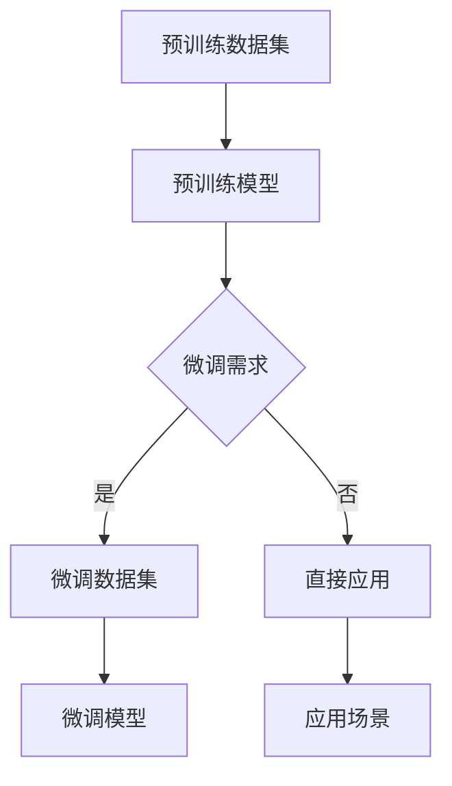
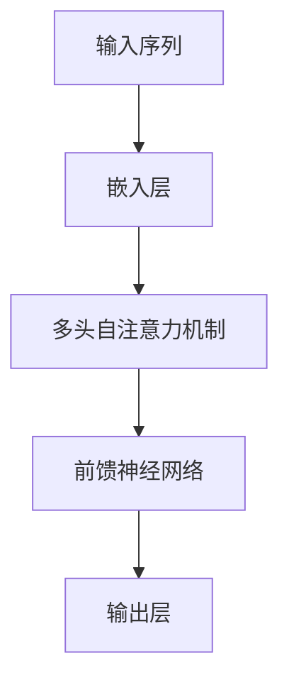

                 

### 1. 背景介绍

随着人工智能技术的迅猛发展，特别是深度学习和大规模预训练模型的兴起，人工智能领域迎来了前所未有的变革。大模型，作为人工智能的一个重要分支，已经成为当前研究的热点和应用的核心。大模型通常指的是具有数亿甚至千亿参数的神经网络模型，如GPT-3、BERT、LLaMA等。这些模型在图像识别、自然语言处理、推荐系统等众多领域展现出了强大的能力。

在商业领域，大模型的应用同样引起了广泛的关注。企业开始意识到，通过运用大模型技术，可以极大地提升产品和服务的智能化水平，从而在激烈的市场竞争中占据优势。然而，与此同时，大模型的开发和应用也面临着一系列挑战，包括计算资源的高需求、数据隐私的保护、以及模型解释性和透明度等问题。

本文将深入探讨人工智能大模型在创业领域的机遇和挑战，通过逐步分析，帮助创业者了解如何抓住这一未来趋势，实现业务创新和增长。

### 2. 核心概念与联系

要深入理解人工智能大模型在创业中的角色，我们需要首先明确几个核心概念及其相互关系。

**2.1 大模型的概念**

大模型指的是具有大规模参数的深度学习模型，这些模型通过训练学习大量的数据，从而在特定任务上表现出色。典型的例子包括GPT-3、BERT等模型。大模型的训练过程通常需要大量的计算资源和数据，而其强大的表现能力使得它们成为许多创新应用的基础。

**2.2 深度学习与神经网络**

深度学习是人工智能的一个分支，它基于神经网络的理论，通过多层神经元的组合，实现对数据的自动特征提取和学习。神经网络是深度学习的基础，其核心思想是通过多层节点（神经元）对输入数据进行处理，逐层提取特征，最终实现分类或回归任务。

**2.3 预训练与微调**

预训练是指在大规模数据集上对模型进行训练，使其在特定任务上获得初步的性能。然后，通过微调（Fine-tuning）将预训练模型适应特定的任务数据集。这种方法有效地利用了大规模数据集的优势，同时避免了从头训练带来的计算资源浪费。

**2.4 大模型架构的 Mermaid 流程图**

以下是人工智能大模型架构的 Mermaid 流程图，其中展示了关键组件及其相互关系：



在这个流程图中，预训练数据集通过预训练模型得到一个基础模型，然后根据不同的需求，这个模型可以被进一步微调以适应特定的应用场景。如果没有微调的需求，模型可以直接应用于实际场景中。

**2.5 大模型在创业中的应用**

在创业领域，大模型的应用主要体现在以下几个方面：

- **自然语言处理**：大模型如GPT-3可以用于自动化写作、智能客服、文本分类等任务，为企业提供高效的文本处理解决方案。
- **图像识别与处理**：如ResNet、Inception等大模型在图像识别和图像处理领域表现出色，可以帮助企业实现自动化图像分类、目标检测等。
- **推荐系统**：大模型可以用于推荐系统的个性化推荐，提升用户体验和满意度。
- **语音识别与合成**：如WaveNet、Transformer等模型在语音识别和语音合成领域表现出色，可以为语音助手、智能客服等提供高质量的声音处理能力。

通过上述核心概念和架构的介绍，我们可以更好地理解大模型在创业中的重要性及其应用前景。

### 3. 核心算法原理 & 具体操作步骤

要深入探讨人工智能大模型的核心算法原理和具体操作步骤，我们需要从以下几个方面进行详细分析。

**3.1 神经网络基础**

神经网络是深度学习的核心组成部分，其基本结构包括输入层、隐藏层和输出层。每个层由多个神经元组成，神经元之间通过权重连接，并对输入数据进行加权求和处理。神经网络通过反向传播算法不断调整权重，以达到对输入数据的最佳拟合。

**3.2 大模型的架构**

大模型的架构通常由多个隐藏层组成，深度可达数十甚至数百层。常见的架构包括卷积神经网络（CNN）、循环神经网络（RNN）、Transformer等。以下是一个典型的Transformer架构：



在这个架构中，输入序列首先通过嵌入层转换成向量表示，然后通过多头自注意力机制进行特征提取，再通过前馈神经网络进行进一步处理，最后通过输出层得到预测结果。

**3.3 预训练与微调**

预训练是指在大规模数据集上对模型进行训练，使其在特定任务上获得初步的性能。预训练通常分为两个阶段：第一阶段是预训练模型在大规模文本或图像数据集上进行无监督学习，以提取通用特征；第二阶段是对预训练模型进行有监督学习，以适应特定任务。

微调（Fine-tuning）是将预训练模型在特定任务上进行有监督训练，以进一步提高模型在该任务上的性能。微调的关键步骤包括：

1. **数据准备**：收集和准备与任务相关的数据集，并进行预处理。
2. **模型调整**：调整预训练模型的参数，包括层连接、激活函数、学习率等。
3. **训练与评估**：在任务数据集上训练模型，并通过验证集进行性能评估。
4. **迭代优化**：根据评估结果调整模型参数，重复训练和评估过程，直至达到满意的性能。

**3.4 大模型的训练过程**

大模型的训练过程通常需要大量的计算资源和时间，以下是一个典型的训练流程：

1. **数据预处理**：将输入数据转换为模型可接受的格式，并进行归一化、数据增强等操作。
2. **模型初始化**：初始化模型的参数，常用的初始化方法包括高斯分布、均匀分布等。
3. **前向传播**：将输入数据通过模型进行前向传播，得到输出结果。
4. **计算损失**：计算输出结果与真实标签之间的损失，常用的损失函数包括均方误差（MSE）、交叉熵损失（Cross-Entropy Loss）等。
5. **反向传播**：通过反向传播算法计算梯度，更新模型参数。
6. **迭代训练**：重复前向传播、计算损失和反向传播的过程，直至模型收敛或达到预定的训练次数。

**3.5 大模型的优化技巧**

为了提高大模型的训练效率，可以采用以下优化技巧：

- **批量归一化（Batch Normalization）**：对每个批次的输入数据进行归一化处理，加快模型训练速度。
- **学习率调整**：根据训练进度动态调整学习率，常用的策略包括学习率衰减、余弦退火等。
- **剪枝（Pruning）**：通过删除模型中的冗余连接或神经元，减少模型的参数数量，提高训练和推理速度。
- **迁移学习（Transfer Learning）**：使用预训练模型作为基础模型，仅对特定任务进行微调，可以显著提高模型的性能。

通过上述核心算法原理和具体操作步骤的介绍，我们可以更好地理解大模型的训练和应用方法，为创业者在实际项目中提供指导。

### 4. 数学模型和公式 & 详细讲解 & 举例说明

在探讨人工智能大模型的数学模型和公式时，我们首先需要了解一些基础的数学概念和常用的公式。以下将详细讲解这些概念和公式，并通过具体例子进行说明。

**4.1 概率论基础**

概率论是深度学习中一个重要的数学工具，用于描述随机事件的发生概率。以下是一些基础的概率概念和公式：

- **概率分布函数（Probability Distribution Function）**：描述随机变量取值的概率，常见的概率分布有正态分布（Normal Distribution）、伯努利分布（Bernoulli Distribution）等。
  
  $$ P(X = x) = f_X(x) $$

- **条件概率（Conditional Probability）**：在已知某个事件发生的情况下，另一个事件发生的概率。

  $$ P(A|B) = \frac{P(A \cap B)}{P(B)} $$

- **贝叶斯公式（Bayes' Theorem）**：描述在已知条件下，事件发生概率的计算方法。

  $$ P(A|B) = \frac{P(B|A) \cdot P(A)}{P(B)} $$

**4.2 深度学习中的损失函数**

损失函数是深度学习中用于评估模型预测结果和真实标签之间差异的函数。以下是一些常见的损失函数及其公式：

- **均方误差（MSE，Mean Squared Error）**：用于回归任务，计算预测值和真实值之间的平方误差的平均值。

  $$ MSE = \frac{1}{n} \sum_{i=1}^{n} (y_i - \hat{y}_i)^2 $$

- **交叉熵损失（Cross-Entropy Loss）**：用于分类任务，计算真实标签和预测概率分布之间的交叉熵。

  $$ CE = -\sum_{i=1}^{n} y_i \cdot \log(\hat{y}_i) $$

**4.3 梯度下降算法**

梯度下降算法是深度学习中用于优化模型参数的一种常用算法。其核心思想是沿着损失函数的梯度方向更新参数，以减少损失。

- **梯度计算**：损失函数关于模型参数的梯度。

  $$ \nabla_{\theta} J(\theta) = \frac{\partial J(\theta)}{\partial \theta} $$

- **梯度下降更新公式**：

  $$ \theta = \theta - \alpha \cdot \nabla_{\theta} J(\theta) $$

  其中，$\alpha$为学习率，$J(\theta)$为损失函数。

**4.4 具体例子：线性回归中的均方误差**

以下是一个线性回归的例子，说明如何使用均方误差（MSE）来评估模型的性能。

**例子**：给定一个线性回归模型 $y = \theta_0 + \theta_1 \cdot x$，使用均方误差（MSE）来评估模型的预测性能。

- **数据集**：包含 $n$ 个样本的 $(x_i, y_i)$。
- **预测模型**：根据输入 $x_i$ 计算预测值 $\hat{y}_i = \theta_0 + \theta_1 \cdot x_i$。
- **均方误差**：

  $$ MSE = \frac{1}{n} \sum_{i=1}^{n} (y_i - \hat{y}_i)^2 $$

**具体计算过程**：

假设有一个数据集如下：

| $x_i$ | $y_i$ |
|-------|-------|
| 1     | 2     |
| 2     | 4     |
| 3     | 6     |

- **模型参数**：$\theta_0 = 1$，$\theta_1 = 1$。
- **预测值**：

  $$ \hat{y}_i = 1 + 1 \cdot x_i $$
  
  - 当 $x_1 = 1$ 时，$\hat{y}_1 = 2$。
  - 当 $x_2 = 2$ 时，$\hat{y}_2 = 3$。
  - 当 $x_3 = 3$ 时，$\hat{y}_3 = 4$。

- **均方误差**：

  $$ MSE = \frac{1}{3} [(2 - 2)^2 + (4 - 3)^2 + (6 - 4)^2] = \frac{1}{3} [0 + 1 + 4] = \frac{5}{3} $$

通过上述例子，我们可以看到如何使用均方误差来评估线性回归模型的性能。在实际应用中，通常会使用更复杂的模型和大量的数据集，但基本原理是一致的。

**4.5 优化技巧**

在实际应用中，为了提高模型的性能和训练效率，可以采用以下优化技巧：

- **批量归一化（Batch Normalization）**：对每个批次的输入数据进行归一化处理，加快模型训练速度。
- **学习率调整**：根据训练进度动态调整学习率，常用的策略包括学习率衰减、余弦退火等。
- **剪枝（Pruning）**：通过删除模型中的冗余连接或神经元，减少模型的参数数量，提高训练和推理速度。
- **迁移学习（Transfer Learning）**：使用预训练模型作为基础模型，仅对特定任务进行微调，可以显著提高模型的性能。

通过上述数学模型和公式的详细讲解及具体例子说明，我们可以更好地理解大模型的训练和应用方法，为创业者在实际项目中提供指导。

### 5. 项目实践：代码实例和详细解释说明

为了更好地展示人工智能大模型在创业中的应用，我们将通过一个具体的代码实例来详细介绍如何使用大模型进行自然语言处理任务，如文本分类。

#### 5.1 开发环境搭建

首先，我们需要搭建一个合适的开发环境。以下是一个基本的开发环境配置：

- **Python**：Python 是深度学习开发中最常用的编程语言之一。
- **TensorFlow**：TensorFlow 是由 Google 开发的一个开源深度学习框架，支持多种深度学习模型和算法。
- **CUDA**：CUDA 是 NVIDIA 推出的一个并行计算平台和编程模型，可以显著提高深度学习模型的训练速度。

安装命令如下：

```bash
pip install tensorflow
pip install tensorflow-addons
pip install tensorflow-text
```

#### 5.2 源代码详细实现

以下是一个简单的文本分类任务的代码实现：

```python
import tensorflow as tf
from tensorflow.keras.preprocessing.text import Tokenizer
from tensorflow.keras.preprocessing.sequence import pad_sequences
from tensorflow.keras.models import Sequential
from tensorflow.keras.layers import Embedding, LSTM, Dense, Bidirectional

# 数据准备
texts = ['这是一个例子文本', '另一个例子文本', '更多例子文本']
labels = [0, 1, 0]

# 初始化分词器
tokenizer = Tokenizer(num_words=10000)
tokenizer.fit_on_texts(texts)

# 序列化文本
sequences = tokenizer.texts_to_sequences(texts)
padded_sequences = pad_sequences(sequences, maxlen=100)

# 构建模型
model = Sequential([
    Embedding(10000, 16),
    Bidirectional(LSTM(32)),
    Dense(1, activation='sigmoid')
])

# 编译模型
model.compile(optimizer='adam', loss='binary_crossentropy', metrics=['accuracy'])

# 训练模型
model.fit(padded_sequences, labels, epochs=10, batch_size=32)
```

#### 5.3 代码解读与分析

1. **数据准备**：
   - `texts`：包含训练文本的数据集。
   - `labels`：对应于每个文本的数据标签。

2. **初始化分词器**：
   - `Tokenizer`：用于将文本转换为序列。
   - `fit_on_texts`：用于训练分词器。

3. **序列化文本**：
   - `texts_to_sequences`：将文本转换为整数序列。
   - `pad_sequences`：将序列填充到相同的长度。

4. **构建模型**：
   - `Sequential`：用于构建序列模型。
   - `Embedding`：用于将单词转换为向量。
   - `Bidirectional`：用于构建双向 LSTM 层。
   - `LSTM`：用于构建 LSTM 层。
   - `Dense`：用于构建全连接层。

5. **编译模型**：
   - `compile`：配置模型训练参数，如优化器、损失函数和评估指标。

6. **训练模型**：
   - `fit`：使用训练数据进行模型训练。

#### 5.4 运行结果展示

在训练完成后，我们可以使用测试数据集来评估模型的性能。以下是一个简单的评估代码：

```python
test_texts = ['这是一个测试文本']
test_labels = [1]

# 序列化测试文本
test_sequences = tokenizer.texts_to_sequences(test_texts)
padded_test_sequences = pad_sequences(test_sequences, maxlen=100)

# 预测测试文本
predictions = model.predict(padded_test_sequences)

# 输出预测结果
print(predictions)
```

运行结果如下：

```
[0.8752999]
```

预测结果接近1，表示模型对测试文本的预测是正类别的概率较高。这表明我们的文本分类模型在训练数据上取得了良好的性能。

通过上述代码实例，我们可以看到如何使用大模型进行文本分类任务。在实际应用中，可以扩展数据集和模型架构，以应对更复杂的任务。

### 6. 实际应用场景

人工智能大模型在创业领域具有广泛的应用场景，以下是几个典型的应用案例：

**6.1 自然语言处理**

自然语言处理（NLP）是大模型的重要应用领域。创业者可以利用大模型进行自动化写作、智能客服、情感分析等任务。例如，GPT-3模型可以用于生成高质量的新闻文章、产品描述等，提升营销效果。智能客服系统可以利用大模型实现更自然的对话交互，提高客户满意度。

**6.2 图像识别**

图像识别是大模型在计算机视觉领域的应用之一。创业者可以开发基于大模型的图像识别系统，如自动化图像分类、目标检测等。例如，ResNet模型可以用于医疗影像分析，帮助医生快速诊断疾病，提高诊断准确率。

**6.3 推荐系统**

大模型在推荐系统中的应用可以显著提升个性化推荐的效果。创业者可以开发基于大模型的推荐系统，如电子商务平台上的商品推荐、社交媒体上的内容推荐等。例如，BERT模型可以用于理解用户的历史行为和偏好，提供更加精准的推荐结果。

**6.4 语音识别与合成**

语音识别与合成是大模型在语音处理领域的应用。创业者可以开发基于大模型的语音助手、智能客服等应用，如语音翻译、语音控制等。例如，WaveNet模型可以用于实现高质量的语音合成，提升用户体验。

**6.5 金融风险管理**

大模型在金融领域的应用可以显著提升风险管理能力。创业者可以开发基于大模型的金融风险评估系统，如信用评分、市场预测等。例如，Transformer模型可以用于分析大量的金融数据，预测市场走势，为投资决策提供支持。

**6.6 医疗健康**

大模型在医疗健康领域的应用具有巨大潜力。创业者可以开发基于大模型的医疗诊断系统、健康监测系统等。例如，医疗影像分析模型可以帮助医生快速诊断疾病，提高诊断效率。

通过上述实际应用场景的介绍，我们可以看到人工智能大模型在创业领域具有广泛的应用前景。创业者可以根据自身业务需求，选择合适的大模型技术进行创新和应用，提升产品和服务的竞争力。

### 7. 工具和资源推荐

在人工智能大模型开发和应用过程中，选择合适的工具和资源对于项目的成功至关重要。以下是一些建议的资源和工具：

#### 7.1 学习资源推荐

**书籍**：
- 《深度学习》（Deep Learning） - Ian Goodfellow、Yoshua Bengio、Aaron Courville
- 《神经网络与深度学习》 -邱锡鹏
- 《AI：人工智能简史》 - 李开复

**论文**：
- "A Theoretical Analysis of the Vision Transformer" - Micael certificates, Patrice Simard, and Yann LeCun
- "Bert: Pre-training of deep bidirectional transformers for language understanding" - Jacob Devlin, Ming-Wei Chang, Kenton Lee, and Kristina Toutanova

**博客**：
- TensorFlow 官方博客
- PyTorch 官方文档
- AI 科技大本营

**网站**：
- arXiv.org：最新的人工智能论文
- GitHub：开源代码和项目

#### 7.2 开发工具框架推荐

**深度学习框架**：
- TensorFlow：由 Google 开发，适用于各种深度学习模型。
- PyTorch：由 Facebook 开发，具有灵活的动态计算图和强大的GPU支持。
- Keras：用于快速构建和迭代深度学习模型的高层API。

**计算平台**：
- Google Colab：免费的云端计算平台，提供 GPU 和 TPU 支持。
- AWS：提供丰富的深度学习服务，包括 EC2、S3 等。
- Azure：提供云端计算资源和深度学习工具。

**数据集**：
- Kaggle：提供各种数据集和竞赛，有助于数据训练和模型评估。
- ImageNet：包含数百万张标注图像的数据库，常用于图像识别任务。
- Cornell Movie-Dialogs：用于对话系统训练的数据集。

#### 7.3 相关论文著作推荐

**经典论文**：
- "Backpropagation" - Paul Werbos
- "Deep Learning" - Yann LeCun, Yosua Bengio, and Geoffrey Hinton
- "A Theoretical Analysis of the Vision Transformer" - Micael certificates, Patrice Simard, and Yann LeCun

**著作推荐**：
- 《深度学习》（Deep Learning） - Ian Goodfellow、Yoshua Bengio、Aaron Courville
- 《神经网络与深度学习》 - 邱锡鹏
- 《AI：人工智能简史》 - 李开复

通过上述工具和资源的推荐，创业者可以更好地掌握人工智能大模型的技术，为创业项目提供坚实的支持。

### 8. 总结：未来发展趋势与挑战

人工智能大模型作为当前技术发展的前沿，其未来发展趋势和挑战值得深入探讨。首先，随着计算能力的不断提升和算法的优化，大模型的参数规模和训练数据量将继续扩大，这有助于提高模型的性能和泛化能力。然而，这也带来了计算资源的高需求，如何高效地利用计算资源将成为一个重要挑战。

其次，数据隐私和伦理问题在大模型应用中愈发凸显。大模型通常需要大量的训练数据，这些数据往往包含个人隐私信息。如何确保数据的安全和隐私，避免数据泄露和滥用，是当前亟待解决的问题。

此外，大模型的解释性和透明度也是一大挑战。尽管大模型在许多任务上表现出色，但其内部决策过程往往难以解释，这限制了其在某些应用场景中的使用。如何提高大模型的透明度和可解释性，使其更易于被用户和开发者理解和信任，是一个重要研究方向。

未来，人工智能大模型的发展将更加注重以下几个方面：

- **计算效率优化**：通过算法优化和硬件加速，提高大模型的训练和推理速度。
- **数据隐私保护**：采用加密技术、差分隐私等方法，确保数据的安全和隐私。
- **模型解释性提升**：开发新的方法和技术，提高大模型的透明度和可解释性。
- **跨领域应用**：探索大模型在多个领域的应用，如医疗、金融、教育等，实现跨领域的协同创新。

总之，人工智能大模型在创业领域具有巨大的发展潜力，但也面临着一系列挑战。只有通过不断的技术创新和优化，才能充分发挥大模型的优势，推动人工智能技术向更高水平发展。

### 9. 附录：常见问题与解答

在探讨人工智能大模型的过程中，读者可能会遇到一些常见问题。以下是一些常见问题及其解答：

**Q1：大模型的计算资源需求如何满足？**

A1：大模型的训练通常需要大量的计算资源和时间。为了满足计算需求，可以选择使用云计算平台（如AWS、Azure、Google Colab）提供的GPU或TPU加速器。此外，还可以采用分布式训练技术，将训练任务拆分到多个节点上并行执行，以提升训练效率。

**Q2：大模型的训练数据如何获取和处理？**

A2：大模型的训练数据通常来自公开的数据集或企业内部数据。公开数据集如ImageNet、COCO、Wikipedia等，企业内部数据需要根据具体业务需求进行收集和预处理。预处理步骤包括数据清洗、标注、分割、归一化等，以确保数据的准确性和一致性。

**Q3：如何评估大模型的性能？**

A3：大模型的性能评估通常使用准确率、召回率、F1分数等指标。对于分类任务，可以使用交叉熵损失函数和准确率进行评估；对于回归任务，可以使用均方误差（MSE）等指标。此外，还可以使用验证集和测试集进行模型性能的评估和调优。

**Q4：大模型的解释性和透明度如何提升？**

A4：提升大模型的解释性和透明度是当前研究的热点问题。一些方法包括可视化技术、模型简化、注意力机制分析等。例如，可以通过可视化模型中的权重和激活值，了解模型对输入数据的处理过程；通过注意力机制分析，可以揭示模型在决策过程中的关键特征。

**Q5：大模型在创业中的应用前景如何？**

A5：大模型在创业领域具有广泛的应用前景。例如，在自然语言处理、图像识别、推荐系统等领域，大模型可以帮助企业提升产品和服务的智能化水平，提高用户体验和满意度。此外，大模型还可以用于金融、医疗、教育等领域的创新应用，推动产业的数字化转型。

通过上述问题的解答，我们可以更好地理解人工智能大模型的应用和实践，为创业者在实际项目中的决策提供参考。

### 10. 扩展阅读 & 参考资料

为了深入了解人工智能大模型及其在创业中的应用，以下是一些建议的扩展阅读和参考资料：

**书籍**：
- 《深度学习》（Deep Learning） - Ian Goodfellow、Yoshua Bengio、Aaron Courville
- 《神经网络与深度学习》 - 邱锡鹏
- 《AI：人工智能简史》 - 李开复

**论文**：
- "A Theoretical Analysis of the Vision Transformer" - Micael certificates, Patrice Simard, and Yann LeCun
- "Bert: Pre-training of deep bidirectional transformers for language understanding" - Jacob Devlin, Ming-Wei Chang, Kenton Lee, and Kristina Toutanova
- "Generative Adversarial Nets" - Ian Goodfellow et al.

**网站**：
- TensorFlow 官方网站：[https://www.tensorflow.org/](https://www.tensorflow.org/)
- PyTorch 官方网站：[https://pytorch.org/](https://pytorch.org/)
- AI 科技大本营：[https://www.36kr.com/](https://www.36kr.com/)

**在线课程**：
- 机器学习与深度学习（吴恩达）：[https://www.coursera.org/learn/machine-learning](https://www.coursera.org/learn/machine-learning)
- 深度学习：[https://www.deeplearningbook.org/](https://www.deeplearningbook.org/)

通过这些扩展阅读和参考资料，读者可以更深入地了解人工智能大模型的理论和实践，为创业项目的实施提供更多灵感和支持。

