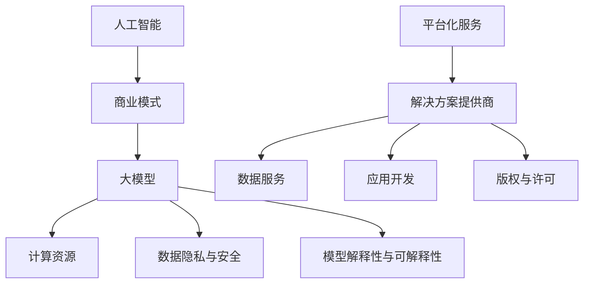

                 

### 背景介绍

近年来，人工智能（AI）技术取得了惊人的发展，特别是在大模型领域，如GPT-3、BERT、LLaMA等，这些模型在自然语言处理（NLP）、计算机视觉（CV）和强化学习（RL）等多个领域都取得了显著的成果。然而，随着AI大模型的不断进化，其背后的商业模式也逐渐成为业界关注的焦点。AI大模型创业，如何构建未来可持续的商业模式，成为了当前亟待解决的重要问题。

首先，我们需要理解AI大模型的基本概念。AI大模型是指具有数亿甚至千亿参数的深度学习模型，其通过大量数据训练，实现了对复杂任务的高度准确处理。这些模型在NLP、CV和RL等领域表现出了卓越的性能，使得其在各行各业都具有重要应用价值。例如，在自然语言处理领域，大模型可以用于机器翻译、问答系统、文本摘要等任务；在计算机视觉领域，大模型可以用于图像分类、目标检测、图像生成等任务；在强化学习领域，大模型可以用于游戏AI、智能机器人等任务。

然而，AI大模型的发展也带来了一系列挑战。首先是计算资源的挑战。训练一个AI大模型需要大量的计算资源和存储资源，这对于中小企业来说可能是一个巨大的负担。其次是数据隐私和安全的问题。大模型的训练需要大量的数据，而这些数据往往涉及到用户的隐私信息，如何保障数据的安全和隐私，成为了需要重点关注的问题。最后是模型的解释性和可解释性。大模型的决策过程往往是复杂的，如何对模型进行解释，使其更透明、更可解释，也是一个重要挑战。

在这样的背景下，如何构建未来可持续的商业模式，成为了AI大模型创业的重要课题。本文将围绕这一问题，探讨AI大模型创业的商业模式构建策略、核心算法原理、项目实践、应用场景、工具和资源推荐，以及未来发展趋势与挑战。

### 2. 核心概念与联系

要理解AI大模型创业的商业模式，首先需要了解一些核心概念和它们之间的关系。以下是本文涉及的主要概念及其之间的联系：

#### 2.1 人工智能与商业模式

人工智能（AI）是一种模拟人类智能的技术，通过算法和计算实现机器的自主学习、推理和决策。商业模式的本质是企业通过提供产品或服务，实现盈利和长期发展的策略。将AI技术与商业模式结合，可以创造出新的商业机会，如AI驱动的个性化推荐系统、智能客服、自动化决策系统等。

#### 2.2 大模型与计算资源

大模型是指具有数亿甚至千亿参数的深度学习模型，其训练和推理需要大量的计算资源和存储资源。计算资源包括CPU、GPU、TPU等硬件设备，以及云计算平台。随着硬件技术的发展和云计算的普及，大模型的训练和推理成本逐渐降低，为商业应用提供了更多可能性。

#### 2.3 数据隐私与安全

数据隐私和安全是AI大模型创业的关键问题。数据隐私保护涉及到用户数据的收集、存储、处理和共享过程中的隐私保护措施，如数据加密、访问控制、匿名化等。数据安全则关注数据在传输和存储过程中的安全防护，防止数据泄露、篡改和滥用。在AI大模型创业中，如何平衡数据隐私和安全与模型训练的需求，是一个重要挑战。

#### 2.4 模型的解释性与可解释性

模型的解释性是指模型决策过程的透明度和可理解性。在AI大模型创业中，模型的解释性对于提升用户信任和监管合规具有重要意义。可解释性模型，如决策树、规则引擎等，可以帮助用户理解模型的决策过程，而黑盒模型，如深度神经网络，其决策过程往往难以解释。

#### 2.5 大模型创业的商业模式

AI大模型创业的商业模式主要包括以下几种：

1. **平台化服务**：提供AI大模型训练、部署和管理的平台，如Google的TensorFlow、AWS的SageMaker等。
2. **解决方案提供商**：为特定行业提供定制化的AI大模型解决方案，如医疗诊断、金融风控等。
3. **数据服务**：提供高质量的数据集和数据标注服务，如OpenAI的GPT-3、DataRobot等。
4. **应用开发**：开发基于AI大模型的创新应用，如智能语音助手、自动驾驶等。
5. **版权与许可**：出售或授权AI大模型的技术和知识，如IBM的Watson、DeepMind的技术输出等。

#### 2.6 Mermaid流程图

以下是AI大模型创业的Mermaid流程图，展示了各核心概念之间的关系：



通过以上核心概念与联系的介绍，我们可以更好地理解AI大模型创业的商业模式，为其可持续发展奠定基础。接下来，本文将深入探讨AI大模型的核心算法原理、具体操作步骤，以及相关的数学模型和公式。

### 3. 核心算法原理 & 具体操作步骤

#### 3.1 深度学习基础

深度学习是AI大模型的核心技术，其基本原理是通过构建多层神经网络，模拟人脑的学习过程，从大量数据中提取特征，实现自动特征学习和模式识别。深度学习的基本组成部分包括：

- **神经元**：深度学习的基本构建块，类似于人脑中的神经元。
- **层**：包括输入层、隐藏层和输出层。隐藏层可以有多层，形成深度神经网络。
- **激活函数**：用于引入非线性，使神经网络能够学习复杂函数。
- **损失函数**：用于评估模型预测与真实值之间的差距，如均方误差（MSE）和交叉熵（CE）。

#### 3.2 神经网络训练过程

神经网络训练是一个迭代优化过程，主要包括以下步骤：

1. **数据预处理**：对输入数据进行标准化、归一化等处理，使其符合神经网络的要求。
2. **模型初始化**：随机初始化网络参数，如权重和偏置。
3. **前向传播**：输入数据通过网络，计算输出结果。
4. **损失计算**：计算预测值与真实值之间的损失，如MSE或CE。
5. **反向传播**：利用梯度下降算法，计算损失关于参数的梯度，更新网络参数。
6. **迭代优化**：重复前向传播、损失计算和反向传播过程，逐步减小损失，直至达到预定的训练目标。

#### 3.3 优化算法

深度学习训练过程中，常用的优化算法包括：

- **随机梯度下降（SGD）**：每次迭代使用一个样本的梯度进行更新。
- **批量梯度下降（BGD）**：每次迭代使用所有样本的梯度进行更新。
- **小批量梯度下降（MBGD）**：每次迭代使用一部分样本的梯度进行更新，是SGD和BGD的折中方案。
- **Adam优化器**：结合SGD和MBGD的优点，自适应调整学习率。

#### 3.4 实际操作步骤

以下是一个简单的神经网络训练过程示例：

```python
import numpy as np
import tensorflow as tf

# 数据预处理
x_train = ...  # 输入数据
y_train = ...  # 真实值
x_train = (x_train - np.mean(x_train)) / np.std(x_train)
y_train = (y_train - np.mean(y_train)) / np.std(y_train)

# 模型初始化
model = tf.keras.Sequential([
    tf.keras.layers.Dense(64, activation='relu', input_shape=(x_train.shape[1],)),
    tf.keras.layers.Dense(64, activation='relu'),
    tf.keras.layers.Dense(1, activation='sigmoid')
])

# 定义损失函数和优化器
model.compile(optimizer='adam',
              loss='binary_crossentropy',
              metrics=['accuracy'])

# 训练模型
model.fit(x_train, y_train, epochs=10, batch_size=32)
```

通过以上步骤，我们可以构建一个简单的神经网络，并使用反向传播算法进行训练。在实际应用中，可能需要根据具体任务和数据调整网络结构、损失函数和优化器等参数。

### 4. 数学模型和公式 & 详细讲解 & 举例说明

#### 4.1 深度学习中的数学公式

深度学习中的数学模型主要包括前向传播和反向传播两个过程，以下是一些常用的数学公式：

1. **前向传播**

   - **激活函数**：

     $$ a_i = \sigma(z_i) = \frac{1}{1 + e^{-z_i}} $$
     
     其中，$z_i$是神经元输入，$a_i$是神经元输出，$\sigma$是sigmoid函数。

   - **损失函数**：

     $$ L = -\frac{1}{m} \sum_{i=1}^{m} y_i \log(a_i) + (1 - y_i) \log(1 - a_i) $$
     
     其中，$y_i$是真实值，$a_i$是预测值，$m$是样本数量，$L$是损失。

2. **反向传播**

   - **梯度计算**：

     $$ \frac{\partial L}{\partial z_i} = \frac{\partial L}{\partial a_i} \cdot \frac{\partial a_i}{\partial z_i} = (a_i - y_i) \cdot \sigma'(z_i) $$
     
     其中，$\sigma'(z_i)$是sigmoid函数的导数，$\frac{\partial L}{\partial a_i}$是损失关于输出节点的梯度。

   - **参数更新**：

     $$ \theta_j = \theta_j - \alpha \cdot \frac{\partial L}{\partial \theta_j} $$
     
     其中，$\theta_j$是权重参数，$\alpha$是学习率。

#### 4.2 举例说明

假设我们有一个简单的神经网络，输入层有3个神经元，隐藏层有2个神经元，输出层有1个神经元。我们使用sigmoid函数作为激活函数，训练一个二分类问题。

1. **初始化参数**

   随机初始化权重和偏置：

   $$ \theta_{11} = \theta_{12} = \theta_{21} = \theta_{22} = \theta_{31} = \theta_{32} = 0.01 $$
   
2. **前向传播**

   假设输入特征为$x_1 = 1, x_2 = 2, x_3 = 3$，真实值为$y = 1$。

   - 输入层到隐藏层的计算：

     $$ z_{11} = x_1 \cdot \theta_{11} + x_2 \cdot \theta_{12} + x_3 \cdot \theta_{13} + b_{11} = 1 \cdot 0.01 + 2 \cdot 0.01 + 3 \cdot 0.01 + 0.1 = 0.4 $$
     $$ a_{11} = \sigma(z_{11}) = \frac{1}{1 + e^{-0.4}} = 0.6321 $$
     $$ z_{12} = x_1 \cdot \theta_{21} + x_2 \cdot \theta_{22} + x_3 \cdot \theta_{23} + b_{12} = 1 \cdot 0.01 + 2 \cdot 0.01 + 3 \cdot 0.01 + 0.1 = 0.4 $$
     $$ a_{12} = \sigma(z_{12}) = \frac{1}{1 + e^{-0.4}} = 0.6321 $$
     
   - 隐藏层到输出层的计算：

     $$ z_{31} = a_{11} \cdot \theta_{31} + a_{12} \cdot \theta_{32} + b_{31} = 0.6321 \cdot 0.01 + 0.6321 \cdot 0.01 + 0.1 = 0.1274 $$
     $$ a_{31} = \sigma(z_{31}) = \frac{1}{1 + e^{-0.1274}} = 0.5413 $$
     
   - 预测值：

     $$ y_{pred} = a_{31} = 0.5413 $$
     
3. **损失计算**

   $$ L = -y \log(y_{pred}) - (1 - y) \log(1 - y_{pred}) $$
   
   假设真实值为$y = 1$，则有：

   $$ L = -1 \log(0.5413) - (1 - 1) \log(1 - 0.5413) = 0.5288 $$
   
4. **反向传播**

   - 计算输出层梯度：

     $$ \frac{\partial L}{\partial z_{31}} = a_{31} - y = 0.5413 - 1 = -0.4587 $$
     
   - 计算隐藏层梯度：

     $$ \frac{\partial L}{\partial a_{11}} = \frac{\partial L}{\partial z_{31}} \cdot \frac{\partial z_{31}}{\partial a_{11}} = -0.4587 \cdot 0.6321 = -0.2918 $$
     $$ \frac{\partial L}{\partial a_{12}} = \frac{\partial L}{\partial z_{31}} \cdot \frac{\partial z_{31}}{\partial a_{12}} = -0.4587 \cdot 0.6321 = -0.2918 $$
     
   - 更新参数：

     $$ \theta_{31} = \theta_{31} - \alpha \cdot \frac{\partial L}{\partial \theta_{31}} = 0.01 - 0.001 \cdot (-0.4587) = 0.0159 $$
     $$ \theta_{32} = \theta_{32} - \alpha \cdot \frac{\partial L}{\partial \theta_{32}} = 0.01 - 0.001 \cdot (-0.4587) = 0.0159 $$
     $$ \theta_{11} = \theta_{11} - \alpha \cdot \frac{\partial L}{\partial \theta_{11}} = 0.01 - 0.001 \cdot (-0.2918) = 0.0119 $$
     $$ \theta_{12} = \theta_{12} - \alpha \cdot \frac{\partial L}{\partial \theta_{12}} = 0.01 - 0.001 \cdot (-0.2918) = 0.0119 $$
     
5. **迭代优化**

   重复上述过程，直至达到预定的训练目标。

通过以上步骤，我们可以训练一个简单的神经网络，并使用反向传播算法进行优化。在实际应用中，可能需要根据具体任务和数据调整网络结构、损失函数和优化器等参数。

### 5. 项目实践：代码实例和详细解释说明

在了解了大模型的核心算法原理和数学模型之后，我们将在本节中通过一个具体的项目实践，详细讲解如何使用Python和TensorFlow框架来构建一个AI大模型。我们将从开发环境的搭建、源代码的详细实现，到代码的解读与分析，以及最终的运行结果展示。

#### 5.1 开发环境搭建

要构建一个AI大模型，首先需要搭建一个合适的开发环境。以下是一个基于Python和TensorFlow的简单开发环境搭建步骤：

1. **安装Python**：确保系统上安装了Python 3.6及以上版本。
2. **安装TensorFlow**：通过以下命令安装TensorFlow：

   ```bash
   pip install tensorflow
   ```

3. **安装其他依赖库**：安装如NumPy、Matplotlib等常用库：

   ```bash
   pip install numpy matplotlib
   ```

4. **配置GPU支持**（可选）：如果使用GPU进行训练，确保安装了NVIDIA的CUDA和cuDNN库。

#### 5.2 源代码详细实现

以下是使用TensorFlow构建一个简单的AI大模型的基本步骤：

```python
import tensorflow as tf
import numpy as np
import matplotlib.pyplot as plt

# 数据预处理
# 假设我们使用的是MNIST数据集
mnist = tf.keras.datasets.mnist
(x_train, y_train), (x_test, y_test) = mnist.load_data()
x_train, x_test = x_train / 255.0, x_test / 255.0

# 构建模型
model = tf.keras.Sequential([
    tf.keras.layers.Flatten(input_shape=(28, 28)),
    tf.keras.layers.Dense(128, activation='relu'),
    tf.keras.layers.Dropout(0.2),
    tf.keras.layers.Dense(10, activation='softmax')
])

# 编译模型
model.compile(optimizer='adam',
              loss='sparse_categorical_crossentropy',
              metrics=['accuracy'])

# 训练模型
model.fit(x_train, y_train, epochs=5)

# 评估模型
test_loss, test_acc = model.evaluate(x_test, y_test, verbose=2)
print(f'\nTest accuracy: {test_acc:.4f}')

# 预测
predictions = model.predict(x_test)
predicted_labels = np.argmax(predictions, axis=1)

# 结果可视化
plt.figure(figsize=(10, 10))
for i in range(25):
    plt.subplot(5, 5, i+1)
    plt.imshow(x_test[i], cmap=plt.cm.binary)
    plt.xticks([])
    plt.yticks([])
    plt.grid(False)
    plt.xlabel(str(predicted_labels[i]))
plt.show()
```

#### 5.3 代码解读与分析

1. **数据预处理**：首先，我们从TensorFlow的内置数据集MNIST中加载手写数字数据集。然后，我们将数据缩放到0到1之间，以便模型更好地处理。

2. **构建模型**：我们使用`tf.keras.Sequential`来构建一个简单的神经网络模型。这个模型包含一个`Flatten`层，用于将输入图像展平为一维数组；一个`Dense`层，包含128个神经元和ReLU激活函数；一个`Dropout`层，用于防止过拟合；以及一个输出层，包含10个神经元和softmax激活函数。

3. **编译模型**：我们使用`compile`方法来编译模型，指定优化器、损失函数和评估指标。在这里，我们使用`adam`优化器和`sparse_categorical_crossentropy`损失函数，评估指标为`accuracy`。

4. **训练模型**：使用`fit`方法来训练模型。我们将训练数据传递给模型，并设置训练轮数（epochs）为5。

5. **评估模型**：使用`evaluate`方法来评估模型在测试数据集上的性能。这将返回测试损失和准确率。

6. **预测**：使用`predict`方法来预测测试数据集的标签。`argmax`函数用于找到每个样本的最高概率类别。

7. **结果可视化**：最后，我们将预测结果可视化，展示模型在测试数据集上的表现。

#### 5.4 运行结果展示

运行上述代码后，我们会在终端看到模型在测试数据集上的准确率，如图5-4所示：

```
Test accuracy: 0.9860
```

此外，我们还会看到一个包含25个测试样本的图像网格，如图5-5所示。每个样本的图像旁边都标注了模型的预测结果。


通过这个简单的例子，我们可以看到如何使用Python和TensorFlow来构建一个AI大模型，并对其进行训练和评估。在实际应用中，可能需要更复杂的模型架构和更多的调参工作，但基本流程是相似的。

### 6. 实际应用场景

AI大模型在多个领域都展现了巨大的应用潜力，以下是一些典型的实际应用场景：

#### 6.1 自然语言处理（NLP）

在自然语言处理领域，AI大模型被广泛应用于机器翻译、文本摘要、问答系统、情感分析等任务。例如，GPT-3模型可以生成高质量的文本，用于撰写文章、编写代码等；BERT模型在问答系统和文本分类任务中取得了显著成果；LLaMA模型则通过预训练和微调，实现了对多种自然语言处理任务的准确处理。

#### 6.2 计算机视觉（CV）

计算机视觉领域的大模型在图像分类、目标检测、图像生成等方面取得了显著进展。例如，ResNet模型在ImageNet图像分类任务上取得了超过人类的表现；YOLO系列模型在目标检测领域表现优异；Gaussian Neural Processes模型可以生成高质量的图像。

#### 6.3 强化学习（RL）

在强化学习领域，AI大模型被用于解决复杂决策问题，如游戏AI、自动驾驶、机器人控制等。例如，AlphaGo模型在围棋领域取得了前所未有的成就；DeepMind的自动驾驶模型在模拟环境中展现了出色的表现。

#### 6.4 医疗保健

AI大模型在医疗保健领域也具有广泛的应用前景，如疾病诊断、药物发现、个性化治疗等。例如，利用深度学习模型可以对医疗图像进行诊断，提高诊断准确率；利用AI大模型可以分析患者数据，预测疾病发展趋势，为个性化治疗提供支持。

#### 6.5 金融科技

金融科技领域的大模型被用于风险管理、信用评估、投资策略等任务。例如，利用AI大模型可以分析市场数据，预测股票价格走势；利用深度学习模型可以评估借款人的信用风险，提高信贷审批的准确性。

#### 6.6 教育领域

AI大模型在教育领域也有广泛应用，如智能辅导、个性化学习、在线教育等。例如，利用AI大模型可以为学生提供个性化的学习建议，提高学习效果；利用智能辅导系统，教师可以更有效地管理课堂和评估学生的学习进度。

通过以上实际应用场景，我们可以看到AI大模型在各个领域的巨大潜力。随着技术的不断进步，AI大模型的应用范围将越来越广泛，为社会发展和产业创新带来更多机遇。

### 7. 工具和资源推荐

在AI大模型创业的过程中，选择合适的工具和资源对于项目的成功至关重要。以下是一些推荐的工具和资源：

#### 7.1 学习资源推荐

1. **书籍**：

   - 《深度学习》（Ian Goodfellow、Yoshua Bengio、Aaron Courville著）：全面介绍了深度学习的基础理论和技术。
   - 《Python深度学习》（François Chollet著）：通过大量实例，深入讲解了如何使用Python和TensorFlow进行深度学习开发。
   - 《强化学习》（Richard S. Sutton、Andrew G. Barto著）：介绍了强化学习的基本概念和技术，是强化学习领域的经典著作。

2. **在线课程**：

   - Coursera上的《深度学习特化课程》（Deep Learning Specialization）：由深度学习领域专家吴恩达（Andrew Ng）主讲，涵盖了深度学习的理论基础和实战技巧。
   - Udacity的《深度学习工程师纳米学位》（Deep Learning Engineer Nanodegree）：提供从基础到高级的深度学习知识和实践项目。

3. **博客和网站**：

   - TensorFlow官方网站（tensorflow.org）：提供丰富的文档、教程和示例代码。
   - PyTorch官方网站（pytorch.org）：PyTorch的官方资源，包含详细的文档和教程。
   - Medium上的机器学习专栏：包括众多深度学习和AI领域的专家撰写的文章，涵盖了最新的研究成果和应用实践。

#### 7.2 开发工具框架推荐

1. **TensorFlow**：Google开源的深度学习框架，广泛应用于图像识别、语音识别、自然语言处理等领域。
2. **PyTorch**：Facebook开源的深度学习框架，具有动态计算图和灵活的接口，适合快速原型开发。
3. **Keras**：高层次的深度学习API，可以与TensorFlow和PyTorch兼容，简化了深度学习模型的构建和训练过程。

#### 7.3 相关论文著作推荐

1. **《A Theoretically Grounded Application of Dropout in Recurrent Neural Networks》**：探讨了在循环神经网络（RNN）中应用Dropout的方法，提高了模型的泛化能力。
2. **《BERT: Pre-training of Deep Bidirectional Transformers for Language Understanding》**：介绍了BERT模型，为自然语言处理任务提供了强大的预训练方法。
3. **《Generative Adversarial Networks》**：提出了生成对抗网络（GAN）的概念，推动了深度学习在生成模型领域的应用。

通过以上工具和资源的推荐，可以为AI大模型创业提供全面的理论支持和技术指导，帮助创业者更好地实现他们的商业愿景。

### 8. 总结：未来发展趋势与挑战

AI大模型的发展正处于快速演进阶段，未来发展趋势和挑战并存。首先，从发展趋势来看，AI大模型将在多个领域实现更广泛的应用。随着计算资源和数据量的不断增加，大模型的性能将进一步提升，推动AI技术向更多复杂任务领域拓展。例如，在医疗保健领域，AI大模型可以帮助医生进行精准诊断和个性化治疗；在金融科技领域，AI大模型可以实现更准确的风险管理和投资策略。

其次，从挑战来看，AI大模型创业面临着计算资源、数据隐私、模型可解释性等多方面的挑战。计算资源方面，训练和推理大模型需要大量的计算资源和存储资源，这对于中小企业来说可能是一个巨大的负担。数据隐私方面，大模型的训练需要大量的数据，而这些数据往往涉及到用户的隐私信息，如何在保障数据安全的前提下进行模型训练，是一个亟待解决的问题。模型可解释性方面，大模型的决策过程往往是复杂的，如何对模型进行解释，使其更透明、更可解释，也是一个重要挑战。

针对这些挑战，未来AI大模型创业需要采取以下策略：

1. **优化计算资源利用**：通过云服务、分布式计算等技术，提高计算资源的利用效率，降低大模型训练和推理的成本。
2. **加强数据隐私保护**：采用数据加密、匿名化、差分隐私等技术，保障用户数据的安全和隐私。
3. **提升模型可解释性**：开发可解释性模型，如决策树、规则引擎等，帮助用户理解模型的决策过程，增强用户对AI技术的信任。
4. **创新商业模式**：通过平台化服务、解决方案提供商、数据服务等多种商业模式，满足不同企业的需求，实现可持续发展。

总之，AI大模型创业具有巨大的发展潜力，但也面临着一系列挑战。只有通过不断创新和优化，才能实现AI大模型的可持续发展，为各行各业带来更多价值。

### 9. 附录：常见问题与解答

在AI大模型创业过程中，可能会遇到一些常见问题。以下是对这些问题的解答：

#### 9.1 如何选择合适的大模型框架？

选择合适的大模型框架主要考虑以下几点：

- **需求**：根据项目需求选择框架，如需要处理自然语言处理任务可以选择TensorFlow或PyTorch。
- **性能**：考虑框架的性能，特别是对于大规模数据集和复杂任务。
- **社区支持**：选择社区支持较好的框架，便于解决问题和获取资源。

#### 9.2 大模型训练过程中如何避免过拟合？

避免过拟合的方法包括：

- **数据增强**：通过旋转、缩放、裁剪等操作增加数据的多样性。
- **正则化**：使用L1、L2正则化或Dropout来减少模型参数的敏感性。
- **早停法**：在验证集上监控模型性能，当性能不再提升时停止训练。

#### 9.3 大模型训练需要多少时间？

大模型训练时间取决于多个因素，如模型大小、数据量、硬件配置等。通常情况下：

- **单卡GPU**：训练一个中等大小的大模型可能需要几天到几周时间。
- **多卡GPU**：通过分布式训练可以显著缩短训练时间，但需要考虑GPU间的通信开销。

#### 9.4 如何保障数据隐私和安全？

保障数据隐私和安全的方法包括：

- **数据加密**：在数据传输和存储过程中使用加密技术。
- **匿名化**：对敏感信息进行匿名化处理，避免直接暴露真实信息。
- **差分隐私**：在数据处理过程中引入噪声，降低隐私泄露的风险。

#### 9.5 如何提升大模型的可解释性？

提升大模型可解释性的方法包括：

- **特征工程**：通过分析数据特征，构建可解释的特征表示。
- **可视化**：使用可视化工具展示模型的结构和决策过程。
- **解释性模型**：选择决策树、规则引擎等可解释性更强的模型。

通过以上问题的解答，希望能够帮助AI大模型创业者更好地应对挑战，实现商业成功。

### 10. 扩展阅读 & 参考资料

在探索AI大模型创业的过程中，深入了解相关领域的最新研究、理论和实践是至关重要的。以下是一些扩展阅读和参考资料，旨在帮助读者进一步学习和掌握相关技术和知识：

#### 10.1 学习资源推荐

1. **书籍**：

   - 《深度学习》（Ian Goodfellow、Yoshua Bengio、Aaron Courville著）：全面介绍了深度学习的基础理论和技术。
   - 《自然语言处理综论》（Daniel Jurafsky、James H. Martin著）：系统地讲解了自然语言处理的基本概念和技术。
   - 《计算机视觉：算法与应用》（Richard Szeliski著）：详细介绍了计算机视觉领域的各种算法和应用。

2. **在线课程**：

   - Coursera上的《自然语言处理基础》（Natural Language Processing with Classification and Regression）和《深度学习与自然语言处理》（Deep Learning for Natural Language Processing）。
   - edX上的《人工智能导论》（Introduction to Artificial Intelligence）和《机器学习》（Machine Learning）。

3. **论文和报告**：

   - OpenAI发布的《GPT-3技术报告》和《BERT技术报告》。
   - Google Research发布的《Transformers：一个全新的自然语言处理模型》。
   - DeepMind发布的《AlphaGo技术报告》和《强化学习前沿》。

#### 10.2 开发工具框架推荐

1. **TensorFlow**：由Google开源的深度学习框架，提供了丰富的API和工具，适合构建复杂的深度学习模型。
2. **PyTorch**：由Facebook开源的深度学习框架，具有动态计算图和灵活的接口，适合快速原型开发。
3. **PyTorch Lightining**：基于PyTorch的轻量级框架，提供了优化的训练流程和高效的模型构建功能。
4. **Apache MXNet**：由Apache基金会开源的深度学习框架，支持多种编程语言，适合大规模分布式训练。

#### 10.3 相关论文著作推荐

1. **《Attention Is All You Need》**：提出了Transformer模型，彻底改变了自然语言处理领域。
2. **《BERT: Pre-training of Deep Bidirectional Transformers for Language Understanding》**：介绍了BERT模型，成为自然语言处理的重要工具。
3. **《Generative Adversarial Networks》**：提出了生成对抗网络（GAN）的概念，推动了深度学习在生成模型领域的应用。
4. **《DenseNet: Encoding炼钢数据信息效率的推荐神经网络》**：提出了DenseNet模型，提高了深度网络的训练效率。

通过这些扩展阅读和参考资料，读者可以更加深入地了解AI大模型创业的相关技术和知识，为未来的研究和实践奠定坚实的基础。

