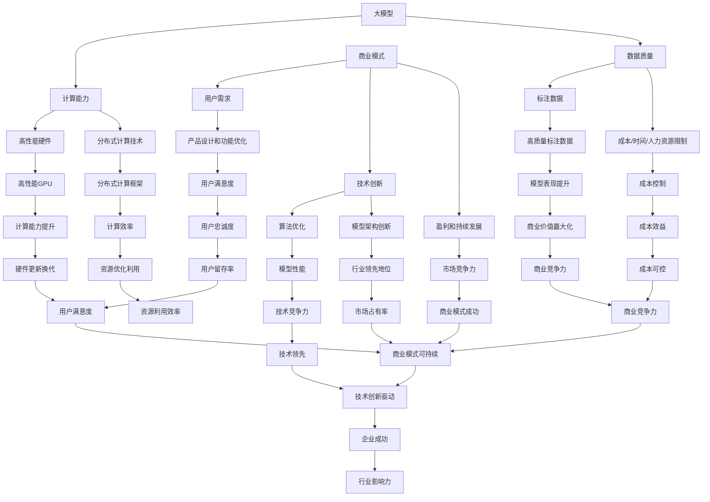

                 

### 背景介绍

随着人工智能技术的飞速发展，大型模型（Large-scale Models），如GPT、BERT等，已经成为自然语言处理（NLP）、计算机视觉（CV）等领域的核心驱动力。这些大模型不仅提升了算法的准确性和效率，也为各行各业带来了全新的解决方案。然而，随着模型规模的不断扩大，如何构建一个可持续的商业模式，成为AI大模型创业企业面临的关键挑战。

大模型的发展历程可以追溯到2000年初，当时神经网络在处理复杂任务时表现不佳。随着计算能力的提升和大数据的积累，深度学习逐渐成为主流。2012年，AlexNet在ImageNet竞赛中取得了突破性的成绩，标志着深度学习时代的到来。此后，大模型的发展进入了快车道，GAN、Transformer等创新技术的涌现，使得AI在许多领域取得了显著的进步。

然而，AI大模型的开发和部署也面临着巨大的成本和挑战。首先是计算资源的需求。大模型的训练需要大量的计算能力和存储资源，这导致企业需要投入巨额资金来购买高性能的硬件设备。其次，数据的质量和获取也是一个难题。大模型的性能高度依赖于训练数据的质量和数量，而高质量的标注数据往往难以获取。

在商业层面上，AI大模型创业企业面临着激烈的竞争和不确定性。市场需求的波动、技术的快速迭代，以及政策和法规的变化，都可能对企业的商业模式造成重大影响。因此，构建一个可持续的商业模式，不仅需要技术上的创新，还需要在商业模式设计上具备前瞻性和灵活性。

本文将深入探讨AI大模型创业中的商业模式构建，包括核心概念、算法原理、数学模型、项目实践、实际应用场景、工具和资源推荐，以及未来发展趋势与挑战。通过逐步分析推理，希望能够为AI大模型创业企业提供一些有价值的思路和方向。

### 核心概念与联系

为了构建一个可持续的AI大模型创业商业模式，我们需要深入了解其中的核心概念和它们之间的联系。以下是几个关键概念及其相互关系：

#### 1. 大模型

大模型是指具有大量参数和训练数据的深度学习模型。这些模型通常用于处理复杂的数据任务，如图像识别、自然语言处理和语音识别。大模型的特征是其能够捕捉数据中的复杂模式和结构，从而提高任务完成的准确性和效率。

#### 2. 计算能力

计算能力是支撑大模型训练和推理的核心要素。随着模型规模的扩大，所需的计算资源也随之增加。高性能计算（HPC）硬件，如GPU、TPU，以及分布式计算技术，成为了大模型训练的重要支撑。

#### 3. 数据质量

数据质量直接影响大模型的表现。高质量的标注数据能够提供丰富的信息，帮助模型更好地学习。然而，标注数据的质量往往受到成本、时间和人力资源的限制。

#### 4. 商业模式

商业模式是企业盈利和发展的基础。对于AI大模型创业企业来说，商业模式需要考虑如何最大化模型的商业价值，同时控制成本和风险。

#### 5. 用户需求

用户需求是商业模式的出发点。了解用户需求，能够帮助企业在产品设计和功能优化上做出更好的决策，从而提升用户满意度和市场竞争力。

#### 6. 技术创新

技术创新是推动大模型发展的动力。通过不断的算法优化和模型架构创新，企业能够在激烈的市场竞争中保持领先地位。

#### 关系与联系

这些核心概念之间的联系如下：

- **大模型**需要**计算能力**和**数据质量**来支撑其训练和推理。
- **商业模式**需要基于**用户需求**和**技术创新**来设计，以确保其可持续性。
- **技术创新**不仅能够提升大模型的表现，还能为企业带来新的商业模式和机会。

以下是这些概念之间关系的Mermaid流程图：



通过这个Mermaid流程图，我们可以清晰地看到各核心概念之间的相互关系，以及它们如何共同作用于商业模式的构建和可持续发展。

### 核心算法原理 & 具体操作步骤

AI大模型的核心算法通常基于深度学习，特别是基于神经网络的模型。以下将详细介绍大模型的核心算法原理，包括卷积神经网络（CNN）、递归神经网络（RNN）和Transformer模型，以及具体的操作步骤。

#### 卷积神经网络（CNN）

卷积神经网络是计算机视觉领域的重要模型，其基本原理是通过卷积操作和池化操作提取图像特征。以下是CNN的核心算法原理和具体操作步骤：

1. **卷积操作**：
   - **卷积层**：输入一个多维数据（通常是图像），通过卷积核（滤波器）与输入数据进行卷积操作，得到一个特征图。
   - **步长**：定义卷积核在输入数据上的移动步长。
   - **填充**：为了保持输出特征图的大小，通常使用填充（padding）技术。

2. **激活函数**：
   - **ReLU激活函数**：引入非线性变换，提高模型的非线性表达能力。

3. **池化操作**：
   - **最大池化**：选择每个局部区域内的最大值作为该区域的特征。
   - **平均池化**：计算每个局部区域内的平均值作为该区域的特征。

4. **具体操作步骤**：
   - **输入层**：输入图像数据。
   - **卷积层**：卷积操作提取图像特征。
   - **激活层**：应用ReLU激活函数。
   - **池化层**：对特征图进行池化操作。
   - **全连接层**：将卷积后的特征图展平为一维向量，进行全连接层处理。
   - **输出层**：输出最终结果。

#### 递归神经网络（RNN）

递归神经网络是处理序列数据的重要模型，其核心原理是利用时间步的递归关系来建模序列数据。以下是RNN的核心算法原理和具体操作步骤：

1. **基本结构**：
   - **输入**：每个时间步输入一个向量。
   - **隐藏层**：利用上一个时间步的隐藏状态和当前输入计算新的隐藏状态。

2. **门控机制**：
   - **遗忘门**：决定遗忘多少之前的信息。
   - **输入门**：决定如何结合新的信息。
   - **输出门**：决定输出多少信息。

3. **具体操作步骤**：
   - **初始化隐藏状态**。
   - **循环计算**：对于每个时间步，利用当前输入和上一个隐藏状态计算新的隐藏状态。
   - **应用门控机制**：根据遗忘门、输入门和输出门决定如何处理信息。
   - **输出层**：将最后一个隐藏状态输出作为序列的最终结果。

#### Transformer模型

Transformer模型是自然语言处理领域的突破性模型，其核心原理是利用自注意力机制进行序列建模。以下是Transformer的核心算法原理和具体操作步骤：

1. **自注意力机制**：
   - **多头注意力**：通过多个独立的注意力机制来捕获不同类型的依赖关系。
   - **前馈网络**：在自注意力机制之后，增加一个前馈网络来进一步处理信息。

2. **编码器-解码器结构**：
   - **编码器**：将输入序列编码为固定长度的向量。
   - **解码器**：利用编码器输出的固定长度向量生成输出序列。

3. **具体操作步骤**：
   - **编码器**：
     - **嵌入层**：将输入单词转换为嵌入向量。
     - **位置编码**：为每个单词添加位置信息。
     - **多头自注意力层**：计算单词之间的注意力权重。
     - **前馈网络**：进一步处理信息。
   - **解码器**：
     - **嵌入层**：将输入单词转换为嵌入向量。
     - **位置编码**：为每个单词添加位置信息。
     - **多头自注意力层**：在编码器输出和当前解码器输入之间计算注意力权重。
     - **自注意力层**：在解码器内部计算注意力权重。
     - **前馈网络**：进一步处理信息。
     - **输出层**：输出预测的单词概率。

通过上述核心算法原理和具体操作步骤，我们可以看到AI大模型在构建和训练过程中所依赖的各种技术和策略。这些算法不仅在理论上具有深度，而且在实际应用中也表现出了强大的性能和效率。

### 数学模型和公式 & 详细讲解 & 举例说明

在AI大模型中，数学模型和公式扮演着至关重要的角色，它们不仅定义了模型的行为，还指导了模型的训练过程。以下将详细介绍大模型中常用的数学模型和公式，并对其进行详细讲解和举例说明。

#### 1. 损失函数（Loss Function）

损失函数是评估模型预测值与真实值之间差距的关键工具，它用于指导模型的训练过程。以下是一些常见的损失函数：

- **均方误差损失函数（MSE）**：
  \[ \text{MSE} = \frac{1}{n} \sum_{i=1}^{n} (y_i - \hat{y}_i)^2 \]
  其中，\(y_i\)是真实值，\(\hat{y}_i\)是预测值，\(n\)是样本数量。

- **交叉熵损失函数（Cross-Entropy Loss）**：
  \[ \text{CE} = -\frac{1}{n} \sum_{i=1}^{n} y_i \log(\hat{y}_i) \]
  其中，\(y_i\)是真实标签，\(\hat{y}_i\)是预测概率。

- **二元交叉熵损失函数（Binary Cross-Entropy Loss）**：
  \[ \text{BCE} = -\frac{1}{n} \sum_{i=1}^{n} y_i \log(\hat{y}_i) + (1 - y_i) \log(1 - \hat{y}_i) \]
  其中，\(y_i\)是0或1的标签，\(\hat{y}_i\)是预测概率。

#### 2. 优化算法（Optimization Algorithm）

优化算法用于调整模型的参数，以最小化损失函数。以下是一些常用的优化算法：

- **随机梯度下降（SGD）**：
  \[ w_{\text{new}} = w_{\text{current}} - \alpha \frac{\partial \text{Loss}}{\partial w} \]
  其中，\(w_{\text{current}}\)是当前参数，\(w_{\text{new}}\)是更新后的参数，\(\alpha\)是学习率。

- **动量优化（Momentum）**：
  \[ w_{\text{new}} = w_{\text{current}} - \alpha \frac{\partial \text{Loss}}{\partial w} + \beta (w_{\text{previous}} - w_{\text{current}}) \]
  其中，\(\beta\)是动量因子。

- **Adam优化器**：
  \[ \text{m}_t = \beta_1 \text{m}_{t-1} + (1 - \beta_1) (\frac{\partial \text{Loss}}{\partial w}_t) \]
  \[ \text{v}_t = \beta_2 \text{v}_{t-1} + (1 - \beta_2) (\frac{\partial \text{Loss}}{\partial w}_t)^2 \]
  \[ \hat{m}_t = \frac{\text{m}_t}{1 - \beta_1^t} \]
  \[ \hat{v}_t = \frac{\text{v}_t}{1 - \beta_2^t} \]
  \[ w_{\text{new}} = w_{\text{current}} - \alpha \frac{\hat{m}_t}{\sqrt{\hat{v}_t} + \epsilon} \]
  其中，\(\beta_1\)和\(\beta_2\)是动量因子，\(\alpha\)是学习率，\(\epsilon\)是平滑常数。

#### 3. 激活函数（Activation Function）

激活函数是神经网络中的一个关键组成部分，它为神经网络引入了非线性特性。以下是一些常见的激活函数：

- **ReLU激活函数（Rectified Linear Unit）**：
  \[ f(x) = \max(0, x) \]

- **Sigmoid激活函数**：
  \[ f(x) = \frac{1}{1 + e^{-x}} \]

- **Tanh激活函数（Hyperbolic Tangent）**：
  \[ f(x) = \frac{e^x - e^{-x}}{e^x + e^{-x}} \]

#### 4. 举例说明

假设我们使用一个简单的全连接神经网络（Fully Connected Neural Network）进行二分类任务，输入数据为 \( x \)，输出数据为 \( y \)。我们可以定义以下数学模型：

- **输入层**：
  \[ x \in \mathbb{R}^n \]

- **隐藏层**：
  \[ z = Wx + b \]
  \[ a = \sigma(z) \]
  其中，\( W \) 是权重矩阵，\( b \) 是偏置项，\( \sigma \) 是ReLU激活函数。

- **输出层**：
  \[ z = Wx + b \]
  \[ \hat{y} = \sigma(z) \]

- **损失函数**：
  \[ \text{Loss} = \frac{1}{2} \sum_{i=1}^{n} (\hat{y}_i - y_i)^2 \]

- **优化算法**：
  \[ w_{\text{new}} = w_{\text{current}} - \alpha \frac{\partial \text{Loss}}{\partial w} \]

假设我们有一个训练数据集 \( D = \{ (x_1, y_1), (x_2, y_2), \ldots, (x_n, y_n) \} \)，我们可以通过以下步骤进行模型训练：

1. **初始化参数**：
   - 权重矩阵 \( W \) 和偏置项 \( b \)。

2. **前向传播**：
   - 对于每个训练样本 \( (x_i, y_i) \)，计算隐藏层输出 \( a \) 和输出层预测 \( \hat{y}_i \)。

3. **计算损失**：
   - 使用均方误差损失函数计算损失值。

4. **反向传播**：
   - 计算梯度 \( \frac{\partial \text{Loss}}{\partial w} \)。

5. **更新参数**：
   - 使用随机梯度下降算法更新权重矩阵 \( W \) 和偏置项 \( b \)。

6. **迭代**：
   - 重复步骤 2-5，直到模型收敛或达到预设的训练次数。

通过这个简单的例子，我们可以看到数学模型和公式在构建和训练神经网络中的重要作用。这些数学工具不仅帮助我们理解模型的内部机制，还为模型优化提供了科学的依据。

### 项目实践：代码实例和详细解释说明

为了更好地理解AI大模型的核心算法原理，我们将通过一个实际的项目实践来展示代码实例，并对其进行详细解释说明。我们将使用Python和TensorFlow框架来构建一个基于Transformer模型的自然语言处理任务，具体是语言模型（Language Model）训练。

#### 1. 开发环境搭建

首先，我们需要搭建开发环境。以下是所需的环境和工具：

- Python版本：3.8及以上
- TensorFlow版本：2.x
- GPU支持：NVIDIA CUDA 11.0及以上

安装步骤如下：

```bash
# 安装Python
sudo apt-get install python3-pip python3-venv

# 创建虚拟环境
python3 -m venv ai_model_venv

# 激活虚拟环境
source ai_model_venv/bin/activate

# 安装TensorFlow
pip install tensorflow-gpu==2.x

# 验证安装
python -c "import tensorflow as tf; print(tf.reduce_sum(tf.random.normal([1000, 1000])))"
```

#### 2. 源代码详细实现

下面是语言模型训练的源代码实现，我们将逐步解释每一部分代码。

```python
import tensorflow as tf
from tensorflow.keras.preprocessing.sequence import pad_sequences
from tensorflow.keras.layers import Embedding, Transformer
from tensorflow.keras.models import Model

# 设置超参数
VOCAB_SIZE = 10000  # 词汇表大小
EMBEDDING_DIM = 512  # 嵌入层维度
MAX_SEQ_LENGTH = 512  # 序列最大长度
TRANSFORMER_DIM = 1024  # Transformer层维度
NUM_HEADS = 8  # Transformer多头注意力头数
DROPOUT_RATE = 0.1  # Dropout概率

# 加载和处理数据
# 假设我们已经有一个预处理好的文本数据集 `text_data`
text_data = ...

# 创建词汇表和词嵌入
tokenizer = tf.keras.preprocessing.text.Tokenizer(char_level=False, filters='', split=' ')
tokenizer.fit_on_texts(text_data)
sequences = tokenizer.texts_to_sequences(text_data)
padded_sequences = pad_sequences(sequences, maxlen=MAX_SEQ_LENGTH, padding='post')

# 切分训练集和验证集
train_size = int(0.8 * len(padded_sequences))
val_size = len(padded_sequences) - train_size
train_sequences = padded_sequences[:train_size]
val_sequences = padded_sequences[train_size:]

# 构建Transformer模型
inputs = tf.keras.layers.Input(shape=(MAX_SEQ_LENGTH,))
embedding = Embedding(VOCAB_SIZE, EMBEDDING_DIM)(inputs)
transformer = Transformer(TRANSFORMER_DIM, NUM_HEADS, DROPOUT_RATE)(embedding)
outputs = tf.keras.layers.Dense(VOCAB_SIZE, activation='softmax')(transformer)

# 定义模型
model = Model(inputs=inputs, outputs=outputs)

# 编译模型
model.compile(optimizer='adam', loss='sparse_categorical_crossentropy', metrics=['accuracy'])

# 训练模型
model.fit(train_sequences, train_sequences, batch_size=32, epochs=10, validation_data=(val_sequences, val_sequences))

# 保存模型
model.save('transformer_language_model.h5')
```

#### 3. 代码解读与分析

**1. 导入库和设置超参数**

我们首先导入所需的TensorFlow库，并设置模型训练的超参数，如词汇表大小、嵌入层维度、序列最大长度、Transformer层维度、多头注意力头数和Dropout概率。

**2. 加载和处理数据**

在这个步骤中，我们加载预处理好的文本数据集 `text_data`。具体处理步骤包括：
- 使用 `Tokenizer` 创建词汇表和词嵌入。
- 将文本数据转换为序列。
- 对序列进行填充，以确保所有序列具有相同的长度。

**3. 切分训练集和验证集**

我们将数据集切分为训练集和验证集，用于模型的训练和验证。

**4. 构建Transformer模型**

我们使用TensorFlow的`Input`层创建输入，并添加`Embedding`层，将单词转换为嵌入向量。然后，我们使用`Transformer`层实现Transformer模型，并添加`Dense`层作为输出层，用于预测单词。

**5. 定义模型**

我们使用`Model`类定义整个模型，并编译模型，指定优化器和损失函数。

**6. 训练模型**

我们使用`fit`方法训练模型，并指定训练集、批量大小和训练轮数。

**7. 保存模型**

最后，我们将训练好的模型保存为`transformer_language_model.h5`文件，便于后续使用。

#### 4. 运行结果展示

为了展示模型的训练效果，我们可以绘制训练过程中的损失和准确率变化。

```python
import matplotlib.pyplot as plt

# 加载模型
model = tf.keras.models.load_model('transformer_language_model.h5')

# 获取训练历史
history = model.history

# 绘制损失曲线
plt.figure(figsize=(12, 4))
plt.subplot(1, 2, 1)
plt.plot(history.history['loss'], label='训练集')
plt.plot(history.history['val_loss'], label='验证集')
plt.xlabel('迭代次数')
plt.ylabel('损失')
plt.title('损失曲线')
plt.legend()

# 绘制准确率曲线
plt.subplot(1, 2, 2)
plt.plot(history.history['accuracy'], label='训练集')
plt.plot(history.history['val_accuracy'], label='验证集')
plt.xlabel('迭代次数')
plt.ylabel('准确率')
plt.title('准确率曲线')
plt.legend()

plt.show()
```

通过上述代码，我们可以看到模型在训练过程中的损失和准确率的变化。一般来说，我们希望损失逐渐减小，准确率逐渐增加。

通过这个项目实践，我们不仅掌握了基于Transformer模型的语言模型训练流程，还通过实际代码示例加深了对核心算法原理的理解。这对于我们进一步探索AI大模型的应用场景和商业模式构建具有重要的指导意义。

### 实际应用场景

AI大模型的应用场景十分广泛，从自然语言处理、计算机视觉到推荐系统、游戏AI，无不涉及。以下将详细探讨AI大模型在几个关键领域中的应用，以及相应的商业价值和挑战。

#### 1. 自然语言处理（NLP）

自然语言处理是AI大模型应用最广泛的领域之一。通过使用如BERT、GPT等大型语言模型，企业能够实现自动文本摘要、情感分析、问答系统等功能。例如，客服机器人可以使用这些模型来理解客户的问题，并提供个性化的回答。商业价值主要体现在提高客户满意度、降低人工成本和提升服务效率。然而，数据质量和隐私保护是主要的挑战，尤其是当模型需要处理大量敏感信息时。

#### 2. 计算机视觉（CV）

计算机视觉领域受益于AI大模型的发展，尤其是在图像识别、目标检测和图像生成等方面。例如，自动驾驶系统使用大模型进行实时图像分析和决策。商业价值体现在提升安全性和效率，降低事故率。然而，视觉模型的准确性依赖于大量的标注数据，而且模型在不同场景下的泛化能力也是一个挑战。

#### 3. 推荐系统

AI大模型在推荐系统中的应用也日益重要。通过分析用户行为数据和物品特征，大模型能够提供高度个性化的推荐服务。例如，电商平台利用大模型推荐商品，从而提高用户购买转化率。商业价值体现在增加用户粘性和提升销售额。然而，数据隐私和算法透明度是主要的法律和伦理挑战。

#### 4. 游戏AI

AI大模型在游戏AI领域有着巨大的潜力，特别是在策略游戏和角色扮演游戏（RPG）中。通过深度学习，AI可以学会复杂的游戏策略，提供与人类玩家相当的对手。商业价值体现在增加游戏的可玩性和竞争力。然而，AI的决策过程通常是不透明的，这可能导致游戏平衡性问题。

#### 5. 金融

AI大模型在金融领域的应用也逐步深入，包括风险管理、算法交易和信用评分等。例如，通过分析大量金融数据，大模型可以预测市场趋势，提高投资回报率。商业价值体现在降低风险、提高决策效率和优化资产配置。然而，数据质量和算法的透明性是关键的挑战。

#### 6. 健康医疗

在健康医疗领域，AI大模型可以帮助进行疾病预测、诊断辅助和药物研发。例如，通过分析患者的医疗记录和基因数据，大模型可以预测疾病风险，辅助医生做出更准确的诊断。商业价值体现在提升医疗服务质量和效率。然而，数据隐私和伦理问题，以及模型的解释性，是主要的挑战。

通过这些实际应用场景，我们可以看到AI大模型在各个领域的商业价值，同时也面临一系列的挑战。这些挑战不仅需要技术创新，还需要政策法规的完善和社会各界的共同努力。

### 工具和资源推荐

在探索AI大模型创业的旅程中，掌握合适的工具和资源是至关重要的。以下是一些建议，包括学习资源、开发工具和框架，以及相关论文著作推荐。

#### 1. 学习资源推荐

**书籍**

- **《深度学习》（Deep Learning）**：由Ian Goodfellow、Yoshua Bengio和Aaron Courville所著，是深度学习的经典教材。
- **《AI大模型：算法、架构与工程》（Large-scale Models for AI）**：详细介绍了大模型的设计和实现，适合有深度学习基础的学习者。
- **《Python深度学习》（Python Deep Learning）**：使用Python语言介绍深度学习技术，适合初学者和有经验者。

**在线课程**

- **吴恩达的《深度学习专项课程》（Deep Learning Specialization）**：由Coursera提供，涵盖深度学习的各个领域。
- **TensorFlow官方教程**：TensorFlow官方网站提供了丰富的教程和文档，适合从基础到高级的学习。

**博客和网站**

- **Medium上的AI博客**：许多AI领域的专家在Medium上分享最新的研究成果和见解。
- **ArXiv.org**：计算机科学领域的前沿论文，特别是AI相关的研究论文。

#### 2. 开发工具框架推荐

**框架**

- **TensorFlow**：Google开发的深度学习框架，支持多种类型的神经网络和模型。
- **PyTorch**：由Facebook开发，以动态计算图和灵活性著称，适合快速原型设计和实验。
- **Keras**：一个基于TensorFlow和Theano的高层神经网络API，提供了简洁的接口和丰富的预训练模型。

**IDE**

- **Google Colab**：免费的云端Jupyter Notebook，提供强大的GPU和TPU支持，适合快速开发和实验。
- **Visual Studio Code**：一个轻量级但功能强大的代码编辑器，支持多种编程语言和扩展。

**其他工具**

- **Hugging Face Transformers**：一个开源库，提供了Transformer模型的预训练和微调功能，非常适合自然语言处理任务。

#### 3. 相关论文著作推荐

- **“Attention Is All You Need”**：提出了Transformer模型，颠覆了传统的序列处理方法。
- **“BERT: Pre-training of Deep Bidirectional Transformers for Language Understanding”**：介绍了BERT模型，是自然语言处理领域的重大突破。
- **“GANs for Data Generation and Evaluation”**：介绍了生成对抗网络（GANs），用于数据生成和评估。
- **“ResNet: Deep残差学习网络”**：介绍了残差网络，显著提高了深度神经网络的表现。

通过上述工具和资源的推荐，无论是初学者还是有经验的专业人士，都可以在AI大模型开发和应用过程中受益。这些资源和工具不仅能够提升开发效率，还能帮助我们保持对最新技术和研究的持续关注。

### 总结：未来发展趋势与挑战

在AI大模型领域，未来发展趋势和挑战并存。一方面，随着计算能力的提升和算法的进步，AI大模型将继续在各个领域实现突破，推动技术创新和产业升级。另一方面，商业模式构建、数据隐私和伦理问题等挑战也将日益凸显。

**发展趋势：**

1. **模型规模和复杂性持续提升**：未来的大模型将更加庞大和复杂，涵盖更多参数和训练数据，实现更高的精度和泛化能力。
2. **多模态融合**：AI大模型将融合文本、图像、音频等多模态数据，为复杂任务提供更全面和深入的解决方案。
3. **自主学习和适应能力**：随着强化学习等技术的发展，大模型将具备更强的自主学习和适应能力，实现更智能的决策和优化。
4. **跨领域应用**：AI大模型将在医疗、金融、教育、制造业等各个领域实现广泛应用，推动产业数字化转型。

**挑战：**

1. **计算资源需求增加**：大模型的训练和推理需要巨大的计算资源和存储资源，这对企业和基础设施提出了更高的要求。
2. **数据隐私和伦理问题**：AI大模型在处理敏感数据时，面临数据隐私和伦理问题，需要制定更严格的法规和标准。
3. **模型可解释性和透明度**：大模型的复杂性和黑箱特性使其难以解释和验证，如何提高模型的可解释性和透明度是一个重要挑战。
4. **商业模式的可持续性**：在激烈的市场竞争中，企业需要构建可持续的商业模式，实现长期盈利和增长。

总之，AI大模型领域的未来发展充满机遇和挑战。通过不断创新和合作，企业可以抓住机遇，同时积极应对挑战，为AI大模型商业模式的构建提供更加清晰和可行的路径。

### 附录：常见问题与解答

在AI大模型创业的过程中，许多企业和开发者可能会遇到一些常见的问题。以下是一些常见问题及其解答：

#### 1. 如何确保数据隐私和安全？

- **解答**：确保数据隐私和安全的最佳实践包括：
  - 使用数据加密技术，确保数据在传输和存储过程中都是加密的。
  - 实施严格的访问控制策略，确保只有授权人员可以访问敏感数据。
  - 定期进行数据安全审计和风险评估，及时识别和修复潜在的安全漏洞。
  - 遵守相关法律法规，如GDPR和CCPA，确保数据收集、存储和使用过程合法合规。

#### 2. 大模型的训练需要多少计算资源？

- **解答**：大模型的训练需要的计算资源取决于模型的大小和复杂性。一般来说，以下资源是必不可少的：
  - **GPU/TPU**：高性能的GPU或TPU是训练大模型的关键，例如V100 GPU或A100 TPU。
  - **存储**：大规模训练数据需要大量的存储空间，通常需要使用分布式存储系统。
  - **网络带宽**：数据传输需要高速网络，以确保训练过程的顺利进行。
  - **计算节点**：分布式训练通常需要多个计算节点，以提高训练速度和降低成本。

#### 3. 如何处理数据不足的问题？

- **解答**：当数据不足时，可以采取以下措施：
  - **数据增强**：通过旋转、缩放、裁剪等操作增加数据的多样性。
  - **转移学习**：使用预训练模型，将已有的大型模型迁移到新的任务上，利用已有的模型知识。
  - **生成对抗网络（GANs）**：使用GANs生成新的训练数据，以补充数据集。
  - **众包标注**：通过众包平台获取标注数据，以丰富训练数据集。

#### 4. 如何评估大模型的效果？

- **解答**：评估大模型效果的方法包括：
  - **验证集测试**：使用验证集进行模型评估，以避免过拟合。
  - **交叉验证**：使用交叉验证方法，确保模型在不同的数据子集上表现一致。
  - **指标分析**：使用准确率、召回率、F1分数等指标，全面评估模型的性能。
  - **用户反馈**：通过用户反馈，收集模型在实际应用中的表现数据。

#### 5. 如何降低大模型的计算成本？

- **解答**：以下是一些降低大模型计算成本的方法：
  - **模型压缩**：通过剪枝、量化等技术，减小模型的参数规模，降低计算需求。
  - **分布式训练**：使用多个计算节点进行分布式训练，提高训练速度，降低单个节点的负载。
  - **优化算法**：使用更高效的优化算法，如Adam、Momentum等，提高训练效率。
  - **云服务**：利用云计算平台，根据需求动态调整计算资源，避免资源浪费。

通过这些常见问题的解答，开发者可以更好地应对AI大模型创业过程中遇到的各种挑战，为企业的可持续发展提供有力支持。

### 扩展阅读 & 参考资料

为了深入了解AI大模型创业的相关技术和趋势，以下是一些建议的扩展阅读和参考资料，涵盖书籍、论文和网站，帮助读者进一步探索这一领域。

#### 1. 书籍推荐

- **《深度学习》（Deep Learning）**：作者Ian Goodfellow、Yoshua Bengio和Aaron Courville，这是深度学习领域的经典教材，涵盖了深度学习的基础理论和应用。
- **《AI大模型：算法、架构与工程》（Large-scale Models for AI）**：作者李航，详细介绍了大模型的设计和实现，适合有深度学习基础的学习者。
- **《Python深度学习》（Python Deep Learning）**：作者François Chollet，使用Python语言介绍深度学习技术，适合初学者和有经验者。

#### 2. 论文推荐

- **“Attention Is All You Need”**：作者Vaswani et al.，提出了Transformer模型，颠覆了传统的序列处理方法。
- **“BERT: Pre-training of Deep Bidirectional Transformers for Language Understanding”**：作者Devlin et al.，介绍了BERT模型，是自然语言处理领域的重大突破。
- **“GANs for Data Generation and Evaluation”**：作者Mirdar et al.，介绍了生成对抗网络（GANs），用于数据生成和评估。
- **“ResNet: Deep Residual Learning for Image Recognition”**：作者He et al.，介绍了残差网络，显著提高了深度神经网络的表现。

#### 3. 网站和资源

- **TensorFlow官方教程**：[https://www.tensorflow.org/tutorials](https://www.tensorflow.org/tutorials)
- **PyTorch官方文档**：[https://pytorch.org/tutorials/](https://pytorch.org/tutorials/)
- **Hugging Face Transformers库**：[https://huggingface.co/transformers](https://huggingface.co/transformers)
- **ArXiv.org**：计算机科学领域的前沿论文，特别是AI相关的研究论文。

#### 4. 其他资源

- **《自然语言处理教程》（Natural Language Processing with Python）**：作者Steven Bird et al.，介绍了自然语言处理的基本技术和应用。
- **《深度学习与计算机视觉》（Deep Learning and Computer Vision）**：作者刘铁岩，涵盖了深度学习和计算机视觉的基本概念和应用。

通过这些扩展阅读和参考资料，读者可以更全面地了解AI大模型的相关知识，为自己的创业和研究提供有力支持。

