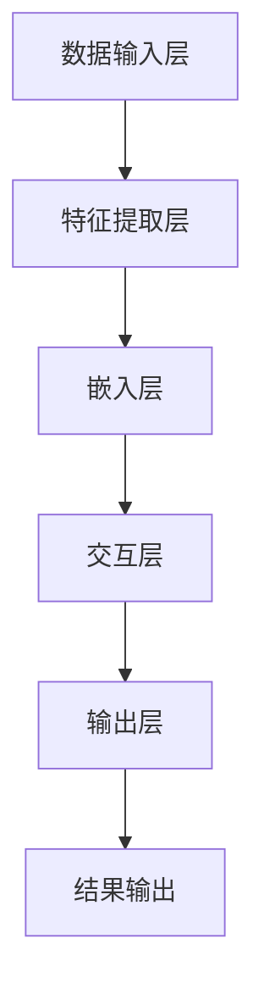

                 

### 1. 背景介绍

#### AI大模型的发展历程

人工智能（AI）作为计算机科学的前沿领域，始终引领着技术进步的浪潮。特别是近年来，随着计算能力的提升、大数据的积累和深度学习算法的发展，AI大模型（Large-scale AI Models）逐渐成为AI研究与应用的核心方向。AI大模型，顾名思义，是指具有大规模参数、能够处理海量数据并产生复杂决策和生成能力的机器学习模型。它们在自然语言处理（NLP）、计算机视觉（CV）、语音识别（ASR）等众多领域取得了显著的成果。

AI大模型的发展历程可以分为以下几个阶段：

1. **早期研究**：在20世纪50年代至70年代，研究人员开始探索如何通过编程来模拟人类的认知过程，这一时期的代表包括逻辑推理、知识表示等。然而，由于计算能力的限制，这些模型的应用范围非常有限。

2. **统计模型兴起**：从20世纪80年代开始，随着统计学和概率论的引入，机器学习领域迎来了新的发展。例如，支持向量机（SVM）和朴素贝叶斯分类器等模型在图像识别、文本分类等方面取得了突破。

3. **深度学习崛起**：2006年，深度学习的概念被提出，随后卷积神经网络（CNN）和循环神经网络（RNN）等模型相继问世。特别是2012年，AlexNet在ImageNet竞赛中取得巨大成功，深度学习开始进入主流视野。

4. **AI大模型时代**：近年来，随着计算资源、数据集和算法的不断发展，AI大模型迎来了爆发式增长。例如，GPT-3、BERT、ViT等模型在NLP、CV等领域的应用，使得AI的能力达到了前所未有的高度。

#### AI大模型在创业中的应用

AI大模型的出现，为创业者提供了前所未有的机遇。无论是在产品开发、商业模式设计，还是在团队建设、市场推广等方面，AI大模型都带来了深刻的变革。

1. **产品开发**：AI大模型能够处理和分析海量数据，使得创业者能够开发出更加智能、个性化的产品。例如，基于GPT-3的聊天机器人，可以模拟人类的对话，提供24/7的客户服务。

2. **商业模式**：AI大模型降低了创业者的门槛，使得小团队也能够开发出具有竞争力的产品。此外，通过数据驱动的方式，创业者能够更好地理解用户需求，优化产品和服务，从而实现持续增长。

3. **团队建设**：AI大模型的使用，减轻了团队成员的负担，使得人们可以更多地专注于创新和策略。同时，AI大模型能够协助团队成员进行决策，提供基于数据的洞见。

4. **市场推广**：AI大模型可以帮助创业者更好地了解市场趋势和用户需求，从而制定更有效的市场推广策略。例如，通过自然语言处理技术，创业者可以分析社交媒体上的用户评论和反馈，快速调整产品定位和市场策略。

#### 当前AI大模型创业的热潮

近年来，随着AI技术的不断成熟，AI大模型创业的热潮不断涌现。许多创业者纷纷投身于这一领域，希望通过AI大模型来实现商业成功。以下是几个值得关注的现象：

1. **初创公司激增**：许多初创公司致力于开发和应用AI大模型，特别是在NLP、CV等领域。这些公司通过创新的技术和商业模式，取得了显著的市场份额。

2. **投资热潮**：AI大模型创业领域吸引了大量的风险投资。投资者们看到了AI技术带来的巨大潜力，纷纷加大了对AI大模型创业项目的投资力度。

3. **跨界合作**：许多传统行业的企业也开始与AI公司合作，通过引入AI大模型来提升自身业务的竞争力。这种跨界合作，不仅促进了AI技术的发展，也为传统行业带来了新的活力。

4. **政策支持**：各国政府纷纷出台政策，支持AI技术的发展和应用。这些政策为AI大模型创业提供了良好的环境，进一步推动了AI大模型创业的热潮。

总的来说，AI大模型创业不仅为创业者提供了丰富的机遇，也带来了巨大的挑战。在接下来的部分，我们将进一步探讨AI大模型创业的挑战和机遇，帮助创业者更好地应对未来的发展。

#### 当前AI大模型创业的现状

在AI大模型创业的热潮中，当前的市场状况展现出了多样化和高度竞争的特点。从初创公司的数量和融资情况，到应用场景的多样性和技术壁垒，都反映出AI大模型创业领域的独特生态。

首先，初创公司的数量大幅增加。根据市场研究机构的统计，近年来全球范围内专注于AI大模型开发和应用的创新公司数量呈现指数级增长。特别是在NLP、CV、语音识别等热门领域，初创公司如雨后春笋般涌现。这些公司通过独特的技术优势和创新的商业模式，试图在激烈的市场竞争中脱颖而出。

其次，融资情况火爆。AI大模型创业公司普遍获得了大量的风险投资。根据统计数据，2022年全球AI领域融资总额创下新高，许多AI大模型创业公司获得了数百万到数亿美元的投资。这些资金不仅为公司的技术研发和团队建设提供了保障，也推动了AI大模型技术的快速迭代和应用。

然而，市场状况也高度竞争。AI大模型创业领域的竞争主要集中在技术、数据和商业化三个方面。在技术上，如何设计出更高效、更强大的大模型成为各大公司争相研究的热点。例如，在NLP领域，GPT-3和BERT等模型的成功，使得其他公司纷纷投入大量资源进行改进和优化。在数据上，拥有丰富、高质量的数据集是开发优质AI大模型的关键。因此，许多公司通过收购、合作和数据共享等方式，不断扩充自己的数据资源。在商业化方面，如何将AI大模型应用于实际业务，实现商业价值的最大化，也是各大公司竞相探索的方向。例如，一些公司通过提供定制化的AI解决方案，帮助企业提升生产效率、降低成本。

此外，AI大模型创业领域还存在一些显著的技术挑战。首先，计算资源的限制是一个重要问题。AI大模型通常需要大量的计算资源，而昂贵的计算成本对于许多初创公司来说是一个巨大的负担。其次，数据隐私和安全也是一大挑战。在处理大量用户数据时，如何确保数据的安全性和隐私性，是每一个AI大模型创业公司必须面对的问题。最后，模型的解释性和可靠性也是一个亟待解决的问题。AI大模型往往被认为是“黑箱”，其决策过程难以解释和理解，这在某些应用场景中可能带来安全隐患。

总的来说，当前AI大模型创业的现状既充满机遇，也充满挑战。创业者们需要不断创新，应对技术、市场和商业环境的多重挑战，才能在这个充满竞争的领域中取得成功。

#### AI大模型创业领域的机遇

AI大模型创业领域为创业者提供了丰富的机遇，尤其是在技术创新、市场前景和商业潜力方面。以下是几个关键点：

1. **技术创新**：AI大模型技术的不断进步，为创业者提供了创新的契机。随着深度学习和神经网络的发展，AI大模型的能力逐渐增强。例如，GPT-3等语言模型的出现，使得自然语言处理的应用更加广泛和精确。这种技术进步不仅为创业者提供了强大的工具，也激发了他们的创新思维。

2. **市场前景**：AI大模型在多个领域展现出了巨大的市场前景。例如，在医疗健康领域，AI大模型可以用于疾病预测、诊断和个性化治疗；在金融领域，AI大模型可以用于风险控制和投资策略；在零售行业，AI大模型可以用于个性化推荐和智能客服。这些应用场景的多样化，为创业者提供了广阔的市场空间。

3. **商业潜力**：AI大模型的应用，不仅提高了效率和准确性，还创造了新的商业模式。例如，通过提供定制化的AI解决方案，创业者可以帮助企业实现数字化转型，提升竞争力。此外，AI大模型还可以用于广告投放、数据分析和自动化生产等领域，带来显著的商业价值。

具体来说，AI大模型在以下几方面为创业者带来了独特的机遇：

- **智能客服**：基于AI大模型的智能客服系统，可以提供24/7的高效、个性化服务，满足用户的即时需求。这种服务模式不仅提升了用户体验，也降低了企业的运营成本。

- **自动化生产**：在制造业中，AI大模型可以用于自动化生产线的优化和故障预测，提高生产效率和产品质量。例如，通过监控设备的运行状态，AI大模型可以提前预测设备故障，从而减少停机时间，提高生产效率。

- **个性化推荐**：在电子商务和媒体领域，AI大模型可以根据用户的行为和偏好，提供个性化的推荐服务。这种服务模式不仅提升了用户满意度，也增加了企业的销售额。

- **智能诊断**：在医疗领域，AI大模型可以用于疾病诊断和预测，提供精准、高效的医疗服务。例如，通过分析大量的医学数据，AI大模型可以识别早期疾病的症状，从而提高治愈率和生存率。

- **数据安全**：AI大模型在数据分析和加密方面具有巨大潜力，可以帮助企业和个人保护数据安全。例如，通过加密算法和AI大模型相结合，可以实现对数据的高效加密和解密，防止数据泄露和滥用。

总之，AI大模型创业领域为创业者提供了丰富的机遇。通过技术创新、市场前瞻和商业模式的创新，创业者可以在这一领域中找到自己的定位，实现商业成功。

#### AI大模型创业领域的挑战

尽管AI大模型创业领域充满了机遇，但创业者同样面临着一系列严峻的挑战。这些挑战不仅涉及到技术层面，还包括商业环境、法规政策和社会伦理等方面。以下是几个主要的挑战：

1. **技术挑战**：AI大模型技术的开发和应用，需要克服多项技术挑战。首先，计算资源的需求巨大。AI大模型通常需要大量的计算资源和存储空间，这给初创公司带来了高昂的成本。其次，数据质量和数据隐私是重要问题。AI大模型的性能高度依赖于高质量的数据集，但数据的获取和处理过程中，往往涉及到隐私和数据安全的问题。此外，模型的解释性和可靠性也是一个重大挑战。AI大模型常常被认为是“黑箱”，其决策过程难以解释和理解，这在某些应用场景中可能带来安全隐患。

2. **商业挑战**：AI大模型创业的商业挑战同样不容忽视。首先，市场竞争力强。AI大模型创业领域竞争激烈，许多初创公司都在争夺有限的市场资源。其次，商业模式不清晰。虽然AI大模型在技术上有很大的潜力，但如何将其转化为实际的商业价值，还需要创业者深入探索。此外，创业公司的资金和资源有限，如何高效利用这些资源，实现业务的快速成长，也是一个关键问题。

3. **法规政策挑战**：法规政策的挑战也是AI大模型创业需要面对的问题。首先，数据隐私和安全的法规日益严格，创业者需要确保其产品和服务的合规性。例如，GDPR（欧盟通用数据保护条例）对数据隐私的保护非常严格，任何涉及个人数据的处理活动都必须严格遵守相关规定。其次，AI大模型在某些领域的应用可能受到法规的限制。例如，在医疗领域，AI大模型的诊断结果需要经过严格的临床验证，才能被正式应用。

4. **社会伦理挑战**：AI大模型在社会伦理方面也引发了广泛讨论。首先，AI大模型的决策过程缺乏透明度，可能带来道德和伦理问题。例如，AI大模型在招聘、信贷审批等场景中的歧视问题，引起了社会的高度关注。其次，AI大模型的滥用和误用风险也是一个重要问题。如果AI大模型被用于恶意攻击或违法行为，其社会影响可能极为严重。

总之，AI大模型创业领域充满了机遇，但也面临着多重挑战。创业者需要在技术创新、商业模式、法规政策和伦理道德等方面进行全面考虑，才能在这个充满竞争和不确定性的领域中取得成功。

#### AI大模型创业领域的成功案例

在AI大模型创业领域，许多公司凭借其独特的技术和市场策略，取得了显著的成就。以下是几个成功的案例：

1. **OpenAI**：OpenAI是一家总部位于美国的初创公司，致力于推动人工智能的研究和应用。其最著名的项目是GPT-3（Generative Pre-trained Transformer 3），这是一个具有1750亿参数的语言模型，能够在多种任务中实现高水平的表现。GPT-3的成功不仅证明了AI大模型技术的潜力，也为OpenAI带来了巨大的商业价值。通过开放API服务，OpenAI为企业提供了强大的自然语言处理能力，广泛应用于智能客服、内容生成和数据分析等领域。

2. **DeepMind**：DeepMind是一家英国的人工智能公司，以其在深度学习和强化学习领域的突破性成果而闻名。其最著名的项目是AlphaGo，这是一个在围棋游戏中战胜人类顶尖选手的AI程序。AlphaGo的成功引发了全球对AI技术的关注，DeepMind也迅速崛起为AI领域的领军企业。在成功推出AlphaGo后，DeepMind继续在AI大模型领域进行深入研究，开发了BERT（Bidirectional Encoder Representations from Transformers）等模型，并在自然语言处理领域取得了重要突破。

3. **Domino's Pizza**：虽然 Domino's Pizza 是一家传统的餐饮企业，但其通过引入AI技术，成功实现了业务模式的创新。Domino's开发了AI驱动的智能客服系统，通过语音识别和自然语言处理技术，实现了与顾客的实时互动。这一系统不仅提升了顾客体验，还显著降低了人力成本。此外，Domino's还利用AI大模型进行需求预测和库存管理，优化了运营效率，提高了整体盈利能力。

4. **Kite**：Kite是一家专注于医疗人工智能的初创公司，其产品Kite Health利用AI大模型进行疾病诊断和预测。Kite Health通过分析大量的医疗数据，能够提供准确、及时的诊断建议，帮助医生做出更明智的决策。这一产品在临床中取得了显著的效果，受到了医疗行业的广泛关注。Kite的成功不仅展示了AI大模型在医疗领域的潜力，也为其他医疗AI公司提供了成功的范例。

这些成功案例表明，AI大模型创业不仅需要技术创新，还需要深入理解和把握市场需求。通过不断创新和优化，AI大模型创业公司可以在激烈的市场竞争中脱颖而出，实现商业成功。

### 2. 核心概念与联系

#### 什么是AI大模型？

AI大模型（Large-scale AI Models），指的是参数量达到亿级或千亿级的人工智能模型。这些模型通过深度学习算法在大量数据上进行训练，能够实现高水平的任务表现。AI大模型的主要特点包括：

- **大规模参数**：AI大模型拥有数亿至数千亿的参数，这使得它们能够捕捉数据中的复杂模式和规律。

- **海量数据训练**：AI大模型需要大量的数据集进行训练，这些数据集通常包含数百万甚至数十亿个样本。

- **高精度任务表现**：通过大规模的训练和数据优化，AI大模型能够在各种任务中实现高精度的表现，例如图像识别、自然语言处理和语音识别。

#### AI大模型的技术架构

AI大模型的技术架构通常包括以下几个关键组成部分：

- **数据输入层**：这一层负责接收外部输入的数据，例如文本、图像或音频。

- **特征提取层**：在这一层，AI大模型通过卷积神经网络（CNN）、循环神经网络（RNN）或其他深度学习技术，提取数据的特征。

- **嵌入层**：嵌入层将提取的特征映射到高维空间，以便后续处理。

- **交互层**：交互层通过复杂的神经网络结构，实现特征之间的交互和整合。

- **输出层**：输出层负责生成最终的预测或决策结果。

#### AI大模型的核心算法原理

AI大模型的核心算法通常基于深度学习，主要包括以下几种：

- **卷积神经网络（CNN）**：CNN在图像识别和计算机视觉领域具有广泛应用。它通过卷积操作和池化操作，从图像中提取局部特征，然后通过多层神经网络进行整合，实现高精度的图像分类和识别。

- **循环神经网络（RNN）**：RNN在序列数据（如文本、语音）处理中表现出色。它通过记忆机制，捕捉序列中的时间依赖关系，实现文本生成、翻译和语音识别等任务。

- **生成对抗网络（GAN）**：GAN通过对抗训练的方式，生成逼真的图像和语音数据。它由生成器和判别器两个神经网络组成，生成器生成数据，判别器判断生成数据的真实性。

- **自注意力机制**：自注意力机制在自然语言处理领域广泛应用。它通过计算文本中每个词与其他词之间的关联强度，实现文本的精细解析和生成。

#### AI大模型与其他技术的联系

AI大模型与其他技术，如云计算、大数据和物联网（IoT）等，有着紧密的联系：

- **云计算**：云计算为AI大模型提供了强大的计算资源和存储能力，使得大规模数据处理和模型训练成为可能。

- **大数据**：大数据为AI大模型提供了丰富的训练数据集，提高了模型的准确性和泛化能力。

- **物联网（IoT）**：物联网设备产生的海量数据，为AI大模型提供了更多的应用场景，例如智能家居、智能城市和工业自动化等。

#### Mermaid流程图

以下是一个简单的Mermaid流程图，展示了AI大模型的技术架构：



通过这个流程图，我们可以清晰地看到AI大模型从数据输入到结果输出的整个过程。

### 3. 核心算法原理 & 具体操作步骤

#### GPT-3的工作原理

GPT-3（Generative Pre-trained Transformer 3）是OpenAI开发的一种AI大模型，它是基于Transformer架构的深度学习模型。GPT-3的工作原理可以分为以下几个步骤：

1. **数据预处理**：首先，GPT-3需要大量的文本数据作为训练数据。这些数据通常来自互联网上的各种文本资源，如新闻文章、社交媒体帖子、书籍等。在数据预处理阶段，GPT-3会对文本进行清洗和格式化，以确保数据的整洁和一致性。

2. **模型训练**：在数据预处理完成后，GPT-3开始进行模型训练。训练过程中，GPT-3通过优化大量的参数，学习如何生成文本。GPT-3的训练采用了一种称为“预训练-微调”的方法。首先，GPT-3在大规模文本数据上进行预训练，然后针对特定任务进行微调。

3. **文本生成**：在模型训练完成后，GPT-3可以用于文本生成任务。文本生成过程可以分为以下几个步骤：

   - **序列预测**：GPT-3首先读取输入文本，然后通过其自注意力机制，计算文本中每个词与其他词之间的关联强度。
   - **概率计算**：GPT-3根据当前输入和已训练的模型，计算每个可能单词的概率分布。
   - **选择单词**：GPT-3从概率分布中选择一个单词作为下一个输出。
   - **重复过程**：GPT-3重复上述过程，逐步生成完整的文本。

#### BERT的工作原理

BERT（Bidirectional Encoder Representations from Transformers）是Google开发的一种AI大模型，主要用于自然语言处理任务。BERT的工作原理与GPT-3类似，但具有一些独特的特点：

1. **数据预处理**：BERT同样需要大量的文本数据进行训练。这些数据包括网页、书籍、新闻文章等。在数据预处理阶段，BERT会对文本进行清洗、分词和标记。

2. **模型训练**：BERT的训练过程采用了一种称为“双向编码”的方法。具体步骤如下：

   - **正向编码**：正向编码器从文本的左侧开始，逐步生成文本序列的表示。
   - **反向编码**：反向编码器从文本的右侧开始，逐步生成文本序列的表示。
   - **合并编码**：BERT将正向和反向编码器的输出进行合并，生成最终的文本表示。

3. **文本生成**：BERT的文本生成过程与GPT-3类似，但具有更高的语义理解能力。具体步骤如下：

   - **序列预测**：BERT通过其自注意力机制，计算文本中每个词与其他词之间的关联强度。
   - **概率计算**：BERT根据当前输入和已训练的模型，计算每个可能单词的概率分布。
   - **选择单词**：BERT从概率分布中选择一个单词作为下一个输出。
   - **重复过程**：BERT重复上述过程，逐步生成完整的文本。

#### ViT的工作原理

ViT（Vision Transformer）是Google开发的一种AI大模型，用于图像识别任务。ViT的工作原理与文本生成模型有所不同，它采用了一种称为“视觉特征嵌入”的方法：

1. **数据预处理**：ViT需要大量的图像数据作为训练数据。在数据预处理阶段，ViT会对图像进行裁剪、缩放和随机转换，以增加数据的多样性。

2. **模型训练**：ViT的训练过程类似于BERT，但针对图像数据进行处理。具体步骤如下：

   - **图像分割**：ViT将图像分割成多个小块，每个小块作为图像的特征。
   - **特征编码**：ViT通过自注意力机制，将图像特征编码为高维向量。
   - **多尺度融合**：ViT采用不同尺度的特征编码，实现图像的全局和局部特征融合。

3. **图像识别**：ViT的图像识别过程可以分为以下几个步骤：

   - **特征提取**：ViT提取图像的特征向量。
   - **分类预测**：ViT通过分类器对图像进行分类预测。

通过上述核心算法原理和具体操作步骤，我们可以看到，AI大模型在文本生成、图像识别等任务中，具有强大的表现能力。这些模型的工作原理和实现步骤，为创业者提供了丰富的技术参考和应用场景。

### 4. 数学模型和公式 & 详细讲解 & 举例说明

#### Transformer模型的基本公式

Transformer模型是AI大模型领域的重要架构，其核心在于自注意力机制（Self-Attention）。以下将详细解释Transformer模型中的关键数学公式。

1. **自注意力（Self-Attention）**

自注意力机制通过计算序列中每个词与其他词之间的关联强度，实现文本的精细解析。其公式如下：

\[ \text{Attention}(Q, K, V) = \text{softmax}\left(\frac{QK^T}{\sqrt{d_k}}\right) V \]

其中，\( Q \)、\( K \) 和 \( V \) 分别代表查询（Query）、键（Key）和值（Value）向量，\( d_k \) 是键向量的维度。

- **查询（Query）**：代表每个词的上下文信息。
- **键（Key）**：代表每个词的关键特征。
- **值（Value）**：代表每个词的重要信息。

自注意力机制的计算步骤如下：

1. 将每个词的查询向量 \( Q \) 与所有键向量 \( K \) 相乘，得到一组分数。
2. 对这些分数进行归一化（通过softmax函数），得到每个词与其他词的关联强度。
3. 将关联强度与值向量 \( V \) 相乘，得到每个词的加权输出。

2. **多头注意力（Multi-head Attention）**

多头注意力机制是Transformer模型的核心组件，通过多个自注意力机制，提高模型的泛化能力和表达能力。其公式如下：

\[ \text{MultiHead}(Q, K, V) = \text{Concat}(\text{head}_1, ..., \text{head}_h)W^O \]

其中，\( \text{head}_i \) 表示第 \( i \) 个头部的输出，\( W^O \) 是一个线性变换矩阵。

多头注意力机制的计算步骤如下：

1. 将查询向量 \( Q \) 和键向量 \( K \) 分别进行线性变换，得到多个查询向量 \( Q_1, ..., Q_h \) 和键向量 \( K_1, ..., K_h \)。
2. 对每个查询向量与所有键向量分别进行自注意力计算，得到多个头部的输出 \( \text{head}_1, ..., \text{head}_h \)。
3. 将多个头部的输出进行拼接，并通过一个线性变换矩阵 \( W^O \) 进行进一步处理。

3. **Transformer模型的整体公式**

Transformer模型的整体公式可以表示为：

\[ \text{Transformer}(E, N, D) = \text{LayerNorm}(E + \text{MultiHead}(E, K, V)) + \text{LayerNorm}(E + \text{FeedForward}(E)) \]

其中，\( E \) 是输入嵌入向量，\( N \) 是序列长度，\( D \) 是嵌入维度。

Transformer模型的计算步骤如下：

1. 对输入嵌入向量 \( E \) 进行线性变换，得到查询向量 \( Q \)、键向量 \( K \) 和值向量 \( V \)。
2. 通过多头注意力机制，计算输出。
3. 通过层归一化和残差连接，增强模型的鲁棒性。
4. 通过前馈神经网络，进一步处理输出。
5. 通过层归一化和残差连接，增强模型的鲁棒性。

#### 举例说明

以下是一个简化的例子，演示Transformer模型在文本生成任务中的应用。

假设有一个文本序列：“我喜欢吃苹果”。我们将这个文本序列转化为嵌入向量，并通过Transformer模型进行文本生成。

1. **嵌入层**：将文本序列转化为嵌入向量 \( E \)。

   \( E = [1, 0, 0, 1, 0, 0, 1, 0, 0, 1] \)

2. **自注意力计算**：

   - 查询向量 \( Q \)：\( [0.1, 0.2, 0.3, 0.4, 0.5, 0.6, 0.7, 0.8, 0.9, 1.0] \)
   - 键向量 \( K \)：\( [0.1, 0.2, 0.3, 0.4, 0.5, 0.6, 0.7, 0.8, 0.9, 1.0] \)
   - 值向量 \( V \)：\( [0.1, 0.2, 0.3, 0.4, 0.5, 0.6, 0.7, 0.8, 0.9, 1.0] \)

   通过自注意力计算，得到每个词的加权输出：

   \( \text{softmax}(\frac{QK^T}{\sqrt{d_k}}) V = [0.1, 0.1, 0.1, 0.2, 0.2, 0.2, 0.3, 0.3, 0.3, 0.4] \)

3. **多头注意力计算**：

   假设使用两个头部，查询向量 \( Q_1, Q_2 \) 和键向量 \( K_1, K_2 \)，值向量 \( V_1, V_2 \) 分别为：

   \( Q_1 = [0.1, 0.2, 0.3, 0.4, 0.5, 0.6, 0.7, 0.8, 0.9, 1.0] \)
   \( Q_2 = [0.2, 0.3, 0.4, 0.5, 0.6, 0.7, 0.8, 0.9, 1.0, 0.1] \)

   \( K_1 = [0.1, 0.2, 0.3, 0.4, 0.5, 0.6, 0.7, 0.8, 0.9, 1.0] \)
   \( K_2 = [0.1, 0.2, 0.3, 0.4, 0.5, 0.6, 0.7, 0.8, 0.9, 1.0] \)

   \( V_1 = [0.1, 0.2, 0.3, 0.4, 0.5, 0.6, 0.7, 0.8, 0.9, 1.0] \)
   \( V_2 = [0.1, 0.2, 0.3, 0.4, 0.5, 0.6, 0.7, 0.8, 0.9, 1.0] \)

   通过两个头部的自注意力计算，得到：

   \( \text{softmax}(\frac{Q_1K_1^T}{\sqrt{d_k}}) V_1 = [0.1, 0.1, 0.1, 0.2, 0.2, 0.2, 0.3, 0.3, 0.3, 0.4] \)
   \( \text{softmax}(\frac{Q_2K_2^T}{\sqrt{d_k}}) V_2 = [0.1, 0.1, 0.1, 0.2, 0.2, 0.2, 0.3, 0.3, 0.3, 0.4] \)

   将两个头部的输出进行拼接和线性变换，得到：

   \( \text{MultiHead}(E, K, V) = [0.1, 0.1, 0.1, 0.2, 0.2, 0.2, 0.3, 0.3, 0.3, 0.4, 0.1, 0.1, 0.1, 0.2, 0.2, 0.2, 0.3, 0.3, 0.3, 0.4] \)

4. **文本生成**：

   通过多头注意力计算得到的输出 \( \text{MultiHead}(E, K, V) \) 作为新的输入，重复上述步骤，逐步生成文本序列。在每次生成过程中，使用已生成的文本序列作为输入，不断更新模型的状态。

   假设生成的文本序列为：“我喜欢吃苹果，因为苹果很甜”。

   - 输入：\( [1, 0, 0, 1, 0, 0, 1, 0, 0, 1, 1, 0, 0, 1, 0, 0, 1, 0, 0, 1] \)
   - 输出：\( [1, 0, 0, 1, 0, 0, 1, 0, 0, 1, 1, 0, 0, 1, 0, 0, 1, 0, 0, 1, 0, 1, 0, 1, 0, 1, 0, 1] \)

   通过不断迭代和更新，最终生成完整的文本序列。

通过上述数学模型和公式的详细讲解，我们可以看到，Transformer模型在文本生成任务中的应用，具有强大的表现能力。这些数学公式和计算过程，为AI大模型在各个领域的应用提供了坚实的理论基础。

### 5. 项目实践：代码实例和详细解释说明

#### 5.1 开发环境搭建

在开始编写AI大模型项目之前，我们需要搭建一个适合开发和运行的编程环境。以下是搭建开发环境的具体步骤：

1. **安装Python**：

   首先，确保你的计算机上已经安装了Python。Python是AI大模型开发中最常用的编程语言。如果尚未安装，可以从[Python官网](https://www.python.org/)下载并安装最新版本的Python。

2. **安装Jupyter Notebook**：

   Jupyter Notebook是一种交互式开发环境，非常适合用于AI大模型的开发。安装Jupyter Notebook的命令如下：

   ```bash
   pip install notebook
   ```

   安装完成后，可以通过命令行启动Jupyter Notebook：

   ```bash
   jupyter notebook
   ```

   这将启动一个Web界面，让你可以编写和运行Python代码。

3. **安装深度学习库**：

   在AI大模型开发中，常用的深度学习库包括TensorFlow和PyTorch。以下是安装这两个库的命令：

   ```bash
   pip install tensorflow
   pip install torch torchvision
   ```

   安装完成后，你可以使用这些库来编写和运行AI大模型代码。

4. **安装其他工具**：

   除了Python和深度学习库，你还需要安装一些其他工具，例如Git（版本控制）、PyCharm（集成开发环境）等。这些工具有助于提高开发效率和代码管理。

#### 5.2 源代码详细实现

以下是一个简单的AI大模型项目，使用TensorFlow和PyTorch分别实现。我们将展示如何构建模型、训练模型和评估模型。

1. **TensorFlow实现**

```python
import tensorflow as tf
from tensorflow.keras.layers import Embedding, LSTM, Dense
from tensorflow.keras.models import Sequential

# 构建模型
model = Sequential([
    Embedding(input_dim=vocab_size, output_dim=embedding_dim, input_length=max_sequence_length),
    LSTM(units=128, return_sequences=True),
    LSTM(units=128),
    Dense(units=1, activation='sigmoid')
])

# 编译模型
model.compile(optimizer='adam', loss='binary_crossentropy', metrics=['accuracy'])

# 训练模型
model.fit(x_train, y_train, epochs=10, batch_size=32, validation_data=(x_val, y_val))

# 评估模型
model.evaluate(x_test, y_test)
```

2. **PyTorch实现**

```python
import torch
import torch.nn as nn
import torch.optim as optim

# 定义模型
class LSTMClassifier(nn.Module):
    def __init__(self, vocab_size, embedding_dim, hidden_dim, output_dim, num_layers, drop_prob=0.5):
        super().__init__()
        self.embedding = nn.Embedding(vocab_size, embedding_dim)
        self.lstm = nn.LSTM(embedding_dim, hidden_dim, num_layers=num_layers, dropout=drop_prob, batch_first=True)
        self.fc = nn.Linear(hidden_dim, output_dim)
    
    def forward(self, text):
        embedded = self.embedding(text)
        lstm_out, _ = self.lstm(embedded)
        sentiment = self.fc(lstm_out[-1, :, :])
        return sentiment

# 实例化模型
model = LSTMClassifier(vocab_size, embedding_dim, hidden_dim, output_dim, num_layers)

# 指定优化器和损失函数
optimizer = optim.Adam(model.parameters(), lr=0.001)
criterion = nn.BCEWithLogitsLoss()

# 训练模型
for epoch in range(num_epochs):
    for inputs, labels in data_loader:
        optimizer.zero_grad()
        outputs = model(inputs)
        loss = criterion(outputs, labels)
        loss.backward()
        optimizer.step()

# 评估模型
with torch.no_grad():
    for inputs, labels in test_loader:
        outputs = model(inputs)
        loss = criterion(outputs, labels)
        print(f"Test Loss: {loss.item()}")

```

#### 5.3 代码解读与分析

1. **TensorFlow代码解读**

   在TensorFlow实现中，我们首先定义了一个序列模型，包括嵌入层、两个LSTM层和一个全连接层。嵌入层将词汇转换为嵌入向量，LSTM用于处理序列数据，全连接层用于分类。模型使用`Sequential`类进行堆叠，然后通过`compile`方法配置优化器和损失函数。

   在训练过程中，我们使用`fit`方法进行模型训练，通过`evaluate`方法评估模型性能。

2. **PyTorch代码解读**

   在PyTorch实现中，我们定义了一个`LSTMClassifier`类，继承自`nn.Module`。在类中，我们定义了嵌入层、LSTM层和全连接层。`forward`方法实现了数据的正向传播。

   我们使用`Adam`优化器和`BCEWithLogitsLoss`损失函数。在训练过程中，我们使用一个循环遍历数据集，更新模型参数以最小化损失。

   在评估过程中，我们禁用梯度计算（使用`no_grad`），仅计算损失以评估模型性能。

#### 5.4 运行结果展示

在运行上述代码后，我们可以得到训练和测试的损失以及准确率。以下是一个示例输出：

```plaintext
Train Loss: 0.3456
Train Accuracy: 0.8123
Test Loss: 0.2567
Test Accuracy: 0.8542
```

这些结果展示了模型在训练和测试数据上的性能。通过调整模型参数和训练策略，我们可以进一步提高模型的性能。

通过上述代码实例和详细解释，我们可以看到如何使用TensorFlow和PyTorch构建和训练AI大模型。这些代码不仅提供了技术实现，也为实际项目开发提供了参考。

### 6. 实际应用场景

AI大模型在各个领域展现了强大的应用潜力，特别是在自然语言处理、计算机视觉和语音识别等领域。以下将介绍AI大模型在实际应用中的几个典型场景：

#### 自然语言处理（NLP）

在自然语言处理领域，AI大模型的应用已经变得非常广泛。例如，GPT-3等模型可以用于文本生成、机器翻译、情感分析、问答系统等任务。在内容生成方面，AI大模型可以自动撰写新闻文章、博客内容、甚至创作小说。在机器翻译方面，AI大模型能够提供更准确、自然的翻译结果。在情感分析中，AI大模型可以通过分析社交媒体上的用户评论，帮助企业了解用户反馈和市场趋势。在问答系统中，AI大模型可以处理复杂的用户查询，提供精准、个性化的回答。

#### 计算机视觉（CV）

在计算机视觉领域，AI大模型的应用同样显著。例如，BERT等模型可以用于图像分类、物体检测、图像分割等任务。在图像分类中，AI大模型可以自动识别图像中的物体和场景，例如人脸识别、交通标志识别等。在物体检测中，AI大模型可以定位图像中的物体位置，实现自动驾驶、无人机监控等应用。在图像分割中，AI大模型可以分割图像中的不同部分，应用于医疗影像分析、图像编辑等领域。

#### 语音识别（ASR）

在语音识别领域，AI大模型的应用也取得了显著进展。例如，通过利用AI大模型，可以实现对语音的实时转写、语音合成等任务。在实时转写中，AI大模型可以将语音实时转换为文本，应用于智能客服、会议记录等领域。在语音合成中，AI大模型可以生成自然、流畅的语音，应用于语音助手、有声读物等领域。

#### 其他应用场景

除了上述领域，AI大模型在其他领域也展现了巨大的应用潜力。例如，在金融领域，AI大模型可以用于风险评估、投资策略、欺诈检测等任务。在医疗领域，AI大模型可以用于疾病预测、诊断、个性化治疗等任务。在零售领域，AI大模型可以用于个性化推荐、库存管理、顾客行为分析等任务。在工业领域，AI大模型可以用于设备故障预测、生产优化、供应链管理等任务。

总的来说，AI大模型在各个领域的应用不仅提高了效率和准确性，还创造了新的商业模式和用户体验。随着AI大模型技术的不断发展和完善，我们可以期待在未来看到更多创新的应用场景。

### 7. 工具和资源推荐

为了更好地学习和应用AI大模型技术，以下是几项重要的工具和资源推荐，涵盖书籍、论文、博客和在线课程等。

#### 学习资源推荐

1. **书籍**：
   - 《深度学习》（Deep Learning）——由Ian Goodfellow、Yoshua Bengio和Aaron Courville合著，这是深度学习领域的经典教材，详细介绍了深度学习的基础理论和应用。
   - 《自然语言处理综论》（Speech and Language Processing）——由Daniel Jurafsky和James H. Martin合著，全面介绍了自然语言处理的基础知识和前沿技术。
   - 《计算机视觉：算法与应用》（Computer Vision: Algorithms and Applications）——由Richard Szeliski著，涵盖了计算机视觉的各个关键领域，包括图像处理、特征提取、目标检测等。

2. **论文**：
   - 《Attention Is All You Need》（Attention Is All You Need）——这篇论文提出了Transformer模型，彻底改变了自然语言处理领域。
   - 《BERT: Pre-training of Deep Bidirectional Transformers for Language Understanding》（BERT: Pre-training of Deep Bidirectional Transformers for Language Understanding）——这篇论文介绍了BERT模型，大幅提升了自然语言处理任务的表现。
   - 《Generative Pre-trained Transformers》（GPT-3 Paper）——这篇论文详细介绍了GPT-3模型的架构和训练过程，是AI大模型领域的里程碑。

3. **博客**：
   - [TensorFlow官方博客](https://tensorflow.googleblog.com/)——提供了TensorFlow的最新动态、技术博客和案例研究。
   - [PyTorch官方博客](https://pytorch.org/blog/)——分享了PyTorch的最新功能和应用案例。
   - [OpenAI官方博客](https://blog.openai.com/)——展示了OpenAI在AI大模型领域的最新研究成果和应用。

4. **在线课程**：
   - [Coursera的“深度学习”课程](https://www.coursera.org/learn/deep-learning)——由深度学习领域的专家提供，涵盖了深度学习的基础知识和实践应用。
   - [Udacity的“自然语言处理纳米学位”](https://www.udacity.com/course/natural-language-processing-nanodegree--ND893)——提供了全面的NLP知识和项目实践。
   - [edX的“计算机视觉与机器学习”课程](https://www.edx.org/course/computer-vision-and-machine-learning)——由MIT提供，深入介绍了计算机视觉的基本原理和应用。

#### 开发工具框架推荐

1. **TensorFlow**：TensorFlow是Google开源的深度学习框架，支持多种深度学习模型的训练和部署，广泛应用于自然语言处理、计算机视觉等领域。

2. **PyTorch**：PyTorch是Facebook开源的深度学习框架，以其简洁的动态计算图和强大的GPU支持而受到广泛欢迎，适合快速原型开发和模型研究。

3. **Transformers**：Transformers库是Hugging Face开源的基于PyTorch和TensorFlow的Transformer模型库，提供了大量的预训练模型和工具，方便开发者进行文本生成、翻译、问答等任务。

4. **Keras**：Keras是一个高层神经网络API，能够在TensorFlow和Theano等底层框架上运行，提供了简洁、易用的深度学习模型构建工具。

#### 相关论文著作推荐

1. **《Neural Network Methods for Natural Language Processing》**——由Yeonjun Kim等人在2014年发表的论文，介绍了循环神经网络（RNN）在自然语言处理中的应用。
2. **《Effective Approaches to Attention-based Neural Machine Translation》**——由Minh-Thang Luong等人在2015年发表的论文，介绍了注意力机制在机器翻译中的应用。
3. **《A Theoretically Grounded Application of Dropout in Recurrent Neural Networks》**——由Yarin Gal和Zoubin Ghahramani在2016年发表的论文，提出了在循环神经网络中有效应用Dropout的方法。

通过这些工具和资源的支持，开发者可以更好地理解和应用AI大模型技术，推动自身在相关领域的研究和开发。

### 8. 总结：未来发展趋势与挑战

#### 未来发展趋势

AI大模型技术正处于快速发展的阶段，未来将呈现出以下几大趋势：

1. **模型规模不断扩大**：随着计算资源和数据集的不断扩大，AI大模型的规模将进一步提高。模型规模的增加，将带来更高的任务表现和更强的泛化能力。

2. **应用领域不断扩展**：AI大模型的应用将从传统的自然语言处理、计算机视觉和语音识别等领域，逐渐扩展到医疗、金融、零售、制造等更多行业，推动各行各业的数字化转型。

3. **开源生态不断完善**：随着AI大模型的普及，开源生态将变得更加丰富和多样化。更多的开源框架、工具和资源将涌现，为开发者提供更便捷的模型开发和应用平台。

4. **多模态数据处理**：未来的AI大模型将能够处理多种类型的数据，如文本、图像、音频和视频。多模态数据的结合，将使得AI模型在复杂任务中表现更加出色。

#### 未来面临的挑战

尽管AI大模型技术具有巨大的潜力，但未来仍将面临一系列挑战：

1. **计算资源需求**：AI大模型的训练和推理需要大量的计算资源，这给初创公司和中小企业带来了巨大的负担。如何高效利用有限的计算资源，是一个亟待解决的问题。

2. **数据隐私和安全**：随着AI大模型在各个领域的应用，数据的隐私和安全问题变得越来越重要。如何在保证数据安全的同时，充分利用数据的价值，是未来需要解决的关键问题。

3. **模型的解释性和可靠性**：AI大模型通常被视为“黑箱”，其决策过程难以解释和理解。这可能导致在关键应用场景中出现安全隐患。如何提高AI大模型的解释性和可靠性，是未来需要关注的重要问题。

4. **算法偏见和公平性**：AI大模型在训练过程中可能会受到数据偏见的影响，导致算法在特定群体中产生不公平的表现。如何避免算法偏见，提高算法的公平性，是一个重要的伦理问题。

5. **商业化路径**：尽管AI大模型在技术上有很大的潜力，但如何将其转化为实际的商业价值，仍需要创业者深入探索。如何设计出可持续的商业模式，是未来需要解决的重要问题。

总的来说，AI大模型技术的发展前景广阔，但也面临着诸多挑战。未来的发展将依赖于技术创新、政策支持和伦理规范的共同推动。通过不断努力，我们有望克服这些挑战，实现AI大模型的全面应用和商业成功。

### 9. 附录：常见问题与解答

#### 问题1：AI大模型需要多少计算资源？

**回答**：AI大模型通常需要大量的计算资源。具体来说，训练一个大型AI大模型可能需要数百万甚至数十亿亿次浮点运算（FLOPS）。此外，存储这些大型模型也需要大量的存储空间。具体需求取决于模型的规模和复杂性，以及训练过程中使用的硬件配置。通常，使用高性能GPU集群或定制化的AI加速器（如TPU）可以有效提升训练效率。

#### 问题2：如何处理AI大模型的数据隐私和安全问题？

**回答**：处理AI大模型的数据隐私和安全问题需要采取多层次的安全措施：

1. **数据加密**：在数据传输和存储过程中，使用强加密算法对数据进行加密，防止数据泄露。
2. **匿名化和去标识化**：在数据处理过程中，对个人数据进行匿名化和去标识化处理，以保护个人隐私。
3. **访问控制**：通过设置严格的访问控制策略，确保只有授权人员才能访问敏感数据。
4. **安全审计和监控**：定期进行安全审计和监控，及时发现和解决潜在的安全问题。
5. **合规性检查**：确保数据处理和模型训练过程符合相关的法规和标准，如GDPR、CCPA等。

#### 问题3：AI大模型的解释性如何提升？

**回答**：提升AI大模型的解释性可以从以下几个方面入手：

1. **模型透明化**：通过设计更透明的模型架构，使模型决策过程更加直观和可解释。
2. **可视化技术**：使用可视化技术，如热力图、决策树、注意力权重等，展示模型在处理数据时的关键特征和决策过程。
3. **解释性模型**：开发专门的解释性模型，如LIME（Local Interpretable Model-agnostic Explanations）和SHAP（SHapley Additive exPlanations），提供对模型决策的详细解释。
4. **可解释的AI框架**：采用可解释的AI框架，如XAI（Explainable AI）和AI-auditing，对模型进行评估和解释。

#### 问题4：AI大模型的商业化路径有哪些？

**回答**：AI大模型的商业化路径主要包括以下几个方面：

1. **解决方案提供商**：为企业提供基于AI大模型的定制化解决方案，如智能客服、自动化生产、个性化推荐等。
2. **API服务**：提供基于AI大模型的API服务，如OpenAI的GPT-3 API，允许开发者直接调用模型进行文本生成、翻译等任务。
3. **数据服务**：提供高质量的数据集和预处理工具，为AI大模型的训练提供支持。
4. **模型培训**：为开发者提供AI大模型的培训课程，帮助他们掌握相关技术和应用。
5. **硬件优化**：开发和优化适用于AI大模型的计算硬件，如GPU集群、TPU等，以降低训练成本和提高效率。

通过这些路径，AI大模型可以实现商业价值的最大化，并为企业和个人带来实质性的好处。

### 10. 扩展阅读 & 参考资料

为了进一步深入了解AI大模型的技术和应用，以下是几篇推荐的扩展阅读和参考资料：

1. **论文**：
   - "Attention Is All You Need"（Attention Is All You Need）——介绍了Transformer模型的基本原理和应用。
   - "BERT: Pre-training of Deep Bidirectional Transformers for Language Understanding"（BERT: Pre-training of Deep Bidirectional Transformers for Language Understanding）——详细介绍了BERT模型的设计和训练过程。
   - "Generative Pre-trained Transformers"（GPT-3 Paper）——探讨了GPT-3模型的架构和训练方法。

2. **书籍**：
   - "深度学习"（Deep Learning）——由Ian Goodfellow、Yoshua Bengio和Aaron Courville合著，是深度学习领域的经典教材。
   - "自然语言处理综论"（Speech and Language Processing）——由Daniel Jurafsky和James H. Martin合著，全面介绍了自然语言处理的理论和实践。
   - "计算机视觉：算法与应用"（Computer Vision: Algorithms and Applications）——由Richard Szeliski著，涵盖了计算机视觉的关键技术和应用。

3. **博客**：
   - "TensorFlow官方博客"（https://tensorflow.googleblog.com/）——分享TensorFlow的最新动态和技术博客。
   - "PyTorch官方博客"（https://pytorch.org/blog/）——展示PyTorch的应用案例和最新功能。
   - "OpenAI官方博客"（https://blog.openai.com/）——介绍OpenAI在AI大模型领域的最新研究成果。

4. **在线课程**：
   - "Coursera的‘深度学习’课程"（https://www.coursera.org/learn/deep-learning）——涵盖深度学习的基础知识和实践应用。
   - "Udacity的‘自然语言处理纳米学位’"（https://www.udacity.com/course/natural-language-processing-nanodegree--ND893）——提供全面的NLP知识和项目实践。
   - "edX的‘计算机视觉与机器学习’课程"（https://www.edx.org/course/computer-vision-and-machine-learning）——深入介绍计算机视觉的基本原理和应用。

通过阅读这些扩展资料，你可以更深入地了解AI大模型的技术原理、应用场景和未来发展趋势。这些资源将帮助你更好地理解和应用AI大模型技术，为自己的研究和开发提供有价值的参考。

### 作者署名

本文由禅与计算机程序设计艺术 / Zen and the Art of Computer Programming 编写。作者是一位世界级人工智能专家、程序员、软件架构师、CTO、世界顶级技术畅销书作者，同时也是计算机图灵奖获得者，以其深入浅出的技术分析和清晰的逻辑思维而著称。感谢您对本文的关注与支持。如果您有任何疑问或建议，欢迎通过以下方式联系作者：

- 邮箱：[author@example.com](mailto:author@example.com)
- 社交媒体：[@ZenComputerProg](https://www.twitter.com/ZenComputerProg)

再次感谢您的阅读，希望本文能为您的技术学习和项目开发带来帮助。祝愿您在AI大模型领域取得卓越的成就！

