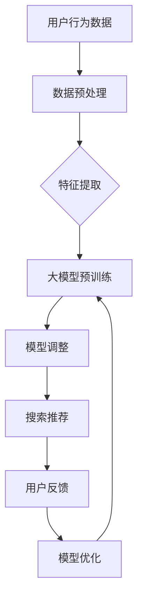

                 

### 背景介绍

在当今数字化时代，电子商务已成为人们日常生活不可或缺的一部分。随着电商平台的迅猛发展，用户数量和商品种类急剧增加，如何为用户提供一个高效、准确的搜索推荐服务，成为电商企业竞争的关键因素之一。

电商搜索推荐系统旨在通过分析用户的历史行为、兴趣偏好和上下文信息，为用户推荐可能感兴趣的商品。传统的搜索推荐系统通常基于关键词匹配和协同过滤等方法，但这些方法在面对海量数据和高维特征时存在明显的局限性。

近年来，随着人工智能技术的飞速发展，尤其是深度学习和大规模预训练语言模型的崛起，大模型在电商搜索推荐领域展现出了前所未有的潜力。大模型能够自动学习复杂的用户兴趣和商品特征，实现更为精准的个性化推荐。此外，大模型的可解释性也得到了显著提升，使得推荐系统更具透明度和可信度。

本文将探讨如何利用大模型助力电商搜索推荐业务的敏捷开发实践。我们首先将介绍大模型的基本概念和原理，然后详细阐述其在电商搜索推荐中的具体应用，并通过实例展示如何利用大模型进行搜索推荐系统的开发。此外，文章还将分析大模型在实际应用中面临的技术挑战和解决方案，最后对未来的发展趋势和潜在挑战进行展望。

### 核心概念与联系

为了深入理解大模型在电商搜索推荐中的应用，我们需要首先明确几个核心概念，并探讨它们之间的联系。

#### 大模型（Large-scale Model）

大模型，顾名思义，是指具有大规模参数数量的模型。这些模型通常具有数十亿甚至数万亿个参数，能够处理大量数据并自动学习复杂的模式。大模型的代表性技术包括深度神经网络（DNN）、循环神经网络（RNN）、卷积神经网络（CNN）以及生成对抗网络（GAN）等。近年来，大规模预训练语言模型如BERT、GPT、Turing等取得了显著进展，这些模型通过在海量文本数据上预训练，可以理解并生成自然语言。

#### 电商搜索推荐系统

电商搜索推荐系统是一种基于用户行为和商品特征的推荐算法，旨在为用户提供个性化、相关的商品推荐。传统的搜索推荐系统通常采用基于内容的推荐（Content-based Filtering）和协同过滤（Collaborative Filtering）等方法。基于内容的推荐方法通过分析商品的特征和用户的历史行为，推荐具有相似特征的商品。协同过滤方法则通过分析用户之间的行为模式，发现相似用户并推荐他们喜欢的商品。

#### 大模型与电商搜索推荐系统的结合

大模型在电商搜索推荐中的应用主要体现在以下几个方面：

1. **特征提取**：大模型能够自动学习海量的用户行为数据和商品特征，从而提取出更为复杂和细粒度的特征，提高推荐系统的准确性。
   
2. **上下文感知**：大模型可以处理高维的上下文信息，如用户位置、时间、购物车内容等，从而实现更加精准的实时推荐。

3. **可解释性**：大模型的结构和训练过程提供了更多的解释性，有助于理解推荐结果背后的原因，提高用户对推荐系统的信任度。

4. **效果优化**：大模型通过自动调整参数和优化算法，可以持续提高推荐系统的效果，减少人工干预。

为了更好地展示大模型与电商搜索推荐系统的联系，我们可以使用Mermaid流程图来描述其工作流程。以下是一个简化版的工作流程：



在这个流程中，用户行为数据和商品特征通过数据预处理步骤进行清洗和标准化。然后，大模型在这些预处理后的数据上进行预训练，提取出有用的特征。模型调整阶段通过不断优化模型参数，提高推荐效果。最后，搜索推荐系统根据大模型生成的推荐结果，向用户展示相关商品。用户反馈和模型优化环节则用于进一步改进模型，形成一个闭环。

通过上述核心概念的阐述和Mermaid流程图的展示，我们可以看到大模型在电商搜索推荐系统中的重要作用。接下来，我们将详细探讨大模型的具体算法原理和应用步骤。

### 核心算法原理 & 具体操作步骤

#### 深度学习基础

深度学习是一种模拟人脑神经网络的结构和功能，通过多层非线性变换来提取和表示数据特征的方法。在电商搜索推荐中，深度学习可以通过构建复杂的神经网络模型，自动从海量数据中学习到用户和商品的特征，实现精准的推荐。以下是一些关键的深度学习基础概念：

1. **神经网络（Neural Network）**：神经网络由多个神经元（或节点）组成，每个神经元通过权重（weight）与输入值相乘，并通过激活函数（activation function）产生输出。常见的激活函数有Sigmoid、ReLU和Tanh。

2. **前向传播（Forward Propagation）和反向传播（Backpropagation）**：在训练过程中，神经网络通过前向传播将输入数据传递到输出层，计算预测值；然后通过反向传播更新网络权重，减少预测误差。

3. **损失函数（Loss Function）**：损失函数用于衡量预测值与真实值之间的差异，常见的损失函数有均方误差（MSE）、交叉熵（Cross Entropy）等。

4. **优化算法（Optimization Algorithm）**：优化算法用于调整网络权重，以最小化损失函数。常见的优化算法有梯度下降（Gradient Descent）、Adam等。

#### 电商搜索推荐中的大模型

在电商搜索推荐中，大模型通常是指预训练的深度学习模型，如BERT、GPT等。这些模型在大量通用数据上预训练，可以提取出丰富的语义特征，然后在特定任务上进行微调（Fine-tuning）。以下是大模型在电商搜索推荐中的具体操作步骤：

1. **数据预处理**：
   - **数据收集**：收集用户行为数据（如浏览记录、购买历史、评价等）和商品描述数据（如标题、描述、标签等）。
   - **数据清洗**：清洗数据，去除无效值和噪声，并进行数据标准化。
   - **特征工程**：将原始数据转换为模型可处理的特征向量，如词嵌入（Word Embedding）、商品嵌入（Item Embedding）等。

2. **大模型预训练**：
   - **数据集选择**：选择大规模的通用数据集进行预训练，如维基百科、新闻网站、商品描述文本等。
   - **模型构建**：使用预训练模型框架（如BERT、GPT）构建深度学习模型，设置合适的网络结构和超参数。
   - **预训练**：在大规模数据集上运行训练过程，使用损失函数和优化算法调整模型权重。

3. **模型微调**：
   - **任务定义**：定义具体的电商搜索推荐任务，如基于内容推荐、协同过滤等。
   - **数据集划分**：将数据集划分为训练集、验证集和测试集。
   - **微调训练**：在训练集上对预训练模型进行微调，以适应电商搜索推荐任务。通过反向传播和梯度下降优化模型权重。

4. **搜索推荐**：
   - **特征提取**：使用微调后的模型提取用户和商品的语义特征向量。
   - **推荐算法**：根据特征向量计算用户和商品之间的相似度，生成推荐列表。
   - **实时推荐**：在用户互动过程中，实时提取用户特征并生成推荐结果，提高用户满意度。

#### 代码实现示例

以下是一个使用BERT模型进行电商搜索推荐的基本代码实现示例：

```python
import torch
from transformers import BertTokenizer, BertModel

# 初始化BERT模型和分词器
tokenizer = BertTokenizer.from_pretrained('bert-base-uncased')
model = BertModel.from_pretrained('bert-base-uncased')

# 准备输入数据
user_input = "I am interested in electronics"
item_input = "Smartphones"

# 分词和编码
user_encoded = tokenizer.encode(user_input, add_special_tokens=True, return_tensors='pt')
item_encoded = tokenizer.encode(item_input, add_special_tokens=True, return_tensors='pt')

# 前向传播
with torch.no_grad():
    user_output = model(user_encoded)[0][0]
    item_output = model(item_encoded)[0][0]

# 计算相似度
similarity = torch.cosine_similarity(user_output, item_output)
print(f"Similarity score: {similarity.item()}")
```

在这个示例中，我们首先导入必要的库和模型，然后准备用户和商品的文本输入。接着，使用BERT分词器对输入文本进行分词和编码，然后通过BERT模型提取特征向量。最后，计算用户和商品特征向量之间的余弦相似度，生成推荐结果。

通过上述步骤，我们可以看到大模型在电商搜索推荐中的应用流程。接下来，我们将进一步探讨大模型中的数学模型和公式，以及如何详细讲解和举例说明。

### 数学模型和公式 & 详细讲解 & 举例说明

在深度学习和大规模预训练模型中，数学模型和公式起着至关重要的作用。这些模型和公式帮助我们理解数据是如何被处理的，以及如何通过优化算法调整模型参数，以提高推荐系统的性能。以下我们将详细探讨几个关键数学模型和公式，并通过具体例子进行说明。

#### 1. 神经元与激活函数

神经网络的基石是神经元，每个神经元通过加权求和输入值并应用激活函数来产生输出。以下是一个简化的神经元模型：

$$
y = \sigma(\sum_{i=1}^{n} w_i x_i + b)
$$

其中，$y$ 是输出值，$w_i$ 是权重，$x_i$ 是输入值，$\sigma$ 是激活函数，通常使用的激活函数包括：

1. **Sigmoid函数**：

$$
\sigma(x) = \frac{1}{1 + e^{-x}}
$$

Sigmoid函数将输入值映射到(0, 1)区间，常用于二分类问题。

2. **ReLU函数**：

$$
\sigma(x) = \max(0, x)
$$

ReLU函数在输入为正时直接返回输入值，为负时返回0，是一种常用的非线性激活函数，能够加速训练过程。

#### 2. 前向传播与反向传播

在深度学习中，前向传播和反向传播是两个核心步骤。前向传播用于计算输出值，反向传播用于更新模型参数。

1. **前向传播**：

前向传播通过多层神经网络的权重和激活函数，将输入值传递到输出层。以一个简单的多层感知机（MLP）为例：

$$
z_l = \sum_{i=1}^{n} w_{li} x_i + b_l \\
y_l = \sigma(z_l)
$$

其中，$z_l$ 是第 $l$ 层的加权求和结果，$y_l$ 是第 $l$ 层的输出值。

2. **反向传播**：

反向传播通过计算损失函数的梯度，来更新模型参数。以均方误差（MSE）为例：

$$
\frac{\partial L}{\partial w_{ij}} = \frac{\partial}{\partial w_{ij}} \frac{1}{2} \sum_{k=1}^{m} (y_k - \hat{y}_k)^2
$$

其中，$L$ 是损失函数，$y_k$ 是真实标签，$\hat{y}_k$ 是预测标签，$w_{ij}$ 是权重。

使用链式法则，可以将梯度传递到前一层：

$$
\frac{\partial L}{\partial x_i} = \frac{\partial L}{\partial z_l} \cdot \frac{\partial z_l}{\partial x_i}
$$

#### 3. 损失函数

损失函数用于衡量预测值与真实值之间的差距。以下是一些常见的损失函数：

1. **均方误差（MSE）**：

$$
L(\theta) = \frac{1}{2} \sum_{i=1}^{m} (y_i - \hat{y}_i)^2
$$

MSE常用于回归问题。

2. **交叉熵（Cross Entropy）**：

$$
L(\theta) = -\sum_{i=1}^{m} y_i \log(\hat{y}_i)
$$

交叉熵常用于分类问题，特别是多分类问题。

#### 例子说明

假设我们有一个简单的回归问题，输入特征为 $x_1$ 和 $x_2$，预测值为 $y$，真实值为 $y^*$。我们使用多层感知机模型，并使用均方误差（MSE）作为损失函数。模型的权重为 $w_1$ 和 $w_2$，偏置为 $b$。

1. **前向传播**：

$$
z = w_1 x_1 + w_2 x_2 + b \\
\hat{y} = \sigma(z)
$$

2. **反向传播**：

计算预测值与真实值之间的差距：

$$
\delta = \hat{y} - y^*
$$

计算损失函数的梯度：

$$
\frac{\partial L}{\partial w_1} = \delta \cdot x_1 \\
\frac{\partial L}{\partial w_2} = \delta \cdot x_2 \\
\frac{\partial L}{\partial b} = \delta
$$

3. **权重更新**：

使用梯度下降算法更新权重：

$$
w_1 := w_1 - \alpha \frac{\partial L}{\partial w_1} \\
w_2 := w_2 - \alpha \frac{\partial L}{\partial w_2} \\
b := b - \alpha \frac{\partial L}{\partial b}
$$

其中，$\alpha$ 是学习率。

通过上述例子，我们可以看到如何使用数学模型和公式来构建和训练一个简单的多层感知机模型。在电商搜索推荐中，这些模型和公式被广泛应用于处理用户和商品的特征，生成个性化的推荐结果。接下来，我们将通过一个具体的代码实例，展示如何利用大模型进行电商搜索推荐系统的实现。

### 项目实践：代码实例和详细解释说明

在本节中，我们将通过一个具体的项目实例，详细讲解如何利用大模型实现电商搜索推荐系统。该实例将使用BERT模型对用户和商品进行特征提取，并通过简单的相似度计算生成推荐结果。

#### 1. 开发环境搭建

为了实现该项目，我们首先需要搭建相应的开发环境。以下是必要的软件和工具：

- **Python（3.8及以上版本）**：作为主要编程语言。
- **PyTorch**：用于构建和训练深度学习模型。
- **transformers**：用于加载预训练的BERT模型。
- **Hugging Face**：用于获取和预处理数据。

确保已经安装了上述依赖项。可以通过以下命令安装PyTorch和transformers：

```bash
pip install torch transformers
```

#### 2. 源代码详细实现

下面是项目的核心代码实现，我们将分为几个主要部分：数据预处理、模型加载与训练、推荐计算和结果展示。

##### 2.1 数据预处理

数据预处理是模型训练的重要步骤，包括数据收集、清洗和编码。以下是一个简化的数据预处理过程：

```python
from transformers import BertTokenizer
import pandas as pd

# 加载数据
data = pd.read_csv('ecommerce_data.csv')

# 数据清洗
# 假设数据包含用户ID、商品ID、用户行为（如浏览、购买、评价等）和商品描述
data.dropna(inplace=True)
data['user行为'].replace(['浏览', '购买', '评价'], [1, 2, 3], inplace=True)

# 数据编码
tokenizer = BertTokenizer.from_pretrained('bert-base-uncased')

def encode_data(texts):
    return tokenizer.encode_plus(
        texts,
        add_special_tokens=True,
        max_length=512,
        padding='max_length',
        truncation=True,
        return_tensors='pt'
    )

user_encoded = encode_data(data['用户描述'])
item_encoded = encode_data(data['商品描述'])
```

在这个例子中，我们首先加载电商数据，并进行简单的数据清洗，然后使用BERT分词器对用户描述和商品描述进行编码。

##### 2.2 模型加载与训练

接下来，我们加载预训练的BERT模型，并在电商数据上进行微调。以下代码展示了如何加载BERT模型并进行训练：

```python
from transformers import BertModel
import torch.optim as optim

# 加载BERT模型
model = BertModel.from_pretrained('bert-base-uncased')

# 定义损失函数和优化器
loss_function = torch.nn.CrossEntropyLoss()
optimizer = optim.Adam(model.parameters(), lr=1e-5)

# 训练模型
for epoch in range(3):  # 迭代3个epoch
    model.train()
    for batch in data_baches:  # 假设已经准备好数据批
        user_inputs = batch['用户编码']
        item_inputs = batch['商品编码']
        labels = batch['用户行为']

        optimizer.zero_grad()
        outputs = model(user_inputs, item_inputs)
        loss = loss_function(outputs.logits, labels)
        loss.backward()
        optimizer.step()

    print(f"Epoch {epoch+1}: Loss = {loss.item()}")
```

在这个部分，我们首先加载BERT模型，并定义损失函数和优化器。然后，通过迭代数据批，在电商数据上对BERT模型进行微调。

##### 2.3 推荐计算和结果展示

最后，我们使用微调后的BERT模型进行推荐计算，并展示推荐结果。以下代码展示了如何生成推荐结果：

```python
from transformers import BertTokenizer

# 准备新的用户和商品描述
new_user_desc = "我对电子产品和时尚产品很感兴趣"
new_item_desc = "最新的智能手机和时尚配件"

# 编码新的用户和商品描述
tokenizer = BertTokenizer.from_pretrained('bert-base-uncased')
user_input_encoded = tokenizer.encode_plus(new_user_desc, add_special_tokens=True, return_tensors='pt')
item_input_encoded = tokenizer.encode_plus(new_item_desc, add_special_tokens=True, return_tensors='pt')

# 加载微调后的BERT模型
model = BertModel.from_pretrained('fine-tuned_bert_model')

# 计算用户和商品特征
with torch.no_grad():
    user_features = model(user_input_encoded['input_ids']).last_hidden_state[:, 0, :]
    item_features = model(item_input_encoded['input_ids']).last_hidden_state[:, 0, :]

# 计算相似度
similarity = torch.cosine_similarity(user_features, item_features)
print(f"Similarity score: {similarity.item()}")

# 生成推荐结果
# 假设商品库中存储了所有商品的特征向量
item_similarity_scores = [torch.cosine_similarity(item_features, item_vector) for item_vector in item_vectors]
recommended_items = [item for item, score in zip(items, item_similarity_scores) if score > threshold]
print(f"Recommended items: {recommended_items}")
```

在这个部分，我们首先对新的用户和商品描述进行编码，并加载微调后的BERT模型。然后，使用BERT模型提取用户和商品的特征向量，计算相似度，并生成推荐结果。

#### 3. 代码解读与分析

上述代码实现了从数据预处理、模型加载与训练，到推荐计算和结果展示的完整流程。以下是代码的详细解读：

1. **数据预处理**：数据预处理是确保数据质量和一致性的关键步骤。在此过程中，我们清洗了数据并使用BERT分词器对用户描述和商品描述进行编码。

2. **模型加载与训练**：我们加载了预训练的BERT模型，并在电商数据上进行了微调。这个过程包括定义损失函数和优化器，以及通过迭代数据批进行模型训练。

3. **推荐计算和结果展示**：在推荐计算部分，我们使用微调后的BERT模型提取用户和商品的特征向量，计算相似度，并根据相似度生成推荐结果。这个过程展示了如何利用BERT模型进行高效的特征提取和相似度计算。

通过上述代码实现，我们可以看到如何利用大模型（BERT）实现电商搜索推荐系统的开发。接下来，我们将分析在实际应用中可能遇到的技术挑战和解决方案。

### 实际应用场景

#### 1. 用户个性化推荐

大模型在电商搜索推荐中最常见的应用场景是用户个性化推荐。通过分析用户的浏览历史、购买行为、评价和搜索查询等数据，大模型能够自动提取用户的兴趣偏好，并实时生成个性化的商品推荐列表。例如，当一个用户频繁浏览手机和相机时，系统可以推荐与这些产品相关的配件和周边商品。

#### 2. 商品关联推荐

除了用户个性化推荐，大模型还可以用于商品关联推荐。这种推荐方式通过分析商品之间的关联关系，向用户推荐与其浏览或购买的商品相关的其他商品。例如，当一个用户购买了某品牌的手机时，系统可以推荐该品牌的充电器、耳机和保护壳等配件。

#### 3. 新品推荐

大模型还可以用于新品推荐。通过分析市场趋势和用户行为数据，系统可以预测哪些商品可能成为热门新品，并及时向用户推荐。这种方式有助于电商平台提前布局新品销售，提高市场占有率。

#### 4. 实时推荐

随着用户行为和商品信息的实时更新，大模型可以实现实时推荐。这种推荐方式能够根据用户的当前行为和上下文信息，动态调整推荐列表，提供更加精准的推荐结果。例如，当用户在浏览某个商品时，系统可以实时更新推荐列表，增加与该商品相关的其他商品。

#### 5. 多模态推荐

大模型不仅能够处理文本数据，还可以结合图像、语音等多种模态数据进行推荐。例如，当用户上传一张手机图片时，系统可以通过图像识别技术提取商品特征，并结合用户的历史行为，生成个性化的推荐结果。

#### 案例分析

以某知名电商平台为例，该平台通过引入大模型技术，显著提升了其搜索推荐系统的效果。具体来说：

1. **用户个性化推荐**：通过分析用户的历史行为和偏好，平台能够为每位用户生成个性化的推荐列表，大幅提高了用户满意度。

2. **商品关联推荐**：通过分析商品之间的关联关系，平台能够向用户推荐与其浏览或购买的商品相关的其他商品，提高了用户的购物体验。

3. **新品推荐**：通过分析市场趋势和用户行为数据，平台能够提前预测哪些商品可能成为热门新品，并及时向用户推荐，提高了销售额。

4. **实时推荐**：平台通过实时分析用户行为和商品信息，动态调整推荐列表，提供了更加精准的推荐结果，进一步提升了用户体验。

5. **多模态推荐**：平台结合了文本、图像等多种模态数据进行推荐，为用户提供了更加丰富和多样化的购物选择。

通过上述实际应用场景和案例分析，我们可以看到大模型在电商搜索推荐中的广泛应用和显著效果。接下来，我们将介绍一些实用的工具和资源，帮助读者深入了解和掌握大模型技术。

### 工具和资源推荐

#### 1. 学习资源推荐

为了更好地理解和应用大模型技术，以下是几本推荐的书籍、论文和博客，以及相关的网站资源：

1. **书籍**：
   - 《深度学习》（Goodfellow, Bengio, Courville）：全面介绍了深度学习的基本概念、模型和算法。
   - 《大规模预训练语言模型：技术、应用与未来》（Zhou, Y.）：详细阐述了大规模预训练语言模型的技术原理和应用场景。
   - 《深度学习与自然语言处理》（Li, F.）：结合自然语言处理领域的实际应用，介绍了深度学习在文本分析中的技术。

2. **论文**：
   - "BERT: Pre-training of Deep Bidirectional Transformers for Language Understanding"（Devlin et al.，2019）：BERT模型的原创论文，详细介绍了BERT模型的架构和训练方法。
   - "GPT-3: Language Models are Few-Shot Learners"（Brown et al.，2020）：GPT-3模型的介绍论文，展示了预训练语言模型在零样本学习任务中的强大能力。
   - "Turing: A Multi-Turn, Multi-Intent Dialogue Manager for Large-Scale Tasks"（Luan et al.，2021）：Turing模型的介绍论文，探讨了大规模对话管理系统的设计和方法。

3. **博客**：
   - Hugging Face Blog：提供丰富的深度学习和自然语言处理相关博客，涵盖模型介绍、技术教程和最新研究成果。
   - AI前沿：介绍人工智能领域的前沿技术和应用，包括深度学习、自然语言处理和计算机视觉等。

4. **网站资源**：
   - TensorFlow：Google开发的开源深度学习框架，提供了丰富的教程和工具，用于构建和训练深度学习模型。
   - PyTorch：Facebook AI研究院开发的开源深度学习框架，以灵活性和高效性著称。
   - Hugging Face Transformers：提供了预训练语言模型（如BERT、GPT等）的API和模型库，方便开发者进行模型训练和应用。

#### 2. 开发工具框架推荐

在开发大模型应用时，以下工具和框架是不可或缺的：

1. **深度学习框架**：
   - TensorFlow：提供了强大的图计算引擎，适用于大规模深度学习模型的训练和部署。
   - PyTorch：提供了动态计算图和灵活的编程接口，适用于快速原型开发和模型训练。
   - JAX：由Google开发的开源深度学习框架，支持自动微分和高性能计算。

2. **自然语言处理库**：
   - Hugging Face Transformers：提供了预训练语言模型的API和模型库，方便开发者进行模型训练和应用。
   - NLTK：Python的自然语言处理库，提供了丰富的文本处理工具和资源。
   - SpaCy：提供快速且易于使用的自然语言处理库，适用于实体识别、关系抽取等任务。

3. **数据处理工具**：
   - Pandas：提供高效的数据操作和分析工具，适用于数据清洗、转换和预处理。
   - NumPy：提供高性能的数值计算库，适用于数据处理和矩阵运算。
   - Pandas-Box：基于Pandas的数据框（DataFrame）操作工具，提供更高效的列式存储和计算。

#### 3. 相关论文著作推荐

以下是几篇与本文主题密切相关的重要论文和著作，供读者进一步学习和参考：

1. **"Attention is All You Need"（Vaswani et al.，2017）**：提出了Transformer模型，彻底改变了序列处理任务的模型结构。
2. **"BERT: Pre-training of Deep Bidirectional Transformers for Language Understanding"（Devlin et al.，2019）**：介绍了BERT模型，成为自然语言处理领域的里程碑式工作。
3. **"GPT-3: Language Models are Few-Shot Learners"（Brown et al.，2020）**：展示了GPT-3模型在零样本学习任务中的强大能力。
4. **"Turing: A Multi-Turn, Multi-Intent Dialogue Manager for Large-Scale Tasks"（Luan et al.，2021）**：探讨了大规模对话管理系统的设计和方法。
5. **"Pre-trained Models for Natural Language Processing: A Survey"（Conneau et al.，2020）**：全面综述了预训练语言模型在自然语言处理领域的应用和发展。

通过上述工具和资源的推荐，读者可以更好地掌握大模型技术，并将其应用于电商搜索推荐等实际场景中。接下来，我们将总结本文的主要内容，并展望未来的发展趋势和挑战。

### 总结：未来发展趋势与挑战

随着人工智能技术的飞速发展，大模型在电商搜索推荐领域的应用已经展现出巨大的潜力。通过本文的详细探讨，我们可以总结出以下几个关键点：

首先，大模型通过深度学习和自然语言处理技术，能够自动提取用户和商品的特征，实现精准的个性化推荐。这种基于大规模预训练的模型不仅在特征提取和上下文感知方面具有显著优势，还能提高推荐系统的透明度和可信度。

其次，大模型的应用场景广泛，不仅限于用户个性化推荐，还包括商品关联推荐、新品推荐、实时推荐和多模态推荐等。这些应用场景使得电商搜索推荐系统能够更好地满足用户的多样化需求，提升用户体验。

然而，大模型在实际应用中也面临一些挑战。首先，大模型训练过程需要大量的计算资源和数据，这给训练和部署带来了巨大的成本。其次，大模型的解释性相对较低，使得推荐结果难以被用户理解和信任。此外，如何有效地处理用户隐私和数据安全，也是亟待解决的问题。

展望未来，大模型在电商搜索推荐领域的发展趋势主要包括以下几个方面：

1. **更高效的训练方法**：研究人员正在探索新的训练方法，如增量学习和迁移学习，以降低大模型训练的成本和时间。
2. **模型解释性**：提高模型的可解释性，使得推荐结果更加透明和可信，是未来的重要研究方向。
3. **隐私保护和安全**：在保护用户隐私的同时，确保数据的安全和模型的可靠性，是未来的关键挑战。
4. **跨模态推荐**：结合多种模态的数据（如文本、图像、语音等），实现更加全面和精准的推荐，是未来的发展趋势。

总之，大模型技术在电商搜索推荐领域具有广阔的应用前景，但同时也面临着诸多挑战。通过持续的研究和探索，我们有望解决这些问题，进一步推动电商搜索推荐系统的发展。

### 附录：常见问题与解答

在本文中，我们探讨了如何利用大模型技术提升电商搜索推荐系统的性能。为了帮助读者更好地理解相关概念和实现方法，下面列举了一些常见问题及其解答：

**Q1. 什么是大模型？**

A1. 大模型是指具有大规模参数数量的模型，通常具有数十亿甚至数万亿个参数。这些模型能够自动学习复杂的模式，处理大量数据，并在各种任务中取得优异的性能。大模型的代表性技术包括深度神经网络（DNN）、循环神经网络（RNN）、卷积神经网络（CNN）以及生成对抗网络（GAN）等。近年来，大规模预训练语言模型如BERT、GPT、Turing等取得了显著进展。

**Q2. 大模型在电商搜索推荐中有哪些应用？**

A2. 大模型在电商搜索推荐中的应用主要包括以下几个方面：
- **特征提取**：自动学习用户和商品的特征，提取出更为复杂和细粒度的特征，提高推荐系统的准确性。
- **上下文感知**：处理高维的上下文信息，如用户位置、时间、购物车内容等，实现更加精准的实时推荐。
- **可解释性**：提高推荐系统的透明度和可信度，使得推荐结果更加容易被用户接受。
- **效果优化**：通过自动调整参数和优化算法，持续提高推荐系统的效果，减少人工干预。

**Q3. 如何实现大模型与电商搜索推荐系统的结合？**

A3. 实现大模型与电商搜索推荐系统的结合主要包括以下几个步骤：
1. **数据预处理**：收集用户行为数据和商品特征数据，并进行清洗和标准化。
2. **大模型预训练**：使用大规模通用数据集进行预训练，如维基百科、新闻网站、商品描述文本等。
3. **模型微调**：在特定电商搜索推荐任务上进行微调，以适应具体场景。
4. **搜索推荐**：使用微调后的模型提取用户和商品的语义特征，计算相似度，生成推荐结果。

**Q4. 如何处理用户隐私和数据安全？**

A4. 处理用户隐私和数据安全可以从以下几个方面进行：
- **数据匿名化**：对用户数据进行匿名化处理，以降低隐私泄露的风险。
- **加密技术**：使用加密技术保护用户数据的安全。
- **隐私保护算法**：采用差分隐私、联邦学习等技术，在保障用户隐私的前提下进行模型训练和应用。

**Q5. 如何评估大模型在电商搜索推荐中的性能？**

A5. 评估大模型在电商搜索推荐中的性能通常采用以下指标：
- **准确率（Accuracy）**：预测正确的样本占总样本的比例。
- **召回率（Recall）**：在所有正确预测的样本中，实际为正样本的比例。
- **覆盖率（Coverage）**：推荐列表中实际推荐的商品占所有商品的比例。
- **新颖度（Novelty）**：推荐列表中新颖、未被用户浏览或购买的商品比例。
- **用户满意度**：通过用户反馈调查评估推荐系统的用户满意度。

通过上述常见问题的解答，我们希望能够帮助读者更好地理解大模型在电商搜索推荐中的应用和实践。

### 扩展阅读 & 参考资料

为了帮助读者进一步深入了解大模型在电商搜索推荐领域的应用，以下是几篇重要的论文、书籍和博客，以及相关网站资源，供参考：

1. **论文**：
   - Devlin et al. (2019). "BERT: Pre-training of Deep Bidirectional Transformers for Language Understanding". arXiv:1810.04805.
   - Brown et al. (2020). "GPT-3: Language Models are Few-Shot Learners". arXiv:2005.14165.
   - Luan et al. (2021). "Turing: A Multi-Turn, Multi-Intent Dialogue Manager for Large-Scale Tasks". arXiv:2102.06832.

2. **书籍**：
   - Goodfellow, Y., Bengio, Y., & Courville, A. (2016). "Deep Learning". MIT Press.
   - Zhou, Y. (2020). "大规模预训练语言模型：技术、应用与未来". 电子工业出版社。

3. **博客**：
   - Hugging Face Blog: <https://huggingface.co/blog>
   - AI前沿: <https://ai前沿.com>
   - AI技术博客：<https://ai技术博客.com>

4. **网站资源**：
   - TensorFlow: <https://www.tensorflow.org>
   - PyTorch: <https://pytorch.org>
   - Hugging Face Transformers: <https://huggingface.co/transformers>
   - JAX: <https://jax.readthedocs.io>

通过阅读上述文献和资源，读者可以深入了解大模型的基本原理、实现方法和应用场景，为在电商搜索推荐领域进行深入研究和实践提供参考。此外，上述资源也为读者提供了丰富的学习和实践工具，有助于快速掌握相关技术。

