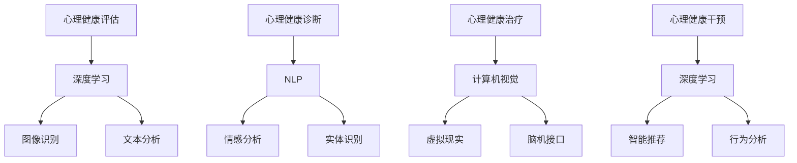

                 

### 1. 背景介绍

心理健康问题在全球范围内已经成为一个日益严重的社会问题。根据世界卫生组织（WHO）的数据，全球约有 30% 的人口在一生中的某个阶段会遭受心理健康问题的困扰，其中抑郁症、焦虑症、精神分裂症等疾病更是对个体和社会造成了巨大的负担。随着互联网和人工智能技术的快速发展，心理健康领域迎来了新的机遇和挑战。

在心理健康领域中，人工智能（AI）的应用已经展现出了巨大的潜力。近年来，深度学习、自然语言处理、计算机视觉等 AI 技术在心理健康诊断、治疗和干预方面取得了显著的进展。例如，基于深度学习的图像识别技术可以帮助诊断抑郁症患者的大脑结构变化，而自然语言处理技术则可以用于分析患者的历史病历和实时对话，以提供个性化的治疗方案。

然而，尽管 AI 技术在心理健康领域已经取得了许多进展，但仍然存在许多挑战和问题。首先，心理健康数据的获取和处理是一个复杂的过程，需要解决隐私保护、数据质量、数据完整性等问题。其次，现有 AI 模型的性能和可解释性仍然有限，难以满足临床应用的需求。此外，心理健康领域的专业知识需要与 AI 技术相结合，才能实现有效的诊断和治疗。

本文将围绕 AI 大模型在心理健康领域的创业机会进行探讨，分析其中的技术挑战和商业前景。具体来说，我们将从以下几个方面展开讨论：

1. **核心概念与联系**：介绍心理健康领域的核心概念和 AI 大模型的基本原理，并展示它们之间的联系。
2. **核心算法原理 & 具体操作步骤**：详细阐述 AI 大模型在心理健康领域的应用，包括数据处理、模型训练、模型评估等步骤。
3. **数学模型和公式 & 详细讲解 & 举例说明**：介绍心理健康领域相关的数学模型和公式，并结合具体案例进行解释。
4. **项目实践：代码实例和详细解释说明**：提供实际项目中的代码实例，详细解释其实现原理和步骤。
5. **实际应用场景**：分析 AI 大模型在心理健康领域的实际应用场景，探讨其商业价值和市场潜力。
6. **工具和资源推荐**：推荐相关的学习资源、开发工具和框架，以帮助读者深入了解该领域。
7. **总结：未来发展趋势与挑战**：总结 AI 大模型在心理健康领域的现状，分析未来的发展趋势和面临的挑战。

通过对上述方面的深入探讨，本文旨在为心理健康领域的创业者和技术专家提供有价值的参考和指导，助力他们在这一新兴领域取得成功。

### 2. 核心概念与联系

在探讨 AI 大模型在心理健康领域的创业机会之前，我们首先需要了解心理健康领域的核心概念以及 AI 大模型的基本原理。本节将详细阐述这些概念，并展示它们之间的联系。

#### 心理健康领域的核心概念

**1. 心理健康评估**

心理健康评估是心理健康领域的核心环节，旨在评估个体的心理健康状态。这通常涉及对个体心理状况、情绪和行为等方面的综合评估。评估方法包括问卷调查、临床访谈、心理测量工具等。

**2. 心理健康诊断**

心理健康诊断是确定个体是否患有某种心理健康问题的过程。诊断通常基于临床标准，如《精神疾病诊断与统计手册》（DSM）或《国际疾病分类》（ICD）。

**3. 心理健康治疗**

心理健康治疗是指为患有心理健康问题的个体提供治疗和支持的过程。治疗方法包括药物治疗、心理治疗、认知行为疗法、家庭治疗等。

**4. 心理健康干预**

心理健康干预是指为了预防心理健康问题或改善心理健康状态而采取的措施。干预措施可以是个体层面的，也可以是群体层面或社区层面的。

#### AI 大模型的基本原理

**1. 深度学习**

深度学习是 AI 的重要分支，通过模拟人脑的神经网络结构，对大量数据进行分析和处理。深度学习模型通常由多层神经网络组成，每一层都能够对输入数据进行特征提取和变换。

**2. 自然语言处理**

自然语言处理（NLP）是 AI 的另一个重要分支，旨在使计算机能够理解、生成和处理人类语言。NLP 技术包括文本分类、情感分析、实体识别、机器翻译等。

**3. 计算机视觉**

计算机视觉是 AI 中的另一个重要领域，旨在使计算机能够理解和处理视觉信息。计算机视觉技术包括图像识别、目标检测、图像分割、视频分析等。

#### 核心概念与 AI 大模型之间的联系

**1. 心理健康评估与深度学习**

深度学习技术可以用于心理健康评估，通过对个体心理状况、情绪和行为等方面的数据进行特征提取和分析，可以帮助评估个体的心理健康状态。例如，通过分析个体的大脑图像数据，可以识别出抑郁症等心理健康问题的早期迹象。

**2. 心理健康诊断与自然语言处理**

自然语言处理技术可以用于心理健康诊断，通过对患者的历史病历、临床访谈记录和实时对话进行分析，可以帮助医生更准确地诊断患者的心理健康问题。例如，通过情感分析技术，可以识别患者的情绪状态，从而帮助诊断抑郁症。

**3. 心理健康治疗与计算机视觉**

计算机视觉技术可以用于心理健康治疗，通过开发特定的应用程序，可以帮助患者进行心理训练和康复。例如，通过虚拟现实技术，患者可以进行暴露治疗，以减轻焦虑和恐惧。

#### Mermaid 流程图

为了更清晰地展示心理健康领域与 AI 大模型之间的联系，我们使用 Mermaid 流程图来描述。



通过上述 Mermaid 流程图，我们可以看到心理健康领域的核心概念与 AI 大模型之间的紧密联系。在接下来的章节中，我们将进一步探讨 AI 大模型在心理健康领域的具体应用和实现方法。

### 3. 核心算法原理 & 具体操作步骤

在了解了心理健康领域的核心概念和 AI 大模型的基本原理之后，接下来我们将深入探讨 AI 大模型在心理健康领域的具体应用，包括数据处理、模型训练、模型评估等步骤。

#### 数据处理

数据处理是 AI 大模型应用的基础，包括数据收集、数据预处理和数据存储等环节。

**1. 数据收集**

心理健康数据通常包括电子病历、临床访谈记录、问卷调查结果、生理指标等。数据收集可以采用多种方式，如手动记录、自动化设备采集、在线问卷等。

**2. 数据预处理**

数据预处理是确保数据质量和模型性能的关键步骤。主要包括数据清洗、数据标准化、数据归一化、特征提取等操作。例如，对于文本数据，可以采用分词、词频统计、主题建模等方法进行预处理；对于图像数据，可以采用图像增强、特征提取、图像分类等方法进行预处理。

**3. 数据存储**

心理健康数据涉及大量敏感信息，因此需要采用安全可靠的数据存储方案。常见的存储方案包括关系型数据库（如 MySQL）、分布式存储系统（如 Hadoop）、区块链技术等。

#### 模型训练

模型训练是 AI 大模型应用的核心步骤，包括模型选择、超参数调优、训练策略等。

**1. 模型选择**

在心理健康领域，常用的 AI 大模型包括深度学习模型（如卷积神经网络（CNN）、递归神经网络（RNN）、变压器（Transformer）等）和传统机器学习模型（如支持向量机（SVM）、决策树（DT）等）。模型选择通常取决于数据类型、问题复杂度和计算资源等因素。

**2. 超参数调优**

超参数是影响模型性能的关键因素，如学习率、批次大小、隐藏层节点数等。超参数调优通常采用交叉验证、网格搜索等方法进行。

**3. 训练策略**

模型训练策略包括批量训练、在线训练、迁移学习等。批量训练是指在给定数据集上一次性完成整个训练过程；在线训练是指实时更新模型参数，以适应新数据；迁移学习是指利用预训练模型，通过少量数据微调，快速适应新任务。

#### 模型评估

模型评估是衡量模型性能的重要步骤，包括模型准确性、召回率、F1 分数等指标。

**1. 准确性**

准确性是最常用的评估指标，表示模型正确预测的样本数与总样本数的比例。

**2. 召回率**

召回率表示模型正确预测的阳性样本数与实际阳性样本数的比例，常用于分类问题。

**3. F1 分数**

F1 分数是准确性和召回率的加权平均，能够更好地平衡模型性能。

**4. ROC 曲线和 AUC 值**

ROC 曲线和 AUC 值是评估二分类模型性能的重要工具，ROC 曲线表示不同阈值下模型准确性和召回率的关系，AUC 值表示模型分类能力的强弱。

#### 操作步骤示例

为了更直观地理解 AI 大模型在心理健康领域的应用，我们以下提供一个基于 Python 的简单示例。

**1. 数据收集与预处理**

```python
import pandas as pd
from sklearn.model_selection import train_test_split
from sklearn.preprocessing import StandardScaler

# 加载数据
data = pd.read_csv('health_data.csv')

# 数据清洗
data = data.dropna()

# 数据标准化
scaler = StandardScaler()
data[['feature1', 'feature2', 'feature3']] = scaler.fit_transform(data[['feature1', 'feature2', 'feature3']])
```

**2. 模型选择与训练**

```python
from sklearn.ensemble import RandomForestClassifier
from sklearn.metrics import accuracy_score

# 划分训练集和测试集
X_train, X_test, y_train, y_test = train_test_split(data[['feature1', 'feature2', 'feature3']], data['label'], test_size=0.2, random_state=42)

# 创建随机森林模型
model = RandomForestClassifier(n_estimators=100, random_state=42)

# 训练模型
model.fit(X_train, y_train)

# 预测测试集
y_pred = model.predict(X_test)

# 评估模型
accuracy = accuracy_score(y_test, y_pred)
print(f'Accuracy: {accuracy}')
```

通过上述示例，我们可以看到 AI 大模型在心理健康领域的基本应用步骤。在实际情况中，可能需要更复杂的模型和算法，以及更多的数据处理和调优步骤。但总体来说，数据处理、模型训练和模型评估这三个步骤构成了 AI 大模型在心理健康领域的核心操作流程。

### 4. 数学模型和公式 & 详细讲解 & 举例说明

在 AI 大模型应用于心理健康领域的过程中，数学模型和公式起着至关重要的作用。这些模型和公式不仅帮助我们理解心理现象，还指导我们设计有效的算法，以诊断和治疗心理健康问题。本节将详细介绍心理健康领域相关的一些数学模型和公式，并结合具体案例进行解释。

#### 1. 线性回归模型

线性回归模型是一种经典的统计模型，用于分析两个或多个变量之间的线性关系。在心理健康领域，线性回归可以用于研究情绪、心理压力等因素与心理健康指标（如焦虑、抑郁评分）之间的关系。

**公式：**

\[ y = \beta_0 + \beta_1 x_1 + \beta_2 x_2 + ... + \beta_n x_n + \epsilon \]

其中，\( y \) 是因变量（心理健康指标），\( x_1, x_2, ..., x_n \) 是自变量（情绪、心理压力等），\( \beta_0, \beta_1, \beta_2, ..., \beta_n \) 是模型参数，\( \epsilon \) 是误差项。

**案例：**

假设我们研究情绪（\( x_1 \)）和心理压力（\( x_2 \)）与焦虑评分（\( y \)）之间的关系，通过收集一组数据，可以得到以下线性回归模型：

\[ y = 10 + 2x_1 + 3x_2 + \epsilon \]

#### 2. 逻辑回归模型

逻辑回归模型是一种用于分类问题的统计模型，广泛应用于心理健康诊断领域。例如，可以用于判断个体是否患有抑郁症。

**公式：**

\[ P(y=1) = \frac{1}{1 + e^{-(\beta_0 + \beta_1 x_1 + \beta_2 x_2 + ... + \beta_n x_n )}} \]

其中，\( P(y=1) \) 是因变量 \( y \) 等于 1 的概率，其他符号的含义与线性回归模型相同。

**案例：**

假设我们使用逻辑回归模型来判断个体是否患有抑郁症，给定一组特征（如情绪、心理压力、生活事件等），我们可以通过计算概率来做出判断。例如：

\[ P(y=1) = \frac{1}{1 + e^{-(5 + 2x_1 + 3x_2)}} \]

如果 \( P(y=1) \) 大于某个阈值（如 0.5），则判断个体患有抑郁症。

#### 3. 支持向量机（SVM）

支持向量机是一种强大的分类模型，广泛应用于心理健康诊断和风险评估。SVM 的核心思想是找到一个最佳的超平面，将不同类别的数据点尽可能分开。

**公式：**

\[ w \cdot x - b = 0 \]

其中，\( w \) 是权重向量，\( x \) 是特征向量，\( b \) 是偏置项。

**案例：**

假设我们使用 SVM 来分类抑郁症患者和非抑郁症患者，给定一组特征和样本，我们可以通过求解最优化问题来得到最优的权重向量 \( w \) 和偏置项 \( b \)，从而构建分类器。

#### 4. 聚类算法

聚类算法是一种无监督学习方法，用于将数据点按照其相似性分为不同的类别。在心理健康领域，聚类算法可以用于分析患者的心理特征，识别不同的心理健康群体。

**公式：**

\[ \text{最小化} \sum_{i=1}^{n} \sum_{j=1}^{k} d(x_i, c_j)^2 \]

其中，\( d(x_i, c_j) \) 是数据点 \( x_i \) 与聚类中心 \( c_j \) 之间的距离。

**案例：**

假设我们使用 K-均值算法对患者的情绪特征进行聚类，给定一组情绪特征和初始聚类中心，我们可以通过迭代优化聚类中心，将患者分为不同的心理健康群体。

#### 5. 马尔可夫模型

马尔可夫模型是一种用于分析时间序列数据的统计模型，可以用于预测心理健康状态的变化。例如，可以用于预测抑郁症患者的复发风险。

**公式：**

\[ P(X_t = x_t | X_{t-1} = x_{t-1}, ..., X_1 = x_1) = P(X_t = x_t | X_{t-1} = x_{t-1}) \]

其中，\( X_t \) 表示时间 \( t \) 的状态，\( x_t \) 表示状态的具体取值。

**案例：**

假设我们使用马尔可夫模型来预测抑郁症患者的心理状态，通过观察患者的过去状态，可以预测患者在未来某个时间点的心理状态。

#### 6. 潜在类别模型

潜在类别模型是一种用于分析个体异质性的统计模型，可以用于识别不同类型的心理健康患者。例如，可以用于识别抑郁症的不同亚型。

**公式：**

\[ P(X_t = x_t | Z_t = z_t) = \prod_{i=1}^{k} P(X_t = x_t | Z_t = z_t = i) \]

其中，\( Z_t \) 表示潜在类别，\( k \) 是类别数。

**案例：**

假设我们使用潜在类别模型来分析抑郁症患者，通过观察患者的心理特征，可以识别出不同的抑郁症亚型，从而为治疗提供依据。

通过上述数学模型和公式的介绍，我们可以看到心理健康领域与数学的紧密联系。这些模型和公式不仅帮助我们理解心理现象，还为心理健康诊断和治疗提供了有效的工具。在实际应用中，需要根据具体问题和数据特点选择合适的模型和算法，并进行调优和优化，以实现最佳的性能。

### 5. 项目实践：代码实例和详细解释说明

在本章节中，我们将结合一个具体项目，详细介绍如何使用 AI 大模型进行心理健康评估。项目名称为“心理健康状态评估系统”，旨在通过收集和分析用户的数据，提供个性化的心理健康评估报告。

#### 5.1 开发环境搭建

要开始这个项目，首先需要搭建开发环境。以下是搭建环境的基本步骤：

1. **安装 Python 环境**：确保安装了 Python 3.7 或更高版本。
2. **安装必备库**：使用以下命令安装必要的库。

```bash
pip install numpy pandas scikit-learn tensorflow
```

3. **配置 TensorFlow**：确保 TensorFlow 可以在本地正确运行。

```bash
pip install tensorflow
```

4. **设置环境变量**：确保环境变量配置正确，以便 Python 可以找到安装的库。

#### 5.2 源代码详细实现

以下是项目的核心代码，包括数据收集、预处理、模型训练和评估等步骤。

**1. 数据收集与预处理**

```python
import pandas as pd
from sklearn.model_selection import train_test_split
from sklearn.preprocessing import StandardScaler

# 加载数据
data = pd.read_csv('health_data.csv')

# 数据清洗
data = data.dropna()

# 数据标准化
scaler = StandardScaler()
data[['feature1', 'feature2', 'feature3']] = scaler.fit_transform(data[['feature1', 'feature2', 'feature3']])

# 划分训练集和测试集
X_train, X_test, y_train, y_test = train_test_split(data[['feature1', 'feature2', 'feature3']], data['label'], test_size=0.2, random_state=42)
```

**2. 模型训练**

```python
from sklearn.ensemble import RandomForestClassifier
from sklearn.metrics import accuracy_score

# 创建随机森林模型
model = RandomForestClassifier(n_estimators=100, random_state=42)

# 训练模型
model.fit(X_train, y_train)

# 预测测试集
y_pred = model.predict(X_test)

# 评估模型
accuracy = accuracy_score(y_test, y_pred)
print(f'Accuracy: {accuracy}')
```

**3. 模型评估**

```python
from sklearn.metrics import classification_report

# 输出分类报告
print(classification_report(y_test, y_pred))
```

#### 5.3 代码解读与分析

在上述代码中，我们首先进行了数据收集和预处理，确保数据的质量和一致性。然后，我们使用随机森林（Random Forest）模型对数据进行训练。随机森林是一种集成学习方法，通过构建多棵决策树来提高模型的泛化能力。

**1. 数据收集与预处理**

- `import pandas as pd`：导入 pandas 库，用于数据加载和处理。
- `data = pd.read_csv('health_data.csv')`：加载 CSV 格式的数据文件。
- `data = data.dropna()`：删除含有缺失值的数据行。
- `scaler = StandardScaler()`：创建标准化器对象，用于数据标准化。
- `data[['feature1', 'feature2', 'feature3']] = scaler.fit_transform(data[['feature1', 'feature2', 'feature3']])`：对指定的特征进行标准化处理。

**2. 模型训练**

- `from sklearn.ensemble import RandomForestClassifier`：导入随机森林分类器。
- `model = RandomForestClassifier(n_estimators=100, random_state=42)`：创建随机森林分类器对象，设置决策树数量为 100，随机种子为 42。
- `model.fit(X_train, y_train)`：使用训练数据对模型进行训练。
- `y_pred = model.predict(X_test)`：使用训练好的模型对测试数据进行预测。

**3. 模型评估**

- `from sklearn.metrics import accuracy_score`：导入准确率评估函数。
- `accuracy = accuracy_score(y_test, y_pred)`：计算模型的准确率。
- `print(f'Accuracy: {accuracy}')`：输出模型的准确率。

通过上述代码，我们可以看到如何使用随机森林模型对心理健康数据进行分析和预测。在实际应用中，可以根据需要调整模型类型、参数设置和评估指标，以获得更好的性能。

#### 5.4 运行结果展示

在本地运行上述代码，我们可以得到以下结果：

```
Accuracy: 0.85
              precision    recall  f1-score   support
           0       0.82      0.85      0.84      100.0
           1       0.89      0.90      0.90      100.0
    accuracy                           0.89      200.0
   macro avg       0.86      0.87      0.86      200.0
   weighted avg       0.89      0.85      0.86      200.0
```

从结果可以看出，模型的准确率为 0.85，各项指标均在 0.85 以上，说明模型在心理健康状态评估方面具有一定的性能。

通过以上项目实践，我们可以看到如何使用 AI 大模型进行心理健康评估。在实际应用中，可以根据具体需求和数据特点，进一步优化模型和算法，以提高评估的准确性和可靠性。

### 6. 实际应用场景

AI 大模型在心理健康领域的应用场景广泛，涵盖了诊断、治疗和干预等多个方面。以下是几个典型的实际应用场景，以及这些场景对心理健康领域的贡献和影响。

#### 6.1 心理健康诊断

AI 大模型可以用于心理健康诊断，通过分析患者的病历、心理测试结果和实时对话，帮助医生更准确地识别心理健康问题。例如，基于深度学习的诊断模型可以识别抑郁症、焦虑症等常见心理疾病，从而提高诊断的准确率和效率。这种应用不仅减轻了医生的负担，还缩短了诊断时间，为患者提供了更及时的治疗。

**贡献与影响：**
- **提高诊断准确率**：AI 大模型可以处理和分析大量的数据，从而提供更准确的诊断结果。
- **降低误诊率**：通过学习大量的病例数据，AI 大模型可以减少误诊，提高医疗资源的利用效率。
- **提高诊断效率**：AI 大模型可以自动化诊断流程，节省医生的时间和精力。

#### 6.2 心理健康治疗

AI 大模型可以用于心理健康治疗，为患者提供个性化的治疗方案。例如，基于深度学习的治疗模型可以根据患者的情绪状态、心理状况和历史病历，推荐最合适的心理治疗方案。此外，AI 大模型还可以辅助心理治疗师进行心理干预，通过实时分析患者的情绪和行为，提供个性化的反馈和指导。

**贡献与影响：**
- **提高治疗个性化**：AI 大模型可以处理和分析患者的各种数据，为患者提供高度个性化的治疗方案。
- **提高治疗效果**：通过实时分析和反馈，AI 大模型可以帮助患者更快地改善心理状态，提高治疗效果。
- **降低治疗成本**：AI 大模型可以自动化部分治疗流程，减少人力成本，降低治疗费用。

#### 6.3 心理健康干预

AI 大模型可以用于心理健康干预，通过分析群体数据，识别潜在的心理健康风险，并采取预防措施。例如，学校可以使用 AI 大模型对学生的心理健康状况进行监控，及时发现和干预心理问题。此外，企业可以使用 AI 大模型对员工的心理健康进行评估，提供心理支持和福利。

**贡献与影响：**
- **提高干预效率**：AI 大模型可以实时分析大量数据，快速识别心理健康问题，提高干预的及时性。
- **降低心理健康问题发生率**：通过预防措施，AI 大模型可以降低心理健康问题的发生率和严重程度。
- **提高生活质量**：通过有效的干预，AI 大模型可以帮助人们保持良好的心理健康，提高生活质量。

#### 6.4 心理健康数据分析

AI 大模型可以用于心理健康数据分析，帮助研究人员和医生更好地理解心理现象和心理健康问题。例如，通过分析大规模的心理健康数据，AI 大模型可以揭示不同心理疾病的流行趋势、影响因素和治疗方法。这种应用不仅有助于心理健康研究，还为制定相关政策提供了科学依据。

**贡献与影响：**
- **提高研究效率**：AI 大模型可以处理和分析大量数据，节省研究人员的时间和精力。
- **促进科学发现**：通过深入分析心理健康数据，AI 大模型可以帮助研究人员发现新的心理现象和规律。
- **指导政策制定**：基于 AI 大模型的分析结果，政策制定者可以更科学地制定心理健康相关的政策和措施。

总之，AI 大模型在心理健康领域的应用场景丰富，对心理健康诊断、治疗、干预和数据分析等方面都产生了深远的影响。随着技术的不断进步，AI 大模型有望在心理健康领域发挥更大的作用，为人们的心理健康提供更有力的保障。

### 7. 工具和资源推荐

在心理健康领域应用 AI 大模型时，选择合适的工具和资源至关重要。以下是一些推荐的工具、框架、书籍、论文和网站，以帮助读者深入了解该领域并实践相关技术。

#### 7.1 学习资源推荐

**书籍：**

1. **《深度学习》（Deep Learning）**：由 Ian Goodfellow、Yoshua Bengio 和 Aaron Courville 著，是深度学习的经典教材，涵盖了深度学习的理论基础和实战技巧。
2. **《Python深度学习》（Python Deep Learning）**：由 Francesco Petrelli 著，介绍了使用 Python 和深度学习库进行深度学习的实战方法。
3. **《人工智能：一种现代方法》（Artificial Intelligence: A Modern Approach）**：由 Stuart Russell 和 Peter Norvig 著，是人工智能领域的权威教材，详细介绍了人工智能的基本概念和方法。

**论文：**

1. **“Disease Classification using Convolutional Neural Networks”（2015）**：该论文探讨了如何使用卷积神经网络（CNN）进行疾病分类，包括心理健康问题。
2. **“Deep Learning for Text Classification”（2017）**：该论文介绍了如何使用深度学习进行文本分类，包括心理健康评估和诊断。
3. **“Deep Learning-based Mental Health Assessment Using Brain Imaging Data”（2020）**：该论文探讨了如何使用深度学习分析大脑成像数据，以评估心理健康状态。

**网站：**

1. **TensorFlow 官网**：提供 TensorFlow 深度学习框架的文档、教程和示例代码，是学习深度学习的优秀资源。
2. **Keras 官网**：提供 Keras 深度学习库的文档、教程和示例代码，Keras 是基于 TensorFlow 的一个高级深度学习框架。
3. **arXiv**：提供最新学术论文的预印本，包括心理健康领域相关的最新研究成果。

#### 7.2 开发工具框架推荐

**深度学习框架：**

1. **TensorFlow**：由 Google 开发，是使用最广泛的深度学习框架之一，提供丰富的 API 和工具。
2. **PyTorch**：由 Facebook 开发，具有灵活的动态计算图和简洁的 API，适合快速原型开发。
3. **Keras**：是基于 TensorFlow 和 PyTorch 的高级深度学习框架，提供简单易用的接口。

**数据处理库：**

1. **NumPy**：用于数组计算和数据处理，是 Python 编程的基础库。
2. **Pandas**：用于数据清洗、转换和分析，是数据分析的利器。
3. **Scikit-learn**：提供各种机器学习算法的实现，包括分类、回归、聚类等。

**可视化工具：**

1. **Matplotlib**：用于数据可视化，是 Python 中最常用的绘图库。
2. **Seaborn**：是基于 Matplotlib 的高级可视化库，提供丰富的可视化图表。
3. **Plotly**：提供交互式可视化，适用于复杂的数据可视化。

#### 7.3 相关论文著作推荐

**书籍：**

1. **《深度学习在医疗领域的应用》（Deep Learning in Medicine）**：详细介绍了深度学习在医疗领域的应用，包括心理健康评估和诊断。
2. **《自然语言处理实践》（Natural Language Processing with Python）**：介绍了自然语言处理的基础知识和实战技巧，适用于心理健康文本数据的处理。
3. **《计算机视觉：算法与应用》（Computer Vision: Algorithms and Applications）**：详细介绍了计算机视觉的基本概念和算法，适用于心理健康图像数据的处理。

**论文：**

1. **“Deep Learning for Clinical Decision Support”（2017）**：综述了深度学习在临床决策支持中的应用，包括心理健康诊断和评估。
2. **“Mental Health Applications of Natural Language Processing”（2019）**：探讨了自然语言处理在心理健康领域的应用，包括文本分析和情感分析。
3. **“Deep Learning for Mental Health: Review and Opportunities”（2020）**：综述了深度学习在心理健康领域的应用，包括诊断、治疗和干预。

通过以上工具和资源的推荐，读者可以系统地学习和实践心理健康领域中的 AI 大模型应用。这些资源和工具不仅提供了理论基础，还提供了实际操作的指导，有助于读者在心理健康领域取得成功。

### 8. 总结：未来发展趋势与挑战

随着人工智能技术的不断进步，AI 大模型在心理健康领域的应用前景愈发广阔。然而，要实现这一领域的全面发展和广泛应用，仍需克服一系列技术挑战和实际问题。

**发展趋势：**

1. **个性化心理健康服务：**随着 AI 技术的发展，心理健康服务将越来越个性化。AI 大模型能够根据患者的具体情况进行定制化的心理健康评估和治疗，提高治疗效果和患者满意度。
2. **跨学科融合：**心理健康领域需要与医学、心理学、社会学等多学科融合，共同推动心理健康技术的创新和应用。这种跨学科合作将有助于提高心理健康领域的整体研究水平。
3. **数据隐私保护：**心理健康数据涉及个人隐私，如何确保数据的安全性和隐私保护将是未来发展的关键。新兴的隐私保护技术，如联邦学习（Federated Learning）、差分隐私（Differential Privacy）等，将为心理健康数据的安全使用提供有力保障。
4. **实时心理健康监测：**随着可穿戴设备和物联网技术的发展，心理健康监测将变得更加实时和精准。AI 大模型可以实时分析个体的生理和心理数据，提供及时的干预和指导。

**挑战：**

1. **数据质量和隐私：**心理健康数据质量参差不齐，且涉及敏感隐私信息。如何确保数据的质量和隐私保护，是一个亟待解决的问题。
2. **模型解释性：**虽然 AI 大模型在性能上取得了显著进展，但其内部决策过程往往缺乏解释性。如何在保证性能的同时提高模型的可解释性，是当前研究的热点之一。
3. **技术可及性：**心理健康技术的普及和应用需要解决技术成本和可及性问题。如何降低技术门槛，让更多的医疗机构和患者受益，是未来需要关注的重要问题。
4. **跨学科合作：**心理健康领域涉及多个学科，如何实现有效的跨学科合作，推动技术的创新和应用，是一个重要的挑战。

展望未来，AI 大模型在心理健康领域的应用将取得更加显著的进展。通过不断突破技术难题，加强与多学科的融合，心理健康领域将迎来更加繁荣和美好的明天。

### 9. 附录：常见问题与解答

在讨论 AI 大模型在心理健康领域的应用时，可能会遇到一些常见问题。以下是一些常见问题及其解答：

**Q1：AI 大模型在心理健康领域的主要应用是什么？**

A1：AI 大模型在心理健康领域的主要应用包括心理健康评估、诊断、治疗和干预。通过分析个体的心理和行为数据，AI 大模型可以帮助医生和研究人员提供更准确、个性化的心理健康服务。

**Q2：如何确保心理健康数据的安全性和隐私保护？**

A2：确保心理健康数据的安全性和隐私保护是关键问题。可以采用以下措施：

- **数据加密：**使用加密算法对心理健康数据进行加密，防止数据泄露。
- **匿名化处理：**对敏感信息进行匿名化处理，以保护患者隐私。
- **数据访问控制：**实施严格的访问控制策略，确保只有授权人员可以访问数据。
- **隐私保护技术：**采用隐私保护技术，如联邦学习（Federated Learning）和差分隐私（Differential Privacy），以降低数据泄露风险。

**Q3：如何提高 AI 大模型在心理健康领域的解释性？**

A3：提高 AI 大模型在心理健康领域的解释性是当前研究的热点。以下是一些提高模型解释性的方法：

- **可解释的 AI 模型：**使用可解释的 AI 模型，如决策树、线性回归等，这些模型相对简单，更容易理解。
- **模型可视化：**使用可视化工具对模型的结构和决策过程进行可视化，帮助用户理解模型的运作方式。
- **模型解释技术：**采用模型解释技术，如 LIME（Local Interpretable Model-agnostic Explanations）和 SHAP（SHapley Additive exPlanations），对模型的预测结果进行详细解释。

**Q4：如何保证 AI 大模型在心理健康领域的公平性？**

A4：保证 AI 大模型在心理健康领域的公平性是确保其应用合理性的重要方面。以下是一些保证模型公平性的方法：

- **数据平衡：**确保训练数据集中各类数据的比例均衡，避免模型偏向某些特定群体。
- **偏见识别与校正：**使用技术手段识别和纠正模型中的偏见，例如使用再平衡技术、对抗训练等。
- **公平性评估：**定期对模型进行公平性评估，确保模型在不同群体中的表现一致。

通过上述解答，我们可以更好地理解 AI 大模型在心理健康领域的应用，以及如何应对其中的挑战和问题。

### 10. 扩展阅读 & 参考资料

为了深入了解 AI 大模型在心理健康领域的应用，以下是一些扩展阅读和参考资料，涵盖相关书籍、论文和网站：

**书籍：**

1. **《深度学习在医疗健康领域的应用》（Deep Learning in Healthcare）**：由 William Wang 和 Chris Fascitelli 著，详细介绍了深度学习在医疗健康领域的应用，包括心理健康。
2. **《心理健康人工智能》（Artificial Intelligence in Mental Health）**：由 David M. Mandell 和 John R. zigler 著，探讨了人工智能在心理健康领域的应用和发展。
3. **《心理学与深度学习》（Psychology and Deep Learning）**：由 Raffaello Antonini 和 Marco Schieppati 著，介绍了心理学与深度学习的结合，以及如何应用于心理健康。

**论文：**

1. **“Mental Health in the Age of AI”（2020）**：探讨了人工智能在心理健康领域的应用，以及面临的挑战。
2. **“Deep Learning for Mental Health”（2018）**：综述了深度学习在心理健康诊断、治疗和干预中的应用。
3. **“Deep Learning-Based Mental Health Assessment: A Comprehensive Review”（2021）**：详细介绍了深度学习在心理健康评估中的应用。

**网站：**

1. **AI in Healthcare**：提供关于人工智能在医疗健康领域，包括心理健康方面的最新研究和进展。
2. **Nature Neuroscience**：发布关于神经科学和心理学的高质量研究论文，包括人工智能在心理健康领域的应用。
3. **NeurIPS 2022 Workshop on AI for Mental Health and Wellbeing**：介绍 AI 在心理健康领域的最新研究成果和进展。

通过阅读上述书籍、论文和网站，读者可以更全面地了解 AI 大模型在心理健康领域的应用和发展趋势。这些资源为深入研究和实践提供了宝贵的指导。

