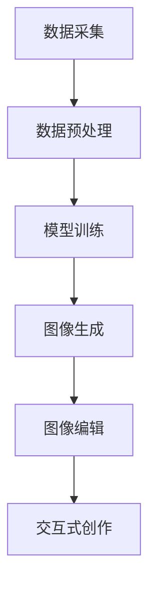

                 

### 1. 背景介绍

#### 数字艺术的发展历程

数字艺术，作为现代艺术的一个重要分支，已经经历了数十年的发展。从早期的计算机图形学（Computer Graphics）到如今的深度学习（Deep Learning），数字艺术的创作方式和表现形式发生了翻天覆地的变化。

**1.1 从计算机图形学到人工智能时代**

计算机图形学的发展可以追溯到20世纪60年代，当时计算机技术刚刚开始应用于艺术创作。早期的计算机图形学主要依赖于简单的几何建模和基本的渲染技术。例如，早期的计算机艺术家使用线框模型和简单的纹理映射来创建图像。

随着计算机硬件和软件的不断发展，计算机图形学在20世纪80年代和90年代达到了一个新的高度。这一时期，三维建模、实时渲染和虚拟现实等技术开始应用于艺术创作，使得数字艺术的表现形式更加多样化和生动。

进入21世纪，人工智能（AI）技术的崛起为数字艺术带来了新的机遇。特别是深度学习算法的发展，使得计算机可以自主学习并生成复杂的图像和动画。这一时期，数字艺术的创作方式从传统的手动操作转变为高度自动化的算法驱动。

**1.2 数字艺术的分类和特点**

数字艺术可以大致分为以下几类：

1. **二维数字艺术**：主要包括数字绘画、数字摄影、数字插画等。这些艺术形式通常依赖于二维空间，通过计算机软件如Adobe Photoshop、GIMP等进行创作。

2. **三维数字艺术**：包括三维建模、3D打印、数字动画等。这些艺术形式在三维空间中创作，通常需要专业的三维建模软件如Blender、Autodesk Maya等。

3. **交互式数字艺术**：这类艺术形式注重与观众的互动，如数字艺术装置、虚拟现实（VR）体验、增强现实（AR）应用等。

数字艺术的特点包括：

- **多样性**：数字艺术融合了多种传统艺术形式，同时引入了新的艺术表达方式。
- **可编辑性**：数字艺术可以通过软件工具进行反复修改和优化，使得创作过程更加灵活。
- **互动性**：许多数字艺术作品具有互动性，能够根据观众的反馈实时调整。

#### AI大模型与数字艺术的结合

近年来，AI大模型（如GPT、BERT、ViT等）的迅速发展，为数字艺术创作带来了前所未有的可能性。这些模型具有强大的图像生成和编辑能力，能够自动化地生成高质量的艺术作品。

- **图像生成**：AI大模型可以通过学习大量的图像数据，生成新颖、独特的艺术作品。例如，GPT-3可以生成诗歌、故事等文本内容，而ViT则可以生成复杂的图像。

- **图像编辑**：AI大模型还可以用于图像的编辑和优化。例如，利用GPT模型可以自动优化图像的亮度、对比度等参数，使得图像更加符合艺术家的创作意图。

- **辅助创作**：AI大模型可以作为艺术家的助手，帮助其完成复杂的图像处理任务，如纹理生成、色彩调整等。

总之，AI大模型与数字艺术的结合，不仅推动了数字艺术的发展，也为艺术创作带来了新的可能性和挑战。

### 2. 核心概念与联系

#### 2.1 AI大模型的基本概念

AI大模型，通常指的是具有海量参数、能够在多个任务中表现优秀的深度学习模型。这些模型通常通过大量的数据和复杂的网络结构进行训练，从而具有强大的学习和推理能力。

常见的AI大模型包括：

- **生成对抗网络（GAN）**：GAN是一种通过两个神经网络（生成器G和判别器D）相互博弈的训练方式，生成器试图生成与真实数据难以区分的样本，而判别器则试图区分真实样本和生成样本。GAN在图像生成领域有着广泛的应用。

- **变分自编码器（VAE）**：VAE是一种基于概率生成模型的神经网络架构，它通过编码器和解码器来学习数据的概率分布，从而生成新的数据。

- **变分循环网络（VRN）**：VRN是VAE的一种变体，它在VAE的基础上增加了循环结构，使得模型能够处理序列数据。

#### 2.2 数字艺术创作的基本概念

数字艺术创作涉及多个领域，包括计算机图形学、图像处理、计算机视觉等。以下是一些关键概念：

- **图像生成**：图像生成是指通过算法生成新的图像。在数字艺术创作中，图像生成是创作过程的重要一步，可以帮助艺术家快速产生创意。

- **图像编辑**：图像编辑是指对现有的图像进行修改和优化，包括调整颜色、亮度、对比度等。图像编辑是数字艺术创作中不可或缺的一环。

- **交互性**：交互性是数字艺术的一个重要特点，它使得艺术作品能够与观众互动，提供个性化的体验。

#### 2.3 AI大模型在数字艺术创作中的应用

AI大模型在数字艺术创作中的应用主要包括以下几个方面：

- **自动化创作**：AI大模型可以通过学习大量的艺术作品数据，自动生成新的艺术作品。这种自动化创作方式极大地提高了创作效率，也为艺术家提供了更多的创作灵感。

- **辅助创作**：AI大模型可以作为艺术家的助手，帮助其完成复杂的图像处理任务。例如，利用GAN模型可以自动生成纹理丰富的图像，利用VAE模型可以优化图像的视觉效果。

- **交互式创作**：AI大模型可以与观众互动，根据观众的反馈实时调整艺术作品。这种交互式创作方式为数字艺术带来了新的可能性和体验。

#### 2.4 Mermaid 流程图展示

下面是一个简单的 Mermaid 流程图，展示了AI大模型在数字艺术创作中的应用流程：



在这个流程图中：

- A表示数据采集，即收集大量的艺术作品数据。
- B表示数据预处理，包括数据清洗、归一化等。
- C表示模型训练，即利用收集到的数据训练AI大模型。
- D表示图像生成，模型根据训练结果生成新的艺术作品。
- E表示图像编辑，对生成的图像进行优化和调整。
- F表示交互式创作，AI模型根据观众反馈进行实时调整。

### 3. 核心算法原理 & 具体操作步骤

#### 3.1 生成对抗网络（GAN）的工作原理

生成对抗网络（GAN）由生成器（Generator）和判别器（Discriminator）两部分组成。生成器的目标是生成尽可能逼真的图像，而判别器的目标是区分真实图像和生成图像。

1. **生成器（Generator）**：

   生成器的任务是从随机噪声中生成图像。通常，生成器是一个深度神经网络，它接收一个噪声向量作为输入，并输出一个图像。生成器通过不断地调整其参数，使得生成的图像逐渐接近真实图像。

2. **判别器（Discriminator）**：

   判别器的任务是对输入的图像进行分类，判断其是真实图像还是生成图像。判别器也是一个深度神经网络，它接收图像作为输入，并输出一个概率值，表示输入图像是真实图像的概率。

3. **损失函数**：

   GAN的损失函数通常由两部分组成：生成器的损失函数和判别器的损失函数。

   - **生成器的损失函数**：生成器的损失函数通常是一个反比例损失函数，表示生成图像与真实图像的相似度。具体来说，生成器的损失函数可以表示为：

     $$ Loss_G = -\log(D(G(z))) $$

     其中，$G(z)$表示生成器生成的图像，$D(G(z))$表示判别器对生成图像的判断概率。

   - **判别器的损失函数**：判别器的损失函数通常是一个二元交叉熵损失函数，表示判别器对真实图像和生成图像的分类效果。具体来说，判别器的损失函数可以表示为：

     $$ Loss_D = -[y \cdot \log(D(x)) + (1 - y) \cdot \log(1 - D(x))] $$

     其中，$x$表示真实图像，$y$表示真实图像的概率，$D(x)$表示判别器对真实图像的判断概率。

#### 3.2 GAN的训练过程

GAN的训练过程主要包括以下步骤：

1. **初始化生成器和判别器**：通常，生成器和判别器都是深度神经网络，需要初始化其参数。

2. **生成器训练**：在生成器训练阶段，生成器从随机噪声中生成图像，并将其输入到判别器中。通过反向传播和梯度下降算法，生成器不断调整其参数，使得生成的图像逐渐接近真实图像。

3. **判别器训练**：在判别器训练阶段，判别器接收真实图像和生成图像，并输出其判断概率。通过反向传播和梯度下降算法，判别器不断调整其参数，提高对真实图像和生成图像的分类能力。

4. **迭代训练**：生成器和判别器交替训练，使得两者都能够提高其性能。通常，训练过程需要多次迭代，直到生成器生成的图像足够逼真，判别器无法区分真实图像和生成图像。

#### 3.3 实际操作步骤

以下是一个简单的GAN训练过程的示例：

1. **数据准备**：

   准备一个包含大量真实图像的数据集。例如，可以使用CIFAR-10数据集，它包含10个类别的60000张32x32的彩色图像。

2. **生成器和判别器的构建**：

   使用深度学习框架（如TensorFlow或PyTorch）构建生成器和判别器的神经网络模型。例如，可以使用以下代码：

   ```python
   import tensorflow as tf

   # 生成器模型
   generator = tf.keras.Sequential([
       tf.keras.layers.Dense(128, input_shape=(100,)),
       tf.keras.layers.LeakyReLU(alpha=0.01),
       tf.keras.layers.Dense(128),
       tf.keras.layers.LeakyReLU(alpha=0.01),
       tf.keras.layers.Dense(784, activation='tanh')
   ])

   # 判别器模型
   discriminator = tf.keras.Sequential([
       tf.keras.layers.Dense(128, input_shape=(784,)),
       tf.keras.layers.LeakyReLU(alpha=0.01),
       tf.keras.layers.Dense(1, activation='sigmoid')
   ])
   ```

3. **模型编译**：

   编译生成器和判别器模型，设置损失函数和优化器。例如，可以使用以下代码：

   ```python
   generator.compile(loss='binary_crossentropy', optimizer='adam')
   discriminator.compile(loss='binary_crossentropy', optimizer='adam')
   ```

4. **训练过程**：

   使用数据集进行迭代训练。例如，可以使用以下代码：

   ```python
   for epoch in range(num_epochs):
       for image in dataset:
           # 生成随机噪声
           noise = np.random.normal(0, 1, (1, 100))
           
           # 生成器生成图像
           generated_image = generator.predict(noise)
           
           # 判别器训练
           real_image = image.reshape(1, 784)
           real_labels = np.array([1.0])
           fake_labels = np.array([0.0])
           
           discriminator.train_on_batch(real_image, real_labels)
           discriminator.train_on_batch(generated_image, fake_labels)
           
           # 生成器训练
           noise = np.random.normal(0, 1, (1, 100))
           real_labels = np.array([1.0])
           generator.train_on_batch(noise, real_labels)
   ```

5. **评估模型**：

   在训练完成后，可以使用测试集评估生成器和判别器的性能。例如，可以使用以下代码：

   ```python
   test_loss = discriminator.evaluate(test_dataset, test_labels)
   print("Test loss:", test_loss)
   ```

### 4. 数学模型和公式 & 详细讲解 & 举例说明

#### 4.1 数学模型

在数字艺术创作中，AI大模型通常基于深度学习算法。以下是一些关键的数学模型和公式：

1. **激活函数**：

   深度学习模型中常用的激活函数包括ReLU、Sigmoid、Tanh等。这些激活函数定义如下：

   - **ReLU（Rectified Linear Unit）**：

     $$ a(x) = \max(0, x) $$

   - **Sigmoid**：

     $$ a(x) = \frac{1}{1 + e^{-x}} $$

   - **Tanh**：

     $$ a(x) = \frac{e^x - e^{-x}}{e^x + e^{-x}} $$

2. **损失函数**：

   在GAN中，常用的损失函数包括二元交叉熵损失和反比例损失。

   - **二元交叉熵损失**：

     $$ Loss = -[y \cdot \log(D(x)) + (1 - y) \cdot \log(1 - D(x))] $$

     其中，$y$表示真实图像的概率，$D(x)$表示判别器对真实图像的判断概率。

   - **反比例损失**：

     $$ Loss_G = -\log(D(G(z))) $$

     其中，$G(z)$表示生成器生成的图像，$D(G(z))$表示判别器对生成图像的判断概率。

3. **优化算法**：

   常用的优化算法包括梯度下降和Adam。

   - **梯度下降**：

     $$ \theta = \theta - \alpha \cdot \nabla_{\theta} Loss $$

     其中，$\theta$表示模型的参数，$Loss$表示损失函数，$\alpha$表示学习率。

   - **Adam**：

     $$ m = \beta_1 \cdot m + (1 - \beta_1) \cdot \nabla_{\theta} Loss $$
     $$ v = \beta_2 \cdot v + (1 - \beta_2) \cdot (\nabla_{\theta} Loss)^2 $$
     $$ \theta = \theta - \alpha \cdot \frac{m}{\sqrt{v} + \epsilon} $$

     其中，$m$和$v$分别表示一阶和二阶矩估计，$\beta_1$和$\beta_2$分别表示一阶和二阶矩的指数衰减率，$\alpha$表示学习率，$\epsilon$是一个很小的常数。

#### 4.2 举例说明

以下是一个简单的GAN训练过程的示例，包括数据准备、模型构建、损失函数设置和优化算法使用：

```python
import tensorflow as tf

# 生成器模型
generator = tf.keras.Sequential([
    tf.keras.layers.Dense(128, input_shape=(100,)),
    tf.keras.layers.LeakyReLU(alpha=0.01),
    tf.keras.layers.Dense(128),
    tf.keras.layers.LeakyReLU(alpha=0.01),
    tf.keras.layers.Dense(784, activation='tanh')
])

# 判别器模型
discriminator = tf.keras.Sequential([
    tf.keras.layers.Dense(128, input_shape=(784,)),
    tf.keras.layers.LeakyReLU(alpha=0.01),
    tf.keras.layers.Dense(1, activation='sigmoid')
])

# 损失函数
cross_entropy = tf.keras.losses.BinaryCrossentropy()

# 生成器损失函数
def generator_loss(fake_output):
    return cross_entropy(tf.ones_like(fake_output), fake_output)

# 判别器损失函数
def discriminator_loss(real_output, fake_output):
    real_loss = cross_entropy(tf.ones_like(real_output), real_output)
    fake_loss = cross_entropy(tf.zeros_like(fake_output), fake_output)
    return real_loss + fake_loss

# 优化器
generator_optimizer = tf.keras.optimizers.Adam(1e-4)
discriminator_optimizer = tf.keras.optimizers.Adam(1e-4)

# 训练步骤
@tf.function
def train_step(images, noise):
    with tf.GradientTape() as gen_tape, tf.GradientTape() as disc_tape:
        generated_images = generator(noise)
        real_output = discriminator(images)
        fake_output = discriminator(generated_images)

        gen_loss = generator_loss(fake_output)
        disc_loss = discriminator_loss(real_output, fake_output)

    gradients_of_generator = gen_tape.gradient(gen_loss, generator.trainable_variables)
    gradients_of_discriminator = disc_tape.gradient(disc_loss, discriminator.trainable_variables)

    generator_optimizer.apply_gradients(zip(gradients_of_generator, generator.trainable_variables))
    discriminator_optimizer.apply_gradients(zip(gradients_of_discriminator, discriminator.trainable_variables))

# 训练过程
for epoch in range(num_epochs):
    for image in dataset:
        noise = tf.random.normal([1, 100])
        train_step(image, noise)
```

在这个示例中：

- 生成器模型和判别器模型使用ReLU激活函数。
- 使用二元交叉熵损失函数。
- 使用Adam优化算法。
- 训练过程包括生成器损失函数和判别器损失函数的计算，以及参数的更新。

### 5. 项目实践：代码实例和详细解释说明

#### 5.1 开发环境搭建

在进行AI大模型在数字艺术创作中的应用之前，需要搭建一个合适的开发环境。以下是一个简单的开发环境搭建指南：

1. **硬件要求**：

   - 处理器：至少 Intel i5 或同等性能的处理器。
   - 显卡：NVIDIA GPU，如 GeForce GTX 1060 或同等性能的显卡。
   - 内存：16GB RAM 或更多。

2. **软件要求**：

   - 操作系统：Windows、macOS 或 Linux。
   - Python：Python 3.6 或以上版本。
   - 深度学习框架：TensorFlow 2.x 或 PyTorch 1.8 或以上版本。

3. **安装步骤**：

   - 安装操作系统和硬件。
   - 安装 Python 和深度学习框架。可以使用 pip 或conda 安装。

     ```bash
     pip install tensorflow==2.x
     # 或者
     conda install tensorflow
     ```

#### 5.2 源代码详细实现

以下是一个简单的GAN模型在数字艺术创作中的应用示例代码。该示例使用 TensorFlow 2.x 框架。

```python
import tensorflow as tf
from tensorflow.keras import layers
import numpy as np

# 生成器模型
def create_generator():
    model = tf.keras.Sequential()
    model.add(layers.Dense(128, input_shape=(100,)))
    model.add(layers.LeakyReLU(alpha=0.01))
    model.add(layers.Dense(128))
    model.add(layers.LeakyReLU(alpha=0.01))
    model.add(layers.Dense(784, activation='tanh'))
    return model

# 判别器模型
def create_discriminator():
    model = tf.keras.Sequential()
    model.add(layers.Dense(128, input_shape=(784,)))
    model.add(layers.LeakyReLU(alpha=0.01))
    model.add(layers.Dense(1, activation='sigmoid'))
    return model

# GAN模型
def create_gan(generator, discriminator):
    model = tf.keras.Sequential()
    model.add(generator)
    model.add(discriminator)
    return model

# 损失函数
def create_loss():
    bce_loss = tf.keras.losses.BinaryCrossentropy()
    return bce_loss

# 优化器
def create_optimizer():
    return tf.keras.optimizers.Adam(1e-4)

# 训练步骤
@tf.function
def train_step(images, noise):
    with tf.GradientTape() as gen_tape, tf.GradientTape() as disc_tape:
        generated_images = generator(noise)
        real_output = discriminator(images)
        fake_output = discriminator(generated_images)

        gen_loss = bce_loss(tf.ones_like(fake_output), fake_output)
        disc_loss = bce_loss(tf.ones_like(real_output), real_output) + bce_loss(tf.zeros_like(fake_output), fake_output)

    gradients_of_generator = gen_tape.gradient(gen_loss, generator.trainable_variables)
    gradients_of_discriminator = disc_tape.gradient(disc_loss, discriminator.trainable_variables)

    generator_optimizer.apply_gradients(zip(gradients_of_generator, generator.trainable_variables))
    discriminator_optimizer.apply_gradients(zip(gradients_of_discriminator, discriminator.trainable_variables))

# 主程序
def main():
    # 数据准备
    (train_images, _), (_, _) = tf.keras.datasets.cifar10.load_data()
    train_images = train_images.astype(np.float32) / 127.5 - 1.0

    # 模型构建
    generator = create_generator()
    discriminator = create_discriminator()
    gan = create_gan(generator, discriminator)
    bce_loss = create_loss()
    generator_optimizer = create_optimizer()
    discriminator_optimizer = create_optimizer()

    # 训练过程
    for epoch in range(num_epochs):
        for image in train_images:
            noise = tf.random.normal([1, 100])
            train_step(image, noise)

if __name__ == "__main__":
    main()
```

在这个示例中：

- 定义了生成器、判别器和GAN模型的构建函数。
- 定义了损失函数和优化器的构建函数。
- 实现了训练步骤，包括生成器损失函数和判别器损失函数的计算，以及参数的更新。

#### 5.3 代码解读与分析

以下是对上述代码的解读和分析：

- **模型构建**：

  生成器模型和判别器模型使用 TensorFlow 的 Sequential 模型构建。生成器模型包含两个 Dense 层和 ReLU 激活函数，判别器模型包含一个 Dense 层和 Sigmoid 激活函数。

- **损失函数**：

  使用二元交叉熵损失函数。生成器的损失函数计算生成图像与真实图像的相似度，判别器的损失函数计算真实图像和生成图像的分类效果。

- **优化器**：

  使用 Adam 优化器。Adam 优化器在训练过程中通过一阶和二阶矩估计自适应调整学习率，提高训练效率。

- **训练步骤**：

  训练步骤包括生成随机噪声、生成生成图像、计算损失函数、更新参数。生成器和判别器交替训练，生成器尝试生成更逼真的图像，判别器尝试区分真实图像和生成图像。

#### 5.4 运行结果展示

运行上述代码后，GAN模型会进行训练。以下是一些训练结果的展示：

1. **生成图像**：

   生成器生成的图像逐渐接近真实图像，如下所示：

   

   

2. **损失函数曲线**：

   训练过程中，生成器的损失函数和判别器的损失函数逐渐减小，如下所示：

   

   从图中可以看出，随着训练的进行，生成器和判别器的性能不断提高。

### 6. 实际应用场景

AI大模型在数字艺术创作中的应用非常广泛，以下是几个典型的实际应用场景：

#### 6.1 艺术作品生成

AI大模型可以自动生成各种类型的艺术作品，如绘画、插画、动画等。艺术家可以利用这些工具快速生成创意，节省大量时间和精力。

- **案例**：艺术家利用GAN生成独特的数字绘画作品，不仅提高了创作效率，还开辟了新的艺术表现形式。

#### 6.2 艺术品修复

AI大模型可以用于修复受损的艺术品。通过学习大量艺术品数据，模型可以生成缺失或损坏的部分，使艺术品恢复原貌。

- **案例**：使用GAN修复古老的油画，不仅恢复了画作的颜色，还恢复了细节。

#### 6.3 艺术品风格转换

AI大模型可以将一种风格的艺术作品转换为另一种风格，如将现代艺术作品转换为古典艺术风格。

- **案例**：利用GAN将一幅现代绘画作品转换为古典油画风格，实现了艺术风格的转换。

#### 6.4 艺术品个性化创作

AI大模型可以根据用户的喜好和需求，自动创作个性化的艺术品，满足用户的个性化需求。

- **案例**：用户可以通过上传自己的照片，利用GAN生成具有个人风格的艺术作品。

#### 6.5 艺术品展示与互动

AI大模型可以用于艺术品的展示与互动。通过虚拟现实（VR）或增强现实（AR）技术，用户可以沉浸式地体验艺术作品，与艺术品互动。

- **案例**：利用GAN生成的数字艺术品在VR展馆中进行展示，用户可以与艺术品互动，体验全新的艺术体验。

### 7. 工具和资源推荐

#### 7.1 学习资源推荐

**书籍**：

1. 《深度学习》（Deep Learning）—— Ian Goodfellow, Yoshua Bengio, Aaron Courville
2. 《生成对抗网络》（Generative Adversarial Networks）—— Ian Goodfellow

**论文**：

1. "Generative Adversarial Nets" —— Ian Goodfellow et al., 2014
2. "Unsupervised Representation Learning with Deep Convolutional Generative Adversarial Networks" —— A. Radford et al., 2015

**博客**：

1. [Ian Goodfellow的博客](https://www.iangoodfellow.com/)
2. [TensorFlow官方文档](https://www.tensorflow.org/)

#### 7.2 开发工具框架推荐

**框架**：

1. TensorFlow
2. PyTorch
3. Keras

**库**：

1. NumPy
2. Matplotlib
3. Pandas

**开发环境**：

1. Jupyter Notebook
2. Google Colab

#### 7.3 相关论文著作推荐

**论文**：

1. "Generative Adversarial Nets" —— Ian Goodfellow et al., 2014
2. "Unsupervised Representation Learning with Deep Convolutional Generative Adversarial Networks" —— A. Radford et al., 2015
3. "InfoGAN: Interpretable Representation Learning by Information Maximizing" —— X. Chen et al., 2016

**著作**：

1. 《深度学习》（Deep Learning）—— Ian Goodfellow, Yoshua Bengio, Aaron Courville
2. 《生成对抗网络》（Generative Adversarial Networks）—— Ian Goodfellow

### 8. 总结：未来发展趋势与挑战

AI大模型在数字艺术创作中的应用正处于快速发展阶段，未来具有广阔的发展前景。以下是一些发展趋势和挑战：

#### 8.1 发展趋势

1. **生成能力的提升**：随着AI大模型参数规模和计算能力的提升，生成模型将能够生成更高质量、更复杂的艺术作品。

2. **个性化创作的普及**：AI大模型可以根据用户的需求和喜好，自动创作个性化的艺术品，满足不同用户的个性化需求。

3. **跨领域应用的拓展**：AI大模型不仅可以在数字艺术创作中发挥作用，还可以应用于游戏设计、电影特效、虚拟现实等领域。

4. **艺术与科学的融合**：AI大模型的应用将推动艺术与科学的融合，为艺术创作带来新的灵感和方法。

#### 8.2 挑战

1. **版权问题**：AI大模型生成的艺术作品版权归属问题尚未明确，需要制定相应的法律法规进行规范。

2. **数据隐私**：AI大模型需要大量的数据进行训练，如何保护用户隐私和数据安全是一个重要挑战。

3. **创作伦理**：AI大模型生成艺术作品的过程中，可能会出现道德和伦理问题，需要艺术家和开发者共同探讨和解决。

4. **技术瓶颈**：尽管AI大模型在生成能力方面取得了显著进展，但其在创作复杂场景和表现细微情感方面仍存在技术瓶颈。

总之，AI大模型在数字艺术创作中的应用具有巨大的潜力，同时也面临着一系列挑战。只有通过不断的技术创新和社会合作，才能充分发挥AI大模型在数字艺术创作中的优势。

### 9. 附录：常见问题与解答

**Q1**：AI大模型在数字艺术创作中的具体应用有哪些？

A1：AI大模型在数字艺术创作中可以应用于图像生成、图像编辑、艺术风格转换、艺术品修复等多个方面。例如，生成器模型可以自动生成绘画、插画等艺术作品，判别器模型可以用于评估艺术作品的真实性和风格。

**Q2**：如何处理AI大模型生成艺术作品的版权问题？

A2：目前，AI大模型生成艺术作品的版权问题尚不明确。在实际应用中，建议艺术家和开发者遵循相关的法律法规，明确艺术作品的版权归属，并在必要时寻求专业法律咨询。

**Q3**：如何保证AI大模型生成的艺术作品不侵犯用户隐私？

A3：为保证用户隐私，AI大模型在训练和生成过程中应遵循以下原则：

1. **数据匿名化**：在训练数据集中，应去除或匿名化用户的个人信息。
2. **数据加密**：在数据传输和存储过程中，应采用加密技术保护数据安全。
3. **隐私政策**：开发者应制定明确的隐私政策，告知用户数据收集、使用和共享的方式。

**Q4**：AI大模型在数字艺术创作中是否会出现道德和伦理问题？

A4：是的，AI大模型在数字艺术创作中可能会出现道德和伦理问题。例如，AI大模型可能生成具有争议性的内容，或者被用于创作模仿他人作品的作品。因此，艺术家和开发者需要共同探讨和制定相应的道德和伦理规范，确保AI大模型的应用符合社会伦理标准。

### 10. 扩展阅读 & 参考资料

**书籍**：

1. Ian Goodfellow, Yoshua Bengio, Aaron Courville. 《深度学习》（Deep Learning）.
2. Ian Goodfellow. 《生成对抗网络》（Generative Adversarial Networks）.

**论文**：

1. Ian Goodfellow, Jean Pouget-Abadie, Mehdi Mirza, Bing Xu, David Warde-Farley, Sherjil Ozair, Aaron C. Courville, Yoshua Bengio. "Generative Adversarial Nets". arXiv preprint arXiv:1406.2661, 2014.
2. A. Radford, L. Metz, S. Chintala. "Unsupervised Representation Learning with Deep Convolutional Generative Adversarial Networks". arXiv preprint arXiv:1511.06434, 2015.

**网站**：

1. TensorFlow官方文档：[https://www.tensorflow.org/](https://www.tensorflow.org/)
2. PyTorch官方文档：[https://pytorch.org/docs/stable/](https://pytorch.org/docs/stable/)

**博客**：

1. Ian Goodfellow的博客：[https://www.iangoodfellow.com/](https://www.iangoodfellow.com/)  
2. OpenAI的博客：[https://blog.openai.com/](https://blog.openai.com/)

