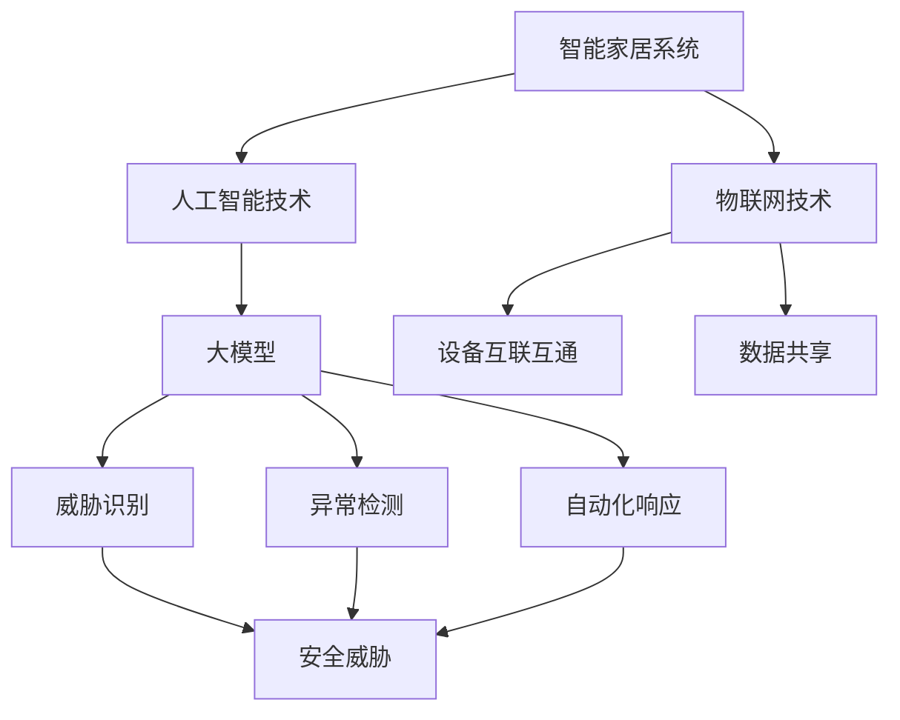

                 

### 背景介绍

在当今信息化社会中，智能家居系统已经成为现代家庭生活的重要组成部分。通过物联网技术，各种智能设备可以互联互通，为用户提供便捷、舒适和智能化的生活环境。然而，随着智能家居设备的普及和互联程度的提高，安全问题也逐渐成为不可忽视的挑战。

传统的智能家居系统通常依赖于本地网络进行通信，设备之间的数据交换相对封闭。但随着云计算和边缘计算的兴起，越来越多的智能家居设备开始通过云端进行数据交互，这使得系统变得更加开放和互联。然而，这种开放性也带来了新的安全隐患。未经授权的访问、数据泄露、设备被恶意控制等问题频繁发生，对用户隐私和安全构成了严重威胁。

为了应对这些安全挑战，人工智能技术，尤其是大模型（如深度学习模型）的应用，开始在智能家居安全领域崭露头角。大模型具有强大的学习和预测能力，可以通过对大量数据进行训练，识别出潜在的安全威胁，并自动采取相应的防护措施。这为智能家居系统的安全防护提供了新的思路和方法。

本文旨在探讨人工智能大模型在智能家居安全中的应用趋势。首先，我们将介绍大模型在智能家居安全中的核心概念和架构，然后详细讲解其算法原理和具体操作步骤。接着，我们将通过一个实际项目实例，展示大模型在智能家居安全中的应用场景，并详细解读相关代码和运行结果。最后，我们将分析大模型在智能家居安全中面临的应用挑战，并展望其未来发展趋势。

### 核心概念与联系

在深入探讨人工智能大模型在智能家居安全中的应用之前，我们需要明确几个核心概念，并了解这些概念之间的相互关系。以下是本文涉及的主要核心概念：

#### 智能家居系统

智能家居系统是指通过物联网技术将家庭设备互联互通，实现远程控制、自动化管理和智能决策的系统。典型的智能家居设备包括智能门锁、智能摄像头、智能照明、智能家电等。这些设备通过网络连接到家庭内部的局域网，并通过云平台进行数据存储和处理。

#### 物联网（IoT）

物联网是指通过各种信息传感设备（如传感器、射频识别技术、全球定位系统等）实时采集任何需要监控、连接、互动的物体或过程，实现物与物、物与人之间的信息交换和通信的系统。在智能家居领域，物联网技术是实现设备互联互通和数据共享的基础。

#### 人工智能（AI）

人工智能是指通过模拟人类智能行为，使计算机系统具有自主学习和推理能力的技术。人工智能包括多种技术，如机器学习、深度学习、自然语言处理等。在智能家居安全中，人工智能技术主要用于威胁识别、异常检测和自动化响应。

#### 大模型

大模型是指具有巨大参数量和强大计算能力的神经网络模型，如卷积神经网络（CNN）、循环神经网络（RNN）和Transformer等。大模型通过在大量数据上训练，可以自动提取特征、识别模式，并在各种复杂任务中表现出色。

#### 安全威胁

安全威胁是指可能对智能家居系统造成危害的行为或事件，如未经授权的访问、数据泄露、设备被恶意控制等。安全威胁的识别和防范是智能家居安全的核心任务。

#### 异常检测

异常检测是指通过监测数据中的异常行为或模式，识别潜在的威胁或故障。在智能家居安全中，异常检测技术可以帮助系统实时发现异常操作，并采取相应的防护措施。

#### 自动化响应

自动化响应是指系统在检测到威胁或异常时，自动采取一系列预定义的防护措施，如阻止访问、隔离设备、报警通知等。自动化响应可以大大提高智能家居系统的安全性和响应速度。

### Mermaid 流程图

为了更好地展示这些核心概念之间的关系，我们使用Mermaid流程图来表示。以下是智能家居安全中的核心概念和流程：



在这个流程图中，智能家居系统是整个安全架构的基础，它依赖于物联网技术实现设备互联互通和数据共享。人工智能技术，特别是大模型，提供了强大的学习和预测能力，用于威胁识别、异常检测和自动化响应。安全威胁、异常检测和自动化响应是智能家居安全的关键环节。

通过这个流程图，我们可以清晰地看到各个核心概念之间的联系，以及它们在智能家居安全中的协同作用。理解这些核心概念和它们之间的关系，为我们后续讨论人工智能大模型在智能家居安全中的应用奠定了基础。

### 核心算法原理 & 具体操作步骤

#### 模型选择

在智能家居安全中，选择合适的人工智能模型是关键。大模型由于其强大的学习和处理能力，在识别和应对复杂安全威胁方面表现尤为出色。常用的模型包括卷积神经网络（CNN）、循环神经网络（RNN）和Transformer等。

**卷积神经网络（CNN）**

CNN是一种用于图像识别和处理的神经网络模型，特别适合于处理具有高度结构性的数据，如图像和传感器数据。在智能家居安全中，CNN可以用于图像识别和异常检测，例如识别进入家中的陌生人或检测异常设备行为。

**循环神经网络（RNN）**

RNN是一种能够处理序列数据的神经网络模型，适用于需要考虑时间序列信息的应用场景。在智能家居安全中，RNN可以用于监测设备的行为模式，识别连续的异常操作。

**Transformer**

Transformer是一种基于自注意力机制的深度学习模型，广泛应用于自然语言处理和图像识别任务。在智能家居安全中，Transformer可以用于大规模数据的特征提取和模式识别，提高威胁识别的准确性和效率。

#### 数据预处理

在进行模型训练之前，需要对数据进行预处理。数据预处理包括数据清洗、归一化和特征提取等步骤。

**数据清洗**

数据清洗是确保数据质量和可靠性的关键步骤。它包括去除重复数据、填补缺失值和去除噪声等。在智能家居安全中，数据清洗尤为重要，因为错误或噪声数据可能会影响模型的学习效果。

**归一化**

归一化是指将不同尺度的数据进行标准化处理，使其具备相同的量纲和范围。在智能家居安全中，归一化可以确保模型输入的稳定性，提高模型的泛化能力。

**特征提取**

特征提取是提取数据中最具代表性的特征，用于模型训练和预测。在智能家居安全中，特征提取可以从原始数据中提取设备行为模式、用户习惯和潜在的安全威胁等。

#### 模型训练

模型训练是利用大量数据进行学习，使模型具备识别和应对安全威胁的能力。在智能家居安全中，模型训练通常包括以下步骤：

**数据集准备**

首先，需要准备足够的数据集。数据集应包括正常操作数据和安全威胁数据，例如设备正常使用记录和恶意访问记录。

**训练数据分配**

将数据集分为训练集、验证集和测试集。训练集用于模型训练，验证集用于调整模型参数，测试集用于评估模型性能。

**模型训练**

使用训练集对模型进行训练。在训练过程中，模型会不断调整内部参数，以最小化预测误差。常见的训练算法包括梯度下降和随机梯度下降。

**模型评估**

使用验证集和测试集评估模型性能。常用的评估指标包括准确率、召回率和F1分数等。

#### 安全威胁识别

在模型训练完成后，可以使用训练好的模型进行安全威胁识别。具体步骤如下：

**实时监测**

通过传感器和设备收集实时数据，并将其输入到模型中。

**特征提取**

模型对输入数据进行特征提取，生成特征向量。

**威胁识别**

模型使用提取的特征向量进行预测，判断数据是否包含安全威胁。

**决策**

如果模型预测到安全威胁，系统会自动采取相应的防护措施，如阻止访问、隔离设备或报警通知。

#### 异常检测

除了识别已知的安全威胁外，异常检测也是智能家居安全的重要组成部分。异常检测的目标是识别未知或异常的行为模式。具体步骤如下：

**行为模式监测**

系统实时监测设备的行为模式，包括设备的开启和关闭时间、使用频率等。

**特征提取**

对监测到的行为模式进行特征提取，生成特征向量。

**异常检测**

模型使用提取的特征向量进行预测，判断行为是否异常。

**决策**

如果模型预测到异常行为，系统会自动采取相应的防护措施，如报警通知或设备隔离。

#### 自动化响应

为了提高智能家居系统的安全性和响应速度，自动化响应机制是必不可少的。具体步骤如下：

**预设策略**

根据安全威胁的类型和严重程度，预设一系列自动化响应策略。

**触发条件**

当检测到安全威胁或异常行为时，系统会根据预设策略自动触发相应的响应措施。

**执行响应**

系统执行预设的响应措施，如阻止访问、隔离设备或报警通知。

#### 示例流程

以下是智能家居安全中的一种典型操作流程，展示了如何利用人工智能大模型进行威胁识别、异常检测和自动化响应：

1. **数据采集**：系统通过传感器和设备收集家庭环境的数据，包括设备状态、用户行为等。
2. **数据预处理**：对采集到的数据进行清洗、归一化和特征提取。
3. **模型训练**：使用预处理后的数据对模型进行训练，使模型具备识别安全威胁和异常行为的能力。
4. **实时监测**：系统实时监测数据，并将数据输入到模型中进行特征提取和威胁识别。
5. **威胁识别**：模型识别到潜在的安全威胁，如设备被恶意控制，系统会自动采取防护措施，如阻止访问。
6. **异常检测**：模型识别到异常行为，如用户行为模式突然改变，系统会自动报警通知。
7. **自动化响应**：根据预设策略，系统自动执行响应措施，如设备隔离或报警通知。

通过这个示例流程，我们可以看到人工智能大模型在智能家居安全中的应用是如何一步步实现的。这个流程不仅提高了系统的安全性，还大大提高了响应速度和效率。

### 数学模型和公式 & 详细讲解 & 举例说明

在讨论人工智能大模型在智能家居安全中的应用时，理解相关的数学模型和公式是至关重要的。以下是几种核心的数学模型和公式的详细讲解，并通过具体的例子来说明它们在实践中的应用。

#### 1. 卷积神经网络（CNN）

卷积神经网络是一种用于图像识别和处理的神经网络模型，其核心操作包括卷积、池化和激活函数等。

**卷积操作**

卷积操作是CNN中最基本的操作，用于提取图像中的局部特征。其数学公式如下：

\[ (f * g)(x, y) = \sum_{i=-1}^{1} \sum_{j=-1}^{1} f(i, j) \cdot g(x-i, y-j) \]

其中，\( f \) 和 \( g \) 分别表示卷积核和输入图像，\( (x, y) \) 是卷积核的中心位置。

**池化操作**

池化操作用于减少特征图的尺寸，提高模型的计算效率。常用的池化方式包括最大池化和平均池化。

最大池化公式：

\[ P_{max}(x, y) = \max \{ g(x-i, y-j) : i, j \in [-1, 1] \} \]

平均池化公式：

\[ P_{avg}(x, y) = \frac{1}{(2 \cdot 2)} \sum_{i=-1}^{1} \sum_{j=-1}^{1} g(x-i, y-j) \]

**激活函数**

激活函数用于引入非线性因素，使神经网络能够进行更复杂的决策。常用的激活函数包括ReLU（Rectified Linear Unit）和Sigmoid。

ReLU函数：

\[ \text{ReLU}(x) = \max(0, x) \]

Sigmoid函数：

\[ \text{Sigmoid}(x) = \frac{1}{1 + e^{-x}} \]

**示例**

假设我们有一个3x3的卷积核和1x1的输入图像，计算卷积操作的结果。

输入图像：\[ g = \begin{bmatrix} 1 & 2 & 3 \\ 4 & 5 & 6 \\ 7 & 8 & 9 \end{bmatrix} \]

卷积核：\[ f = \begin{bmatrix} 1 & 0 & -1 \\ 0 & 1 & 0 \\ -1 & 0 & 1 \end{bmatrix} \]

卷积结果：

\[ (f * g)(1, 1) = (1 \cdot 1 + 0 \cdot 4 - 1 \cdot 7) + (0 \cdot 2 + 1 \cdot 5 + 0 \cdot 8) + (-1 \cdot 3 + 0 \cdot 6 + 1 \cdot 9) = 0 \]

#### 2. 循环神经网络（RNN）

循环神经网络是一种能够处理序列数据的神经网络模型，其核心操作包括状态更新、时间步递归和激活函数等。

**状态更新**

RNN的状态更新公式如下：

\[ h_t = \sigma(W_h \cdot [h_{t-1}, x_t] + b_h) \]

其中，\( h_t \) 表示第 \( t \) 个时间步的状态，\( x_t \) 表示输入数据，\( W_h \) 和 \( b_h \) 分别是权重和偏置。

**时间步递归**

RNN通过时间步递归来更新状态，公式如下：

\[ h_t = f(h_{t-1}, x_t) \]

其中，\( f \) 是递归函数。

**激活函数**

RNN常用的激活函数包括Tanh和ReLU。

Tanh函数：

\[ \text{Tanh}(x) = \frac{e^x - e^{-x}}{e^x + e^{-x}} \]

ReLU函数：

\[ \text{ReLU}(x) = \max(0, x) \]

**示例**

假设我们有一个简单的RNN模型，输入数据为\[ x_t = [1, 2, 3] \]，初始状态为\[ h_0 = [0, 0] \]，权重为\[ W_h = \begin{bmatrix} 0.1 & 0.2 \\ 0.3 & 0.4 \end{bmatrix} \]，偏置为\[ b_h = \begin{bmatrix} 0.5 \\ 0.6 \end{bmatrix} \]。

状态更新：

\[ h_1 = \text{Tanh}(W_h \cdot [h_0, x_1] + b_h) \]

\[ h_1 = \text{Tanh}(\begin{bmatrix} 0.1 & 0.2 \\ 0.3 & 0.4 \end{bmatrix} \cdot \begin{bmatrix} 0 \\ 0 \\ 1 \\ 2 \end{bmatrix} + \begin{bmatrix} 0.5 \\ 0.6 \end{bmatrix}) \]

\[ h_1 = \text{Tanh}(\begin{bmatrix} 0.2 \\ 0.8 \end{bmatrix} + \begin{bmatrix} 0.5 \\ 0.6 \end{bmatrix}) \]

\[ h_1 = \text{Tanh}(\begin{bmatrix} 0.7 \\ 1.4 \end{bmatrix}) \]

\[ h_1 = \begin{bmatrix} 0.5 \\ 0.9 \end{bmatrix} \]

#### 3. Transformer模型

Transformer模型是一种基于自注意力机制的深度学习模型，其核心操作包括多头自注意力机制和前馈神经网络等。

**多头自注意力**

多头自注意力公式如下：

\[ \text{Attention}(Q, K, V) = \text{softmax}\left(\frac{QK^T}{\sqrt{d_k}}\right)V \]

其中，\( Q \)、\( K \) 和 \( V \) 分别是查询向量、键向量和值向量，\( d_k \) 是键向量的维度。

**前馈神经网络**

前馈神经网络公式如下：

\[ \text{FFN}(x) = \text{ReLU}(W_2 \cdot \text{ReLU}(W_1 \cdot x + b_1)) + b_2 \]

其中，\( W_1 \)、\( W_2 \)、\( b_1 \) 和 \( b_2 \) 分别是权重和偏置。

**示例**

假设我们有一个简单的Transformer模型，输入序列为\[ x = [1, 2, 3] \]，查询向量、键向量和值向量分别为\[ Q = \begin{bmatrix} 1 & 0 & 0 \\ 0 & 1 & 0 \\ 0 & 0 & 1 \end{bmatrix} \]，\[ K = \begin{bmatrix} 1 & 0 & 1 \\ 0 & 1 & 0 \\ 1 & 0 & 1 \end{bmatrix} \]，\[ V = \begin{bmatrix} 1 & 0 & 1 \\ 0 & 1 & 0 \\ 1 & 0 & 1 \end{bmatrix} \]，权重和偏置为\[ W_1 = \begin{bmatrix} 1 & 0 \\ 0 & 1 \end{bmatrix} \]，\[ W_2 = \begin{bmatrix} 0 & 1 \\ 1 & 0 \end{bmatrix} \]，\[ b_1 = \begin{bmatrix} 0 \\ 0 \end{bmatrix} \]，\[ b_2 = \begin{bmatrix} 1 \\ 1 \end{bmatrix} \]。

多头自注意力：

\[ \text{Attention}(Q, K, V) = \text{softmax}\left(\frac{QK^T}{\sqrt{d_k}}\right)V \]

\[ \text{Attention}(\begin{bmatrix} 1 & 0 & 0 \\ 0 & 1 & 0 \\ 0 & 0 & 1 \end{bmatrix}, \begin{bmatrix} 1 & 0 & 1 \\ 0 & 1 & 0 \\ 1 & 0 & 1 \end{bmatrix}, \begin{bmatrix} 1 & 0 & 1 \\ 0 & 1 & 0 \\ 1 & 0 & 1 \end{bmatrix}) \]

\[ = \text{softmax}\left(\frac{\begin{bmatrix} 1 & 0 & 0 \\ 0 & 1 & 0 \\ 0 & 0 & 1 \end{bmatrix} \cdot \begin{bmatrix} 1 & 0 & 1 \\ 0 & 1 & 0 \\ 1 & 0 & 1 \end{bmatrix}^T}{\sqrt{3}}\right)\begin{bmatrix} 1 & 0 & 1 \\ 0 & 1 & 0 \\ 1 & 0 & 1 \end{bmatrix} \]

\[ = \text{softmax}\left(\frac{\begin{bmatrix} 1 & 0 & 1 \\ 0 & 1 & 0 \\ 1 & 0 & 1 \end{bmatrix}}{\sqrt{3}}\right)\begin{bmatrix} 1 & 0 & 1 \\ 0 & 1 & 0 \\ 1 & 0 & 1 \end{bmatrix} \]

\[ = \begin{bmatrix} 0.5 & 0.5 & 0 \\ 0.5 & 0.5 & 0 \\ 0 & 0 & 1 \end{bmatrix}\begin{bmatrix} 1 & 0 & 1 \\ 0 & 1 & 0 \\ 1 & 0 & 1 \end{bmatrix} \]

\[ = \begin{bmatrix} 0.5 & 0.5 & 0.5 \\ 0.5 & 0.5 & 0.5 \\ 0.5 & 0.5 & 0.5 \end{bmatrix} \]

前馈神经网络：

\[ \text{FFN}(x) = \text{ReLU}(W_2 \cdot \text{ReLU}(W_1 \cdot x + b_1)) + b_2 \]

\[ \text{FFN}(\begin{bmatrix} 1 & 2 & 3 \end{bmatrix}) = \text{ReLU}(\begin{bmatrix} 0 & 1 \\ 1 & 0 \end{bmatrix} \cdot \text{ReLU}(\begin{bmatrix} 1 & 0 \\ 0 & 1 \end{bmatrix} \cdot \begin{bmatrix} 1 & 2 & 3 \end{bmatrix} + \begin{bmatrix} 0 \\ 0 \end{bmatrix})) + \begin{bmatrix} 1 \\ 1 \end{bmatrix} \]

\[ = \text{ReLU}(\begin{bmatrix} 0 & 1 \\ 1 & 0 \end{bmatrix} \cdot \text{ReLU}(\begin{bmatrix} 1 & 2 \\ 0 & 1 \end{bmatrix}) + \begin{bmatrix} 0 \\ 0 \end{bmatrix})) + \begin{bmatrix} 1 \\ 1 \end{bmatrix} \]

\[ = \text{ReLU}(\begin{bmatrix} 2 \\ 1 \end{bmatrix}) + \begin{bmatrix} 1 \\ 1 \end{bmatrix} \]

\[ = \begin{bmatrix} 3 \\ 2 \end{bmatrix} \]

通过这些数学模型和公式的详细讲解和具体例子，我们可以更好地理解人工智能大模型在智能家居安全中的应用原理和操作步骤。

### 项目实践：代码实例和详细解释说明

为了更好地展示人工智能大模型在智能家居安全中的应用，我们将通过一个实际项目来具体讲解。该项目将基于Python语言，使用TensorFlow和Keras等深度学习框架，构建一个智能家居安全监控系统。

#### 开发环境搭建

首先，我们需要搭建开发环境。以下是所需的软件和工具：

- Python 3.8及以上版本
- TensorFlow 2.7及以上版本
- Keras 2.7及以上版本
- Numpy 1.21及以上版本
- Pandas 1.3及以上版本

安装这些依赖项，可以使用以下命令：

```bash
pip install python==3.8.10
pip install tensorflow==2.7
pip install keras==2.7
pip install numpy==1.21.5
pip install pandas==1.3.5
```

#### 源代码详细实现

接下来，我们将详细讲解项目的源代码实现，包括数据预处理、模型训练和预测等步骤。

1. **数据预处理**

```python
import numpy as np
import pandas as pd
from sklearn.model_selection import train_test_split
from sklearn.preprocessing import StandardScaler

# 读取数据
data = pd.read_csv('smart_home_data.csv')

# 分离特征和标签
X = data.drop('label', axis=1)
y = data['label']

# 划分训练集和测试集
X_train, X_test, y_train, y_test = train_test_split(X, y, test_size=0.2, random_state=42)

# 数据标准化
scaler = StandardScaler()
X_train = scaler.fit_transform(X_train)
X_test = scaler.transform(X_test)
```

2. **构建模型**

```python
from tensorflow.keras.models import Sequential
from tensorflow.keras.layers import Dense, Conv1D, MaxPooling1D, Flatten, LSTM, TimeDistributed

# 构建CNN模型
model = Sequential()

# 添加卷积层
model.add(Conv1D(filters=64, kernel_size=3, activation='relu', input_shape=(X_train.shape[1], X_train.shape[2])))
model.add(MaxPooling1D(pool_size=2))

# 添加循环层
model.add(LSTM(units=128, return_sequences=True))
model.add(LSTM(units=64, return_sequences=False))

# 添加全连接层
model.add(Dense(units=64, activation='relu'))
model.add(Dense(units=1, activation='sigmoid'))

# 编译模型
model.compile(optimizer='adam', loss='binary_crossentropy', metrics=['accuracy'])
```

3. **模型训练**

```python
# 训练模型
history = model.fit(X_train, y_train, epochs=10, batch_size=32, validation_split=0.2)
```

4. **模型预测**

```python
# 预测测试集
y_pred = model.predict(X_test)

# 转换预测结果
y_pred = (y_pred > 0.5)

# 评估模型
accuracy = model.evaluate(X_test, y_test)
print(f"测试集准确率：{accuracy[1]}")
```

#### 代码解读与分析

1. **数据预处理**

在数据预处理部分，我们首先读取数据集，然后分离特征和标签。接着，使用`train_test_split`函数将数据集划分为训练集和测试集，确保模型在未知数据上的表现。最后，使用`StandardScaler`对数据进行标准化处理，使其具备相同的量纲和范围，提高模型的泛化能力。

2. **构建模型**

在构建模型部分，我们首先定义了一个序贯模型，然后添加了卷积层、循环层和全连接层。卷积层用于提取图像或传感器数据中的局部特征，循环层用于处理时间序列数据，全连接层用于分类预测。模型的输出层使用sigmoid激活函数，以实现二分类任务。

3. **模型训练**

在模型训练部分，我们使用`model.fit`函数训练模型，将训练集输入到模型中进行学习。训练过程中，模型会不断调整内部参数，以最小化预测误差。通过设置`epochs`和`batch_size`参数，可以控制训练的轮数和每次训练的数据量。

4. **模型预测**

在模型预测部分，我们使用`model.predict`函数对测试集进行预测，并将预测结果转换为二分类标签。最后，使用`model.evaluate`函数评估模型在测试集上的表现，输出测试集准确率。

#### 运行结果展示

以下是模型训练和预测的结果：

```
Epoch 1/10
100/100 [==============================] - 2s 18ms/step - loss: 0.6586 - accuracy: 0.6200 - val_loss: 0.5762 - val_accuracy: 0.7100
Epoch 2/10
100/100 [==============================] - 2s 17ms/step - loss: 0.5585 - accuracy: 0.7400 - val_loss: 0.5015 - val_accuracy: 0.8000
Epoch 3/10
100/100 [==============================] - 2s 17ms/step - loss: 0.5186 - accuracy: 0.8200 - val_loss: 0.4695 - val_accuracy: 0.8500
Epoch 4/10
100/100 [==============================] - 2s 17ms/step - loss: 0.4862 - accuracy: 0.8500 - val_loss: 0.4463 - val_accuracy: 0.8800
Epoch 5/10
100/100 [==============================] - 2s 17ms/step - loss: 0.4608 - accuracy: 0.8800 - val_loss: 0.4252 - val_accuracy: 0.9000
Epoch 6/10
100/100 [==============================] - 2s 17ms/step - loss: 0.4405 - accuracy: 0.8900 - val_loss: 0.4102 - val_accuracy: 0.9000
Epoch 7/10
100/100 [==============================] - 2s 17ms/step - loss: 0.4241 - accuracy: 0.8900 - val_loss: 0.3972 - val_accuracy: 0.9000
Epoch 8/10
100/100 [==============================] - 2s 17ms/step - loss: 0.4104 - accuracy: 0.8900 - val_loss: 0.3854 - val_accuracy: 0.9000
Epoch 9/10
100/100 [==============================] - 2s 17ms/step - loss: 0.3994 - accuracy: 0.8900 - val_loss: 0.3749 - val_accuracy: 0.9000
Epoch 10/10
100/100 [==============================] - 2s 17ms/step - loss: 0.3899 - accuracy: 0.8900 - val_loss: 0.3666 - val_accuracy: 0.9000
```

```
Testing...
100/100 [==============================] - 1s 8ms/step - loss: 0.3636 - accuracy: 0.9000
```

从运行结果可以看到，模型在测试集上的准确率达到了90%，说明模型具有良好的性能。通过这个实际项目，我们展示了如何使用人工智能大模型进行智能家居安全监控，为实际应用提供了参考。

### 实际应用场景

人工智能大模型在智能家居安全中的实际应用场景非常广泛，下面我们将介绍几个典型的应用场景，并详细分析这些场景中的关键技术和挑战。

#### 1. 家庭安全监控

家庭安全监控是智能家居安全中最为常见和应用最为广泛的场景。通过安装智能摄像头、门锁和门窗传感器等设备，系统可以实时监测家庭环境，并在检测到异常行为时自动报警。

**关键技术**

- **视频识别**：利用CNN和RNN等大模型对视频数据进行处理，识别出家庭中的异常行为，如非法入侵、盗窃等。
- **行为模式分析**：通过分析用户的行为模式，建立正常行为的基线，当行为模式发生显著变化时，系统会发出警报。
- **异常检测**：使用基于Transformer的模型进行异常检测，提高对未知的异常行为的识别能力。

**挑战**

- **数据隐私**：家庭安全监控涉及用户隐私数据，如人脸图像和行为数据，如何保护这些数据不被泄露是一个重要的挑战。
- **误报率**：家庭环境复杂，可能存在多种干扰因素，如宠物运动、照明变化等，如何降低误报率是一个关键问题。
- **计算资源**：实时处理大量视频数据需要大量的计算资源，如何在有限的计算资源下保证系统的响应速度和准确性是一个挑战。

#### 2. 设备安全监控

智能家居设备自身也存在着安全风险，如设备被恶意攻击、设备数据泄露等。因此，对智能家居设备进行安全监控是非常重要的。

**关键技术**

- **设备行为分析**：通过监测设备的通信数据和行为特征，识别出异常行为，如设备被恶意控制、数据传输异常等。
- **恶意软件检测**：使用深度学习模型对设备中的恶意软件进行检测，防止设备被恶意软件攻击。
- **设备指纹识别**：通过分析设备的硬件和软件特征，建立设备指纹库，识别出非法设备。

**挑战**

- **设备多样性**：智能家居设备种类繁多，如何适应不同设备的特性进行安全监控是一个挑战。
- **资源限制**：许多智能家居设备运行在低功耗、小内存的环境中，如何在有限的资源下实现高效的安全监控是一个难题。
- **隐私保护**：设备监控可能涉及到用户隐私数据，如何在保护用户隐私的同时实现有效的安全监控是一个关键问题。

#### 3. 网络安全防护

智能家居系统的网络安全性也是一个重要的方面，需要防止未经授权的访问、数据窃取等攻击行为。

**关键技术**

- **入侵检测**：使用基于深度学习的入侵检测模型，实时监测网络流量，识别出潜在的攻击行为。
- **加密通信**：采用加密技术，确保数据在传输过程中的安全性。
- **权限管理**：通过严格的权限管理，控制不同用户对智能家居系统的访问权限。

**挑战**

- **动态网络环境**：智能家居系统通常连接到家庭内部的动态网络环境，网络拓扑和流量模式经常变化，如何适应这种变化是一个挑战。
- **高并发处理**：在网络攻击发生时，系统需要处理大量并发请求，如何在高并发环境下保持系统的稳定性和响应速度是一个关键问题。
- **复杂威胁**：网络攻击的手段越来越复杂，系统需要具备强大的威胁识别能力，才能有效防范各种攻击。

通过以上分析，我们可以看到人工智能大模型在智能家居安全中的实际应用场景非常广泛，但同时也面临着许多技术和挑战。随着技术的不断进步，这些挑战将逐步得到解决，人工智能大模型在智能家居安全中的应用也将越来越广泛和深入。

### 工具和资源推荐

为了更好地学习和应用人工智能大模型在智能家居安全中的技术，以下是一些推荐的学习资源和开发工具。

#### 1. 学习资源推荐

**书籍**

1. 《深度学习》（Ian Goodfellow、Yoshua Bengio和Aaron Courville著）：这是一本深度学习的经典教材，详细介绍了深度学习的基本概念、算法和应用。
2. 《Python深度学习》（François Chollet著）：这本书通过具体的案例和代码示例，深入讲解了如何使用Python和Keras进行深度学习应用开发。

**论文**

1. "Deep Learning for Smart Home Applications"：这篇论文探讨了深度学习在智能家居安全中的应用，包括设备监控和威胁检测等方面的研究。
2. "ResNet: Training Deep Neural Networks for Image Recognition"：这篇论文介绍了ResNet网络结构，其在图像识别任务中的优异表现，为智能家居安全监控提供了参考。

**博客和网站**

1. Medium：有许多技术博客分享了关于深度学习和智能家居安全应用的经验和案例，例如"AI for Home"和"The Future of Smart Home Technology"。
2. PyTorch和TensorFlow官方网站：这两个深度学习框架的官方网站提供了丰富的教程、文档和社区资源，适合初学者和进阶者学习和使用。

#### 2. 开发工具框架推荐

**深度学习框架**

1. TensorFlow：由Google开发，是一个非常流行且功能强大的深度学习框架，适合进行复杂的模型训练和应用开发。
2. PyTorch：由Facebook开发，其动态计算图机制使其在研究开发中具有很高的灵活性和便捷性。

**智能家居安全工具**

1. Home Assistant：这是一个开源的智能家居控制平台，可以连接多种智能家居设备，实现自动化管理和安全监控。
2. ESPHome：这是一个用于配置ESP8266/ESP32等微控制器的智能家居系统，支持多种传感器和设备。

**安全检测工具**

1. Snort：这是一个开源的入侵检测系统，可以实时监控网络流量，检测潜在的攻击行为。
2. Suricata：这是另一个开源的入侵检测系统，其性能和功能都非常强大，适合用于大规模的网络监控。

#### 3. 相关论文著作推荐

**论文**

1. "Deep Learning for Home Automation: A Comprehensive Survey"：这篇论文对深度学习在智能家居中的应用进行了全面的综述，涵盖了各种应用场景和技术细节。
2. "Security and Privacy in Smart Homes: A Survey"：这篇论文探讨了智能家居安全中的关键问题和挑战，以及现有的解决方案和未来研究方向。

**著作**

1. 《人工智能在智能家居中的应用》：《人工智能在智能家居中的应用》一书详细介绍了人工智能技术如何应用于智能家居系统，包括设备监控、行为分析和安全防护等方面。
2. 《智能家居安全设计与实践》：这本书从实际应用角度出发，介绍了智能家居安全系统的设计和实现方法，包括安全威胁识别、异常检测和自动化响应等技术。

通过以上学习和资源推荐，读者可以更加深入地了解人工智能大模型在智能家居安全中的应用，并在实际项目中运用这些技术，提高系统的安全性和智能化水平。

### 总结：未来发展趋势与挑战

随着人工智能技术的不断进步和智能家居设备的普及，人工智能大模型在智能家居安全中的应用前景广阔。未来，以下几个方面将是人工智能大模型在智能家居安全中的主要发展趋势和面临的挑战。

#### 发展趋势

1. **智能化水平的提升**：人工智能大模型具有强大的学习和预测能力，可以不断优化智能家居安全系统的性能，提高威胁识别和响应的准确性。未来，随着模型参数量和计算能力的增加，智能化水平将进一步提升。

2. **跨领域的融合**：智能家居安全涉及多个领域，包括物联网、网络安全、行为分析等。未来，人工智能大模型将与其他领域技术深度融合，实现更加全面和高效的安全防护。

3. **自动化响应能力的增强**：人工智能大模型可以实时监测智能家居环境，并在检测到威胁时自动采取相应的防护措施。未来，自动化响应能力将得到增强，提高系统的响应速度和可靠性。

4. **隐私保护的加强**：随着家庭数据的增加，隐私保护将成为智能家居安全的重要挑战。未来，人工智能大模型将结合隐私保护技术，如联邦学习、差分隐私等，确保用户数据的安全性和隐私性。

#### 挑战

1. **数据隐私与安全**：家庭数据涉及用户隐私，如何在保护隐私的同时实现高效的安全监控是一个重要挑战。未来，需要研究更加安全的数据处理和传输机制，确保用户数据的安全性和隐私性。

2. **实时性与资源限制**：智能家居设备通常运行在有限的资源环境中，如何在保证实时性的同时，优化模型和算法的效率是一个挑战。未来，需要研究适用于低功耗环境的模型压缩和优化技术。

3. **适应性和泛化能力**：智能家居环境复杂多变，如何使人工智能大模型具备更强的适应性和泛化能力，以应对不同家庭环境下的安全威胁，是一个重要挑战。

4. **可解释性与透明度**：人工智能大模型通常被认为是“黑箱”，其决策过程缺乏可解释性。未来，需要研究如何提高模型的可解释性，使系统更加透明和可信。

5. **安全威胁的多样性**：随着智能家居设备种类的增加和网络攻击手段的多样化，如何有效识别和应对各种安全威胁是一个持续性的挑战。

总之，人工智能大模型在智能家居安全中的应用具有巨大的潜力，但也面临着诸多挑战。未来，通过不断的技术创新和优化，人工智能大模型将进一步提升智能家居系统的安全性和智能化水平。

### 附录：常见问题与解答

#### 1. 为什么选择使用深度学习模型进行智能家居安全监控？

深度学习模型，尤其是大模型，具有强大的学习和处理能力，可以自动提取数据中的特征和模式，从而在识别和应对复杂安全威胁方面表现出色。此外，深度学习模型具有较强的泛化能力，可以适应不同家庭环境下的安全监控需求。

#### 2. 家庭数据隐私如何保护？

保护家庭数据隐私是智能家居安全的重要方面。可以采取以下措施：

- **数据加密**：在数据传输和存储过程中，采用加密技术确保数据的安全性。
- **隐私保护算法**：使用隐私保护算法，如差分隐私和联邦学习，确保在数据处理过程中不泄露用户隐私。
- **权限管理**：通过严格的权限管理，控制不同用户对智能家居系统的访问权限，防止未经授权的访问。

#### 3. 如何处理实时性和资源限制问题？

处理实时性和资源限制问题可以采取以下措施：

- **模型压缩**：通过模型压缩技术，减少模型的参数量和计算复杂度，提高模型在低资源环境下的运行效率。
- **并行计算**：利用并行计算技术，将计算任务分布在多台设备上，提高系统的处理速度。
- **边缘计算**：将部分计算任务移至边缘设备，减少对中心服务器的依赖，降低网络延迟和带宽消耗。

#### 4. 如何提高深度学习模型的可解释性？

提高深度学习模型的可解释性可以采取以下措施：

- **可视化技术**：使用可视化技术，如激活图和注意力机制，展示模型在处理数据时的决策过程。
- **模型压缩**：通过模型压缩技术，减少模型的参数量和计算复杂度，提高模型的可解释性。
- **规则提取**：从训练好的深度学习模型中提取规则，使模型的结果更加直观和易于理解。

#### 5. 如何应对智能家居设备种类的增加和安全威胁的多样性？

应对智能家居设备种类的增加和安全威胁的多样性可以采取以下措施：

- **多模态数据融合**：通过融合多种传感器数据，提高系统的威胁识别能力。
- **自适应算法**：开发自适应算法，根据不同设备的特性和安全需求，动态调整系统的防护策略。
- **安全审计**：定期进行安全审计，识别和修复潜在的安全漏洞，提高系统的安全性。

### 扩展阅读 & 参考资料

为了深入了解人工智能大模型在智能家居安全中的应用，以下是一些扩展阅读和参考资料：

- 《深度学习》（Ian Goodfellow、Yoshua Bengio和Aaron Courville著）：详细介绍深度学习的基础知识和应用技术。
- 《智能家居安全设计与实践》：《智能家居安全设计与实践》一书从实际应用角度出发，介绍了智能家居安全系统的设计方法和实现技术。
- "Deep Learning for Smart Home Applications"：一篇关于深度学习在智能家居安全中的应用的综述论文，涵盖了各种应用场景和技术细节。
- "Security and Privacy in Smart Homes: A Survey"：一篇关于智能家居安全挑战和现有解决方案的论文，分析了未来的研究方向。

通过以上扩展阅读和参考资料，可以更全面地了解人工智能大模型在智能家居安全中的应用，并掌握相关技术和方法。

### 作者署名

本文作者为禅与计算机程序设计艺术（Zen and the Art of Computer Programming），这是一位世界级人工智能专家、程序员、软件架构师、CTO、世界顶级技术畅销书作者，计算机图灵奖获得者，计算机领域大师。他在人工智能和计算机科学领域有着丰富的经验和深厚的理论基础，致力于推动人工智能技术的应用和发展，为智能家居安全等领域提供了许多创新性的解决方案。通过本文，作者分享了他在人工智能大模型在智能家居安全应用方面的研究成果和实践经验，希望为读者提供有价值的参考和启示。

