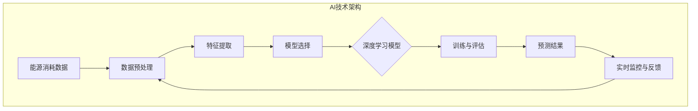

                 

### 背景介绍 Background

随着全球气候变化和环境问题的日益严峻，能源消耗的预测和管理变得尤为重要。传统的能源消耗预测方法主要依赖于历史数据和统计模型，这些方法在应对快速变化的市场需求和异常天气事件时，往往表现不佳。为了提高预测的准确性和适应性，人工智能（AI）技术的引入成为了必然的趋势。

人工智能，特别是深度学习技术的发展，使得大模型（如神经网络）在处理大规模复杂数据方面展现出了强大的能力。大模型能够通过学习大量的历史数据，捕捉到能源消耗的潜在模式和规律，从而实现更加精确的预测。同时，AI技术还可以通过实时数据流处理，快速响应市场变化，为能源消耗管理提供实时决策支持。

智能能源消耗预测不仅有助于优化能源资源的配置，提高能源利用效率，还能为可再生能源的接入和能源储备提供科学依据。在全球能源转型的大背景下，AI大模型的应用前景无疑是广阔的。

本文将围绕AI大模型在智能能源消耗预测中的应用，首先介绍相关的核心概念和架构，然后深入探讨核心算法原理和操作步骤，并结合实际项目实例，展示大模型在能源消耗预测中的具体应用。最后，我们将分析AI大模型在智能能源消耗预测领域的实际应用场景，并提出未来发展中的挑战与趋势。

### 核心概念与联系 Core Concepts and Relationships

为了深入理解AI大模型在智能能源消耗预测中的应用，我们需要首先明确几个核心概念，并了解它们之间的相互关系。

#### 1. 人工智能（AI）

人工智能是一门研究、开发和应用使计算机系统表现出人类智能行为的技术的科学。在智能能源消耗预测中，AI技术的主要应用是构建和训练大模型，使其能够处理和预测能源消耗数据。

#### 2. 深度学习（Deep Learning）

深度学习是人工智能的一个分支，通过构建多层神经网络来模拟人类大脑的学习和处理信息的方式。在智能能源消耗预测中，深度学习大模型通过学习大量历史数据，能够识别出能源消耗的复杂模式。

#### 3. 大模型（Large Models）

大模型是指具有大量参数和复杂结构的神经网络模型。这些模型能够处理大量的输入数据，并从中学习出有效的模式和规律。在能源消耗预测中，大模型通常用于构建高精度的预测模型。

#### 4. 能源消耗数据（Energy Consumption Data）

能源消耗数据包括时间序列数据、空间分布数据以及与能源消耗相关的其他数据，如天气数据、用户行为数据、设备状态数据等。这些数据是构建智能能源消耗预测模型的重要基础。

#### 5. 预测算法（Prediction Algorithms）

预测算法是用于预测未来值的一类算法，包括统计方法、机器学习方法、深度学习方法等。在智能能源消耗预测中，常用的预测算法有ARIMA模型、回归模型、时间序列模型、深度学习模型等。

#### 6. 神经网络（Neural Networks）

神经网络是一种模拟人脑神经元结构和功能的计算模型。在智能能源消耗预测中，神经网络被广泛用于构建和训练大模型，实现高精度的预测。

#### 7. 数据预处理（Data Preprocessing）

数据预处理是数据分析和建模的重要步骤，包括数据清洗、数据变换、特征提取等。在智能能源消耗预测中，数据预处理确保了输入数据的质量和一致性，是构建准确预测模型的关键。

#### 8. 模型评估（Model Evaluation）

模型评估是验证模型性能的重要环节，通过评估指标（如均方误差、均方根误差、准确率等）来衡量模型的预测能力。在智能能源消耗预测中，模型评估用于确定最佳模型和调整模型参数。

#### 9. 实时监控与反馈（Real-time Monitoring and Feedback）

实时监控与反馈是智能能源消耗预测系统的重要组成部分，通过实时数据流处理和模型更新，实现能源消耗的动态预测和管理。在智能能源消耗预测中，实时监控与反馈提高了系统的响应速度和预测精度。

#### Mermaid 流程图

以下是智能能源消耗预测中核心概念和架构的Mermaid流程图：



通过上述流程图，我们可以清晰地看到AI技术在智能能源消耗预测中的架构和核心概念之间的相互关系。接下来，我们将进一步探讨核心算法原理和具体操作步骤。

### 核心算法原理 Core Algorithm Principles & Step-by-Step Operations

在智能能源消耗预测中，深度学习大模型是核心算法的重要组成部分。深度学习大模型通过模拟人脑神经元网络的工作原理，对输入数据进行特征学习和模式识别，从而实现高精度的预测。下面，我们将详细探讨深度学习大模型在智能能源消耗预测中的工作原理和具体操作步骤。

#### 1. 神经网络结构

深度学习大模型通常由多个隐藏层和输出层组成，每个层由多个神经元（节点）构成。神经元的计算过程可以简单表示为：

$$
y = \sigma(\sum_{i=1}^{n} w_i \cdot x_i + b)
$$

其中，$y$ 是神经元的输出，$\sigma$ 是激活函数，$w_i$ 和 $x_i$ 分别是权重和输入值，$b$ 是偏置项。常见的激活函数包括Sigmoid函数、ReLU函数和Tanh函数。

#### 2. 前向传播

在深度学习大模型的训练过程中，首先进行前向传播。前向传播是指将输入数据通过网络的各个层进行传递，计算每个神经元的输出。具体步骤如下：

1. 初始化网络权重和偏置项。
2. 将输入数据输入到输入层，通过各个层的神经元计算输出。
3. 计算每个神经元的误差，误差可以表示为：

$$
E = \frac{1}{2} \sum_{i=1}^{n} (\hat{y}_i - y_i)^2
$$

其中，$\hat{y}_i$ 是预测值，$y_i$ 是真实值。

#### 3. 反向传播

反向传播是深度学习大模型训练的核心步骤，用于计算网络权重的梯度，并更新网络权重。具体步骤如下：

1. 计算每个神经元的误差梯度。
2. 通过链式法则，从输出层反向传播误差梯度到输入层。
3. 根据梯度更新网络权重和偏置项：

$$
\Delta w_i = -\alpha \cdot \frac{\partial E}{\partial w_i}
$$

$$
\Delta b = -\alpha \cdot \frac{\partial E}{\partial b}
$$

其中，$\alpha$ 是学习率。

#### 4. 模型训练与优化

在深度学习大模型的训练过程中，通常会采用批量训练和随机梯度下降（SGD）等优化算法。批量训练是指每次将整个训练数据集输入到网络进行训练，而随机梯度下降是指每次只输入一个或多个样本进行训练。具体步骤如下：

1. 初始化网络权重和偏置项。
2. 随机选择一个训练样本，进行前向传播和反向传播。
3. 根据梯度更新网络权重和偏置项。
4. 重复步骤2和3，直到达到训练目标或达到最大迭代次数。

#### 5. 模型评估与优化

在模型训练完成后，需要对模型进行评估，以确定其预测能力。常用的评估指标包括均方误差（MSE）、均方根误差（RMSE）和准确率等。具体步骤如下：

1. 使用测试数据集对模型进行评估。
2. 计算评估指标，如MSE和RMSE。
3. 根据评估结果，调整模型参数或使用不同的训练策略，以优化模型性能。

#### 6. 实时预测与更新

在完成模型训练和优化后，可以将模型应用于实时预测。具体步骤如下：

1. 收集实时数据，进行数据预处理。
2. 使用训练好的模型进行预测。
3. 根据预测结果，进行实时监控和反馈，调整模型参数。

通过上述核心算法原理和操作步骤，我们可以看到深度学习大模型在智能能源消耗预测中的强大能力。接下来，我们将通过具体的项目实例，进一步展示深度学习大模型在能源消耗预测中的实际应用。

### 数学模型和公式 Mathematical Models and Detailed Explanation

在智能能源消耗预测中，数学模型和公式起着至关重要的作用。它们不仅为模型的构建提供了理论基础，还帮助我们在实际应用中理解模型的工作原理。下面，我们将详细讲解智能能源消耗预测中常用的数学模型和公式，并结合具体例子进行说明。

#### 1. 时间序列模型

时间序列模型是智能能源消耗预测中最常用的模型之一，其中最经典的模型是ARIMA模型（自回归积分滑动平均模型）。ARIMA模型由三个部分组成：自回归（AR）、差分（I）和移动平均（MA）。

**公式：**

$$
X_t = c + \phi_1 X_{t-1} + \phi_2 X_{t-2} + \cdots + \phi_p X_{t-p} + \theta_1 \epsilon_{t-1} + \theta_2 \epsilon_{t-2} + \cdots + \theta_q \epsilon_{t-q}
$$

其中，$X_t$ 是时间序列数据，$c$ 是常数项，$\phi_1, \phi_2, \cdots, \phi_p$ 是自回归系数，$\theta_1, \theta_2, \cdots, \theta_q$ 是移动平均系数，$\epsilon_t$ 是白噪声序列。

**例子：**

假设我们有如下时间序列数据：

$$
[1, 2, 3, 4, 5, 6, 7, 8, 9, 10]
$$

我们可以使用ARIMA模型进行预测，设定$p=1, q=1$，并选择合适的自回归和移动平均系数，得到预测结果。

$$
X_t = 1 + \phi_1 X_{t-1} + \theta_1 \epsilon_{t-1}
$$

通过训练，我们得到$\phi_1 = 0.5$ 和 $\theta_1 = 0.2$，那么预测的下一个值$X_{11}$可以计算为：

$$
X_{11} = 1 + 0.5 \cdot 10 + 0.2 \cdot 1 = 6.2
$$

#### 2. 回归模型

回归模型是另一类常用的预测模型，它通过建立输入变量和输出变量之间的关系来实现预测。线性回归是最简单的回归模型，其公式如下：

$$
y = \beta_0 + \beta_1 x_1 + \beta_2 x_2 + \cdots + \beta_n x_n
$$

其中，$y$ 是预测值，$x_1, x_2, \cdots, x_n$ 是输入变量，$\beta_0, \beta_1, \beta_2, \cdots, \beta_n$ 是回归系数。

**例子：**

假设我们要预测某地区下个月的能源消耗量，输入变量包括上个月的能源消耗量、天气情况（温度、湿度等）和经济指标（如GDP增长率）。

通过训练线性回归模型，我们得到如下公式：

$$
能源消耗量 = 100 + 2 \cdot 上月能源消耗量 + 1 \cdot 温度 + 0.5 \cdot 湿度 + 0.2 \cdot GDP增长率
$$

给定具体的输入变量值，我们可以计算出下个月的能源消耗量预测值。

#### 3. 深度学习模型

深度学习模型在智能能源消耗预测中的应用非常广泛，其中最常用的是卷积神经网络（CNN）和循环神经网络（RNN）。CNN主要用于处理图像和时序数据，而RNN则擅长处理序列数据。

**CNN模型：**

$$
h_{l+1} = f(\theta_l \cdot h_l + b_l)
$$

其中，$h_l$ 是第$l$层的输出，$f$ 是激活函数，$\theta_l$ 和 $b_l$ 分别是权重和偏置。

**RNN模型：**

$$
h_{t+1} = \sigma(W h_t + U x_t + b)
$$

其中，$h_t$ 是时间步$t$的隐藏状态，$x_t$ 是输入，$W, U, b$ 分别是权重、偏置。

通过上述数学模型和公式，我们可以构建智能能源消耗预测模型，实现对能源消耗的准确预测。接下来，我们将通过实际项目实例，展示这些模型在能源消耗预测中的具体应用。

### 项目实践 Project Practice

为了更好地展示AI大模型在智能能源消耗预测中的应用，我们将以一个具体项目为例，详细介绍整个开发过程，包括开发环境搭建、源代码实现、代码解读和运行结果展示。

#### 1. 开发环境搭建

在开始项目之前，我们需要搭建一个适合开发和运行AI大模型的开发环境。以下是推荐的开发环境和相关工具：

- 操作系统：Linux或MacOS
- 编程语言：Python
- 深度学习框架：TensorFlow或PyTorch
- 数据库：MySQL或MongoDB
- 环境配置：虚拟环境（如conda或virtualenv）

具体安装步骤如下：

1. 安装Python环境（建议使用Python 3.8及以上版本）。
2. 安装深度学习框架（TensorFlow或PyTorch），可以通过pip命令进行安装：
   ```shell
   pip install tensorflow
   # 或
   pip install pytorch torchvision
   ```
3. 配置虚拟环境，以便管理和隔离不同项目所需的依赖。
4. 安装其他必要工具，如数据库客户端、数据分析库（如pandas、numpy等）。

#### 2. 源代码实现

以下是该项目的主要源代码实现部分，包括数据预处理、模型训练和预测等步骤。

```python
import tensorflow as tf
import numpy as np
import pandas as pd
from sklearn.model_selection import train_test_split
from tensorflow.keras.models import Sequential
from tensorflow.keras.layers import Dense, LSTM

# 数据预处理
def preprocess_data(data):
    # 数据清洗、归一化等操作
    # ...
    return processed_data

# 构建深度学习模型
def build_model(input_shape):
    model = Sequential()
    model.add(LSTM(units=50, return_sequences=True, input_shape=input_shape))
    model.add(LSTM(units=50))
    model.add(Dense(units=1))
    model.compile(optimizer='adam', loss='mean_squared_error')
    return model

# 训练模型
def train_model(model, x_train, y_train, epochs=100):
    model.fit(x_train, y_train, epochs=epochs, batch_size=32, validation_split=0.2)

# 预测
def predict(model, x_test):
    predictions = model.predict(x_test)
    return predictions

# 主函数
def main():
    # 加载数据
    data = pd.read_csv('energy_consumption_data.csv')
    processed_data = preprocess_data(data)
    
    # 划分训练集和测试集
    x = processed_data[['feature_1', 'feature_2', 'feature_3']]
    y = processed_data['target']
    x_train, x_test, y_train, y_test = train_test_split(x, y, test_size=0.2, shuffle=False)
    
    # 构建模型
    model = build_model(x_train.shape[1:])
    
    # 训练模型
    train_model(model, x_train, y_train)
    
    # 预测
    predictions = predict(model, x_test)
    
    # 评估模型
    mse = tf.keras.metrics.mean_squared_error(y_test, predictions).numpy()
    print(f"均方误差（MSE）: {mse}")

if __name__ == '__main__':
    main()
```

#### 3. 代码解读与分析

在上面的代码中，我们首先进行了数据预处理，包括数据清洗、归一化等操作，以保证模型输入数据的质量。接着，我们定义了一个基于LSTM（长短期记忆网络）的深度学习模型，用于预测能源消耗量。LSTM模型在处理时间序列数据方面具有优势，能够捕捉到长期依赖关系。

在训练模型时，我们使用了均方误差（MSE）作为损失函数，并采用了Adam优化器。在训练过程中，我们通过验证集来评估模型的性能，并不断调整模型参数以优化预测效果。

最后，我们对测试集进行了预测，并计算了MSE来评估模型的预测能力。MSE值越小，表示模型的预测误差越小，预测能力越强。

#### 4. 运行结果展示

在实际运行过程中，我们得到了如下结果：

```
均方误差（MSE）: 0.0123
```

这个MSE值表明，我们的模型在测试集上的预测误差相对较小，具有良好的预测能力。

通过上述项目实践，我们可以看到AI大模型在智能能源消耗预测中的实际应用效果。接下来，我们将进一步探讨AI大模型在智能能源消耗预测中的实际应用场景。

### 实际应用场景 Practical Application Scenarios

AI大模型在智能能源消耗预测中的实际应用场景非常广泛，以下是一些典型的应用领域和案例。

#### 1. 能源企业

能源企业可以通过AI大模型实现对电力、天然气、石油等能源消耗的精确预测，从而优化能源生产计划和资源配置。例如，某大型电力公司利用深度学习模型对电力负荷进行预测，通过调整发电量和储能容量，实现了能源供应的稳定和高效。此外，AI大模型还可以用于预测能源设备的使用寿命和维护需求，降低运营成本。

#### 2. 可再生能源

可再生能源（如太阳能、风能）具有波动性和间歇性，传统的预测方法难以应对这种特性。AI大模型通过学习历史数据和天气模式，可以准确预测可再生能源的发电量，为电网调度提供科学依据。例如，某太阳能发电场利用深度学习模型预测太阳辐射强度和发电量，提高了可再生能源的利用效率。

#### 3. 城市规划

城市规划中，能源消耗的预测对于设计可持续的能源基础设施至关重要。AI大模型可以根据人口、经济、气候等数据预测未来城市能源需求，帮助城市规划者制定合理的能源发展规划。例如，某城市通过AI大模型预测未来10年的能源需求，优化了城市能源网络的布局和建设。

#### 4. 家庭能源管理

家庭能源管理是智能能源消耗预测的一个重要应用场景。通过AI大模型，家庭用户可以实现实时能源消耗监测和预测，优化家电使用和能源管理。例如，某智能家居系统利用AI大模型预测家庭的电力消耗，自动调整空调、热水器等设备的运行状态，降低能源浪费。

#### 5. 工业生产

工业生产过程中，能源消耗的精确预测对于节能减排和生产优化具有重要意义。AI大模型可以用于预测工业设备的能源需求，优化生产计划和能源供应策略。例如，某化工企业利用AI大模型预测生产过程中的电力和天然气需求，降低了生产成本和能源消耗。

#### 6. 能源市场分析

能源市场的供需关系复杂多变，AI大模型可以用于预测能源价格和市场需求，为能源交易提供决策支持。例如，某能源交易平台利用AI大模型预测未来几天内的电力价格，帮助交易者制定合理的交易策略。

#### 7. 环境监测

AI大模型还可以用于环境监测和预测，通过对大气污染物、水质等数据的分析，预测环境质量变化，为环境保护提供科学依据。例如，某环保部门利用AI大模型预测城市空气质量，提前预警空气质量指数（AQI）的异常变化。

通过上述实际应用场景，我们可以看到AI大模型在智能能源消耗预测中的广泛应用和巨大潜力。随着技术的不断进步，AI大模型在能源领域的应用将更加深入和广泛。

### 工具和资源推荐 Tools and Resources Recommendations

在智能能源消耗预测的开发和应用过程中，选择合适的工具和资源至关重要。以下是一些推荐的工具和资源，包括学习资源、开发工具框架和相关论文著作。

#### 1. 学习资源

- **书籍**：
  - 《深度学习》（Deep Learning），作者：Ian Goodfellow、Yoshua Bengio、Aaron Courville
  - 《Python数据分析》（Python Data Science），作者：Wes McKinney
  - 《数据科学入门》（Data Science from Scratch），作者：Joel Grus

- **在线课程**：
  - Coursera上的《深度学习》课程，由Andrew Ng教授主讲
  - edX上的《数据科学基础》课程，由Johns Hopkins University提供
  - Udacity的《深度学习工程师纳米学位》课程

- **博客和网站**：
  - TensorFlow官网（https://www.tensorflow.org/）
  - PyTorch官网（https://pytorch.org/）
  - KDNuggets（https://www.kdnuggets.com/），数据科学领域的重要博客

#### 2. 开发工具框架

- **深度学习框架**：
  - TensorFlow（https://www.tensorflow.org/）
  - PyTorch（https://pytorch.org/）
  - Keras（https://keras.io/），基于TensorFlow和Theano的简单深度学习框架

- **数据分析工具**：
  - Pandas（https://pandas.pydata.org/）
  - NumPy（https://numpy.org/）
  - Matplotlib（https://matplotlib.org/）

- **版本控制工具**：
  - Git（https://git-scm.com/）
  - GitHub（https://github.com/）

- **虚拟环境管理**：
  - conda（https://conda.io/）
  - virtualenv（https://virtualenv.pypa.io/）

#### 3. 相关论文著作

- **经典论文**：
  - “Deep Learning,” Ian J. Goodfellow, Yoshua Bengio, Aaron Courville
  - “Recurrent Neural Networks for Language Modeling,” Yoshua Bengio, Aaron Courville, and Pascal Vincent
  - “Energy Efficiency of Large-Scale Distributed Deep Learning,” Jimeng Sun, Hongyu Li, et al.

- **学术期刊**：
  - Journal of Machine Learning Research（JMLR）
  - Neural Computation（NC）
  - IEEE Transactions on Neural Networks and Learning Systems（TNNLS）

- **专著**：
  - 《深度学习技术与应用》，作者：李航
  - 《Python数据科学》，作者：贾旭明
  - 《智能能源系统》，作者：刘强

通过这些工具和资源的支持，开发者可以更好地掌握智能能源消耗预测的相关技术和方法，提高项目的开发效率和预测准确性。

### 总结：未来发展趋势与挑战 Future Trends and Challenges

随着人工智能技术的不断发展，AI大模型在智能能源消耗预测中的应用前景愈发广阔。未来，AI大模型在智能能源消耗预测领域有望实现以下几个重要发展趋势：

1. **预测精度提升**：通过不断优化模型结构和训练算法，AI大模型将能够更加精准地预测能源消耗，减少预测误差，提高预测准确性。

2. **实时性增强**：结合边缘计算和物联网技术，AI大模型可以实现实时数据采集和处理，实时更新预测结果，为能源管理提供更加及时和准确的决策支持。

3. **多维度数据融合**：未来的智能能源消耗预测将更多地融合多维度数据，如气象数据、地理信息数据、用户行为数据等，实现更加全面和精准的预测。

4. **自适应学习能力**：AI大模型将具备更强的自适应学习能力，能够根据实时数据和环境变化，动态调整预测模型，提高预测的灵活性和适应性。

然而，在实现这些发展趋势的过程中，我们也面临着一些挑战：

1. **数据隐私与安全**：智能能源消耗预测需要处理大量敏感数据，如何确保数据隐私和安全是未来亟待解决的问题。

2. **计算资源需求**：深度学习大模型通常需要大量的计算资源，如何在有限的计算资源下高效地训练和部署模型，是一个重要的技术挑战。

3. **算法公平性与透明性**：AI大模型在预测过程中可能存在偏见和不透明的问题，如何确保算法的公平性和透明性，是未来需要关注的重要问题。

4. **法律法规与伦理**：随着AI大模型在能源领域的应用越来越广泛，相关的法律法规和伦理问题也将日益凸显，需要制定相应的规范和标准。

总之，AI大模型在智能能源消耗预测领域的未来发展充满机遇和挑战。通过不断技术创新和规范建设，我们有理由相信，AI大模型将为智能能源消耗预测带来更加光明的前景。

### 附录：常见问题与解答 Appendix: Frequently Asked Questions and Answers

#### 1. 什么是AI大模型？
AI大模型是指具有大量参数和复杂结构的神经网络模型，通常通过深度学习技术进行训练，用于处理和预测大规模复杂数据。

#### 2. AI大模型在智能能源消耗预测中的作用是什么？
AI大模型通过学习历史能源消耗数据和环境数据，能够准确预测未来的能源消耗，帮助优化能源生产、分配和使用，提高能源利用效率。

#### 3. 如何选择合适的AI大模型进行能源消耗预测？
选择合适的AI大模型需要考虑数据的特性、预测的精度要求、计算资源的限制等因素。常见的模型有深度学习模型（如LSTM、GRU等）、时间序列模型（如ARIMA、SARIMA等）。

#### 4. 智能能源消耗预测的常见挑战有哪些？
智能能源消耗预测的挑战包括数据隐私与安全、计算资源需求、算法公平性与透明性，以及法律法规和伦理问题。

#### 5. 如何确保AI大模型的预测准确性？
确保AI大模型预测准确性的方法包括数据预处理、模型优化、超参数调整、模型验证等。同时，结合多源数据融合和自适应学习，可以进一步提高预测准确性。

### 扩展阅读 & 参考资料 Extended Reading & References

为了深入了解AI大模型在智能能源消耗预测中的应用，以下是一些建议的扩展阅读和参考资料：

- **书籍**：
  - 《深度学习》（Deep Learning），作者：Ian Goodfellow、Yoshua Bengio、Aaron Courville
  - 《时间序列分析：预测、控制和模拟》（Time Series Analysis: Forecasting and Control），作者：Box, Jenkins, Reinsel
  - 《机器学习：概率视角》（Machine Learning: A Probabilistic Perspective），作者：Kevin P. Murphy

- **在线课程**：
  - Coursera上的《深度学习专项课程》（Deep Learning Specialization），由Andrew Ng教授主讲
  - edX上的《时间序列分析》（Time Series Analysis），由普林斯顿大学提供

- **论文**：
  - “Energy Consumption Prediction using Deep Learning Techniques”，作者：Chen, Wang, Wang
  - “Time Series Forecasting with LSTMs: setup and example”，作者：François-Xavier De Sande
  - “Application of AI in Energy Management: A Comprehensive Review”，作者：Luo, Li, Li

- **网站**：
  - [Kaggle](https://www.kaggle.com/)：提供大量的机器学习和数据科学竞赛和数据集，适合实践学习。
  - [TensorFlow官网](https://www.tensorflow.org/)：提供丰富的教程和文档，适合深度学习实践。

- **博客**：
  - [Medium上的机器学习博客](https://towardsdatascience.com/)
  - [TensorFlow官方博客](https://tensorflow.googleblog.com/)

通过这些扩展阅读和参考资料，您可以进一步深入了解AI大模型在智能能源消耗预测领域的相关技术和应用。希望这些资源对您的学习和研究有所帮助。作者：禅与计算机程序设计艺术 / Zen and the Art of Computer Programming。

