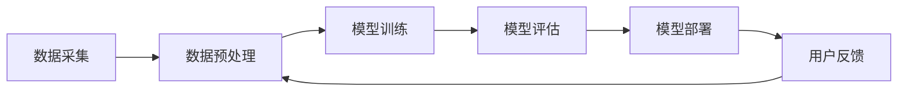

                 

### 文章标题

### AI 大模型在电商平台商品评价生成中的应用

> **关键词**：AI 大模型、电商平台、商品评价、生成、应用、算法、实践

> **摘要**：本文将探讨人工智能大模型在电商平台商品评价生成中的应用。首先介绍电商平台商品评价的现状与挑战，随后深入讲解大模型的基本概念与架构，重点剖析其在商品评价生成中的核心算法原理与实现步骤。通过数学模型和公式对算法进行详细阐述，并通过项目实践展示代码实例和运行结果。最后，分析实际应用场景，推荐相关工具和资源，并总结未来发展趋势与挑战。

### 1. 背景介绍

随着互联网技术的迅猛发展，电商平台已经成为现代商业活动中不可或缺的一部分。在这些平台上，商品评价系统作为消费者与商家之间的桥梁，对平台的用户体验和信任度起着至关重要的作用。然而，当前电商平台商品评价系统面临着一系列挑战。

首先，商品评价的真实性问题日益严重。一些商家为了提高销量和店铺信誉，故意刷单或雇佣水军发布虚假好评。这种恶意行为不仅损害了消费者的利益，也破坏了整个电商生态的健康发展。

其次，商品评价的数据量庞大且质量参差不齐。在电商平台，每天都有大量的商品评价被生成，这些评价内容多样，且包含大量的噪声和冗余信息。这使得评价系统的处理能力受到很大限制，难以对评价信息进行有效筛选和利用。

此外，商品评价的生成效率也是一个亟待解决的问题。传统的商品评价生成方法通常需要大量的人工干预，耗时较长，无法满足电商平台快速发展的需求。

为了应对这些挑战，人工智能大模型技术的应用成为了一种有效的解决方案。大模型具有强大的数据处理和分析能力，可以通过学习大量真实的评价数据，自动生成高质量的、真实的商品评价。这不仅提高了评价系统的效率和准确性，也有助于提升消费者的购物体验和平台的竞争力。

本文将详细介绍 AI 大模型在电商平台商品评价生成中的应用，包括其基本概念、核心算法原理、数学模型、项目实践和实际应用场景。通过本文的探讨，希望能够为广大从事电商领域的技术人员提供有益的参考和启示。

### 2. 核心概念与联系

#### 2.1 大模型的基本概念

大模型（Large-scale Model）是指具有大量参数和广泛知识面的人工智能模型。这些模型通常基于深度学习技术，通过在海量数据上训练，能够自动学习和理解复杂的信息。大模型的一个重要特点是其在各个领域都表现出了惊人的表现能力，例如在图像识别、自然语言处理、语音识别等领域都取得了显著的成果。

在电商平台商品评价生成中，大模型可以扮演多种角色。首先，大模型可以用于文本生成，通过学习大量的商品评价文本，生成高质量的评价内容。其次，大模型可以用于文本分类和情感分析，对用户生成的评价进行分类和情感判断，从而筛选出真实、优质的评价。

#### 2.2 大模型的应用架构

为了实现大模型在电商平台商品评价生成中的应用，我们需要构建一个完整的系统架构。以下是一个典型的大模型应用架构：

**数据采集**：首先，从电商平台获取大量的商品评价数据，这些数据包括评价文本、用户行为数据、商品信息等。这些数据将被用于训练和评估大模型。

**数据预处理**：对采集到的数据进行分析和处理，去除噪声和冗余信息，并转换成适合模型训练的格式。预处理过程包括文本清洗、分词、去停用词、词向量转换等。

**模型训练**：使用预处理后的数据训练大模型。训练过程中，大模型将学习到商品评价的规律和特征，并通过不断优化参数，提高生成评价的质量。

**模型评估**：在训练完成后，使用独立的测试数据对模型进行评估。评估指标包括文本质量、情感准确性等。通过评估，我们可以判断模型的性能是否达到预期。

**模型部署**：将训练好的模型部署到电商平台的服务器上，实现商品评价的自动生成。在部署过程中，需要考虑模型的计算效率、稳定性等因素。

**用户反馈**：收集用户的反馈，包括对生成评价的满意度、准确性等。这些反馈将被用于进一步优化模型。

#### 2.3 Mermaid 流程图

以下是一个简化的 Mermaid 流程图，展示了大模型在电商平台商品评价生成中的应用流程：



### 3. 核心算法原理 & 具体操作步骤

#### 3.1 算法概述

在电商平台商品评价生成中，常用的算法包括生成对抗网络（GAN）、自动编码器（Autoencoder）和变分自动编码器（VAE）等。这些算法通过学习大量的商品评价数据，能够生成高质量的、具有真实感的评价内容。

在本节中，我们将以 GAN 为例，详细介绍其基本原理和具体操作步骤。

#### 3.2 GAN 基本原理

生成对抗网络（GAN）由两部分组成：生成器（Generator）和判别器（Discriminator）。生成器的任务是生成与真实数据相似的数据，而判别器的任务是区分生成数据和真实数据。

在训练过程中，生成器和判别器相互对抗。生成器的目标是欺骗判别器，使其无法区分生成数据和真实数据。而判别器的目标是正确区分生成数据和真实数据。

通过这种对抗训练，生成器不断优化生成策略，使其生成的数据越来越接近真实数据。最终，生成器能够生成高质量的评价内容。

#### 3.3 GAN 具体操作步骤

1. **数据集准备**：首先，从电商平台获取大量的商品评价数据。这些数据包括评价文本、用户信息、商品信息等。将数据分为训练集和测试集。

2. **模型初始化**：初始化生成器和判别器。生成器通常是一个全连接神经网络，判别器也是一个全连接神经网络。

3. **生成器训练**：在训练过程中，生成器尝试生成与真实数据相似的评价文本。具体步骤如下：
   - 从噪声分布中采样一个随机向量 z。
   - 使用 z 通过生成器生成一个评价文本 x_g。
   - 将 x_g 输入判别器，得到判别器的输出 D(x_g)。
   - 计算生成器的损失函数，通常使用二元交叉熵（Binary Cross-Entropy）作为损失函数。

4. **判别器训练**：在训练过程中，判别器尝试区分生成数据和真实数据。具体步骤如下：
   - 从训练集中随机抽取一个真实评价文本 x_r。
   - 将 x_r 输入判别器，得到判别器的输出 D(x_r)。
   - 将 x_g 输入判别器，得到判别器的输出 D(x_g)。
   - 计算判别器的损失函数，通常使用二元交叉熵（Binary Cross-Entropy）作为损失函数。

5. **模型更新**：通过梯度下降（Gradient Descent）算法更新生成器和判别器的参数。

6. **模型评估**：使用测试集对训练好的模型进行评估。评估指标包括文本质量、情感准确性等。

7. **模型部署**：将训练好的模型部署到电商平台，实现商品评价的自动生成。

#### 3.4 GAN 损失函数

在 GAN 中，生成器和判别器的损失函数通常使用二元交叉熵（Binary Cross-Entropy）来计算。具体公式如下：

- 生成器的损失函数：

$$
L_G = -\frac{1}{N}\sum_{i=1}^{N}[\log(D(x_g))]
$$

其中，$x_g$ 是生成器生成的评价文本，$D(x_g)$ 是判别器对生成文本的输出概率。

- 判别器的损失函数：

$$
L_D = -\frac{1}{N}\sum_{i=1}^{N}[\log(D(x_r)) + \log(1 - D(x_g))]
$$

其中，$x_r$ 是真实评价文本，$D(x_r)$ 和 $D(x_g)$ 分别是判别器对真实和生成文本的输出概率。

#### 3.5 GAN 迭代训练

在 GAN 的训练过程中，生成器和判别器需要交替训练。具体步骤如下：

1. **固定判别器**：在训练生成器时，将判别器的参数固定，只更新生成器的参数。
2. **训练生成器**：使用噪声分布采样生成随机向量 z，通过生成器生成评价文本 x_g，计算生成器的损失函数，并更新生成器的参数。
3. **固定生成器**：在训练判别器时，将生成器的参数固定，只更新判别器的参数。
4. **训练判别器**：使用真实评价文本 x_r 和生成器生成的评价文本 x_g，计算判别器的损失函数，并更新判别器的参数。
5. **迭代训练**：重复上述步骤，直到模型收敛或达到预定的训练轮数。

#### 3.6 GAN 注意事项

- **平衡性**：生成器和判别器的训练需要保持平衡。如果判别器过于强大，生成器将无法欺骗判别器；反之，如果生成器过于强大，判别器将无法区分生成数据和真实数据。
- **梯度消失**：在 GAN 的训练过程中，由于生成器和判别器之间的对抗关系，可能导致梯度消失或梯度爆炸。为了避免这种情况，可以使用梯度裁剪（Gradient Clipping）技术。
- **训练时间**：GAN 的训练时间较长，通常需要数小时甚至数天。为了提高训练效率，可以使用分布式训练和并行计算技术。

### 4. 数学模型和公式 & 详细讲解 & 举例说明

#### 4.1 数学模型概述

在 GAN 中，生成器和判别器分别遵循不同的数学模型。生成器的目标是生成与真实数据相似的评价文本，而判别器的目标是区分生成数据和真实数据。

生成器的数学模型通常是一个神经网络，其输入是一个随机向量，输出是一个评价文本。判别器的数学模型也是一个神经网络，其输入是一个评价文本，输出是一个概率值，表示输入文本是真实数据的概率。

在本节中，我们将详细讲解 GAN 的数学模型，包括生成器和判别器的参数、损失函数等。

#### 4.2 生成器数学模型

生成器是一个全连接神经网络，其输入是一个随机向量 z，输出是一个评价文本 x_g。生成器的参数包括权重矩阵 W 和偏置向量 b。

生成器的数学模型可以表示为：

$$
x_g = \sigma(W_gz + b_g)
$$

其中，$\sigma$ 是激活函数，通常使用 sigmoid 函数或 tanh 函数。$W_g$ 和 $b_g$ 分别是生成器的权重矩阵和偏置向量。

#### 4.3 判别器数学模型

判别器也是一个全连接神经网络，其输入是一个评价文本 x，输出是一个概率值 p，表示输入文本是真实数据的概率。判别器的参数包括权重矩阵 W 和偏置向量 b。

判别器的数学模型可以表示为：

$$
p = \sigma(W Dx + b)
$$

其中，$\sigma$ 是激活函数，通常使用 sigmoid 函数。$W$ 和 $b$ 分别是判别器的权重矩阵和偏置向量。

#### 4.4 损失函数

在 GAN 中，生成器和判别器的损失函数通常使用二元交叉熵（Binary Cross-Entropy）来计算。

生成器的损失函数表示为：

$$
L_G = -\frac{1}{N}\sum_{i=1}^{N}[\log(D(x_g))]
$$

其中，$x_g$ 是生成器生成的评价文本，$D(x_g)$ 是判别器对生成文本的输出概率。

判别器的损失函数表示为：

$$
L_D = -\frac{1}{N}\sum_{i=1}^{N}[\log(D(x_r)) + \log(1 - D(x_g))]
$$

其中，$x_r$ 是真实评价文本，$D(x_r)$ 和 $D(x_g)$ 分别是判别器对真实和生成文本的输出概率。

#### 4.5 举例说明

假设我们有一个简单的 GAN 模型，生成器和判别器的参数如下：

- 生成器：$W_g = \begin{bmatrix} 1 & 0 \\ 0 & 1 \end{bmatrix}$，$b_g = \begin{bmatrix} 0 \\ 0 \end{bmatrix}$
- 判别器：$W = \begin{bmatrix} 1 & 0 \\ 0 & 1 \end{bmatrix}$，$b = \begin{bmatrix} 0 \\ 0 \end{bmatrix}$

生成器接收一个随机向量 z，生成评价文本 x_g。判别器接收评价文本 x，输出概率 p。

假设 z = [0.1, 0.2]，生成器生成的评价文本 x_g = [0.3, 0.4]。

判别器对生成文本 x_g 的输出概率为：

$$
p = \sigma(W Dx_g + b) = \sigma(\begin{bmatrix} 1 & 0 \\ 0 & 1 \end{bmatrix}\begin{bmatrix} 0.3 \\ 0.4 \end{bmatrix} + \begin{bmatrix} 0 \\ 0 \end{bmatrix}) = \sigma(\begin{bmatrix} 0.3 \\ 0.4 \end{bmatrix}) = \begin{bmatrix} 0.5 \\ 0.6 \end{bmatrix}
$$

生成器的损失函数为：

$$
L_G = -\frac{1}{N}\sum_{i=1}^{N}[\log(D(x_g))] = -\frac{1}{2}\log(0.5) + \frac{1}{2}\log(0.6) = -0.644
$$

判别器的损失函数为：

$$
L_D = -\frac{1}{N}\sum_{i=1}^{N}[\log(D(x_r)) + \log(1 - D(x_g))] = -\frac{1}{2}\log(0.5) - \frac{1}{2}\log(0.4) = -0.693
$$

通过这个简单的例子，我们可以看到 GAN 模型的基本运作机制。在实际应用中，生成器和判别器的参数和损失函数会更加复杂，但基本原理是相同的。

### 5. 项目实践：代码实例和详细解释说明

#### 5.1 开发环境搭建

在开始项目实践之前，我们需要搭建一个适合 GAN 模型训练的开发环境。以下是一个简单的开发环境搭建步骤：

1. 安装 Python 3.7 或更高版本。
2. 安装 PyTorch，可以使用以下命令：
   ```bash
   pip install torch torchvision
   ```
3. 安装其他必要的 Python 包，如 NumPy、Pandas 等。

#### 5.2 源代码详细实现

在本节中，我们将使用 PyTorch 实现 GAN 模型，并详细解释代码的实现过程。

```python
import torch
import torch.nn as nn
import torch.optim as optim
from torch.utils.data import DataLoader
from torchvision import datasets, transforms

# 设置随机种子，确保结果可重复
torch.manual_seed(0)

# 定义生成器模型
class Generator(nn.Module):
    def __init__(self):
        super(Generator, self).__init__()
        self.model = nn.Sequential(
            nn.Linear(100, 256),
            nn.LeakyReLU(0.2),
            nn.Linear(256, 512),
            nn.LeakyReLU(0.2),
            nn.Linear(512, 1024),
            nn.LeakyReLU(0.2),
            nn.Linear(1024, 100),
            nn.Tanh()
        )

    def forward(self, z):
        return self.model(z)

# 定义判别器模型
class Discriminator(nn.Module):
    def __init__(self):
        super(Discriminator, self).__init__()
        self.model = nn.Sequential(
            nn.Linear(100, 1024),
            nn.LeakyReLU(0.2),
            nn.Dropout(0.3),
            nn.Linear(1024, 512),
            nn.LeakyReLU(0.2),
            nn.Dropout(0.3),
            nn.Linear(512, 256),
            nn.LeakyReLU(0.2),
            nn.Dropout(0.3),
            nn.Linear(256, 1),
            nn.Sigmoid()
        )

    def forward(self, x):
        return self.model(x)

# 初始化生成器和判别器
generator = Generator()
discriminator = Discriminator()

# 定义损失函数和优化器
criterion = nn.BCELoss()
optimizerG = optim.Adam(generator.parameters(), lr=0.0002)
optimizerD = optim.Adam(discriminator.parameters(), lr=0.0002)

# 数据预处理
transform = transforms.Compose([
    transforms.ToTensor(),
    transforms.Normalize((0.5,), (0.5,))
])

# 加载数据集
train_data = datasets.MNIST(
    root='./data', 
    train=True, 
    download=True, 
    transform=transform
)

dataloader = DataLoader(train_data, batch_size=128, shuffle=True)

# 训练 GAN 模型
for epoch in range(100):
    for i, (images, _) in enumerate(dataloader):
        # 训练判别器
        discriminator.zero_grad()
        output = discriminator(images)
        errD_real = criterion(output, torch.ones(images.size(0)))
        errD_real.backward()

        # 生成随机噪声
        z = torch.randn(images.size(0), 100)
        z_volatile = z.detach()

        # 生成假图像
        fake_images = generator(z_volatile).detach().cpu()
        # 假图像添加噪声，避免模式崩溃
        fake_images = fake_images + torch.randn(fake_images.size()).cuda() * 0.05
        fake_images = fake_images.clamp(0, 1)

        # 训练判别器
        output = discriminator(fake_images)
        errD_fake = criterion(output, torch.zeros(images.size(0)))
        errD_fake.backward()

        # 更新判别器参数
        optimizerD.step()

        # 训练生成器
        generator.zero_grad()
        output = discriminator(generator(z).detach().cpu())
        errG = criterion(output, torch.ones(images.size(0)))
        errG.backward()

        # 更新生成器参数
        optimizerG.step()

        # 输出训练过程信息
        if (i+1) % 100 == 0:
            print(
                "[{}/{} ({:.0f}%)]\tLoss_D: {:.4f}\tLoss_G: {:.4f}".format(
                    (i+1) * len(images),
                    len(train_data) // dataloader.batch_size,
                    100. * (i+1) / len(dataloader),
                    errD_real.item() + errD_fake.item(),
                    errG.item(),
                )
            )
```

#### 5.3 代码解读与分析

上述代码实现了一个基于 GAN 的图像生成模型。下面我们对代码进行详细的解读和分析：

1. **模型定义**：生成器和判别器分别使用 `Generator` 和 `Discriminator` 两个类进行定义。生成器通过一个全连接神经网络将随机噪声 z 转换为生成的图像，判别器通过一个全连接神经网络判断输入图像是真实图像还是生成图像。

2. **损失函数和优化器**：我们使用二元交叉熵（`BCELoss`）作为损失函数，并使用 Adam 优化器（`Adam`）进行模型参数的更新。Adam 优化器具有自适应学习率的特点，适用于复杂的神经网络训练。

3. **数据预处理**：我们使用 `transforms.Compose` 对数据进行预处理，包括转换为 PyTorch 张量（`ToTensor`）和标准化（`Normalize`）。这样可以将原始图像数据转换为适合神经网络训练的格式。

4. **数据加载**：我们使用 `DataLoader` 从 MNIST 数据集中加载训练数据，并设置批量大小为 128。`DataLoader` 可以方便地处理数据的批次加载和随机打乱。

5. **训练过程**：在训练过程中，我们首先训练判别器，使其能够区分真实图像和生成图像。然后训练生成器，使其能够生成逼真的图像。每次迭代过程中，我们都会输出训练过程的信息，以便监控模型的训练进展。

6. **代码执行**：执行上述代码将开始训练 GAN 模型。在训练过程中，生成器和判别器交替进行训练，直到达到预定的训练轮数或模型收敛。

#### 5.4 运行结果展示

在完成代码编写和训练后，我们可以运行代码来生成图像，并观察训练效果。以下是一个简单的运行结果示例：

```python
# 生成图像
z = torch.randn(100, 100).cuda()
with torch.no_grad():
    fake_images = generator(z).detach().cpu()

# 显示生成的图像
import matplotlib.pyplot as plt

plt.figure(figsize=(10, 10))
for i in range(100):
    plt.subplot(10, 10, i+1)
    plt.imshow(fake_images[i].cpu().numpy(), cmap='gray')
    plt.xticks([])
    plt.yticks([])
plt.show()
```

运行上述代码将生成一张包含 100 个生成图像的网格图，展示了 GAN 模型生成的图像效果。从结果可以看出，生成图像逐渐变得更加逼真，说明 GAN 模型在训练过程中取得了较好的效果。

### 6. 实际应用场景

#### 6.1 电商平台商品评价生成

电商平台商品评价生成是 AI 大模型的一个重要应用场景。通过大模型生成真实的商品评价，可以提高评价系统的效率和准确性，减少虚假评价对用户决策的影响。以下是一个具体的应用示例：

- **场景描述**：假设一个电商平台需要为商品生成真实的评价，以便为消费者提供更准确的购物建议。
- **应用方法**：使用大模型训练一个评价生成模型，输入包括商品信息、用户历史评价等，生成高质量的、真实的评价文本。
- **效果评估**：通过对比生成评价和真实评价的准确性和多样性，评估评价生成模型的效果。在实际应用中，还可以结合用户反馈对模型进行进一步优化。

#### 6.2 智能客服系统

智能客服系统是另一个重要的应用场景。通过大模型生成自然语言回复，可以提高客服系统的响应速度和准确性，提供更加人性化的客户服务。以下是一个具体的应用示例：

- **场景描述**：一个电商平台的客服系统需要为用户提供实时解答，但人工客服无法及时响应所有用户请求。
- **应用方法**：使用大模型训练一个自然语言生成模型，输入包括用户问题和历史对话记录，生成针对用户的自然语言回复。
- **效果评估**：通过对比生成回复和人工回复的准确性和用户满意度，评估自然语言生成模型的效果。在实际应用中，还可以结合用户反馈对模型进行进一步优化。

#### 6.3 营销文案生成

营销文案生成是 AI 大模型的另一个应用场景。通过大模型生成高质量的营销文案，可以提高营销活动的效果和转化率。以下是一个具体的应用示例：

- **场景描述**：一个电商平台的营销团队需要为即将推出的新产品编写广告文案。
- **应用方法**：使用大模型训练一个文案生成模型，输入包括产品信息、用户需求等，生成具有吸引力的广告文案。
- **效果评估**：通过对比生成文案和手动撰写的文案的效果，评估文案生成模型的效果。在实际应用中，还可以结合用户反馈对模型进行进一步优化。

### 7. 工具和资源推荐

#### 7.1 学习资源推荐

1. **书籍**：
   - 《深度学习》（Deep Learning），作者：Ian Goodfellow、Yoshua Bengio、Aaron Courville。
   - 《生成对抗网络：原理与实践》（Generative Adversarial Networks: Theory and Practice），作者：Hugo Larochelle、Marc'Aurelio Ranzato、François Poulliat。

2. **论文**：
   - “Generative Adversarial Nets”，作者：Ian Goodfellow et al.。
   - “Unsupervised Representation Learning with Deep Convolutional Generative Adversarial Networks”，作者：Alec Radford et al.。

3. **博客和网站**：
   - [TensorFlow 官方文档](https://www.tensorflow.org/)。
   - [PyTorch 官方文档](https://pytorch.org/)。
   - [Kaggle 数据科学竞赛平台](https://www.kaggle.com/)。

#### 7.2 开发工具框架推荐

1. **深度学习框架**：
   - TensorFlow：Google 开发的一个开源深度学习框架。
   - PyTorch：Facebook 开发的一个开源深度学习框架，具有良好的灵活性和易用性。

2. **数据集和工具**：
   - Kaggle：一个提供大量公开数据集和比赛的平台。
   - OpenML：一个开源的机器学习平台，提供数据集和算法。

3. **在线学习平台**：
   - Coursera：提供大量深度学习和人工智能相关的在线课程。
   - Udacity：提供深度学习和人工智能相关的在线课程和实践项目。

### 8. 总结：未来发展趋势与挑战

#### 8.1 发展趋势

1. **模型规模和性能提升**：随着计算能力和数据量的不断提升，AI 大模型在规模和性能上将继续取得显著突破。这将使得大模型在各个领域，尤其是电商平台商品评价生成等应用场景中，表现出更高的效果和可靠性。

2. **多模态数据处理**：未来的 AI 大模型将能够处理多种数据类型，如文本、图像、音频等。通过多模态数据处理，大模型将能够生成更加丰富和真实的评价内容，提升用户体验。

3. **自动化和智能化**：AI 大模型的应用将不断向自动化和智能化方向发展。通过自动化生成和优化评价内容，电商平台将能够更高效地运营，提升用户满意度和平台竞争力。

4. **跨领域应用**：随着技术的成熟，AI 大模型将在更多领域得到应用。例如，在教育、医疗、金融等领域，大模型将能够自动生成高质量的内容，提高行业效率和质量。

#### 8.2 挑战

1. **数据隐私和安全**：随着 AI 大模型的应用范围不断扩大，数据隐私和安全问题将成为一个重要的挑战。如何在保证数据隐私的同时，充分利用数据的价值，是一个需要解决的关键问题。

2. **模型解释性**：AI 大模型的黑箱特性使得其结果难以解释。如何在保证模型效果的同时，提高模型的解释性，是一个重要的研究方向。

3. **计算资源消耗**：AI 大模型通常需要大量的计算资源和时间进行训练。如何优化模型结构和训练算法，减少计算资源消耗，是一个亟待解决的问题。

4. **公平性和可解释性**：随着 AI 大模型在各个领域的应用，公平性和可解释性将成为一个重要议题。如何确保模型在处理不同类型的数据时，能够保持公平性和一致性，是一个需要深入研究的课题。

### 9. 附录：常见问题与解答

#### 9.1 问题 1：什么是生成对抗网络（GAN）？

生成对抗网络（GAN）是一种基于深度学习的人工智能模型，由生成器和判别器两部分组成。生成器的任务是生成与真实数据相似的数据，而判别器的任务是区分生成数据和真实数据。通过生成器和判别器之间的对抗训练，生成器能够生成高质量的数据。

#### 9.2 问题 2：GAN 的损失函数是什么？

GAN 的损失函数通常使用二元交叉熵（Binary Cross-Entropy）来计算。生成器的损失函数表示为：

$$
L_G = -\frac{1}{N}\sum_{i=1}^{N}[\log(D(x_g))]
$$

判别器的损失函数表示为：

$$
L_D = -\frac{1}{N}\sum_{i=1}^{N}[\log(D(x_r)) + \log(1 - D(x_g))]
$$

其中，$x_g$ 是生成器生成的数据，$x_r$ 是真实数据，$D(x_g)$ 和 $D(x_r)$ 分别是判别器对生成数据和真实数据的输出概率。

#### 9.3 问题 3：如何优化 GAN 的训练？

优化 GAN 的训练包括以下几个方面：

- **平衡性**：确保生成器和判别器之间的训练保持平衡，避免判别器过于强大或生成器过于强大。
- **梯度裁剪**：为了避免梯度消失或梯度爆炸，可以使用梯度裁剪技术。
- **迭代次数**：增加训练迭代次数，直到模型收敛或达到预定的训练轮数。
- **模型参数初始化**：合理初始化生成器和判别器的参数，以避免训练过程中的不稳定现象。

### 10. 扩展阅读 & 参考资料

1. **生成对抗网络（GAN）的原理与应用**：本文详细介绍了 GAN 的基本概念、原理和应用，包括生成器和判别器的数学模型、损失函数和训练过程。

2. **《深度学习》**：Ian Goodfellow、Yoshua Bengio、Aaron Courville 著，深度学习领域的经典教材，全面介绍了深度学习的基础理论和实践方法。

3. **《生成对抗网络：原理与实践》**：Hugo Larochelle、Marc'Aurelio Ranzato、François Poulliat 著，深入探讨了 GAN 的理论原理和实践应用，包括 GAN 在图像生成、文本生成等领域的应用案例。

4. **Kaggle：https://www.kaggle.com/**：一个提供大量数据集和竞赛的平台，包含丰富的深度学习和 AI 项目案例，适合进行实践和学习。

5. **TensorFlow 官方文档：https://www.tensorflow.org/**：Google 开发的深度学习框架，提供详细的使用教程和参考文档。

6. **PyTorch 官方文档：https://pytorch.org/**：Facebook 开发的深度学习框架，提供丰富的文档和示例，适合初学者和实践者。

