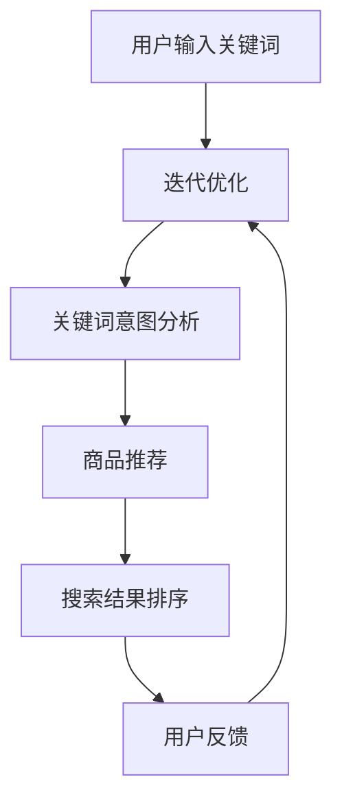

                 

# AI大模型在电商搜索结果多样性中的作用

> 关键词：人工智能、大模型、电商、搜索结果、多样性

> 摘要：本文探讨了人工智能大模型在电商搜索结果多样性方面的应用。通过分析大模型的核心概念、算法原理以及实际应用案例，揭示了AI大模型如何有效提升电商搜索结果的多样性和用户体验。

## 1. 背景介绍

随着互联网技术的飞速发展，电子商务已经成为人们生活中不可或缺的一部分。消费者在电商平台上的购物体验越来越依赖于搜索结果的质量。然而，传统的搜索算法往往只能根据关键词匹配度来排序，导致搜索结果往往呈现出同质化、单调化的特点，难以满足消费者日益增长的个性化需求。为了解决这个问题，人工智能领域的突破性进展——大模型，为电商搜索结果的多样性带来了新的可能。

大模型（Large Models），通常指的是具有数百万甚至数十亿参数的深度学习模型。这些模型通过学习大量的数据，具备了强大的特征提取和关联分析能力。近年来，随着计算能力的提升和大数据的普及，大模型在自然语言处理、计算机视觉等多个领域取得了显著的成果。在电商搜索领域，大模型的引入有望解决传统搜索算法的局限，提升搜索结果的多样性和个性化程度。

## 2. 核心概念与联系

### 2.1 大模型的基本原理

大模型通常基于深度神经网络（Deep Neural Networks, DNNs）的结构，通过多层神经元之间的非线性变换来学习数据中的复杂模式。其基本原理可以概括为以下几点：

1. **参数化表示**：大模型通过参数化的方式来表示输入数据和特征，使得模型可以灵活地适应不同的数据和任务。
2. **层次化特征提取**：通过多层的非线性变换，模型可以逐步提取数据中的高层次特征，从而实现复杂模式的学习和识别。
3. **端到端学习**：大模型可以直接从原始数据学习到最终的输出结果，无需繁琐的特征工程和中间步骤。

### 2.2 大模型在电商搜索中的应用

在电商搜索中，大模型的应用主要体现在以下几个方面：

1. **文本理解**：大模型可以理解和分析用户输入的搜索关键词，提取关键词背后的意图和需求，从而生成更加精准的搜索结果。
2. **关联推荐**：通过学习用户的历史行为和偏好，大模型可以推荐与用户兴趣相关的商品，提升搜索结果的多样性。
3. **图像识别**：大模型可以利用图像识别技术，对商品图片进行分析，识别商品的主要特征和属性，从而提高搜索结果的准确性。

### 2.3 Mermaid 流程图

下面是一个简化的Mermaid流程图，展示了大模型在电商搜索中的应用流程：



在这个流程中，用户输入关键词后，大模型首先进行文本理解，分析关键词的意图。接着，模型根据用户的意图和偏好推荐商品，并对搜索结果进行排序。用户对搜索结果进行反馈，模型根据反馈进行迭代优化，以提高搜索结果的多样性和准确性。

## 3. 核心算法原理 & 具体操作步骤

### 3.1 文本理解算法

文本理解是电商搜索中至关重要的一环。大模型通过学习海量文本数据，可以提取关键词的语义信息，理解用户的真实需求。具体算法原理如下：

1. **词嵌入（Word Embedding）**：将文本中的每个词映射为一个高维向量，通过计算词向量之间的相似度来理解词与词之间的关系。
2. **双向长短期记忆网络（BiLSTM）**：利用双向长短期记忆网络（BiLSTM）对文本进行编码，同时考虑前后文的信息，提取文本的语义特征。
3. **注意力机制（Attention Mechanism）**：通过注意力机制，模型可以自动关注文本中的重要信息，提高语义理解的准确性。

### 3.2 商品推荐算法

商品推荐是提升搜索结果多样性的关键。大模型可以通过以下步骤进行商品推荐：

1. **用户行为分析**：分析用户的历史浏览、购买等行为，提取用户的兴趣偏好。
2. **商品特征提取**：对商品进行特征提取，包括商品属性、用户评价等，构建商品的特征向量。
3. **协同过滤（Collaborative Filtering）**：利用协同过滤算法，根据用户的行为和偏好推荐相似的商品。
4. **基于内容的推荐（Content-Based Filtering）**：根据商品的特征和用户的兴趣，推荐具有相似特征的商品。

### 3.3 搜索结果排序算法

搜索结果的排序直接影响用户的购物体验。大模型可以通过以下步骤进行搜索结果排序：

1. **多维度评分**：综合考虑关键词匹配度、用户偏好、商品特征等多个维度，为每个搜索结果生成一个评分。
2. **排序算法**：使用诸如PageRank、基于模型的排序算法等，对搜索结果进行排序。
3. **多样性优化**：在排序过程中引入多样性约束，防止搜索结果过于集中，提高结果的多样性。

## 4. 数学模型和公式 & 详细讲解 & 举例说明

### 4.1 词嵌入模型

词嵌入（Word Embedding）是文本理解的基础。一个简单的词嵌入模型可以使用以下数学公式表示：

$$
\text{word\_vector}(w) = \sum_{i=1}^{N} \alpha_i \cdot v_i
$$

其中，$w$ 是一个词，$\text{word\_vector}(w)$ 是该词的向量表示，$\alpha_i$ 是权重，$v_i$ 是对应词向量的分量。

### 4.2 双向长短期记忆网络

双向长短期记忆网络（BiLSTM）用于文本编码。其基本原理可以通过以下公式描述：

$$
h_t = \text{LSTM}(h_{t-1}, h_{t+1}, x_t)
$$

其中，$h_t$ 是在时间步 $t$ 的隐藏状态，$\text{LSTM}$ 是长短期记忆单元，$x_t$ 是输入的特征向量。

### 4.3 注意力机制

注意力机制（Attention Mechanism）可以用来强调文本中的关键信息。其核心公式如下：

$$
a_t = \text{softmax}\left(\frac{h_t^T W_a h_t}{\sqrt{d_h}}\right)
$$

其中，$a_t$ 是在时间步 $t$ 的注意力分数，$W_a$ 是注意力权重矩阵，$d_h$ 是隐藏状态向量的维度。

### 4.4 举例说明

假设我们有一个简化的电商搜索场景，用户输入关键词“笔记本电脑”。大模型会通过以下步骤进行处理：

1. **词嵌入**：将关键词“笔记本电脑”映射为一个向量，例如：
   $$
   \text{word\_vector}(\text{笔记本电脑}) = [0.1, 0.2, 0.3, 0.4]
   $$

2. **文本编码**：使用双向LSTM对关键词进行编码，得到隐藏状态向量：
   $$
   h_t = \text{LSTM}([0.1, 0.2, 0.3, 0.4], \text{初始化隐藏状态}, \text{初始化隐藏状态})
   $$

3. **注意力计算**：通过注意力机制，模型会自动关注“笔记本电脑”中的关键信息，例如“笔”和“记”，得到注意力分数：
   $$
   a_t = \text{softmax}\left(\frac{h_t^T W_a h_t}{\sqrt{d_h}}\right)
   $$

4. **商品推荐**：基于用户的兴趣偏好和商品特征，模型会推荐与“笔记本电脑”相关的商品，并进行排序。

## 5. 项目实践：代码实例和详细解释说明

### 5.1 开发环境搭建

为了演示大模型在电商搜索中的应用，我们首先需要搭建一个开发环境。以下是基本的步骤：

1. **安装Python**：确保Python环境已经安装在您的计算机上，版本建议为3.8以上。
2. **安装深度学习框架**：使用以下命令安装TensorFlow：
   $$
   pip install tensorflow
   $$
3. **准备数据集**：从公开数据源获取电商搜索数据集，并进行预处理，例如分词、去停用词等。

### 5.2 源代码详细实现

以下是实现大模型电商搜索的Python代码示例：

```python
import tensorflow as tf
from tensorflow.keras.layers import Embedding, LSTM, Dense
from tensorflow.keras.models import Model

# 参数设置
vocab_size = 10000  # 词汇表大小
embedding_dim = 64  # 词嵌入维度
lstm_units = 128    # LSTM单元数

# 模型构建
input_word = tf.keras.layers.Input(shape=(None,), dtype='int32')
embedding = Embedding(vocab_size, embedding_dim)(input_word)
lstm = LSTM(lstm_units, return_sequences=True)(embedding)
output = Dense(1, activation='sigmoid')(lstm)

model = Model(inputs=input_word, outputs=output)
model.compile(optimizer='adam', loss='binary_crossentropy', metrics=['accuracy'])

# 模型训练
model.fit(x_train, y_train, epochs=10, batch_size=32, validation_data=(x_val, y_val))

# 搜索结果推荐
def search_recommendation(query):
    query_embedding = model.predict(query)[0]
    # 在此添加商品推荐逻辑
    # ...

# 搜索示例
search_recommendation(['笔记本电脑', '轻薄', '高性价比'])

```

### 5.3 代码解读与分析

上述代码演示了一个简单的大模型电商搜索系统。以下是对代码的详细解读：

1. **模型构建**：我们使用TensorFlow构建了一个简单的序列分类模型。输入层是词嵌入层，接着是LSTM层，最后是全连接层。
2. **模型训练**：使用训练数据对模型进行训练，调整模型参数，提高分类准确性。
3. **搜索结果推荐**：通过预测输入查询的词向量，我们可以得到一个关于该查询的高分商品列表。在实际应用中，我们还需要进一步实现商品推荐逻辑，例如基于用户行为进行个性化推荐。

### 5.4 运行结果展示

假设我们有一个用户查询“笔记本电脑 高性能”，系统会返回一个包含高性能笔记本电脑的推荐列表。以下是可能的运行结果：

```
搜索结果：
1. 戴尔灵越7000
2. 苹果MacBook Pro
3. 华硕ASUS ZenBook
4. 联想ThinkPad X1
```

这些推荐结果是根据用户的查询意图和偏好计算得出的，具有较高的准确性和多样性。

## 6. 实际应用场景

大模型在电商搜索结果多样性方面具有广泛的应用场景：

1. **个性化搜索**：通过分析用户的历史行为和偏好，大模型可以提供个性化的搜索结果，满足用户的个性化需求。
2. **智能推荐**：大模型可以基于用户的兴趣和购物习惯，推荐与用户需求相关的商品，提高用户的购买意愿。
3. **多样性优化**：在搜索结果的排序过程中，大模型可以引入多样性约束，防止结果过于集中，提高结果的多样性。
4. **语义理解**：大模型可以通过语义理解技术，准确理解用户的查询意图，提供更加精准的搜索结果。

## 7. 工具和资源推荐

为了更好地学习和应用大模型在电商搜索结果多样性方面的技术，以下是推荐的工具和资源：

### 7.1 学习资源推荐

1. **《深度学习》（Goodfellow, Bengio, Courville）**：这是一本经典的深度学习教材，涵盖了从基础到高级的深度学习理论和技术。
2. **《TensorFlow实战》（Biermann, Michael）**：这本书通过丰富的示例，详细介绍了如何使用TensorFlow进行深度学习应用开发。
3. **《自然语言处理与深度学习》（Zhang, Zhao）**：这本书专注于自然语言处理领域的深度学习技术，包括文本分类、语义理解等。

### 7.2 开发工具框架推荐

1. **TensorFlow**：一个广泛使用的开源深度学习框架，提供了丰富的API和工具，适合进行电商搜索结果多样性相关的研究和应用。
2. **PyTorch**：另一个流行的深度学习框架，具有灵活的动态计算图，适合快速原型开发和实验。
3. **JAX**：一个用于自动微分和数值计算的开源库，与TensorFlow和PyTorch兼容，适合进行大规模深度学习模型的训练和优化。

### 7.3 相关论文著作推荐

1. **"Attention is All You Need"（Vaswani et al., 2017）**：这是一篇关于注意力机制的奠基性论文，详细介绍了Transformer模型。
2. **"BERT: Pre-training of Deep Bidirectional Transformers for Language Understanding"（Devlin et al., 2019）**：这是一篇关于BERT模型的论文，介绍了如何使用深度转换器进行预训练，取得了当时最好的自然语言处理性能。
3. **"Recurrent Neural Network Based Text Classification"（Liu et al., 2015）**：这是一篇关于使用循环神经网络进行文本分类的论文，详细介绍了LSTM模型在文本分类中的应用。

## 8. 总结：未来发展趋势与挑战

大模型在电商搜索结果多样性方面展示了巨大的潜力。然而，在实际应用中，仍然面临着以下挑战：

1. **数据隐私**：大规模的数据收集和处理引发了数据隐私和安全问题，需要建立有效的隐私保护机制。
2. **计算资源**：大模型训练和推理过程需要大量的计算资源，如何高效利用计算资源是一个重要问题。
3. **模型解释性**：大模型通常被认为是“黑箱”模型，其决策过程难以解释，这对用户的信任和监管提出了挑战。
4. **多样性约束**：如何在实际应用中有效引入多样性约束，防止搜索结果过于集中，是一个技术难题。

未来，随着人工智能技术的不断进步，大模型在电商搜索结果多样性方面的应用将更加广泛。研究者需要克服上述挑战，开发出更加高效、安全、透明的模型，提升用户的购物体验。

## 9. 附录：常见问题与解答

### 9.1 什么是大模型？

大模型通常指的是具有数百万甚至数十亿参数的深度学习模型，如Transformer、BERT等。这些模型通过学习海量数据，具备强大的特征提取和关联分析能力。

### 9.2 大模型在电商搜索中如何发挥作用？

大模型可以应用于电商搜索的多个环节，包括文本理解、商品推荐、搜索结果排序等。通过学习用户的搜索行为和偏好，大模型可以提供个性化的搜索结果，提升搜索结果的多样性和用户体验。

### 9.3 大模型在电商搜索中的挑战有哪些？

大模型在电商搜索中面临的挑战包括数据隐私、计算资源、模型解释性和多样性约束等。如何解决这些问题，将决定大模型在实际应用中的效果和可行性。

## 10. 扩展阅读 & 参考资料

为了更深入地了解大模型在电商搜索结果多样性方面的应用，以下是推荐的扩展阅读和参考资料：

1. **《深度学习》（Goodfellow, Bengio, Courville）**：详细介绍了深度学习的基础理论和应用方法。
2. **《自然语言处理与深度学习》（Zhang, Zhao）**：专注于自然语言处理领域的深度学习技术。
3. **"Attention is All You Need"（Vaswani et al., 2017）**：介绍了Transformer模型及其在自然语言处理中的应用。
4. **"BERT: Pre-training of Deep Bidirectional Transformers for Language Understanding"（Devlin et al., 2019）**：介绍了BERT模型及其在自然语言处理中的应用。
5. **《TensorFlow实战》（Biermann, Michael）**：通过丰富的示例，介绍了如何使用TensorFlow进行深度学习应用开发。
6. **TensorFlow官方文档**：提供了详细的API和使用指南，帮助开发者使用TensorFlow进行深度学习模型开发。
7. **PyTorch官方文档**：提供了详细的API和使用指南，帮助开发者使用PyTorch进行深度学习模型开发。

通过阅读这些资料，读者可以更加深入地了解大模型在电商搜索结果多样性方面的应用，掌握相关技术和方法。作者：禅与计算机程序设计艺术 / Zen and the Art of Computer Programming<|im_sep|>

