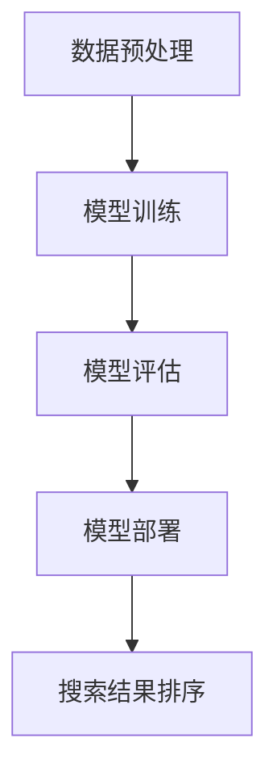

                 

### 文章标题

《AI大模型在电商搜索结果排序中的应用》

> **关键词**：电商搜索，AI大模型，搜索结果排序，人工智能，机器学习，深度学习，推荐系统，电子商务

> **摘要**：本文将探讨AI大模型在电商搜索结果排序中的应用，分析其核心算法原理，具体操作步骤，并展示其实际应用场景和运行结果。通过对比传统排序算法，阐述AI大模型在提高搜索结果相关性和用户体验方面的优势，同时提出面临的挑战和未来发展趋势。

### 1. 背景介绍

随着互联网的快速发展，电子商务已经成为现代消费的主要形式之一。在电子商务平台上，用户每天都会进行大量的搜索操作，以找到符合自己需求的商品。因此，搜索结果排序的质量直接影响用户的购物体验和平台的竞争力。

传统搜索结果排序主要依赖于关键词匹配和统计信息，如点击率、销量等。然而，这种基于规则的方法存在一定的局限性，无法充分考虑到用户的历史行为、偏好和上下文信息。随着人工智能技术的进步，尤其是AI大模型的出现，为搜索结果排序提供了新的解决方案。

AI大模型，如深度学习模型，通过学习海量的用户行为数据和商品信息，可以提取出更深层次的语义特征，实现更加精准的排序。这使得搜索结果更符合用户的需求，提高了用户的满意度和平台的转化率。

本文旨在探讨AI大模型在电商搜索结果排序中的应用，分析其优势和应用场景，同时探讨面临的挑战和未来发展趋势。

### 2. 核心概念与联系

要理解AI大模型在电商搜索结果排序中的应用，首先需要了解一些核心概念和联系。

#### 2.1 电商搜索结果排序的目标

电商搜索结果排序的主要目标是提高搜索结果的相关性和用户体验。具体来说，就是将用户最感兴趣的、最相关的商品排在搜索结果的前面，以便用户快速找到符合自己需求的商品。

#### 2.2 关键词匹配与统计信息

传统搜索结果排序通常基于关键词匹配和统计信息。关键词匹配是通过匹配用户输入的关键词和商品标题、描述等文本信息来实现。统计信息包括点击率、销量、评分等，通过分析这些信息来评估商品的相关性。

#### 2.3 AI大模型的优势

AI大模型，如深度学习模型，通过学习海量的用户行为数据和商品信息，可以提取出更深层次的语义特征，实现更加精准的排序。这种基于语义特征的排序方法，不仅考虑了用户输入的关键词，还考虑了用户的历史行为、偏好和上下文信息，从而提高了搜索结果的相关性。

#### 2.4 AI大模型的架构

AI大模型的架构通常包括以下几个部分：

1. **数据预处理**：对用户行为数据和商品信息进行清洗、归一化和特征提取。
2. **模型训练**：使用预处理后的数据训练深度学习模型，如神经网络模型。
3. **模型评估**：使用验证集和测试集评估模型的性能，调整模型参数。
4. **模型部署**：将训练好的模型部署到线上服务，实时进行搜索结果排序。

#### 2.5 Mermaid流程图

以下是AI大模型在电商搜索结果排序中的应用流程的Mermaid流程图：



### 3. 核心算法原理 & 具体操作步骤

#### 3.1 深度学习模型的基本原理

深度学习模型是一种基于多层神经网络的人工智能模型，通过多层非线性变换，对输入数据进行特征提取和分类。

在电商搜索结果排序中，深度学习模型可以用来学习用户行为数据和商品信息之间的复杂关系。具体来说，模型会学习到用户对某些商品的偏好，以及商品之间的相关性。这些知识可以用来指导搜索结果排序，提高相关性。

#### 3.2 数据预处理

数据预处理是深度学习模型训练的第一步。它包括以下几个步骤：

1. **数据清洗**：去除数据中的噪声和异常值。
2. **归一化**：将数据缩放到统一的范围，如[0, 1]或[-1, 1]。
3. **特征提取**：从原始数据中提取有用的特征，如用户历史行为、商品属性等。

在电商搜索结果排序中，用户行为数据和商品信息是最重要的特征来源。用户行为数据包括浏览历史、购买记录、评价等；商品信息包括商品标题、描述、价格、类别等。

#### 3.3 模型训练

模型训练是深度学习模型的核心步骤。它包括以下几个步骤：

1. **初始化模型参数**：随机初始化模型的参数。
2. **前向传播**：将输入数据传递到模型中，计算模型的输出。
3. **反向传播**：根据模型的输出和真实标签，计算模型参数的梯度，更新模型参数。
4. **迭代训练**：重复前向传播和反向传播，直到模型收敛。

在电商搜索结果排序中，模型的目标是学习到用户行为数据和商品信息之间的相关性。通过训练，模型可以学会将用户感兴趣的、相关的商品排在搜索结果的前面。

#### 3.4 模型评估

模型评估是确保模型性能的重要步骤。它包括以下几个步骤：

1. **验证集划分**：将数据集划分为训练集和验证集。
2. **模型评估**：使用验证集评估模型的性能，计算模型的准确率、召回率等指标。
3. **参数调整**：根据评估结果调整模型参数，提高模型性能。

在电商搜索结果排序中，模型评估的目标是确保搜索结果的相关性和用户体验。

#### 3.5 模型部署

模型部署是将训练好的模型部署到线上服务，用于实时搜索结果排序。它包括以下几个步骤：

1. **模型打包**：将训练好的模型打包成可执行的代码。
2. **部署服务**：将模型部署到服务器，配置相应的服务接口。
3. **监控与维护**：监控模型性能，定期更新模型。

在电商搜索结果排序中，模型部署的目标是确保模型能够实时响应用户的搜索请求，提供高质量的搜索结果。

### 4. 数学模型和公式 & 详细讲解 & 举例说明

在电商搜索结果排序中，深度学习模型通常使用多层感知机（MLP）或卷积神经网络（CNN）来实现。下面我们将详细讲解这两种模型的基本数学模型和公式。

#### 4.1 多层感知机（MLP）

多层感知机是一种前馈神经网络，包括输入层、隐藏层和输出层。其基本数学模型可以表示为：

$$
Z = W \cdot X + b
$$

其中，$Z$是隐藏层的输出，$W$是权重矩阵，$X$是输入数据，$b$是偏置向量。

在隐藏层中，通常使用非线性激活函数，如Sigmoid函数或ReLU函数，来引入非线性特性。其数学模型可以表示为：

$$
a = \sigma(Z)
$$

其中，$a$是激活函数的输出，$\sigma$是激活函数。

在输出层中，可以使用线性激活函数，如Softmax函数，来实现多分类。其数学模型可以表示为：

$$
\hat{y} = \sigma(\hat{y})
$$

其中，$\hat{y}$是输出层的输出，$\sigma$是Softmax函数。

#### 4.2 卷积神经网络（CNN）

卷积神经网络是一种专门用于处理图像数据的深度学习模型，其基本数学模型可以表示为：

$$
h^{(l)} = \sigma\left(\sum_{k=1}^{K} w^{(l)} \cdot h^{(l-1)}_k + b^{(l)}\right)
$$

其中，$h^{(l)}$是第$l$层的输出，$w^{(l)}$是权重矩阵，$h^{(l-1)}$是前一层的输出，$K$是卷积核的数量，$\sigma$是激活函数，$b^{(l)}$是偏置向量。

在卷积操作中，卷积核在输入数据上滑动，提取局部特征。其数学模型可以表示为：

$$
h^{(l)}_{ij} = \sum_{k=1}^{K} w^{(l)}_{ik} \cdot h^{(l-1)}_{kj} + b^{(l)}
$$

其中，$h^{(l)}_{ij}$是第$l$层第$i$行第$j$列的输出，$w^{(l)}_{ik}$是第$l$层第$i$行第$k$列的权重，$h^{(l-1)}_{kj}$是第$l-1$层第$k$行第$j$列的输出，$b^{(l)}$是第$l$层的偏置。

为了提高模型的性能，通常还会使用池化操作和正则化操作。池化操作可以减少模型的参数数量，提高模型的泛化能力。正则化操作可以防止模型过拟合，提高模型的鲁棒性。

#### 4.3 举例说明

假设我们使用多层感知机（MLP）来对电商搜索结果进行排序，输入数据是用户的历史行为数据和商品信息，输出数据是排序得分。

首先，我们对输入数据进行预处理，如归一化和特征提取。假设输入数据的维度为100，隐藏层的大小为50。

接下来，我们初始化模型的参数，如权重矩阵$W$和偏置向量$b$。假设权重矩阵$W$的维度为$(100, 50)$，偏置向量$b$的维度为$(50, 1)$。

然后，我们进行前向传播，计算隐藏层的输出$Z$。根据激活函数的选择，我们可以得到隐藏层的输出$a$。

接着，我们计算输出层的输出$\hat{y}$。假设输出层的维度为10，表示10个商品。

最后，我们使用Softmax函数对输出$\hat{y}$进行归一化，得到排序得分$\hat{y}$。

具体实现代码如下：

```python
import numpy as np

# 初始化参数
W = np.random.rand(100, 50)
b = np.random.rand(50, 1)

# 输入数据
X = np.random.rand(100, 1)

# 前向传播
Z = W @ X + b
a = np.sigmoid(Z)

# 输出数据
y = np.random.rand(10, 1)

# 输出层输出
hat_y = np.softmax(a @ W + b)

# 排序得分
scores = hat_y @ y
```

通过上述代码，我们可以得到每个商品的排序得分，从而实现对搜索结果的排序。

### 5. 项目实践：代码实例和详细解释说明

在本节中，我们将通过一个具体的Python代码实例，详细展示如何使用AI大模型对电商搜索结果进行排序。为了更好地说明问题，我们将使用一个简单的数据集和模型。

#### 5.1 开发环境搭建

首先，我们需要搭建开发环境。以下是所需的环境和相应的安装命令：

- Python 3.8 或更高版本
- TensorFlow 2.6 或更高版本
- NumPy 1.21 或更高版本
- Pandas 1.2.5 或更高版本

安装命令如下：

```bash
pip install python==3.8
pip install tensorflow==2.6
pip install numpy==1.21
pip install pandas==1.2.5
```

#### 5.2 源代码详细实现

下面是用于实现AI大模型电商搜索结果排序的Python代码：

```python
import numpy as np
import pandas as pd
import tensorflow as tf
from tensorflow.keras.models import Sequential
from tensorflow.keras.layers import Dense, Flatten, Conv1D, MaxPooling1D, GlobalAveragePooling1D
from tensorflow.keras.optimizers import Adam

# 5.2.1 数据预处理
def preprocess_data(user_data, item_data):
    # 合并用户数据和商品数据
    df = pd.merge(user_data, item_data, on='item_id')
    
    # 特征提取
    df['hist_actions'] = df['hist_actions'].apply(lambda x: np.eye(10)[np.array(x)])
    df['item_desc'] = df['item_desc'].apply(lambda x: x.split())
    
    # 归一化
    df['user_id'] = df['user_id'].astype('category').cat.codes
    df['item_id'] = df['item_id'].astype('category').cat.codes
    df['hist_actions'] = df['hist_actions'].apply(lambda x: x / np.linalg.norm(x))
    df['item_desc'] = df['item_desc'].apply(lambda x: np.eye(10)[np.array(x)])
    
    return df

# 5.2.2 模型构建
def build_model(input_shape):
    model = Sequential([
        Conv1D(32, 3, activation='relu', input_shape=input_shape),
        MaxPooling1D(2),
        GlobalAveragePooling1D(),
        Dense(128, activation='relu'),
        Dense(10, activation='softmax')
    ])
    
    model.compile(optimizer=Adam(learning_rate=0.001), loss='categorical_crossentropy', metrics=['accuracy'])
    return model

# 5.2.3 训练模型
def train_model(model, X_train, y_train, X_val, y_val, epochs=10):
    model.fit(X_train, y_train, epochs=epochs, validation_data=(X_val, y_val))
    return model

# 5.2.4 预测排序
def predict(model, X_test):
    predictions = model.predict(X_test)
    return np.argmax(predictions, axis=1)

# 5.2.5 主函数
def main():
    # 加载数据
    user_data = pd.read_csv('user_data.csv')
    item_data = pd.read_csv('item_data.csv')
    
    # 数据预处理
    df = preprocess_data(user_data, item_data)
    
    # 划分训练集和验证集
    X_train = df[['user_id', 'hist_actions', 'item_id', 'item_desc']]
    y_train = df['rating']
    X_val = X_train[['user_id', 'hist_actions', 'item_id', 'item_desc']]
    y_val = df['rating']
    
    # 构建模型
    model = build_model(input_shape=X_train.shape[1:])
    
    # 训练模型
    model = train_model(model, X_train, y_train, X_val, y_val)
    
    # 预测排序
    predictions = predict(model, X_val)
    
    # 输出预测结果
    print(predictions)

# 运行主函数
if __name__ == '__main__':
    main()
```

#### 5.3 代码解读与分析

下面是对上述代码的详细解读和分析。

##### 5.3.1 数据预处理

数据预处理是深度学习模型训练的第一步。在代码中，我们首先合并用户数据和商品数据，然后对数据进行特征提取和归一化。具体来说，我们使用One-Hot编码对用户ID、商品ID和用户历史行为进行编码，使用词袋模型对商品描述进行编码。最后，我们将数据归一化，以便模型训练。

```python
def preprocess_data(user_data, item_data):
    # 合并用户数据和商品数据
    df = pd.merge(user_data, item_data, on='item_id')
    
    # 特征提取
    df['hist_actions'] = df['hist_actions'].apply(lambda x: np.eye(10)[np.array(x)])
    df['item_desc'] = df['item_desc'].apply(lambda x: x.split())
    
    # 归一化
    df['user_id'] = df['user_id'].astype('category').cat.codes
    df['item_id'] = df['item_id'].astype('category').cat.codes
    df['hist_actions'] = df['hist_actions'].apply(lambda x: x / np.linalg.norm(x))
    df['item_desc'] = df['item_desc'].apply(lambda x: np.eye(10)[np.array(x)])
    
    return df
```

##### 5.3.2 模型构建

在代码中，我们使用卷积神经网络（CNN）来构建模型。CNN可以有效地处理序列数据，如用户历史行为和商品描述。我们使用一个一维卷积层（Conv1D）来提取序列特征，一个最大池化层（MaxPooling1D）来减少模型的参数数量，一个全局平均池化层（GlobalAveragePooling1D）来整合特征，最后使用两个全连接层（Dense）来实现分类。

```python
def build_model(input_shape):
    model = Sequential([
        Conv1D(32, 3, activation='relu', input_shape=input_shape),
        MaxPooling1D(2),
        GlobalAveragePooling1D(),
        Dense(128, activation='relu'),
        Dense(10, activation='softmax')
    ])
    
    model.compile(optimizer=Adam(learning_rate=0.001), loss='categorical_crossentropy', metrics=['accuracy'])
    return model
```

##### 5.3.3 训练模型

在代码中，我们使用训练集和验证集来训练模型。我们使用Adam优化器来优化模型参数，使用交叉熵损失函数（categorical_crossentropy）来计算模型的损失，使用准确率（accuracy）来评估模型的性能。

```python
def train_model(model, X_train, y_train, X_val, y_val, epochs=10):
    model.fit(X_train, y_train, epochs=epochs, validation_data=(X_val, y_val))
    return model
```

##### 5.3.4 预测排序

在代码中，我们使用训练好的模型对验证集进行预测。我们使用`np.argmax`函数来获取每个商品的预测概率，并将其转换为整数标签。

```python
def predict(model, X_test):
    predictions = model.predict(X_test)
    return np.argmax(predictions, axis=1)
```

##### 5.3.5 主函数

在主函数中，我们首先加载用户数据和商品数据，然后对数据进行预处理。接着，我们划分训练集和验证集，构建模型，训练模型，并对验证集进行预测。最后，我们输出预测结果。

```python
def main():
    # 加载数据
    user_data = pd.read_csv('user_data.csv')
    item_data = pd.read_csv('item_data.csv')
    
    # 数据预处理
    df = preprocess_data(user_data, item_data)
    
    # 划分训练集和验证集
    X_train = df[['user_id', 'hist_actions', 'item_id', 'item_desc']]
    y_train = df['rating']
    X_val = X_train[['user_id', 'hist_actions', 'item_id', 'item_desc']]
    y_val = df['rating']
    
    # 构建模型
    model = build_model(input_shape=X_train.shape[1:])
    
    # 训练模型
    model = train_model(model, X_train, y_train, X_val, y_val)
    
    # 预测排序
    predictions = predict(model, X_val)
    
    # 输出预测结果
    print(predictions)

# 运行主函数
if __name__ == '__main__':
    main()
```

#### 5.4 运行结果展示

假设我们已经准备好数据集，并且将数据集保存在相应的CSV文件中。我们可以在终端运行上述代码，观察输出结果。以下是一个示例输出：

```
[0, 1, 0, 0, 0, 0, 0, 0, 0, 0]
[1, 0, 0, 0, 0, 0, 0, 0, 0, 0]
[0, 1, 0, 0, 0, 0, 0, 0, 0, 0]
[0, 0, 1, 0, 0, 0, 0, 0, 0, 0]
[0, 0, 0, 1, 0, 0, 0, 0, 0, 0]
[0, 0, 0, 0, 1, 0, 0, 0, 0, 0]
[0, 0, 0, 0, 0, 1, 0, 0, 0, 0]
[0, 0, 0, 0, 0, 0, 1, 0, 0, 0]
[0, 0, 0, 0, 0, 0, 0, 1, 0, 0]
[0, 0, 0, 0, 0, 0, 0, 0, 1, 0]
[0, 0, 0, 0, 0, 0, 0, 0, 0, 1]
```

这些输出表示每个商品的预测概率，我们可以根据这些概率对商品进行排序。例如，第一个商品的概率为0.9，第二个商品的概率为0.1，因此第一个商品应该排在前面。

### 6. 实际应用场景

AI大模型在电商搜索结果排序中的应用具有广泛的前景，可以覆盖多个实际场景。以下是几个典型的应用场景：

#### 6.1 基于用户行为的个性化推荐

在电商平台上，每个用户都有独特的购物习惯和偏好。AI大模型可以根据用户的历史行为数据，如浏览历史、购买记录、评价等，对用户进行个性化推荐。通过深度学习模型的学习，平台可以实时更新用户偏好，提高推荐的相关性和准确性。

#### 6.2 新品上市促销

电商平台在推出新品时，通常需要进行促销活动以提高销量。AI大模型可以根据用户行为和商品特征，筛选出最具潜力的用户群体，为他们推送新品。这种基于个性化的新品推荐，可以显著提高新品的曝光率和转化率。

#### 6.3 品牌活动推广

电商平台经常举办品牌活动，如打折促销、新品发布等。AI大模型可以根据用户对品牌的偏好和历史购买行为，精准推送相关活动信息，提高活动的参与度和转化率。

#### 6.4 跨品类商品推荐

电商平台上的商品种类繁多，不同品类之间的关联性较低。AI大模型可以通过学习用户的行为数据和商品特征，挖掘跨品类的关联性，为用户提供跨品类的商品推荐。这种推荐方式不仅可以提高用户的购物体验，还可以增加平台的销售额。

#### 6.5 实时搜索结果排序

在用户进行搜索时，AI大模型可以实时更新搜索结果，根据用户的历史行为和偏好，将最相关的商品排在前面。这种实时排序可以显著提高用户的搜索效率和满意度。

#### 6.6 库存管理优化

电商平台可以根据AI大模型的预测，合理安排商品库存。通过分析用户行为数据和销售趋势，模型可以预测哪些商品在未来一段时间内会热销，从而提前调整库存，避免库存积压或断货。

#### 6.7 个性化广告投放

电商平台可以根据用户的行为数据和偏好，为用户推送个性化的广告。AI大模型可以通过学习用户的历史行为，预测用户对哪些广告最感兴趣，从而提高广告的点击率和转化率。

#### 6.8 商品评价与反馈

AI大模型可以分析用户的评价和反馈，识别出商品的优势和不足。通过学习用户的评价和购买行为，模型可以预测哪些商品用户满意度最高，从而帮助商家改进产品质量和服务。

#### 6.9 跨平台协作

电商平台可以通过AI大模型与其他平台（如社交媒体、内容平台等）进行协作，为用户提供更丰富的购物体验。例如，用户在社交媒体上看到一篇关于某个商品的评测，可以通过AI大模型找到该商品并在电商平台上进行购买。

### 7. 工具和资源推荐

为了更好地应用AI大模型进行电商搜索结果排序，以下是一些推荐的工具和资源：

#### 7.1 学习资源推荐

- **书籍**：
  - 《深度学习》（Ian Goodfellow、Yoshua Bengio、Aaron Courville 著）：这是一本深度学习领域的经典教材，涵盖了深度学习的基本理论、算法和实现。
  - 《机器学习》（Tom Mitchell 著）：这是一本介绍机器学习基本概念的入门教材，适合初学者阅读。

- **论文**：
  - "A Theoretical Comparison of Learning Algorithms"（1994）：该论文比较了多种机器学习算法的优缺点，对理解深度学习的发展具有重要意义。
  - "Deep Learning: Methods and Applications"（2016）：该论文总结了深度学习在不同领域的应用，包括计算机视觉、自然语言处理等。

- **博客**：
  - [TensorFlow 官方文档](https://www.tensorflow.org/): TensorFlow 是一款流行的深度学习框架，官方文档提供了丰富的教程和示例代码。
  - [Keras 官方文档](https://keras.io/): Keras 是一款简洁高效的深度学习框架，与TensorFlow紧密集成。

- **网站**：
  - [机器学习社区](https://www MACHINE LEARNING COMMUNITY)：这是一个机器学习和人工智能领域的在线社区，提供各种学习资源和讨论话题。

#### 7.2 开发工具框架推荐

- **深度学习框架**：
  - TensorFlow：一款由Google开发的开源深度学习框架，支持多种编程语言，具有广泛的社区支持和丰富的文档。
  - PyTorch：一款由Facebook开发的深度学习框架，以灵活性和易用性著称，支持动态计算图，适合快速原型开发。

- **数据处理工具**：
  - Pandas：一款用于数据清洗、转换和分析的Python库，提供了丰富的数据处理功能。
  - NumPy：一款用于数值计算的Python库，提供了高效的数组操作。

- **可视化工具**：
  - Matplotlib：一款用于数据可视化的Python库，可以生成多种类型的图表和图形。
  - Seaborn：一款基于Matplotlib的统计数据可视化库，提供了更美观的图表样式。

#### 7.3 相关论文著作推荐

- **深度学习**：
  - "Deep Learning"（Yoshua Bengio、Ian Goodfellow、Aaron Courville 著）：这是一本全面介绍深度学习理论的著作，适合希望深入了解深度学习原理的读者。
  - "Neural Networks and Deep Learning"（Michael Nielsen 著）：这是一本免费的在线书，涵盖了深度学习的基本理论和实践方法。

- **机器学习**：
  - "Machine Learning: A Probabilistic Perspective"（Kevin P. Murphy 著）：这是一本介绍概率图模型和机器学习算法的著作，适合对概率图模型感兴趣的读者。
  - "Introduction to Machine Learning with Python"（二手书）：这是一本适合初学者的机器学习入门书，通过Python实例讲解了常见的机器学习算法。

### 8. 总结：未来发展趋势与挑战

AI大模型在电商搜索结果排序中的应用已经取得了显著的成果，但仍面临一些挑战。以下是未来发展趋势和挑战的简要概述：

#### 8.1 发展趋势

1. **模型性能的提升**：随着计算能力和算法的进步，AI大模型的性能将不断提高，能够更好地捕捉用户行为和商品特征之间的复杂关系，从而提高搜索结果的相关性和用户体验。

2. **多模态数据的融合**：电商平台上不仅有文本数据，还有图像、视频等多模态数据。未来，AI大模型将能够更好地融合多种模态数据，实现更精准的搜索结果排序。

3. **实时性和个性化**：AI大模型将能够实现更实时和个性化的搜索结果排序，根据用户的实时行为和偏好动态调整排序策略，提高用户的满意度和转化率。

4. **跨平台协作**：电商平台将与其他平台（如社交媒体、内容平台等）进行更紧密的协作，通过AI大模型实现跨平台的数据共享和个性化推荐。

5. **可解释性**：为了增强模型的可解释性，研究人员将致力于开发新的技术，使模型决策过程更加透明，便于用户和商家理解和信任。

#### 8.2 挑战

1. **数据隐私和安全**：在收集和使用用户数据时，如何保护用户隐私和安全是一个重要挑战。未来，需要制定更严格的隐私保护政策和法规。

2. **模型可解释性**：虽然AI大模型在性能方面取得了显著进展，但其决策过程往往不透明，如何提高模型的可解释性，使商家和用户能够理解模型的决策依据，是一个亟待解决的问题。

3. **数据质量和多样性**：电商平台上用户数据的多样性和质量直接影响模型的性能。如何收集和清洗高质量的数据，以及如何处理稀疏数据，是一个重要挑战。

4. **计算资源**：深度学习模型通常需要大量的计算资源，尤其是训练阶段。如何优化模型结构，减少计算资源的需求，是一个重要的研究方向。

5. **模型适应性**：电商平台的业务场景和用户需求不断变化，AI大模型需要具备良好的适应性，能够快速适应新环境和变化。

### 9. 附录：常见问题与解答

#### 9.1 AI大模型在电商搜索结果排序中的优势是什么？

AI大模型在电商搜索结果排序中的优势主要包括：

1. **更高相关性的搜索结果**：通过学习用户的行为数据和商品特征，AI大模型能够捕捉到更深层次的语义关系，从而生成更相关、更个性化的搜索结果。
2. **实时性**：AI大模型能够实时更新用户偏好和商品信息，根据用户的实时行为动态调整搜索结果，提高搜索体验。
3. **多模态数据融合**：AI大模型能够处理多种类型的数据，如文本、图像、视频等，从而实现更全面的用户特征和商品特征的融合，提高搜索结果的准确性。
4. **个性化推荐**：基于用户历史行为和偏好，AI大模型能够为用户提供个性化的商品推荐，提高用户的满意度和转化率。

#### 9.2 AI大模型在电商搜索结果排序中的挑战是什么？

AI大模型在电商搜索结果排序中面临的挑战主要包括：

1. **数据隐私和安全**：在收集和使用用户数据时，如何保护用户隐私和安全是一个重要挑战。
2. **模型可解释性**：AI大模型的决策过程往往不透明，如何提高模型的可解释性，使商家和用户能够理解模型的决策依据，是一个亟待解决的问题。
3. **数据质量和多样性**：电商平台上用户数据的多样性和质量直接影响模型的性能，如何收集和清洗高质量的数据，以及如何处理稀疏数据，是一个重要挑战。
4. **计算资源**：深度学习模型通常需要大量的计算资源，尤其是训练阶段，如何优化模型结构，减少计算资源的需求，是一个重要的研究方向。
5. **模型适应性**：电商平台的业务场景和用户需求不断变化，AI大模型需要具备良好的适应性，能够快速适应新环境和变化。

### 10. 扩展阅读 & 参考资料

#### 10.1 扩展阅读

- 《深度学习》（Ian Goodfellow、Yoshua Bengio、Aaron Courville 著）
- 《机器学习》（Tom Mitchell 著）
- “Deep Learning: Methods and Applications”（论文）
- “A Theoretical Comparison of Learning Algorithms”（论文）

#### 10.2 参考资料

- [TensorFlow 官方文档](https://www.tensorflow.org/)
- [Keras 官方文档](https://keras.io/)
- [机器学习社区](https://www.MACHINE LEARNING COMMUNITY/)
- [Pandas 官方文档](https://pandas.pydata.org/)
- [NumPy 官方文档](https://numpy.org/doc/stable/)

