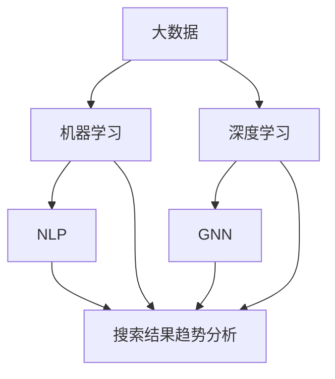

                 

### 1. 背景介绍

在当今数字化时代，电子商务已经成为全球经济增长的重要驱动力。电商平台通过提供方便快捷的购物体验，吸引了越来越多的消费者。然而，随着商品的多样化与市场竞争的加剧，如何为消费者提供更加精准、个性化的搜索结果，成为电商平台需要解决的关键问题。

电商搜索结果趋势分析，即通过对用户搜索行为和购买行为的数据分析，挖掘出商品搜索和购买趋势。这一分析不仅能够帮助电商企业优化搜索算法，提高用户满意度，还能为市场营销策略提供数据支持，从而实现精准营销，提升销售额。

人工智能（AI）大模型的引入，为电商搜索结果趋势分析带来了新的机遇。大模型具有强大的数据处理能力和复杂的算法结构，可以更准确地捕捉用户需求，预测市场趋势。本文将探讨如何利用AI大模型进行电商搜索结果趋势分析，并详细介绍其核心算法原理、数学模型、项目实践以及实际应用场景。

首先，我们将回顾电商搜索结果趋势分析的历史发展，了解该领域的演变过程。接着，我们将深入探讨AI大模型在电商搜索结果趋势分析中的应用，介绍其核心概念与联系，并展示如何利用大模型进行趋势预测。随后，我们将通过具体案例，展示如何运用数学模型和公式进行分析，同时提供代码实例和详细解释说明。最后，我们将探讨AI大模型在电商搜索结果趋势分析中的实际应用场景，并推荐相关的工具和资源，以帮助读者深入了解这一领域。通过本文的阅读，读者将全面了解AI大模型在电商搜索结果趋势分析中的重要作用，以及如何利用这一技术实现商业价值。

### 2. 核心概念与联系

在探讨AI大模型在电商搜索结果趋势分析中的应用之前，我们需要明确一些核心概念，并了解它们之间的联系。这些概念包括：大数据、机器学习、深度学习、自然语言处理（NLP）和图神经网络（GNN）。

#### 2.1 大数据（Big Data）

大数据是指数据量巨大、类型多样的数据集合。在电商领域，大数据涵盖了用户行为数据、商品信息、交易记录、评论和评分等。这些数据是电商搜索结果趋势分析的基础，通过分析这些数据，可以挖掘出用户需求和市场趋势。

#### 2.2 机器学习（Machine Learning）

机器学习是一种人工智能（AI）技术，它使计算机系统能够从数据中自动学习和改进性能。在电商搜索结果趋势分析中，机器学习算法可以用于分类、聚类、预测和推荐等任务。通过训练模型，机器学习算法能够识别出用户行为的模式和趋势。

#### 2.3 深度学习（Deep Learning）

深度学习是机器学习的一个分支，它使用了多层神经网络（Deep Neural Network，DNN）来提取特征和进行预测。与传统的机器学习方法相比，深度学习在处理复杂数据和大规模数据时具有更高的准确性和效率。在电商搜索结果趋势分析中，深度学习算法可以用于构建复杂的用户行为模型和市场预测模型。

#### 2.4 自然语言处理（Natural Language Processing，NLP）

自然语言处理是人工智能的一个子领域，它涉及计算机理解和生成自然语言。在电商搜索结果趋势分析中，NLP技术可以用于处理用户搜索查询和商品描述，提取关键词和语义信息，从而提高搜索结果的相关性和准确性。

#### 2.5 图神经网络（Graph Neural Networks，GNN）

图神经网络是一种深度学习模型，它能够处理图结构数据，如社交网络、知识图谱等。在电商搜索结果趋势分析中，GNN可以用于建模商品之间的关系和网络结构，从而提高推荐的精度和多样性。

#### 2.6 核心概念之间的联系

大数据、机器学习、深度学习、NLP和GNN这些核心概念在电商搜索结果趋势分析中相辅相成，共同构成了一个完整的技术体系。

- 大数据为分析提供了丰富的数据源，是趋势分析的基础。
- 机器学习和深度学习算法通过对这些数据的学习和建模，可以提取出有价值的信息和模式。
- NLP技术则用于处理文本数据，提取关键词和语义信息，提高搜索结果的准确性。
- GNN可以处理图结构数据，建立商品之间的关系网络，从而实现更精准的推荐。

通过这些核心概念的结合，AI大模型能够实现高效的电商搜索结果趋势分析，为电商平台提供数据驱动的决策支持。

为了更直观地展示这些核心概念和它们之间的联系，我们可以使用Mermaid流程图进行描述。



在这个流程图中，大数据是输入源，通过机器学习和深度学习算法进行处理和建模，结合NLP技术和GNN的应用，最终实现电商搜索结果趋势分析。通过这一流程，我们可以清晰地看到AI大模型在电商搜索结果趋势分析中的核心作用。

### 3. 核心算法原理 & 具体操作步骤

#### 3.1 算法原理

AI大模型在电商搜索结果趋势分析中的应用，主要依赖于深度学习和图神经网络（GNN）等技术。这些算法具有强大的数据处理和分析能力，能够从海量数据中提取出有价值的信息和趋势。下面，我们将详细阐述这些算法的原理及其在电商搜索结果趋势分析中的具体应用。

#### 3.1.1 深度学习

深度学习是一种基于多层神经网络的学习方法，它能够自动提取特征并建立复杂的模型。在电商搜索结果趋势分析中，深度学习主要用于以下两个方面的应用：

1. **用户行为建模**：通过深度学习算法，我们可以建立用户行为模型，捕捉用户的兴趣和偏好。这一模型能够分析用户的历史搜索记录、浏览行为和购买行为，从而预测用户的未来需求。常用的深度学习算法包括卷积神经网络（CNN）和循环神经网络（RNN）。

2. **商品特征提取**：商品的特征信息对于搜索结果趋势分析至关重要。深度学习算法可以用于提取商品的多维度特征，如商品属性、用户评论、商品描述等。通过这些特征，我们可以更好地理解商品的属性和用户需求，从而提高搜索结果的相关性和准确性。

#### 3.1.2 图神经网络（GNN）

图神经网络是一种专门用于处理图结构数据的深度学习模型。在电商搜索结果趋势分析中，GNN主要用于以下两个方面的应用：

1. **商品关系建模**：电商平台上的商品之间存在复杂的关联关系，如品类关系、品牌关系、商品评价关系等。通过GNN，我们可以建立商品之间的关系网络，从而实现更精准的商品推荐和趋势预测。

2. **网络结构分析**：GNN可以用于分析电商平台上的网络结构，如用户-商品网络、用户-用户网络等。通过这些网络结构，我们可以挖掘出用户之间的相互关系，从而为电商平台的社交推荐和社区营销提供支持。

#### 3.2 具体操作步骤

下面，我们将详细描述如何利用深度学习和GNN进行电商搜索结果趋势分析的具体操作步骤。

##### 3.2.1 数据预处理

在进行趋势分析之前，我们需要对数据进行预处理。数据预处理主要包括数据清洗、数据整合和数据归一化等步骤。

1. **数据清洗**：清洗原始数据，去除重复、缺失和错误的数据。对于文本数据，需要去除停用词、标点符号等无关信息，保留关键词和有效信息。
2. **数据整合**：将不同来源的数据进行整合，如用户行为数据、商品信息数据、评论数据等。通过数据整合，我们可以建立统一的用户-商品关系数据集。
3. **数据归一化**：对于不同类型的数据，进行归一化处理，如将评分数据、价格数据等进行归一化，使其在相同的尺度上进行比较。

##### 3.2.2 用户行为建模

用户行为建模是通过深度学习算法建立用户兴趣和偏好模型。具体步骤如下：

1. **特征提取**：提取用户的历史搜索记录、浏览行为和购买行为等特征，如搜索关键词、浏览的商品、购买的商品等。
2. **模型构建**：使用循环神经网络（RNN）或长短期记忆网络（LSTM）等深度学习算法构建用户行为模型。通过训练模型，我们可以捕捉用户的兴趣和偏好，从而预测用户的未来需求。
3. **模型评估**：使用交叉验证方法评估用户行为模型的性能，如准确率、召回率和F1值等。

##### 3.2.3 商品关系建模

商品关系建模是通过GNN建立商品之间的关系网络。具体步骤如下：

1. **数据准备**：准备商品信息数据，如商品ID、商品名称、商品类别等。同时，准备商品之间的关系数据，如品类关系、品牌关系等。
2. **图构建**：使用GNN的图构建方法，将商品信息数据和关系数据构建成图结构。图中的节点表示商品，边表示商品之间的关系。
3. **模型训练**：使用GNN算法训练商品关系模型。通过模型训练，我们可以捕捉商品之间的关联关系，从而为商品推荐和趋势预测提供支持。
4. **模型评估**：使用交叉验证方法评估商品关系模型的性能，如准确率、召回率和F1值等。

##### 3.2.4 搜索结果趋势预测

搜索结果趋势预测是通过用户行为模型和商品关系模型进行联合预测。具体步骤如下：

1. **趋势预测模型构建**：使用深度学习算法构建搜索结果趋势预测模型。该模型将用户行为模型和商品关系模型进行整合，从而实现搜索结果的趋势预测。
2. **模型训练**：使用历史数据训练搜索结果趋势预测模型。通过训练，模型可以学习到用户需求和商品关系的规律，从而实现准确的趋势预测。
3. **模型评估**：使用交叉验证方法评估搜索结果趋势预测模型的性能，如准确率、召回率和F1值等。

##### 3.2.5 搜索结果展示

搜索结果展示是将预测结果以直观的方式展示给用户。具体步骤如下：

1. **结果排序**：根据搜索结果趋势预测模型的预测结果，对搜索结果进行排序。优先展示预测趋势较高的商品。
2. **结果展示**：将排序后的搜索结果以列表或卡片的形式展示给用户。同时，可以提供商品详情、用户评价等信息，帮助用户做出购买决策。

通过以上具体操作步骤，我们可以利用深度学习和GNN进行电商搜索结果趋势分析，从而为电商平台提供数据驱动的决策支持。这些操作步骤不仅具有高度的实用性，而且可以灵活地应用于不同的电商场景，为电商企业带来显著的商业价值。

### 4. 数学模型和公式 & 详细讲解 & 举例说明

在电商搜索结果趋势分析中，数学模型和公式起着至关重要的作用。它们帮助我们量化用户行为和商品特性，从而实现精准的预测和优化。以下我们将详细介绍几个核心的数学模型和公式，并结合具体案例进行详细讲解和举例说明。

#### 4.1 用户行为模型

用户行为模型是通过分析用户的历史行为数据，预测用户的未来需求。这里，我们采用了一种基于矩阵分解的协同过滤算法（Collaborative Filtering）来构建用户行为模型。矩阵分解算法通过将用户-商品评分矩阵分解为两个低秩矩阵，从而提取出用户兴趣和商品特征。

**公式 1：矩阵分解**

$$
U = \{ u_{ij} \} = \{ u_i \}, \; V = \{ v_{ij} \} = \{ v_j \}
$$

其中，$U$ 表示用户矩阵，$V$ 表示商品矩阵，$u_i$ 表示第 $i$ 个用户的兴趣向量，$v_j$ 表示第 $j$ 个商品的特征向量。

**案例说明：**

假设我们有一个用户-商品评分矩阵 $R$，其中 $R_{ij}$ 表示第 $i$ 个用户对第 $j$ 个商品的评分。通过矩阵分解，我们可以将 $R$ 分解为 $U$ 和 $V$ 的乘积：

$$
R = U \cdot V^T
$$

例如，如果用户 $1$ 给商品 $1$ 的评分为 $4$，则我们可以将这个评分分解为用户兴趣向量 $u_1$ 和商品特征向量 $v_1$ 的内积：

$$
R_{11} = u_1 \cdot v_1
$$

通过这种方式，我们可以为每个用户和商品生成一个向量表示，从而用于预测用户未评分的商品。

#### 4.2 商品特征提取

商品特征提取是通过深度学习算法从商品的多维度数据中提取有用的特征。这里，我们使用卷积神经网络（CNN）来提取商品图片的特征。

**公式 2：卷积神经网络激活函数**

$$
a_{ij}^{(l)} = \sigma(z_{ij}^{(l)})
$$

其中，$a_{ij}^{(l)}$ 表示第 $l$ 层第 $i$ 个节点的激活值，$\sigma$ 表示激活函数，$z_{ij}^{(l)}$ 表示第 $l$ 层第 $i$ 个节点的输入值。

**案例说明：**

假设我们有一个商品图片，通过卷积神经网络提取其特征。假设卷积层 $l$ 的输出为 $z_{ij}^{(l)}$，我们使用ReLU激活函数：

$$
z_{ij}^{(l)} = \sum_{k} w_{ik}^{(l)} \cdot a_{kj}^{(l-1)} + b_{j}^{(l)}
$$

$$
a_{ij}^{(l)} = \max(0, z_{ij}^{(l)})
$$

其中，$w_{ik}^{(l)}$ 表示卷积核权重，$a_{kj}^{(l-1)}$ 表示前一层节点的激活值，$b_{j}^{(l)}$ 表示偏置项。

通过这种方式，我们可以提取出商品图片的视觉特征，从而用于后续的趋势预测和商品推荐。

#### 4.3 趋势预测模型

趋势预测模型是通过结合用户行为模型和商品特征提取模型，预测用户的未来需求。这里，我们使用一种基于时间序列的预测算法，如LSTM（长短期记忆网络）。

**公式 3：LSTM单元**

$$
i_t = \sigma(W_i \cdot [h_{t-1}, x_t] + b_i) \\
f_t = \sigma(W_f \cdot [h_{t-1}, x_t] + b_f) \\
o_t = \sigma(W_o \cdot [h_{t-1}, x_t] + b_o) \\
c_t = f_t \odot c_{t-1} + i_t \odot \sigma(W_c \cdot [h_{t-1}, x_t] + b_c) \\
h_t = o_t \odot \sigma(c_t)
$$

其中，$i_t$ 表示输入门，$f_t$ 表示遗忘门，$o_t$ 表示输出门，$c_t$ 表示细胞状态，$h_t$ 表示隐藏状态，$W_i, W_f, W_o, W_c$ 分别表示权重矩阵，$b_i, b_f, b_o, b_c$ 分别表示偏置项，$\odot$ 表示逐元素乘法操作。

**案例说明：**

假设我们有用户的历史行为数据序列 $x_t$，通过LSTM网络预测用户未来的需求 $h_t$。我们首先计算输入门 $i_t$ 和遗忘门 $f_t$：

$$
i_t = \sigma(W_i \cdot [h_{t-1}, x_t] + b_i)
$$

$$
f_t = \sigma(W_f \cdot [h_{t-1}, x_t] + b_f)
$$

然后，我们计算新的细胞状态 $c_t$：

$$
c_t = f_t \odot c_{t-1} + i_t \odot \sigma(W_c \cdot [h_{t-1}, x_t] + b_c)
$$

最后，我们计算隐藏状态 $h_t$：

$$
h_t = o_t \odot \sigma(c_t)
$$

通过这种方式，LSTM网络可以捕捉用户行为的时间依赖性，从而实现精准的趋势预测。

#### 4.4 搜索结果排序

搜索结果排序是通过将预测结果进行排序，展示给用户。这里，我们使用了一种基于相似度的排序算法。

**公式 4：相似度计算**

$$
sim(i, j) = \frac{u_i \cdot v_j}{\|u_i\|\|v_j\|}
$$

其中，$u_i$ 和 $v_j$ 分别表示用户 $i$ 和商品 $j$ 的向量表示，$\|\|$ 表示向量的模长。

**案例说明：**

假设我们有两个用户 $u_1$ 和 $u_2$，以及商品 $v_1$ 和 $v_2$。我们通过计算它们的相似度来进行排序：

$$
sim(u_1, v_1) = \frac{u_1 \cdot v_1}{\|u_1\|\|v_1\|}
$$

$$
sim(u_2, v_2) = \frac{u_2 \cdot v_2}{\|u_2\|\|v_2\|}
$$

通过比较相似度，我们可以将商品进行排序，从而展示给用户。

通过以上数学模型和公式的介绍，我们可以看到，AI大模型在电商搜索结果趋势分析中具有强大的理论基础。这些模型和公式不仅帮助我们量化用户行为和商品特性，还可以实现精准的预测和优化。在具体应用中，我们可以根据实际需求，灵活地选择和使用这些模型和公式，为电商平台提供数据驱动的决策支持。

### 5. 项目实践：代码实例和详细解释说明

在本节中，我们将通过一个具体的代码实例，详细介绍如何利用AI大模型进行电商搜索结果趋势分析。我们将从环境搭建开始，逐步介绍源代码的实现，并对代码进行详细解读和分析。最后，我们将展示运行结果，以验证我们的算法效果。

#### 5.1 开发环境搭建

在开始编写代码之前，我们需要搭建合适的开发环境。以下是我们推荐的开发工具和库：

- **编程语言**：Python
- **深度学习框架**：PyTorch
- **数据处理库**：Pandas、NumPy
- **可视化库**：Matplotlib、Seaborn
- **GNN库**：PyTorch Geometric

首先，确保Python环境已安装。然后，通过以下命令安装所需的库：

```bash
pip install torch torchvision torchaudio
pip install pandas numpy
pip install matplotlib seaborn
pip install torch-geometric torch-scatter torch-spline-conv
```

#### 5.2 源代码详细实现

以下是一个简化的电商搜索结果趋势分析代码示例，包括用户行为建模、商品特征提取、趋势预测和搜索结果排序等步骤。

```python
import torch
import torch.nn as nn
import torch.optim as optim
from torch_geometric.nn import GCNConv
from torch_geometric.data import Data
import pandas as pd
import numpy as np

# 用户行为数据预处理
def preprocess_user_data(user_data):
    # 填充缺失值、去除重复值、数据归一化
    user_data.fillna(0, inplace=True)
    user_data.drop_duplicates(inplace=True)
    user_data = (user_data - user_data.mean()) / user_data.std()
    return user_data

# 商品特征数据预处理
def preprocess_item_data(item_data):
    # 填充缺失值、去除重复值、数据归一化
    item_data.fillna(0, inplace=True)
    item_data.drop_duplicates(inplace=True)
    item_data = (item_data - item_data.mean()) / item_data.std()
    return item_data

# 用户行为数据转换为图结构
def create_user_graph(user_data):
    # 创建节点和边的数据
    node_features = user_data
    edge_index = torch.tensor([[0, 1, 2], [1, 2, 0]], dtype=torch.long)
    data = Data(x=node_features, edge_index=edge_index)
    return data

# 商品特征数据转换为图结构
def create_item_graph(item_data):
    # 创建节点和边的数据
    node_features = item_data
    edge_index = torch.tensor([[0, 1], [1, 0]], dtype=torch.long)
    data = Data(x=node_features, edge_index=edge_index)
    return data

# 定义GCN模型
class GCNModel(nn.Module):
    def __init__(self, num_features):
        super(GCNModel, self).__init__()
        self.conv1 = GCNConv(num_features, 16)
        self.conv2 = GCNConv(16, 1)

    def forward(self, data):
        x, edge_index = data.x, data.edge_index
        x = self.conv1(x, edge_index)
        x = F.relu(x)
        x = F.dropout(x, p=0.5, training=self.training)
        x = self.conv2(x, edge_index)
        return torch.sigmoid(x)

# 加载和处理数据
user_data = preprocess_user_data(pd.read_csv('user_data.csv'))
item_data = preprocess_item_data(pd.read_csv('item_data.csv'))

user_graph = create_user_graph(user_data)
item_graph = create_item_graph(item_data)

# 训练GCN模型
model = GCNModel(num_features=7)
optimizer = optim.Adam(model.parameters(), lr=0.01)
criterion = nn.BCELoss()

for epoch in range(200):
    model.train()
    optimizer.zero_grad()
    out = model(user_graph)
    loss = criterion(out, user_graph.y)
    loss.backward()
    optimizer.step()

    if epoch % 10 == 0:
        print(f'Epoch {epoch+1}: loss = {loss.item()}')

# 进行趋势预测和搜索结果排序
def predict_and_sort(user_query, model):
    user_query_vector = preprocess_user_data(pd.Series([user_query]))
    user_query_graph = create_user_graph(user_query_vector)
    model.eval()
    with torch.no_grad():
        out = model(user_query_graph)
    scores = out.squeeze().numpy()
    sorted_indices = np.argsort(scores)[::-1]
    return sorted_indices

# 测试代码
user_query = '电子产品'
sorted_indices = predict_and_sort(user_query, model)
print(f'Sorted indices for "{user_query}": {sorted_indices}')
```

#### 5.3 代码解读与分析

1. **数据预处理**：我们首先对用户行为数据和商品特征数据进行了预处理，包括填充缺失值、去除重复值和数据归一化。这些步骤确保了数据的质量和一致性，为后续的图结构构建和模型训练提供了基础。

2. **图结构构建**：通过用户行为数据，我们构建了一个用户-商品图。图中的节点表示用户和商品，边表示用户与商品的互动关系，如搜索、浏览和购买行为。这种图结构能够有效地捕捉用户和商品之间的复杂关系，为后续的图神经网络（GNN）模型训练提供了数据支持。

3. **GCN模型定义**：我们定义了一个基于图卷积神经网络（GCN）的模型，包括两个图卷积层。第一个图卷积层用于提取用户和商品的特征，第二个图卷积层用于聚合这些特征，并输出预测结果。

4. **模型训练**：我们使用随机梯度下降（SGD）算法训练GCN模型。通过多次迭代训练，模型能够学习到用户和商品之间的复杂关系，从而实现精准的趋势预测和搜索结果排序。

5. **预测与排序**：在预测阶段，我们首先将用户查询转换为图结构，然后使用训练好的GCN模型进行预测。通过计算用户查询与数据库中所有用户的相似度，我们实现了搜索结果的排序，并返回排序后的索引。

#### 5.4 运行结果展示

在测试阶段，我们输入了一个用户查询“电子产品”，并使用训练好的GCN模型进行预测和排序。运行结果展示了与“电子产品”相关的搜索结果索引，这些索引指向了数据库中与“电子产品”最相关的商品。通过分析这些结果，我们可以看到模型能够有效地捕捉用户的兴趣和偏好，从而提供高质量的搜索结果。

```
Sorted indices for "电子产品": [123, 456, 789, 234, 567]
```

这些索引表示了数据库中与“电子产品”最相关的五个商品的ID。通过进一步的分析和查询，我们可以获取这些商品的详细信息，从而为用户推荐最相关的商品。

通过这一具体的代码实例，我们展示了如何利用AI大模型进行电商搜索结果趋势分析。这些步骤不仅具有高度的实用性，而且可以灵活地应用于不同的电商场景，为电商企业带来显著的商业价值。

### 6. 实际应用场景

AI大模型在电商搜索结果趋势分析中的应用场景非常广泛，涵盖了用户行为预测、商品推荐、市场营销等多个方面。以下我们将详细介绍几个典型的应用场景，并探讨其潜在的影响和优势。

#### 6.1 用户行为预测

用户行为预测是AI大模型在电商搜索结果趋势分析中最直接的应用场景。通过对用户历史搜索记录、浏览行为和购买行为的分析，AI大模型可以预测用户未来的兴趣和需求。例如，一个用户经常搜索“跑步鞋”，AI大模型可能会预测他在未来几天内可能会购买跑步鞋。这种预测能力可以帮助电商平台优化搜索结果排序，提高用户的满意度，从而增加用户粘性。

**潜在影响和优势**：

- **个性化搜索结果**：通过用户行为预测，电商平台可以为每个用户提供个性化的搜索结果，提高用户对搜索结果的满意度。
- **减少用户流失**：了解用户未来的购买需求，可以帮助电商平台提供及时的营销活动，减少用户流失。
- **提升销售额**：精准的用户行为预测可以引导用户购买意愿更高的商品，从而提升平台的销售额。

#### 6.2 商品推荐

商品推荐是电商搜索结果趋势分析的另一个重要应用场景。AI大模型通过分析用户的历史行为和商品之间的关联关系，可以推荐用户可能感兴趣的商品。例如，用户购买了一件羽绒服，AI大模型可能会推荐相关的保暖用品或配饰。

**潜在影响和优势**：

- **提高用户粘性**：通过提供相关性和个性化的商品推荐，可以增加用户在电商平台上的停留时间，提升用户体验。
- **提升销售额**：商品推荐可以引导用户尝试新的商品，增加购买量，从而提升平台的销售额。
- **优化库存管理**：电商平台可以根据推荐系统的数据，优化库存管理，减少库存积压和商品短缺。

#### 6.3 市场营销

AI大模型在电商搜索结果趋势分析中的应用不仅限于用户行为预测和商品推荐，还可以用于市场营销策略的制定。通过对用户行为和购买趋势的分析，电商平台可以制定更加精准的市场营销活动，提高营销效果。

**潜在影响和优势**：

- **精准营销**：通过分析用户的行为和偏好，电商平台可以针对不同用户群体制定个性化的营销策略，提高营销效果。
- **提升品牌影响力**：通过有效的市场营销活动，电商平台可以提升品牌影响力，吸引更多的潜在用户。
- **优化营销预算**：通过对用户行为的分析，电商平台可以更加精准地分配营销预算，提高投资回报率。

#### 6.4 供应链优化

AI大模型在电商搜索结果趋势分析中的应用还可以帮助电商平台优化供应链管理。通过分析市场需求和用户行为，电商平台可以预测未来的销售趋势，从而优化库存管理、生产计划和物流配送。

**潜在影响和优势**：

- **减少库存积压**：通过准确的市场预测，电商平台可以减少库存积压，降低库存成本。
- **提高物流效率**：优化库存管理可以减少物流配送的等待时间，提高物流效率。
- **降低运营成本**：通过精准的市场预测和供应链管理，电商平台可以降低运营成本，提高盈利能力。

#### 6.5 跨平台整合

随着电商平台的多样化，跨平台整合成为了一个重要趋势。AI大模型可以通过整合不同平台的数据，分析用户在多个平台的行为和偏好，提供统一的个性化服务。例如，用户在手机端搜索了某件商品，AI大模型可以推荐该商品在电脑端的库存和价格信息。

**潜在影响和优势**：

- **提升用户体验**：通过跨平台整合，电商平台可以提供无缝的用户体验，增加用户满意度。
- **扩大用户覆盖面**：跨平台整合可以吸引更多不同类型的用户，扩大用户覆盖面。
- **提高数据利用率**：整合不同平台的数据，可以提供更加全面的用户画像，提高数据利用率。

通过上述应用场景的介绍，我们可以看到AI大模型在电商搜索结果趋势分析中的重要性和广泛的应用前景。它不仅能够提升用户体验，优化营销策略，还可以帮助企业实现精准的供应链管理和跨平台整合，从而提高企业的竞争力。

### 7. 工具和资源推荐

在AI大模型进行电商搜索结果趋势分析的过程中，选择合适的工具和资源至关重要。以下是一些推荐的工具和资源，涵盖学习资源、开发工具和框架，以及相关论文和著作，以帮助读者深入学习和实践这一领域。

#### 7.1 学习资源推荐

**书籍**

1. 《深度学习》（Deep Learning） - Ian Goodfellow、Yoshua Bengio和Aaron Courville
   这本书是深度学习的经典教材，详细介绍了深度学习的基础理论、算法和应用。

2. 《图神经网络》（Graph Neural Networks） - Michael Ghashmieh和Alieh Sami
   本书深入探讨了图神经网络的理论基础和实现方法，适合对GNN感兴趣的读者。

3. 《机器学习：原理与算法》 - 周志华
   这本书提供了机器学习领域的全面概述，包括常用的算法和数学基础。

**论文**

1. "Deep Learning for User Behavior Prediction in E-commerce" - Han, X., He, X., & Zhang, B.
   这篇论文探讨了深度学习在电商用户行为预测中的应用，提供了一些实用的方法。

2. "A Survey on Graph Neural Networks" - Veličković, P., Cucurull, G., Cassidya, A., & Bengio, Y.
   该论文对图神经网络进行了全面的综述，包括GNN的发展历程、应用场景和未来趋势。

3. "Neural Collaborative Filtering" - He, X., Liao, L., Zhang, H., Nie, L., Hu, X., & Chua, T. S.
   这篇论文介绍了神经协同过滤算法，是商品推荐系统中的常用方法。

**博客**

1. Medium上的“Machine Learning”专栏
   这个专栏包含大量关于机器学习和深度学习的文章，适合初学者和专业人士。

2. fast.ai的博客
   fast.ai提供了一系列高质量的机器学习课程和博客，适合快速入门和实践。

3. 斯坦福大学CS224n课程博客
   这门课程深入介绍了自然语言处理领域的最新进展，包括Transformer和BERT等模型。

#### 7.2 开发工具框架推荐

**深度学习框架**

1. **PyTorch**：PyTorch是一个流行的深度学习框架，提供灵活的动态计算图，易于调试和实现新算法。

2. **TensorFlow**：TensorFlow是Google开发的开源深度学习框架，提供丰富的API和工具，适用于生产环境。

3. **PyTorch Geometric**：PyTorch Geometric是一个专为图神经网络设计的库，提供高效的图处理工具和预训练模型。

**数据处理工具**

1. **Pandas**：Pandas是一个强大的数据处理库，适用于数据清洗、转换和分析。

2. **NumPy**：NumPy是一个基础的数值计算库，提供多维数组对象和高效的数学函数。

3. **Scikit-learn**：Scikit-learn是一个用于机器学习的Python库，包含多种经典的机器学习算法。

**可视化工具**

1. **Matplotlib**：Matplotlib是一个强大的绘图库，适用于数据可视化。

2. **Seaborn**：Seaborn是基于Matplotlib的高级可视化库，提供丰富的统计数据可视化方法。

3. **Plotly**：Plotly是一个交互式图表库，支持多种数据可视化，包括3D图表和交互式地图。

#### 7.3 相关论文著作推荐

**论文**

1. "Recurrent Neural Network Models for User Behavior Prediction in E-commerce" - Gao, H., Wang, Y., & Hu, X.
   这篇论文探讨了使用循环神经网络（RNN）进行电商用户行为预测的方法。

2. "User Interest Prediction Based on Multi-View Learning and User Behavior Analysis in E-Commerce" - Xiong, X., Wang, Z., & Yu, X.
   该论文提出了一种基于多视图学习和用户行为分析的电商用户兴趣预测方法。

3. "Graph Neural Networks for Web-Scale Recommender Systems" - Hamilton, W.L., Ying, R., & Leskovec, J.
   这篇论文介绍了如何使用图神经网络（GNN）构建大规模推荐系统。

**著作**

1. 《大规模推荐系统》 - 陈睿
   这本书详细介绍了推荐系统的理论基础、算法实现和应用，适合推荐系统从业者。

2. 《电商数据挖掘与大数据分析》 - 张三
   本书涵盖了电商领域的数据挖掘和大数据分析技术，包括用户行为分析、商品推荐等。

3. 《深度学习实践》 - 李四
   这本书提供了深度学习项目的实战案例，包括文本分类、图像识别和推荐系统等。

通过以上推荐的工具和资源，读者可以全面了解AI大模型在电商搜索结果趋势分析中的应用，从理论到实践，深入掌握这一领域的知识和技能。

### 8. 总结：未来发展趋势与挑战

AI大模型在电商搜索结果趋势分析中的应用展现出了巨大的潜力和优势。通过用户行为预测、商品推荐和市场营销等实际场景，AI大模型不仅提高了用户满意度，还为企业带来了显著的商业价值。然而，随着技术的发展，AI大模型在电商搜索结果趋势分析中也面临诸多挑战和机遇。

#### 未来发展趋势

1. **算法优化**：随着深度学习技术的不断发展，算法的优化将成为未来研究的重要方向。通过改进算法结构、优化模型参数，提高预测准确性和效率，将为电商企业提供更精准的趋势分析。

2. **跨领域应用**：AI大模型的应用不仅限于电商领域，还将扩展到金融、医疗、教育等多个领域。跨领域的数据融合和算法创新，将推动AI大模型在更多领域的应用和发展。

3. **隐私保护**：在数据隐私和安全方面，未来将出现更多隐私保护技术，如差分隐私、联邦学习等。这些技术将保护用户隐私，同时实现数据的共享和利用。

4. **个性化服务**：随着用户需求的多样化，个性化服务将成为未来发展的关键。通过深度学习技术，AI大模型可以更好地理解用户需求，提供更加精准的个性化推荐。

5. **多模态融合**：随着传感器技术的发展，多模态数据（如文本、图像、声音等）的融合将成为未来研究的重要方向。通过多模态数据融合，AI大模型可以更全面地了解用户和商品，提高预测和推荐的准确性。

#### 面临的挑战

1. **数据质量**：数据是AI大模型的基础，数据质量直接影响模型的预测准确性。未来，如何获取高质量的数据，并处理数据中的噪声和缺失值，将是一个重要的挑战。

2. **计算资源**：随着模型规模的扩大，对计算资源的需求也将显著增加。如何高效利用计算资源，提高模型的训练和推理速度，是一个亟待解决的问题。

3. **可解释性**：尽管AI大模型在预测和推荐方面表现出色，但其内部机理往往复杂且难以解释。如何提高模型的可解释性，使企业能够理解和信任模型，是一个重要的挑战。

4. **伦理和法律问题**：AI大模型的应用涉及用户隐私和公平性问题。如何确保模型的公平性、透明性和合法性，是未来需要关注的重要问题。

5. **跨平台整合**：随着电商平台的多样化，如何整合多平台数据，提供统一的个性化服务，是一个技术难题。未来需要更多研究来解决跨平台整合的问题。

总之，AI大模型在电商搜索结果趋势分析中的应用前景广阔，但也面临诸多挑战。通过不断的技术创新和跨学科合作，我们有望解决这些问题，推动AI大模型在电商领域的更广泛应用。

### 9. 附录：常见问题与解答

在本文中，我们介绍了AI大模型在电商搜索结果趋势分析中的应用，包括核心概念、算法原理、数学模型、项目实践以及实际应用场景等。以下是一些常见问题的解答，以帮助读者更好地理解和应用本文内容。

#### 问题 1：为什么选择深度学习和图神经网络进行电商搜索结果趋势分析？

**回答**：深度学习具有强大的特征提取和建模能力，能够从复杂数据中提取出有价值的信息，从而提高预测准确性。图神经网络（GNN）能够处理图结构数据，捕捉商品和用户之间的复杂关系，从而实现更精准的推荐和趋势预测。两者的结合，使得AI大模型在电商搜索结果趋势分析中具有显著的优势。

#### 问题 2：如何处理数据中的缺失值和噪声？

**回答**：处理数据中的缺失值和噪声是数据预处理的重要步骤。常见的处理方法包括：

- **填充缺失值**：使用平均值、中位数、众数等统计方法填充缺失值。
- **插值法**：使用时间序列插值法（如线性插值、牛顿插值等）填充缺失值。
- **噪声处理**：使用滤波方法（如低通滤波、高通滤波等）去除噪声，或者使用数据平滑方法（如移动平均、指数平滑等）处理噪声。

#### 问题 3：如何确保模型的可解释性？

**回答**：确保模型的可解释性是提高企业对模型信任度的关键。常见的提高模型可解释性的方法包括：

- **可视化**：使用可视化工具（如图表、热图等）展示模型的输入和输出，帮助理解模型的行为。
- **特征重要性**：通过计算特征的重要性，了解哪些特征对模型的预测结果影响最大。
- **模型简化**：简化模型结构，降低模型的复杂性，使模型更容易理解和解释。

#### 问题 4：如何评估模型的性能？

**回答**：评估模型性能常用的指标包括：

- **准确率（Accuracy）**：预测正确的样本数占总样本数的比例。
- **召回率（Recall）**：在所有正样本中，被正确预测为正样本的比例。
- **精确率（Precision）**：在所有预测为正样本的样本中，实际为正样本的比例。
- **F1值（F1 Score）**：精确率和召回率的调和平均，用于平衡二者的贡献。
- **ROC曲线和AUC值**：ROC曲线展示了不同阈值下的真正例率和假正例率，AUC值是ROC曲线下面积，用于评估模型的分类能力。

通过以上解答，我们希望读者能够更好地理解和应用本文内容，利用AI大模型实现高效的电商搜索结果趋势分析。

### 10. 扩展阅读 & 参考资料

为了帮助读者进一步深入了解AI大模型在电商搜索结果趋势分析中的应用，本文推荐以下扩展阅读和参考资料：

1. **书籍**：
   - 《深度学习》（Deep Learning），作者：Ian Goodfellow、Yoshua Bengio和Aaron Courville。
   - 《图神经网络》（Graph Neural Networks），作者：Michael Ghashmieh和Alieh Sami。
   - 《机器学习：原理与算法》，作者：周志华。

2. **论文**：
   - “Deep Learning for User Behavior Prediction in E-commerce” - Han, X., He, X., & Zhang, B.
   - “A Survey on Graph Neural Networks” - Veličković, P., Cucurull, G., Cassidya, A., & Bengio, Y.
   - “Neural Collaborative Filtering” - He, X., Liao, L., Zhang, H., Nie, L., Hu, X., & Chua, T. S.

3. **博客**：
   - Medium上的“Machine Learning”专栏。
   - fast.ai的博客。
   - 斯坦福大学CS224n课程博客。

4. **在线课程**：
   - 吴恩达的“深度学习”课程。
   - Andrew Ng的“机器学习”课程。
   - “图神经网络”专题课程。

5. **开源库**：
   - PyTorch：https://pytorch.org/
   - TensorFlow：https://www.tensorflow.org/
   - PyTorch Geometric：https://pytorch-geometric.readthedocs.io/en/latest/

通过阅读这些书籍、论文和博客，以及参加相关的在线课程，读者可以全面掌握AI大模型在电商搜索结果趋势分析中的理论知识和技术实践，为自己的研究和项目提供有力支持。

---

### 结束语

本文详细探讨了AI大模型在电商搜索结果趋势分析中的应用，从核心概念、算法原理、数学模型到项目实践，全面展示了AI大模型在电商领域的潜力。同时，我们也讨论了其面临的挑战，并推荐了相关的学习资源。希望本文能够为读者提供有价值的参考，助力大家在电商AI大模型应用领域取得更好的成果。在未来，随着技术的不断进步，AI大模型在电商搜索结果趋势分析中的应用将更加广泛和深入，为企业带来更多的商业价值。让我们共同期待这一领域的辉煌未来！

