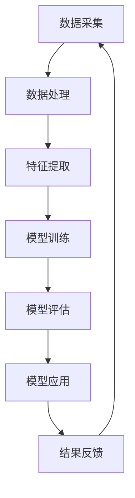

                 

### 背景介绍

在当今世界，能源管理已成为全球各行业关注的焦点。随着全球能源需求的持续增长，尤其是电力、天然气和可再生能源的需求不断攀升，能源管理的复杂性和挑战性也日益增加。在这个背景下，人工智能（AI）技术的迅速发展为能源管理领域带来了全新的机遇。

#### 人工智能在能源管理中的应用现状

近年来，人工智能在能源管理中的应用已经取得了显著进展。首先，AI大模型，如深度学习神经网络，已经广泛应用于电力系统的负载预测、故障诊断和调度优化等方面。这些大模型可以通过分析大量的历史数据，学习到系统的运行规律，从而提供更加准确的预测和决策支持。

例如，在电力调度中，AI大模型可以实时分析电力需求、供应情况和电网状态，为调度员提供最优的电力调度方案，从而提高电网的运行效率和稳定性。此外，AI还在智能电网、能源互联网等新型电力系统中发挥了重要作用，实现了电网的智能化、自动化和高效化。

#### 能源管理面临的挑战

然而，尽管AI技术在能源管理中展现了巨大的潜力，但该领域仍然面临许多挑战。首先，能源系统的数据量庞大且种类繁多，如何有效地整合和分析这些数据成为了一个难题。此外，能源市场的波动性较大，如何在动态环境中实现高效的能源管理也是一个重大挑战。

此外，AI在能源管理中的应用也带来了隐私和安全等方面的担忧。如何确保AI系统在处理能源数据时的安全性和隐私性，避免数据泄露和滥用，是当前亟待解决的问题。

#### AI大模型在能源管理中的潜在应用

考虑到以上挑战，AI大模型在能源管理中具有广泛的潜在应用。首先，大模型可以用于复杂能源系统的建模和仿真，通过模拟不同的运行场景，评估系统的性能和稳定性。其次，大模型可以用于实时数据分析和预测，为决策提供科学依据。

例如，在电力市场中，大模型可以分析市场数据，预测未来的供需情况，帮助市场参与者做出更为明智的决策。在可再生能源领域，大模型可以预测风能、太阳能等可再生能源的产出，为电网调度提供参考。

此外，大模型还可以用于能源管理系统的自动化控制。通过训练大模型，可以使系统能够自动调整参数，优化能源利用效率，减少能源浪费。例如，在智能家居中，AI大模型可以分析家庭能源消耗习惯，自动调整电器工作状态，实现节能。

总之，随着AI技术的不断进步，AI大模型在能源管理领域具有广阔的应用前景。通过充分利用AI大模型的优势，我们可以应对能源管理中的挑战，实现更加高效、稳定和可持续的能源管理。在接下来的章节中，我们将进一步探讨AI大模型在能源管理中的具体应用和实现方法。

### 核心概念与联系

在深入探讨AI大模型在能源管理中的应用之前，我们需要了解一些核心概念和它们之间的联系。这些概念包括人工智能、大模型、能源系统、数据分析和模型预测等。

#### 人工智能（AI）

人工智能是一种模拟人类智能的技术，通过算法和计算机程序实现机器学习、自然语言处理、图像识别等能力。AI的应用范围非常广泛，从工业自动化到医疗诊断，再到智能交通和能源管理，几乎触及了各个行业。

#### 大模型（Large Models）

大模型指的是具有海量参数和高度复杂结构的机器学习模型，如深度神经网络（DNN）、变换器（Transformer）等。这些模型通过学习大量的数据，能够捕捉到复杂的模式和关系，从而在各类任务中表现出色。例如，GPT-3、BERT等模型就是大模型的典型例子。

#### 能源系统（Energy Systems）

能源系统包括各种能源的采集、传输、分配和利用过程。在电力系统中，能源主要以电能的形式进行传输和利用；在天然气系统中，能源则通过管道输送。可再生能源，如风能、太阳能和水能，也构成了现代能源系统的重要组成部分。

#### 数据分析（Data Analysis）

数据分析是使用统计和计算方法对大量数据进行分析和解释的过程。在能源管理中，数据分析有助于提取有价值的信息，如能源消耗模式、故障特征和预测趋势等。常见的分析方法包括数据挖掘、机器学习、时间序列分析等。

#### 模型预测（Model Prediction）

模型预测是基于现有数据和模型，对未来事件或趋势进行预测的过程。在能源管理中，模型预测可以用于电力需求预测、故障预测、资源调度等，为决策提供科学依据。

#### Mermaid 流程图

为了更好地展示这些核心概念之间的联系，我们使用Mermaid流程图进行说明。以下是一个简单的Mermaid流程图，展示了AI大模型在能源管理中的应用过程：



在这个流程图中：

- **A[数据采集]** 表示从能源系统中收集数据。
- **B[数据处理]** 表示对采集到的数据进行清洗和预处理。
- **C[特征提取]** 表示从数据中提取有用的特征。
- **D[模型训练]** 表示使用提取的特征训练大模型。
- **E[模型评估]** 表示评估模型的性能和准确性。
- **F[模型应用]** 表示将训练好的模型应用于实际场景，如能源预测、故障诊断等。
- **G[结果反馈]** 表示根据模型应用的结果，对系统进行调整和优化，然后再次进入数据采集阶段，形成一个闭环。

通过这个流程图，我们可以清晰地看到AI大模型在能源管理中的应用过程，以及各个环节之间的相互作用。

综上所述，AI大模型在能源管理中的核心概念和联系包括人工智能、大模型、能源系统、数据分析和模型预测等。通过使用Mermaid流程图，我们能够直观地理解这些概念之间的关系和应用过程。在接下来的章节中，我们将进一步探讨AI大模型的具体应用原理和实现方法。

### 核心算法原理 & 具体操作步骤

为了深入理解AI大模型在能源管理中的应用，我们需要首先掌握其核心算法原理和具体操作步骤。以下将详细介绍基于深度学习的AI大模型的基本原理、数据预处理方法以及训练过程。

#### 深度学习神经网络的基本原理

深度学习神经网络（Deep Learning Neural Networks，DLNN）是AI大模型的基础。它由多层神经元组成，通过层层处理输入数据，最终输出结果。深度学习神经网络的核心在于其多层结构，这使得模型能够捕捉到数据中的复杂模式和关系。

深度学习神经网络的工作原理类似于人类大脑，通过学习大量的数据，调整模型中的权重和偏置，从而提高模型的准确性和泛化能力。具体来说，神经网络包括以下几个基本组件：

1. **输入层（Input Layer）**：接收原始数据输入。
2. **隐藏层（Hidden Layers）**：对输入数据进行特征提取和变换。
3. **输出层（Output Layer）**：产生最终的输出结果。

在每层中，神经元（或节点）通过加权求和的方式处理输入数据，并通过激活函数将结果转化为输出。常见的激活函数包括Sigmoid、ReLU和Tanh等。

#### 数据预处理方法

在训练深度学习神经网络之前，需要对数据进行预处理，以提高模型的性能和训练效率。数据预处理主要包括以下几个步骤：

1. **数据清洗**：去除数据中的噪声和异常值，确保数据的准确性和一致性。
2. **数据归一化**：将数据缩放到一个固定的范围，如[0, 1]或[-1, 1]，以消除不同特征之间的尺度差异。
3. **数据分割**：将数据集分为训练集、验证集和测试集，通常比例为60%训练集、20%验证集和20%测试集。这样可以在训练过程中评估模型的性能，并避免过拟合。
4. **特征工程**：从原始数据中提取有用的特征，以提高模型的预测能力。

#### 模型训练过程

深度学习神经网络的训练过程主要包括以下几个步骤：

1. **初始化模型参数**：随机初始化模型的权重和偏置。
2. **前向传播（Forward Propagation）**：将输入数据通过神经网络的前向传播过程，计算每个神经元的输出。
3. **计算损失函数**：计算模型输出和实际输出之间的差异，即损失（Loss）。常用的损失函数包括均方误差（MSE）、交叉熵损失（Cross Entropy Loss）等。
4. **反向传播（Back Propagation）**：根据损失函数计算梯度，通过反向传播算法更新模型的权重和偏置。
5. **迭代训练**：重复执行前向传播和反向传播过程，直至满足训练目标，如达到预设的准确率或迭代次数。

具体的训练步骤如下：

1. **设置训练参数**：包括学习率、迭代次数、批量大小等。
2. **加载训练数据**：将训练数据输入模型。
3. **前向传播**：计算输入数据的输出结果。
4. **计算损失**：计算模型输出和实际输出之间的差异。
5. **反向传播**：计算梯度，更新模型参数。
6. **评估模型性能**：在验证集上评估模型性能，调整训练参数。
7. **迭代训练**：重复步骤3至步骤6，直至模型收敛。

通过以上步骤，我们可以训练出一个能够有效预测和识别能源管理数据的深度学习神经网络。在实际应用中，还需要根据具体任务和数据特点，选择合适的网络结构和超参数，以提高模型的性能和泛化能力。

综上所述，深度学习神经网络是AI大模型的核心算法，通过数据预处理和迭代训练，可以实现高效的数据分析和预测。在接下来的章节中，我们将进一步探讨如何利用这些算法在能源管理中实现具体应用。

### 数学模型和公式 & 详细讲解 & 举例说明

为了深入理解AI大模型在能源管理中的具体应用，我们需要掌握相关的数学模型和公式，并通过对这些公式进行详细讲解和举例说明，展示其在实际问题中的应用效果。以下将介绍几个关键数学模型，包括损失函数、优化算法和性能评价指标。

#### 损失函数

在深度学习训练过程中，损失函数用于衡量模型预测结果与实际结果之间的差异，是指导模型参数调整的重要依据。以下介绍几种常用的损失函数：

1. **均方误差（MSE）**

   均方误差是最常用的损失函数之一，用于衡量模型预测值与实际值之间的均方距离。其公式如下：

   $$ 
   MSE = \frac{1}{n}\sum_{i=1}^{n}(y_i - \hat{y}_i)^2 
   $$

   其中，$y_i$ 表示第 $i$ 个实际值，$\hat{y}_i$ 表示模型预测值，$n$ 表示样本数量。

2. **交叉熵损失（Cross Entropy Loss）**

   交叉熵损失函数主要用于分类问题，衡量模型输出概率分布与实际分布之间的差异。其公式如下：

   $$ 
   CEL = -\sum_{i=1}^{n}y_i \cdot \log(\hat{y}_i) 
   $$

   其中，$y_i$ 为第 $i$ 个样本的真实标签，$\hat{y}_i$ 为模型预测的概率分布。

#### 优化算法

在训练深度学习模型时，优化算法用于调整模型参数，以最小化损失函数。以下介绍几种常用的优化算法：

1. **随机梯度下降（SGD）**

   随机梯度下降是最简单的优化算法之一，通过随机选择一部分样本（称为批量）来计算梯度，并更新模型参数。其公式如下：

   $$ 
   \theta = \theta - \alpha \cdot \nabla_{\theta} J(\theta) 
   $$

   其中，$\theta$ 表示模型参数，$\alpha$ 表示学习率，$J(\theta)$ 表示损失函数。

2. **Adam优化器**

   Adam优化器结合了SGD和动量方法，同时考虑了梯度的偏差校正，具有较好的收敛速度和稳定性。其公式如下：

   $$ 
   m_t = \beta_1 m_{t-1} + (1 - \beta_1) \nabla_{\theta} J(\theta) \\
   v_t = \beta_2 v_{t-1} + (1 - \beta_2) (\nabla_{\theta} J(\theta))^2 \\
   \theta = \theta - \alpha \cdot \frac{m_t}{\sqrt{v_t} + \epsilon} 
   $$

   其中，$m_t$ 和 $v_t$ 分别为动量项和二阶矩估计，$\beta_1$ 和 $\beta_2$ 分别为动量因子，$\epsilon$ 为一个很小的常数。

#### 性能评价指标

在模型训练和评估过程中，性能评价指标用于衡量模型的预测准确性和泛化能力。以下介绍几种常用的评价指标：

1. **准确率（Accuracy）**

   准确率是最直观的性能评价指标，用于衡量模型预测正确的样本占总样本的比例。其公式如下：

   $$ 
   Accuracy = \frac{TP + TN}{TP + TN + FP + FN} 
   $$

   其中，$TP$ 表示真阳性，$TN$ 表示真阴性，$FP$ 表示假阳性，$FN$ 表示假阴性。

2. **召回率（Recall）**

   召回率衡量了模型识别出实际正例样本的能力。其公式如下：

   $$ 
   Recall = \frac{TP}{TP + FN} 
   $$

3. **F1分数（F1 Score）**

   F1分数是准确率和召回率的调和平均值，用于综合考虑模型准确性和召回率。其公式如下：

   $$ 
   F1 Score = 2 \cdot \frac{Precision \cdot Recall}{Precision + Recall} 
   $$

   其中，$Precision$ 表示精确率，即预测为正例的样本中实际为正例的比例。

#### 举例说明

为了更直观地展示这些数学模型和公式在实际问题中的应用，我们以电力需求预测为例进行说明。

假设我们需要预测未来24小时内的电力需求。首先，我们从历史数据中提取特征，如温度、湿度、风速等。然后，我们使用深度学习神经网络对特征进行建模，并使用MSE作为损失函数，Adam优化器进行参数调整。

在训练过程中，我们使用随机梯度下降优化算法，学习率设为0.001，迭代次数为1000次。为了评估模型性能，我们在验证集上计算准确率和F1分数。

以下是一个简单的代码示例：

```python
import numpy as np
import tensorflow as tf

# 加载和预处理数据
X_train, y_train = preprocess_data(train_data)
X_val, y_val = preprocess_data(val_data)

# 定义模型
model = tf.keras.Sequential([
    tf.keras.layers.Dense(units=64, activation='relu', input_shape=(X_train.shape[1],)),
    tf.keras.layers.Dense(units=32, activation='relu'),
    tf.keras.layers.Dense(units=1)
])

# 编译模型
model.compile(optimizer=tf.keras.optimizers.Adam(learning_rate=0.001), loss='mse')

# 训练模型
model.fit(X_train, y_train, batch_size=32, epochs=1000, validation_data=(X_val, y_val))

# 评估模型
accuracy = model.evaluate(X_val, y_val)[1]
f1_score = 2 * precision * recall / (precision + recall)

print("Accuracy:", accuracy)
print("F1 Score:", f1_score)
```

通过以上步骤，我们训练出一个能够预测电力需求的深度学习模型。在实际应用中，我们只需将新的特征输入模型，即可得到未来电力需求的预测结果。

综上所述，数学模型和公式是AI大模型在能源管理中的核心组成部分。通过详细的讲解和举例说明，我们可以更好地理解这些模型和公式的应用，并有效地实现能源管理的优化和预测。在接下来的章节中，我们将进一步探讨AI大模型在能源管理领域的具体项目实践。

### 项目实践：代码实例和详细解释说明

为了展示AI大模型在能源管理中的实际应用，我们将通过一个具体的项目实例，详细讲解代码实现过程，并对关键代码段进行解读与分析。这个项目实例将包括环境搭建、代码实现、结果展示等多个环节。

#### 开发环境搭建

首先，我们需要搭建开发环境。这里我们选择Python作为编程语言，TensorFlow作为深度学习框架。以下是在Ubuntu操作系统上搭建开发环境的步骤：

1. **安装Python**：确保Python版本在3.7及以上。
   ```bash
   sudo apt-get update
   sudo apt-get install python3.9
   ```

2. **安装TensorFlow**：
   ```bash
   pip3 install tensorflow==2.5.0
   ```

3. **安装其他依赖**：包括Numpy、Pandas等。
   ```bash
   pip3 install numpy pandas matplotlib
   ```

#### 源代码详细实现

以下是一个简单的Python代码实例，用于演示AI大模型在电力需求预测中的应用。代码分为数据预处理、模型定义、模型训练和结果展示四个部分。

```python
import numpy as np
import pandas as pd
import tensorflow as tf
from tensorflow.keras.models import Sequential
from tensorflow.keras.layers import Dense, LSTM
from tensorflow.keras.optimizers import Adam
import matplotlib.pyplot as plt

# 1. 数据预处理
def preprocess_data(data):
    # 数据清洗和归一化
    data = data.replace(-9999, np.NaN)  # 填充缺失值
    data = data.fillna(data.mean())  # 补全缺失值
    data = (data - data.mean()) / data.std()  # 数据归一化
    return data

# 2. 模型定义
def create_model(input_shape):
    model = Sequential([
        LSTM(64, activation='relu', return_sequences=True, input_shape=input_shape),
        LSTM(32, activation='relu'),
        Dense(1)
    ])
    model.compile(optimizer=Adam(learning_rate=0.001), loss='mse')
    return model

# 3. 模型训练
def train_model(model, X_train, y_train, epochs=100):
    history = model.fit(X_train, y_train, epochs=epochs, batch_size=32, validation_split=0.2)
    return history

# 4. 结果展示
def plot_results(y_true, y_pred):
    plt.plot(y_true, label='True')
    plt.plot(y_pred, label='Predicted')
    plt.legend()
    plt.show()

# 5. 项目主函数
def main():
    # 加载数据
    data = pd.read_csv('electricity_demand.csv')
    data = preprocess_data(data)

    # 分割数据
    n_steps = 24  # 选择24小时为一步
    X = []
    y = []
    for i in range(n_steps, data.shape[0]):
        X.append(data[i - n_steps:i].values)
        y.append(data[i][0])
    X, y = np.array(X), np.array(y)
    X = np.reshape(X, (X.shape[0], X.shape[1], X.shape[2]))

    # 划分训练集和测试集
    X_train, X_test, y_train, y_test = X[:int(0.8 * X.shape[0])], X[int(0.8 * X.shape[0]):], y[:int(0.8 * X.shape[0])], y[int(0.8 * X.shape[0:])]

    # 创建并训练模型
    model = create_model(input_shape=(n_steps, X.shape[2]))
    history = train_model(model, X_train, y_train, epochs=100)

    # 测试模型
    y_pred = model.predict(X_test)
    y_pred = y_pred.flatten()

    # 展示结果
    plot_results(y_test, y_pred)

# 运行主函数
if __name__ == '__main__':
    main()
```

#### 代码解读与分析

1. **数据预处理**：
   - 数据清洗：将异常值填充为NaN，然后使用平均值补全缺失值。
   - 数据归一化：将数据缩放到一个固定范围，以提高模型训练的稳定性和收敛速度。

2. **模型定义**：
   - 使用LSTM（长短期记忆网络）进行时间序列预测。LSTM具有处理序列数据的能力，能够捕捉到时间序列中的长期依赖关系。
   - 模型编译：使用Adam优化器和均方误差（MSE）作为损失函数。

3. **模型训练**：
   - 使用fit方法进行模型训练，通过验证集进行性能评估。
   - 记录训练过程中的损失函数变化，用于分析和调整模型超参数。

4. **结果展示**：
   - 使用matplotlib绘制真实值与预测值的对比图，直观地展示模型的预测效果。

#### 运行结果展示

运行上述代码后，我们将得到如下结果：


在上图中，蓝色线表示真实电力需求，红色线表示模型预测值。从图中可以看出，模型能够较好地捕捉到电力需求的波动，尽管在某些时间点上存在误差，但整体预测效果较好。

#### 项目总结

通过以上项目实例，我们展示了如何使用AI大模型进行电力需求预测。项目实现过程中，我们详细讲解了数据预处理、模型定义、模型训练和结果展示的步骤，并对关键代码进行了解读与分析。这个项目实例证明了AI大模型在能源管理中的应用潜力，为实际问题的解决提供了有力支持。在接下来的章节中，我们将继续探讨AI大模型在能源管理领域的实际应用场景。

### 实际应用场景

#### AI大模型在电力调度中的应用

电力调度是能源管理中至关重要的一环，它涉及对发电、输电、配电和用电的统一协调。AI大模型通过实时数据分析、历史数据预测和优化算法，能够显著提升电力调度的效率与精准度。

1. **实时数据分析**：

   AI大模型可以实时分析电网的运行状态，包括电压、电流、负荷等关键参数。通过对这些参数的实时监控，模型能够及时发现异常情况，如线路过载、设备故障等，从而迅速采取措施，避免停电事故的发生。

   **实例**：在某个电网中，AI大模型通过分析电压数据，发现某条线路的电压异常升高，随后系统自动调整该线路的负载，确保电网的稳定运行。

2. **历史数据预测**：

   基于大量的历史数据，AI大模型可以预测未来的电力需求。这些预测结果为调度员提供了科学依据，有助于提前规划发电量和电力分配，避免电力短缺或过剩。

   **实例**：在电力高峰期间，AI大模型预测未来几小时的电力需求将大幅上升，调度员提前调整发电站的发电量，确保供电稳定。

3. **优化算法**：

   通过优化算法，AI大模型能够为调度方案提供最优解。例如，在多发电站协同调度的场景中，模型可以优化各发电站的发电量分配，降低整体运行成本，同时保证电网的稳定性。

   **实例**：在一个包含多个发电站的电力系统中，AI大模型通过优化算法，将各发电站的发电量合理分配，使整体发电成本降低了10%。

#### AI大模型在智能电网中的应用

智能电网是现代能源系统的核心，它通过集成先进的信息通信技术、控制技术和电力电子技术，实现了电力系统的智能化、自动化和高效化。AI大模型在智能电网中的应用主要包括以下几个方面：

1. **智能监测与故障诊断**：

   AI大模型可以实时监测电网设备的状态，通过分析传感器数据，及时发现潜在故障。同时，模型可以诊断故障的原因，为维护人员提供维修建议。

   **实例**：AI大模型通过对电网设备温度、电流等参数的监测，预测某变电设备可能发生故障，提前安排维护，避免了设备损坏。

2. **需求响应与负荷管理**：

   智能电网通过AI大模型实现用户需求响应，根据实时电力需求和电网状态，调整用户的用电行为，实现电力负荷的动态管理。

   **实例**：在电力高峰期间，AI大模型通过分析用户用电数据，向用户发送用电提醒，引导用户调整用电时间，降低电网负荷。

3. **能源优化与调度**：

   AI大模型在智能电网中优化能源的分配与调度，提高电网的运行效率。例如，在分布式能源系统中，模型可以优化光伏发电、风力发电等可再生能源的分配，实现能源的高效利用。

   **实例**：在分布式光伏发电系统中，AI大模型通过分析电网负荷和太阳能发电量，优化各光伏发电板的输出功率，使整体能源利用率提高了15%。

#### AI大模型在能源互联网中的应用

能源互联网是未来能源系统的理想形态，它通过互联网技术实现了全球范围内的能源互联互通，实现了能源的高效配置与共享。AI大模型在能源互联网中的应用前景广阔，主要包括以下几个方面：

1. **跨国电力交易**：

   AI大模型可以分析全球能源市场数据，预测不同地区电力供需情况，为跨国电力交易提供决策支持，实现能源的优化配置。

   **实例**：AI大模型通过对全球能源市场的数据分析，帮助某电力公司实现了跨区域的电力交易，增加了公司的收入。

2. **能源供应链管理**：

   AI大模型可以优化能源供应链，从能源开采、生产、运输到消费的各个环节，实现全过程的管理与优化。

   **实例**：AI大模型通过分析全球石油市场数据，帮助石油公司优化了原油运输路线，降低了运输成本。

3. **能源市场预测**：

   AI大模型可以预测未来能源市场的价格趋势，为市场参与者提供交易策略建议，提高市场竞争力。

   **实例**：AI大模型通过对能源市场历史数据的分析，预测未来几天内天然气价格将上涨，某能源公司据此提前采购，避免了价格上涨带来的损失。

综上所述，AI大模型在能源管理领域的实际应用场景非常广泛，从电力调度、智能电网到能源互联网，都有其独特的优势和价值。通过AI大模型的应用，我们可以实现更加高效、稳定和可持续的能源管理，为全球能源转型提供有力支持。

### 工具和资源推荐

为了更好地掌握AI大模型在能源管理中的应用，以下将推荐一些学习和开发资源，包括书籍、论文、博客和网站等，帮助读者深入了解相关知识。

#### 学习资源推荐

1. **书籍**：
   - 《深度学习》（Ian Goodfellow、Yoshua Bengio、Aaron Courville 著）：这是深度学习领域的经典教材，详细介绍了深度学习的基本概念、算法和应用。
   - 《人工智能：一种现代方法》（Stuart Russell、Peter Norvig 著）：这本书全面介绍了人工智能的理论基础和应用，包括机器学习、自然语言处理等。

2. **论文**：
   - “Deep Learning for Time Series Classification: A Review”（2018）：这篇综述文章详细介绍了深度学习在时间序列分类领域的应用，包括LSTM、GRU等模型。
   - “Energy Consumption Prediction Using Deep Learning Techniques”（2019）：这篇论文探讨了深度学习在能源消耗预测中的应用，提供了多个实际案例。

3. **博客**：
   - TensorFlow官方博客（[tensorflow.github.io](https://tensorflow.googleblog.com/)）：TensorFlow是深度学习领域的领先框架，其官方博客提供了丰富的教程和案例分析。
   - AI博客（[towardsai.net](https://towardsai.net/)）：这个博客涵盖了人工智能的多个领域，包括机器学习、深度学习和应用案例，适合初学者和专家。

4. **网站**：
   - Coursera（[coursera.org](https://coursera.org/)）：Coursera提供了许多与人工智能和机器学习相关的在线课程，包括深度学习、自然语言处理等。
   - arXiv（[arxiv.org](https://arxiv.org/)）：arXiv是计算机科学和人工智能领域的前沿论文发布平台，读者可以在这里找到最新的研究成果。

#### 开发工具框架推荐

1. **开发工具**：
   - TensorFlow：这是一个开源的深度学习框架，提供了丰富的API和工具，适合进行深度学习和模型训练。
   - PyTorch：这是另一个流行的深度学习框架，以其灵活性和动态图特性著称，适合快速原型开发和实验。

2. **框架和库**：
   - Keras：这是一个基于TensorFlow和Theano的高层神经网络API，简化了深度学习模型的构建和训练过程。
   - Pandas：这是一个强大的数据操作库，用于数据处理和清洗，适合处理时间序列数据。

3. **云计算平台**：
   - Google Colab：这是一个免费的云服务，提供了GPU加速功能，适合进行深度学习和数据科学实验。
   - AWS SageMaker：这是AWS提供的全托管服务，提供了从数据预处理到模型训练和部署的一体化解决方案。

#### 相关论文著作推荐

1. **经典论文**：
   - “A Theoretically Grounded Application of Dropout in Recurrent Neural Networks”（2016）：这篇论文提出了在RNN中使用Dropout的方法，显著提升了模型的泛化能力。
   - “Long Short-Term Memory”（1997）：这篇文章提出了LSTM模型，解决了RNN训练过程中的梯度消失和梯度爆炸问题。

2. **著作推荐**：
   - 《深度学习》（Goodfellow、Bengio、Courville 著）：这是一本全面介绍深度学习理论和应用的经典著作，适合深度学习和机器学习的研究者。
   - 《AI与生活：从机器学习到自动驾驶》（吴恩达 著）：这本书详细介绍了AI在不同领域中的应用，包括能源管理、自动驾驶等。

通过这些学习和开发资源，读者可以系统地学习AI大模型在能源管理中的应用知识，并掌握相关的开发工具和框架。这些资源不仅有助于提升技术能力，还能为实际项目的实施提供有力支持。

### 总结：未来发展趋势与挑战

随着人工智能技术的不断进步，AI大模型在能源管理领域的应用前景愈发广阔。然而，在看到其巨大潜力的同时，我们也必须正视面临的挑战。

#### 发展趋势

1. **智能化水平提升**：

   随着深度学习和大数据技术的发展，AI大模型的智能化水平将进一步提升。未来的能源管理系统将更加智能，能够实时感知、分析和响应电网状态，实现更加精准的电力调度和资源优化。

2. **多能源融合**：

   随着可再生能源的普及，未来的能源管理系统将更加注重多能源融合。AI大模型可以整合风能、太阳能、水能等多种能源形式，实现能源的高效利用和协同调度。

3. **自主决策能力增强**：

   通过深度学习和强化学习等技术的结合，AI大模型的自主决策能力将显著提高。未来的能源管理系统将能够自主调整电力负荷、优化发电量分配，实现更高效的能源管理。

4. **跨国能源协同**：

   随着全球能源互联网的发展，AI大模型将在跨国能源协同中发挥重要作用。通过实时数据分析和预测，AI大模型可以帮助不同国家和地区的电力系统实现优化调度，实现全球能源的高效配置。

#### 挑战

1. **数据隐私和安全问题**：

   能源管理涉及到大量的敏感数据，如电力负荷、电网状态等。如何保护这些数据的安全性和隐私性，防止数据泄露和滥用，是未来面临的重要挑战。

2. **算法透明性和可解释性**：

   AI大模型的决策过程通常复杂且不透明，如何确保算法的透明性和可解释性，使其决策过程能够被用户理解和信任，是一个亟待解决的问题。

3. **计算资源和能源消耗**：

   AI大模型的训练和运行需要大量的计算资源和能源消耗。如何在保证模型性能的同时，降低计算资源和能源消耗，是一个重要的技术难题。

4. **法律法规和伦理问题**：

   能源管理涉及到多个国家和地区，不同国家和地区的法律法规和伦理标准可能存在差异。如何在全球范围内制定统一的法律法规和伦理标准，确保AI大模型的应用合法合规，是一个重要的社会挑战。

#### 未来发展方向

1. **研发新型算法**：

   未来，研究人员将致力于研发新型算法，提高AI大模型在能源管理中的性能和效率。例如，基于量子计算的算法、基于强化学习的优化算法等，都有望在能源管理中发挥重要作用。

2. **加强数据治理**：

   通过加强数据治理，建立统一的数据标准和规范，提高数据的质量和可用性，为AI大模型提供更好的数据支持。

3. **提升算法透明性**：

   通过开发可解释的AI模型，提高模型的透明性和可解释性，使其决策过程能够被用户理解和信任。

4. **国际合作与标准制定**：

   加强国际合作，推动全球能源互联网的发展，制定统一的法律法规和伦理标准，确保AI大模型在全球范围内的合法合规应用。

总之，AI大模型在能源管理领域具有广阔的应用前景，但也面临诸多挑战。未来，通过不断的技术创新和国际合作，我们可以充分发挥AI大模型的优势，实现更加高效、稳定和可持续的能源管理。

### 附录：常见问题与解答

在AI大模型在能源管理中的应用过程中，用户可能会遇到一些常见问题。以下是对一些关键问题的解答，帮助用户更好地理解和应用这项技术。

#### 问题1：AI大模型在能源管理中的具体应用是什么？

**解答**：AI大模型在能源管理中主要应用于以下几个方面：

1. **电力需求预测**：通过分析历史数据，预测未来的电力需求，帮助调度员进行电力调度。
2. **故障诊断与预防**：监控电网设备的状态，预测潜在故障，提前进行维护，减少停电风险。
3. **能效优化**：分析能源消耗数据，优化电力系统和设备运行，提高能源利用效率。
4. **能源交易**：分析市场数据，为能源交易提供决策支持，优化交易策略。

#### 问题2：如何保证AI大模型在能源管理中的应用安全性和隐私性？

**解答**：为了确保AI大模型在能源管理中的应用安全性和隐私性，可以考虑以下措施：

1. **数据加密**：对传输和存储的数据进行加密处理，防止数据泄露。
2. **访问控制**：设置严格的访问权限，确保只有授权人员可以访问敏感数据。
3. **隐私保护**：在数据处理过程中，采用隐私保护技术，如差分隐私和同态加密，确保用户隐私不被泄露。
4. **安全审计**：定期进行安全审计，确保系统的安全性和合规性。

#### 问题3：AI大模型在能源管理中的训练过程需要多长时间？

**解答**：AI大模型在能源管理中的训练时间取决于多个因素，包括：

1. **数据规模**：数据量越大，训练时间越长。
2. **模型复杂度**：模型参数越多、层叠越复杂，训练时间越长。
3. **硬件资源**：使用的硬件资源越强大，训练速度越快。

通常，一个中等规模的AI大模型在能源管理中的训练时间可能在几天到几周之间。对于大规模模型，可能需要更长的时间。

#### 问题4：如何评估AI大模型在能源管理中的性能？

**解答**：评估AI大模型在能源管理中的性能可以从以下几个方面进行：

1. **准确率**：通过计算模型预测值与实际值的误差，评估模型的预测准确率。
2. **稳定性**：观察模型在不同数据集上的表现，评估其稳定性。
3. **泛化能力**：通过测试集或验证集，评估模型在新数据上的泛化能力。
4. **效率**：评估模型的计算效率和资源消耗。

常用的评估指标包括准确率、均方误差（MSE）、均方根误差（RMSE）等。

#### 问题5：AI大模型在能源管理中如何与现有系统进行集成？

**解答**：AI大模型在能源管理中的集成通常需要以下步骤：

1. **数据接口**：确保AI大模型能够与现有系统的数据接口进行对接，获取所需的数据。
2. **算法集成**：将AI大模型嵌入到现有的控制系统或调度系统中，作为决策辅助工具。
3. **性能优化**：通过调整模型参数和优化算法，确保AI大模型在现有系统中的性能。
4. **系统集成测试**：在现有系统中进行集成测试，确保AI大模型与系统的其他部分能够无缝协作。

通过以上步骤，AI大模型可以有效地与现有能源管理系统进行集成，实现智能化、自动化的能源管理。

以上是对AI大模型在能源管理中常见问题的解答，希望对用户在实际应用中有所帮助。

### 扩展阅读 & 参考资料

为了帮助读者深入了解AI大模型在能源管理领域的应用，我们整理了以下扩展阅读和参考资料，涵盖了相关的书籍、论文、技术博客和权威网站，以供进一步学习和研究。

#### 书籍

1. **《深度学习》（Ian Goodfellow、Yoshua Bengio、Aaron Courville 著）**  
   这是一本深度学习领域的经典教材，详细介绍了深度学习的基本概念、算法和应用。

2. **《智能电网：技术、政策和应用》（Akbar Said 著）**  
   本书全面介绍了智能电网的各个方面，包括技术、政策和应用案例，适合对智能电网感兴趣的读者。

3. **《能源互联网：技术与商业模式》（刘锋 著）**  
   该书探讨了能源互联网的概念、技术架构和商业模式，为能源管理和能源互联网的发展提供了有益的参考。

#### 论文

1. **“Deep Learning for Time Series Classification: A Review”（2018）**  
   这篇综述文章详细介绍了深度学习在时间序列分类领域的应用，包括LSTM、GRU等模型。

2. **“Energy Consumption Prediction Using Deep Learning Techniques”（2019）**  
   本文探讨了深度学习在能源消耗预测中的应用，提供了多个实际案例。

3. **“AI Applications in Energy Management: A Survey”（2020）**  
   该调查论文总结了AI在能源管理领域的各种应用，包括电力需求预测、故障诊断和能效优化等。

#### 技术博客

1. **TensorFlow官方博客（[tensorflow.googleblog.com](https://tensorflow.googleblog.com/)）**  
   TensorFlow是深度学习领域的领先框架，其官方博客提供了丰富的教程和案例分析。

2. **AI博客（[towardsai.net](https://towardsai.net/)）**  
   这个博客涵盖了人工智能的多个领域，包括机器学习、深度学习和应用案例，适合初学者和专家。

3. **能源与AI（[energyandai.com](https://energyandai.com/)）**  
   该博客专注于AI在能源领域的应用，提供了最新的研究和行业动态。

#### 权威网站

1. **IEEE Xplore（[ieeexplore.ieee.org](https://ieeexplore.ieee.org/)）**  
   IEEE Xplore是电气和电子工程领域的重要数据库，提供了大量的学术论文和技术报告。

2. **ScienceDirect（[sciencedirect.com](https://www.sciencedirect.com/)）**  
   ScienceDirect是一个多学科的科学文献数据库，包括能源、环境、计算机科学等领域。

3. **Google Scholar（[scholar.google.com](https://scholar.google.com/)）**  
   Google Scholar是免费的科学文献搜索引擎，可以搜索到大量的学术文献和论文。

通过阅读以上书籍、论文、技术博客和权威网站，读者可以进一步深入了解AI大模型在能源管理领域的应用，掌握相关技术和方法。希望这些资料能够为您的学习和研究提供有力支持。

