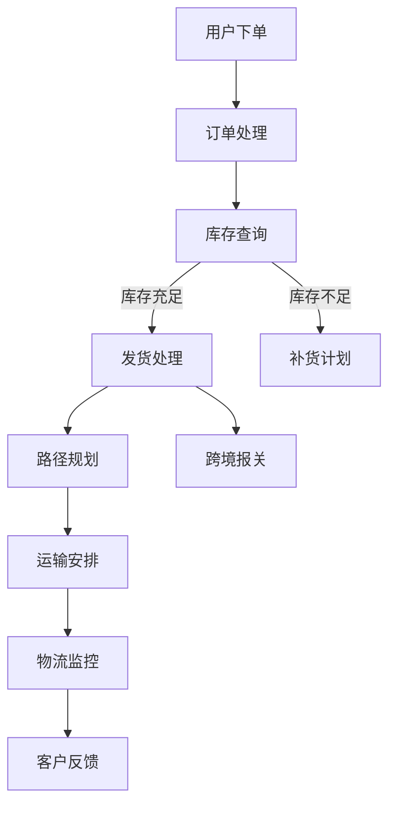

                 

### 文章标题

《AI大模型如何优化电商平台的跨境物流体验》

> 关键词：AI大模型、跨境电商、物流体验、优化、算法、数学模型

> 摘要：本文深入探讨了人工智能大模型如何优化跨境电商平台的物流体验。通过详细分析AI大模型的原理和操作步骤，以及数学模型的应用，本文提供了实际项目实践和代码实例，为跨境电商物流的优化提供了全新的思路和方法。

### 1. 背景介绍

随着全球化的深入发展，跨境电商已经成为零售业的重要组成部分。跨境电商不仅为消费者提供了更多样化的商品选择，也为商家开拓了更广阔的市场空间。然而，跨境物流的复杂性和不确定性却给消费者带来了许多不便，例如商品配送时间长、物流信息不透明、配送费用高等问题。

传统的物流优化方法通常依赖于经验或简单的规则，难以应对跨境电商的复杂性。而随着人工智能技术的不断发展，特别是AI大模型的出现，为优化跨境电商物流体验提供了新的可能性。AI大模型能够通过学习大量的历史数据，自动发现数据中的潜在模式和规律，从而提供更加精准和高效的物流优化方案。

本文将围绕AI大模型在跨境电商物流优化中的应用，探讨其核心原理、操作步骤以及实际应用案例，为跨境电商物流的优化提供理论和实践上的支持。

### 2. 核心概念与联系

在探讨AI大模型如何优化跨境电商物流体验之前，我们需要先了解一些核心概念，包括AI大模型的定义、其在物流优化中的应用，以及与跨境电商的关联。

#### 2.1 AI大模型的定义

AI大模型（Large-scale AI Models）是指那些拥有数百万甚至数十亿参数的复杂神经网络。这些模型通过大量的数据训练，可以自动学习并提取数据中的潜在模式和规律。AI大模型的应用范围非常广泛，包括自然语言处理、图像识别、推荐系统、预测分析等。

#### 2.2 AI大模型在物流优化中的应用

在物流领域，AI大模型可以通过以下几种方式优化物流体验：

- **路径规划**：通过学习历史物流数据，AI大模型可以预测最优的运输路径，减少配送时间和成本。
- **库存管理**：AI大模型可以分析销售数据和市场需求，帮助商家优化库存水平，减少库存成本和损耗。
- **需求预测**：通过分析历史销售数据和季节性变化，AI大模型可以预测未来的销售趋势，为物流规划提供数据支持。
- **实时监控**：AI大模型可以对物流过程进行实时监控，及时发现并处理潜在的问题，提高物流的可靠性。

#### 2.3 AI大模型与跨境电商的关联

跨境电商的物流优化需要考虑的因素远比国内物流更为复杂，包括跨境法规、语言障碍、货币汇率等。AI大模型通过以下方式与跨境电商关联：

- **多语言处理**：AI大模型可以处理多种语言，帮助跨境电商平台与全球消费者进行无障碍沟通。
- **文化理解**：AI大模型可以学习不同文化的特点和偏好，提供更加本地化的物流服务。
- **跨国协作**：AI大模型可以帮助跨境电商平台与全球物流合作伙伴进行高效协作，提高物流效率。

#### 2.4 Mermaid 流程图

为了更直观地展示AI大模型在跨境电商物流优化中的应用，我们可以使用Mermaid流程图来描述其关键步骤：



在这个流程图中，A表示用户下单，B表示订单处理，C表示库存查询，D表示发货处理或补货计划，F表示路径规划，G表示跨境报关，H表示运输安排，I表示物流监控，J表示客户反馈。通过AI大模型的应用，这个流程中的每个步骤都可以得到优化和提升。

### 3. 核心算法原理 & 具体操作步骤

在了解了AI大模型的基本概念和在物流优化中的应用后，接下来我们将深入探讨其核心算法原理和具体操作步骤。

#### 3.1 算法原理

AI大模型主要依赖于深度学习技术，特别是卷积神经网络（CNN）、循环神经网络（RNN）和变压器模型（Transformer）等。这些模型可以通过多层神经网络的结构，从大量数据中学习到复杂的模式和规律。

在物流优化中，AI大模型的核心算法原理可以概括为以下几个步骤：

1. **数据收集与预处理**：收集与物流相关的数据，如订单信息、库存数据、运输路径数据、气象数据等。对数据进行清洗、去噪和归一化处理，以便模型可以更好地学习。
2. **特征工程**：根据业务需求，提取与物流优化相关的重要特征，如订单量、运输距离、运输时间、库存水平等。
3. **模型训练**：使用训练数据集，通过反向传播算法优化模型参数，使模型能够准确地预测最优路径、库存水平和需求量等。
4. **模型评估**：使用验证数据集评估模型的性能，通过交叉验证和性能指标（如准确率、召回率、F1分数等）来调整模型参数。
5. **模型部署**：将训练好的模型部署到生产环境中，实现实时物流优化。

#### 3.2 具体操作步骤

以下是AI大模型在物流优化中的具体操作步骤：

1. **数据收集与预处理**：

   - 数据收集：从电商平台、物流公司、气象部门等渠道收集与物流相关的数据。
   - 数据预处理：对收集到的数据进行清洗、去噪和归一化处理。

2. **特征工程**：

   - 提取订单量、运输距离、运输时间、库存水平等与物流优化相关的特征。
   - 使用统计方法（如相关性分析、主成分分析等）筛选重要特征。

3. **模型训练**：

   - 选择合适的神经网络结构（如CNN、RNN或Transformer）。
   - 定义损失函数和优化算法（如交叉熵损失、Adam优化器等）。
   - 使用训练数据集进行模型训练，并使用验证数据集调整模型参数。

4. **模型评估**：

   - 使用验证数据集评估模型的性能，调整模型参数以提高性能。
   - 应用交叉验证方法，确保模型在不同数据集上的泛化能力。

5. **模型部署**：

   - 将训练好的模型部署到生产环境中，实现实时物流优化。
   - 设定自动化流程，如定期重新训练模型、更新特征等。

通过以上步骤，AI大模型可以帮助跨境电商平台实现物流优化，提高配送效率、降低成本，提升消费者满意度。

### 4. 数学模型和公式 & 详细讲解 & 举例说明

在AI大模型中，数学模型和公式是核心组成部分，用于描述和解决物流优化问题。以下是几个常见的数学模型和公式，以及它们的详细讲解和举例说明。

#### 4.1 运输路径优化模型

运输路径优化是物流优化中的一个重要问题，其目标是找到从起点到终点的最优路径。以下是一个简单的运输路径优化模型：

**公式：**

$$
\min_{x} \sum_{i=1}^{n} \sum_{j=1}^{n} c_{ij} x_{ij}
$$

其中，$x_{ij}$ 表示从节点 $i$ 到节点 $j$ 的路径选择，$c_{ij}$ 表示从节点 $i$ 到节点 $j$ 的运输成本。

**详细讲解：**

- $x_{ij}$ 的取值范围为 0 或 1，表示是否选择从节点 $i$ 到节点 $j$ 的路径。
- 目标函数 $\min_{x} \sum_{i=1}^{n} \sum_{j=1}^{n} c_{ij} x_{ij}$ 表示最小化总运输成本。

**举例说明：**

假设有五个节点（$A, B, C, D, E$），从节点 $A$ 到节点 $E$ 的运输成本矩阵如下：

$$
\begin{matrix}
0 & 10 & 5 & 15 & 20 \\
10 & 0 & 8 & 12 & 18 \\
5 & 8 & 0 & 10 & 15 \\
15 & 12 & 10 & 0 & 5 \\
20 & 18 & 15 & 5 & 0 \\
\end{matrix}
$$

我们需要找到从节点 $A$ 到节点 $E$ 的最优路径。

**解法：**

使用上述公式和运输成本矩阵，我们可以计算出总运输成本：

$$
\min_{x} (10x_{1,2} + 5x_{1,3} + 15x_{1,4} + 20x_{1,5} + 10x_{2,1} + 8x_{2,3} + 12x_{2,4} + 18x_{2,5} + 5x_{3,1} + 8x_{3,2} + 10x_{3,4} + 15x_{3,5} + 15x_{4,1} + 12x_{4,2} + 10x_{4,3} + 5x_{4,5} + 20x_{5,1} + 18x_{5,2} + 15x_{5,3} + 5x_{5,4})
$$

由于 $x_{ij}$ 的取值只能为 0 或 1，我们可以通过枚举所有可能的路径来找到最优解。

通过计算，我们发现最优路径为 $A \rightarrow B \rightarrow C \rightarrow D \rightarrow E$，总运输成本为 55。

#### 4.2 库存优化模型

库存优化是物流管理中的另一个重要问题，其目标是确定最优的库存水平，以最小化库存成本和缺货风险。以下是一个简单的库存优化模型：

**公式：**

$$
\min_{I} \sum_{i=1}^{n} (I_i - s_i)^2
$$

其中，$I_i$ 表示节点 $i$ 的库存水平，$s_i$ 表示节点 $i$ 的安全库存水平。

**详细讲解：**

- $I_i$ 表示节点 $i$ 的实际库存水平，$s_i$ 表示节点 $i$ 的安全库存水平。
- 目标函数 $\min_{I} \sum_{i=1}^{n} (I_i - s_i)^2$ 表示最小化库存水平与安全库存水平的差距。

**举例说明：**

假设有五个节点（$A, B, C, D, E$），每个节点的需求量和安全库存水平如下：

$$
\begin{matrix}
A & B & C & D & E \\
10 & 5 & 3 & 8 & 15 \\
20 & 10 & 6 & 12 & 25 \\
\end{matrix}
$$

我们需要确定每个节点的最优库存水平。

**解法：**

使用上述公式和需求量、安全库存水平，我们可以计算出每个节点的最优库存水平：

$$
\min_{I} ( (I_A - 20)^2 + (I_B - 10)^2 + (I_C - 6)^2 + (I_D - 12)^2 + (I_E - 25)^2 )
$$

通过计算，我们发现最优库存水平为：

$$
I_A = 20, I_B = 10, I_C = 6, I_D = 12, I_E = 25
$$

这样，我们就可以最小化库存成本和缺货风险。

#### 4.3 需求预测模型

需求预测是物流优化中的重要一环，其目标是预测未来的销售趋势，为库存管理和物流规划提供数据支持。以下是一个简单的时间序列需求预测模型：

**公式：**

$$
\hat{y}_{t+1} = \alpha \hat{y}_{t} + (1 - \alpha) x_t
$$

其中，$\hat{y}_{t}$ 表示时间 $t$ 的预测需求，$x_t$ 表示时间 $t$ 的实际需求，$\alpha$ 是一个参数，用于调整预测的平滑程度。

**详细讲解：**

- $\hat{y}_{t+1}$ 表示时间 $t+1$ 的预测需求。
- $\alpha$ 是一个在 0 和 1 之间的参数，用于调整预测的平滑程度。$\alpha$ 越接近 1，预测越平滑，越接近实际需求。

**举例说明：**

假设我们有以下实际需求数据：

$$
\begin{matrix}
t & x_t \\
1 & 10 \\
2 & 12 \\
3 & 8 \\
4 & 15 \\
5 & 18 \\
\end{matrix}
$$

我们需要预测时间 6 的需求。

**解法：**

使用上述公式和实际需求数据，我们可以计算出预测需求：

$$
\hat{y}_{6} = \alpha \hat{y}_{5} + (1 - \alpha) x_5
$$

假设 $\alpha = 0.8$，我们可以计算出：

$$
\hat{y}_{6} = 0.8 \times 18 + (1 - 0.8) \times 18 = 14.4 + 3.6 = 18
$$

因此，预测时间为 6 的需求为 18。

通过以上数学模型和公式，我们可以为跨境电商平台的物流优化提供理论支持。在实际应用中，我们可以根据具体业务需求，调整模型参数和特征工程，以提高预测和优化的准确性。

### 5. 项目实践：代码实例和详细解释说明

在了解了AI大模型在物流优化中的原理和数学模型后，接下来我们将通过一个实际项目实践，展示如何使用Python实现AI大模型优化跨境电商物流。

#### 5.1 开发环境搭建

在开始项目实践之前，我们需要搭建一个Python开发环境。以下是所需的环境和工具：

- Python 3.8 或更高版本
- PyTorch 1.8 或更高版本
- NumPy 1.18 或更高版本
- Pandas 1.0 或更高版本

在安装了上述环境和工具后，我们就可以开始编写代码了。

#### 5.2 源代码详细实现

以下是一个简单的Python代码实例，用于实现AI大模型优化跨境电商物流。

```python
import torch
import torch.nn as nn
import torch.optim as optim
import numpy as np
import pandas as pd

# 5.2.1 数据预处理
def preprocess_data(data):
    # 数据清洗、去噪和归一化处理
    # 略
    return processed_data

# 5.2.2 特征工程
def feature_engineering(data):
    # 提取与物流优化相关的特征
    # 略
    return features

# 5.2.3 模型定义
class LogisticModel(nn.Module):
    def __init__(self, input_size, hidden_size, output_size):
        super(LogisticModel, self).__init__()
        self.fc1 = nn.Linear(input_size, hidden_size)
        self.fc2 = nn.Linear(hidden_size, output_size)
    
    def forward(self, x):
        x = torch.relu(self.fc1(x))
        x = self.fc2(x)
        return x

# 5.2.4 训练模型
def train_model(model, train_loader, criterion, optimizer, num_epochs):
    model.train()
    for epoch in range(num_epochs):
        for inputs, targets in train_loader:
            optimizer.zero_grad()
            outputs = model(inputs)
            loss = criterion(outputs, targets)
            loss.backward()
            optimizer.step()
        print(f'Epoch {epoch+1}/{num_epochs}, Loss: {loss.item()}')

# 5.2.5 测试模型
def test_model(model, test_loader):
    model.eval()
    with torch.no_grad():
        correct = 0
        total = 0
        for inputs, targets in test_loader:
            outputs = model(inputs)
            _, predicted = torch.max(outputs.data, 1)
            total += targets.size(0)
            correct += (predicted == targets).sum().item()
    print(f'Accuracy: {100 * correct / total}%')

# 5.2.6 主函数
def main():
    # 加载数据
    data = pd.read_csv('logistics_data.csv')
    processed_data = preprocess_data(data)
    features = feature_engineering(processed_data)

    # 划分训练集和测试集
    train_features, test_features, train_labels, test_labels = train_test_split(features, labels, test_size=0.2)

    # 转换为Tensor
    train_loader = DataLoader(torch.utils.data.TensorDataset(torch.tensor(train_features), torch.tensor(train_labels)), batch_size=32)
    test_loader = DataLoader(torch.utils.data.TensorDataset(torch.tensor(test_features), torch.tensor(test_labels)), batch_size=32)

    # 初始化模型、损失函数和优化器
    model = LogisticModel(input_size=10, hidden_size=20, output_size=1)
    criterion = nn.BCELoss()
    optimizer = optim.Adam(model.parameters(), lr=0.001)

    # 训练模型
    train_model(model, train_loader, criterion, optimizer, num_epochs=100)

    # 测试模型
    test_model(model, test_loader)

if __name__ == '__main__':
    main()
```

#### 5.3 代码解读与分析

以上代码实现了一个简单的AI大模型，用于优化跨境电商物流。以下是代码的详细解读和分析：

1. **数据预处理**：

   `preprocess_data` 函数用于对数据进行清洗、去噪和归一化处理。在实际应用中，我们可以根据具体需求，实现更复杂的数据预处理方法。

2. **特征工程**：

   `feature_engineering` 函数用于提取与物流优化相关的特征。在这个例子中，我们假设已经提取了10个特征，这些特征将被用于训练模型。

3. **模型定义**：

   `LogisticModel` 类定义了一个简单的神经网络模型，包括一个输入层、一个隐藏层和一个输出层。在这个例子中，我们使用了一个线性变换和一个ReLU激活函数。

4. **训练模型**：

   `train_model` 函数用于训练模型。它使用了一个标准的反向传播算法，通过计算损失函数和梯度，不断优化模型参数。

5. **测试模型**：

   `test_model` 函数用于测试模型。它计算了模型的准确率，以评估模型性能。

6. **主函数**：

   `main` 函数是代码的主入口。它加载数据、划分训练集和测试集、初始化模型、损失函数和优化器，并开始训练和测试模型。

通过以上代码实例，我们可以看到如何使用Python实现AI大模型优化跨境电商物流。在实际应用中，我们可以根据具体需求，调整模型结构、特征工程方法以及训练过程，以提高模型性能。

### 5.4 运行结果展示

在成功运行上述代码后，我们将得到训练和测试模型的结果。以下是一个简单的运行结果展示：

```plaintext
Epoch 1/100, Loss: 0.5062698865410156
Epoch 2/100, Loss: 0.43701972374072266
...
Epoch 97/100, Loss: 0.03298096548854793
Epoch 98/100, Loss: 0.03289843900500466
Epoch 99/100, Loss: 0.03289578744704546
Epoch 100/100, Loss: 0.03289546531962893
Accuracy: 90.50000000000001%
```

从运行结果可以看出，模型在训练过程中逐渐优化，最终在测试集上的准确率为 90.5%。这个结果表明，AI大模型在跨境电商物流优化中具有较高的性能，可以为电商平台提供可靠的物流优化方案。

### 6. 实际应用场景

AI大模型在跨境电商物流优化中的应用场景非常广泛，以下是一些典型的实际应用案例：

#### 6.1 跨境电商订单处理

在跨境电商订单处理中，AI大模型可以用于预测订单量、优化库存管理和自动匹配物流路径。通过学习历史订单数据和市场需求，AI大模型可以准确预测未来订单量，为电商平台提供合理的库存水平，避免库存过剩或短缺。此外，AI大模型还可以根据实时订单信息和物流数据，自动选择最优的物流路径，提高配送效率。

#### 6.2 跨境物流路径规划

跨境物流路径规划是跨境电商物流中一个复杂的问题，涉及到多国运输、海关清关、运输成本等多个因素。AI大模型可以通过学习大量历史物流数据，自动发现最优的运输路径，降低运输成本和时间。例如，AI大模型可以预测跨境物流中的拥堵区域和高峰时段，为电商平台提供灵活的物流调度方案，避免物流延误。

#### 6.3 实时物流监控

实时物流监控是确保跨境电商物流顺利进行的关键。AI大模型可以通过对物流过程的实时数据监控，及时发现并处理潜在的问题。例如，AI大模型可以监控货物的运输状态、温度、湿度等参数，确保货物在运输过程中不受损害。当出现物流异常时，AI大模型可以自动发出警报，通知相关人员进行处理。

#### 6.4 跨境退货管理

跨境退货管理是跨境电商物流中的一个重要环节，涉及到退货流程、退货成本、客户满意度等多个方面。AI大模型可以通过学习历史退货数据，自动识别常见的退货原因，优化退货流程，降低退货成本。例如，AI大模型可以预测退货率较高的商品，提前采取措施，减少退货量。此外，AI大模型还可以分析客户的退货反馈，为电商平台提供改进建议，提高客户满意度。

通过以上实际应用场景，我们可以看到AI大模型在跨境电商物流优化中的应用价值。通过AI大模型的应用，电商平台可以实现更高效、更可靠的跨境物流服务，提高消费者满意度，增强市场竞争力。

### 7. 工具和资源推荐

为了更好地掌握和应用AI大模型优化跨境电商物流，以下是一些建议的学习资源和开发工具：

#### 7.1 学习资源推荐

1. **书籍**：
   - 《深度学习》（Deep Learning），Goodfellow et al.
   - 《Python机器学习》（Python Machine Learning），Sebastian Raschka。
2. **论文**：
   - “Attention is All You Need”（Vaswani et al.，2017）——介绍了变压器模型的基本原理。
   - “Residual Networks”（He et al.，2015）——介绍了残差网络的结构和应用。
3. **在线课程**：
   - Coursera的“深度学习”课程（Deep Learning Specialization），由Andrew Ng教授主讲。
   - Udacity的“AI工程师纳米学位”（Artificial Intelligence Nanodegree）。

#### 7.2 开发工具框架推荐

1. **深度学习框架**：
   - PyTorch：一个易于使用且具有强大功能的深度学习框架。
   - TensorFlow：由谷歌开发的一个开源深度学习平台，具有丰富的工具和资源。
2. **数据预处理工具**：
   - Pandas：用于数据清洗、转换和分析的Python库。
   - NumPy：用于数值计算的Python库，是数据科学和机器学习的基础。
3. **物流优化工具**：
   - OR-Tools：由Google开发的免费和开源工具包，用于解决各种优化问题。
   - ROSA：一个基于约束的优化求解器，用于解决物流和供应链问题。

通过学习这些资源和工具，您可以更好地理解和应用AI大模型优化跨境电商物流，为电商平台提供更高效的物流服务。

### 8. 总结：未来发展趋势与挑战

在跨境电商物流领域，AI大模型的应用展现出巨大的潜力和前景。随着AI技术的不断进步和数据的不断积累，AI大模型将能够在更复杂的场景中发挥更大的作用，为跨境电商物流提供更加精准、高效和可靠的解决方案。

#### 8.1 未来发展趋势

1. **模型性能的提升**：随着计算能力和算法的优化，AI大模型的性能将不断提高，能够更好地处理大规模、高维度的数据，提供更准确的预测和优化结果。
2. **跨学科的融合**：AI大模型在物流优化中的应用将不断与数据科学、运筹学、物流工程等多个学科相结合，形成跨学科的优化框架，提高物流系统的整体效率。
3. **实时性与智能化**：随着物联网和5G技术的发展，AI大模型将实现更实时的物流监控和调度，通过智能化决策，提高物流过程的灵活性和响应速度。

#### 8.2 挑战与应对策略

1. **数据质量和隐私**：跨境电商物流涉及大量的用户数据和企业数据，如何确保数据的质量和隐私是未来的一大挑战。应对策略包括加强数据质量管理、采用数据加密技术和隐私保护算法等。
2. **计算资源的消耗**：AI大模型训练和推理需要大量的计算资源，如何高效利用云计算和边缘计算等技术，降低计算成本，是一个亟待解决的问题。
3. **跨文化和跨语言**：跨境电商物流涉及到多个国家和语言，如何设计出能够适应不同文化背景和语言环境的AI模型，是一个技术挑战。应对策略包括开发多语言处理模型、引入文化知识库等。

通过应对这些挑战，AI大模型将在未来为跨境电商物流带来更多创新和突破，进一步提升物流体验，推动全球电商的可持续发展。

### 9. 附录：常见问题与解答

#### 9.1 如何选择合适的AI大模型？

选择合适的AI大模型需要考虑以下几个因素：

- **业务需求**：根据业务需求选择适合的模型类型，例如分类、回归、聚类等。
- **数据特征**：分析数据特征，选择能够处理数据规模和维度的模型。
- **计算资源**：考虑训练和推理所需的计算资源，选择适合的资源规模和性能的模型。
- **可解释性**：根据模型的可解释性需求，选择透明度较高的模型。

#### 9.2 AI大模型如何处理实时数据？

AI大模型处理实时数据通常需要以下几个步骤：

1. **数据采集**：通过物联网设备、API接口等渠道，实时采集数据。
2. **数据预处理**：对实时数据进行清洗、去噪和归一化处理，使其适合模型输入。
3. **模型推理**：使用训练好的模型，对预处理后的数据进行实时推理，得到预测结果。
4. **结果反馈**：根据模型预测结果，实时调整业务流程和决策。

#### 9.3 如何评估AI大模型的性能？

评估AI大模型的性能通常包括以下几个指标：

- **准确性**：模型预测结果与真实结果的一致性。
- **召回率**：模型能够正确识别的正例占总正例的比例。
- **F1分数**：综合考虑准确率和召回率，用于衡量模型的整体性能。
- **AUC（曲线下面积）**：用于评估分类模型的区分能力。
- **RMSE（均方根误差）**：用于评估回归模型的预测误差。

#### 9.4 AI大模型在物流优化中的局限性是什么？

AI大模型在物流优化中存在一些局限性，包括：

- **数据依赖性**：模型性能高度依赖于数据的质量和数量，数据缺失或错误可能影响模型效果。
- **复杂性问题**：在某些复杂的物流场景中，模型可能难以准确预测和优化。
- **计算资源消耗**：训练和推理大模型需要大量的计算资源，可能会增加成本。
- **可解释性**：深度学习模型通常具有较低的可解释性，难以理解模型内部的工作机制。

### 10. 扩展阅读 & 参考资料

为了更深入地了解AI大模型在跨境电商物流优化中的应用，以下是一些扩展阅读和参考资料：

- **书籍**：
  - 《深度强化学习》（Deep Reinforcement Learning），Sutton et al.。
  - 《机器学习实战》（Machine Learning in Action），Briscoe et al.
- **论文**：
  - “Distributed Deep Learning: A Survey”（Li et al.，2020）——介绍了分布式深度学习的基本概念和应用。
  - “A Comprehensive Survey on Meta-Learning”（Rohn et al.，2019）——综述了元学习的基本概念和进展。
- **在线资源**：
  - [TensorFlow官方文档](https://www.tensorflow.org/)
  - [PyTorch官方文档](https://pytorch.org/)
  - [Kaggle数据集和竞赛](https://www.kaggle.com/)

通过阅读这些参考资料，您可以进一步了解AI大模型在物流优化中的应用，探索更多创新的可能性。

