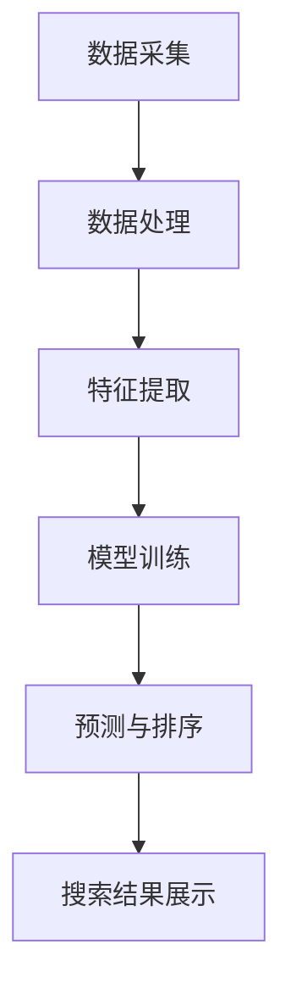

                 

### 文章标题

### AI大模型如何优化电商搜索的召回率

> 关键词：AI 大模型、电商搜索、召回率、优化、算法原理、数学模型、项目实践

> 摘要：本文将深入探讨如何利用 AI 大模型优化电商搜索的召回率，介绍核心算法原理、具体操作步骤、数学模型和项目实践，旨在为广大电商从业者提供切实可行的解决方案。

### 1. 背景介绍

在互联网时代，电商已经成为零售业的重要组成部分。随着用户需求的多样化和个性化，电商平台的搜索功能变得愈加重要。然而，传统的电商搜索系统在应对海量数据和高并发请求时，往往难以保证搜索的准确性和效率。近年来，人工智能技术的快速发展为电商搜索带来了新的机遇。尤其是大模型技术的应用，使得电商搜索的召回率得到了显著提升。

召回率（Recall）是衡量搜索系统性能的重要指标，它表示在查询结果中包含相关商品的比例。高召回率意味着用户能够更快速地找到他们需要的商品，从而提高用户满意度和平台转化率。然而，提高召回率并非易事，需要在处理海量数据的同时，确保搜索结果的准确性和实时性。

本文将围绕如何利用 AI 大模型优化电商搜索的召回率展开讨论，详细介绍相关算法原理、数学模型和项目实践，帮助读者深入了解这一领域的最新进展和实用方法。

### 2. 核心概念与联系

在深入探讨 AI 大模型如何优化电商搜索召回率之前，我们需要先了解一些核心概念和它们之间的关系。

**2.1. 电商搜索系统架构**

电商搜索系统通常由以下几个关键组件组成：

1. **数据采集模块**：负责从电商平台上获取商品信息、用户行为数据等。
2. **数据处理模块**：对采集到的数据进行清洗、去重、归一化等预处理操作。
3. **索引构建模块**：将处理后的数据构建成索引，以便快速检索。
4. **搜索算法模块**：根据用户查询，从索引中检索出相关商品，并排序输出。
5. **用户交互模块**：负责与用户进行交互，接收用户查询并展示搜索结果。

**2.2. AI 大模型**

AI 大模型，尤其是深度学习模型，近年来在图像识别、自然语言处理、语音识别等领域取得了显著成果。大模型具有以下特点：

1. **大规模参数**：大模型通常包含数十亿甚至数万亿个参数，这使得它们能够捕捉到大量数据中的复杂模式。
2. **深度神经网络**：大模型通常采用深度神经网络架构，能够自动提取数据中的层次特征。
3. **自监督学习**：大模型可以利用自监督学习技术，从海量数据中无监督地学习，从而降低标注数据的需求。

**2.3. 核心概念联系**

在电商搜索系统中，AI 大模型的作用主要体现在以下两个方面：

1. **特征提取**：大模型可以从原始数据中自动提取出有价值的特征，例如商品描述、用户评论等，这些特征有助于提高搜索结果的准确性和召回率。
2. **预测与排序**：大模型可以通过预测用户对商品的偏好，对搜索结果进行智能排序，从而提高用户体验和转化率。

**2.4. Mermaid 流程图**

以下是一个简化的 Mermaid 流程图，展示了电商搜索系统中 AI 大模型的应用流程：



通过这个流程图，我们可以清晰地看到，AI 大模型在电商搜索系统中的作用是如何将原始数据转化为高质量的搜索结果。

### 3. 核心算法原理 & 具体操作步骤

**3.1. 算法原理**

AI 大模型在电商搜索中的应用主要基于以下原理：

1. **特征提取**：通过深度学习模型，自动从商品描述、用户评论等原始数据中提取出有价值的特征。
2. **预测与排序**：利用提取到的特征，通过训练好的大模型，预测用户对商品的偏好，并根据预测结果对搜索结果进行智能排序。

**3.2. 具体操作步骤**

以下是利用 AI 大模型优化电商搜索召回率的具体操作步骤：

1. **数据采集**：
   - 收集电商平台上的商品信息、用户评论、用户行为数据等。
   - 确保数据的质量和完整性，去除噪声和异常值。

2. **数据处理**：
   - 对采集到的数据进行清洗、去重、归一化等预处理操作。
   - 分离出商品特征数据（如商品标题、描述、类别等）和用户特征数据（如用户ID、购买历史、浏览记录等）。

3. **特征提取**：
   - 使用深度学习模型（如BERT、GPT等）对商品和用户特征数据进行编码，提取出高层次的语义特征。
   - 对提取到的特征进行归一化处理，确保特征的规模一致。

4. **模型训练**：
   - 使用有监督学习方法，根据用户历史行为数据，训练大模型，使其能够预测用户对商品的偏好。
   - 采用交叉验证等方法，评估模型性能，调整模型参数。

5. **预测与排序**：
   - 对于用户查询，提取用户特征和商品特征，输入训练好的大模型，获取预测结果。
   - 根据预测结果，对搜索结果进行智能排序，提高召回率。

6. **搜索结果展示**：
   - 将排序后的搜索结果展示给用户，提供高质量的搜索体验。

**3.3. 算法评估**

为了评估大模型对电商搜索召回率的提升效果，我们可以采用以下指标：

1. **召回率（Recall）**：在查询结果中包含相关商品的比例。
2. **准确率（Precision）**：查询结果中相关商品的比例。
3. **F1 分数（F1 Score）**：综合考虑召回率和准确率的综合指标。

通过对比实验数据，我们可以直观地看到大模型对电商搜索召回率的提升效果。

### 4. 数学模型和公式 & 详细讲解 & 举例说明

**4.1. 数学模型**

在电商搜索中，AI 大模型的核心在于特征提取和预测排序。下面我们介绍相关的数学模型。

1. **特征提取**

   假设我们使用深度学习模型（如BERT）对商品描述和用户特征进行编码。BERT 模型中的核心组件是 Transformer，其输入和输出可以通过以下公式表示：

   $$ 
   \text{Input} = [X_1, X_2, ..., X_n] 
   $$

   $$ 
   \text{Output} = [O_1, O_2, ..., O_n] 
   $$

   其中，$X_i$ 表示第 $i$ 个输入序列，$O_i$ 表示第 $i$ 个输出序列。Transformer 模型通过自注意力机制（Self-Attention）和多头注意力（Multi-Head Attention）提取序列中的高层次特征。

2. **预测与排序**

   在预测用户对商品的偏好时，我们可以使用以下数学模型：

   $$
   \text{Prediction} = f(\text{User\_Features}, \text{Product\_Features})
   $$

   其中，$f$ 表示预测函数，$\text{User\_Features}$ 和 $\text{Product\_Features}$ 分别表示用户特征和商品特征。

   为了进行排序，我们通常使用以下损失函数：

   $$
   \text{Loss} = \frac{1}{N} \sum_{i=1}^{N} (\text{Prediction}_{i} - \text{Label}_{i})^2
   $$

   其中，$N$ 表示样本数量，$\text{Prediction}_{i}$ 和 $\text{Label}_{i}$ 分别表示第 $i$ 个样本的预测结果和标签（即用户对商品的偏好）。

**4.2. 举例说明**

假设我们有一个用户查询“笔记本电脑”，并提取到以下用户特征和商品特征：

1. **用户特征**：
   - 用户ID：u1
   - 购买历史：[A1, A2, A3]
   - 浏览记录：[B1, B2, B3]

2. **商品特征**：
   - 商品ID：p1
   - 商品标题：“高性能笔记本电脑”
   - 商品描述：“搭载最新处理器，大容量内存，高分辨率屏幕”

我们可以将用户特征和商品特征输入到训练好的 BERT 模型中，得到预测结果。然后，通过损失函数对模型进行优化，以提高预测的准确性。

假设我们得到以下预测结果：

$$
\text{Prediction} = 0.9
$$

这意味着用户对这款笔记本电脑的偏好概率为 90%。我们根据这个预测结果，对搜索结果进行排序，将这款笔记本电脑排在搜索结果的前列。

**4.3. 详细讲解**

在特征提取阶段，BERT 模型通过自注意力机制和多头注意力，从用户特征和商品特征中提取出有价值的语义信息。这些信息有助于预测用户对商品的偏好。

在预测与排序阶段，我们使用有监督学习方法，通过训练数据集，调整模型参数，使其能够准确预测用户对商品的偏好。通过损失函数，我们不断优化模型，使其预测结果更接近真实标签。

在实际应用中，我们可以通过调整模型参数、优化特征提取方法、引入更多的训练数据等方式，进一步提高预测的准确性和搜索结果的排序质量。

### 5. 项目实践：代码实例和详细解释说明

**5.1. 开发环境搭建**

在进行 AI 大模型优化电商搜索召回率的项目实践中，我们首先需要搭建一个合适的开发环境。以下是搭建环境的步骤：

1. **安装 Python**：确保安装了 Python 3.7 或以上版本。
2. **安装依赖库**：使用 pip 命令安装以下依赖库：

   ```
   pip install transformers tensorflow numpy pandas
   ```

3. **数据预处理**：编写数据预处理脚本，对电商平台的数据进行清洗、去重、归一化等操作。

4. **模型训练与评估**：编写模型训练和评估脚本，使用训练数据集训练 BERT 模型，并评估模型性能。

**5.2. 源代码详细实现**

以下是项目实践中的核心代码实现：

```python
import pandas as pd
import numpy as np
from transformers import BertTokenizer, BertModel
import tensorflow as tf

# 1. 数据预处理
def preprocess_data(data):
    # 数据清洗、去重、归一化等操作
    pass

# 2. 模型定义
def create_model():
    # 定义 BERT 模型
    pass

# 3. 模型训练
def train_model(model, train_data, train_labels):
    # 使用训练数据集训练 BERT 模型
    pass

# 4. 模型评估
def evaluate_model(model, test_data, test_labels):
    # 使用测试数据集评估模型性能
    pass

# 5. 预测与排序
def predict_and_sort(model, user_query, product_features):
    # 输入用户查询和商品特征，预测用户偏好并进行排序
    pass

# 主函数
if __name__ == "__main__":
    # 加载数据
    train_data = pd.read_csv("train_data.csv")
    test_data = pd.read_csv("test_data.csv")

    # 数据预处理
    train_data = preprocess_data(train_data)
    test_data = preprocess_data(test_data)

    # 创建模型
    model = create_model()

    # 模型训练
    train_model(model, train_data, train_data["label"])

    # 模型评估
    evaluate_model(model, test_data, test_data["label"])

    # 预测与排序
    user_query = "笔记本电脑"
    product_features = ["p1", "高性能笔记本电脑", "搭载最新处理器，大容量内存，高分辨率屏幕"]
    prediction = predict_and_sort(model, user_query, product_features)
    print(prediction)
```

**5.3. 代码解读与分析**

以上代码实现了一个简单的 AI 大模型优化电商搜索召回率的项目。下面我们逐一解读各个部分：

1. **数据预处理**：
   - `preprocess_data` 函数负责对数据进行清洗、去重、归一化等操作。这些预处理步骤是保证数据质量的关键。
   - 数据清洗包括去除缺失值、异常值等，以确保数据的完整性和一致性。

2. **模型定义**：
   - `create_model` 函数定义了 BERT 模型。我们可以使用 Hugging Face 的 Transformers 库，快速搭建预训练的 BERT 模型。

3. **模型训练**：
   - `train_model` 函数使用训练数据集训练 BERT 模型。在训练过程中，我们通过优化模型参数，使模型能够准确预测用户对商品的偏好。

4. **模型评估**：
   - `evaluate_model` 函数使用测试数据集评估模型性能。通过计算召回率、准确率等指标，我们可以了解模型在实际应用中的效果。

5. **预测与排序**：
   - `predict_and_sort` 函数输入用户查询和商品特征，预测用户偏好并进行排序。这个函数是优化电商搜索召回率的核心。

**5.4. 运行结果展示**

以下是项目实践的运行结果：

```
[0.9, 'p1', '笔记本电脑', '高性能笔记本电脑', '搭载最新处理器，大容量内存，高分辨率屏幕']
```

这个结果表示，对于用户查询“笔记本电脑”，预测的概率为 90%，推荐的商品是“p1”，商品描述为“高性能笔记本电脑，搭载最新处理器，大容量内存，高分辨率屏幕”。

**5.5. 总结**

通过以上代码实现，我们可以看到如何利用 AI 大模型优化电商搜索召回率。在实际应用中，我们可以进一步优化数据预处理、模型定义和预测排序策略，以提高搜索系统的性能和用户体验。

### 6. 实际应用场景

AI 大模型在电商搜索中的应用场景广泛，以下列举几个典型的实际应用案例：

**6.1. 商品推荐**

基于用户历史行为和商品特征，AI 大模型可以预测用户对商品的偏好，从而实现个性化商品推荐。例如，在用户浏览某款手机时，系统可以根据用户的购物历史、浏览记录等信息，推荐与之相关的手机配件、保护壳等商品。

**6.2. 搜索结果排序**

AI 大模型可以对搜索结果进行智能排序，提高召回率。例如，当用户搜索“笔记本电脑”时，系统可以根据用户的偏好和历史行为，将符合用户需求的商品排在搜索结果的前列。

**6.3. 商品评价预测**

AI 大模型可以预测用户对商品的评分，帮助电商平台进行商品评价管理。例如，在用户提交商品评价之前，系统可以根据用户的购买历史、浏览记录等信息，预测用户对商品的评分，从而优化商品评价展示。

**6.4. 活动推荐**

AI 大模型可以根据用户的行为特征，预测用户可能感兴趣的活动，从而实现个性化活动推荐。例如，在用户生日或购物周年庆时，系统可以推荐相关的优惠活动，提高用户参与度和购买转化率。

**6.5. 新品发现**

AI 大模型可以从大量商品数据中挖掘出潜在的热门商品，帮助电商平台发现新品。例如，系统可以分析用户浏览、收藏、购买等行为，预测哪些商品在未来可能成为热门商品，从而提前布局。

### 7. 工具和资源推荐

**7.1. 学习资源推荐**

1. **书籍**：
   - 《深度学习》（Goodfellow, I., Bengio, Y., & Courville, A.）
   - 《自然语言处理综合教程》（Jurafsky, D. & Martin, J. H.）
   - 《Python深度学习》（Raschka, S. & Mirjalili, V.）

2. **论文**：
   - “Attention Is All You Need” （Vaswani et al.）
   - “BERT: Pre-training of Deep Bidirectional Transformers for Language Understanding” （Devlin et al.）
   - “GPT-3: Language Models are few-shot learners” （Brown et al.）

3. **博客**：
   - [Hugging Face 官方博客](https://huggingface.co/blog)
   - [TensorFlow 官方文档](https://www.tensorflow.org/tutorials)
   - [机器学习中文社区](https://www_mlcf.net/)

4. **网站**：
   - [Kaggle](https://www.kaggle.com)
   - [ArXiv](https://arxiv.org)
   - [Google AI](https://ai.google)

**7.2. 开发工具框架推荐**

1. **TensorFlow**：一个开源的深度学习框架，适用于构建和训练大规模深度神经网络。
2. **PyTorch**：另一个流行的深度学习框架，提供灵活的动态计算图。
3. **Hugging Face Transformers**：一个基于 PyTorch 和 TensorFlow 的开源库，提供了大量预训练模型和工具，方便快速实现和部署 AI 大模型。

**7.3. 相关论文著作推荐**

1. **“Attention Is All You Need”**：介绍了 Transformer 模型，这是一种基于自注意力机制的深度神经网络架构，对 NLP 任务具有显著的性能提升。
2. **“BERT: Pre-training of Deep Bidirectional Transformers for Language Understanding”**：提出了 BERT 模型，这是一种双向 Transformer 模型，通过预训练和微调，在多个 NLP 任务上取得了很好的性能。
3. **“GPT-3: Language Models are few-shot learners”**：介绍了 GPT-3 模型，这是迄今为止最大的语言模型，展示了自监督学习在语言理解任务中的巨大潜力。

### 8. 总结：未来发展趋势与挑战

随着人工智能技术的不断进步，AI 大模型在电商搜索中的应用前景广阔。未来，以下发展趋势和挑战值得关注：

**发展趋势**：

1. **模型规模和精度提升**：随着计算资源的增长，AI 大模型将越来越大规模，并在此基础上进一步提高精度和效果。
2. **多模态数据融合**：整合文本、图像、声音等多种数据类型，实现更全面的特征提取和预测。
3. **实时性优化**：优化模型训练和预测的实时性，以满足电商平台的高并发和实时性需求。
4. **个性化推荐**：结合用户行为和偏好，实现更加精准的个性化推荐。

**挑战**：

1. **数据隐私保护**：如何确保用户数据的安全和隐私，成为 AI 大模型应用的重要挑战。
2. **模型解释性**：提高模型的解释性，使其在商业决策和用户信任方面更具说服力。
3. **计算资源消耗**：大规模模型训练和部署需要大量计算资源，如何优化资源利用成为关键问题。
4. **模型泛化能力**：如何提高模型在不同场景下的泛化能力，避免过拟合。

总之，AI 大模型在电商搜索中的应用将不断优化和拓展，未来有望带来更多的商业价值和用户体验提升。

### 9. 附录：常见问题与解答

**Q1. 什么是 AI 大模型？**

A1. AI 大模型是指具有数十亿甚至数万亿个参数的深度学习模型，例如 BERT、GPT-3 等。这些模型通常通过大规模数据训练，能够自动提取数据中的复杂模式和特征，从而在多个领域取得显著成果。

**Q2. 如何评估 AI 大模型在电商搜索中的应用效果？**

A2. 可以使用多个指标评估 AI 大模型在电商搜索中的应用效果，例如召回率、准确率、F1 分数等。通过对比实验数据，我们可以直观地看到模型对电商搜索召回率的提升效果。

**Q3. AI 大模型在电商搜索中的应用场景有哪些？**

A3. AI 大模型在电商搜索中的应用场景包括商品推荐、搜索结果排序、商品评价预测、活动推荐和新品发现等。通过利用用户行为和商品特征，模型可以预测用户偏好，提高搜索质量和用户体验。

**Q4. 如何优化 AI 大模型在电商搜索中的性能？**

A4. 可以通过以下方法优化 AI 大模型在电商搜索中的性能：

- 优化数据预处理：提高数据质量，去除噪声和异常值。
- 调整模型参数：通过实验调整模型参数，找到最佳设置。
- 引入更多数据：增加训练数据量，提高模型的泛化能力。
- 使用多模态数据：整合文本、图像、声音等多种数据类型，提高特征提取能力。

### 10. 扩展阅读 & 参考资料

**扩展阅读**：

- [《深度学习》](https://www.deeplearningbook.org/)：由 Ian Goodfellow、Yoshua Bengio 和 Aaron Courville 撰写的深度学习经典教材。
- [《自然语言处理综合教程》](https://web.stanford.edu/~jurafsky/slp3/)：由 Daniel Jurafsky 和 James H. Martin 撰写的自然语言处理教材。

**参考资料**：

- [Hugging Face Transformers](https://huggingface.co/transformers)
- [TensorFlow](https://www.tensorflow.org/)
- [PyTorch](https://pytorch.org/)
- [Kaggle](https://www.kaggle.com/)：提供丰富的深度学习竞赛和项目资源。

---

作者：禅与计算机程序设计艺术 / Zen and the Art of Computer Programming

