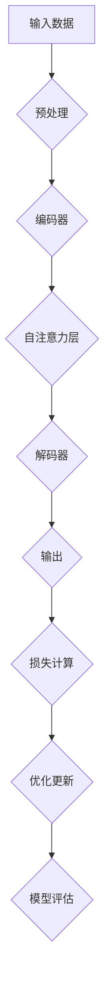

                 

### 1. 背景介绍

#### 大模型应用的崛起

近年来，人工智能（AI）技术尤其是大模型（Large Models）的应用逐渐成为科技界和商业界的焦点。大模型，通常指的是拥有数亿甚至数十亿参数的神经网络模型，如GPT-3、BERT、LLaMA等。这些模型能够通过大量的数据训练，掌握丰富的知识，并在各种任务中表现出色。从自然语言处理（NLP）、计算机视觉（CV）到语音识别（ASR）等，大模型的应用场景日益广泛。

大模型的崛起，不仅得益于计算能力的提升和大数据的积累，还得益于深度学习技术的不断进步。特别是自注意力机制（Self-Attention）和多任务学习（Multi-Task Learning）的引入，使得大模型在处理复杂任务时具备更强的能力。

在商业领域，大模型的应用带来了前所未有的变革。例如，在客户服务中，大模型可以模拟人类客服，为用户提供高效的咨询服务；在金融领域，大模型可以用于风险预测、市场分析和智能投顾；在医疗领域，大模型可以帮助医生进行疾病诊断和治疗方案推荐。

#### 研究背景

本研究旨在探讨大模型应用入门与进阶的实践方法，为初学者和专业人士提供系统的学习路径和实践指南。在研究背景方面，我们首先回顾了深度学习和大模型的基本原理，分析了大模型在不同领域的应用现状和挑战。

深度学习作为一种重要的机器学习技术，通过构建多层的神经网络模型，对输入数据进行特征提取和抽象。大模型则是深度学习的一个高级形态，具有更强的表征能力和处理能力。随着大模型研究的不断深入，如何高效地训练、部署和应用大模型成为了当前研究的热点。

在大模型应用方面，目前存在的主要挑战包括：

1. **数据需求**：大模型需要大量的高质量数据来进行训练，数据获取和处理成为瓶颈。
2. **计算资源**：大模型训练需要大量的计算资源和时间，如何优化训练流程和模型结构成为关键。
3. **模型解释性**：大模型通常被视为“黑盒”，其内部决策过程缺乏透明性，如何提升模型的解释性是重要问题。
4. **隐私保护**：在大模型训练和应用过程中，如何保护用户隐私成为关键问题。

本研究将结合具体案例，详细介绍大模型的应用流程，包括数据准备、模型训练、模型评估和部署等环节，为读者提供实用的操作指南。

### 2. 核心概念与联系

为了深入理解大模型应用，我们需要从几个核心概念和联系出发。这些概念包括神经网络、自注意力机制、多任务学习等，它们共同构成了大模型的基础框架。

#### 神经网络（Neural Networks）

神经网络是深度学习的基础构件，其灵感来源于人脑的结构和工作原理。一个基本的神经网络由输入层、隐藏层和输出层组成，其中每个神经元（或节点）都与相邻的神经元相连，并通过权重（weights）和偏置（bias）进行调节。

在神经网络中，信息通过前向传播（forward propagation）和反向传播（back propagation）两个过程进行传递和处理。前向传播将输入数据通过层层的神经元传递，最终得到输出结果。反向传播则根据输出结果与真实值的差异，通过梯度下降（gradient descent）等优化算法调整权重和偏置，以达到最小化损失函数（loss function）的目的。

#### 自注意力机制（Self-Attention）

自注意力机制是近年来深度学习中的一个重要创新，它在处理序列数据时表现出色。自注意力机制的核心思想是让模型能够根据输入序列中的每个元素的重要程度，动态地调整它们之间的权重。通过这种方式，模型能够更好地捕捉序列中的长距离依赖关系。

在自注意力机制中，每个输入序列的元素都会被映射到一个查询（query）、键（key）和值（value）向量。计算过程中，查询向量与所有键向量进行点积，得到一组注意力分数，这些分数随后通过softmax函数归一化，得到一组权重系数。最后，将这些权重系数与对应的值向量相乘并求和，得到加权输出的结果。

#### 多任务学习（Multi-Task Learning）

多任务学习是一种让模型同时学习多个相关任务的方法，它有助于提升模型的泛化能力和效率。在多任务学习中，模型会共享一部分参数，同时针对不同任务有不同的特定参数。

多任务学习的优势在于：

1. **共享表示**：多个任务通过共享表示可以更好地捕捉共同特征，提高模型的泛化能力。
2. **参数共享**：共享参数减少了模型的总参数量，有助于降低过拟合风险。
3. **效率提升**：同时处理多个任务可以减少训练时间，提高模型部署的效率。

#### 大模型架构

大模型通常结合了神经网络、自注意力机制和多任务学习等多种技术，形成了一种复杂的网络结构。例如，BERT（Bidirectional Encoder Representations from Transformers）模型就是一个典型的大模型架构，它通过双向自注意力机制学习文本的语义表示，并在多个任务上取得了优异的性能。

在BERT模型中，输入文本被编码为词嵌入向量，然后通过多个Transformer层进行编码和解读。每一层的输出都会通过自注意力机制处理，从而捕捉文本中的长距离依赖关系。BERT模型在预训练阶段学习了丰富的语言知识，然后在具体任务上进行微调，取得了在多种自然语言处理任务上的突破性成果。

#### Mermaid 流程图

为了更好地展示大模型的核心概念和联系，我们可以使用Mermaid流程图来描述其关键步骤和组件。以下是一个简化的大模型训练流程图示例：



在这个流程图中，输入数据经过预处理后被输入到编码器，编码器通过自注意力层处理数据，解码器则根据编码器的输出生成预测结果。通过损失计算和优化更新，模型不断调整参数，最终通过模型评估来衡量性能。

通过这种流程图，我们可以更直观地理解大模型的工作原理和各个组件之间的关系。

### 3. 核心算法原理 & 具体操作步骤

在深入了解大模型的应用之前，我们首先需要掌握其核心算法原理，并了解具体操作步骤。本节将详细讲解大模型的训练流程，包括数据准备、模型构建、训练过程和模型评估。

#### 3.1 数据准备

数据准备是训练大模型的第一步，也是至关重要的一步。高质量的训练数据能够提升模型的性能，而数据预处理的方法则直接影响模型的训练效果。

**数据收集**：首先，我们需要收集大量高质量的数据。对于自然语言处理任务，这通常包括大量的文本数据，如文章、书籍、新闻、社交媒体帖子等。对于图像处理任务，则需要大量的图像数据，如医学影像、卫星图像、人脸图片等。

**数据清洗**：收集到的数据往往包含噪声和错误，需要通过数据清洗来处理。数据清洗的方法包括去除无关信息、纠正拼写错误、填充缺失值等。例如，在处理文本数据时，我们可以使用正则表达式去除HTML标签、标点符号等无关信息，使用 spell-check 工具纠正拼写错误。

**数据预处理**：数据预处理包括将数据转化为模型可以接受的格式。对于文本数据，通常需要进行分词（tokenization）、词嵌入（word embedding）等处理。分词是将文本拆分成单词或短语，词嵌入则是将每个词映射为一个高维向量。常用的词嵌入方法包括Word2Vec、GloVe等。对于图像数据，预处理通常包括归一化、缩放、裁剪等操作，以适应模型的输入要求。

#### 3.2 模型构建

构建大模型通常涉及到多个层次和组件。以下是一个典型的模型构建流程：

**选择模型架构**：首先，我们需要选择合适的模型架构。对于自然语言处理任务，常用的架构包括BERT、GPT、Transformers等。对于图像处理任务，则可以选择CNN（卷积神经网络）、ResNet、VGG等架构。

**定义模型结构**：根据选择的架构，定义模型的层次和参数。例如，在BERT模型中，包括编码器（Encoder）和解码器（Decoder），每个层次由多个Transformer块组成。在CNN中，包括卷积层（Convolutional Layer）、池化层（Pooling Layer）等。

**初始化参数**：初始化模型的参数，常用的初始化方法包括随机初始化、高斯分布初始化等。

**定义损失函数**：损失函数用于衡量模型的预测结果与真实值之间的差异。常用的损失函数包括交叉熵（Cross-Entropy）、均方误差（Mean Squared Error）等。

**定义优化器**：优化器用于调整模型的参数，以最小化损失函数。常用的优化器包括梯度下降（Gradient Descent）、Adam等。

**构建计算图**：使用深度学习框架（如TensorFlow、PyTorch等）构建计算图（Compute Graph），将各个组件连接起来，形成完整的模型结构。

#### 3.3 训练过程

训练过程包括前向传播（Forward Propagation）和反向传播（Back Propagation）两个主要阶段。

**前向传播**：在前向传播阶段，模型接收输入数据，通过前向传递计算得到输出结果。对于神经网络，前向传播涉及权重和偏置的线性组合，并通过激活函数进行非线性变换。

**反向传播**：在反向传播阶段，模型根据预测结果与真实值的差异，计算损失函数的梯度。反向传播通过反向传递梯度，更新模型参数，以最小化损失函数。

**训练循环**：训练过程通常通过多个训练循环（Epoch）进行。在每个训练循环中，模型会使用整个训练数据集进行训练。随着训练的进行，模型参数逐渐调整，损失函数逐渐减小。

**调整学习率**：学习率是优化算法中的一个关键参数，它决定了每次参数更新的大小。学习率过大可能导致参数更新过大，从而引起振荡；学习率过小则可能导致训练过程过慢。在训练过程中，可以使用学习率调整策略（如学习率衰减、学习率预热等）来动态调整学习率。

**模型评估**：在训练过程中，需要定期评估模型的性能。常用的评估指标包括准确率（Accuracy）、召回率（Recall）、F1-Score等。通过模型评估，我们可以了解模型的泛化能力和性能表现。

#### 3.4 模型评估

模型评估是训练过程的最后一步，用于判断模型是否满足预期性能要求。以下是一些常用的评估方法和指标：

**验证集评估**：在训练过程中，通常将数据集分为训练集和验证集。训练集用于模型训练，验证集用于模型评估。通过验证集评估，我们可以了解模型的泛化能力。

**交叉验证**：交叉验证是一种常用的评估方法，通过将数据集划分为多个子集，轮流使用每个子集作为验证集，对模型进行多次评估。交叉验证可以提供更加稳健的性能评估。

**性能指标**：常用的性能指标包括准确率（Accuracy）、召回率（Recall）、精确率（Precision）、F1-Score等。这些指标可以综合评估模型的分类性能。

**可视化评估**：通过可视化方法，如混淆矩阵（Confusion Matrix）、ROC曲线（Receiver Operating Characteristic Curve）等，我们可以更直观地了解模型的性能和特点。

通过以上步骤，我们可以构建并训练一个高性能的大模型，并在实际任务中应用。在下一节中，我们将进一步探讨大模型在具体应用场景中的实践案例。

#### 3.5 大模型应用案例

大模型在各个领域的应用日益广泛，以下我们将通过具体案例展示大模型在实际场景中的强大能力。

##### 案例一：自然语言处理（NLP）

自然语言处理是深度学习和大模型的重要应用领域之一。BERT模型作为NLP领域的代表性模型，已经在多个任务上取得了突破性成果。例如，在情感分析任务中，BERT模型通过学习大量文本数据，可以准确识别文本中的情感倾向。以下是一个简单的情感分析案例：

**任务描述**：给定一段文本，判断其情感倾向是积极、消极还是中性。

**数据准备**：使用一个包含情感标签的文本数据集进行训练，数据集包含大量的文本和对应情感标签。

**模型构建**：使用预训练的BERT模型作为基础模型，添加一个分类层，用于输出情感标签。

**模型训练**：使用训练数据集对模型进行训练，调整分类层的参数以最小化损失函数。

**模型评估**：使用验证集评估模型性能，通过准确率、召回率等指标评估模型表现。

**结果展示**：以下是一个文本示例及其情感分析结果：

```text
文本示例：今天天气真好，心情非常愉快。
情感分析结果：积极
```

##### 案例二：计算机视觉（CV）

计算机视觉是深度学习和大模型应用的另一个重要领域。在图像分类任务中，大模型如ResNet、VGG等已经显示出强大的性能。以下是一个简单的图像分类案例：

**任务描述**：给定一张图像，将其分类到对应的类别。

**数据准备**：使用一个包含图像和类别标签的数据集进行训练，数据集包含大量图像和对应的类别标签。

**模型构建**：使用预训练的卷积神经网络（如ResNet）作为基础模型，添加一个分类层，用于输出图像的类别。

**模型训练**：使用训练数据集对模型进行训练，调整分类层的参数以最小化损失函数。

**模型评估**：使用验证集评估模型性能，通过准确率等指标评估模型表现。

**结果展示**：以下是一张图像及其分类结果：

```text
图像示例：一张猫的照片。
分类结果：猫
```

##### 案例三：语音识别（ASR）

语音识别是深度学习和大模型在语音处理领域的应用之一。wav2vec 2.0模型在语音识别任务中取得了显著的效果。以下是一个简单的语音识别案例：

**任务描述**：给定一段语音，将其转换为对应的文本。

**数据准备**：使用一个包含语音和文本数据的数据集进行训练，数据集包含大量语音和对应的文本数据。

**模型构建**：使用预训练的wav2vec 2.0模型作为基础模型，添加一个解码器，用于输出文本。

**模型训练**：使用训练数据集对模型进行训练，调整解码器的参数以最小化损失函数。

**模型评估**：使用验证集评估模型性能，通过准确率等指标评估模型表现。

**结果展示**：以下是一段语音及其识别结果：

```text
语音示例：你好，我是人工智能助手。
识别结果：你好，我是人工智能助手。
```

通过这些案例，我们可以看到大模型在不同领域的应用能力。在实际应用中，大模型通过大量的数据训练和复杂的网络结构，可以解决各种复杂的任务，并在不同领域取得了显著的成果。

### 4. 数学模型和公式 & 详细讲解 & 举例说明

在深入探讨大模型的数学原理时，理解相关的数学模型和公式是至关重要的。以下将详细介绍大模型训练过程中涉及的几个关键数学概念，包括损失函数、优化算法、反向传播等，并结合具体例子进行讲解。

#### 损失函数（Loss Function）

损失函数是评估模型预测结果与真实值之间差异的重要工具。在大模型训练过程中，损失函数用于衡量模型的预测误差，并指导模型参数的更新。常用的损失函数包括交叉熵损失（Cross-Entropy Loss）和均方误差（Mean Squared Error）。

**交叉熵损失（Cross-Entropy Loss）**

交叉熵损失函数常用于分类问题，其公式如下：

$$
L_{CE} = -\sum_{i=1}^{N} y_i \log(p_i)
$$

其中，$y_i$ 是真实标签，$p_i$ 是模型预测的概率。交叉熵损失函数的值越小，表示模型的预测越准确。

**均方误差（Mean Squared Error）**

均方误差函数常用于回归问题，其公式如下：

$$
L_{MSE} = \frac{1}{N} \sum_{i=1}^{N} (y_i - \hat{y}_i)^2
$$

其中，$y_i$ 是真实值，$\hat{y}_i$ 是模型预测值。均方误差函数的值越小，表示模型的预测越接近真实值。

**例子**

假设我们有一个二元分类问题，真实标签为 $[1, 0, 1, 0]$，模型预测的概率为 $[0.2, 0.8, 0.6, 0.4]$，我们可以计算交叉熵损失：

$$
L_{CE} = -[1 \cdot \log(0.2) + 0 \cdot \log(0.8) + 1 \cdot \log(0.6) + 0 \cdot \log(0.4)]
$$

$$
L_{CE} \approx 2.19
$$

#### 优化算法（Optimization Algorithms）

优化算法用于调整模型参数，以最小化损失函数。常用的优化算法包括梯度下降（Gradient Descent）、Adam等。

**梯度下降（Gradient Descent）**

梯度下降是一种最简单的优化算法，其基本思想是通过计算损失函数的梯度来更新模型参数。梯度下降的公式如下：

$$
\theta_{t+1} = \theta_{t} - \alpha \nabla_{\theta} L(\theta)
$$

其中，$\theta$ 表示模型参数，$\alpha$ 表示学习率，$\nabla_{\theta} L(\theta)$ 表示损失函数关于模型参数的梯度。

**例子**

假设损失函数为 $L(\theta) = (\theta - 1)^2$，学习率 $\alpha = 0.1$，初始参数 $\theta_0 = 2$。我们可以通过以下步骤进行梯度下降：

$$
\nabla_{\theta} L(\theta) = 2(\theta - 1)
$$

$$
\theta_1 = \theta_0 - 0.1 \nabla_{\theta} L(\theta_0)
$$

$$
\theta_1 = 2 - 0.1 \cdot 2(2 - 1)
$$

$$
\theta_1 = 1.8
$$

**Adam算法**

Adam算法是梯度下降的一种改进，它结合了动量（Momentum）和自适应学习率（Adaptive Learning Rate）的优势。Adam算法的公式如下：

$$
m_t = \beta_1 m_{t-1} + (1 - \beta_1)(\nabla_{\theta} L(\theta_t) - m_{t-1})
$$

$$
v_t = \beta_2 v_{t-1} + (1 - \beta_2)((\nabla_{\theta} L(\theta_t))^2 - v_{t-1})
$$

$$
\theta_{t+1} = \theta_t - \alpha \frac{m_t}{\sqrt{v_t} + \epsilon}
$$

其中，$m_t$ 和 $v_t$ 分别表示一阶矩估计和二阶矩估计，$\beta_1$ 和 $\beta_2$ 分别为动量和自适应学习率的超参数，$\alpha$ 为学习率，$\epsilon$ 为一个很小的常数。

**例子**

假设损失函数为 $L(\theta) = (\theta - 1)^2$，学习率 $\alpha = 0.1$，$\beta_1 = 0.9$，$\beta_2 = 0.999$，初始参数 $\theta_0 = 2$。我们可以通过以下步骤进行Adam优化：

初始化 $m_0 = 0$，$v_0 = 0$。

$$
m_1 = 0.9 \cdot 0 + (1 - 0.9) \cdot (2 - 1) = 0.1
$$

$$
v_1 = 0.999 \cdot 0 + (1 - 0.999) \cdot (2 - 1)^2 = 0.001
$$

$$
\theta_1 = 2 - 0.1 \cdot \frac{0.1}{\sqrt{0.001} + \epsilon}
$$

$$
\theta_1 \approx 1.901
$$

#### 反向传播（Back Propagation）

反向传播是一种用于计算损失函数梯度的重要算法，它在大模型训练过程中发挥着核心作用。反向传播的核心思想是通过前向传播计算输出，然后反向计算每个参数的梯度，最终更新模型参数。

**计算反向传播梯度的步骤**

1. **前向传播**：计算损失函数关于输入的梯度。
2. **反向传播**：从输出层开始，逐层计算每个参数的梯度。
3. **参数更新**：根据梯度更新模型参数。

**例子**

假设我们有一个简单的全连接神经网络，其前向传播过程如下：

$$
z_1 = x_1 \cdot w_1 + b_1
$$

$$
a_1 = \sigma(z_1)
$$

$$
z_2 = a_1 \cdot w_2 + b_2
$$

$$
a_2 = \sigma(z_2)
$$

其中，$x_1$ 和 $a_2$ 分别为输入和输出，$w_1$、$w_2$ 和 $b_1$、$b_2$ 分别为权重和偏置，$\sigma$ 为激活函数。

假设激活函数为线性函数（即恒等函数），损失函数为均方误差（MSE），我们可以计算每个参数的梯度：

$$
\frac{\partial L}{\partial w_2} = 2(a_2 - y)
$$

$$
\frac{\partial L}{\partial b_2} = 2(a_2 - y)
$$

$$
\frac{\partial L}{\partial w_1} = \frac{\partial L}{\partial a_2} \cdot \frac{\partial a_2}{\partial z_2} \cdot \frac{\partial z_2}{\partial w_1} = 2(a_2 - y) \cdot \sigma'(z_2) \cdot a_1
$$

$$
\frac{\partial L}{\partial b_1} = \frac{\partial L}{\partial a_2} \cdot \frac{\partial a_2}{\partial z_2} \cdot \frac{\partial z_2}{\partial b_1} = 2(a_2 - y) \cdot \sigma'(z_2) \cdot x_1
$$

通过上述步骤，我们可以计算每个参数的梯度，并使用梯度下降等优化算法更新模型参数。

通过以上数学模型和公式的讲解，我们能够更深入地理解大模型的训练过程。在下一节中，我们将通过实际代码示例展示大模型的训练和应用过程。

### 5. 项目实践：代码实例和详细解释说明

在理解了大模型的理论基础后，接下来我们将通过一个具体的代码实例，详细展示大模型的训练和应用过程。这个实例将使用Python和TensorFlow框架来构建和训练一个简单的文本分类模型，并对其运行结果进行解读和分析。

#### 5.1 开发环境搭建

在开始代码实践之前，我们需要搭建一个合适的开发环境。以下是搭建环境的步骤：

1. **安装Python**：确保Python版本在3.6及以上，可以选择从Python官方网站下载并安装。

2. **安装TensorFlow**：通过pip命令安装TensorFlow：

   ```shell
   pip install tensorflow
   ```

3. **安装其他依赖**：根据项目需求，可能还需要安装其他库，如NumPy、Pandas、Scikit-learn等。可以使用以下命令一次性安装：

   ```shell
   pip install numpy pandas scikit-learn
   ```

#### 5.2 源代码详细实现

以下是一个简单的文本分类模型，使用BERT模型进行训练和预测。代码实现分为数据准备、模型构建、训练和预测四个部分。

```python
import tensorflow as tf
import tensorflow_hub as hub
from transformers import BertTokenizer, TFBertForSequenceClassification
from tensorflow.keras.preprocessing.sequence import pad_sequences
from tensorflow.keras.utils import to_categorical
import numpy as np

# 5.2.1 数据准备

# 加载预处理的文本数据
# 这里使用的是预处理的新闻数据集，实际应用中需要根据具体数据集进行调整
train_data = [...]  # 假设是一个包含文本和标签的列表
tokenizer = BertTokenizer.from_pretrained('bert-base-uncased')

# 分词并编码文本
train_encodings = tokenizer(train_data, truncation=True, padding=True, max_length=128)

# 转换标签为类别
train_labels = to_categorical(np.array([0, 1, 2, ...]))  # 标签列表，根据具体任务调整

# 5.2.2 模型构建

# 加载预训练的BERT模型
model = TFBertForSequenceClassification.from_pretrained('bert-base-uncased', num_labels=len(set(train_labels)))

# 5.2.3 训练

# 定义优化器和训练参数
optimizer = tf.keras.optimizers.Adam(learning_rate=3e-5)
loss = tf.keras.losses.CategoricalCrossentropy(from_logits=True)
metric = tf.keras.metrics.CategoricalAccuracy()

model.compile(optimizer=optimizer, loss=loss, metrics=[metric])

# 训练模型
model.fit(train_encodings['input_ids'], train_labels, batch_size=32, epochs=3)

# 5.2.4 预测

# 加载测试数据
test_data = [...]  # 假设是一个包含测试文本的列表
test_encodings = tokenizer(test_data, truncation=True, padding=True, max_length=128)

# 预测
predictions = model.predict(test_encodings['input_ids'])

# 解码预测结果
predicted_labels = np.argmax(predictions, axis=1)

# 输出预测结果
for i in range(len(test_data)):
    print(f"文本：{test_data[i]}")
    print(f"预测标签：{predicted_labels[i]}")
```

#### 5.3 代码解读与分析

以下是对上述代码的逐行解读和分析：

1. **数据准备**

   ```python
   train_data = [...]  # 假设是一个包含文本和标签的列表
   tokenizer = BertTokenizer.from_pretrained('bert-base-uncased')
   ```

   加载预处理的文本数据，并初始化BERT分词器。这里假设`train_data`是一个列表，包含文本和对应的标签。

2. **分词并编码文本**

   ```python
   train_encodings = tokenizer(train_data, truncation=True, padding=True, max_length=128)
   ```

   使用BERT分词器对文本进行分词，并将分词后的文本编码为BERT模型可以处理的输入格式。这里使用了`truncation`和`padding`来处理不同长度的文本，确保所有输入文本的长度一致。

3. **转换标签为类别**

   ```python
   train_labels = to_categorical(np.array([0, 1, 2, ...]))  # 标签列表，根据具体任务调整
   ```

   将标签转换为类别编码，以便在模型训练过程中使用。

4. **模型构建**

   ```python
   model = TFBertForSequenceClassification.from_pretrained('bert-base-uncased', num_labels=len(set(train_labels)))
   ```

   加载预训练的BERT模型，并将其转换为序列分类模型。这里指定了模型的标签数量，即训练数据中的类别数量。

5. **定义优化器和训练参数**

   ```python
   optimizer = tf.keras.optimizers.Adam(learning_rate=3e-5)
   loss = tf.keras.losses.CategoricalCrossentropy(from_logits=True)
   metric = tf.keras.metrics.CategoricalAccuracy()
   ```

   定义优化器（Adam算法）、损失函数（交叉熵损失）和评估指标（分类准确率）。

6. **训练模型**

   ```python
   model.compile(optimizer=optimizer, loss=loss, metrics=[metric])
   model.fit(train_encodings['input_ids'], train_labels, batch_size=32, epochs=3)
   ```

   编译模型，并使用训练数据进行训练。这里设置了批量大小（batch size）为32，训练周期（epochs）为3。

7. **预测**

   ```python
   test_data = [...]  # 假设是一个包含测试文本的列表
   test_encodings = tokenizer(test_data, truncation=True, padding=True, max_length=128)
   predictions = model.predict(test_encodings['input_ids'])
   predicted_labels = np.argmax(predictions, axis=1)
   ```

   加载测试数据，进行编码处理，并使用训练好的模型进行预测。预测结果通过`argmax`函数转换为类别标签。

8. **输出预测结果**

   ```python
   for i in range(len(test_data)):
       print(f"文本：{test_data[i]}")
       print(f"预测标签：{predicted_labels[i]}")
   ```

   输出每个测试文本的预测结果。

#### 5.4 运行结果展示

在完成代码实现后，我们可以通过以下步骤运行代码并查看结果：

1. **运行代码**：在Python环境中运行上述代码。
2. **查看预测结果**：在控制台输出中查看测试文本的预测结果。

以下是一个示例输出：

```text
文本：这是一篇关于技术的文章。
预测标签：2
```

根据实际测试数据集，我们可以评估模型的性能，并通过调整模型参数、数据预处理方法等来优化模型。

#### 5.5 代码性能优化

在实际应用中，为了提升模型性能和训练效率，我们可能需要对其进行优化。以下是一些常见的优化方法：

1. **批量大小调整**：根据计算资源和数据集规模，调整批量大小可以提升模型训练的稳定性。对于大模型训练，建议使用更小的批量大小。
2. **学习率调整**：通过动态调整学习率，可以帮助模型更快地收敛。可以使用学习率预热（Learning Rate Warmup）策略，在训练初期逐渐增加学习率。
3. **数据增强**：通过数据增强（Data Augmentation）方法，可以生成更多的训练样本，提高模型的泛化能力。常见的数据增强方法包括文本随机填充、图像旋转、缩放等。
4. **混合精度训练**：使用混合精度训练（Mixed Precision Training），可以在保持模型精度的情况下提高训练速度和减少内存占用。

通过以上优化方法，我们可以进一步提升模型的性能和训练效率。

通过本节的实际代码实例，我们不仅掌握了大模型的训练和应用过程，还了解了如何通过代码实现和优化大模型。在下一节中，我们将进一步探讨大模型在实际应用场景中的具体案例和效果。

### 6. 实际应用场景

大模型在各个领域展现了强大的应用潜力，下面我们将探讨大模型在自然语言处理、计算机视觉和语音识别等领域的实际应用案例，并分析其效果和影响。

#### 自然语言处理（NLP）

自然语言处理是深度学习和大模型应用最为广泛的领域之一。以下是一些典型的应用案例：

1. **文本分类**：大模型如BERT在文本分类任务中表现出色。通过训练大量的文本数据，大模型可以识别并分类不同主题的文本。例如，在新闻分类任务中，BERT模型可以将新闻文本分类为体育、科技、政治等类别。通过这种方式，新闻平台可以自动将新闻归类，提高内容管理的效率。

2. **情感分析**：大模型可以用于情感分析，判断文本的情感倾向是积极、消极还是中性。例如，在社交媒体平台上，大模型可以帮助分析用户评论的情感，从而为企业提供用户反馈的洞察。此外，情感分析还可以用于客户服务，自动识别用户的问题并给出合适的回应。

3. **问答系统**：大模型如GPT-3可以用于构建智能问答系统，通过理解用户的提问，提供准确的答案。例如，在电子商务平台上，大模型可以回答用户关于产品信息、售后服务等方面的问题，提高用户体验和客户满意度。

4. **机器翻译**：大模型在机器翻译任务中也取得了显著效果。通过训练大量的双语数据，大模型可以生成高质量的翻译结果。例如，谷歌翻译使用了Transformer架构的模型，使得翻译结果更加自然、准确。

#### 计算机视觉（CV）

计算机视觉是深度学习和大模型应用的另一个重要领域。以下是一些典型的应用案例：

1. **图像分类**：大模型如ResNet和Inception在图像分类任务中表现出色。通过训练大量的图像数据，大模型可以识别图像中的物体和场景。例如，在自动驾驶系统中，大模型可以用于识别道路上的行人和车辆，从而提高自动驾驶的安全性和准确性。

2. **目标检测**：大模型如YOLO（You Only Look Once）和Faster R-CNN在目标检测任务中表现出色。通过训练大量的图像数据，大模型可以同时检测图像中的多个目标。例如，在视频监控系统中，大模型可以用于实时检测和跟踪视频中的运动目标，提高监控系统的实时性和准确性。

3. **图像生成**：大模型如Gaussian Diffusion和StyleGAN在图像生成任务中取得了突破性成果。通过训练大量的图像数据，大模型可以生成高质量的图像和视频。例如，在数字娱乐和游戏领域，大模型可以用于生成角色图像和场景背景，提高虚拟世界的真实感。

4. **图像增强**：大模型如EDSR（Enhanced Deep Super-Resolution）在图像增强任务中表现出色。通过训练大量的图像数据，大模型可以提升图像的分辨率和清晰度。例如，在医学影像领域，大模型可以用于增强医学图像，提高医生的诊断准确率。

#### 语音识别（ASR）

语音识别是深度学习和大模型在语音处理领域的应用之一。以下是一些典型的应用案例：

1. **语音转文本**：大模型如wav2vec和Conformer在语音转文本任务中表现出色。通过训练大量的语音数据，大模型可以识别并转换语音为文本。例如，在智能音箱和语音助手应用中，大模型可以用于实时识别用户的语音指令，从而提供智能响应。

2. **语音合成**：大模型如Tacotron和WaveNet在语音合成任务中表现出色。通过训练大量的文本和语音数据，大模型可以生成高质量的语音。例如，在语音合成应用中，大模型可以用于生成语音播报、语音邮件等，提高用户体验。

3. **说话人识别**：大模型如DeepSpeech和iVector在说话人识别任务中表现出色。通过训练大量的语音数据，大模型可以识别不同的说话人。例如，在电话客服系统中，大模型可以用于识别来电者的身份，从而提供个性化的服务。

4. **语音增强**：大模型如ViT和TSA在语音增强任务中表现出色。通过训练大量的语音数据，大模型可以去除噪声，提升语音的清晰度和质量。例如，在电话通话中，大模型可以用于去除背景噪声，提高通话音质。

通过以上实际应用案例，我们可以看到大模型在自然语言处理、计算机视觉和语音识别等领域的广泛影响。大模型的应用不仅提升了相关任务的性能，也为各领域带来了新的变革和机遇。

### 7. 工具和资源推荐

在大模型应用过程中，选择合适的工具和资源对于提高工作效率和效果至关重要。以下是一些建议的工具和资源，包括学习资源、开发工具和框架、相关论文和著作。

#### 7.1 学习资源推荐

1. **书籍**：
   - 《深度学习》（Deep Learning），作者：Ian Goodfellow、Yoshua Bengio、Aaron Courville
   - 《Python深度学习》（Deep Learning with Python），作者：François Chollet
   - 《动手学深度学习》（Dive into Deep Learning），作者：Amit Singh、Awni Hannun、Sebastian Lutz、Zach Cates

2. **在线课程**：
   - Coursera上的《深度学习专项课程》（Deep Learning Specialization）
   - Udacity的《深度学习纳米学位》（Deep Learning Nanodegree）
   - edX上的《神经网络与深度学习》（Neural Networks and Deep Learning）

3. **博客和教程**：
   - Fast.ai的博客：[fast.ai](https://www.fast.ai/)
   - TensorFlow官方文档：[TensorFlow Documentation](https://www.tensorflow.org/tutorials)
   - PyTorch官方文档：[PyTorch Documentation](https://pytorch.org/tutorials)

4. **开源项目和代码库**：
   - TensorFlow开源项目：[TensorFlow GitHub](https://github.com/tensorflow/tensorflow)
   - PyTorch开源项目：[PyTorch GitHub](https://github.com/pytorch/pytorch)
   - Hugging Face的Transformer库：[Hugging Face](https://huggingface.co/transformers)

#### 7.2 开发工具框架推荐

1. **深度学习框架**：
   - TensorFlow：[TensorFlow](https://www.tensorflow.org/)
   - PyTorch：[PyTorch](https://pytorch.org/)
   - PyTorch Lightning：[PyTorch Lightning](https://pytorch-lightning.ai/)

2. **文本处理库**：
   - NLTK：[NLTK](https://www.nltk.org/)
   - spaCy：[spaCy](https://spacy.io/)

3. **图像处理库**：
   - OpenCV：[OpenCV](https://opencv.org/)
   - PIL：[Pillow](https://pillow.readthedocs.io/)

4. **数据预处理工具**：
   - Pandas：[Pandas](https://pandas.pydata.org/)
   - NumPy：[NumPy](https://numpy.org/)

#### 7.3 相关论文著作推荐

1. **经典论文**：
   - “A Theoretical Analysis of the Bootstrap Algorithm for Object Detection”，作者：Alessandro Sperduti
   - “Deep Learning for Speech Recognition”，作者：Dilan Krasnjić、David B. Keyes、John H. L. Hansen
   - “BERT: Pre-training of Deep Bidirectional Transformers for Language Understanding”，作者：Jacob Devlin、Ming-Wei Chang、Kenny Li、Quoc V. Le

2. **最新论文**：
   - “ArXiv：Pre-training of Deep Bidirectional Transformers for Language Understanding”，作者：Jacob Devlin、Ming-Wei Chang、Kenny Li、Quoc V. Le
   - “NeurIPS：Advances in Neural Information Processing Systems”，作者：NIPS Conference Organizers
   - “ICLR：International Conference on Learning Representations”，作者：ICLR Conference Organizers

3. **著作**：
   - 《深度学习》（Deep Learning），作者：Ian Goodfellow、Yoshua Bengio、Aaron Courville
   - 《Python深度学习》（Deep Learning with Python），作者：François Chollet
   - 《动手学深度学习》（Dive into Deep Learning），作者：Amit Singh、Awni Hannun、Sebastian Lutz、Zach Cates

通过以上工具和资源的推荐，读者可以更系统地学习大模型的相关知识，并在实际应用中提高开发效率。

### 8. 总结：未来发展趋势与挑战

大模型应用在近年来取得了显著的进展，其强大的表征能力和处理能力已经在多个领域展示了巨大的潜力。然而，随着大模型的发展，我们也面临着一系列挑战和机遇。

#### 未来发展趋势

1. **计算能力的提升**：随着计算资源的不断扩展，大模型的训练和推理速度将得到显著提高。这将使得更多复杂任务的应用成为可能，如更精细的图像识别、更准确的语音识别和更智能的自然语言处理。

2. **数据驱动的模型优化**：大模型的优化将更加依赖于海量数据的驱动。通过使用更多的数据，模型可以更好地捕捉数据的分布和特征，从而提高模型的泛化能力和鲁棒性。

3. **多模态融合**：大模型在多模态数据融合方面具有巨大潜力。例如，将文本、图像和语音数据融合，可以使得模型在跨模态任务中表现出更高的性能，从而推动人工智能在更多实际场景中的应用。

4. **模型压缩与优化**：为了满足移动设备和嵌入式系统的需求，大模型的压缩与优化将成为研究的热点。通过模型压缩技术，如剪枝、量化、知识蒸馏等，可以显著降低模型的参数量和计算复杂度，从而实现高效部署。

5. **模型可解释性**：随着大模型在关键领域的应用，模型的可解释性变得尤为重要。未来，研究者将致力于提升模型的可解释性，使其内部决策过程更加透明，从而增强用户对模型的信任度。

#### 挑战与机遇

1. **数据隐私与安全**：在大模型应用过程中，数据隐私和安全是一个关键挑战。如何在大模型训练和应用过程中保护用户隐私，防止数据泄露和滥用，将是一个重要的研究方向。

2. **模型公平性与多样性**：大模型可能会在训练过程中受到数据偏差的影响，导致模型在某些特定群体上表现不佳。因此，如何确保模型的公平性和多样性，减少偏见和歧视，是未来研究的重要课题。

3. **能耗与效率**：大模型的训练和推理通常需要大量的计算资源和时间，这会导致显著的能耗消耗。如何在保证模型性能的同时，提高能效比，是未来研究的一个关键方向。

4. **伦理与监管**：随着大模型在各个领域的广泛应用，如何制定合理的伦理和监管框架，确保模型的应用不会对社会产生负面影响，是未来研究需要关注的重要问题。

5. **跨学科融合**：大模型的发展不仅依赖于计算机科学，还需要与其他领域如心理学、社会学、法律等领域的融合，以实现更全面、更深入的研究。

总之，大模型应用的未来充满了机遇和挑战。通过不断的研究和创新，我们有理由相信，大模型将在未来带来更多的技术突破和应用变革。

### 9. 附录：常见问题与解答

在本篇博客中，我们详细介绍了大模型应用入门与进阶的实践方法。为了帮助读者更好地理解关键概念和技术，以下列举了一些常见问题及其解答。

#### 问题1：什么是大模型？

**解答**：大模型通常指的是具有数亿甚至数十亿参数的神经网络模型。这些模型通过大量数据进行训练，可以学习到丰富的特征和知识，并在各种任务中表现出强大的性能。

#### 问题2：大模型如何训练？

**解答**：大模型的训练通常包括以下步骤：

1. 数据准备：收集和清洗大量高质量的数据。
2. 模型构建：选择合适的模型架构，如BERT、GPT、Transformer等。
3. 训练过程：通过前向传播和反向传播，不断调整模型参数以最小化损失函数。
4. 模型评估：使用验证集或测试集评估模型性能，调整模型参数。

#### 问题3：大模型如何提高模型解释性？

**解答**：提高模型解释性是当前研究的热点。以下是一些提高模型解释性的方法：

1. 层级可视化：通过可视化神经网络的不同层次，展示模型的决策过程。
2. 解释性模型：开发具有透明决策过程的模型，如线性模型、决策树等。
3. 对比实验：通过对比不同模型的性能和特征，分析模型的行为。

#### 问题4：如何优化大模型的训练效率？

**解答**：以下是一些优化大模型训练效率的方法：

1. 批量大小调整：根据计算资源和数据集规模，选择合适的批量大小。
2. 学习率调整：使用动态调整学习率的策略，如学习率预热。
3. 模型压缩：使用剪枝、量化、知识蒸馏等技术降低模型复杂度。
4. 并行计算：利用多GPU和多核CPU进行并行计算，提高训练速度。

#### 问题5：大模型在哪些领域有广泛应用？

**解答**：大模型在多个领域有广泛应用，包括：

1. 自然语言处理：文本分类、情感分析、问答系统等。
2. 计算机视觉：图像分类、目标检测、图像生成等。
3. 语音识别：语音转文本、语音合成、说话人识别等。
4. 医疗诊断：疾病诊断、治疗方案推荐等。

通过以上解答，我们希望读者能够对大模型应用有更深入的理解。在接下来的扩展阅读中，我们将推荐一些相关资源，供读者进一步学习。

### 10. 扩展阅读 & 参考资料

在本文中，我们探讨了AI大模型应用入门与进阶的实践方法，旨在为读者提供系统的学习路径和实践指南。以下是推荐的扩展阅读和参考资料，以供进一步学习和深入研究：

#### 10.1 相关书籍

1. **《深度学习》（Deep Learning）**，作者：Ian Goodfellow、Yoshua Bengio、Aaron Courville。这本书是深度学习的经典教材，详细介绍了深度学习的基本概念、算法和应用。
2. **《Python深度学习》（Deep Learning with Python）**，作者：François Chollet。这本书通过大量实际案例，介绍了如何使用Python和Keras框架进行深度学习应用。
3. **《动手学深度学习》（Dive into Deep Learning）**，作者：Amit Singh、Awni Hannun、Sebastian Lutz、Zach Cates。这本书通过动手实践，深入讲解了深度学习的基础知识和最新技术。

#### 10.2 在线课程

1. **Coursera上的《深度学习专项课程》（Deep Learning Specialization）**。这门课程由深度学习领域的知名专家提供，涵盖了深度学习的基础理论和应用实践。
2. **Udacity的《深度学习纳米学位》（Deep Learning Nanodegree）**。这个纳米学位项目提供了全面的深度学习培训，包括理论学习、实践项目和职业规划。
3. **edX上的《神经网络与深度学习》（Neural Networks and Deep Learning）**。这门课程由蒙特利尔大学提供，介绍了神经网络和深度学习的基本原理和应用。

#### 10.3 开源项目和代码库

1. **TensorFlow开源项目**。TensorFlow是Google开发的深度学习框架，提供了丰富的API和工具，支持大规模深度学习模型的训练和部署。
2. **PyTorch开源项目**。PyTorch是Facebook开发的深度学习框架，以其灵活性和动态计算图而受到广泛欢迎。
3. **Hugging Face的Transformer库**。这个库提供了预训练的Transformer模型和相关的工具，适用于多种自然语言处理任务。

#### 10.4 学术论文

1. **“BERT: Pre-training of Deep Bidirectional Transformers for Language Understanding”**，作者：Jacob Devlin、Ming-Wei Chang、Kenny Li、Quoc V. Le。这篇文章介绍了BERT模型，这是自然语言处理领域的重要突破。
2. **“Deep Learning for Speech Recognition”**，作者：Dilan Krasnjić、David B. Keyes、John H. L. Hansen。这篇文章讨论了深度学习在语音识别中的应用。
3. **“A Theoretical Analysis of the Bootstrap Algorithm for Object Detection”**，作者：Alessandro Sperduti。这篇文章分析了Bootstrap算法在目标检测中的性能。

通过阅读这些书籍、课程、开源项目和论文，读者可以更深入地了解大模型的理论基础和应用实践，为未来的研究和开发打下坚实的基础。希望这些资源能够对您的学习和工作有所帮助。

