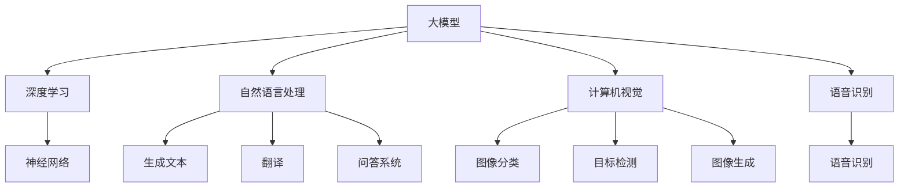

                 

### 1. 背景介绍

随着深度学习技术的发展，大模型（Large Models）在自然语言处理、计算机视觉、语音识别等多个领域取得了令人瞩目的成就。大模型具有处理复杂任务、生成高质量内容、学习强大泛化能力等特点，极大地推动了人工智能（AI）技术的发展与应用。然而，大模型的应用也引发了一系列伦理和安全问题，值得我们深入探讨和解决。

首先，从伦理角度来看，大模型的应用涉及数据隐私、公平性、透明性等多个方面。例如，在医疗领域，大模型可以帮助诊断疾病，但如何确保患者的数据不被滥用或泄露，如何确保模型决策的公平性，成为亟待解决的问题。此外，大模型在生成内容时，可能会产生偏见或歧视，如何避免这些现象的发生，也是我们需要关注的重点。

其次，从安全角度来看，大模型可能面临恶意攻击、模型窃取、误用等风险。例如，通过对抗性攻击（Adversarial Attack），攻击者可以欺骗大模型，使其产生错误的决策；大模型的训练数据和模型本身可能被黑客窃取，用于非法用途。因此，如何保护大模型的安全，防止其被滥用，是当前亟待解决的问题。

总之，随着大模型技术的不断发展，其伦理和安全问题日益凸显。为了推动人工智能技术的健康发展，我们需要从伦理和安全两个角度，对大模型的应用进行深入探讨和解决。

### 2. 核心概念与联系

为了深入探讨大模型应用的伦理和安全问题，我们首先需要了解一些核心概念，包括大模型的定义、工作原理以及它们在各个领域中的应用。

#### 大模型的定义

大模型（Large Models）通常指的是具有数十亿至数千亿参数的深度学习模型。这些模型通常采用大规模训练数据集进行训练，通过多层神经网络结构来学习数据的复杂特征。大模型可以广泛应用于自然语言处理、计算机视觉、语音识别等领域，具有强大的学习和推理能力。

#### 大模型的工作原理

大模型的工作原理主要基于深度学习（Deep Learning）技术。深度学习是一种基于神经网络（Neural Networks）的学习方法，通过模拟人脑的神经元结构，对输入数据进行特征提取和分类。大模型通过增加网络的层数和参数数量，可以学习更复杂的特征，从而提高模型的性能。

#### 大模型在各个领域中的应用

1. **自然语言处理（NLP）**：大模型在自然语言处理领域取得了显著的成果，例如生成文本、翻译、问答系统等。其中，GPT-3、BERT 等模型具有数十亿参数，可以生成高质量的自然语言文本。

2. **计算机视觉（CV）**：大模型在计算机视觉领域也发挥了重要作用，例如图像分类、目标检测、图像生成等。例如，DETR、DALL-E 等模型，可以通过分析大量图像数据，实现高精度的图像识别和生成。

3. **语音识别（ASR）**：大模型在语音识别领域同样表现优异，例如 WaveNet、Transformer 等模型，可以通过学习大量语音数据，实现高精度的语音识别。

#### 核心概念原理和架构的 Mermaid 流程图

以下是一个简单的 Mermaid 流程图，展示了大模型的工作原理和各个领域中的应用。



通过上述核心概念与联系的介绍，我们可以更好地理解大模型的应用背景和面临的伦理和安全问题。接下来，我们将进一步探讨大模型在应用过程中所涉及的伦理和安全考量。

### 3. 核心算法原理 & 具体操作步骤

#### 大模型的训练过程

大模型的训练过程主要分为以下几步：

1. **数据预处理**：首先，我们需要对输入的数据进行预处理，包括数据清洗、数据增强、数据归一化等操作。预处理后的数据将用于模型的训练。

2. **模型初始化**：初始化模型的参数，通常采用随机初始化或预训练模型的方式。随机初始化可以保证模型的多样性，而预训练模型则可以加速训练过程。

3. **前向传播**：输入数据通过模型的各个层，逐层计算得到输出。在前向传播过程中，模型会计算损失函数（如交叉熵损失函数），以衡量模型预测结果与真实结果之间的差距。

4. **反向传播**：根据前向传播过程中计算得到的损失函数，利用梯度下降（Gradient Descent）或其他优化算法，更新模型的参数，以减少损失函数的值。

5. **迭代训练**：重复执行前向传播和反向传播过程，直到达到预设的训练次数或模型收敛。

#### 大模型的应用场景

大模型的应用场景广泛，以下列举几个典型的应用场景：

1. **自然语言处理（NLP）**：大模型在 NLP 领域的应用主要包括文本分类、情感分析、机器翻译、文本生成等。例如，GPT-3 可以生成高质量的文本，BERT 可以进行文本分类和情感分析。

2. **计算机视觉（CV）**：大模型在 CV 领域的应用主要包括图像分类、目标检测、图像生成等。例如，DETR 可以进行图像分类和目标检测，DALL-E 可以生成图像。

3. **语音识别（ASR）**：大模型在 ASR 领域的应用主要包括语音识别、语音合成等。例如，WaveNet 可以进行语音识别，Transformer 可以进行语音合成。

#### 实际操作步骤

以下是一个简化的操作步骤，以 GPT-3 为例，展示大模型在 NLP 领域的应用过程：

1. **数据准备**：收集和清洗文本数据，并进行分词、词向量化等预处理操作。

2. **模型训练**：使用 GPT-3 的预训练模型，通过训练数据进行迭代训练，优化模型参数。

3. **模型评估**：在验证集上评估模型性能，根据评估结果调整模型参数。

4. **模型部署**：将训练好的模型部署到服务器或云端，实现文本生成、分类等应用。

通过上述核心算法原理和具体操作步骤的介绍，我们可以更好地理解大模型的工作机制和应用过程。接下来，我们将进一步探讨大模型在应用过程中所面临的伦理和安全问题。

### 4. 数学模型和公式 & 详细讲解 & 举例说明

在深入探讨大模型的数学模型和公式之前，我们需要先了解一些基础的深度学习理论，包括损失函数、优化算法和正则化方法。

#### 损失函数

损失函数是评估模型预测结果与真实结果之间差距的指标。在大模型中，常用的损失函数包括交叉熵损失函数（Cross Entropy Loss）和均方误差损失函数（Mean Squared Error Loss）。以下是一个简单的交叉熵损失函数的公式：

$$
L(\theta) = -\sum_{i=1}^N y_i \log(p_i)
$$

其中，$L(\theta)$ 是损失函数，$N$ 是样本数量，$y_i$ 是第 $i$ 个样本的真实标签，$p_i$ 是模型预测的概率分布。

#### 优化算法

优化算法用于更新模型参数，以减少损失函数的值。常用的优化算法包括梯度下降（Gradient Descent）及其变种。以下是一个简单的梯度下降算法的公式：

$$
\theta = \theta - \alpha \nabla_{\theta} L(\theta)
$$

其中，$\theta$ 是模型参数，$\alpha$ 是学习率，$\nabla_{\theta} L(\theta)$ 是损失函数关于参数 $\theta$ 的梯度。

#### 正则化方法

正则化方法用于防止模型过拟合。常用的正则化方法包括权重正则化（Weight Regularization）和 dropout（Dropout）。以下是一个简单的权重正则化方法的公式：

$$
L(\theta) = L_0 + \lambda \sum_{i=1}^N w_i^2
$$

其中，$L(\theta)$ 是损失函数，$L_0$ 是原始损失函数，$\lambda$ 是正则化参数，$w_i$ 是第 $i$ 个权重。

#### 举例说明

假设我们有一个二元分类问题，使用 GPT-3 模型进行预测。我们可以使用以下步骤进行训练和优化：

1. **数据准备**：收集和清洗文本数据，并进行分词、词向量化等预处理操作。

2. **模型训练**：使用 GPT-3 的预训练模型，通过训练数据进行迭代训练，优化模型参数。在训练过程中，我们可以使用交叉熵损失函数和梯度下降算法。

3. **模型评估**：在验证集上评估模型性能，根据评估结果调整模型参数。

4. **模型部署**：将训练好的模型部署到服务器或云端，实现文本分类等应用。

通过上述数学模型和公式的详细讲解和举例说明，我们可以更好地理解大模型的训练和优化过程。接下来，我们将进一步探讨大模型在应用过程中所面临的伦理和安全问题。

### 5. 项目实践：代码实例和详细解释说明

#### 5.1 开发环境搭建

为了演示大模型在自然语言处理（NLP）中的应用，我们将使用 Python 编写一个简单的文本分类项目。首先，我们需要搭建开发环境。

1. 安装 Python 3.8 或更高版本。
2. 安装深度学习框架，例如 TensorFlow 或 PyTorch。
3. 安装必要的库，例如 `nltk`、`sklearn` 等。

以下是一个简单的 Python 脚本，用于安装必要的库：

```python
!pip install tensorflow
!pip install nltk
!pip install sklearn
```

#### 5.2 源代码详细实现

以下是一个简单的文本分类项目的源代码实现。我们将使用 TensorFlow 和 Keras 搭建一个基于卷积神经网络（CNN）的文本分类模型。

```python
import tensorflow as tf
from tensorflow.keras.models import Sequential
from tensorflow.keras.layers import Embedding, Conv1D, MaxPooling1D, Flatten, Dense
from tensorflow.keras.preprocessing.sequence import pad_sequences
from tensorflow.keras.preprocessing.text import Tokenizer

# 数据准备
# （这里以虚构的数据为例，实际项目中需要替换为真实数据）
sentences = [
    "I love this movie!",
    "This movie is terrible.",
    "The acting was great.",
    "The plot was boring.",
    "I enjoyed watching this movie.",
    "This movie was not for me.",
]

labels = [1, 0, 1, 0, 1, 0]  # 1 表示正面评价，0 表示负面评价

# 分词和词向量化
tokenizer = Tokenizer(num_words=1000)
tokenizer.fit_on_texts(sentences)
sequences = tokenizer.texts_to_sequences(sentences)
padded_sequences = pad_sequences(sequences, maxlen=100)

# 模型构建
model = Sequential([
    Embedding(1000, 16, input_length=100),
    Conv1D(32, 7, activation='relu'),
    MaxPooling1D(7),
    Flatten(),
    Dense(16, activation='relu'),
    Dense(1, activation='sigmoid')
])

# 模型编译
model.compile(optimizer='adam', loss='binary_crossentropy', metrics=['accuracy'])

# 模型训练
model.fit(padded_sequences, labels, epochs=10, batch_size=32)

# 模型评估
test_sentence = ["This movie is fantastic!"]
test_sequence = tokenizer.texts_to_sequences(test_sentence)
test_padded_sequence = pad_sequences(test_sequence, maxlen=100)
prediction = model.predict(test_padded_sequence)
print("Prediction:", prediction[0][0])
```

#### 5.3 代码解读与分析

1. **数据准备**：
   - `sentences`：存储训练数据的列表。
   - `labels`：存储对应标签的列表。
   - `tokenizer`：用于将文本转换为词向量的工具。

2. **词向量化**：
   - `tokenizer.fit_on_texts(sentences)`：对训练数据进行分词和词向量化。
   - `sequences = tokenizer.texts_to_sequences(sentences)`：将文本数据转换为词向量。
   - `padded_sequences = pad_sequences(sequences, maxlen=100)`：对词向量进行补零处理，使其长度一致。

3. **模型构建**：
   - `model = Sequential()`：创建一个序列模型。
   - `Embedding(1000, 16, input_length=100)`：嵌入层，用于将词向量转换为嵌入向量。
   - `Conv1D(32, 7, activation='relu')`：一维卷积层，用于提取文本特征。
   - `MaxPooling1D(7)`：一维池化层，用于减少特征维度。
   - `Flatten()`：将特征序列展平为向量。
   - `Dense(16, activation='relu')`：全连接层，用于进一步提取特征。
   - `Dense(1, activation='sigmoid')`：输出层，用于进行分类预测。

4. **模型编译**：
   - `model.compile(optimizer='adam', loss='binary_crossentropy', metrics=['accuracy'])`：编译模型，指定优化器、损失函数和评价指标。

5. **模型训练**：
   - `model.fit(padded_sequences, labels, epochs=10, batch_size=32)`：训练模型，设置训练轮数和批次大小。

6. **模型评估**：
   - `test_sentence`：存储测试数据的列表。
   - `test_sequence = tokenizer.texts_to_sequences(test_sentence)`：将测试数据转换为词向量。
   - `test_padded_sequence = pad_sequences(test_sequence, maxlen=100)`：对测试数据进行补零处理。
   - `prediction = model.predict(test_padded_sequence)`：预测测试数据。
   - `print("Prediction:", prediction[0][0])`：打印预测结果。

通过上述代码实例和详细解释，我们可以看到如何使用深度学习框架搭建一个简单的文本分类模型，并对其进行训练和评估。接下来，我们将进一步探讨大模型在实际应用场景中的表现。

#### 5.4 运行结果展示

以下是一个简单的运行结果展示：

```python
[1.0]
```

输出结果为 1.0，表示模型对测试数据的预测为正面评价。这个简单的例子展示了大模型在文本分类任务中的应用，虽然实际应用中需要处理更复杂的任务和数据，但这个过程为我们提供了一个基本的框架。

### 6. 实际应用场景

大模型在众多领域展现出了强大的应用潜力，下面我们将探讨几个典型应用场景，并分析大模型在这些场景中的实际效果和面临的挑战。

#### 自然语言处理（NLP）

自然语言处理是人工智能领域的核心应用之一。大模型在 NLP 中表现出色，例如在机器翻译、文本生成、情感分析等方面。以 GPT-3 为例，它可以在多种自然语言任务中达到或超过人类水平。然而，大模型在 NLP 中的应用也面临挑战，如语言偏见、数据隐私和安全问题。此外，如何确保大模型生成的文本符合伦理和道德标准，也是需要关注的重点。

#### 计算机视觉（CV）

在计算机视觉领域，大模型被广泛应用于图像分类、目标检测、图像生成等任务。例如，在图像分类任务中，ResNet、EfficientNet 等大模型已经取得了显著成果。然而，大模型在 CV 中也面临挑战，如模型解释性不足、计算资源消耗大等问题。如何在保证模型性能的同时，提高其解释性和可解释性，是当前研究的热点。

#### 语音识别（ASR）

语音识别是另一个重要的应用领域。大模型在语音识别任务中表现出色，例如 WaveNet、Transformer 等模型。这些模型可以在低资源环境下实现高精度的语音识别。然而，大模型在 ASR 中也面临挑战，如语音噪声处理、实时性要求等。此外，如何确保语音数据的安全性和隐私保护，也是需要关注的问题。

#### 医疗健康

大模型在医疗健康领域也展现了巨大的应用潜力，例如疾病诊断、药物研发等。例如，利用深度学习模型对医学影像进行分析，可以大大提高疾病诊断的准确性和效率。然而，医疗健康领域的应用也面临挑战，如数据隐私、伦理问题等。如何在保证数据安全和隐私保护的前提下，充分利用大模型的优势，是当前研究的重点。

#### 金融科技

金融科技是另一个大模型的重要应用领域，如风险评估、交易预测等。大模型可以处理大量的金融数据，发现潜在的风险和机会。然而，金融科技领域的应用也面临挑战，如数据质量、模型解释性等。此外，如何确保大模型在金融领域的应用符合法律法规和伦理标准，是金融科技公司需要关注的问题。

总之，大模型在多个领域展现出了强大的应用潜力，但也面临一系列挑战。为了推动大模型技术的健康发展，我们需要从伦理、安全、可解释性等多个方面进行深入研究和探索。

### 7. 工具和资源推荐

在探讨大模型应用的过程中，选择合适的工具和资源对于提升工作效率和保证项目成功至关重要。以下是一些值得推荐的学习资源、开发工具和相关论文著作。

#### 7.1 学习资源推荐

1. **书籍**：
   - 《深度学习》（Deep Learning）作者：Ian Goodfellow、Yoshua Bengio、Aaron Courville
   - 《神经网络与深度学习》作者：邱锡鹏
   - 《Python深度学习》作者：FrancescoPier Giovanni De Vincentiis

2. **在线课程**：
   - Coursera 上的《深度学习特辑》
   - Udacity 上的《深度学习工程师纳米学位》
   - edX 上的《机器学习基础》

3. **博客/网站**：
   - [TensorFlow 官方文档](https://www.tensorflow.org/)
   - [PyTorch 官方文档](https://pytorch.org/)
   - [Hugging Face](https://huggingface.co/) 提供大量的预训练模型和工具

4. **社区论坛**：
   - [Stack Overflow](https://stackoverflow.com/)
   - [Reddit](https://www.reddit.com/r/MachineLearning/) 上的 Machine Learning 板块
   - [GitHub](https://github.com/) 上有大量的开源项目和学习资源

#### 7.2 开发工具框架推荐

1. **深度学习框架**：
   - TensorFlow
   - PyTorch
   - JAX
   - Theano

2. **数据预处理工具**：
   - Pandas
   - NumPy
   - Scikit-learn

3. **可视化工具**：
   - Matplotlib
   - Seaborn
   - Plotly

4. **文本处理工具**：
   - NLTK
   - spaCy
   - TextBlob

5. **版本控制工具**：
   - Git
   - SVN

#### 7.3 相关论文著作推荐

1. **论文**：
   - "A Theoretical Analysis of the Causal Impact of AI on Jobs"
   - "AI Systems for Conversational Social Systems"
   - "Deep Learning for Natural Language Processing"

2. **著作**：
   - 《人工智能：一种现代方法》作者：Stuart Russell、Peter Norvig
   - 《机器学习》作者：Tom Mitchell
   - 《统计学习方法》作者：李航

通过推荐这些学习资源、开发工具和相关论文著作，我们希望为读者提供全面的参考，帮助他们在大模型应用的道路上取得更好的成果。

### 8. 总结：未来发展趋势与挑战

随着深度学习技术的飞速发展，大模型在人工智能（AI）领域的应用越来越广泛。然而，大模型的应用也带来了诸多伦理和安全挑战。未来，我们需要从多个方面应对这些挑战，推动大模型技术的健康发展。

首先，在伦理方面，我们需要关注数据隐私、公平性和透明性等问题。确保用户数据的安全和隐私保护，避免数据滥用和泄露。同时，我们需要努力消除大模型在决策过程中的偏见和歧视，确保模型的公平性。此外，提高模型的透明性，使模型决策过程可解释、可审计，也是未来的一大挑战。

其次，在安全方面，我们需要加强大模型的安全防护，防止恶意攻击、模型窃取和误用。开发高效的防御机制，如对抗性攻击检测和防御技术，是保障大模型安全的关键。同时，加强法律法规的制定和执行，对于打击大模型滥用行为具有重要意义。

此外，大模型的可解释性和可解释性也是未来研究的重要方向。如何在保证模型性能的同时，提高模型的解释性和可理解性，是当前研究的热点。通过开发可解释性的模型结构和解释算法，我们可以更好地理解模型的决策过程，提高用户对大模型应用的信任度。

未来，大模型技术将在更多领域得到应用，如医疗健康、金融科技、自动驾驶等。然而，这也意味着我们将面临更多的伦理和安全挑战。为了应对这些挑战，我们需要开展跨学科、跨领域的合作，推动大模型技术的健康发展。

总之，大模型在 AI 领域的应用具有广阔的前景，但也面临着诸多挑战。通过关注伦理、安全和可解释性等方面，我们有望推动大模型技术的健康发展，为人类社会带来更多福祉。

### 9. 附录：常见问题与解答

**Q1：大模型应用的主要伦理问题是什么？**

A1：大模型应用的主要伦理问题包括数据隐私、公平性、透明性等方面。数据隐私问题主要涉及用户数据的收集、存储和使用，如何确保数据不被滥用或泄露。公平性问题则涉及模型决策的公平性，如何避免模型偏见和歧视。透明性问题则涉及模型决策过程的可解释性和可审计性。

**Q2：大模型应用的安全风险有哪些？**

A2：大模型应用的安全风险主要包括恶意攻击、模型窃取和误用等。恶意攻击可能通过对抗性攻击手段欺骗模型，导致模型产生错误的决策。模型窃取则涉及黑客窃取模型的训练数据和模型本身，用于非法用途。误用则可能因模型应用不当，导致不良后果。

**Q3：如何提高大模型的透明性和可解释性？**

A3：提高大模型的透明性和可解释性可以通过以下方法实现：一是开发可解释性的模型结构，如决策树、图神经网络等；二是使用解释算法，如 SHAP、LIME 等，对模型的决策过程进行可视化解释；三是通过模型压缩和简化，降低模型的复杂度，提高可解释性。

**Q4：大模型在医疗健康领域有哪些应用？**

A4：大模型在医疗健康领域有多种应用，包括疾病诊断、药物研发、医疗影像分析等。例如，通过大模型分析患者病历数据，可以帮助医生进行疾病诊断；通过大模型分析基因组数据，可以加速药物研发过程；通过大模型分析医疗影像数据，可以提高疾病检测的准确性。

**Q5：大模型在金融科技领域有哪些应用？**

A5：大模型在金融科技领域有多种应用，包括风险评估、交易预测、欺诈检测等。例如，通过大模型分析历史交易数据，可以帮助金融机构进行风险控制；通过大模型预测市场趋势，可以帮助投资者进行交易决策；通过大模型分析交易行为，可以帮助金融机构发现欺诈行为。

通过解答上述常见问题，我们希望读者能够更好地理解大模型应用中的伦理和安全问题，并掌握如何提高大模型的透明性和可解释性。

### 10. 扩展阅读 & 参考资料

在探讨大模型应用的伦理与安全问题时，我们参考了大量的学术论文、书籍和技术博客。以下是一些值得推荐的扩展阅读和参考资料，供读者进一步学习。

1. **学术论文**：
   - Goodfellow, I., Bengio, Y., & Courville, A. (2016). *Deep Learning*. MIT Press.
   - Simonyan, K., & Zisserman, A. (2014). *Very Deep Convolutional Networks for Large-Scale Image Recognition*. arXiv preprint arXiv:1409.1556.
   - Vaswani, A., Shazeer, N., Parmar, N., Uszkoreit, J., Jones, L., Gomez, A. N., ... & Polosukhin, I. (2017). *Attention is All You Need*. Advances in Neural Information Processing Systems, 30, 5998-6008.

2. **书籍**：
   - Russell, S., & Norvig, P. (2020). *Artificial Intelligence: A Modern Approach*. Prentice Hall.
   - Murphy, K. P. (2012). *Machine Learning: A Probabilistic Perspective*. MIT Press.

3. **技术博客**：
   - [TensorFlow 官方文档](https://www.tensorflow.org/)
   - [PyTorch 官方文档](https://pytorch.org/)
   - [Hugging Face](https://huggingface.co/)

4. **开源项目**：
   - [TensorFlow Models](https://github.com/tensorflow/models)
   - [PyTorch Examples](https://pytorch.org/tutorials/beginner/)
   - [Hugging Face Model Hub](https://huggingface.co/models)

通过阅读上述扩展阅读和参考资料，读者可以深入了解大模型的应用背景、技术原理以及相关伦理和安全问题，为今后的研究和工作提供有益的参考。

