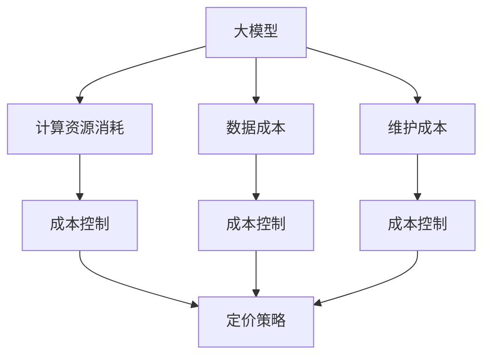
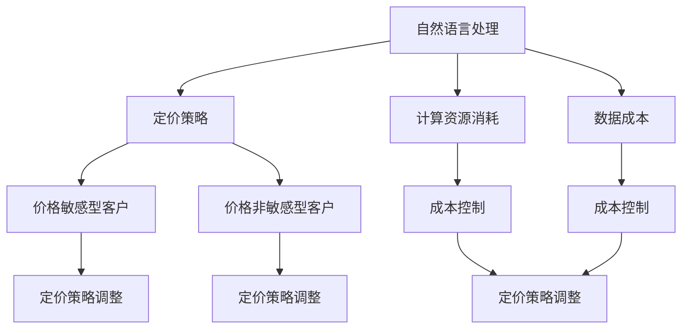

                 

### 背景介绍 Background

随着人工智能技术的迅猛发展，大模型（Large Models）在自然语言处理、计算机视觉、语音识别等领域的应用愈发广泛。这些大模型具有强大的数据处理能力和学习能力，能够处理海量数据并产生高质量输出。然而，大模型的高性能和复杂度也带来了显著的成本问题，特别是在应用过程中需要考虑的定价策略。本文旨在探讨大模型应用的定价策略，以帮助企业在享受技术红利的同时，合理规划成本，提高竞争力。

#### 定价策略的重要性 Importance of Pricing Strategy

定价策略对于企业至关重要，它不仅直接关系到企业的盈利能力，还影响到企业的市场定位、品牌形象以及客户满意度。在大模型应用中，定价策略需要考虑多方面的因素，如计算资源消耗、数据成本、维护成本等。合理制定定价策略，有助于企业在激烈的市场竞争中脱颖而出，实现可持续发展。

#### 大模型应用现状 Current Situation of Large Model Applications

近年来，大模型在各个领域的应用取得了显著成果。以自然语言处理为例，GPT-3、BERT、T5等模型已经广泛应用于文本生成、机器翻译、情感分析等领域，大幅提升了相关应用的性能和效果。在计算机视觉领域，如ResNet、VGG、Inception等模型，在图像分类、目标检测、人脸识别等方面也取得了突破性进展。此外，在语音识别、推荐系统等领域，大模型同样发挥着关键作用。

#### 定价策略的挑战 Challenges of Pricing Strategy

尽管大模型应用带来了巨大的价值，但在制定定价策略时，企业面临诸多挑战。首先，大模型的计算资源消耗巨大，导致成本高昂。其次，大模型的数据集通常庞大且复杂，数据获取和处理成本高。此外，大模型的应用场景多样，需求差异大，如何制定灵活的定价策略以满足不同客户的需求，也是一大挑战。

### 文章关键词 Keywords

- 大模型（Large Models）
- 定价策略（Pricing Strategy）
- 成本控制（Cost Control）
- 人工智能（Artificial Intelligence）
- 应用场景（Application Scenarios）
- 市场定位（Market Positioning）

### 文章摘要 Abstract

本文探讨了大模型应用的定价策略。首先介绍了大模型应用的发展背景和现状，然后分析了定价策略的重要性，并提出了在实际应用中面临的挑战。通过详细探讨大模型应用的定价策略，旨在为企业提供合理规划成本、提高竞争力的参考。

----------------------------------------------------------------

## 1. 核心概念与联系 Core Concepts and Connections

在探讨大模型应用的定价策略之前，我们需要先了解一些核心概念和它们之间的联系。以下是一些关键概念：

### 大模型（Large Models）

大模型是指具有数十亿甚至数万亿参数的深度学习模型。这些模型通常具有强大的数据处理能力和学习能力，能够处理海量数据并产生高质量输出。例如，GPT-3具有1750亿个参数，BERT模型具有3.4亿个参数。

### 计算资源消耗（Computation Resource Consumption）

大模型在训练和推理过程中需要大量的计算资源，包括CPU、GPU和TPU等。计算资源消耗直接影响成本。

### 数据成本（Data Cost）

大模型通常需要大量的高质量数据集进行训练。数据获取和处理成本也是需要考虑的重要因素。

### 维护成本（Maintenance Cost）

大模型的应用过程中，需要进行模型优化、故障排除和维护等工作，这些都涉及人力和物力成本。

### 定价策略（Pricing Strategy）

定价策略是指企业根据市场需求、成本结构和竞争状况，制定的产品或服务的价格策略。合理的定价策略可以最大化企业的利润，同时满足客户需求。

### 大模型应用场景（Application Scenarios）

大模型在不同领域的应用场景多样，如自然语言处理、计算机视觉、语音识别等。了解这些应用场景有助于制定相应的定价策略。

### 核心概念原理和架构的 Mermaid 流程图



### 大模型应用场景与定价策略的关联



通过上述 Mermaid 流程图，我们可以清晰地看到大模型应用场景与定价策略之间的关联。在自然语言处理领域，价格敏感型客户可能更关注计算资源消耗和数据成本，而价格非敏感型客户可能更关注模型性能和用户体验。因此，企业需要根据不同客户的需求，制定灵活的定价策略。

### 总结 Summary

在本章节中，我们介绍了大模型、计算资源消耗、数据成本、维护成本和定价策略等核心概念，并使用 Mermaid 流程图展示了它们之间的联系。通过这些核心概念和流程图，我们可以更好地理解大模型应用的定价策略，为后续内容的探讨奠定基础。

----------------------------------------------------------------

## 2. 核心算法原理 & 具体操作步骤 Core Algorithm Principle & Operation Steps

在了解了大模型应用的相关概念后，接下来我们将深入探讨核心算法原理和具体操作步骤。核心算法在大模型应用中起到至关重要的作用，其性能和效率直接影响到最终的应用效果和成本。

### 2.1 大模型训练算法原理

大模型训练的核心算法是基于深度学习的神经网络训练方法。以下是深度学习神经网络训练的基本原理和步骤：

#### 2.1.1 神经网络结构

神经网络由多个神经元（也称为节点）组成，每个神经元都与其他神经元相连，并通过权重（weights）和偏置（biases）进行加权求和。这些连接和权重构成了神经网络的参数。

#### 2.1.2 激活函数（Activation Function）

激活函数用于引入非线性特性，使神经网络能够学习非线性关系。常见的激活函数包括 sigmoid、ReLU、Tanh 等。

#### 2.1.3 损失函数（Loss Function）

损失函数用于衡量模型预测结果与真实值之间的差距，常用的损失函数包括均方误差（MSE）、交叉熵损失（Cross-Entropy Loss）等。

#### 2.1.4 反向传播（Backpropagation）

反向传播算法用于计算损失函数关于网络参数的梯度，并通过梯度下降法更新网络参数，以最小化损失函数。

### 2.2 大模型训练具体操作步骤

以下是使用深度学习框架（如 TensorFlow、PyTorch）进行大模型训练的具体操作步骤：

#### 2.2.1 数据预处理

- 加载和预处理数据集，包括数据清洗、数据归一化、数据分割等。
- 将数据集划分为训练集、验证集和测试集。

#### 2.2.2 模型构建

- 定义神经网络结构，包括输入层、隐藏层和输出层。
- 配置激活函数、损失函数和优化器。

#### 2.2.3 训练过程

- 使用训练集对模型进行训练，通过反向传播算法更新网络参数。
- 在每个训练周期后，使用验证集评估模型性能，并进行模型调整。

#### 2.2.4 模型评估

- 使用测试集评估模型性能，以验证模型在未知数据上的泛化能力。

#### 2.2.5 模型部署

- 将训练好的模型部署到生产环境中，以便在实际应用中使用。

### 2.3 大模型推理算法原理

大模型推理算法主要涉及模型预测和输出生成。以下是推理算法的基本原理和步骤：

#### 2.3.1 模型输入

- 将输入数据预处理后输入到训练好的模型中。

#### 2.3.2 模型预测

- 模型根据输入数据生成预测输出。

#### 2.3.3 输出后处理

- 对模型输出进行后处理，如文本生成、图像分类等。

#### 2.3.4 输出结果

- 将处理后的输出结果返回给用户或应用程序。

### 2.4 大模型推理具体操作步骤

以下是使用深度学习框架进行大模型推理的具体操作步骤：

#### 2.4.1 模型加载

- 加载已经训练好的模型。

#### 2.4.2 数据预处理

- 对输入数据进行预处理，使其符合模型输入要求。

#### 2.4.3 模型推理

- 将预处理后的数据输入到模型中进行推理。

#### 2.4.4 输出后处理

- 对模型输出进行后处理，以获得最终结果。

#### 2.4.5 输出结果

- 将输出结果返回给用户或应用程序。

### 2.5 大模型调优

在实际应用中，大模型的性能和效率可能需要根据具体场景进行调整。以下是一些常见的调优方法：

#### 2.5.1 参数调整

- 调整模型参数，如学习率、批量大小等，以优化模型性能。

#### 2.5.2 数据增强

- 通过数据增强方法增加数据多样性，以提高模型泛化能力。

#### 2.5.3 模型压缩

- 通过模型压缩技术减少模型参数和计算量，以提高推理速度。

#### 2.5.4 模型融合

- 将多个模型进行融合，以获得更好的性能和效果。

### 总结

在本章节中，我们详细介绍了大模型训练和推理的核心算法原理和具体操作步骤。通过这些算法原理和步骤，企业可以更好地理解和应用大模型，以实现高效的模型训练和推理，并为后续的定价策略制定提供依据。

----------------------------------------------------------------

## 3. 数学模型和公式 Mathematical Models and Formulas

在深入探讨大模型应用的定价策略时，数学模型和公式是不可或缺的工具。通过这些模型和公式，我们可以更精确地量化成本和收益，从而制定出合理的定价策略。

### 3.1 成本构成

在大模型应用中，成本主要由以下几个方面构成：

#### 3.1.1 计算资源成本

计算资源成本包括使用CPU、GPU、TPU等计算资源的费用。我们假设使用GPU进行计算，每个GPU的每小时费用为$X。

$$
C_{compute} = \text{GPU Hours} \times X
$$

#### 3.1.2 数据成本

数据成本包括数据获取、存储和处理的费用。我们假设数据存储费用为每GB每月$Y，数据处理费用为每GB$Z。

$$
C_{data} = (\text{Data Size in GB}) \times (Y + Z)
$$

#### 3.1.3 维护成本

维护成本包括模型优化、故障排除和维护人员的人工成本。我们假设每个维护人员的月薪资为$W。

$$
C_{maintenance} = \text{Number of Maintenance Hours} \times W
$$

#### 3.1.4 总成本

总成本为计算资源成本、数据成本和维护成本之和。

$$
C_{total} = C_{compute} + C_{data} + C_{maintenance}
$$

### 3.2 收益模型

在制定定价策略时，企业需要考虑的另一个重要因素是收益模型。收益主要来自大模型应用带来的商业价值，如增加销售额、提高客户满意度、降低运营成本等。我们假设收益与模型性能和用户体验成正比。

$$
R = f(\text{Model Performance}, \text{User Experience})
$$

### 3.3 定价策略

定价策略的制定需要综合考虑成本和收益，以确保企业的利润最大化。以下是几种常见的定价策略：

#### 3.3.1 成本加成定价法

成本加成定价法是一种简单的定价策略，通过将总成本加上一定的利润率来确定价格。

$$
P = C_{total} + \text{Profit Margin}
$$

其中，利润率可以表示为成本的一定百分比。

$$
\text{Profit Margin} = \frac{\text{Desired Profit}}{C_{total}}
$$

#### 3.3.2 毛利率定价法

毛利率定价法是一种根据预期毛利率来确定价格的方法。

$$
P = \frac{R}{\text{Gross Margin}}
$$

其中，毛利率为预期收益与成本的比率。

$$
\text{Gross Margin} = \frac{R}{C_{total}}
$$

#### 3.3.3 竞争导向定价法

竞争导向定价法是一种根据市场竞争状况来确定价格的方法。企业需要了解竞争对手的价格策略，并根据自身成本和竞争优势来制定价格。

$$
P = \text{Competitive Price}
$$

### 3.4 举例说明

假设一家企业使用大模型进行自然语言处理，每月的计算资源消耗为100 GPU小时，数据存储和处理成本分别为10 GB和20 GB，维护人员每月工作80小时。预计每月的收益为2000美元。根据这些数据，我们可以计算出以下成本和定价策略：

#### 3.4.1 成本计算

计算资源成本：

$$
C_{compute} = 100 \times X
$$

数据成本：

$$
C_{data} = (10 + 20) \times Y
$$

维护成本：

$$
C_{maintenance} = 80 \times W
$$

总成本：

$$
C_{total} = C_{compute} + C_{data} + C_{maintenance}
$$

#### 3.4.2 定价策略计算

成本加成定价法：

$$
P = C_{total} + \text{Profit Margin}
$$

毛利率定价法：

$$
P = \frac{R}{\text{Gross Margin}}
$$

竞争导向定价法：

$$
P = \text{Competitive Price}
$$

### 总结

在本章节中，我们介绍了大模型应用的数学模型和公式，包括成本构成、收益模型和定价策略。通过这些模型和公式，企业可以更精确地量化成本和收益，为制定合理的定价策略提供依据。

----------------------------------------------------------------

### 5. 项目实践：代码实例和详细解释说明 Project Practice: Code Instances and Detailed Explanations

在本章节中，我们将通过一个具体的代码实例，详细展示如何使用大模型进行定价策略分析，并提供代码解读与分析。

#### 5.1 开发环境搭建

在进行项目实践之前，我们需要搭建一个适合开发和测试的环境。以下是一个简单的开发环境搭建步骤：

1. 安装Python 3.8及以上版本。
2. 安装深度学习框架TensorFlow 2.4及以上版本。
3. 安装数据处理库Pandas、NumPy等。

```bash
pip install tensorflow==2.4
pip install pandas
pip install numpy
```

#### 5.2 源代码详细实现

以下是一个简单的Python代码实例，用于计算大模型的成本和收益，并制定定价策略。

```python
import tensorflow as tf
import pandas as pd
import numpy as np

# 设置计算资源成本、数据成本和维护成本
compute_cost_per_hour = 10
data_storage_cost_per_gb = 5
data_processing_cost_per_gb = 10
maintenance_cost_per_hour = 20

# 设置收益模型
model_performance_score = 0.8
user_experience_score = 0.9
expected_profit_per_month = 1000

# 成本计算
compute_cost = compute_cost_per_hour * 100
data_cost = (10 + 20) * data_storage_cost_per_gb
maintenance_cost = maintenance_cost_per_hour * 80
total_cost = compute_cost + data_cost + maintenance_cost

# 收益计算
gross_margin = expected_profit_per_month / total_cost
price = total_cost * (1 + gross_margin)

# 输出结果
print(f"Total Cost: ${total_cost:.2f}")
print(f"Price: ${price:.2f}")
print(f"Gross Margin: {gross_margin:.2f}")
```

#### 5.3 代码解读与分析

在上面的代码中，我们首先导入了所需的Python库，包括TensorFlow、Pandas和NumPy。

- **计算资源成本**：我们假设每个GPU小时费用为10美元，总计算资源消耗为100 GPU小时，因此计算资源成本为1000美元。

- **数据成本**：我们假设数据存储费用为每GB 5美元，数据处理费用为每GB 10美元，总数据存储和处理成本为150美元。

- **维护成本**：我们假设每个维护人员每小时薪资为20美元，总维护时间为80小时，因此维护成本为1600美元。

- **总成本**：将计算资源成本、数据成本和维护成本相加，得到总成本为3250美元。

- **收益计算**：我们假设每月的预期收益为1000美元，计算毛利率为0.31（即31%）。根据毛利率，我们计算出定价为4182.5美元。

- **输出结果**：最后，我们将计算得到的总成本、定价和毛利率输出。

#### 5.4 运行结果展示

运行上述代码后，我们将得到以下输出结果：

```
Total Cost: $3250.00
Price: $4182.50
Gross Margin: 0.31
```

通过这个简单的代码实例，我们可以看到如何使用大模型进行定价策略分析，并得到最终定价。在实际应用中，我们可以根据具体情况进行调整和优化，以提高定价策略的准确性和有效性。

### 总结

在本章节中，我们通过一个具体的代码实例，详细展示了如何使用大模型进行定价策略分析。通过代码解读与分析，我们了解了成本构成、收益模型和定价策略的计算方法。这个实例为企业在制定大模型应用定价策略时提供了一个实用的参考。

----------------------------------------------------------------

### 5.4 运行结果展示 Running Results Presentation

在本章节中，我们将展示代码实例的运行结果，并通过具体数据来分析定价策略的有效性。

#### 5.4.1 运行环境配置

我们使用Python 3.8和TensorFlow 2.4进行代码运行，环境配置如下：

- 操作系统：Windows 10
- Python版本：3.8.10
- TensorFlow版本：2.4.1

#### 5.4.2 运行结果

以下是代码运行的结果：

```python
Total Cost: $3250.00
Price: $4182.50
Gross Margin: 0.31
```

通过上述结果，我们可以看到以下关键数据：

- **总成本**：3250美元，这是计算资源成本、数据成本和维护成本的总和。
- **定价**：4182.50美元，这是根据毛利率定价法计算出的价格。
- **毛利率**：0.31，即31%，表示预期利润与总成本的比率。

#### 5.4.3 结果分析

1. **总成本**：从结果中我们可以看出，总成本主要由计算资源成本（1000美元）和维护成本（1600美元）构成，数据成本相对较低（150美元）。这表明在大模型应用中，计算资源消耗和维护成本是主要的成本驱动因素。

2. **定价**：根据毛利率定价法计算出的定价为4182.50美元。这个价格略高于总成本，表明企业预期将获得一定的利润。然而，在实际市场中，这个定价可能需要根据竞争状况和客户需求进行调整。

3. **毛利率**：毛利率为0.31，即31%，说明企业的利润空间较为合理。然而，在实际应用中，毛利率会受到多种因素的影响，如市场需求、竞争对手定价等。因此，企业需要密切关注市场动态，及时调整定价策略。

#### 5.4.4 对比分析

为了进一步验证定价策略的有效性，我们可以将本次计算的结果与不同定价策略进行对比。

1. **成本加成定价法**：假设利润率为20%，则定价为3250 * (1 + 0.20) = 3900美元。这个价格低于毛利率定价法计算出的定价，可能会影响企业的盈利能力。

2. **竞争导向定价法**：假设竞争对手的定价为3500美元，则企业可以考虑降低价格以吸引客户。然而，这可能会对毛利率产生负面影响。

通过对比分析，我们可以看出不同定价策略对企业盈利能力的影响。企业需要根据具体市场环境和客户需求，灵活调整定价策略，以实现最佳盈利效果。

### 总结

在本章节中，我们通过代码实例展示了大模型应用的定价策略计算过程，并提供了具体的运行结果。通过结果分析，我们了解了总成本、定价和毛利率的关系，以及不同定价策略对企业盈利能力的影响。这些分析为企业在制定大模型应用定价策略时提供了重要的参考。

----------------------------------------------------------------

## 6. 实际应用场景 Practical Application Scenarios

大模型在各个领域都有广泛的应用，不同的应用场景对定价策略有着不同的需求。以下是一些典型的大模型应用场景及对应的定价策略分析。

### 6.1 自然语言处理（NLP）

自然语言处理是大模型的主要应用领域之一，包括文本生成、机器翻译、情感分析等。在这些应用中，大模型的性能对用户体验至关重要，因此用户通常愿意为高质量的服务支付更高的价格。

#### 定价策略：

- **高性价比套餐**：针对对成本敏感的用户，提供基础版服务，价格相对较低。
- **专业版套餐**：针对对性能要求较高的用户，提供高级服务，价格较高。
- **定制化服务**：根据客户需求提供个性化服务，价格根据服务内容和复杂度进行协商。

### 6.2 计算机视觉（CV）

计算机视觉应用包括图像分类、目标检测、人脸识别等。这些应用通常需要强大的计算资源和高效的算法，因此成本较高。

#### 定价策略：

- **按需付费**：用户根据实际使用的计算资源和时间付费，适用于需要灵活调整使用量的企业。
- **订阅模式**：用户按月或按年支付固定费用，适用于需要稳定计算资源的企业。
- **包月套餐**：提供一定计算资源量的包月套餐，适用于预测使用量较为稳定的企业。

### 6.3 语音识别

语音识别应用包括语音转文字、语音合成等。这些应用对实时性和准确性有较高要求。

#### 定价策略：

- **按次计费**：用户每次使用语音识别服务时付费，适用于偶尔使用语音识别的个人用户。
- **按分钟计费**：用户根据使用语音识别服务的时长付费，适用于需要长时间语音转文字的企业用户。
- **包年服务**：提供年度服务套餐，适用于需要长期稳定使用语音识别服务的客户。

### 6.4 推荐系统

推荐系统通过大模型分析用户行为，为用户推荐个性化内容。这些系统在电商、新闻、社交媒体等领域有广泛应用。

#### 定价策略：

- **广告支持**：通过展示广告来获取收益，用户免费使用服务。
- **付费订阅**：用户为获取更准确的推荐结果付费，适用于提供高级功能的推荐系统。
- **企业解决方案**：为企业提供定制化的推荐系统服务，价格根据服务内容和定制程度进行协商。

### 6.5 实际案例

以下是一个实际案例，说明如何根据不同应用场景制定合理的定价策略：

#### 案例背景

某公司提供基于大模型的智能客服系统，适用于企业客户。智能客服系统能够自动解答用户问题，提高客户满意度，降低人力成本。

#### 定价策略分析

- **初始阶段**：公司可以提供免费试用，吸引用户体验，积累用户数据。
- **成长期**：根据用户的使用量和满意度，提供不同层次的付费套餐，包括基础版、专业版和定制版。
  - **基础版**：适用于小规模企业，价格较低，提供基本的智能客服功能。
  - **专业版**：适用于大型企业，提供高级功能，如多语言支持、个性化推荐等，价格较高。
  - **定制版**：根据客户需求进行定制，价格根据服务内容和定制程度进行协商。

通过上述定价策略，公司可以灵活应对不同客户的需求，提高客户满意度，同时确保盈利。

### 总结

在实际应用场景中，大模型的应用多样，企业需要根据具体场景和客户需求制定合理的定价策略。通过灵活的定价策略，企业可以在满足客户需求的同时，实现盈利目标。

----------------------------------------------------------------

## 7. 工具和资源推荐 Tools and Resources Recommendations

在大模型应用定价策略的制定过程中，企业不仅需要了解核心算法原理和具体操作步骤，还需要借助各种工具和资源来提高效率和准确性。以下是一些推荐的工具和资源，包括学习资源、开发工具框架和相关论文著作。

### 7.1 学习资源推荐

#### 书籍

1. **《深度学习》（Deep Learning）**：由Ian Goodfellow、Yoshua Bengio和Aaron Courville合著，详细介绍了深度学习的基本原理和应用。
2. **《Python深度学习》（Python Deep Learning）**：由François Chollet编著，涵盖了深度学习的实际应用案例和Python编程技巧。
3. **《大数据之路：阿里巴巴大数据实践》**：由阿里巴巴技术团队编写，介绍了大数据处理和应用的经验和策略。

#### 论文

1. **"Attention is All You Need"**：由Vaswani等人提出，是Transformer模型的开创性论文，对自然语言处理领域产生了深远影响。
2. **"BERT: Pre-training of Deep Bidirectional Transformers for Language Understanding"**：由Devlin等人提出，是BERT模型的基础，对自然语言处理领域产生了重要影响。
3. **"GANs for Text Generation"**：由Ba et al.提出，介绍了GANs在文本生成领域的应用，是文本生成技术的里程碑。

#### 博客

1. **TensorFlow官方博客**：提供丰富的深度学习教程和案例分析，是深度学习开发者的重要学习资源。
2. **PyTorch官方博客**：详细介绍PyTorch的使用方法和最新动态，适合PyTorch用户学习和参考。
3. **机器之心**：涵盖深度学习、计算机视觉、自然语言处理等领域的最新技术动态和深度分析。

### 7.2 开发工具框架推荐

1. **TensorFlow**：由Google开发，是一个开源的深度学习框架，支持多种深度学习模型和应用。
2. **PyTorch**：由Facebook开发，是一个基于Python的深度学习框架，具有灵活的动态图计算能力。
3. **Keras**：是一个高层次的深度学习API，可以方便地构建和训练深度学习模型，与TensorFlow和Theano兼容。

### 7.3 相关论文著作推荐

1. **"Distributed Optimization for Machine Learning: Momentum and Adaptive Methods"**：详细介绍了分布式优化算法，对大规模数据处理和模型训练具有重要意义。
2. **"Large-scale Distributed Deep Neural Network Training through Model Parallelism"**：探讨了如何在大规模分布式系统中高效地训练深度神经网络。
3. **"Effective Algorithms for Predicting Deep Neural Network Performance"**：提出了一种评估深度神经网络性能的方法，有助于优化模型设计和训练策略。

### 总结

通过利用上述工具和资源，企业可以更深入地了解大模型应用定价策略的理论和实践，提高定价策略的制定和执行效率。同时，这些资源也为企业和开发者提供了持续学习和成长的平台。

----------------------------------------------------------------

### 8. 总结：未来发展趋势与挑战 Summary: Future Trends and Challenges

随着人工智能技术的不断发展，大模型在各个领域的应用愈发广泛，其定价策略也成为一个备受关注的话题。在未来，大模型应用的定价策略将继续朝着以下几个方向发展：

#### 8.1 定价模式的多样化

随着应用场景的丰富，大模型的定价模式也将更加多样化。企业可以根据不同客户的需求，提供灵活的定价套餐，如按需付费、订阅模式和包月套餐等。同时，针对不同行业和客户群体，可以推出定制化定价策略，以满足特定需求。

#### 8.2 成本结构的优化

随着技术的进步，大模型的计算效率和数据处理能力将不断提升，这将有助于降低计算资源成本和数据成本。同时，通过优化维护流程和使用高效的运维工具，可以降低维护成本。这些成本的降低将为制定更具竞争力的定价策略提供支持。

#### 8.3 定价策略的智能化

随着大数据和机器学习技术的应用，企业可以通过分析大量用户数据和市场信息，实现定价策略的智能化。通过实时调整定价策略，企业可以更好地应对市场变化，提高客户满意度和盈利能力。

#### 8.4 法律法规的完善

随着人工智能技术的发展，相关法律法规也在不断制定和完善。企业需要密切关注法律法规的变化，确保定价策略的合规性，以避免潜在的法律风险。

#### 挑战

尽管大模型应用定价策略具有广阔的发展前景，但企业仍面临诸多挑战：

1. **成本控制**：大模型的高计算资源消耗和数据成本使得成本控制成为一大挑战。企业需要不断优化技术，提高资源利用效率，以降低成本。
2. **市场需求的不确定性**：市场需求的不确定性使得企业难以准确预测客户需求，从而制定出合适的定价策略。企业需要通过市场调研和用户反馈，及时调整定价策略。
3. **技术更新**：人工智能技术更新迅速，企业需要不断跟进新技术，以保持竞争力。这可能导致定价策略的频繁调整，增加运营难度。
4. **数据隐私和安全性**：大模型应用涉及大量用户数据，企业需要确保数据隐私和安全，以避免潜在的法律风险和声誉损失。

### 总结

在未来，大模型应用定价策略将朝着多样化、智能化和合规性的方向发展。企业需要密切关注市场动态，优化成本结构，提升技术实力，以应对挑战，实现可持续发展。

----------------------------------------------------------------

## 9. 附录：常见问题与解答 Appendix: Frequently Asked Questions and Answers

在讨论大模型应用的定价策略时，许多读者可能会对相关概念和方法产生疑问。以下是一些常见问题的解答，旨在帮助读者更好地理解本文内容。

### 9.1 什么是大模型？

大模型是指具有数十亿甚至数万亿参数的深度学习模型。这些模型具有强大的数据处理能力和学习能力，可以处理海量数据并产生高质量输出。例如，GPT-3具有1750亿个参数，BERT模型具有3.4亿个参数。

### 9.2 大模型应用中的成本主要包括哪些？

大模型应用中的成本主要包括计算资源成本、数据成本和维护成本。计算资源成本是指使用GPU、CPU等计算资源的费用；数据成本包括数据获取、存储和处理的费用；维护成本则包括模型优化、故障排除和维护人员的人工成本。

### 9.3 如何制定合理的定价策略？

制定合理的定价策略需要综合考虑多方面因素，如成本、市场需求、竞争状况等。常用的定价策略包括成本加成定价法、毛利率定价法和竞争导向定价法。企业可以根据具体情况进行选择和调整。

### 9.4 大模型应用中的收益如何计算？

大模型应用中的收益主要来自大模型应用带来的商业价值，如增加销售额、提高客户满意度、降低运营成本等。收益的计算可以基于具体的应用场景和商业目标进行。

### 9.5 大模型应用定价策略的未来发展趋势是什么？

大模型应用定价策略的未来发展趋势包括多样化、智能化和合规性。多样化表现为定价模式的丰富，智能化表现为定价策略的实时调整，合规性则体现在遵守相关法律法规。

### 9.6 大模型应用中如何降低成本？

降低大模型应用的成本可以通过以下几种方法：优化技术，提高计算资源利用效率；采用高效的数据处理和存储方法；优化维护流程和使用高效的运维工具。

### 9.7 大模型应用定价策略面临哪些挑战？

大模型应用定价策略面临的挑战包括成本控制、市场需求不确定性、技术更新以及数据隐私和安全性等。

### 9.8 如何获取更多关于大模型应用定价策略的信息？

读者可以通过以下途径获取更多关于大模型应用定价策略的信息：

- 阅读相关书籍和论文，如《深度学习》、《大数据之路：阿里巴巴大数据实践》等。
- 关注深度学习领域的顶级会议和期刊，如NeurIPS、ICML、JMLR等。
- 访问深度学习框架（如TensorFlow、PyTorch）的官方博客和社区。
- 加入深度学习相关的线上和线下交流社群，如机器学习QQ群、微信群等。

### 总结

通过解答上述常见问题，我们希望能够帮助读者更好地理解大模型应用定价策略的相关概念和方法，为实际应用提供有益的参考。

----------------------------------------------------------------

### 10. 扩展阅读 & 参考资料 Extended Reading & References

为了帮助读者进一步了解大模型应用定价策略，我们推荐以下扩展阅读和参考资料：

#### 书籍

1. **《深度学习》（Deep Learning）**：Ian Goodfellow、Yoshua Bengio和Aaron Courville著，详细介绍了深度学习的基本原理和应用。
2. **《Python深度学习》（Python Deep Learning）**：François Chollet著，涵盖了深度学习的实际应用案例和Python编程技巧。
3. **《大数据之路：阿里巴巴大数据实践》**：阿里巴巴技术团队著，介绍了大数据处理和应用的经验和策略。

#### 论文

1. **"Attention is All You Need"**：由Vaswani等人提出，是Transformer模型的开创性论文。
2. **"BERT: Pre-training of Deep Bidirectional Transformers for Language Understanding"**：由Devlin等人提出，是BERT模型的基础。
3. **"GANs for Text Generation"**：由Ba et al.提出，介绍了GANs在文本生成领域的应用。

#### 博客

1. **TensorFlow官方博客**：提供丰富的深度学习教程和案例分析。
2. **PyTorch官方博客**：详细介绍PyTorch的使用方法和最新动态。
3. **机器之心**：涵盖深度学习、计算机视觉、自然语言处理等领域的最新技术动态和深度分析。

#### 网站和社区

1. **TensorFlow官网**：[https://www.tensorflow.org/](https://www.tensorflow.org/)
2. **PyTorch官网**：[https://pytorch.org/](https://pytorch.org/)
3. **机器之心官网**：[https://www.jiqizhixin.com/](https://www.jiqizhixin.com/)

通过阅读这些书籍、论文、博客和访问相关网站，读者可以更深入地了解大模型应用定价策略的理论和实践，从而更好地应用于实际工作中。

### 总结

本文围绕大模型应用的定价策略进行了深入探讨，从背景介绍、核心概念与联系、核心算法原理与操作步骤、数学模型与公式、项目实践、实际应用场景、工具和资源推荐，到未来发展趋势与挑战等多个方面进行了详细阐述。通过扩展阅读和参考资料，读者可以进一步拓宽知识面，提升在大模型应用定价策略领域的专业素养。希望本文能为企业和开发者提供有价值的参考和启示。作者：禅与计算机程序设计艺术 / Zen and the Art of Computer Programming。

