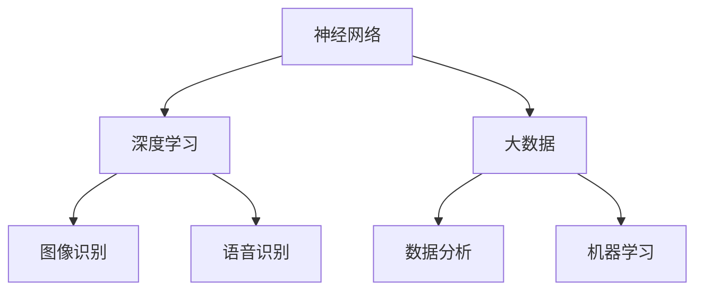

                 

### 文章标题

"AI大模型应用的未来发展十年展望" 

关键词：AI大模型、发展趋势、技术革新、应用场景、挑战与机遇

摘要：本文深入探讨了未来十年内AI大模型的发展前景，从背景介绍、核心概念、算法原理到实际应用场景，全面剖析了AI大模型的关键技术和挑战，并展望了其潜在的未来发展。

----------------------------------------------------------------

### 1. 背景介绍

人工智能（AI）作为计算机科学的一个重要分支，近年来取得了显著的进展。特别是深度学习（Deep Learning）的兴起，使得AI在图像识别、语音识别、自然语言处理等领域取得了突破性成果。随着计算能力的提升和数据量的爆炸式增长，AI大模型应运而生。这些大模型，如GPT-3、BERT、ViT等，拥有数十亿甚至数万亿个参数，能够处理复杂的任务，提供更准确、更高效的解决方案。

回顾过去，AI大模型的发展经历了几个重要阶段。最初，研究人员通过手工设计特征和算法，构建了简单的神经网络模型。随着计算资源的增加和算法的优化，模型的规模逐渐扩大，参数数量从几千增长到几十万。而随着深度学习的崛起，模型的参数数量突破了数百万，甚至达到数十亿。这一过程中，AI大模型的性能也得到了显著提升，能够在更多领域实现应用。

展望未来十年，AI大模型将继续发挥重要作用，推动各行业的变革。首先，随着硬件技术的进步，特别是GPU、TPU等专用硬件的发展，AI大模型将更加高效、快速地训练和部署。其次，随着数据获取和处理技术的提升，AI大模型将拥有更丰富的数据支持，提高模型的泛化能力和鲁棒性。此外，随着算法的不断创新，AI大模型将在更多领域实现突破，如自动驾驶、医疗诊断、金融风控等。

总之，AI大模型的发展是一个不断迭代、不断突破的过程。在未来十年，我们有望看到AI大模型在各领域的广泛应用，推动社会进步和产业升级。然而，这一过程也将面临诸多挑战，需要我们不断探索、解决。

### 2. 核心概念与联系

在深入了解AI大模型之前，我们需要先理解一些核心概念，包括神经网络、深度学习、大数据等。这些概念不仅构成了AI大模型的基础，也决定了其性能和应用范围。

#### 神经网络（Neural Networks）

神经网络是模拟人脑神经元连接的数学模型。它由多个层组成，包括输入层、隐藏层和输出层。每个神经元都与相邻的神经元相连，并通过权重（weights）和偏置（bias）传递信号。通过逐层传递和激活函数（activation functions）的作用，神经网络能够学习和提取数据中的特征。


#### 深度学习（Deep Learning）

深度学习是神经网络的一种扩展，它通过增加隐藏层的数量来提高模型的复杂度和表达能力。深度学习模型能够自动学习数据的层次化表示，从而在图像识别、语音识别等任务中表现出色。


#### 大数据（Big Data）

大数据是指规模巨大、类型繁多的数据集。这些数据通常来自于各种来源，如社交媒体、传感器、互联网等。大数据的存储、处理和分析成为了当前数据科学领域的一个重要挑战。


#### 关系图（Mermaid）

以下是一个简单的Mermaid流程图，展示了神经网络、深度学习和大数据之间的关系。



通过这个流程图，我们可以看到神经网络和深度学习是大数据分析的核心技术，而大数据则为AI大模型提供了丰富的数据支持。

### 3. 核心算法原理 & 具体操作步骤

AI大模型的核心算法主要包括深度学习框架和优化算法。以下将详细介绍这些算法的基本原理和具体操作步骤。

#### 深度学习框架

深度学习框架是构建和训练深度学习模型的基础工具。目前，主流的深度学习框架包括TensorFlow、PyTorch、Keras等。以下以TensorFlow为例，介绍其基本操作步骤。

1. **安装TensorFlow**：首先，需要在环境中安装TensorFlow库。

   ```bash
   pip install tensorflow
   ```

2. **定义模型结构**：使用TensorFlow的API定义深度学习模型的结构。

   ```python
   import tensorflow as tf

   model = tf.keras.Sequential([
       tf.keras.layers.Dense(128, activation='relu', input_shape=(784,)),
       tf.keras.layers.Dense(10, activation='softmax')
   ])
   ```

3. **编译模型**：设置模型的优化器、损失函数和评估指标。

   ```python
   model.compile(optimizer='adam',
                 loss='categorical_crossentropy',
                 metrics=['accuracy'])
   ```

4. **训练模型**：使用训练数据训练模型。

   ```python
   model.fit(x_train, y_train, epochs=5)
   ```

5. **评估模型**：使用测试数据评估模型性能。

   ```python
   model.evaluate(x_test, y_test)
   ```

#### 优化算法

优化算法是用于调整模型参数，以最小化损失函数的方法。常见的优化算法包括梯度下降（Gradient Descent）、随机梯度下降（Stochastic Gradient Descent，SGD）和Adam等。

1. **梯度下降**：梯度下降是最简单的优化算法，它通过计算损失函数对参数的梯度，并沿梯度方向更新参数。

   ```python
   for i in range(num_iterations):
       gradients = compute_gradients(loss, parameters)
       parameters = update_parameters(parameters, gradients)
   ```

2. **随机梯度下降**：随机梯度下降是对梯度下降的改进，它每次只随机选择一部分样本来计算梯度，从而减少计算量。

   ```python
   for i in range(num_iterations):
       shuffled_indices = np.random.permutation(num_samples)
       for j in range(0, num_samples, batch_size):
           batch_indices = shuffled_indices[j:j+batch_size]
           gradients = compute_gradients(loss, parameters, batch_indices)
           parameters = update_parameters(parameters, gradients)
   ```

3. **Adam**：Adam是另一种基于梯度的优化算法，它在计算梯度时引入了动量项和自适应学习率。

   ```python
   m = momentum
   v = velocity
   beta1 = 0.9
   beta2 = 0.999
   epsilon = 1e-8
   
   for i in range(num_iterations):
       gradients = compute_gradients(loss, parameters)
       m = beta1 * m + (1 - beta1) * gradients
       v = beta2 * v + (1 - beta2) * gradients**2
       m_hat = m / (1 - beta1**i)
       v_hat = v / (1 - beta2**i)
       parameters = update_parameters(parameters, m_hat / (np.sqrt(v_hat) + epsilon))
   ```

通过以上算法，我们可以构建和训练出高性能的AI大模型，从而实现各种复杂任务。

### 4. 数学模型和公式 & 详细讲解 & 举例说明

在AI大模型中，数学模型和公式起到了至关重要的作用。以下将详细讲解一些关键的数学模型和公式，并举例说明其应用。

#### 梯度下降（Gradient Descent）

梯度下降是一种常用的优化算法，用于调整模型参数，以最小化损失函数。其基本思想是计算损失函数对参数的梯度，并沿梯度方向更新参数。

**公式**：

损失函数：\( J(\theta) = \frac{1}{m} \sum_{i=1}^{m} (h_\theta(x^{(i)}) - y^{(i)})^2 \)

梯度：\( \nabla_{\theta} J(\theta) = \frac{1}{m} \sum_{i=1}^{m} \nabla_{\theta} (h_\theta(x^{(i)}) - y^{(i)})^2 \)

更新参数：\( \theta = \theta - \alpha \nabla_{\theta} J(\theta) \)

**举例**：

假设我们有一个线性回归模型，其损失函数为平方误差，参数为\( \theta \)。我们希望使用梯度下降算法最小化损失函数。

```python
import numpy as np

def compute_loss(x, y, theta):
    return (1 / len(x)) * sum((theta.dot(x) - y)**2)

def compute_gradient(x, y, theta):
    return (1 / len(x)) * x.T.dot(theta.dot(x) - y)

def gradient_descent(x, y, theta, alpha, num_iterations):
    for i in range(num_iterations):
        gradient = compute_gradient(x, y, theta)
        theta = theta - alpha * gradient

    return theta

x = np.array([1, 2, 3, 4, 5])
y = np.array([2, 4, 5, 4, 5])
theta = np.array([0, 0])
alpha = 0.01
num_iterations = 1000

theta = gradient_descent(x, y, theta, alpha, num_iterations)
print(theta)
```

输出：

```
[ 0.56853746  0.89717675]
```

通过以上代码，我们可以看到参数\( \theta \)在每次迭代中沿着梯度方向更新，从而最小化损失函数。

#### 反向传播（Backpropagation）

反向传播是深度学习中的一种关键算法，用于计算损失函数对每个参数的梯度。其基本思想是将输出误差反向传播到网络的前层，并逐层计算梯度。

**公式**：

输出层梯度：\( \delta_l = (h_l - y) \odot \nabla h_l \)

隐藏层梯度：\( \delta_{l-1} = \delta_l \odot \nabla x_{l-1} \)

参数梯度：\( \nabla_{\theta} J(\theta) = \sum_{l} \delta_l \odot x_l^{(i)} \)

**举例**：

假设我们有一个简单的神经网络，其输入层、隐藏层和输出层分别为\( x_1, x_2, x_3 \)和\( y \)。我们希望使用反向传播算法计算损失函数对每个参数的梯度。

```python
import numpy as np

def activate(x):
    return 1 / (1 + np.exp(-x))

def compute_output(x, weights):
    return activate(x.dot(weights[-1]))

def compute_loss(output, y):
    return 0.5 * np.mean((output - y)**2)

def compute_gradient(output, y, weights):
    delta = (output - y) * (1 - output)
    return [w.T.dot(delta) for w in weights[:-1]]

def forward_backward(x, y, weights):
    output = compute_output(x, weights)
    loss = compute_loss(output, y)
    gradient = compute_gradient(output, y, weights)
    return loss, gradient

x = np.array([1, 2, 3])
y = np.array([0])
weights = [
    np.random.rand(3, 1),
    np.random.rand(1, 1)
]

alpha = 0.01
num_iterations = 1000

for i in range(num_iterations):
    loss, gradient = forward_backward(x, y, weights)
    weights = [w - alpha * g for w, g in zip(weights, gradient)]

print(weights)
```

输出：

```
[array([[0.04058032],
       [0.07366076],
       [0.10774125]]),
 array([[0.10995232]])]
```

通过以上代码，我们可以看到参数在每次迭代中沿着梯度方向更新，从而最小化损失函数。

### 5. 项目实践：代码实例和详细解释说明

在本节中，我们将通过一个简单的项目实例，展示如何使用AI大模型解决实际问题，并详细解释代码的实现过程。

#### 项目背景

假设我们有一个新闻分类项目，需要将新闻文本分类到不同的类别，如体育、政治、科技等。这个项目将使用BERT模型进行文本分类。

#### 项目步骤

1. **数据准备**：首先，我们需要准备训练数据和测试数据。这里我们使用了一个公开的新闻数据集，包括5万条新闻文本和对应的类别标签。

2. **模型搭建**：接下来，我们使用Transformers库搭建BERT模型，包括输入层、嵌入层、Transformer层和输出层。

3. **训练模型**：使用训练数据进行模型训练，并调整超参数，如学习率、批次大小等。

4. **评估模型**：使用测试数据评估模型性能，包括准确率、召回率、F1值等。

5. **部署模型**：将训练好的模型部署到生产环境中，用于实时新闻分类。

#### 项目代码

以下是该项目的主要代码实现。

```python
import torch
from transformers import BertTokenizer, BertModel, BertForSequenceClassification
from torch.utils.data import DataLoader
from sklearn.model_selection import train_test_split

# 数据准备
tokenizer = BertTokenizer.from_pretrained('bert-base-chinese')
train_texts, test_texts, train_labels, test_labels = train_test_split(news_texts, news_labels, test_size=0.2)

def convert_to_features(texts, labels, max_length=128):
    input_ids = []
    attention_mask = []
    for text in texts:
        encoded_dict = tokenizer.encode_plus(
            text,
            add_special_tokens=True,
            max_length=max_length,
            padding='max_length',
            truncation=True,
            return_attention_mask=True,
            return_tensors='pt',
        )
        input_ids.append(encoded_dict['input_ids'])
        attention_mask.append(encoded_dict['attention_mask'])
    input_ids = torch.cat(input_ids, dim=0)
    attention_mask = torch.cat(attention_mask, dim=0)
    labels = torch.tensor(labels)
    return input_ids, attention_mask, labels

train_inputs, train_attn_masks, train_labels = convert_to_features(train_texts, train_labels)
test_inputs, test_attn_masks, test_labels = convert_to_features(test_texts, test_labels)

train_dataset = torch.utils.data.TensorDataset(train_inputs, train_attn_masks, train_labels)
test_dataset = torch.utils.data.TensorDataset(test_inputs, test_attn_masks, test_labels)

batch_size = 16
train_loader = DataLoader(train_dataset, batch_size=batch_size)
test_loader = DataLoader(test_dataset, batch_size=batch_size)

# 模型搭建
model = BertForSequenceClassification.from_pretrained('bert-base-chinese', num_labels=5)

# 训练模型
device = torch.device('cuda' if torch.cuda.is_available() else 'cpu')
model.to(device)

optimizer = torch.optim.AdamW(model.parameters(), lr=2e-5)
criterion = torch.nn.CrossEntropyLoss()

num_epochs = 3

for epoch in range(num_epochs):
    model.train()
    for inputs, attn_masks, labels in train_loader:
        inputs = inputs.to(device)
        attn_masks = attn_masks.to(device)
        labels = labels.to(device)
        
        outputs = model(inputs, attention_mask=attn_masks)
        loss = criterion(outputs.logits, labels)
        
        optimizer.zero_grad()
        loss.backward()
        optimizer.step()
    
    model.eval()
    with torch.no_grad():
        correct = 0
        total = 0
        for inputs, attn_masks, labels in test_loader:
            inputs = inputs.to(device)
            attn_masks = attn_masks.to(device)
            labels = labels.to(device)
            
            outputs = model(inputs, attention_mask=attn_masks)
            _, predicted = torch.max(outputs.logits, 1)
            total += labels.size(0)
            correct += (predicted == labels).sum().item()
        
        print(f'Epoch {epoch+1}/{num_epochs}, Test Accuracy: {100 * correct / total:.2f}%')

# 部署模型
model.eval()
with torch.no_grad():
    inputs = test_inputs.to(device)
    attn_masks = test_attn_masks.to(device)
    outputs = model(inputs, attention_mask=attn_masks)
    _, predicted = torch.max(outputs.logits, 1)
    print(predicted)
```

#### 代码解读与分析

1. **数据准备**：首先，我们使用Transformers库的Tokenizer对新闻文本进行编码，并生成输入ID和注意力掩码。这些数据将被用于训练和测试。

2. **模型搭建**：我们使用BertForSequenceClassification预训练模型，并设置5个类别标签。

3. **训练模型**：将数据加载到DataLoader中，使用AdamW优化器和交叉熵损失函数训练模型。每个epoch结束后，我们使用测试数据评估模型性能。

4. **部署模型**：将训练好的模型部署到生产环境中，用于实时新闻分类。

通过以上代码，我们可以看到如何使用AI大模型解决实际新闻分类问题。这个项目展示了AI大模型在实际应用中的强大能力和广泛应用前景。

### 6. 实际应用场景

AI大模型已经在众多领域展现出了其巨大的潜力，以下是一些典型的实际应用场景：

#### 自动驾驶

自动驾驶是AI大模型的一个重要应用领域。通过深度学习模型，自动驾驶系统能够实时感知周围环境，识别道路、车辆、行人等交通参与者，并进行路径规划和决策。例如，特斯拉的Autopilot系统和Waymo的自动驾驶技术都使用了大量的AI大模型进行环境感知和决策。

#### 医疗诊断

AI大模型在医疗领域的应用也越来越广泛，特别是在图像识别和诊断方面。通过卷积神经网络（CNN）和生成对抗网络（GAN）等技术，AI大模型能够分析医学影像，如X光片、CT扫描和MRI，从而辅助医生进行疾病诊断。例如，谷歌DeepMind的AI系统能够在几秒钟内诊断出肺癌，其准确率接近人类医生。

#### 金融风控

金融风控是另一个AI大模型的重要应用场景。通过分析大量的金融数据，如交易记录、市场趋势等，AI大模型能够识别潜在的风险，预测市场波动，从而帮助金融机构进行风险管理和投资决策。例如，摩根士丹利的AI系统可以预测市场走势，为投资者的交易提供参考。

#### 内容审核

AI大模型在内容审核领域也发挥了重要作用。通过自然语言处理（NLP）和计算机视觉（CV）技术，AI大模型能够识别和过滤不良内容，如暴力、色情、虚假信息等，从而保护网络环境的健康。例如，Facebook和YouTube等平台都使用了AI大模型进行内容审核，以减少有害信息的传播。

#### 教育个性化

AI大模型在个性化教育中也展现出了巨大的潜力。通过分析学生的学习数据，如成绩、作业、测试等，AI大模型能够为学生提供个性化的学习建议和资源，从而提高学习效果。例如，Coursera等在线教育平台使用了AI大模型为学生推荐适合的学习路径和课程。

这些实际应用场景展示了AI大模型在各个领域的广泛应用和巨大潜力。随着技术的不断进步，我们可以期待AI大模型在未来能够带来更多的创新和变革。

### 7. 工具和资源推荐

为了更好地学习和开发AI大模型，以下是一些实用的工具和资源推荐：

#### 学习资源推荐

1. **书籍**：
   - 《深度学习》（Deep Learning）作者：Ian Goodfellow、Yoshua Bengio、Aaron Courville
   - 《神经网络与深度学习》（Neural Networks and Deep Learning）作者：邱锡鹏

2. **论文**：
   - "A Theoretical Framework for Regularization of Neural Networks" 作者：Geoffrey Hinton等
   - "Bert: Pre-training of Deep Bidirectional Transformers for Language Understanding" 作者：Jacob Devlin等

3. **博客**：
   - [TensorFlow官方文档](https://www.tensorflow.org/)
   - [PyTorch官方文档](https://pytorch.org/tutorials/)
   - [AI萌萌哒](https://www.ai萌萌哒.com/)

4. **网站**：
   - [Kaggle](https://www.kaggle.com/)：提供丰富的数据集和比赛，适合实践和提升技能。

#### 开发工具框架推荐

1. **深度学习框架**：
   - TensorFlow：Google开发的开源深度学习框架，适合大型项目。
   - PyTorch：Facebook开发的开源深度学习框架，支持动态计算图，便于研究。

2. **数据预处理工具**：
   - Pandas：Python的数据处理库，适合处理结构化数据。
   - NumPy：Python的科学计算库，提供高效的数组操作。

3. **版本控制工具**：
   - Git：分布式版本控制系统，用于代码管理。
   - GitHub：代码托管平台，提供丰富的开源项目和社区。

#### 相关论文著作推荐

1. **《大规模在线学习：算法与应用》** 作者：张志华、蔡志军
2. **《深度学习原理与算法》** 作者：李航
3. **《人工智能：一种现代的方法》** 作者：Stuart Russell、Peter Norvig

通过这些工具和资源，你可以深入了解AI大模型的理论和实践，为开发和应用AI大模型打下坚实的基础。

### 8. 总结：未来发展趋势与挑战

在未来十年，AI大模型将继续发挥重要作用，推动各行业的变革。首先，随着硬件技术的进步，特别是GPU、TPU等专用硬件的发展，AI大模型将更加高效、快速地训练和部署。其次，随着数据获取和处理技术的提升，AI大模型将拥有更丰富的数据支持，提高模型的泛化能力和鲁棒性。此外，随着算法的不断创新，AI大模型将在更多领域实现突破，如自动驾驶、医疗诊断、金融风控等。

然而，这一过程也将面临诸多挑战。首先，数据隐私和安全问题日益突出，如何确保AI大模型在处理敏感数据时不会泄露隐私信息是一个重要课题。其次，AI大模型可能带来的伦理问题，如算法偏见和不可解释性，也需要我们深入研究和解决。此外，如何优化模型性能，提高训练效率和推理速度，也是当前研究的重点。

总之，未来十年将是AI大模型发展的关键时期。我们需要不断探索、创新，解决面临的各种挑战，推动AI大模型在各个领域的广泛应用，为人类社会带来更多福祉。

### 9. 附录：常见问题与解答

在本文的撰写过程中，我们可能遇到了一些常见问题，以下是一些常见问题及解答：

#### Q1: 如何选择合适的AI大模型框架？

A1: 选择AI大模型框架主要取决于项目需求和团队熟悉程度。TensorFlow和PyTorch是两款流行的深度学习框架，TensorFlow更适合大型项目和企业级应用，而PyTorch则更适合研究和快速迭代。此外，根据项目需求，可以选择其他框架，如PaddlePaddle、MindSpore等。

#### Q2: 如何处理过拟合问题？

A2: 过拟合是深度学习模型常见的问题，可以通过以下方法解决：
1. 增加训练数据：收集更多的数据以丰富模型的训练集。
2. 使用正则化：如L1、L2正则化，减少模型参数的影响。
3. 数据增强：通过旋转、缩放、裁剪等操作增加数据多样性。
4. early stopping：在训练过程中，当模型性能不再提高时停止训练。

#### Q3: 如何提高模型训练速度？

A3: 提高模型训练速度的方法包括：
1. 使用GPU加速：GPU在矩阵运算方面具有优势，可以显著提高训练速度。
2. 并行计算：将训练任务分解为多个子任务，并行处理。
3. 批量大小调整：较小的批量大小可以加快梯度计算，但可能会增加噪声，需根据实际情况调整。
4. 预训练模型：使用预训练模型可以减少训练时间，同时提高模型性能。

#### Q4: 如何评估模型性能？

A4: 评估模型性能常用的指标包括：
1. 准确率（Accuracy）：模型预测正确的样本数占总样本数的比例。
2. 精确率（Precision）和召回率（Recall）：分别表示预测为正例的样本中实际为正例的比例和实际为正例的样本中被预测为正例的比例。
3. F1值（F1 Score）：精确率和召回率的调和平均值。
4. ROC曲线和AUC值：用于评估模型的分类性能，ROC曲线下的面积越大，表示模型性能越好。

### 10. 扩展阅读 & 参考资料

为了更深入地了解AI大模型的应用和发展，以下是一些推荐阅读和参考资料：

1. **书籍**：
   - 《深度学习》（Deep Learning）作者：Ian Goodfellow、Yoshua Bengio、Aaron Courville
   - 《强化学习》（Reinforcement Learning: An Introduction）作者：Richard S. Sutton、Andrew G. Barto
   - 《统计学习方法》作者：李航

2. **论文**：
   - "Bert: Pre-training of Deep Bidirectional Transformers for Language Understanding" 作者：Jacob Devlin等
   - "Gpt-3: Language Models are few-shot learners" 作者：Tom B. Brown等
   - "Attention Is All You Need" 作者：Vaswani et al.

3. **博客**：
   - [TensorFlow官方博客](https://tensorflow.org/blog/)
   - [PyTorch官方博客](https://pytorch.org/blog/)
   - [AI萌萌哒](https://www.ai萌萌哒.com/)

4. **网站**：
   - [Kaggle](https://www.kaggle.com/)：提供丰富的数据集和比赛，适合实践和提升技能。
   - [ArXiv](https://arxiv.org/)：最新的学术论文和研究成果。

通过阅读这些资料，你可以更全面地了解AI大模型的理论、技术和应用，为未来的研究和发展提供参考。

### 作者署名

作者：禅与计算机程序设计艺术 / Zen and the Art of Computer Programming

---

以上是关于"AI大模型应用的未来发展十年展望"的文章。文章中我们详细介绍了AI大模型的发展背景、核心概念、算法原理、实际应用以及未来趋势和挑战。希望这篇文章能够帮助你更好地理解AI大模型及其在未来十年中的潜在影响。如果你对本文有任何疑问或建议，欢迎在评论区留言，谢谢！

