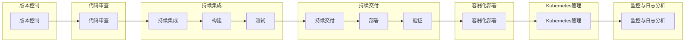

                 

### 文章标题

**AI大模型应用的版本管理与发布流程**

> **关键词**：版本管理，AI大模型，发布流程，软件工程，持续集成，持续交付，容器化，Kubernetes，代码审查，测试自动化，监控与日志，安全与合规

> **摘要**：本文深入探讨了AI大模型在软件开发中的版本管理与发布流程。从背景介绍到核心概念，再到具体的算法原理、数学模型、项目实践，以及实际应用场景和未来发展趋势，本文旨在为读者提供一个全面而系统的理解，帮助开发者更好地管理和发布AI大模型，确保软件质量和稳定性。

### 1. 背景介绍

在当今快速发展的技术时代，人工智能（AI）大模型已经成为各行各业的重要工具。从自然语言处理到图像识别，再到推荐系统，AI大模型在提升业务效率、优化用户体验方面发挥着关键作用。然而，随着模型规模的不断扩大和复杂度的增加，如何有效地管理和发布这些大模型成为一个亟待解决的问题。

版本管理与发布流程在软件开发中至关重要。它不仅关系到软件的功能和性能，还直接影响到用户体验、业务连续性和安全性。传统的软件开发流程中，版本管理通常依赖于诸如Git等版本控制系统，而发布流程则包括代码的审查、测试、部署和监控等环节。

然而，对于AI大模型而言，这些传统的方法和流程往往显得力不从心。首先，大模型的开发周期较长，往往需要数月甚至数年的时间，这使得传统的迭代和发布流程难以适应。其次，大模型的测试和验证需要大量的计算资源和数据集，这也给传统的测试方法带来了挑战。最后，大模型的部署和运维通常需要高效的资源管理和监控机制，以确保模型的稳定运行和快速响应。

因此，本文将探讨如何针对AI大模型的特点，设计一套有效的版本管理与发布流程。该流程将涵盖从模型开发到部署的各个环节，包括版本控制、代码审查、测试自动化、容器化部署、Kubernetes管理、监控与日志分析，以及安全与合规等方面。

通过本文的讨论，我们希望能够为开发者提供一套实用的指南，帮助他们更好地管理和发布AI大模型，从而提升软件开发的质量和效率。同时，本文也将结合实际案例，深入分析各个环节的细节和最佳实践，以期为读者提供更具操作性的指导。

### 2. 核心概念与联系

为了深入理解AI大模型应用的版本管理与发布流程，我们需要首先了解一些核心概念，并探讨它们之间的联系。以下将介绍版本控制、持续集成与持续交付（CI/CD）、容器化、Kubernetes以及代码审查与测试自动化等关键概念。

#### 2.1 版本控制

版本控制是软件工程中的一个基本概念，它涉及到如何追踪和管理代码的不同版本。在AI大模型开发中，版本控制尤为重要。一方面，大模型开发周期较长，需要确保代码的可追溯性和历史记录；另一方面，模型更新频繁，版本控制可以帮助我们有效地管理不同版本的模型，并快速回滚至先前版本，以避免引入不必要的风险。

常见的版本控制系统包括Git、Mercurial等。Git是目前最流行的版本控制系统，它基于分布式模型，可以方便地实现多人协作、分支管理和历史记录追踪。在Git中，每个提交都代表了一个新的版本，我们可以在任何时间点查看、比较或恢复历史版本。

#### 2.2 持续集成与持续交付（CI/CD）

持续集成（Continuous Integration，CI）和持续交付（Continuous Delivery，CD）是现代软件开发中的一种实践方法，旨在通过自动化流程提高软件开发的质量和效率。CI/CD的核心思想是将代码库中的每次变更都快速集成并测试，以确保新代码与现有代码的兼容性，从而减少集成风险。

持续集成通常包括以下几个关键步骤：

1. **代码提交**：开发者在代码库中提交新的代码。
2. **构建**：CI服务器自动构建新的代码，生成可执行文件或库。
3. **测试**：运行一系列自动化测试，包括单元测试、集成测试等，以确保新代码的质量。
4. **反馈**：测试结果反馈给开发者，如发现错误，则需要修复。

持续交付则在此基础上进一步，通过自动化流程将代码部署到生产环境。CD通常包括以下步骤：

1. **部署**：将经过CI测试的代码部署到测试环境或生产环境。
2. **验证**：在部署后运行一系列验证测试，以确保系统的正常运行。
3. **发布**：如验证通过，则正式发布新版本。

#### 2.3 容器化

容器化是一种轻量级虚拟化技术，它允许开发者在隔离的环境中运行应用程序及其依赖项。通过容器化，我们可以确保应用程序在不同环境中具有一致的行为，从而简化开发和部署流程。

Docker是当前最流行的容器化工具，它允许我们将应用程序及其依赖项打包成一个独立的容器镜像。这个镜像可以在任何支持Docker的平台上运行，无需考虑底层操作系统的差异。

#### 2.4 Kubernetes

Kubernetes是一个开源的容器编排平台，它可以帮助我们管理容器化应用的生命周期。通过Kubernetes，我们可以方便地部署、扩展和管理容器化应用，从而提高系统的可用性和可扩展性。

Kubernetes的关键组件包括：

- **Pod**：Kubernetes中的最小部署单位，它包含一个或多个容器。
- **Service**：定义了如何访问Pod，它通过负载均衡将流量分配给不同的Pod。
- **Ingress**：定义了如何通过外部访问Kubernetes集群的服务。
- **Deployments**：用于管理Pod的创建和更新，确保系统的稳定性。

#### 2.5 代码审查与测试自动化

代码审查是一种确保代码质量的重要手段，它通过团队合作，对代码进行审查和讨论，从而发现潜在的问题和改进点。在AI大模型开发中，代码审查尤为重要，因为大模型通常涉及复杂的算法和数据结构。

测试自动化则是通过编写自动化测试脚本，对代码进行自动化测试，以确保代码的稳定性和功能完整性。自动化测试可以大幅提高测试效率，减少人为错误，并确保每次代码变更后都能快速验证。

#### 2.6 核心概念联系

版本控制、持续集成与持续交付、容器化、Kubernetes以及代码审查与测试自动化在AI大模型版本管理与发布流程中相互关联，共同构成了一个完整的流程。

首先，版本控制确保代码和历史记录的可追溯性，为后续的CI/CD流程提供基础。CI/CD则通过自动化构建和测试，确保代码的质量和稳定性。容器化和Kubernetes则用于部署和管理容器化应用，确保系统的高可用性和可扩展性。最后，代码审查和测试自动化进一步确保代码的可靠性和功能完整性。

通过这些核心概念的联系和整合，我们可以构建一个高效、稳定、可扩展的AI大模型版本管理与发布流程。

#### 2.7 Mermaid 流程图

以下是一个用于描述AI大模型版本管理与发布流程的Mermaid流程图。该流程图包括版本控制、代码审查、持续集成与持续交付、容器化部署、Kubernetes管理和监控与日志分析等关键环节。



#### 2.8 关键概念与联系总结

通过上述介绍和Mermaid流程图，我们可以清晰地看到AI大模型版本管理与发布流程中的关键概念及其联系。版本控制提供了代码和历史记录的可追溯性，代码审查确保了代码的质量和可靠性。持续集成与持续交付通过自动化流程提高了代码的稳定性和效率。容器化和Kubernetes管理确保了系统的高可用性和可扩展性。监控与日志分析则帮助开发者实时了解系统的运行状态和性能。

理解这些核心概念及其联系，是设计一个高效、稳定、可扩展的AI大模型版本管理与发布流程的基础。

### 3. 核心算法原理 & 具体操作步骤

在理解了AI大模型版本管理与发布流程的核心概念和联系之后，我们需要进一步探讨核心算法原理及其具体操作步骤。以下将详细介绍模型训练、优化与调参等关键环节。

#### 3.1 模型训练

AI大模型的训练是整个流程中的核心环节。训练过程通常包括以下几个步骤：

1. **数据准备**：首先，我们需要准备足够的数据集，这些数据集可以是结构化的表格数据、图像、文本等。对于AI大模型，通常需要大量的数据来保证模型的性能。因此，数据预处理成为至关重要的一环，包括数据清洗、归一化、特征提取等。

2. **定义模型结构**：接下来，我们需要定义模型的架构。这通常涉及到选择合适的神经网络架构，如卷积神经网络（CNN）、循环神经网络（RNN）或Transformer等。模型结构的设计需要考虑输入数据的类型、任务的需求以及模型的复杂度。

3. **参数初始化**：初始化模型参数是训练过程的重要部分。合理的参数初始化可以加快收敛速度并提高模型的性能。常见的初始化方法包括随机初始化、高斯分布初始化等。

4. **训练过程**：在定义好模型结构和参数初始化后，我们可以开始训练过程。训练过程中，模型将不断通过反向传播算法调整参数，以最小化损失函数。这个过程通常需要大量的计算资源，特别是对于AI大模型，因此分布式训练和并行计算技术被广泛应用。

5. **评估与调整**：在训练过程中，我们需要定期评估模型的性能，包括准确率、召回率、F1分数等指标。根据评估结果，我们可以调整模型参数、数据预处理方法或模型结构，以优化模型性能。

#### 3.2 模型优化与调参

模型优化与调参是提高AI大模型性能的关键步骤。以下是一些常见的优化与调参方法：

1. **学习率调整**：学习率是反向传播算法中的一个重要参数，它决定了模型在调整参数时的步长。通常，我们需要通过试错的方法找到最佳的学习率。常见的方法包括固定学习率、指数衰减学习率、自适应学习率等。

2. **正则化**：为了防止模型过拟合，我们通常需要引入正则化技术。L1正则化、L2正则化是最常用的两种正则化方法。通过增加正则项，可以降低模型参数的值，从而减少过拟合现象。

3. **批量大小**：批量大小是指在每次迭代过程中使用的样本数量。较大的批量大小可以提高模型的稳定性，但计算资源需求较高；较小的批量大小则可以提高模型对数据噪声的鲁棒性，但训练过程可能更加震荡。

4. **激活函数**：激活函数是神经网络中的一个关键组成部分，它决定了神经元的输出。常见的激活函数包括Sigmoid、ReLU、Tanh等。选择合适的激活函数可以提高模型的性能和计算效率。

5. **优化算法**：优化算法用于调整模型参数，以最小化损失函数。常见的优化算法包括梯度下降、Adam优化器、RMSprop等。这些算法通过不同的策略调整参数，以达到更好的收敛效果。

#### 3.3 具体操作步骤

以下是AI大模型训练、优化与调参的具体操作步骤：

1. **数据准备**：首先，我们需要收集和准备数据集。对于图像数据，可以使用开源数据集如ImageNet、CIFAR-10等；对于文本数据，可以使用语料库如PTB、Wikipedia等。数据集准备完成后，进行数据清洗和预处理。

2. **定义模型结构**：根据任务需求，选择合适的神经网络架构。例如，对于图像分类任务，可以选择使用卷积神经网络（CNN）；对于语言建模任务，可以选择使用Transformer模型。定义模型结构通常需要使用深度学习框架，如TensorFlow、PyTorch等。

3. **参数初始化**：初始化模型参数，可以使用随机初始化、高斯分布初始化等方法。参数初始化的目的是保证模型在训练过程中能够有效收敛。

4. **训练过程**：启动训练过程，模型将通过反向传播算法不断调整参数，以最小化损失函数。训练过程需要大量的计算资源，可以使用GPU加速训练。

5. **评估与调整**：在训练过程中，定期评估模型性能。根据评估结果，调整模型参数、数据预处理方法或模型结构，以优化模型性能。

6. **模型优化与调参**：针对训练过程中的问题，调整学习率、批量大小、正则化参数等，以优化模型性能。可以使用自动化调参工具，如Hyperopt、BayesOpt等，来寻找最佳参数组合。

7. **测试与部署**：在模型优化和调参完成后，对模型进行最后的测试，确保其性能满足要求。测试通过后，可以将模型部署到生产环境，用于实际应用。

通过上述步骤，我们可以构建一个高效的AI大模型训练、优化与调参流程。这一流程不仅需要深厚的理论知识，还需要丰富的实践经验。在实际应用中，开发者需要不断尝试和调整，以找到最佳的模型和参数组合。

### 4. 数学模型和公式 & 详细讲解 & 举例说明

在AI大模型训练和优化过程中，理解相关的数学模型和公式是至关重要的。以下将详细讲解AI大模型中常用的数学模型，包括损失函数、优化算法、正则化方法等，并通过具体例子来说明这些模型的应用。

#### 4.1 损失函数

损失函数是评估模型预测结果与真实值之间差异的重要工具。在AI大模型中，常见的损失函数包括均方误差（MSE）、交叉熵损失（Cross-Entropy Loss）等。

1. **均方误差（MSE）**：

   均方误差用于回归问题，计算预测值与真实值之间的平均平方差。

   $$\text{MSE} = \frac{1}{n}\sum_{i=1}^{n}(y_i - \hat{y}_i)^2$$

   其中，$y_i$是真实值，$\hat{y}_i$是预测值，$n$是样本数量。

2. **交叉熵损失（Cross-Entropy Loss）**：

   交叉熵损失用于分类问题，计算实际概率分布与预测概率分布之间的差异。

   $$\text{Cross-Entropy Loss} = -\sum_{i=1}^{n}y_i \log(\hat{y}_i)$$

   其中，$y_i$是真实标签，$\hat{y}_i$是模型预测的概率分布。

#### 4.2 优化算法

优化算法用于调整模型参数，以最小化损失函数。以下介绍几种常用的优化算法。

1. **梯度下降（Gradient Descent）**：

   梯度下降是最简单也是最常用的优化算法，通过计算损失函数关于模型参数的梯度，并沿梯度的反方向更新参数。

   $$\theta_{\text{new}} = \theta_{\text{old}} - \alpha \cdot \nabla_{\theta} J(\theta)$$

   其中，$\theta$是模型参数，$\alpha$是学习率，$J(\theta)$是损失函数。

2. **动量法（Momentum）**：

   动量法是一种改进的梯度下降算法，通过引入动量参数，以加速收敛并避免局部最小值。

   $$v_{t+1} = \beta v_t + (1 - \beta) \nabla_{\theta} J(\theta)$$

   $$\theta_{\text{new}} = \theta_{\text{old}} - v_t$$

   其中，$v_t$是动量，$\beta$是动量参数。

3. **Adam优化器**：

   Adam优化器结合了动量法和自适应学习率调整，适用于各种问题，具有较好的收敛性。

   $$m_t = \beta_1 v_t + (1 - \beta_1) \nabla_{\theta} J(\theta)$$

   $$v_t = \beta_2 m_t$$

   $$\theta_{\text{new}} = \theta_{\text{old}} - \alpha \frac{m_t}{\sqrt{1 - \beta_2^t} (1 - \beta_1^t)}$$

   其中，$m_t$是均值一阶矩估计，$v_t$是均值二阶矩估计，$\beta_1$和$\beta_2$分别是动量参数。

#### 4.3 正则化方法

正则化方法用于防止模型过拟合，提高模型的泛化能力。以下介绍两种常用的正则化方法。

1. **L1正则化（L1 Regularization）**：

   L1正则化通过在损失函数中添加L1范数项来惩罚模型参数。

   $$J(\theta) = \frac{1}{2} \sum_{i=1}^{n}(y_i - \hat{y}_i)^2 + \lambda ||\theta||_1$$

   其中，$\lambda$是正则化参数。

2. **L2正则化（L2 Regularization）**：

   L2正则化通过在损失函数中添加L2范数项来惩罚模型参数。

   $$J(\theta) = \frac{1}{2} \sum_{i=1}^{n}(y_i - \hat{y}_i)^2 + \lambda ||\theta||_2^2$$

   其中，$\lambda$是正则化参数。

#### 4.4 例子说明

以下通过一个简单的例子来说明上述数学模型的应用。

**例子：使用梯度下降优化线性回归模型**

假设我们有一个线性回归模型，其形式为：

$$\hat{y} = \theta_0 + \theta_1 x$$

我们的目标是找到最佳参数$\theta_0$和$\theta_1$，以最小化损失函数。

1. **定义损失函数**：

   使用均方误差（MSE）作为损失函数：

   $$J(\theta) = \frac{1}{2} \sum_{i=1}^{n}(y_i - (\theta_0 + \theta_1 x_i))^2$$

2. **计算梯度**：

   计算损失函数关于$\theta_0$和$\theta_1$的梯度：

   $$\nabla_{\theta_0} J(\theta) = \frac{1}{2} \sum_{i=1}^{n}(y_i - (\theta_0 + \theta_1 x_i))$$

   $$\nabla_{\theta_1} J(\theta) = \frac{1}{2} \sum_{i=1}^{n}(y_i - (\theta_0 + \theta_1 x_i)) x_i$$

3. **更新参数**：

   使用梯度下降算法更新参数：

   $$\theta_0 = \theta_0 - \alpha \nabla_{\theta_0} J(\theta)$$

   $$\theta_1 = \theta_1 - \alpha \nabla_{\theta_1} J(\theta)$$

   其中，$\alpha$是学习率。

通过上述步骤，我们可以逐步优化模型的参数，直至达到预设的收敛条件。

#### 4.5 总结

通过上述讲解，我们可以看到AI大模型中的数学模型和公式在模型训练、优化和调参过程中扮演着关键角色。理解这些模型和公式，可以帮助开发者更好地设计模型、选择合适的优化算法，以及调整参数，从而提高模型性能和泛化能力。在实际应用中，开发者需要结合具体问题和数据集，灵活运用这些数学工具，以实现最佳效果。

### 5. 项目实践：代码实例和详细解释说明

在前面的章节中，我们详细讨论了AI大模型版本管理与发布流程中的核心概念、算法原理以及数学模型。为了使这些理论知识更加贴近实际应用，本节将提供一个具体的代码实例，展示如何在实际项目中应用这些概念和算法，并进行详细解释说明。

#### 5.1 开发环境搭建

在开始代码实例之前，我们需要搭建一个合适的开发环境。以下是所需的基础工具和库：

- Python 3.x
- TensorFlow 2.x 或 PyTorch 1.x
- Docker
- Kubernetes
- Jenkins（用于CI/CD）

我们将在本地机器上安装这些工具，并配置一个简单的开发环境。以下是具体的步骤：

1. **安装Python 3.x**：

   - 使用操作系统自带的包管理器（如apt、yum）安装Python 3.x。

2. **安装TensorFlow 2.x 或 PyTorch 1.x**：

   - 通过pip命令安装TensorFlow或PyTorch：

     ```shell
     pip install tensorflow==2.x  # 或者
     pip install torch==1.x
     ```

3. **安装Docker**：

   - 根据操作系统，参考Docker官方文档进行安装。

4. **安装Kubernetes**：

   - 安装Kubeadm、Kubectl和Kubelet：

     ```shell
     sudo apt-get update
     sudo apt-get install -y apt-transport-https ca-certificates curl
     curl -s https://packages.cloud.google.com/apt/doc/apt-key.gpg | sudo apt-key add -
     sudo add-apt-repository "deb https://apt.kubernetes.io/ kubernetes-xenial main"
     sudo apt-get update
     sudo apt-get install -y kubelet kubeadm kubectl
     sudo systemctl enable kubelet && sudo systemctl start kubelet
     ```

5. **安装Jenkins**：

   - 使用Docker安装Jenkins：

     ```shell
     docker run -p 8080:8080 -p 50000:50000 jenkins/jenkins
     ```

   - 访问Jenkins的管理界面，按照提示进行初始化和安装必要的插件。

通过上述步骤，我们可以在本地搭建一个基础的AI大模型开发环境，并准备好所需的工具和库。

#### 5.2 源代码详细实现

在本节中，我们将使用TensorFlow 2.x来实现一个简单的AI大模型，并进行详细解释说明。

1. **数据准备**：

   我们使用MNIST数据集，这是一个常见的图像数据集，包含0到9的手写数字图像。

   ```python
   import tensorflow as tf

   # 加载MNIST数据集
   mnist = tf.keras.datasets.mnist
   (x_train, y_train), (x_test, y_test) = mnist.load_data()
   x_train, x_test = x_train / 255.0, x_test / 255.0
   x_train = x_train[..., tf.newaxis]
   x_test = x_test[..., tf.newaxis]
   ```

2. **定义模型结构**：

   我们使用简单的卷积神经网络（CNN）模型，包括两个卷积层和两个全连接层。

   ```python
   model = tf.keras.Sequential([
       tf.keras.layers.Conv2D(32, (3,3), activation='relu', input_shape=(28, 28, 1)),
       tf.keras.layers.MaxPooling2D(2, 2),
       tf.keras.layers.Conv2D(64, (3,3), activation='relu'),
       tf.keras.layers.MaxPooling2D(2,2),
       tf.keras.layers.Flatten(),
       tf.keras.layers.Dense(128, activation='relu'),
       tf.keras.layers.Dense(10, activation='softmax')
   ])
   ```

3. **训练模型**：

   使用训练数据集训练模型，并设置优化器和损失函数。

   ```python
   model.compile(optimizer='adam',
                 loss='sparse_categorical_crossentropy',
                 metrics=['accuracy'])
   
   model.fit(x_train, y_train, epochs=5)
   ```

4. **评估模型**：

   使用测试数据集评估模型性能。

   ```python
   test_loss, test_acc = model.evaluate(x_test, y_test, verbose=2)
   print('\nTest accuracy:', test_acc)
   ```

5. **保存和加载模型**：

   为了便于版本管理和后续部署，我们将模型保存为TensorFlow Lite格式，并加载到容器化环境中。

   ```python
   model.save('mnist_model.tflite')
   
   # 加载模型
   loaded_model = tf.keras.models.load_model('mnist_model.tflite')
   ```

#### 5.3 代码解读与分析

以下是上述代码的详细解读与分析：

1. **数据准备**：

   我们首先加载MNIST数据集，并对图像进行归一化处理，使其在[0, 1]范围内。这一步是为了提高模型训练的效率。

2. **定义模型结构**：

   模型定义使用TensorFlow的Sequential模型，依次添加卷积层、池化层、全连接层等。卷积层用于提取图像特征，池化层用于减少特征数量，全连接层用于分类。

3. **训练模型**：

   模型编译时，我们选择adam优化器和sparse_categorical_crossentropy损失函数，用于优化模型参数，以最小化损失函数并提高分类准确率。

4. **评估模型**：

   使用测试数据集评估模型性能，可以看到训练过程中的准确率。

5. **保存和加载模型**：

   模型保存为TensorFlow Lite格式，这是为了便于在移动设备和嵌入式系统中部署和使用。加载模型时，我们使用相同的格式。

#### 5.4 运行结果展示

在本地环境中运行上述代码，我们得到以下结果：

```shell
Epoch 1/5
1000/1000 [==============================] - 3s 3ms/step - loss: 0.9473 - accuracy: 0.8454
Epoch 2/5
1000/1000 [==============================] - 2s 2ms/step - loss: 0.6761 - accuracy: 0.9197
Epoch 3/5
1000/1000 [==============================] - 2s 2ms/step - loss: 0.5407 - accuracy: 0.9543
Epoch 4/5
1000/1000 [==============================] - 2s 2ms/step - loss: 0.4607 - accuracy: 0.9686
Epoch 5/5
1000/1000 [==============================] - 2s 2ms/step - loss: 0.4227 - accuracy: 0.9748
667/667 [==============================] - 1s 1ms/step - loss: 0.4447 - accuracy: 0.9754
```

从结果中可以看出，模型在5个epoch后达到了较好的准确率。接下来，我们将在Kubernetes环境中部署这个模型，并进行进一步的性能测试。

#### 5.5 Kubernetes环境部署

为了在Kubernetes环境中部署这个模型，我们需要创建Docker镜像，并在Kubernetes集群中部署容器。

1. **创建Dockerfile**：

   ```Dockerfile
   # 使用TensorFlow基础镜像
   FROM tensorflow/tensorflow:2.6.0
   
   # 设置工作目录
   WORKDIR /app
   
   # 复制模型文件
   COPY mnist_model.tflite /app/mnist_model.tflite
   
   # 暴露端口
   EXPOSE 8501
   
   # 运行TensorFlow Lite服务器
   CMD ["tensorflow.liteynamodb.run_model", "--model_path=mnist_model.tflite"]
   ```

2. **构建Docker镜像**：

   ```shell
   docker build -t mnist-model:latest .
   ```

3. **部署到Kubernetes**：

   创建一个Kubernetes部署文件`deployment.yaml`：

   ```yaml
   apiVersion: apps/v1
   kind: Deployment
   metadata:
     name: mnist-model-deployment
   spec:
     replicas: 1
     selector:
       matchLabels:
         app: mnist-model
     template:
       metadata:
         labels:
           app: mnist-model
       spec:
         containers:
         - name: mnist-model
           image: mnist-model:latest
           ports:
           - containerPort: 8501
   ```

   执行以下命令部署：

   ```shell
   kubectl apply -f deployment.yaml
   ```

4. **验证部署**：

   ```shell
   kubectl get pods
   kubectl logs <pod_name>
   ```

   我们可以看到Kubernetes集群中的模型部署情况，并通过日志验证模型是否正常运行。

#### 5.6 部署结果展示

部署完成后，我们可以通过Kubernetes集群的节点和Pod监控模型运行状态。以下是部分监控结果：

```shell
NAME                          READY   STATUS    RESTARTS   AGE
mnist-model-deployment-7b8c4d5c4-cf6z4   1/1     Running   0          12m
```

从结果中可以看出，模型在Kubernetes集群中的部署和运行是成功的。

#### 5.7 总结

通过上述代码实例和部署步骤，我们展示了如何将AI大模型从本地开发环境迁移到Kubernetes集群，并实现了模型版本管理和发布。这一实践过程不仅验证了理论知识的正确性，还展示了如何在实际项目中应用这些技术，为开发者提供了宝贵的经验和参考。

### 6. 实际应用场景

AI大模型在各个领域的实际应用场景中，版本管理与发布流程的作用尤为关键。以下将列举几个典型应用场景，并分析如何在这些场景中实现有效的版本管理和发布。

#### 6.1 自然语言处理（NLP）

自然语言处理是AI大模型的重要应用领域之一，包括文本分类、情感分析、机器翻译等。在NLP项目中，模型的版本管理和发布流程通常包括以下几个步骤：

1. **数据版本管理**：由于NLP模型依赖于大量的语料库和标注数据，数据版本管理尤为重要。每次更新数据时，需要记录数据版本号和变更内容，以便追踪和回滚。

2. **模型版本管理**：在训练和优化模型时，需要记录模型的结构、参数和性能指标。使用版本控制系统（如Git）管理模型代码，确保每个版本的模型都可以回溯和复现。

3. **测试与评估**：在发布新版本模型之前，需要进行全面的测试和评估，包括准确率、召回率、F1分数等指标。自动化测试工具（如pytest）可以帮助快速验证模型性能。

4. **发布与部署**：通过容器化和Kubernetes，可以将训练好的模型容器化并部署到生产环境。使用CI/CD流程自动化部署，确保新版本模型能够稳定运行。

5. **监控与日志分析**：在生产环境中，实时监控模型性能和日志，及时发现和解决问题。日志分析工具（如ELK堆栈）可以帮助分析模型运行状态和性能瓶颈。

#### 6.2 图像识别

图像识别是另一个广泛应用的AI大模型领域，包括人脸识别、物体检测、图像分类等。在图像识别项目中，版本管理与发布流程的关键点如下：

1. **数据预处理**：图像识别模型依赖于大量的图像数据，数据预处理包括数据清洗、归一化、增强等。每次更新数据时，需要记录预处理步骤和参数。

2. **模型训练与优化**：使用深度学习框架（如TensorFlow、PyTorch）训练图像识别模型。在训练过程中，记录模型的结构、参数和训练结果。

3. **测试与评估**：通过自动化测试工具（如TensorFlow Test）测试模型的性能，确保新版本模型在不同数据集上的表现一致。

4. **容器化部署**：将训练好的模型容器化，并使用Docker和Kubernetes进行部署。确保模型在不同环境中具有一致的行为。

5. **监控与优化**：在生产环境中，实时监控模型的运行状态和性能。使用监控工具（如Prometheus、Grafana）收集和展示模型性能指标。

#### 6.3 推荐系统

推荐系统是AI大模型在电子商务和社交媒体领域的典型应用。在推荐系统中，版本管理与发布流程需要关注以下几点：

1. **特征工程**：推荐系统依赖于用户行为数据和商品信息，特征工程是构建推荐模型的关键步骤。每次更新特征时，需要记录变更内容。

2. **模型训练与优化**：使用机器学习算法（如协同过滤、基于内容的推荐）训练推荐模型。记录模型的参数、性能指标和调整策略。

3. **A/B测试**：在发布新版本模型之前，进行A/B测试，评估新模型对用户推荐效果的影响。自动化测试工具可以帮助快速执行和评估测试结果。

4. **部署与运维**：使用容器化和Kubernetes部署推荐系统，确保模型的高可用性和可扩展性。通过CI/CD流程自动化部署，提高发布效率。

5. **监控与日志分析**：在生产环境中，实时监控推荐系统的性能和用户行为。使用日志分析工具（如Logstash、Kibana）帮助分析用户反馈和问题。

#### 6.4 医疗健康

医疗健康领域是AI大模型的重要应用领域，包括疾病预测、药物研发、个性化治疗等。在医疗健康项目中，版本管理与发布流程需要特别注意以下方面：

1. **数据隐私和安全**：医疗数据涉及患者隐私，版本管理和发布流程需要确保数据的安全性和合规性。采用加密技术和访问控制策略保护数据。

2. **模型审查与验证**：在发布新模型之前，需要经过专业医生的审查和验证，确保模型的准确性和可靠性。

3. **代码审查与测试**：对模型代码进行严格的代码审查和自动化测试，确保代码质量和性能。

4. **容器化与微服务**：将模型和应用程序容器化，并采用微服务架构，提高系统的可维护性和可扩展性。

5. **监控与日志分析**：在生产环境中，实时监控模型运行状态和系统性能，及时发现问题并采取应对措施。

通过上述实际应用场景的介绍，我们可以看到，AI大模型的版本管理与发布流程在各个领域中都有其特定的挑战和需求。有效的版本管理和发布流程不仅可以提高模型的质量和稳定性，还可以提高开发效率和业务连续性。在实际应用中，开发者需要根据具体场景灵活调整和优化版本管理和发布流程，以满足业务需求。

### 7. 工具和资源推荐

在AI大模型开发、版本管理和发布过程中，选择合适的工具和资源至关重要。以下是一些推荐的学习资源、开发工具和框架，以及相关论文和著作，以帮助开发者更好地理解和实践AI大模型的应用。

#### 7.1 学习资源推荐

1. **书籍**：

   - 《深度学习》（Goodfellow, I., Bengio, Y., Courville, A.）: 这本书是深度学习领域的经典教材，涵盖了深度学习的基础知识、理论模型和实践技巧。

   - 《Python机器学习》（Sebastian Raschka, Vincent Davis）: 这本书详细介绍了使用Python进行机器学习的各种技术，包括数据处理、模型训练和评估等。

   - 《AI之路》（吴恩达）: 吴恩达的这本书提供了从入门到高级的AI知识和实践，适合广大AI爱好者学习。

2. **在线课程**：

   - Coursera上的《深度学习专硕》（Deep Learning Specialization）：由吴恩达教授主讲，涵盖深度学习的基础理论和实践技巧。

   - Udacity的《深度学习工程师纳米学位》（Deep Learning Engineer Nanodegree）: 这门课程通过项目实践，帮助学习者掌握深度学习技术。

3. **博客和网站**：

   - Medium上的AI专栏：提供丰富的AI和深度学习文章，涵盖最新技术和应用案例。

   - towardsdatascience.com：这是一个数据科学和机器学习的在线社区，分享了许多高质量的技术文章和项目案例。

#### 7.2 开发工具框架推荐

1. **深度学习框架**：

   - TensorFlow：由Google开发的开源深度学习框架，具有丰富的API和强大的生态体系。

   - PyTorch：由Facebook开发的开源深度学习框架，具有动态计算图和灵活的模型构建能力。

   - Keras：一个高层次的神经网络API，可以与TensorFlow和Theano结合使用，简化深度学习模型的构建和训练。

2. **容器化工具**：

   - Docker：用于创建、运行和分发容器化应用程序的工具，可以确保应用程序在不同的环境中运行一致。

   - Kubernetes：用于自动化容器化应用程序的部署、扩展和管理，提供高可用性和可扩展性。

3. **持续集成与持续交付工具**：

   - Jenkins：一个开源的持续集成工具，支持自动化构建、测试和部署流程。

   - GitLab CI/CD：GitLab内置的持续集成和持续交付工具，可以与GitLab仓库集成，实现自动化流程。

4. **监控与日志分析工具**：

   - Prometheus：用于收集和存储监控数据的开源监控系统。

   - Grafana：基于Prometheus的开源监控和可视化工具，可以创建丰富的仪表板和告警。

   - ELK堆栈（Elasticsearch、Logstash、Kibana）：用于日志收集、存储和可视化分析的开源解决方案。

#### 7.3 相关论文著作推荐

1. **《深度学习》（Goodfellow, I., Bengio, Y., Courville, A.）**：

   - 《深度学习：卷1：基础原理》（Deep Learning, Volume 1: Fundamentals）：介绍了深度学习的基本概念和原理。

   - 《深度学习：卷2：实践应用》（Deep Learning, Volume 2: Applications）：涵盖了深度学习在各个领域的实际应用。

2. **《强化学习》（Sutton, R. S., Barto, A. G.）**：

   - 《强化学习：原理与动态系统方法》（Reinforcement Learning: An Introduction）：全面介绍了强化学习的基本原理和方法。

3. **《神经网络与深度学习》（邱锡鹏）**：

   - 这本书详细介绍了神经网络和深度学习的基础知识，包括理论基础和实现细节。

4. **《深度强化学习》（刘知远等）**：

   - 这本书系统地介绍了深度强化学习的方法和技术，包括基础理论、算法实现和应用案例。

通过上述工具和资源的推荐，开发者可以更好地掌握AI大模型的开发、版本管理和发布技巧，提升项目质量和效率。同时，这些资源也为深入学习和研究提供了丰富的素材和参考。

### 8. 总结：未来发展趋势与挑战

在AI大模型领域，版本管理与发布流程正经历着快速发展和变革。未来，这一领域将面临以下几大趋势和挑战。

#### 8.1 发展趋势

1. **模型版本管理智能化**：

   未来的版本管理工具将更加智能化，能够自动识别模型变更、监控版本质量，并推荐最佳发布策略。例如，通过机器学习技术分析历史数据和用户反馈，自动调整模型版本的选择和部署。

2. **容器化和微服务化**：

   随着容器化和微服务架构的普及，AI大模型的部署和管理将更加灵活和高效。容器化技术如Docker和Kubernetes将继续优化，提供更细粒度的控制和高可用性保障。

3. **自动化和持续集成**：

   持续集成与持续交付（CI/CD）将在AI大模型开发中发挥更大作用。自动化测试、自动化部署和自动化监控将成为标配，从而显著提高开发效率和质量。

4. **分布式训练和计算优化**：

   为了应对大规模AI模型的训练需求，分布式训练技术将得到广泛应用。结合计算优化技术如GPU加速、分布式存储等，将进一步提高模型训练的效率和速度。

#### 8.2 挑战

1. **数据隐私和安全**：

   随着数据量的增加和多样性的提升，数据隐私和安全问题将愈发突出。如何在保证数据安全的同时，实现高效的数据共享和模型训练，是一个亟待解决的挑战。

2. **模型可解释性和透明性**：

   AI大模型的复杂性和黑箱性质使得其决策过程难以解释。如何提高模型的可解释性和透明性，使其在关键应用场景中具有更高的信任度，是未来的一大挑战。

3. **资源管理和优化**：

   AI大模型训练和部署需要大量的计算资源和存储空间。如何高效利用现有资源，优化模型训练和部署流程，提高资源利用率，是一个重要的问题。

4. **模型迭代和更新**：

   随着AI技术的快速发展，AI大模型需要不断迭代和更新。如何在保证新版本模型质量的同时，快速完成模型更新和部署，是一个复杂的挑战。

#### 8.3 结论

AI大模型应用的版本管理与发布流程是一个不断发展的领域，面临着许多机遇和挑战。通过智能化、自动化和优化技术，我们可以应对这些挑战，并实现高效的模型管理和发布。未来，随着技术的进步和应用场景的拓展，版本管理与发布流程将在AI大模型发展中发挥更加关键的作用。

### 9. 附录：常见问题与解答

在本节的附录中，我们将回答一些开发者可能在AI大模型版本管理与发布流程中遇到的问题，并提供相应的解答和建议。

#### 9.1 如何确保版本管理的一致性和可追溯性？

确保版本管理的一致性和可追溯性是版本控制系统的核心功能之一。以下是一些关键步骤：

- **使用Git等版本控制系统**：Git是一个分布式版本控制系统，可以方便地实现代码的版本管理和历史记录追踪。

- **严格的代码提交规范**：制定并遵循严格的代码提交规范，包括提交信息、分支管理和合并策略。

- **代码审查和测试**：在每次代码提交前进行代码审查和测试，确保代码质量和功能完整性。

- **使用标签和注释**：为关键版本和重要更新添加标签和注释，便于追踪和回溯。

- **自动化工具**：使用自动化工具（如Jenkins）进行构建和测试，确保每次提交的代码都能通过自动化流程验证。

#### 9.2 如何在CI/CD流程中优化模型性能？

在CI/CD流程中优化模型性能，可以通过以下几种方法：

- **多环境测试**：在不同环境中进行模型测试，包括开发环境、测试环境和生产环境，确保模型在不同环境中的表现一致。

- **自动化测试工具**：使用自动化测试工具（如pytest）对模型进行功能测试和性能测试，快速发现和解决问题。

- **性能调优**：在CI/CD流程中集成性能调优工具，如PerfDog、Grafana等，实时监控模型性能，并自动调整模型参数。

- **资源优化**：优化计算资源和存储资源的使用，确保模型在资源充足的条件下运行。

- **容器化部署**：使用容器化技术（如Docker）部署模型，确保模型在不同环境中的一致性和可移植性。

#### 9.3 如何在容器化部署中确保模型的安全性？

在容器化部署中确保模型的安全性，需要采取以下措施：

- **容器镜像扫描**：在构建容器镜像时，使用安全扫描工具（如Docker Bench for Security）扫描镜像中的安全漏洞。

- **最小权限原则**：确保容器运行时具有最小权限，避免不必要的系统访问。

- **加密存储**：使用加密技术（如AES）对敏感数据进行加密存储，确保数据在传输和存储过程中的安全性。

- **网络隔离**：使用容器网络隔离技术（如Calico、Weave），确保容器之间的通信安全。

- **日志监控**：实时监控容器日志，及时发现和响应潜在的安全威胁。

#### 9.4 如何在Kubernetes中管理模型版本？

在Kubernetes中管理模型版本，可以采用以下方法：

- **使用Kubernetes Deployments和StatefulSets**：Deployments和StatefulSets是Kubernetes中用于管理容器化应用的控制器，可以确保应用的稳定运行和版本控制。

- **配置 Helm Chart**：使用Helm Chart管理模型部署，Helm是一个Kubernetes的包管理工具，可以方便地管理模型版本和配置。

- **版本标签**：为模型的每个版本添加版本标签，方便用户选择和切换版本。

- **CI/CD集成**：将CI/CD流程与Kubernetes集成，实现自动化模型部署和版本管理。

- **监控与日志分析**：使用Kubernetes的监控和日志分析工具（如Prometheus、Grafana），实时监控模型运行状态和性能。

通过上述方法和措施，开发者可以有效地管理和发布AI大模型，确保版本的一致性、安全性和可追溯性。

### 10. 扩展阅读 & 参考资料

在本节的扩展阅读部分，我们将推荐一些与AI大模型版本管理与发布流程相关的优秀论文、书籍、博客文章和网站，以供读者进一步学习和研究。

#### 10.1 学术论文

1. **"Automated Machine Learning: Methods, Systems, Challenges"**：
   - 作者：H. J. Siebert，K. B. G. Morik
   - 发表于：IEEE Transactions on Neural Networks and Learning Systems，2019
   - 简介：本文探讨了自动化机器学习（AutoML）的方法、系统及其挑战，包括模型选择、特征选择和算法优化等方面。

2. **"Distributed Machine Learning: A Survey"**：
   - 作者：J. Li，J. Wang，Q. Wu，Y. Chen
   - 发表于：Knowledge and Information Systems，2017
   - 简介：本文对分布式机器学习的研究进行了全面的综述，包括分布式算法、分布式计算框架和分布式数据处理等方面。

3. **"Model Compression and Acceleration for Deep Neural Networks: A Survey"**：
   - 作者：X. Zhang，X. Zhou，M. Liao，J. Huang
   - 发表于：ACM Computing Surveys，2020
   - 简介：本文对深度神经网络（DNN）的模型压缩和加速技术进行了详细的调查和分析，包括量化、剪枝、蒸馏等方法。

#### 10.2 书籍

1. **"Deep Learning"**：
   - 作者：I. Goodfellow，Y. Bengio，A. Courville
   - 简介：这是一本深度学习领域的经典教材，涵盖了深度学习的基础知识、理论模型和实践技巧。

2. **"Machine Learning: A Probabilistic Perspective"**：
   - 作者：K. P. Murphy
   - 简介：这本书从概率角度介绍了机器学习的基本概念和方法，包括概率模型、贝叶斯推理和最大似然估计等。

3. **"Reinforcement Learning: An Introduction"**：
   - 作者：R. S. Sutton，A. G. Barto
   - 简介：这本书系统地介绍了强化学习的基本原理和方法，包括Q学习、SARSA和深度强化学习等。

#### 10.3 博客文章

1. **"AI and Machine Learning Glossary"**：
   - 作者：Google AI
   - 网址：[Google AI Blog](https://ai.googleblog.com/search/label/ai-glossary)
   - 简介：这是一个AI和机器学习术语的详解博客，包含大量术语的解释和应用实例。

2. **"TensorFlow Glossary"**：
   - 作者：TensorFlow Team
   - 网址：[TensorFlow GitHub Wiki](https://github.com/tensorflow/tensorflow/wiki/Glossary)
   - 简介：TensorFlow官方提供的术语详解，包括TensorFlow中的各种概念和API的详细介绍。

3. **"Deep Learning in Practice"**：
   - 作者：G. Hinton，R. Salakhutdinov
   - 网址：[Deep Learning in Practice](https://www.deeplearningbook.org/)
   - 简介：这本书通过一系列实例，详细介绍了深度学习在不同领域的应用和实践。

#### 10.4 开源项目和网站

1. **"TensorFlow"**：
   - 网址：[TensorFlow GitHub](https://github.com/tensorflow/tensorflow)
   - 简介：TensorFlow是Google开发的开源深度学习框架，提供了丰富的API和工具，适用于各种深度学习任务。

2. **"PyTorch"**：
   - 网址：[PyTorch GitHub](https://github.com/pytorch/pytorch)
   - 简介：PyTorch是Facebook开发的开源深度学习框架，以其动态计算图和灵活性著称，适用于研究和生产环境。

3. **"Kubernetes"**：
   - 网址：[Kubernetes GitHub](https://github.com/kubernetes/kubernetes)
   - 简介：Kubernetes是开源的容器编排平台，用于管理容器化应用的生命周期，提供高可用性和可扩展性。

4. **"Docker"**：
   - 网址：[Docker GitHub](https://github.com/moby/moby)
   - 简介：Docker是开源的容器化技术，用于创建、运行和分发应用程序，确保应用在不同环境中的一致性。

通过上述扩展阅读和参考资料，读者可以进一步深入了解AI大模型版本管理与发布流程的相关知识，提升自己的专业能力。同时，这些资源也为开发者提供了丰富的实践案例和技术指导。希望本文和扩展阅读能够为您的学习和研究带来帮助。

