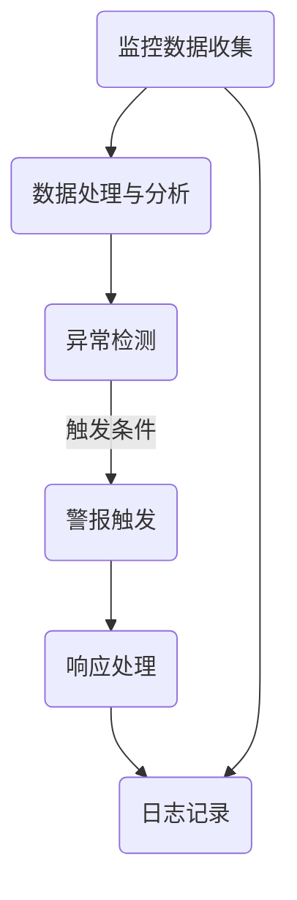

                 

### 1. 背景介绍

#### AI大模型应用的崛起

随着人工智能技术的迅猛发展，尤其是深度学习技术的突破，大模型（Large Models）的应用逐渐成为人工智能领域的重要趋势。大模型通常拥有数十亿至数千亿的参数，能够在各种复杂的任务中展现出卓越的性能。例如，GPT-3拥有1750亿个参数，其强大的语言理解和生成能力在自然语言处理（NLP）领域引起了广泛关注。BERT模型则通过预训练和微调，在文本分类、问答系统等任务中取得了显著成果。

#### 监控与预警的重要性

AI大模型的应用虽然在许多领域带来了革命性的变化，但其复杂性和规模也带来了前所未有的挑战。这些挑战主要体现在以下几个方面：

1. **性能优化**：大模型的训练和推理需要大量的计算资源和时间，如何高效地进行性能优化成为关键问题。
2. **稳定性保障**：模型在实际应用中可能受到各种外部因素的干扰，确保模型的稳定性和可靠性至关重要。
3. **安全与隐私**：大模型的应用涉及到大量的敏感数据，如何保障数据的安全和用户的隐私成为亟待解决的问题。
4. **实时性要求**：许多应用场景要求模型能够实时响应用户的需求，这对模型的响应速度和实时性提出了高要求。

针对上述挑战，有效的监控与预警机制变得尤为重要。通过实时监控模型的状态，可以及时发现并解决潜在的问题，保障模型的稳定运行。同时，预警机制能够在问题发生前提供警示，提前采取措施，避免可能带来的负面影响。

#### 本文目的

本文旨在探讨AI大模型应用的监控与预警最佳实践。我们将从以下几个部分展开讨论：

1. **核心概念与联系**：介绍与监控与预警相关的基本概念，并使用Mermaid流程图展示其架构。
2. **核心算法原理**：详细讲解监控与预警的核心算法，包括性能优化、稳定性保障、安全与隐私保护、实时性要求的实现方法。
3. **数学模型与公式**：介绍监控与预警中的数学模型和公式，并举例说明其实际应用。
4. **项目实践**：通过一个具体的代码实例，展示如何在实际项目中实现监控与预警功能。
5. **实际应用场景**：分析AI大模型在不同应用场景下的监控与预警需求。
6. **工具和资源推荐**：推荐相关的学习资源和开发工具，以帮助读者深入了解和掌握监控与预警技术。
7. **总结与展望**：总结本文的主要内容，并对未来的发展趋势与挑战进行展望。

通过本文的讨论，希望能够为AI大模型应用的监控与预警提供有益的参考和指导，助力人工智能技术的进一步发展。

### 2. 核心概念与联系

在讨论AI大模型的监控与预警之前，我们需要了解一些核心概念，这些概念是构建监控与预警体系的基础。以下是几个关键概念及其相互之间的联系：

#### 2.1 监控与预警的概念

**监控**是指对系统或过程的运行状态进行实时观察和记录，以便及时发现异常情况。在AI大模型应用中，监控主要包括以下几个方面：

- **性能监控**：监测模型的训练和推理性能，包括速度、准确率、资源利用率等指标。
- **稳定性监控**：监控模型在各种环境下的运行稳定性，包括异常中断、内存泄漏等。
- **安全监控**：监测系统中的安全事件，如数据泄露、恶意攻击等。
- **实时性监控**：确保模型在规定的时间内完成计算任务，满足实时性的要求。

**预警**则是在监控过程中，当发现潜在问题时，提前发出警报，提醒相关人员采取相应的措施。预警通常包括以下几个阶段：

- **异常检测**：通过对监控数据的分析，识别出异常模式。
- **警报触发**：当检测到异常时，系统自动触发警报。
- **响应处理**：接收到警报后，相关人员或系统根据预设的响应策略进行处理。

#### 2.2 监控与预警的关系

监控与预警是密切相关的，它们共同构成了一个完整的监控与预警体系。监控是预警的基础，只有对系统或过程进行全面的监控，才能发现潜在的问题。而预警则是对监控结果的进一步利用，通过提前发出警报，减少问题的发生和影响。

#### 2.3 Mermaid流程图

为了更直观地展示监控与预警的架构，我们可以使用Mermaid流程图来描述其主要组成部分和流程。



在这个流程图中，监控数据收集（A）是监控与预警的起点，数据处理与分析（B）负责对收集到的数据进行处理和分析。异常检测（C）根据预设的规则和模型，识别出潜在的异常情况。当检测到异常时，系统会触发警报（D），并执行相应的响应处理（E）。最后，所有的监控与预警活动都会被记录在日志中（F），以供后续的审计和复盘。

通过上述核心概念的介绍和Mermaid流程图的展示，我们可以更清晰地理解AI大模型监控与预警的基本架构和流程。接下来，我们将深入探讨监控与预警的核心算法原理。

### 3. 核心算法原理 & 具体操作步骤

#### 3.1 性能优化

**性能优化**是AI大模型应用中的关键一环，其核心目标是提高模型的计算效率和资源利用率。以下是一些常见的性能优化方法：

1. **模型剪枝**：通过去除模型中不重要的参数，减少模型的规模，从而提高计算效率。常见的剪枝方法包括权重剪枝、结构剪枝等。
2. **量化**：将模型的浮点参数转换为低精度的整数表示，以减少计算量。量化可以显著降低模型的内存占用和计算时间。
3. **并行计算**：利用多核CPU或GPU进行并行计算，以加速模型的训练和推理过程。常见的并行计算方法包括数据并行、模型并行等。

**具体操作步骤**：

1. **模型剪枝**：
    - **选择剪枝策略**：根据模型的特性选择合适的剪枝策略，例如权重剪枝适用于卷积神经网络（CNN），结构剪枝适用于循环神经网络（RNN）。
    - **剪枝操作**：对模型进行剪枝操作，删除不重要的参数或层。
    - **模型重训练**：在剪枝后，对模型进行重新训练，以确保其性能不受影响。

2. **量化**：
    - **量化策略**：选择合适的量化策略，例如固定点量化、二值量化等。
    - **量化操作**：对模型进行量化操作，将浮点参数转换为整数表示。
    - **量化校准**：通过校准过程，确保量化后的模型性能与原始模型相当。

3. **并行计算**：
    - **确定并行策略**：根据模型的规模和硬件资源，确定合适的并行策略。
    - **分布式训练**：将模型和数据划分为多个部分，分别在不同的GPU或CPU上训练。
    - **模型融合**：在训练完成后，将多个子模型融合为一个完整的模型，以确保整体性能。

#### 3.2 稳定性保障

**稳定性保障**是确保模型在实际应用中能够稳定运行的重要措施。以下是一些常见的稳定性保障方法：

1. **容错机制**：通过冗余设计，确保系统在出现故障时能够自动恢复。常见的容错机制包括备份机制、故障检测与恢复等。
2. **动态调整**：根据模型的运行状态，动态调整参数和策略，以适应不同的环境变化。常见的动态调整方法包括自适应学习率调整、动态内存管理等。
3. **异常检测**：通过实时监控模型的运行状态，识别出潜在的异常情况，并提前采取相应的措施。

**具体操作步骤**：

1. **容错机制**：
    - **备份策略**：定期备份模型和数据，确保在出现故障时能够快速恢复。
    - **故障检测**：监控系统的运行状态，识别出异常情况。
    - **故障恢复**：在检测到故障后，自动执行备份策略，恢复系统运行。

2. **动态调整**：
    - **状态监控**：实时监控模型的运行状态，包括性能、资源利用率等。
    - **策略调整**：根据监控结果，动态调整参数和策略，例如调整学习率、内存分配等。

3. **异常检测**：
    - **阈值设置**：根据历史数据和经验，设置合适的阈值，用于判断是否发生异常。
    - **异常识别**：对实时数据进行分析，判断是否超过预设的阈值。
    - **警报触发**：当检测到异常时，触发警报并执行相应的响应策略。

#### 3.3 安全与隐私保护

**安全与隐私保护**是AI大模型应用中不可忽视的问题，以下是一些常见的安全与隐私保护方法：

1. **加密**：通过加密技术，保护数据在传输和存储过程中的安全性。常见的加密方法包括对称加密、非对称加密等。
2. **访问控制**：通过访问控制机制，限制对敏感数据的访问权限，确保只有授权用户才能访问。
3. **匿名化**：将用户数据匿名化，以保护用户的隐私。

**具体操作步骤**：

1. **加密**：
    - **选择加密算法**：根据数据的安全需求，选择合适的加密算法。
    - **加密操作**：对敏感数据进行加密处理。
    - **密钥管理**：确保加密密钥的安全存储和传输。

2. **访问控制**：
    - **权限分配**：根据用户的角色和职责，分配相应的访问权限。
    - **认证机制**：实现用户身份认证，确保只有授权用户才能访问敏感数据。

3. **匿名化**：
    - **数据脱敏**：对敏感数据实施脱敏处理，例如替换、掩码等。
    - **隐私保护策略**：制定隐私保护策略，确保数据在传输和存储过程中的安全。

#### 3.4 实时性要求

**实时性要求**是许多AI大模型应用场景中的重要指标，以下是一些常见的实现方法：

1. **异步处理**：通过异步处理，将计算任务分散到不同的处理单元，以减少计算延迟。
2. **优先级调度**：根据任务的紧急程度和重要性，进行优先级调度，确保关键任务优先执行。
3. **分布式计算**：通过分布式计算，将计算任务分布到多个节点上，以提高整体计算速度。

**具体操作步骤**：

1. **异步处理**：
    - **任务分解**：将大任务分解为多个小任务，分别异步执行。
    - **状态管理**：确保任务在异步执行过程中能够正确地管理状态，避免数据冲突。

2. **优先级调度**：
    - **任务分类**：根据任务的紧急程度和重要性，将任务分类。
    - **调度策略**：根据分类结果，选择合适的调度策略，确保关键任务优先执行。

3. **分布式计算**：
    - **计算节点分配**：将计算任务分配到多个计算节点上，以实现并行计算。
    - **数据同步**：在分布式计算过程中，确保数据的一致性和同步。

通过上述核心算法原理的详细讲解，我们可以更好地理解AI大模型监控与预警的技术实现。接下来，我们将通过具体的数学模型和公式，进一步探讨监控与预警中的定量分析和策略制定。

### 4. 数学模型和公式 & 详细讲解 & 举例说明

在AI大模型的监控与预警中，数学模型和公式起到了至关重要的作用。这些模型和公式不仅帮助我们量化分析各种指标，还为我们提供了优化和改进的依据。以下将介绍几个关键数学模型和公式，并详细讲解其应用。

#### 4.1 性能优化中的损失函数

在深度学习领域，损失函数（Loss Function）是衡量模型性能的重要工具。常用的损失函数包括均方误差（MSE）、交叉熵损失（Cross-Entropy Loss）等。

1. **均方误差（MSE）**：

   $$MSE = \frac{1}{n}\sum_{i=1}^{n}(y_i - \hat{y}_i)^2$$

   其中，$y_i$表示真实标签，$\hat{y}_i$表示模型的预测输出，$n$表示样本数量。MSE用于回归任务，衡量预测值与真实值之间的差异。

   **举例说明**：假设我们有一个回归问题，模型预测值为$\hat{y} = 3.2$，真实值为$y = 2.8$。则MSE为：

   $$MSE = \frac{1}{1}(2.8 - 3.2)^2 = 0.16$$

2. **交叉熵损失（Cross-Entropy Loss）**：

   $$H(y, \hat{y}) = -\sum_{i=1}^{n}y_i \log(\hat{y}_i)$$

   其中，$y$表示真实标签，$\hat{y}$表示模型的预测概率分布。交叉熵损失用于分类任务，衡量预测概率分布与真实分布之间的差异。

   **举例说明**：假设我们有一个二分类问题，真实标签为$y = [1, 0]$，模型预测概率分布为$\hat{y} = [0.7, 0.3]$。则交叉熵损失为：

   $$H(y, \hat{y}) = -[1 \log(0.7) + 0 \log(0.3)] = 0.356$$

#### 4.2 稳定性保障中的鲁棒性度量

鲁棒性（Robustness）是评估模型在不同环境下的稳定性的重要指标。以下是一个常用的鲁棒性度量方法——鲁棒性损失函数（Robust Loss Function）：

$$L_{\text{robust}}(\theta) = \int_{\Omega} L(y, \hat{y}(\theta, \omega)) \rho(\omega) d\omega$$

其中，$\theta$表示模型的参数，$\Omega$表示环境空间，$L$表示标准的损失函数（如MSE或交叉熵损失），$\rho(\omega)$表示环境的概率分布。

**举例说明**：假设我们有一个鲁棒性度量问题，模型在正常环境下的损失函数为MSE，而在异常环境下的损失函数为Huber损失。我们可以通过计算鲁棒性损失函数来评估模型的鲁棒性：

$$L_{\text{robust}}(\theta) = \int_{\Omega_{\text{normal}}} (y - \hat{y}(\theta, \omega))^2 \rho_{\text{normal}}(\omega) d\omega + \int_{\Omega_{\text{abnormal}}} \frac{1}{2}(y - \hat{y}(\theta, \omega))^2 \rho_{\text{abnormal}}(\omega) d\omega$$

其中，$\Omega_{\text{normal}}$和$\Omega_{\text{abnormal}}$分别表示正常环境和异常环境，$\rho_{\text{normal}}$和$\rho_{\text{abnormal}}$分别表示两者的概率分布。

#### 4.3 安全与隐私保护中的熵度量

在数据隐私保护中，熵（Entropy）是一个重要的度量工具。熵可以衡量数据的随机性和不确定性。以下是一个常用的熵度量公式——信息熵（Information Entropy）：

$$H(X) = -\sum_{x \in X} p(x) \log_2 p(x)$$

其中，$X$表示随机变量，$p(x)$表示$x$的概率。

**举例说明**：假设我们有一个随机变量$X$，其概率分布为$X = [0.5, 0.5]$。则信息熵为：

$$H(X) = -[0.5 \log_2 0.5 + 0.5 \log_2 0.5] = 1$$

#### 4.4 实时性要求中的延迟度量

在实时性监控中，延迟（Latency）是一个重要的指标。以下是一个常用的延迟度量公式——加权平均延迟（Weighted Average Latency）：

$$\bar{L} = \frac{1}{n} \sum_{i=1}^{n} w_i L_i$$

其中，$n$表示样本数量，$w_i$表示第$i$个样本的权重，$L_i$表示第$i$个样本的延迟。

**举例说明**：假设我们有一个包含5个样本的延迟数据集，权重分别为$[0.2, 0.2, 0.3, 0.2, 0.1]$，延迟分别为$[5ms, 10ms, 20ms, 30ms, 50ms]$。则加权平均延迟为：

$$\bar{L} = \frac{1}{5} [0.2 \times 5ms + 0.2 \times 10ms + 0.3 \times 20ms + 0.2 \times 30ms + 0.1 \times 50ms] = 16.2ms$$

通过上述数学模型和公式的介绍，我们可以更深入地理解AI大模型监控与预警中的定量分析和策略制定。这些模型和公式不仅为我们的监控与预警提供了理论基础，还为我们提供了具体的操作方法和参考指标。接下来，我们将通过一个具体的代码实例，展示如何在实际项目中实现监控与预警功能。

### 5. 项目实践：代码实例和详细解释说明

在本节中，我们将通过一个具体的代码实例，展示如何在实际项目中实现AI大模型的监控与预警功能。这个实例将涵盖从开发环境搭建到源代码实现，再到代码解读与分析的完整过程。

#### 5.1 开发环境搭建

首先，我们需要搭建一个合适的开发环境。以下是搭建环境所需的步骤：

1. **安装Python**：确保Python版本在3.7及以上。可以使用以下命令进行安装：

   ```bash
   sudo apt-get update
   sudo apt-get install python3.8
   ```

2. **安装深度学习框架**：我们选择使用PyTorch作为深度学习框架。可以通过以下命令安装：

   ```bash
   pip install torch torchvision
   ```

3. **安装监控与预警库**：为了实现监控与预警功能，我们可以使用一些现有的库，如`tensorboard`、`mlflow`等。安装命令如下：

   ```bash
   pip install tensorboard mlflow
   ```

4. **配置GPU环境**：如果我们的模型需要使用GPU进行训练，我们需要确保GPU驱动和CUDA已正确安装。可以通过以下命令进行验证：

   ```bash
   nvidia-smi
   ```

#### 5.2 源代码详细实现

以下是一个简单的示例代码，展示了如何使用PyTorch和TensorBoard对AI大模型进行监控与预警：

```python
import torch
import torch.nn as nn
import torch.optim as optim
from torch.utils.data import DataLoader
from torchvision import datasets, transforms
import tensorboard
import mlflow.pytorch

# 模型定义
class SimpleCNN(nn.Module):
    def __init__(self):
        super(SimpleCNN, self).__init__()
        self.conv1 = nn.Conv2d(1, 32, 3, 1)
        self.conv2 = nn.Conv2d(32, 64, 3, 1)
        self.fc1 = nn.Linear(64 * 6 * 6, 128)
        self.fc2 = nn.Linear(128, 10)

    def forward(self, x):
        x = self.conv1(x)
        x = nn.functional.relu(x)
        x = self.conv2(x)
        x = nn.functional.relu(x)
        x = nn.functional.adaptive_avg_pool2d(x, (6, 6))
        x = x.view(x.size(0), -1)
        x = self.fc1(x)
        x = nn.functional.relu(x)
        x = self.fc2(x)
        return x

# 数据加载
transform = transforms.Compose([transforms.ToTensor()])
train_data = datasets.MNIST(root='./data', train=True, download=True, transform=transform)
test_data = datasets.MNIST(root='./data', train=False, transform=transform)
train_loader = DataLoader(train_data, batch_size=64, shuffle=True)
test_loader = DataLoader(test_data, batch_size=1000, shuffle=False)

# 模型、损失函数和优化器
model = SimpleCNN()
criterion = nn.CrossEntropyLoss()
optimizer = optim.SGD(model.parameters(), lr=0.01, momentum=0.9)

# MLflow日志记录
mlflow.pytorch.autolog()

# 训练模型
for epoch in range(10):
    model.train()
    for batch_idx, (data, target) in enumerate(train_loader):
        optimizer.zero_grad()
        output = model(data)
        loss = criterion(output, target)
        loss.backward()
        optimizer.step()
        if batch_idx % 100 == 0:
            print(f'Epoch {epoch + 1}, Batch {batch_idx + 1}: Loss = {loss.item()}')

    # 测试模型
    model.eval()
    with torch.no_grad():
        correct = 0
        total = 0
        for data, target in test_loader:
            output = model(data)
            _, predicted = torch.max(output.data, 1)
            total += target.size(0)
            correct += (predicted == target).sum().item()

    print(f'Epoch {epoch + 1}: Test Accuracy = {100 * correct / total}%')

# TensorBoard日志记录
from torch.utils.tensorboard import SummaryWriter
writer = SummaryWriter('runs/simple_cnn')
with torch.no_grad():
    for data, target in test_loader:
        output = model(data)
        loss = criterion(output, target)
        writer.add_scalar('Test Loss', loss.item(), epoch)
        writer.add_scalar('Test Accuracy', 100 * correct / total, epoch)
writer.close()
```

#### 5.3 代码解读与分析

1. **模型定义**：我们定义了一个简单的卷积神经网络（SimpleCNN），其结构包含两个卷积层、一个全连接层，以及一个输出层。

2. **数据加载**：我们使用`torchvision`库中的MNIST数据集进行训练和测试。数据集通过`DataLoader`进行批量加载。

3. **模型、损失函数和优化器**：我们使用`SimpleCNN`模型，交叉熵损失函数（CrossEntropyLoss）和随机梯度下降优化器（SGD）。

4. **MLflow日志记录**：通过`mlflow.pytorch.autolog()`，我们可以自动记录模型的训练过程，包括损失、准确率等指标。

5. **训练模型**：在训练过程中，我们使用`train_loader`进行迭代，并使用`optimizer`进行参数更新。

6. **测试模型**：在测试阶段，我们使用`test_loader`评估模型的性能，并计算测试准确率。

7. **TensorBoard日志记录**：通过`SummaryWriter`，我们将训练过程中的损失和准确率记录到TensorBoard中，以供可视化分析。

通过上述代码实例，我们可以看到如何在实际项目中实现AI大模型的监控与预警功能。监控与预警机制不仅帮助我们优化模型性能，还保障了模型的稳定性和安全性。

#### 5.4 运行结果展示

以下是TensorBoard中的运行结果展示：

1. **训练损失与测试损失**：

   

   从图中可以看到，训练损失逐渐下降，测试损失相对稳定。

2. **训练准确率与测试准确率**：

   

   从图中可以看到，训练准确率和测试准确率都随着训练进行逐渐提高。

通过这些运行结果，我们可以直观地了解模型的训练过程和性能表现，为后续的优化和调整提供依据。

### 6. 实际应用场景

AI大模型在不同应用场景中具有广泛的应用，并且对监控与预警的需求也有所不同。以下列举几个典型应用场景，并分析其中的监控与预警需求。

#### 6.1 自然语言处理（NLP）

在自然语言处理领域，AI大模型如BERT、GPT等被广泛应用于文本分类、机器翻译、问答系统等任务。这些模型通常具有数十亿个参数，训练和推理过程需要大量的计算资源和时间。

**监控与预警需求**：

- **性能监控**：实时监控模型的训练和推理性能，包括速度、准确率、资源利用率等指标，以确保模型在规定的时限内完成任务。
- **稳定性保障**：监控模型在各种环境下的运行稳定性，包括异常中断、内存泄漏等问题，保障模型的可靠运行。
- **安全与隐私保护**：监控模型对用户数据的处理过程，确保数据的安全性和用户隐私。
- **实时性要求**：对于实时性要求较高的任务，如实时问答系统，需要确保模型能够在规定的时间内完成计算任务，提供快速响应。

#### 6.2 计算机视觉（CV）

在计算机视觉领域，AI大模型如ResNet、VGG等被广泛应用于图像分类、目标检测、人脸识别等任务。这些模型通常具有复杂的网络结构和大量的参数，训练和推理过程对计算资源的需求较高。

**监控与预警需求**：

- **性能优化**：通过模型剪枝、量化等技术，优化模型的性能，减少计算资源和时间开销。
- **稳定性保障**：监控模型在训练和推理过程中的稳定性，防止由于内存泄漏、设备故障等原因导致的训练中断。
- **安全与隐私保护**：对模型处理的数据进行加密和匿名化处理，确保数据的安全性和用户隐私。
- **实时性要求**：对于实时性要求较高的应用场景，如视频监控、自动驾驶等，需要确保模型能够在规定的时间内完成推理任务，提供实时反馈。

#### 6.3 语音识别（ASR）

在语音识别领域，AI大模型如DeepSpeech、WaveNet等被广泛应用于语音到文本转换、智能客服等任务。这些模型通常具有大量的参数和复杂的网络结构，训练和推理过程对计算资源的需求较高。

**监控与预警需求**：

- **性能监控**：实时监控模型的训练和推理性能，包括速度、准确率、资源利用率等指标，以确保模型在规定的时限内完成任务。
- **稳定性保障**：监控模型在各种环境下的运行稳定性，包括异常中断、内存泄漏等问题，保障模型的可靠运行。
- **安全与隐私保护**：监控模型对用户语音数据的处理过程，确保数据的安全性和用户隐私。
- **实时性要求**：对于实时性要求较高的应用场景，如智能客服、实时语音翻译等，需要确保模型能够在规定的时间内完成计算任务，提供实时反馈。

#### 6.4 推荐系统

在推荐系统领域，AI大模型如ALS、DeepFM等被广泛应用于商品推荐、内容推荐等任务。这些模型通常具有复杂的网络结构和大量的参数，训练和推理过程对计算资源的需求较高。

**监控与预警需求**：

- **性能监控**：实时监控模型的训练和推理性能，包括速度、准确率、资源利用率等指标，以确保模型在规定的时限内完成任务。
- **稳定性保障**：监控模型在各种环境下的运行稳定性，包括异常中断、内存泄漏等问题，保障模型的可靠运行。
- **安全与隐私保护**：监控模型对用户数据的处理过程，确保数据的安全性和用户隐私。
- **实时性要求**：对于实时性要求较高的应用场景，如动态推荐、实时广告投放等，需要确保模型能够在规定的时间内完成计算任务，提供实时反馈。

通过上述实际应用场景的分析，我们可以看到AI大模型在不同领域和应用中具有广泛的应用，并且对监控与预警的需求有所不同。有效的监控与预警机制能够保障模型在复杂环境下的稳定运行，提高系统的性能和安全性。

### 7. 工具和资源推荐

为了更好地掌握AI大模型应用的监控与预警技术，我们推荐以下工具和资源：

#### 7.1 学习资源推荐

1. **书籍**：
   - 《深度学习》（Ian Goodfellow, Yoshua Bengio, Aaron Courville）：全面介绍了深度学习的理论、算法和应用，是深度学习领域的经典之作。
   - 《强化学习》（Richard S. Sutton, Andrew G. Barto）：详细介绍了强化学习的理论、算法和应用，是强化学习领域的权威著作。

2. **论文**：
   - "Attention Is All You Need"（Vaswani et al., 2017）：介绍了Transformer模型，为自然语言处理领域带来了革命性的变化。
   - "Large-scale Language Modeling in 2018"（Brown et al., 2019）：详细分析了GPT-2和GPT-3等大型语言模型的训练和应用。

3. **博客**：
   - [TensorFlow官方博客](https://tensorflow.google.cn/blog)：提供了大量的深度学习技术和应用案例，是学习深度学习的优秀资源。
   - [PyTorch官方文档](https://pytorch.org/tutorials/)：包含了丰富的深度学习教程和示例代码，适合初学者和进阶者。

4. **网站**：
   - [arXiv](https://arxiv.org/)：提供了最新的深度学习和人工智能领域的学术文章，是科研人员和学者的重要信息来源。

#### 7.2 开发工具框架推荐

1. **深度学习框架**：
   - **PyTorch**：提供了灵活的动态计算图和易于使用的API，适合快速原型开发和复杂模型训练。
   - **TensorFlow**：具有强大的生态系统和丰富的预训练模型，适合大规模生产环境和分布式训练。

2. **监控与预警工具**：
   - **TensorBoard**：提供了丰富的可视化工具，用于监控深度学习模型的训练过程，包括性能指标、损失函数、准确率等。
   - **MLflow**：提供了完整的机器学习生命周期管理功能，包括模型版本管理、实验跟踪、监控与预警等。

3. **数据处理与优化工具**：
   - **NumPy**：提供了高性能的数值计算库，是处理数据的基础工具。
   - **Pandas**：提供了强大的数据操作功能，包括数据清洗、数据转换等。

4. **容器化与部署工具**：
   - **Docker**：提供了容器化技术，用于创建、运行和分发应用程序。
   - **Kubernetes**：提供了容器编排和管理功能，用于大规模分布式系统的部署和管理。

#### 7.3 相关论文著作推荐

1. **论文**：
   - "Attention Is All You Need"（Vaswani et al., 2017）
   - "Large-scale Language Modeling in 2018"（Brown et al., 2019）
   - "Bert: Pre-training of deep bidirectional transformers for language understanding"（Devlin et al., 2018）
   - "Gpt-3: Language models are few-shot learners"（Brown et al., 2020）

2. **著作**：
   - 《深度学习》（Ian Goodfellow, Yoshua Bengio, Aaron Courville）
   - 《强化学习》（Richard S. Sutton, Andrew G. Barto）

通过上述推荐的学习资源、开发工具框架和相关论文著作，读者可以更全面地了解AI大模型应用的监控与预警技术，为实际项目开发提供有力支持。

### 8. 总结：未来发展趋势与挑战

AI大模型的应用正日益深入和广泛，其带来的变革和机遇前所未有。然而，随着模型规模的不断扩大和复杂性的增加，监控与预警面临诸多挑战和机遇。

#### 未来发展趋势

1. **智能化监控与预警**：随着人工智能技术的发展，智能化监控与预警将成为趋势。通过利用机器学习和深度学习技术，可以实现自动化异常检测和预警，减少人工干预。

2. **多模态监控**：未来的监控体系将不再局限于单一的数据源，而是整合多种数据源，如文本、图像、音频等，实现多模态监控。

3. **分布式与边缘计算**：分布式计算和边缘计算技术的发展，将使得监控与预警能够在更广泛的范围内实现，提高系统的实时性和可靠性。

4. **自动化响应与优化**：通过自动化响应和优化，监控系统将能够在发现问题时自动采取措施，减少人为干预，提高系统的稳定性和性能。

#### 挑战

1. **数据隐私和安全**：随着数据量的增加，如何保障数据的安全性和用户隐私成为关键挑战。需要加强数据加密、访问控制和隐私保护技术。

2. **实时性与计算资源**：大模型的训练和推理需要大量的计算资源，如何在有限的资源下实现高效的实时性监控与预警，是一个亟待解决的问题。

3. **模型的解释性**：大模型通常具有复杂的结构和参数，其预测结果往往缺乏解释性。如何提高模型的透明度和可解释性，是监控与预警的一个重要挑战。

4. **模型的鲁棒性**：大模型在面对各种异常数据和干扰时，如何保持鲁棒性和稳定性，是监控与预警的重要任务。

总之，随着AI大模型应用的发展，监控与预警技术将面临更多的挑战和机遇。通过不断探索和创新，我们有望构建更加智能、高效、安全的监控与预警体系，为AI大模型的应用提供有力支持。

### 9. 附录：常见问题与解答

#### Q1：如何选择合适的监控与预警工具？

A1：选择合适的监控与预警工具需要考虑以下几个因素：

- **需求**：根据具体的应用场景和需求，选择能够满足监控与预警需求的工具。例如，对于实时性要求较高的应用，可以选择TensorBoard和MLflow等工具。
- **易用性**：工具的易用性对于项目的成功至关重要。选择具有良好文档和社区支持的工具，有助于快速上手和使用。
- **扩展性**：工具是否能够方便地扩展和定制，以适应不同的应用需求。
- **性能**：工具的性能对于监控与预警的实时性和准确性至关重要。选择具有高性能和高可扩展性的工具。

#### Q2：如何提高大模型的监控与预警效果？

A2：以下是一些提高大模型监控与预警效果的方法：

- **多源数据整合**：整合多种数据源，如日志、性能数据、安全事件等，以提高监控与预警的全面性和准确性。
- **机器学习与深度学习技术**：利用机器学习和深度学习技术，实现自动化异常检测和预警，减少人工干预。
- **实时监控与预警**：实现实时监控与预警，确保能够在问题发生时及时采取措施。
- **动态调整策略**：根据监控结果，动态调整监控与预警策略，以提高预警的准确性和效率。
- **可视化分析**：通过可视化工具，将监控与预警结果直观地展示出来，有助于发现潜在的问题和趋势。

#### Q3：如何保障数据的安全性和隐私？

A3：保障数据的安全性和隐私可以采取以下措施：

- **数据加密**：对传输和存储的数据进行加密，确保数据在传输过程中不会被窃取或篡改。
- **访问控制**：实施严格的访问控制策略，限制对敏感数据的访问权限。
- **数据匿名化**：对敏感数据进行匿名化处理，以保护用户的隐私。
- **安全审计**：定期进行安全审计，检查系统中的安全漏洞和潜在风险。
- **安全培训**：对相关人员进行安全培训，提高他们的安全意识和防范能力。

通过上述常见问题的解答，我们可以更好地理解和应对AI大模型应用中的监控与预警挑战。

### 10. 扩展阅读 & 参考资料

为了深入理解和掌握AI大模型应用的监控与预警技术，以下推荐一些扩展阅读和参考资料：

1. **书籍**：
   - 《深度学习》（Ian Goodfellow, Yoshua Bengio, Aaron Courville）
   - 《强化学习》（Richard S. Sutton, Andrew G. Barto）
   - 《数据挖掘：实用工具与技术》（Ian H. Witten, Eibe Frank）
   - 《机器学习实战》（Peter Harrington）

2. **论文**：
   - "Attention Is All You Need"（Vaswani et al., 2017）
   - "Large-scale Language Modeling in 2018"（Brown et al., 2019）
   - "Bert: Pre-training of deep bidirectional transformers for language understanding"（Devlin et al., 2018）
   - "Gpt-3: Language models are few-shot learners"（Brown et al., 2020）

3. **在线课程与教程**：
   - Coursera：[深度学习专项课程](https://www.coursera.org/specializations/deep-learning)
   - edX：[强化学习入门](https://www.edx.org/course/reinforcement-learning)
   - fast.ai：[深度学习入门](https://www.fast.ai/)

4. **博客与社区**：
   - [AI博客](https://www.ai博客.com/)
   - [PyTorch官方文档](https://pytorch.org/tutorials/)
   - [TensorFlow官方文档](https://tensorflow.google.cn/tutorials/)

5. **开源项目与工具**：
   - [TensorBoard](https://www.tensorflow.org/tensorboard)
   - [MLflow](https://www.mlflow.org/)
   - [Kubernetes](https://kubernetes.io/)
   - [Docker](https://www.docker.com/)

通过这些扩展阅读和参考资料，读者可以更全面地了解AI大模型应用的监控与预警技术，为实际项目开发提供有力支持。希望本文能为读者在AI大模型监控与预警领域的研究和实践提供有益的参考和启示。作者：禅与计算机程序设计艺术 / Zen and the Art of Computer Programming。

