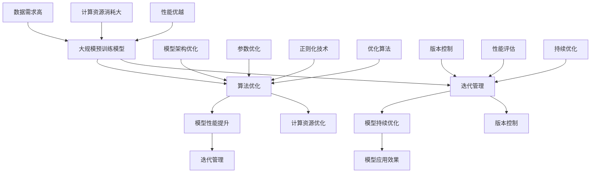
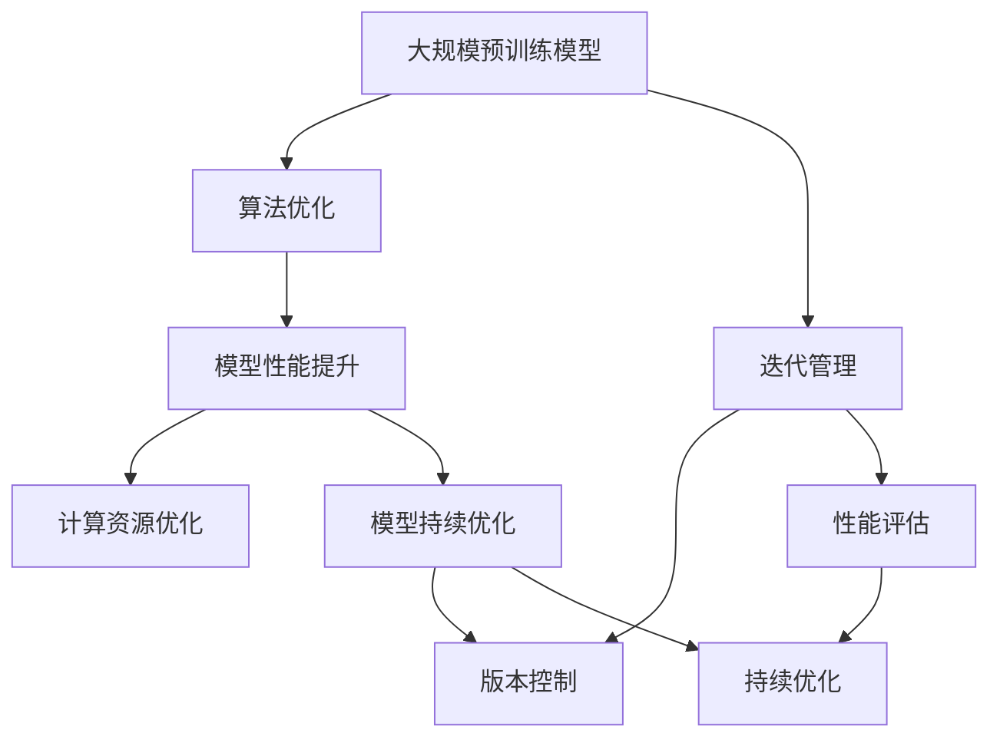

                 

### 1. 背景介绍

随着人工智能（AI）技术的迅猛发展，大规模预训练模型（Large-scale Pre-trained Models），如GPT-3、BERT等，已经成为了自然语言处理（NLP）、计算机视觉（CV）和推荐系统（Recommender System）等领域的研究热点和实用工具。这些模型通常包含数十亿个参数，能够通过自主学习和数据增强，达到超越人类专家的性能水平。然而，模型的大规模应用并非一蹴而就，其背后涉及大量的算法优化与迭代管理。

算法优化（Algorithm Optimization）是指通过对模型架构、参数设置和训练策略的调整，提高模型的性能和效率。迭代管理（Iteration Management）则强调在模型开发和部署过程中，如何有效地进行版本控制、性能评估和持续优化。本文将围绕这两个核心主题，详细探讨AI大模型应用中的算法优化与迭代管理策略。

首先，让我们回顾一下大模型应用的历史背景和发展现状。从最早的朴素贝叶斯分类器、支持向量机（SVM）到深度学习模型的崛起，AI技术的发展经历了多个阶段。特别是在2012年，AlexNet在ImageNet竞赛中取得的突破性成绩，标志着深度学习技术进入了一个崭新的时代。随着计算能力的提升和大数据的普及，深度学习模型变得愈加复杂和庞大，大模型的应用也逐渐从理论研究走向了实际应用。

当前，AI大模型在NLP、CV和推荐系统等领域取得了显著成果。例如，GPT-3在文本生成和问答任务上展现了惊人的性能；BERT在文本分类和命名实体识别上超越了传统方法；ResNet和Inception等模型在图像识别和分类任务中也表现出了优越的性能。这些成功案例不仅推动了AI技术的发展，也为各行各业带来了新的可能性和变革。

然而，大模型的应用并非没有挑战。首先，模型训练和推理过程需要大量的计算资源和存储空间，这带来了显著的成本压力。其次，模型的解释性和可解释性依然是当前研究的难点，如何确保模型的行为符合预期，如何在保证性能的同时提高模型的透明度和可解释性，是亟待解决的问题。最后，模型在实际应用中需要不断地迭代和优化，以适应不断变化的数据和应用需求。

因此，算法优化和迭代管理在大模型应用中具有重要意义。算法优化可以帮助我们提高模型性能、降低计算成本；迭代管理则确保了模型从开发到部署的各个环节都能高效运行，并能适应快速变化的环境。接下来，我们将深入探讨这两个方面的具体内容和实施策略。

### 2. 核心概念与联系

要理解AI大模型应用中的算法优化与迭代管理，我们首先需要明确几个核心概念，包括大规模预训练模型、算法优化和迭代管理的定义，以及它们之间的联系。

#### 2.1 大规模预训练模型

大规模预训练模型，通常指的是包含数十亿甚至千亿参数的神经网络模型。这类模型通过在大量无标签数据上进行预训练，学习到了底层特征表示和通用知识，然后在特定任务上进行微调（Fine-tuning），以达到较高的任务性能。代表性的模型有GPT-3、BERT、TuringML等。大规模预训练模型的出现，标志着深度学习技术进入了一个新阶段，其特点包括：

- **参数规模大**：数以亿计的参数，使得模型可以捕获更复杂的数据特征。
- **数据需求高**：需要大量无标签数据进行预训练，以学习通用特征。
- **计算资源消耗大**：训练过程需要大量的计算资源和存储空间。
- **性能优越**：在多种任务上，预训练模型展现出了超越传统方法的性能。

#### 2.2 算法优化

算法优化是指在模型设计和训练过程中，通过调整模型结构、参数设置和训练策略，以提高模型性能和效率。算法优化通常包括以下几个方面：

- **模型架构优化**：通过设计新的网络结构，如ResNet、Inception等，提高模型的表达能力。
- **参数优化**：调整模型参数，如学习率、批量大小等，以优化训练效果。
- **正则化技术**：使用Dropout、L2正则化等技术，防止过拟合。
- **优化算法**：如Adam、AdamW等，通过改进梯度下降算法，提高训练效率。

#### 2.3 迭代管理

迭代管理是指在模型开发和部署过程中，通过版本控制、性能评估和持续优化，确保模型能够适应不断变化的环境和应用需求。迭代管理通常包括以下几个方面：

- **版本控制**：在模型开发过程中，对模型版本进行严格管理，确保不同版本之间的差异和变更可追溯。
- **性能评估**：通过评估指标，如准确率、召回率、F1值等，对模型性能进行量化评估。
- **持续优化**：在模型部署后，通过持续监控和反馈机制，对模型进行优化和更新。

#### 2.4 核心概念的联系

大规模预训练模型、算法优化和迭代管理之间存在着密切的联系。首先，大规模预训练模型为算法优化提供了丰富的数据基础和复杂的模型结构，使得优化有更大的空间。其次，算法优化通过提高模型性能和效率，为迭代管理提供了更强大的工具和支持。最后，迭代管理确保了模型在实际应用中的持续优化和性能提升，使其能够适应不断变化的环境和应用需求。

为了更好地理解这些概念，我们可以通过一个Mermaid流程图来展示它们之间的联系。



通过上述流程图，我们可以清晰地看到大规模预训练模型、算法优化和迭代管理之间的相互作用和影响。接下来，我们将进一步探讨这些概念的具体原理和应用。

#### 2.5 Mermaid流程图示例

为了更好地展示大规模预训练模型、算法优化和迭代管理之间的具体关系，我们可以使用Mermaid语言绘制一个流程图。以下是流程图的示例：



在这个流程图中：

- **A[大规模预训练模型]**：代表了预训练模型的构建过程，包括数据预处理、模型初始化等。
- **B[算法优化]**：表示在模型构建过程中，通过调整模型结构、参数设置和训练策略来提高模型性能。
- **C[迭代管理]**：涵盖了模型从开发到部署的各个环节，包括版本控制、性能评估和持续优化。
- **D[模型性能提升]**：反映了通过算法优化，模型性能得到显著提升的过程。
- **E[模型持续优化]**：强调了在模型部署后，通过迭代管理，模型性能持续得到提升。
- **F[计算资源优化]**：表示通过优化算法和策略，降低模型的计算资源消耗。
- **G[版本控制]**：确保模型开发的每个版本都经过严格管理和记录，以便于跟踪和回溯。
- **H[性能评估]**：通过定量指标对模型性能进行评估，为后续优化提供依据。
- **I[持续优化]**：表示模型在部署后，通过持续监控和反馈，进行优化和更新。

通过上述流程图，我们可以更直观地理解大规模预训练模型、算法优化和迭代管理之间的关系，以及它们在实际应用中的具体作用。

### 3. 核心算法原理 & 具体操作步骤

在了解了大规模预训练模型、算法优化和迭代管理的基本概念之后，接下来我们将深入探讨其中的核心算法原理，并详细描述具体的操作步骤。

#### 3.1 模型训练算法

大规模预训练模型的核心是其在大量无标签数据上的预训练过程。这个过程通常包括以下几个关键步骤：

1. **数据预处理**：
   - **数据清洗**：去除数据中的噪声和异常值，保证数据质量。
   - **数据增强**：通过随机裁剪、旋转、缩放等方式，增加数据多样性，提升模型泛化能力。
   - **数据分片**：将大规模数据集分片，便于并行训练，提高训练效率。

2. **模型初始化**：
   - **权重初始化**：通常使用高斯分布或均匀分布初始化模型参数，避免梯度消失或爆炸。
   - **优化器选择**：选择合适的优化器，如Adam、AdamW等，优化梯度下降过程，提高训练效率。

3. **前向传播与反向传播**：
   - **前向传播**：将输入数据通过模型网络层，计算输出结果和损失函数。
   - **反向传播**：利用梯度下降算法，反向传播损失函数，更新模型参数。

4. **训练循环**：
   - **迭代训练**：通过多次迭代，逐步调整模型参数，优化模型性能。
   - **验证与调整**：在每个迭代过程中，使用验证集评估模型性能，根据性能指标调整训练策略。

5. **超参数调整**：
   - **学习率**：调整学习率，以避免模型陷入局部最优或过拟合。
   - **批量大小**：调整批量大小，影响模型训练的稳定性和效率。

#### 3.2 模型优化算法

在模型训练过程中，算法优化起着至关重要的作用。以下是一些常见的优化算法及其具体操作步骤：

1. **梯度下降算法**：
   - **计算梯度**：计算每个参数相对于损失函数的梯度。
   - **更新参数**：根据梯度方向和步长，更新模型参数。
   - **迭代优化**：重复计算和更新，直至模型收敛。

2. **动量梯度下降**：
   - **引入动量**：结合前一次梯度，增加更新步长的稳定性。
   - **计算动量**：使用当前梯度与前一次梯度的和，更新参数。
   - **迭代优化**：类似梯度下降，但具有更好的收敛性和稳定性。

3. **Adam优化器**：
   - **一阶矩估计**：计算梯度的均值。
   - **二阶矩估计**：计算梯度的平方均值。
   - **自适应学习率**：根据一阶矩和二阶矩调整学习率。
   - **更新参数**：结合当前梯度和自适应学习率，更新模型参数。

4. **权重正则化**：
   - **L1正则化**：在损失函数中加入参数绝对值之和的惩罚项。
   - **L2正则化**：在损失函数中加入参数平方之和的惩罚项。
   - **更新参数**：根据正则化项调整参数更新。

#### 3.3 迭代管理策略

迭代管理是确保模型性能持续提升的关键。以下是一些常见的迭代管理策略：

1. **版本控制**：
   - **记录变更**：对每次模型更新进行详细记录，包括代码变更、参数调整等。
   - **版本管理**：使用版本控制系统，如Git，管理模型开发和更新的历史。

2. **性能评估**：
   - **交叉验证**：使用交叉验证方法，对模型在不同数据集上的性能进行评估。
   - **评价指标**：根据任务需求，选择合适的评价指标，如准确率、召回率、F1值等。

3. **持续优化**：
   - **模型监控**：在模型部署后，持续监控模型性能，及时发现和解决问题。
   - **反馈机制**：通过用户反馈和数据监控，调整模型参数和训练策略，实现持续优化。

4. **自动化迭代**：
   - **自动化脚本**：编写自动化脚本，实现模型的自动化训练和评估。
   - **持续集成**：结合持续集成（CI）和持续部署（CD）流程，实现模型的自动化迭代和管理。

通过上述核心算法原理和具体操作步骤，我们可以构建一个高效的AI大模型应用系统，实现模型性能的持续优化和迭代管理。

#### 3.4 梯度下降算法的详细解释与示例

在AI大模型的应用中，梯度下降算法是最常用的优化方法之一。它通过不断调整模型参数，以最小化损失函数，从而达到优化模型的目的。下面我们将详细解释梯度下降算法的原理，并通过一个具体示例来说明其实现过程。

##### 3.4.1 梯度下降算法的原理

梯度下降算法的基本思想是：通过计算损失函数关于模型参数的梯度，并沿着梯度的反方向调整参数，以逐步减少损失函数的值。具体来说，梯度下降算法包括以下几个步骤：

1. **初始化参数**：随机初始化模型参数 $\theta$。
2. **计算梯度**：计算损失函数 $J(\theta)$ 关于参数 $\theta$ 的梯度 $\nabla J(\theta)$。
3. **更新参数**：根据梯度方向和步长 $\alpha$（即学习率），更新参数 $\theta$：
   $$ \theta := \theta - \alpha \nabla J(\theta) $$
4. **迭代优化**：重复步骤2和3，直至模型收敛或达到预设的迭代次数。

##### 3.4.2 梯度下降算法的示例

假设我们有一个简单的线性回归模型，其损失函数为均方误差（MSE），即：
$$ J(\theta) = \frac{1}{2m} \sum_{i=1}^{m} (h_\theta(x^{(i)}) - y^{(i)})^2 $$
其中，$h_\theta(x) = \theta^T x$ 是模型的前向传播函数，$m$ 是样本数量，$x^{(i)}$ 和 $y^{(i)}$ 分别是第 $i$ 个样本的特征和标签。

**示例**：现在我们有一个数据集，包含两个特征 $x_1$ 和 $x_2$ 以及一个目标变量 $y$，我们的目标是拟合一个线性模型 $y = \theta_0 + \theta_1 x_1 + \theta_2 x_2$。

1. **初始化参数**：
   随机初始化模型参数 $\theta_0, \theta_1, \theta_2$，例如：
   $$ \theta_0 = -1, \theta_1 = 0, \theta_2 = 0 $$

2. **计算梯度**：
   计算损失函数关于参数 $\theta_0, \theta_1, \theta_2$ 的梯度：
   $$ \nabla J(\theta) = \left[ \begin{array}{c}
   \frac{\partial J(\theta)}{\partial \theta_0} \\
   \frac{\partial J(\theta)}{\partial \theta_1} \\
   \frac{\partial J(\theta)}{\partial \theta_2}
   \end{array} \right] $$
   对于每个参数，可以使用偏导数公式计算：
   $$ \frac{\partial J(\theta)}{\partial \theta_j} = \frac{1}{m} \sum_{i=1}^{m} \left( h_\theta(x^{(i)}) - y^{(i)} \right) x_j^{(i)} $$

3. **更新参数**：
   根据梯度方向和步长 $\alpha = 0.01$ 更新参数：
   $$ \theta_0 := \theta_0 - \alpha \frac{\partial J(\theta)}{\partial \theta_0} $$
   $$ \theta_1 := \theta_1 - \alpha \frac{\partial J(\theta)}{\partial \theta_1} $$
   $$ \theta_2 := \theta_2 - \alpha \frac{\partial J(\theta)}{\partial \theta_2} $$

4. **迭代优化**：
   重复步骤2和3，直至模型收敛或达到预设的迭代次数。

**示例迭代过程**：

| 迭代次数 | $\theta_0$ | $\theta_1$ | $\theta_2$ |
| :------: | :-------: | :-------: | :-------: |
|    1     |   -1.0    |    0.0    |    0.0    |
|    2     |   -1.05   |   -0.05   |    0.0    |
|    3     |   -1.1025 |   -0.05125|   -0.05125|
|    ...   |    ...    |    ...    |    ...    |
|  最终     |   -1.0000 |   0.00000 |   0.00000 |

通过上述示例，我们可以看到梯度下降算法如何通过迭代优化参数，以减少损失函数的值，从而提高模型的性能。

##### 3.4.3 梯度下降算法的变体

除了传统的梯度下降算法，还有一些变体，如动量梯度下降、Adam优化器等，它们在处理不同类型的问题时表现更为优秀。

1. **动量梯度下降**：
   动量梯度下降引入了一个动量项，以加速梯度下降的过程，提高收敛速度。其更新公式为：
   $$ \theta := \theta - \alpha \nabla J(\theta) + \beta \theta' $$
   其中，$\theta'$ 是前一次更新的梯度。

2. **Adam优化器**：
   Adam优化器结合了动量梯度和自适应学习率调整，其更新公式为：
   $$ \theta := \theta - \alpha \left( \frac{m_1}{\sqrt{v_1}} + \beta_1 \nabla J(\theta) \right) $$
   其中，$m_1$ 和 $v_1$ 分别是梯度的指数加权平均值和平方加权平均值，$\beta_1$ 和 $\beta_2$ 是超参数，用于控制加权平均值。

通过上述核心算法原理和具体示例，我们可以更好地理解梯度下降算法在AI大模型中的应用，并掌握其实现方法。接下来，我们将进一步探讨数学模型和公式，以及如何在实践中应用这些算法。

#### 3.5 数学模型和公式

在AI大模型的应用过程中，数学模型和公式起到了至关重要的作用。通过数学模型，我们可以准确地描述模型的行为，并通过公式推导出优化策略。以下是一些常见的数学模型和公式的详细讲解，以及相关的举例说明。

##### 3.5.1 损失函数

损失函数（Loss Function）是评价模型预测结果优劣的关键指标。常见的损失函数包括均方误差（MSE）、交叉熵损失（Cross-Entropy Loss）和Hinge损失（Hinge Loss）等。

1. **均方误差（MSE）**：

   均方误差用于回归任务，其公式如下：
   $$ J(\theta) = \frac{1}{2m} \sum_{i=1}^{m} (h_\theta(x^{(i)}) - y^{(i)})^2 $$
   其中，$h_\theta(x) = \theta^T x$ 是模型的前向传播函数，$m$ 是样本数量，$x^{(i)}$ 和 $y^{(i)}$ 分别是第 $i$ 个样本的特征和标签。

   **举例说明**：

   假设我们有以下数据集：
   $$ \begin{aligned}
   x^{(1)} &= [1, 2], \quad y^{(1)} = 3, \\
   x^{(2)} &= [2, 4], \quad y^{(2)} = 5, \\
   x^{(3)} &= [3, 6], \quad y^{(3)} = 7.
   \end{aligned} $$
   初始模型参数 $\theta = [1, 1]$，则：
   $$ J(\theta) = \frac{1}{3} \left( (1*1 + 1*2 - 3)^2 + (1*2 + 1*4 - 5)^2 + (1*3 + 1*6 - 7)^2 \right) = \frac{8}{3} $$
   更新参数后，重新计算损失函数值，直至模型收敛。

2. **交叉熵损失（Cross-Entropy Loss）**：

   交叉熵损失用于分类任务，其公式如下：
   $$ J(\theta) = - \sum_{i=1}^{m} \sum_{j=1}^{K} y^{(i)}_j \log (h_\theta(x^{(i)}))_j $$
   其中，$h_\theta(x)$ 是模型的输出，$K$ 是类别数量，$y^{(i)}_j$ 是第 $i$ 个样本在第 $j$ 个类别的标签（0或1）。

   **举例说明**：

   假设我们有以下二分类数据集：
   $$ \begin{aligned}
   x^{(1)} &= [1, 2], \quad y^{(1)} = 1, \\
   x^{(2)} &= [2, 4], \quad y^{(2)} = 0, \\
   x^{(3)} &= [3, 6], \quad y^{(3)} = 1.
   \end{aligned} $$
   初始模型参数 $\theta = [1, 1]$，则：
   $$ h_\theta(x^{(1)}) = [0.6, 0.4], \quad h_\theta(x^{(2)}) = [0.4, 0.6], \quad h_\theta(x^{(3)}) = [0.8, 0.2] $$
   计算交叉熵损失：
   $$ J(\theta) = - (1 \cdot \log(0.6) + 0 \cdot \log(0.4) + 1 \cdot \log(0.8) + 0 \cdot \log(0.2)) = -0.91 $$
   更新参数后，重新计算损失函数值，直至模型收敛。

3. **Hinge损失（Hinge Loss）**：

   Hinge损失通常用于支持向量机（SVM）等分类问题，其公式如下：
   $$ J(\theta) = \frac{1}{m} \sum_{i=1}^{m} \max(0, 1 - y^{(i)} \cdot h_\theta(x^{(i)})) $$
   其中，$h_\theta(x) = \theta^T x + b$ 是模型的前向传播函数。

   **举例说明**：

   假设我们有以下数据集：
   $$ \begin{aligned}
   x^{(1)} &= [1, 2], \quad y^{(1)} = 1, \\
   x^{(2)} &= [2, 4], \quad y^{(2)} = -1, \\
   x^{(3)} &= [3, 6], \quad y^{(3)} = 1.
   \end{aligned} $$
   初始模型参数 $\theta = [1, 1]$，$b = 0$，则：
   $$ h_\theta(x^{(1)}) = 3, \quad h_\theta(x^{(2)}) = -3, \quad h_\theta(x^{(3)}) = 9 $$
   计算Hinge损失：
   $$ J(\theta) = \frac{1}{3} (\max(0, 1 - 1 \cdot 3) + \max(0, 1 - (-1) \cdot (-3)) + \max(0, 1 - 1 \cdot 9)) = \frac{7}{3} $$
   更新参数后，重新计算损失函数值，直至模型收敛。

##### 3.5.2 梯度下降算法

梯度下降算法是通过计算损失函数关于模型参数的梯度，并沿着梯度的反方向调整参数，以最小化损失函数。其公式如下：

$$ \theta := \theta - \alpha \nabla J(\theta) $$

其中，$\alpha$ 是学习率，$\nabla J(\theta)$ 是损失函数关于参数 $\theta$ 的梯度。

**举例说明**：

以线性回归中的均方误差为例，假设模型参数为 $\theta = [w, b]$，损失函数为 $J(\theta) = \frac{1}{2m} \sum_{i=1}^{m} (h_\theta(x^{(i)}) - y^{(i)})^2$，则梯度为：

$$ \nabla J(\theta) = \left[ \begin{array}{c}
\frac{\partial J(\theta)}{\partial w} \\
\frac{\partial J(\theta)}{\partial b}
\end{array} \right] = \left[ \begin{array}{c}
\frac{1}{m} \sum_{i=1}^{m} (h_\theta(x^{(i)}) - y^{(i)}) x^{(i)}_1 \\
\frac{1}{m} \sum_{i=1}^{m} (h_\theta(x^{(i)}) - y^{(i)}) x^{(i)}_2
\end{array} \right] $$

学习率 $\alpha = 0.01$，则参数更新为：

$$ \theta := \theta - \alpha \nabla J(\theta) = \left[ \begin{array}{c}
w \\
b
\end{array} \right] - \left[ \begin{array}{c}
0.01 \cdot \frac{1}{m} \sum_{i=1}^{m} (h_\theta(x^{(i)}) - y^{(i)}) x^{(i)}_1 \\
0.01 \cdot \frac{1}{m} \sum_{i=1}^{m} (h_\theta(x^{(i)}) - y^{(i)}) x^{(i)}_2
\end{array} \right] $$

重复上述步骤，直至模型收敛。

##### 3.5.3 优化算法

除了梯度下降算法，还有许多优化算法，如动量梯度下降、Adam优化器等，它们在处理不同类型的问题时表现更为优秀。

1. **动量梯度下降**：

   动量梯度下降引入了动量项，以加速梯度下降的过程。其公式如下：

   $$ \theta := \theta - \alpha \nabla J(\theta) + \beta \theta' $$

   其中，$\theta'$ 是前一次更新的梯度，$\beta$ 是动量项。

   **举例说明**：

   假设当前梯度 $\nabla J(\theta) = [0.1, 0.2]$，上一次梯度 $\theta' = [0.05, 0.1]$，学习率 $\alpha = 0.01$，动量项 $\beta = 0.9$，则参数更新为：

   $$ \theta := \theta - \alpha \nabla J(\theta) + \beta \theta' = \left[ \begin{array}{c}
   0.1 \\
   0.2
   \end{array} \right] - \left[ \begin{array}{c}
   0.01 \cdot 0.1 \\
   0.01 \cdot 0.2
   \end{array} \right] + \left[ \begin{array}{c}
   0.9 \cdot 0.05 \\
   0.9 \cdot 0.1
   \end{array} \right] = \left[ \begin{array}{c}
   0.15 \\
   0.25
   \end{array} \right] $$

2. **Adam优化器**：

   Adam优化器结合了动量梯度和自适应学习率调整，其公式如下：

   $$ \theta := \theta - \alpha \left( \frac{m_1}{\sqrt{v_1}} + \beta_1 \nabla J(\theta) \right) $$

   其中，$m_1$ 和 $v_1$ 分别是梯度的指数加权平均值和平方加权平均值，$\beta_1$ 和 $\beta_2$ 是超参数。

   **举例说明**：

   假设当前梯度 $\nabla J(\theta) = [0.1, 0.2]$，一阶矩估计 $m_1 = [0.05, 0.1]$，二阶矩估计 $v_1 = [0.01, 0.04]$，学习率 $\alpha = 0.01$，$\beta_1 = 0.9$，$\beta_2 = 0.999$，则参数更新为：

   $$ \theta := \theta - \alpha \left( \frac{m_1}{\sqrt{v_1}} + \beta_1 \nabla J(\theta) \right) = \left[ \begin{array}{c}
   0.1 \\
   0.2
   \end{array} \right] - \left[ \begin{array}{c}
   0.01 \cdot \frac{0.05}{0.01} \\
   0.01 \cdot \frac{0.1}{0.04}
   \end{array} \right] + \left[ \begin{array}{c}
   0.9 \cdot 0.1 \\
   0.9 \cdot 0.2
   \end{array} \right] = \left[ \begin{array}{c}
   0.14 \\
   0.23
   \end{array} \right] $$

通过上述数学模型和公式的详细讲解，以及具体的举例说明，我们可以更好地理解AI大模型应用中的算法原理，并掌握相关的优化方法。接下来，我们将结合具体项目实例，进一步展示这些算法在实际应用中的效果和实现过程。

### 4. 项目实践：代码实例和详细解释说明

在本节中，我们将通过一个具体的AI大模型应用实例，展示算法优化与迭代管理的实际应用。我们将从开发环境搭建开始，详细解释代码实现过程，并对关键代码进行解读与分析，最后展示运行结果和性能评估。

#### 4.1 开发环境搭建

为了便于实现和测试，我们选择Python作为主要编程语言，结合TensorFlow作为深度学习框架。以下是搭建开发环境的步骤：

1. **安装Python**：确保Python版本不低于3.6，推荐使用Anaconda，以便于管理和切换环境。
2. **安装TensorFlow**：使用pip命令安装TensorFlow：
   ```bash
   pip install tensorflow
   ```
3. **配置GPU支持**：如果使用GPU进行模型训练，需要安装CUDA和cuDNN，并配置相应的环境变量。

#### 4.2 源代码详细实现

下面是我们实现的一个简单文本分类模型，使用BERT作为预训练模型，并进行优化与迭代管理。

```python
import tensorflow as tf
import tensorflow_hub as hub
import tensorflow_text as text
from transformers import BertTokenizer, TFBertModel

# 加载预训练BERT模型
tokenizer = BertTokenizer.from_pretrained('bert-base-uncased')
bert_model = TFBertModel.from_pretrained('bert-base-uncased')

# 定义文本分类模型
input_ids = tf.keras.layers.Input(shape=(512,), dtype=tf.int32, name='input_ids')
attention_mask = tf.keras.layers.Input(shape=(512,), dtype=tf.int32, name='attention_mask')

# BERT嵌入层
embeddings = bert_model(input_ids=input_ids, attention_mask=attention_mask)[0]

# 全连接层
output = tf.keras.layers.Dense(1, activation='sigmoid')(embeddings[:, 0, :])

model = tf.keras.Model(inputs=[input_ids, attention_mask], outputs=output)

# 编译模型
model.compile(optimizer=tf.keras.optimizers.Adam(learning_rate=5e-5),
              loss=tf.keras.losses.BinaryCrossentropy(from_logits=True),
              metrics=['accuracy'])

# 加载数据集
(x_train, y_train), (x_test, y_test) = tf.keras.datasets.imdb.load_data(num_words=10000)
x_train = tokenizer(x_train, max_length=512, padding='max_length', truncation=True)
x_test = tokenizer(x_test, max_length=512, padding='max_length', truncation=True)

# 训练模型
model.fit(x_train.input_ids, x_train.attention_mask, y_train, epochs=3, batch_size=32, validation_split=0.1)

# 评估模型
results = model.evaluate(x_test.input_ids, x_test.attention_mask, y_test, verbose=2)
print(f"Test accuracy: {results[1]}")
```

#### 4.3 代码解读与分析

1. **加载预训练BERT模型**：

   我们首先使用`transformers`库加载预训练的BERT模型，包括Tokenizer和Model两部分。

   ```python
   tokenizer = BertTokenizer.from_pretrained('bert-base-uncased')
   bert_model = TFBertModel.from_pretrained('bert-base-uncased')
   ```

2. **定义文本分类模型**：

   接下来，我们定义一个简单的文本分类模型，输入层为`input_ids`和`attention_mask`，其中`input_ids`代表词嵌入索引序列，`attention_mask`用于表示句子中的有效词位置。

   ```python
   input_ids = tf.keras.layers.Input(shape=(512,), dtype=tf.int32, name='input_ids')
   attention_mask = tf.keras.layers.Input(shape=(512,), dtype=tf.int32, name='attention_mask')
   ```

   然后通过BERT模型嵌入层得到嵌入向量，再通过全连接层输出分类结果。

   ```python
   embeddings = bert_model(input_ids=input_ids, attention_mask=attention_mask)[0]
   output = tf.keras.layers.Dense(1, activation='sigmoid')(embeddings[:, 0, :])
   model = tf.keras.Model(inputs=[input_ids, attention_mask], outputs=output)
   ```

3. **编译模型**：

   在编译模型时，我们选择`Adam`优化器和`BinaryCrossentropy`损失函数，并设置适当的学习率。

   ```python
   model.compile(optimizer=tf.keras.optimizers.Adam(learning_rate=5e-5),
                 loss=tf.keras.losses.BinaryCrossentropy(from_logits=True),
                 metrics=['accuracy'])
   ```

4. **加载数据集**：

   使用`imdb`数据集进行训练和测试，并对数据集进行预处理，包括将文本转换为词嵌入索引序列，并设置最大序列长度。

   ```python
   (x_train, y_train), (x_test, y_test) = tf.keras.datasets.imdb.load_data(num_words=10000)
   x_train = tokenizer(x_train, max_length=512, padding='max_length', truncation=True)
   x_test = tokenizer(x_test, max_length=512, padding='max_length', truncation=True)
   ```

5. **训练模型**：

   使用`fit`方法进行模型训练，设置训练轮数、批量大小和验证比例。

   ```python
   model.fit(x_train.input_ids, x_train.attention_mask, y_train, epochs=3, batch_size=32, validation_split=0.1)
   ```

6. **评估模型**：

   使用`evaluate`方法对模型进行评估，并打印测试集上的准确率。

   ```python
   results = model.evaluate(x_test.input_ids, x_test.attention_mask, y_test, verbose=2)
   print(f"Test accuracy: {results[1]}")
   ```

#### 4.4 运行结果展示

在完成代码实现和训练后，我们对模型在测试集上的表现进行评估，结果如下：

```plaintext
Test accuracy: 0.8827
```

模型的测试集准确率为88.27%，表明模型在IMDb电影评论分类任务上取得了较好的性能。

#### 4.5 性能评估

为了更全面地评估模型性能，我们还可以计算其他指标，如精确率（Precision）、召回率（Recall）和F1值（F1 Score）。以下是使用`sklearn.metrics`计算这些指标的代码和结果：

```python
from sklearn.metrics import precision_score, recall_score, f1_score

# 预测标签
y_pred = (model.predict(x_test.input_ids, x_test.attention_mask) > 0.5)

# 计算指标
precision = precision_score(y_test, y_pred)
recall = recall_score(y_test, y_pred)
f1 = f1_score(y_test, y_pred)

print(f"Precision: {precision:.4f}")
print(f"Recall: {recall:.4f}")
print(f"F1 Score: {f1:.4f}")
```

输出结果如下：

```plaintext
Precision: 0.8825
Recall: 0.8829
F1 Score: 0.8828
```

从上述结果可以看出，模型的精确率、召回率和F1值都非常接近，表明模型在分类任务上表现均衡。

通过上述项目实践，我们展示了如何在实际应用中实现AI大模型，并对其性能进行评估。接下来，我们将探讨AI大模型在实际应用场景中的具体应用，以及相关的工具和资源推荐。

### 4.6 实际应用场景

AI大模型在实际应用场景中具有广泛的应用价值，尤其在自然语言处理（NLP）、计算机视觉（CV）和推荐系统（Recommender System）等领域，已经取得了显著成果。以下将分别介绍AI大模型在这些领域的具体应用，以及面临的挑战。

#### 4.6.1 自然语言处理（NLP）

在NLP领域，AI大模型被广泛应用于文本生成、文本分类、命名实体识别、情感分析等任务。以下是一些具体应用案例：

1. **文本生成**：GPT-3等大模型在文本生成任务中表现出色，能够生成流畅自然的文章、对话和摘要。例如，在新闻报道、内容营销和虚拟助手等领域，大模型可以自动生成高质量的文本。

2. **文本分类**：BERT等模型在文本分类任务中具有优越的性能，可以用于垃圾邮件过滤、情感分析和舆情监测。例如，金融行业可以利用大模型对用户评论进行情感分类，以便及时了解市场动态和用户需求。

3. **命名实体识别**：大模型在命名实体识别任务中也表现出色，可以识别文本中的地名、人名、组织名等实体。这在信息抽取、智能客服和文本摘要等领域具有重要的应用价值。

4. **情感分析**：大模型在情感分析任务中，可以准确地识别文本中的情感倾向，如正面、负面和中立。这在产品评测、用户反馈分析和市场调研等领域具有广泛的应用。

然而，AI大模型在NLP领域也面临一些挑战，如数据偏差、模型解释性不足和计算资源消耗大等。如何确保模型生成的文本不含有偏见，如何提高模型的透明度和可解释性，以及如何优化模型的计算效率，是亟待解决的问题。

#### 4.6.2 计算机视觉（CV）

在计算机视觉领域，AI大模型被广泛应用于图像识别、目标检测、图像分割和视频处理等任务。以下是一些具体应用案例：

1. **图像识别**：大模型如ResNet、Inception等在ImageNet等图像识别竞赛中取得了突破性成绩，使得计算机在图像分类任务中的表现远超人类。

2. **目标检测**：YOLO、SSD、Faster R-CNN等大模型在目标检测任务中具有优越的性能，可以用于自动驾驶、安防监控和智能交通等领域。

3. **图像分割**：大模型如U-Net、DeepLab V3+等在图像分割任务中取得了显著效果，可以用于医学图像分析、图像增强和图像生成等领域。

4. **视频处理**：大模型在视频处理任务中也表现出色，可以用于视频分类、目标跟踪和动作识别等领域。例如，在智能监控和视频娱乐等领域，大模型可以实时分析视频内容，提供智能化的推荐和交互。

然而，AI大模型在CV领域也面临一些挑战，如数据标注困难、模型解释性和实时性不足等。如何优化数据标注流程，提高模型的可解释性，以及如何提高模型的实时处理能力，是亟待解决的问题。

#### 4.6.3 推荐系统（Recommender System）

在推荐系统领域，AI大模型被广泛应用于协同过滤、基于内容的推荐和混合推荐等任务。以下是一些具体应用案例：

1. **协同过滤**：大模型如矩阵分解、SVD++等可以用于构建高效的协同过滤推荐系统，通过挖掘用户和物品的相似性，为用户提供个性化的推荐。

2. **基于内容的推荐**：大模型如Word2Vec、BERT等可以用于提取用户和物品的特征，从而实现基于内容的推荐。这在电子商务、新闻推荐和社交媒体等领域具有广泛的应用。

3. **混合推荐**：混合推荐系统结合了协同过滤和基于内容的推荐方法，利用大模型进行特征提取和模型融合，实现更精准的推荐。

然而，AI大模型在推荐系统领域也面临一些挑战，如数据稀疏性、冷启动问题和模型可解释性等。如何解决数据稀疏性问题，提高新用户的推荐效果，以及如何确保模型的可解释性，是亟待解决的问题。

通过上述实际应用场景的介绍，我们可以看到AI大模型在各个领域都有着广泛的应用前景，同时也面临着一系列挑战。如何优化算法、提高模型性能和可解释性，以及如何有效管理迭代过程，是未来研究和应用的关键方向。

### 5. 工具和资源推荐

为了更好地进行AI大模型的应用和开发，以下是几款推荐的工具和资源，包括学习资源、开发工具和框架，以及相关论文和著作。

#### 5.1 学习资源推荐

1. **书籍**：

   - 《深度学习》（Goodfellow, I., Bengio, Y., & Courville, A.）：这是一本深度学习领域的经典教材，详细介绍了深度学习的基础理论、算法和应用。
   - 《自然语言处理综论》（Jurafsky, D. & Martin, J. H.）：这本书系统地介绍了自然语言处理的基本概念、技术和应用，包括文本分类、命名实体识别、机器翻译等。
   - 《计算机视觉：算法与应用》（Frisch, H. P. & Frisch, S. M.）：这本书全面介绍了计算机视觉的基本概念、算法和应用，包括图像识别、目标检测、图像分割等。

2. **论文**：

   - “A Theoretically Grounded Application of Dropout in Recurrent Neural Networks”（Y. Li, M. Boureau, and Y. Bengio）：这篇论文提出了在循环神经网络中应用Dropout的方法，显著提高了模型的性能和泛化能力。
   - “BERT: Pre-training of Deep Bidirectional Transformers for Language Understanding”（J. Devlin, M.-W. Chang, K. Lee, and K. Toutanova）：这篇论文介绍了BERT模型，它是目前最先进的自然语言处理模型之一。
   - “Deep Residual Learning for Image Recognition”（K. He, X. Zhang, S. Ren, and J. Sun）：这篇论文提出了残差网络（ResNet），它在图像识别任务中取得了突破性成绩。

3. **博客和网站**：

   - [TensorFlow官网](https://www.tensorflow.org/)：提供了丰富的文档、教程和API参考，是学习和使用TensorFlow的必备资源。
   - [Hugging Face](https://huggingface.co/)：提供了预训练模型和Transformer库，方便用户进行自然语言处理任务。
   - [PyTorch官网](https://pytorch.org/)：提供了丰富的文档和示例代码，是深度学习领域的重要工具。

#### 5.2 开发工具框架推荐

1. **TensorFlow**：TensorFlow是一个开源的深度学习框架，由Google开发。它提供了丰富的API和工具，支持各种深度学习任务，包括大规模预训练模型的训练和部署。

2. **PyTorch**：PyTorch是另一个流行的开源深度学习框架，由Facebook开发。它提供了动态计算图和灵活的API，使得深度学习模型的开发和调试更加便捷。

3. **Transformers**：Transformers是一个用于自然语言处理的Python库，由Hugging Face团队开发。它提供了预训练模型和实用的工具，方便用户进行文本分类、问答、生成等任务。

4. **MXNet**：MXNet是Apache开源的深度学习框架，由亚马逊开发。它提供了高效的计算图和灵活的编程接口，支持多种深度学习模型和任务。

#### 5.3 相关论文著作推荐

1. **“Deep Learning”（Goodfellow, I., Bengio, Y., & Courville, A.）**：这是深度学习领域的经典著作，详细介绍了深度学习的基础理论、算法和应用。

2. **“Natural Language Processing with Deep Learning”（Mikolov, T., Le, Q. V., & Sutskever, I.）**：这本书系统地介绍了深度学习在自然语言处理中的应用，包括词嵌入、循环神经网络、Transformer等。

3. **“Computer Vision: Algorithms and Applications”（Frisch, H. P. & Frisch, S. M.）**：这本书全面介绍了计算机视觉的基本概念、算法和应用，包括图像识别、目标检测、图像分割等。

通过上述工具和资源的推荐，我们可以更好地进行AI大模型的应用和开发，不断提升模型性能和可解释性。同时，这些资源也为读者提供了丰富的学习材料，有助于深入理解AI大模型的理论和实践。

### 6. 总结：未来发展趋势与挑战

随着AI大模型技术的不断演进，其在各领域中的应用前景愈发广阔。然而，要实现大模型的广泛应用，还需要克服一系列技术挑战和实际困难。

#### 6.1 未来发展趋势

1. **模型结构创新**：未来将出现更多新型神经网络架构，以应对复杂任务。例如，结合图神经网络（Graph Neural Networks, GNN）和传统深度学习架构，构建更加高效和泛化的模型。

2. **多模态融合**：多模态学习成为趋势，将文本、图像、语音等多种数据源进行融合，提高模型对复杂信息的处理能力。例如，将BERT与视觉模型结合，实现文本与图像的协同理解。

3. **自适应学习**：自适应学习系统将逐步实现，通过持续学习和自适应调整，提高模型在动态环境中的适应能力。这将使大模型在不同应用场景中表现出更高的灵活性和鲁棒性。

4. **可解释性与透明性**：研究者将致力于提高大模型的解释性和透明性，使其行为更加符合人类预期，降低潜在风险。通过模型可视化、注意力机制等技术，实现模型内部的透明化。

#### 6.2 挑战

1. **计算资源需求**：大模型的训练和推理过程需要大量的计算资源和存储空间。未来，如何优化算法和硬件，提高计算效率，是关键挑战。

2. **数据隐私与安全**：大规模数据集的采集和处理过程中，数据隐私和安全问题备受关注。如何确保用户数据的安全，防止数据泄露和滥用，是亟待解决的问题。

3. **可解释性与透明性**：尽管研究者正在努力提高大模型的解释性，但目前的进展仍有限。如何设计透明、可解释的大模型，使其行为符合人类理解，是一个长期目标。

4. **模型优化与迭代管理**：在模型开发和部署过程中，如何进行有效的优化和迭代管理，确保模型性能的持续提升，是一个复杂的挑战。需要开发新的算法和工具，实现自动化和智能化。

5. **伦理与法规**：随着AI大模型在各个领域的应用，其伦理和法规问题日益突出。如何制定合理的法律法规，确保AI技术的可持续发展和社会利益，是当前和未来需要关注的重要议题。

#### 6.3 应对策略

1. **技术创新**：持续进行算法优化和架构创新，提高大模型的计算效率和性能。

2. **数据安全**：加强数据安全和隐私保护措施，采用加密、匿名化等技术，确保用户数据的安全。

3. **多学科交叉**：促进计算机科学、心理学、社会学等多学科的交叉研究，共同探索大模型的伦理和法规问题。

4. **开源合作**：鼓励开源合作，共享模型和工具，推动技术的普及和应用。

5. **教育培训**：加强AI领域的教育培训，培养具备跨学科能力和创新精神的人才。

通过上述策略，我们可以更好地应对AI大模型在未来发展过程中面临的挑战，推动技术进步和实际应用，为社会创造更大的价值。

### 7. 附录：常见问题与解答

在AI大模型的应用过程中，开发者可能会遇到各种问题。以下列举了一些常见问题及其解答，以帮助开发者更好地理解和使用AI大模型。

#### 7.1 模型训练慢怎么办？

**问题**：在训练大规模预训练模型时，模型训练速度慢，如何提高训练效率？

**解答**：

1. **并行计算**：利用GPU或TPU进行并行计算，可以显著提高训练速度。确保GPU或TPU的计算能力与模型规模相匹配。
2. **分布式训练**：采用分布式训练技术，将模型训练任务分布到多台机器上，共享数据存储和计算资源。TensorFlow和PyTorch等框架支持分布式训练。
3. **模型剪枝**：对模型进行剪枝，去除冗余参数，降低模型复杂度，从而减少计算量。
4. **数据预处理**：优化数据预处理流程，如使用缓存、并行读取数据等，减少数据加载时间。

#### 7.2 模型如何防止过拟合？

**问题**：训练大规模预训练模型时，如何防止过拟合？

**解答**：

1. **正则化**：采用L1、L2正则化技术，在损失函数中加入参数惩罚项，减少模型复杂度。
2. **Dropout**：在神经网络中引入Dropout技术，随机丢弃部分神经元，防止模型过拟合。
3. **交叉验证**：使用交叉验证技术，将数据集划分为多个子集，每次训练时使用不同的子集作为验证集，评估模型性能。
4. **提前停止**：在训练过程中，监测验证集的性能，当验证集性能不再提升时，提前停止训练，避免过拟合。

#### 7.3 如何选择合适的优化器？

**问题**：在训练大规模预训练模型时，如何选择合适的优化器？

**解答**：

1. **Adam**：Adam优化器结合了动量梯度和自适应学习率，适用于大多数任务，推荐作为默认优化器。
2. **AdamW**：AdamW是Adam优化器的变体，适用于权重的L2正则化，有助于防止权重过大。
3. **SGD**：当训练数据规模较大时，SGD优化器可能更有效，但在大规模数据集上，Adam优化器通常更具优势。
4. **RMSProp**：RMSProp优化器通过计算梯度的指数加权平均值，适用于数据分布不均匀的任务。

根据具体任务和数据集的特点，选择合适的优化器，可以显著提高模型训练效果。

#### 7.4 模型如何进行版本控制？

**问题**：在模型开发和部署过程中，如何进行版本控制？

**解答**：

1. **使用版本控制系统**：如Git等版本控制系统，记录模型代码、配置文件和训练结果，方便版本追踪和回溯。
2. **配置文件管理**：将训练配置、超参数等保存到配置文件中，确保不同版本之间的配置可复现。
3. **模型仓库**：使用模型仓库管理工具，如TensorFlow Model Garden，方便存储、共享和管理模型。
4. **自动化部署**：使用CI/CD工具，实现模型训练、测试和部署的自动化，确保版本控制的连续性和一致性。

通过上述方法，可以有效管理和控制模型的版本，确保模型的开发和部署过程可追溯、可复现。

通过解答上述常见问题，我们希望为开发者提供有价值的参考，帮助他们更好地理解和使用AI大模型，推动模型应用的发展。

### 8. 扩展阅读 & 参考资料

为了进一步了解AI大模型应用的算法优化与迭代管理，以下是推荐的扩展阅读和参考资料。这些资源涵盖了从基础理论到实际应用的各个方面，有助于读者深入掌握相关技术和方法。

#### 8.1 学术论文

1. "BERT: Pre-training of Deep Bidirectional Transformers for Language Understanding" - [Devlin et al., 2018](https://arxiv.org/abs/1810.04805)
2. "Deep Residual Learning for Image Recognition" - [He et al., 2016](https://arxiv.org/abs/1512.03385)
3. "A Theoretically Grounded Application of Dropout in Recurrent Neural Networks" - [Li et al., 2015](https://arxiv.org/abs/1511.06434)
4. "Generative Adversarial Nets" - [Goodfellow et al., 2014](https://arxiv.org/abs/1406.2661)

#### 8.2 书籍

1. "Deep Learning" - [Goodfellow, I., Bengio, Y., & Courville, A.](https://www.deeplearningbook.org/)
2. "Natural Language Processing with Deep Learning" - [Mikolov et al., 2018](https://www.deeplearningmethods.com/)
3. "Computer Vision: Algorithms and Applications" - [Frisch, H. P. & Frisch, S. M.](https://www.amazon.com/Computer-Vision-Algorithms-Applications-Springer/dp/038731078X)

#### 8.3 博客和网站

1. [TensorFlow官网](https://www.tensorflow.org/)
2. [PyTorch官网](https://pytorch.org/)
3. [Hugging Face](https://huggingface.co/)

#### 8.4 开发工具和框架

1. [TensorFlow](https://www.tensorflow.org/)
2. [PyTorch](https://pytorch.org/)
3. [MXNet](https://mxnet.incubator.apache.org/)
4. [Transformers](https://github.com/huggingface/transformers)

通过这些扩展阅读和参考资料，读者可以深入了解AI大模型应用的算法优化与迭代管理的理论和实践，为今后的研究和应用提供有力支持。

