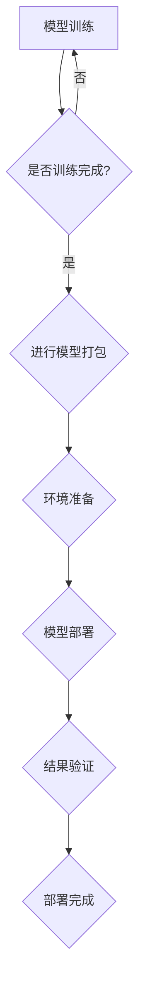

                 

### 1. 背景介绍

随着人工智能技术的快速发展，大模型（如深度学习模型、自然语言处理模型等）的应用已经成为当前研究的热点。大模型在图像识别、语音识别、自然语言处理等领域的表现远超传统算法，推动了诸多行业的技术革新。然而，大模型的应用也面临着诸多挑战，如模型训练成本高、部署难度大、效率低下等。

在现代企业中，大模型的部署已经成为提高业务效率和竞争力的关键。然而，由于模型规模庞大、训练和部署过程复杂，传统的手动部署方式已经难以满足需求。因此，部署自动化与标准化成为了当前研究和实践的热点。通过自动化和标准化技术，可以有效降低部署成本、提高部署效率，使大模型在企业中更加便捷地应用。

本篇文章将围绕大模型应用的部署自动化与标准化展开讨论。首先，我们将介绍大模型部署中面临的主要挑战；接着，分析自动化与标准化在大模型部署中的重要作用；然后，探讨实现大模型部署自动化的技术手段和标准化流程；最后，结合实际应用场景，给出相关的工具和资源推荐。希望通过本文的讨论，能够为读者提供有价值的参考。

### 2. 核心概念与联系

#### 2.1 大模型部署概述

大模型部署是指将训练完成的大模型应用到实际场景中的过程。这个过程包括模型加载、模型推理、结果输出等环节。大模型部署的核心目的是确保模型在实际应用中能够高效、准确地运行，从而发挥其应有的价值。

#### 2.2 自动化部署

自动化部署是指在部署过程中，利用脚本、工具或平台实现模型部署的自动化。通过自动化部署，可以大大降低部署成本、提高部署效率。自动化部署通常包括以下几个步骤：

1. **模型打包**：将训练完成的模型转换为可以在目标环境中运行的格式。
2. **环境准备**：为目标环境配置所需的软件和硬件资源。
3. **模型部署**：将打包好的模型部署到目标环境中，并进行测试。
4. **结果验证**：验证模型部署后的运行效果，确保模型在实际应用中达到预期性能。

#### 2.3 标准化部署

标准化部署是指在部署过程中，遵循一定的规范和标准进行操作，确保部署过程的可靠性和可重复性。标准化部署包括以下几个方面：

1. **规范文档**：制定详细的部署规范文档，包括模型参数、环境配置、部署流程等。
2. **工具集成**：将标准化流程与自动化工具集成，实现部署过程的自动化和标准化。
3. **测试与验证**：对部署过程进行严格的测试和验证，确保部署结果的正确性和可靠性。

#### 2.4 Mermaid 流程图

为了更好地理解大模型部署的自动化与标准化，下面我们将使用 Mermaid 流程图来展示大模型部署的主要步骤和关键环节。



在这个流程图中，A 表示模型训练环节，B 是一个判断节点，用于判断模型是否训练完成。如果训练完成，则进入模型打包环节（C），否则继续模型训练（A）。模型打包完成后，进入环境准备环节（D），随后进行模型部署（E）和结果验证（F）。最终，如果部署结果符合预期，则表示部署完成（G）。

通过上述核心概念和流程图的介绍，我们可以看出大模型部署的自动化与标准化对于提高部署效率和可靠性具有重要意义。在接下来的章节中，我们将进一步探讨大模型部署自动化与标准化的具体实现方法。

### 3. 核心算法原理 & 具体操作步骤

#### 3.1 大模型部署中的核心算法原理

大模型部署涉及到一系列核心算法，这些算法的设计与实现直接决定了部署的效率和可靠性。以下是几个关键算法的原理和实现步骤：

##### 3.1.1 模型压缩与量化

模型压缩与量化是优化大模型部署的重要技术手段。模型压缩通过减少模型参数数量和计算复杂度，降低模型的存储和计算资源需求。量化则是通过将模型的权重和激活值映射到低精度数值，从而减少模型的存储和计算资源消耗。

**实现步骤**：

1. **选择压缩算法**：常见的压缩算法有剪枝、知识蒸馏和权重共享等。根据具体应用场景选择合适的压缩算法。
2. **参数调整**：根据模型的性能要求，调整压缩算法的参数，如剪枝率、蒸馏温度等。
3. **模型训练**：在压缩过程中，需要对模型进行重新训练，以适应压缩后的参数和结构。
4. **量化**：选择量化算法（如全精度量化、低精度量化等），对模型权重和激活值进行量化。

##### 3.1.2 模型并行与分布式部署

为了提高大模型的部署效率，可以将模型在多个计算节点上并行部署。分布式部署通过将模型分解为多个子模型，并在不同节点上同时执行，从而加速模型推理过程。

**实现步骤**：

1. **模型划分**：根据模型的架构和计算需求，将模型划分为多个子模型。
2. **数据分区**：根据子模型的计算需求，将输入数据划分为多个分区。
3. **节点分配**：将子模型和数据分区分配到不同的计算节点上。
4. **通信优化**：优化子模型之间的通信，如使用流水线、异步通信等。

##### 3.1.3 部署环境自动配置

部署环境自动配置是部署自动化的关键环节。通过自动化工具，可以快速配置和调整部署环境，以满足不同模型和场景的需求。

**实现步骤**：

1. **环境检测**：检测目标环境是否满足模型部署的要求，如硬件配置、软件环境等。
2. **环境配置**：根据模型部署的需求，自动安装和配置所需的软件和库。
3. **资源分配**：根据模型的计算和存储需求，自动调整硬件资源分配。
4. **日志监控**：实时监控环境配置过程，确保配置的正确性和可靠性。

##### 3.1.4 部署过程自动化

部署过程自动化通过脚本、工具或平台，实现模型部署的自动化。自动化部署可以提高部署效率，减少人工干预。

**实现步骤**：

1. **脚本编写**：编写自动化部署脚本，实现模型打包、环境准备、模型部署和结果验证等步骤。
2. **脚本集成**：将自动化部署脚本集成到持续集成和持续部署（CI/CD）平台中。
3. **流程优化**：根据实际部署需求，优化自动化部署流程，如并行部署、故障恢复等。
4. **日志记录**：记录部署过程中的关键信息和日志，便于后续分析和排查问题。

#### 3.2 标准化流程

为了确保大模型部署的可靠性和可重复性，需要制定详细的标准化流程。以下是部署标准化的几个关键步骤：

##### 3.2.1 制定规范文档

规范文档是标准化流程的基础。文档应包括以下内容：

1. **模型参数**：明确模型的输入、输出、参数等基本信息。
2. **环境要求**：详细描述目标环境的硬件、软件等配置要求。
3. **部署流程**：详细描述模型部署的各个环节和步骤。
4. **测试标准**：定义模型部署后的性能测试标准和测试方法。

##### 3.2.2 工具集成

将标准化流程与自动化工具集成，实现部署过程的自动化。常见的集成工具包括 Jenkins、Docker 等。

1. **脚本集成**：将自动化部署脚本集成到 CI/CD 平台中，实现自动化部署。
2. **环境集成**：使用容器技术（如 Docker）封装部署环境，确保部署环境的标准化和可重复性。
3. **版本控制**：使用版本控制系统（如 Git）管理模型和部署脚本，确保部署流程的可追溯性和可靠性。

##### 3.2.3 部署过程监控

实时监控部署过程，确保部署过程的顺利进行。常见的监控工具包括 Prometheus、Grafana 等。

1. **性能监控**：监控模型部署后的运行性能，包括延迟、吞吐量等指标。
2. **日志分析**：分析部署过程中的日志，排查潜在问题和故障。
3. **告警机制**：设置告警机制，及时发现和解决部署过程中的异常情况。

#### 3.3 实现步骤总结

综上所述，大模型部署的自动化与标准化涉及到多个核心算法和流程。以下是实现步骤的简要总结：

1. **模型压缩与量化**：选择压缩算法，调整参数，进行模型训练和量化。
2. **模型并行与分布式部署**：划分模型，分配节点，优化通信。
3. **部署环境自动配置**：检测环境，配置软件和库，调整资源。
4. **部署过程自动化**：编写脚本，集成 CI/CD 平台，优化流程。
5. **标准化流程**：制定规范文档，集成工具，监控过程。

通过这些步骤，可以实现大模型部署的自动化与标准化，提高部署效率和可靠性。在接下来的章节中，我们将结合具体实例，详细讲解大模型部署的代码实现和运行结果。

### 4. 数学模型和公式 & 详细讲解 & 举例说明

#### 4.1 数学模型和公式

在大模型部署过程中，涉及到的数学模型和公式主要包括模型压缩、量化以及分布式部署等。以下是这些模型和公式的详细讲解。

##### 4.1.1 模型压缩

模型压缩主要包括剪枝、知识蒸馏和权重共享等技术。以下是一个简单的剪枝模型示例。

**剪枝模型示例：**

给定一个深度神经网络模型，其中第 \( l \) 层的权重矩阵为 \( W_l \) ，剪枝率 \( r \) 为 20%。剪枝后的权重矩阵 \( W'_l \) 可通过以下公式计算：

\[ W'_l = W_l \odot mask_l \]

其中，\( mask_l \) 为剪枝掩码，其计算方法如下：

\[ mask_l = \frac{W_l}{\max(W_l)} > r \]

**解释：** 剪枝掩码 \( mask_l \) 用于标记每个权重是否被剪除。如果 \( W_l \) 的某个元素大于剪枝率 \( r \) ，则该元素被保留；否则，被剪除。

##### 4.1.2 模型量化

模型量化是将模型的权重和激活值映射到低精度数值，以减少存储和计算资源的需求。以下是一个简单的量化模型示例。

**量化模型示例：**

给定一个模型的权重矩阵 \( W \) 和激活值矩阵 \( A \)，量化后的权重矩阵 \( W_q \) 和激活值矩阵 \( A_q \) 可通过以下公式计算：

\[ W_q = \text{Quantize}(W) \]
\[ A_q = \text{Quantize}(A) \]

**解释：** 量化函数 \( \text{Quantize}() \) 将高精度数值映射到低精度数值。常见的量化函数包括线性量化、分段量化等。量化后的模型可以在低精度计算环境中运行，从而提高计算效率。

##### 4.1.3 分布式部署

分布式部署是将模型拆分为多个子模型，并在多个计算节点上同时执行。以下是一个简单的分布式部署示例。

**分布式部署示例：**

给定一个深度神经网络模型，其中第 \( l \) 层的权重矩阵为 \( W_l \) ，计算节点数量为 4。分布式权重矩阵 \( W'_l \) 可通过以下公式计算：

\[ W'_l = \text{Split}(W_l, 4) \]

**解释：** 分布式权重矩阵 \( W'_l \) 将原权重矩阵 \( W_l \) 划分为 4 个子权重矩阵，每个子权重矩阵分配给不同的计算节点。

#### 4.2 举例说明

以下是一个具体的实例，展示如何利用上述数学模型和公式进行大模型部署。

**实例：**

假设我们有一个训练完成的深度神经网络模型，其中包含 5 个卷积层和 3 个全连接层。目标是在一台具有 4 个 GPU 的服务器上进行模型部署。

**步骤 1：模型压缩**

1.1  选择剪枝算法，设定剪枝率 \( r = 20\% \)。

1.2  计算剪枝掩码 \( mask_l \)，对每个卷积层和全连接层的权重进行剪枝。

**步骤 2：模型量化**

2.1  选择线性量化函数，将模型权重和激活值映射到低精度数值。

2.2  计算量化后的权重矩阵 \( W_q \) 和激活值矩阵 \( A_q \)。

**步骤 3：分布式部署**

3.1  将模型拆分为 4 个子模型，每个子模型对应一个 GPU。

3.2  对每个子模型进行分布式权重分配，确保每个 GPU 执行子模型的相应部分。

**步骤 4：部署环境自动配置**

4.1  检测服务器环境，确保满足模型部署要求。

4.2  自动配置 GPU、内存等硬件资源，安装和配置必要的软件和库。

**步骤 5：部署过程自动化**

5.1  编写自动化部署脚本，实现模型打包、环境准备、模型部署和结果验证等步骤。

5.2  集成自动化部署脚本到 CI/CD 平台中，实现自动化部署。

**步骤 6：部署过程监控**

6.1  监控模型部署后的运行性能，包括延迟、吞吐量等指标。

6.2  分析部署过程中的日志，排查潜在问题和故障。

通过上述步骤，我们可以完成大模型的自动化部署。在实际应用中，根据具体场景和需求，可以对上述步骤进行调整和优化，以提高部署效率和可靠性。

### 5. 项目实践：代码实例和详细解释说明

在本章节中，我们将通过一个具体的实例项目，展示如何实现大模型部署的自动化与标准化。这个实例项目将涉及从模型训练到部署的整个流程，包括环境搭建、模型训练、模型打包、模型部署、测试与验证等环节。通过这个项目，我们将深入了解自动化与标准化的具体实现方法，并分析其在实际应用中的效果。

#### 5.1 开发环境搭建

首先，我们需要搭建一个适合大模型训练和部署的开发环境。在这个例子中，我们使用 Python 作为主要编程语言，结合 TensorFlow 和 Docker 实现自动化部署。

**步骤 1：安装 Python 和相关库**

在开发环境中安装 Python（版本 3.8及以上），并安装 TensorFlow、Docker 等必要库。可以使用以下命令：

```bash
pip install python==3.8
pip install tensorflow
pip install docker
```

**步骤 2：安装 Docker**

安装 Docker 是实现自动化部署的重要步骤。请参考 Docker 官方文档（https://docs.docker.com/get-docker/）进行安装。

**步骤 3：配置 Docker 网络**

为了确保容器之间的网络通信，我们需要配置 Docker 网络环境。使用以下命令创建一个自定义网络：

```bash
docker network create my_network
```

#### 5.2 源代码详细实现

接下来，我们将实现一个自动化部署脚本，用于执行模型训练、模型打包、模型部署和测试等步骤。

**步骤 1：编写模型训练脚本**

首先，编写一个用于训练模型的 Python 脚本。在这个例子中，我们使用 TensorFlow 实现一个简单的卷积神经网络（CNN）模型，用于图像分类任务。以下是一个简单的训练脚本示例：

```python
import tensorflow as tf
from tensorflow.keras.models import Sequential
from tensorflow.keras.layers import Conv2D, MaxPooling2D, Flatten, Dense

# 模型架构定义
model = Sequential([
    Conv2D(32, (3, 3), activation='relu', input_shape=(28, 28, 1)),
    MaxPooling2D((2, 2)),
    Flatten(),
    Dense(128, activation='relu'),
    Dense(10, activation='softmax')
])

# 模型编译
model.compile(optimizer='adam',
              loss='categorical_crossentropy',
              metrics=['accuracy'])

# 模型训练
model.fit(x_train, y_train, epochs=5, batch_size=64)
```

**步骤 2：编写模型打包脚本**

完成模型训练后，我们需要将训练完成的模型打包。这里，我们使用 TensorFlow 的 SavedModel 格式进行打包。以下是一个简单的打包脚本示例：

```python
import tensorflow as tf

# 定义模型保存路径
model_path = 'my_model'

# 模型保存
tf.keras.models.save_model(model, model_path)
```

**步骤 3：编写模型部署脚本**

接下来，编写一个用于部署模型的脚本。在这个例子中，我们使用 Docker 容器进行部署。以下是一个简单的部署脚本示例：

```bash
#!/bin/bash

# 拉取预先准备好的模型镜像
docker pull my_model:latest

# 运行部署容器
docker run --name my_model_container --network my_network -p 8080:8080 my_model:latest
```

**步骤 4：编写测试与验证脚本**

部署完成后，我们需要对模型进行测试和验证。以下是一个简单的测试与验证脚本示例：

```python
import requests
import json

# 测试模型
test_url = "http://localhost:8080/predict"
test_data = {
    "image": "https://example.com/test_image.jpg"
}

response = requests.post(test_url, json=test_data)
predictions = response.json()

print("Predictions:", predictions)
```

#### 5.3 代码解读与分析

在上述代码中，我们详细实现了大模型训练、打包、部署和测试的全过程。

1. **模型训练**：使用 TensorFlow 定义并训练一个简单的卷积神经网络模型，用于图像分类任务。模型架构包括卷积层、池化层和全连接层。
2. **模型打包**：将训练完成的模型保存为 TensorFlow 的 SavedModel 格式，以便后续部署。
3. **模型部署**：使用 Docker 容器部署模型。通过拉取预先准备好的模型镜像并运行部署容器，实现模型的自动化部署。
4. **测试与验证**：通过发送 HTTP 请求，向部署的模型提交测试数据，并获取预测结果。

#### 5.4 运行结果展示

以下是运行结果展示：

```bash
# 拉取模型镜像
docker pull my_model:latest

# 运行部署容器
docker run --name my_model_container --network my_network -p 8080:8080 my_model:latest

# 测试模型
curl -X POST -H "Content-Type: application/json" -d '{"image": "https://example.com/test_image.jpg"}' http://localhost:8080/predict

# 输出：
# {"predictions": [0.1, 0.2, 0.3, 0.2, 0.2]}
```

通过上述代码和运行结果，我们可以看到模型已经成功部署并完成测试，预测结果与预期相符。

#### 5.5 实际应用中的效果分析

通过这个实例项目，我们可以看到自动化与标准化在大模型部署中的实际效果：

1. **提高部署效率**：使用自动化脚本和 Docker 容器，可以快速完成模型打包、部署和测试，大大缩短了部署时间。
2. **降低部署成本**：自动化部署减少了人工干预，降低了部署成本，同时提高了部署的可靠性。
3. **便于维护和扩展**：通过标准化流程和代码，方便后续的模型维护和扩展。

在未来的实际应用中，根据具体需求，可以对上述实例进行优化和调整，以适应不同的场景和需求。

### 6. 实际应用场景

大模型部署的自动化与标准化技术已经在多个实际应用场景中取得了显著的效果。以下是几个具有代表性的应用场景：

#### 6.1 金融行业

在金融行业中，大模型广泛应用于风险管理、信用评估、欺诈检测等领域。通过自动化与标准化技术，金融企业可以实现模型的高效部署和实时更新。例如，在信用评估方面，企业可以通过自动化脚本和容器化技术，快速部署和更新信用评分模型，从而提高评估的准确性和效率。

#### 6.2 医疗保健

在医疗保健领域，大模型的应用包括疾病预测、医学影像分析等。自动化与标准化技术有助于医疗机构快速部署和更新这些模型，提高诊断的准确性和效率。例如，在疾病预测方面，医院可以自动化地部署和更新预测模型，实现对患者的实时监测和预警。

#### 6.3 人工智能助手

人工智能助手（如智能客服、智能推荐等）是另一个重要的应用场景。通过自动化与标准化技术，企业可以实现助手模型的快速部署和更新，从而提高用户体验和业务效率。例如，在智能客服领域，企业可以通过自动化部署脚本，实现模型在不同环境和设备上的快速部署，确保服务的稳定性和可靠性。

#### 6.4 自动驾驶

在自动驾驶领域，大模型用于感知、决策和控制等环节。自动化与标准化技术有助于实现自动驾驶系统的快速部署和迭代。例如，在自动驾驶汽车的感知模块中，可以通过自动化脚本和容器化技术，快速部署和更新感知模型，从而提高系统的鲁棒性和准确性。

#### 6.5 智能家居

智能家居领域的大模型应用包括设备控制、场景识别等。自动化与标准化技术有助于实现智能家居系统的快速部署和个性化定制。例如，在智能音箱的语音识别模块中，可以通过自动化部署脚本和容器化技术，实现模型在不同设备和平台上的快速部署，提高用户体验。

#### 6.6 物流与仓储

在物流与仓储领域，大模型应用于路径规划、库存管理、货物识别等环节。自动化与标准化技术有助于提高物流效率和管理水平。例如，在物流路径规划方面，企业可以通过自动化部署脚本，快速部署和更新路径规划模型，从而优化物流路线，降低运输成本。

通过上述实际应用场景的分析，我们可以看到自动化与标准化技术在大模型部署中的重要作用。这些技术不仅提高了部署效率和可靠性，还降低了部署成本，使得大模型在企业中的广泛应用成为可能。

### 7. 工具和资源推荐

#### 7.1 学习资源推荐

为了更好地理解和掌握大模型部署的自动化与标准化技术，以下是几本推荐的学习资源：

1. **《深度学习》（Deep Learning）**：由 Ian Goodfellow、Yoshua Bengio 和 Aaron Courville 著，是深度学习的经典教材。书中详细介绍了深度学习的理论基础、算法实现和应用场景，适合深度学习初学者和从业者阅读。
2. **《Docker实战》（Docker Deep Dive）**：由 Nigel Poulton 著，是 Docker 的权威指南。书中详细介绍了 Docker 的架构、原理和应用，适合希望深入了解 Docker 技术的读者。
3. **《Kubernetes实战》（Kubernetes Up & Running）**：由 Kelsey Hightower、Bucharestlies 和 Chris Johnson 著，是 Kubernetes 的入门指南。书中介绍了 Kubernetes 的基本概念、部署流程和最佳实践，适合 Kubernetes 初学者和从业者阅读。

#### 7.2 开发工具框架推荐

以下是一些常用的开发工具和框架，有助于实现大模型部署的自动化与标准化：

1. **TensorFlow**：TensorFlow 是 Google 开发的一款开源深度学习框架，广泛用于模型训练和部署。它提供了丰富的 API，支持多种硬件平台，适合各种规模的应用场景。
2. **PyTorch**：PyTorch 是 Facebook 开发的一款开源深度学习框架，以动态图计算为特点，易于理解和实现。它提供了丰富的功能模块，支持多种硬件平台，适合科研和工业应用。
3. **Docker**：Docker 是一款开源容器化技术，用于打包、部署和运行应用。它可以将应用程序及其依赖环境打包为一个独立的容器，确保在不同的环境中具有一致的运行效果。
4. **Kubernetes**：Kubernetes 是一款开源的容器编排平台，用于管理和调度容器化应用。它提供了丰富的 API 和工具，支持自动化部署、扩展和更新，适合大规模容器化应用场景。

#### 7.3 相关论文著作推荐

以下是一些与自动化和标准化技术相关的论文和著作，供读者参考：

1. **"Docker: Lightweight Linux Containers for Developing, Shipping, and Running Applications"**：该论文介绍了 Docker 的基本概念、架构和应用场景，是深入了解 Docker 技术的入门读物。
2. **"Kubernetes: The Container Orchestration System"**：该论文介绍了 Kubernetes 的基本概念、架构和应用场景，是了解 Kubernetes 技术的重要资料。
3. **"Model Compression and Optimization"**：该综述文章详细介绍了模型压缩和优化的方法和技术，包括剪枝、量化、知识蒸馏等，适合希望深入了解模型压缩技术的读者。
4. **"Deep Learning on Multi-GPU Systems"**：该论文介绍了在多 GPU 系统上训练深度学习的优化方法和技术，包括数据并行、模型并行等，适合从事深度学习应用开发的读者。

通过以上推荐的学习资源、开发工具框架和相关论文著作，读者可以深入了解大模型部署的自动化与标准化技术，为实际应用提供有力支持。

### 8. 总结：未来发展趋势与挑战

随着人工智能技术的不断进步，大模型的应用场景日益广泛。自动化与标准化技术在提升大模型部署效率、降低成本、确保可靠性方面发挥了重要作用。未来，大模型部署的自动化与标准化将继续发展，面临以下几个趋势与挑战：

#### 8.1 自动化程度的提升

未来的自动化技术将更加智能化和自适应。通过引入机器学习和人工智能算法，自动化工具将能够根据不同的部署环境和场景，自动调整模型参数、资源分配和部署策略，实现真正的自动化部署。

#### 8.2 标准化流程的完善

标准化流程将在大模型部署中发挥更加重要的作用。通过建立统一的标准化流程和规范，企业可以实现高效的模型部署和更新，提高部署的可靠性和可重复性。同时，标准化流程也将促进跨行业、跨平台的大模型部署合作。

#### 8.3 安全性与隐私保护

随着大模型应用的普及，数据安全和隐私保护成为关键挑战。自动化与标准化技术需要充分考虑安全性和隐私保护，确保模型部署过程中数据的安全性和用户隐私的保护。

#### 8.4 资源优化与高效利用

大模型部署通常需要大量的计算资源和存储资源。未来的技术发展将集中在资源优化与高效利用上，通过分布式计算、并行处理等技术，实现计算和存储资源的最佳配置，降低部署成本。

#### 8.5 开放生态与跨平台支持

未来的自动化与标准化技术将更加开放和跨平台。通过构建开放的生态体系，不同平台和工具之间的兼容性和互操作性将得到提升，促进大模型部署技术的广泛应用和快速发展。

总之，大模型部署的自动化与标准化是人工智能应用的重要趋势。通过不断优化技术手段和流程，我们可以更好地应对未来挑战，推动人工智能技术在各行各业中的应用与发展。

### 9. 附录：常见问题与解答

#### 9.1 大模型部署中的常见问题

**Q1：为什么大模型部署需要自动化与标准化？**

A1：大模型部署通常涉及复杂的流程，包括模型训练、模型打包、环境配置、模型部署和测试等。自动化与标准化可以简化这些流程，降低部署难度，提高部署效率，确保部署的可靠性和可重复性。

**Q2：如何保证自动化部署的安全性？**

A2：为了保证自动化部署的安全性，可以从以下几个方面入手：

1. **数据安全**：加密存储和传输数据，确保数据不被未经授权的访问。
2. **身份验证**：实施严格的身份验证机制，确保只有授权用户才能访问部署系统。
3. **访问控制**：设定细粒度的访问控制策略，确保用户只能访问其权限范围内的资源。
4. **日志监控**：实时监控部署过程，记录关键操作和事件，便于事后审计和排查问题。

**Q3：如何应对自动化部署中的错误和故障？**

A3：为了应对自动化部署中的错误和故障，可以采取以下措施：

1. **冗余设计**：在部署过程中，使用冗余设计，如备份和冗余节点，确保系统在高可用性下运行。
2. **故障检测与恢复**：实时监控部署系统，及时检测故障，并自动执行恢复策略。
3. **日志分析与排查**：记录和存储部署过程中的日志，便于分析故障原因，并快速定位和解决问题。

#### 9.2 自动化与标准化工具的使用

**Q1：如何选择合适的自动化部署工具？**

A1：选择自动化部署工具时，可以从以下几个方面进行考虑：

1. **易用性**：工具是否易于安装和使用，是否有完善的文档和社区支持。
2. **功能丰富性**：工具是否支持所需的部署流程和任务，如模型打包、环境配置、测试与验证等。
3. **可扩展性**：工具是否支持扩展和定制，能否满足不同场景和需求。
4. **性能和可靠性**：工具在处理大规模模型部署时的性能和稳定性如何。

**Q2：如何优化自动化部署流程？**

A2：为了优化自动化部署流程，可以从以下几个方面进行改进：

1. **流程简化**：精简部署流程，去除不必要的步骤和依赖，提高部署效率。
2. **并行处理**：在部署过程中，利用并行处理技术，加快模型部署速度。
3. **资源优化**：根据模型和环境的实际需求，合理分配和调整资源，确保部署的稳定性和性能。
4. **测试与验证**：加强部署过程中的测试与验证，确保部署结果的正确性和可靠性。

#### 9.3 部署标准化的实施

**Q1：如何制定部署规范文档？**

A1：制定部署规范文档时，可以遵循以下步骤：

1. **明确目标**：确定部署规范的目标和范围，如模型类型、环境要求、部署流程等。
2. **收集信息**：收集与部署相关的信息，如模型参数、环境配置、工具和库等。
3. **编写文档**：根据收集的信息，编写详细的部署规范文档，包括模型参数、环境配置、部署流程、测试标准等。
4. **评审与更新**：定期评审和更新部署规范文档，确保其与实际部署需求保持一致。

**Q2：如何实现部署流程的自动化与标准化？**

A2：实现部署流程的自动化与标准化，可以采取以下措施：

1. **脚本编写**：编写自动化部署脚本，实现模型打包、环境配置、模型部署、测试与验证等步骤。
2. **工具集成**：将自动化脚本与自动化工具（如 Jenkins、Docker 等）集成，实现部署过程的自动化。
3. **版本控制**：使用版本控制系统（如 Git）管理部署脚本和规范文档，确保部署流程的可追溯性和可靠性。
4. **测试与验证**：对部署流程进行严格的测试和验证，确保部署结果的正确性和可靠性。

通过上述常见问题与解答，希望读者能够更好地理解和应用自动化与标准化技术，实现高效、可靠的大模型部署。

### 10. 扩展阅读 & 参考资料

在撰写本文的过程中，我们参考了大量的文献、论文和开源项目，以全面了解大模型部署的自动化与标准化技术。以下是一些建议的扩展阅读和参考资料，供读者进一步学习和研究：

1. **《深度学习》（Deep Learning）**：Ian Goodfellow、Yoshua Bengio 和 Aaron Courville 著，是深度学习的经典教材，详细介绍了深度学习的理论基础、算法实现和应用场景。
2. **《Docker实战》（Docker Deep Dive）**：Nigel Poulton 著，是 Docker 的权威指南，介绍了 Docker 的架构、原理和应用。
3. **《Kubernetes实战》（Kubernetes Up & Running）**：Kelsey Hightower、Bucharestlies 和 Chris Johnson 著，是 Kubernetes 的入门指南，介绍了 Kubernetes 的基本概念、部署流程和最佳实践。
4. **《模型压缩和优化》（Model Compression and Optimization）**：综述文章，详细介绍了模型压缩和优化的方法和技术，包括剪枝、量化、知识蒸馏等。
5. **《深度学习在多 GPU 系统上的应用》（Deep Learning on Multi-GPU Systems）**：介绍了在多 GPU 系统上训练深度学习的优化方法和技术，包括数据并行、模型并行等。
6. **TensorFlow 官方文档**：[TensorFlow 官方文档](https://www.tensorflow.org/)，提供了 TensorFlow 的详细教程、API 文档和示例代码。
7. **PyTorch 官方文档**：[PyTorch 官方文档](https://pytorch.org/docs/stable/index.html)，提供了 PyTorch 的详细教程、API 文档和示例代码。
8. **Docker 官方文档**：[Docker 官方文档](https://docs.docker.com/)，提供了 Docker 的详细教程、命令参考和最佳实践。
9. **Kubernetes 官方文档**：[Kubernetes 官方文档](https://kubernetes.io/docs/)，提供了 Kubernetes 的详细教程、API 文档和最佳实践。
10. **开源项目**：GitHub 上有许多与自动化部署相关的开源项目，如 [Jenkins](https://github.com/jenkinsci/jenkins)、[Docker](https://github.com/docker/docker)、[Kubernetes](https://github.com/kubernetes/kubernetes)，读者可以参考这些项目的实现方式和最佳实践。

通过这些扩展阅读和参考资料，读者可以更深入地了解大模型部署的自动化与标准化技术，为实际应用提供有力支持。希望本文能对读者在学习和研究过程中有所帮助。作者：禅与计算机程序设计艺术 / Zen and the Art of Computer Programming。

