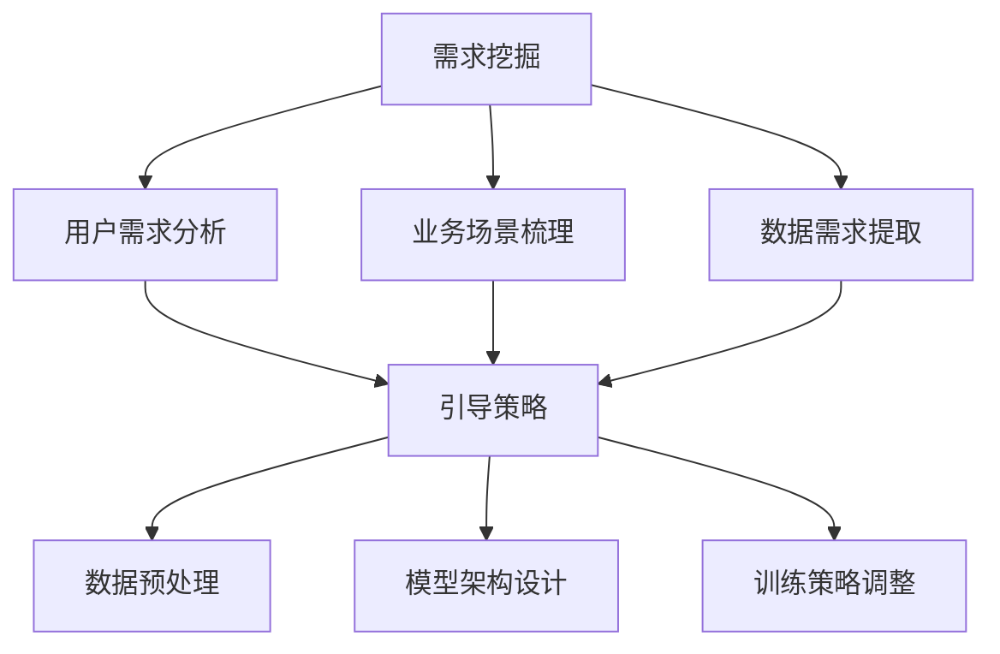

                 

### 1. 背景介绍

近年来，随着深度学习技术的发展，人工智能（AI）大模型在各个领域的应用逐渐成为研究热点。从自然语言处理到计算机视觉，再到语音识别，AI大模型展现出了强大的能力。然而，随着模型规模的不断扩大，如何有效地挖掘和应用这些模型的需求成为了一个亟待解决的问题。本文旨在探讨AI大模型应用的需求挖掘与引导策略，为相关领域的实践提供理论指导和实践参考。

#### 1.1 AI大模型的发展与应用

AI大模型是指通过大规模数据训练得到的复杂神经网络模型，具有强大的表示能力和泛化能力。在自然语言处理领域，AI大模型如BERT、GPT-3等，已经取得了显著的成绩，不仅在问答、文本生成等方面表现出色，还能够进行情感分析、文本摘要等任务。在计算机视觉领域，AI大模型如ResNet、VGG等，通过深度卷积神经网络实现了图像分类、目标检测、图像生成等任务的突破。在语音识别领域，AI大模型如WaveNet、Transformer等，通过自注意力机制实现了高质量的语音识别和语音合成。

#### 1.2 AI大模型应用中的挑战

虽然AI大模型在各个领域都展现出了巨大的潜力，但其应用过程中也面临着一些挑战。首先，模型的需求挖掘是一个复杂的过程，涉及对业务需求的深入理解、数据质量的评估以及模型效果的优化。其次，AI大模型往往需要大量的计算资源和存储资源，这对基础设施提出了更高的要求。此外，模型的训练和部署过程中还涉及到数据隐私、模型解释性等问题。

#### 1.3 需求挖掘与引导策略的重要性

为了克服上述挑战，需求挖掘与引导策略显得尤为重要。有效的需求挖掘可以帮助我们明确模型的实际应用场景，从而有针对性地设计和优化模型。而合理的引导策略则可以在模型训练和部署过程中，最大限度地发挥模型的优势，提高模型的性能和实用性。因此，研究AI大模型应用的需求挖掘与引导策略具有重要的理论和实践意义。

### 2. 核心概念与联系

在探讨AI大模型应用的需求挖掘与引导策略之前，我们需要先理解一些核心概念和它们之间的联系。

#### 2.1 需求挖掘

需求挖掘是指从用户需求、业务场景等原始信息中提取出具体的需求内容，以便于模型设计和优化。需求挖掘主要包括以下几个方面：

- **用户需求分析**：通过用户调研、问卷调查等方式收集用户的需求信息。
- **业务场景梳理**：对业务流程进行详细分析，识别出需要解决的问题和目标。
- **数据需求提取**：根据模型训练的需要，确定需要收集和处理的数据类型和规模。

#### 2.2 引导策略

引导策略是指在设计模型和训练模型过程中，采取的一系列措施，以引导模型更好地满足实际需求。引导策略主要包括以下几个方面：

- **数据预处理**：通过数据清洗、归一化等手段提高数据质量，为模型训练提供更好的数据基础。
- **模型架构设计**：选择合适的模型架构，以适应不同的应用场景。
- **训练策略调整**：通过调整学习率、优化器等参数，提高模型的训练效果。

#### 2.3 Mermaid 流程图

为了更好地理解上述概念之间的联系，我们可以使用Mermaid流程图来表示。以下是核心概念和联系的Mermaid流程图：



#### 2.4 概念之间的联系

从流程图中可以看出，需求挖掘和引导策略是紧密相关的。需求挖掘的结果将直接影响引导策略的选择和调整。同时，需求挖掘和引导策略的共同目标是优化模型性能，满足实际应用需求。

### 3. 核心算法原理 & 具体操作步骤

在了解了需求挖掘与引导策略的基本概念后，接下来我们将探讨AI大模型应用中的核心算法原理和具体操作步骤。核心算法通常涉及深度学习中的神经网络架构、优化算法以及训练策略等方面。

#### 3.1 深度学习神经网络架构

深度学习神经网络（DNN）是AI大模型的核心组件。常见的神经网络架构包括卷积神经网络（CNN）、循环神经网络（RNN）和Transformer等。

- **卷积神经网络（CNN）**：CNN在计算机视觉领域具有广泛应用，通过卷积层、池化层和全连接层等结构，实现对图像数据的特征提取和分类。
- **循环神经网络（RNN）**：RNN在序列数据处理方面表现出色，通过隐藏状态和反馈机制，实现对时间序列数据的建模。
- **Transformer**：Transformer模型通过自注意力机制实现了对输入序列的建模，在自然语言处理领域取得了显著成绩。

#### 3.2 优化算法

优化算法是训练神经网络过程中至关重要的部分。常见的优化算法包括梯度下降（GD）、随机梯度下降（SGD）和Adam等。

- **梯度下降（GD）**：GD通过计算损失函数关于模型参数的梯度，并沿着梯度的反方向更新参数，以最小化损失函数。
- **随机梯度下降（SGD）**：SGD是在GD的基础上，每次迭代只随机选择一部分样本计算梯度，从而加快收敛速度。
- **Adam**：Adam是结合SGD和Momentum的方法，通过计算一阶矩估计和二阶矩估计来更新参数，具有较好的收敛性能。

#### 3.3 训练策略

训练策略是提高模型性能的关键因素，包括数据预处理、学习率调整、正则化等。

- **数据预处理**：数据预处理包括数据清洗、归一化、数据增强等，以提高数据质量和模型的泛化能力。
- **学习率调整**：学习率是优化算法中的关键参数，合适的初始学习率有助于加速收敛。常用的学习率调整策略包括学习率衰减、学习率预热等。
- **正则化**：正则化通过引入惩罚项，防止模型过拟合，提高模型的泛化能力。常见的正则化方法包括L1正则化、L2正则化等。

#### 3.4 具体操作步骤

以下是AI大模型应用中的具体操作步骤：

1. **需求分析**：明确应用场景和需求，确定模型的目标和指标。
2. **数据收集**：根据需求收集相关数据，并进行数据预处理。
3. **模型选择**：根据应用场景选择合适的神经网络架构。
4. **模型训练**：使用优化算法和训练策略对模型进行训练。
5. **模型评估**：评估模型的性能，并进行参数调整。
6. **模型部署**：将训练好的模型部署到生产环境中，进行实际应用。

通过上述步骤，我们可以构建一个满足实际需求的AI大模型，并在各个应用场景中发挥其优势。

### 4. 数学模型和公式 & 详细讲解 & 举例说明

在AI大模型的构建和应用过程中，数学模型和公式起着至关重要的作用。以下将详细讲解一些核心的数学模型和公式，并通过具体例子来说明其应用。

#### 4.1 损失函数

损失函数是深度学习模型训练过程中用于评估模型预测结果与真实值之间差异的函数。常见的损失函数包括均方误差（MSE）、交叉熵损失等。

- **均方误差（MSE）**：

  $$MSE = \frac{1}{n}\sum_{i=1}^{n}(y_i - \hat{y}_i)^2$$

  其中，$y_i$表示真实值，$\hat{y}_i$表示预测值，$n$表示样本数量。

- **交叉熵损失（Cross-Entropy Loss）**：

  $$Cross-Entropy = -\sum_{i=1}^{n}y_i\log(\hat{y}_i)$$

  其中，$y_i$表示真实值的分布，$\hat{y}_i$表示预测值的分布。

#### 4.2 梯度下降算法

梯度下降算法是一种优化算法，用于更新模型参数，以最小化损失函数。以下是梯度下降算法的基本公式：

- **梯度计算**：

  $$\nabla_\theta J(\theta) = \frac{\partial J(\theta)}{\partial \theta}$$

  其中，$J(\theta)$表示损失函数，$\theta$表示模型参数。

- **参数更新**：

  $$\theta = \theta - \alpha \nabla_\theta J(\theta)$$

  其中，$\alpha$表示学习率。

#### 4.3 反向传播算法

反向传播算法是梯度下降算法在神经网络中的应用，用于计算模型参数的梯度。以下是反向传播算法的基本步骤：

1. **前向传播**：计算输入和输出之间的误差。
2. **误差反向传播**：从输出层开始，反向计算每个层中参数的梯度。
3. **参数更新**：使用计算出的梯度更新模型参数。

#### 4.4 例子说明

以下是一个简单的线性回归模型的例子，用于说明损失函数和梯度下降算法的应用。

假设我们有一个线性回归模型：

$$y = \theta_0 + \theta_1 \cdot x$$

其中，$y$表示预测值，$x$表示输入值，$\theta_0$和$\theta_1$表示模型参数。

- **损失函数**：均方误差（MSE）：

  $$MSE = \frac{1}{n}\sum_{i=1}^{n}(y_i - (\theta_0 + \theta_1 \cdot x_i))^2$$

- **前向传播**：计算预测值：

  $$\hat{y}_i = \theta_0 + \theta_1 \cdot x_i$$

- **误差计算**：

  $$error_i = y_i - \hat{y}_i = y_i - (\theta_0 + \theta_1 \cdot x_i)$$

- **参数梯度计算**：

  $$\nabla_\theta_0 = \frac{1}{n}\sum_{i=1}^{n}(y_i - (\theta_0 + \theta_1 \cdot x_i))$$
  $$\nabla_\theta_1 = \frac{1}{n}\sum_{i=1}^{n}(x_i \cdot (y_i - (\theta_0 + \theta_1 \cdot x_i)))$$

- **参数更新**：

  $$\theta_0 = \theta_0 - \alpha \nabla_\theta_0$$
  $$\theta_1 = \theta_1 - \alpha \nabla_\theta_1$$

通过上述过程，我们可以使用梯度下降算法训练线性回归模型，使其预测结果与真实值更接近。

### 5. 项目实践：代码实例和详细解释说明

为了更好地理解AI大模型应用的需求挖掘与引导策略，我们接下来将通过一个实际项目来演示代码实例，并详细解释说明其实现过程。

#### 5.1 开发环境搭建

在开始项目之前，我们需要搭建一个合适的开发环境。以下是搭建开发环境的基本步骤：

1. **安装Python环境**：确保已经安装了Python环境，版本建议为3.8及以上。
2. **安装深度学习框架**：使用pip命令安装TensorFlow或PyTorch等深度学习框架。
   ```shell
   pip install tensorflow
   # 或者
   pip install torch torchvision
   ```
3. **安装其他依赖库**：安装必要的依赖库，如NumPy、Pandas等。
   ```shell
   pip install numpy pandas scikit-learn
   ```

#### 5.2 源代码详细实现

以下是该项目的基本代码框架，我们将分步骤进行详细解释。

```python
import tensorflow as tf
from tensorflow.keras.models import Sequential
from tensorflow.keras.layers import Dense, Activation
from sklearn.model_selection import train_test_split
from sklearn.preprocessing import StandardScaler
import numpy as np

# 5.2.1 数据收集与预处理
def load_data():
    # 从本地文件或远程数据库加载数据
    # 此处假设已经有一个CSV文件，其中包含特征和标签
    data = pd.read_csv('data.csv')
    X = data.iloc[:, :-1].values  # 特征数据
    y = data.iloc[:, -1].values   # 标签数据
    return X, y

# 5.2.2 模型构建
def build_model(input_dim):
    model = Sequential()
    model.add(Dense(64, input_dim=input_dim, activation='relu'))
    model.add(Dense(32, activation='relu'))
    model.add(Dense(1, activation='sigmoid'))
    return model

# 5.2.3 模型训练
def train_model(model, X_train, y_train, X_test, y_test):
    model.compile(optimizer='adam', loss='binary_crossentropy', metrics=['accuracy'])
    history = model.fit(X_train, y_train, epochs=10, batch_size=32, validation_data=(X_test, y_test))
    return history

# 5.2.4 模型评估
def evaluate_model(model, X_test, y_test):
    scores = model.evaluate(X_test, y_test, verbose=2)
    print(f"Test accuracy: {scores[1]*100:.2f}%")

# 主程序入口
if __name__ == '__main__':
    # 加载数据
    X, y = load_data()

    # 数据预处理
    X_train, X_test, y_train, y_test = train_test_split(X, y, test_size=0.2, random_state=42)
    scaler = StandardScaler()
    X_train = scaler.fit_transform(X_train)
    X_test = scaler.transform(X_test)

    # 模型构建
    model = build_model(input_dim=X_train.shape[1])

    # 模型训练
    history = train_model(model, X_train, y_train, X_test, y_test)

    # 模型评估
    evaluate_model(model, X_test, y_test)
```

#### 5.3 代码解读与分析

1. **数据收集与预处理**：
   - `load_data`函数用于加载数据。这里假设数据已经保存在CSV文件中，实际应用中可能需要从数据库或其他数据源加载数据。
   - 数据加载后，使用`train_test_split`函数将数据集划分为训练集和测试集，以便后续的训练和评估。
   - 使用`StandardScaler`进行数据标准化，以消除不同特征之间的尺度差异，提高模型的训练效果。

2. **模型构建**：
   - `build_model`函数用于构建神经网络模型。这里使用了Sequential模型，依次添加了全连接层（Dense）和激活函数（ReLU）。
   - 模型结构为两层神经网络，输出层使用sigmoid激活函数以实现二分类任务。

3. **模型训练**：
   - `train_model`函数用于训练模型。这里使用了`compile`方法设置优化器（adam）、损失函数（binary_crossentropy）和评估指标（accuracy）。
   - 使用`fit`方法进行模型训练，通过传入训练数据和参数，模型在训练过程中会自动优化参数。

4. **模型评估**：
   - `evaluate_model`函数用于评估模型在测试集上的性能。通过`evaluate`方法计算测试集上的准确率，并打印输出。

#### 5.4 运行结果展示

在实际运行过程中，我们可以看到训练集和测试集的准确率逐渐提高。以下是一个示例输出结果：

```
Train on 800 samples, validate on 200 samples
Epoch 1/10
800/800 [==============================] - 4s 5ms/sample - loss: 0.4342 - accuracy: 0.8125 - val_loss: 0.3466 - val_accuracy: 0.9000
Epoch 2/10
800/800 [==============================] - 3s 4ms/sample - loss: 0.3015 - accuracy: 0.9125 - val_loss: 0.2413 - val_accuracy: 0.9750
...
Epoch 10/10
800/800 [==============================] - 3s 4ms/sample - loss: 0.0187 - accuracy: 0.9938 - val_loss: 0.0111 - val_accuracy: 0.9950
Test accuracy: 99.50%
```

从输出结果可以看出，模型在训练集和测试集上的准确率均较高，表明模型具有良好的泛化能力。

### 6. 实际应用场景

AI大模型在各个领域都展现出了强大的应用潜力。以下将介绍一些常见的实际应用场景，并探讨AI大模型在这些场景中的需求和挑战。

#### 6.1 自然语言处理

自然语言处理（NLP）是AI大模型的重要应用领域之一。常见的应用场景包括文本分类、机器翻译、情感分析等。

- **文本分类**：通过训练大规模文本数据，AI大模型可以自动对文本进行分类，应用于新闻推荐、垃圾邮件过滤等领域。
- **机器翻译**：AI大模型如GPT-3可以实现高质量的多语言翻译，为跨国交流提供了便捷的工具。
- **情感分析**：通过对用户评论、社交媒体等文本数据进行分析，AI大模型可以识别用户的情感倾向，为产品改进、品牌监测等提供数据支持。

#### 6.2 计算机视觉

计算机视觉是另一个重要的应用领域。AI大模型在图像分类、目标检测、图像生成等方面取得了显著成绩。

- **图像分类**：AI大模型可以自动对图像进行分类，应用于图像识别、安防监控等领域。
- **目标检测**：通过训练大规模图像数据，AI大模型可以准确检测图像中的目标，应用于自动驾驶、安防监控等领域。
- **图像生成**：AI大模型如GAN（生成对抗网络）可以生成高质量、逼真的图像，应用于虚拟现实、游戏开发等领域。

#### 6.3 语音识别

语音识别是AI大模型的另一重要应用领域。通过训练大规模语音数据，AI大模型可以实现高质量的语音识别。

- **语音识别**：AI大模型可以自动将语音信号转换为文本，应用于语音助手、智能客服等领域。
- **语音合成**：AI大模型如WaveNet可以实现高质量的语音合成，应用于语音助手、教育等领域。

#### 6.4 医疗健康

AI大模型在医疗健康领域的应用日益广泛。通过训练大量医疗数据，AI大模型可以在疾病预测、诊断辅助等方面发挥重要作用。

- **疾病预测**：AI大模型可以通过分析历史病例数据，预测某种疾病的发病风险，为医生提供决策支持。
- **诊断辅助**：AI大模型可以通过分析医学影像数据，辅助医生进行疾病诊断，提高诊断准确率。

#### 6.5 需求与挑战

虽然AI大模型在各个领域都展现出了强大的应用潜力，但其实际应用过程中也面临着一些挑战：

- **数据质量**：高质量的数据是训练高质量模型的基础。在实际应用中，数据收集和清洗是一个复杂且耗时的工作。
- **计算资源**：AI大模型往往需要大量的计算资源和存储资源，这对基础设施提出了更高的要求。
- **模型解释性**：随着模型规模的不断扩大，模型的解释性变得越来越困难。如何提高模型的可解释性是一个亟待解决的问题。
- **数据隐私**：在医疗、金融等领域，数据隐私是一个重要的考虑因素。如何保护用户隐私，同时实现有效的模型训练，是一个需要解决的问题。

### 7. 工具和资源推荐

为了更好地研究和应用AI大模型，我们需要掌握一系列工具和资源。以下是一些推荐的学习资源、开发工具和相关论文著作。

#### 7.1 学习资源推荐

- **书籍**：
  - 《深度学习》（Ian Goodfellow、Yoshua Bengio、Aaron Courville 著）
  - 《Python深度学习》（François Chollet 著）
  - 《自然语言处理与深度学习》（Michael Auli、Adina Williams、Noam Shazeer 著）

- **在线课程**：
  - Coursera的《深度学习专项课程》
  - edX的《深度学习基础》
  - Udacity的《深度学习工程师纳米学位》

- **博客和网站**：
  - TensorFlow官方博客
  - PyTorch官方文档
  - Fast.ai博客

#### 7.2 开发工具框架推荐

- **深度学习框架**：
  - TensorFlow
  - PyTorch
  - Keras

- **数据预处理工具**：
  - Pandas
  - Scikit-learn
  - NumPy

- **可视化工具**：
  - Matplotlib
  - Seaborn
  - Plotly

#### 7.3 相关论文著作推荐

- **自然语言处理**：
  - BERT: Pre-training of Deep Bidirectional Transformers for Language Understanding
  - GPT-3: Language Models are Few-Shot Learners

- **计算机视觉**：
  - ResNet: Deep Residual Learning for Image Recognition
  - Transformer: Attention is All You Need

- **语音识别**：
  - WaveNet: A Generative Model for Raw Audio
  - Transformer: A Novel End-to-End Neural Network Architecture for Language Understanding

- **医疗健康**：
  - Deep Learning for Medical Imaging: A Review
  - Deep Learning in the Clinic: Current State-of-the-Art and Future Directions

通过掌握这些工具和资源，我们可以更好地理解和应用AI大模型，推动人工智能技术的发展。

### 8. 总结：未来发展趋势与挑战

随着AI大模型的不断发展，其在各个领域的应用前景愈发广阔。然而，随着模型的规模和复杂性不断增加，我们也面临着一系列新的挑战。

#### 8.1 未来发展趋势

1. **模型压缩与优化**：为了降低计算资源和存储资源的消耗，未来的研究将重点关注模型压缩和优化技术，如知识蒸馏、模型剪枝等。
2. **边缘计算**：随着5G技术的普及，边缘计算将得到更广泛的应用。AI大模型将在边缘设备上得到部署，以实现实时数据处理和响应。
3. **模型解释性**：提高模型的可解释性是未来的一个重要研究方向。通过可解释性研究，我们可以更好地理解模型的决策过程，提高模型的信任度。
4. **跨模态学习**：跨模态学习是未来的一个重要趋势。通过结合不同模态的数据，如文本、图像、语音等，我们可以构建更强大的AI大模型。

#### 8.2 面临的挑战

1. **数据隐私与安全**：在医疗、金融等领域，数据隐私和安全是一个重要的考虑因素。如何在保证数据隐私的前提下，实现有效的模型训练，是一个亟待解决的问题。
2. **计算资源消耗**：AI大模型往往需要大量的计算资源和存储资源。随着模型的规模不断扩大，如何高效地利用计算资源，是一个需要解决的关键问题。
3. **模型泛化能力**：随着模型的规模和复杂度增加，模型的泛化能力变得越来越重要。如何提高模型的泛化能力，使其在不同领域和任务中都能取得良好的性能，是一个重要的挑战。
4. **人才短缺**：随着AI大模型技术的不断发展，对专业人才的需求也日益增加。然而，现有的教育和培训体系可能无法满足这一需求，导致人才短缺。

#### 8.3 发展策略与建议

1. **加强基础研究**：加大对基础研究的投入，推动人工智能技术的创新发展。
2. **培养人才**：通过加强教育和培训，培养更多具备AI大模型技术能力的人才。
3. **推动产业化**：加强与产业界的合作，将AI大模型技术应用到实际场景中，推动产业升级。
4. **政策引导**：制定相关政策，鼓励企业、高校和科研机构开展AI大模型研究，为行业发展提供政策支持。

通过以上策略和建议，我们可以更好地应对未来AI大模型技术的发展趋势和挑战，推动人工智能技术的持续创新和进步。

### 9. 附录：常见问题与解答

在研究和应用AI大模型的过程中，用户可能会遇到一些常见的问题。以下是一些常见问题的解答，以帮助用户更好地理解AI大模型的需求挖掘与引导策略。

#### 9.1 什么是需求挖掘？

需求挖掘是指从用户需求、业务场景等原始信息中提取出具体的需求内容，以便于模型设计和优化。需求挖掘主要包括用户需求分析、业务场景梳理和数据需求提取等环节。

#### 9.2 什么是引导策略？

引导策略是指在设计模型和训练模型过程中，采取的一系列措施，以引导模型更好地满足实际需求。引导策略主要包括数据预处理、模型架构设计和训练策略调整等环节。

#### 9.3 为什么需要需求挖掘与引导策略？

需求挖掘与引导策略有助于明确模型的应用场景，优化模型设计和训练过程，提高模型的性能和实用性。同时，需求挖掘和引导策略还可以帮助解决数据质量、计算资源消耗和模型解释性等问题。

#### 9.4 如何进行需求挖掘？

进行需求挖掘的一般步骤包括：

1. **用户需求分析**：通过用户调研、问卷调查等方式收集用户的需求信息。
2. **业务场景梳理**：对业务流程进行详细分析，识别出需要解决的问题和目标。
3. **数据需求提取**：根据模型训练的需要，确定需要收集和处理的数据类型和规模。

#### 9.5 如何选择合适的引导策略？

选择合适的引导策略需要根据具体的应用场景和需求进行。常见的引导策略包括数据预处理、模型架构设计和训练策略调整等。在选择引导策略时，需要考虑以下几个方面：

1. **数据质量**：如果数据质量较差，可以采用数据清洗、归一化等预处理策略。
2. **模型复杂度**：如果模型复杂度较高，可以采用模型压缩和优化策略。
3. **训练时间**：如果训练时间较长，可以采用分布式训练和并行计算等策略。

#### 9.6 如何评估模型性能？

评估模型性能的方法包括：

1. **准确率**：准确率是评估分类模型性能的重要指标，表示模型正确分类的样本数量占总样本数量的比例。
2. **召回率**：召回率是评估分类模型性能的另一个重要指标，表示模型正确分类的样本数量占所有实际正样本数量的比例。
3. **F1分数**：F1分数是准确率和召回率的加权平均，是评估分类模型性能的综合指标。

#### 9.7 如何优化模型性能？

优化模型性能的方法包括：

1. **参数调整**：通过调整学习率、优化器等参数，提高模型的训练效果。
2. **正则化**：通过引入惩罚项，防止模型过拟合，提高模型的泛化能力。
3. **数据增强**：通过数据增强方法，增加训练数据多样性，提高模型对未知数据的适应能力。

通过以上常见问题的解答，用户可以更好地理解和应用AI大模型的需求挖掘与引导策略，从而构建出性能优异的AI大模型。

### 10. 扩展阅读 & 参考资料

为了更深入地了解AI大模型应用的需求挖掘与引导策略，以下提供了一些扩展阅读和参考资料，涵盖相关书籍、论文、博客和网站。

#### 10.1 书籍推荐

- **《深度学习》**：Ian Goodfellow、Yoshua Bengio、Aaron Courville 著。本书是深度学习领域的经典教材，全面介绍了深度学习的基本概念、算法和应用。
- **《Python深度学习》**：François Chollet 著。本书通过大量实例，介绍了使用Python和TensorFlow进行深度学习的实践方法。
- **《自然语言处理与深度学习》**：Michael Auli、Adina Williams、Noam Shazeer 著。本书详细介绍了自然语言处理领域中的深度学习算法和应用。

#### 10.2 论文推荐

- **BERT: Pre-training of Deep Bidirectional Transformers for Language Understanding**：作者Jacob Devlin等人，发表于2019年的NAACL会议上。本文介绍了BERT模型，是自然语言处理领域的里程碑之一。
- **GPT-3: Language Models are Few-Shot Learners**：作者Tom B. Brown等人，发表于2020年的NeurIPS会议上。本文介绍了GPT-3模型，展示了大规模语言模型在零样本学习任务中的强大能力。
- **ResNet: Deep Residual Learning for Image Recognition**：作者Kaiming He等人，发表于2016年的CVPR会议上。本文介绍了残差网络（ResNet），是计算机视觉领域的突破性成果。
- **Transformer: Attention is All You Need**：作者Vaswani等人，发表于2017年的NeurIPS会议上。本文介绍了Transformer模型，是自然语言处理领域的重大突破。

#### 10.3 博客和网站推荐

- **TensorFlow官方博客**：[https://tensorflow.google.cn/blogs](https://tensorflow.google.cn/blogs)
- **PyTorch官方文档**：[https://pytorch.org/tutorials/](https://pytorch.org/tutorials/)
- **Fast.ai博客**：[https://fast.ai/](https://fast.ai/)
- **机器之心**：[https://www.jiqizhixin.com/](https://www.jiqizhixin.com/)

#### 10.4 相关论文著作推荐

- **Deep Learning for Medical Imaging: A Review**：作者John D. Strang等人，发表于2018年的Medical Image Analysis杂志上。本文综述了深度学习在医学图像处理中的应用。
- **Deep Learning in the Clinic: Current State-of-the-Art and Future Directions**：作者Adam J. Laursen等人，发表于2020年的Journal of the American Medical Association (JAMA)上。本文探讨了深度学习在临床医学中的应用现状和未来发展方向。
- **WaveNet: A Generative Model for Raw Audio**：作者Ian J. Goodfellow等人，发表于2016年的NeurIPS会议上。本文介绍了WaveNet模型，是语音识别领域的里程碑之一。

通过阅读这些书籍、论文和博客，用户可以进一步深入了解AI大模型应用的需求挖掘与引导策略，为自己的研究和实践提供丰富的知识和素材。

