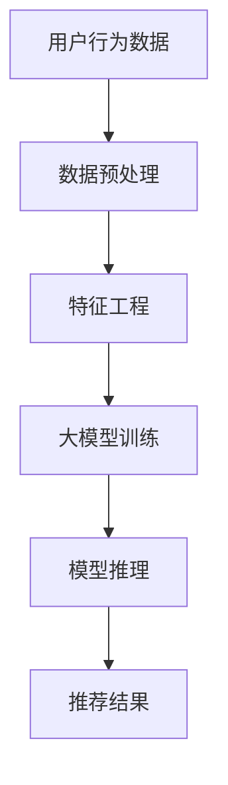

                 

### 文章标题

**AI大模型视角下电商搜索推荐的技术创新知识库管理流程优化**

> **关键词**：人工智能、大模型、电商搜索推荐、知识库管理、技术创新、流程优化

> **摘要**：本文将深入探讨在人工智能尤其是大模型技术的推动下，电商搜索推荐系统中知识库管理流程的优化策略和技术创新。通过详细的理论解析和实际案例分析，本文旨在为电商企业提供一条实现个性化推荐和高效知识管理的有效路径，以应对现代电子商务的激烈竞争。

### 1. 背景介绍

在当今数字化时代，电子商务已经渗透到我们生活的方方面面。随着用户数量的急剧增加和在线购物的普及，电商平台面临着日益严峻的竞争压力。为了在激烈的市场环境中脱颖而出，电商平台不仅需要提供优质的商品和服务，还必须实现高度个性化的用户推荐，从而提升用户满意度和留存率。

搜索推荐系统作为电商平台的“大脑”，承担着为用户精准推荐商品、提升购物体验的重要任务。然而，传统的搜索推荐技术往往依赖于用户的历史行为数据，这种方式存在数据依赖性强、推荐结果单一等问题。随着人工智能尤其是大模型技术的发展，电商平台开始探索更为先进的知识库管理方法，以实现更高水平的个性化推荐和更高效的知识管理。

本文将从AI大模型的技术特点出发，分析其在电商搜索推荐系统中的应用潜力，并提出相应的知识库管理流程优化策略。通过理论研究和实践案例的结合，本文希望能够为电商平台提供一种新的技术解决方案，以提升其竞争力。

### 2. 核心概念与联系

#### 2.1 AI大模型

AI大模型（Large-scale AI Models），是指那些能够处理大规模数据集、具备强泛化能力的深度学习模型。这些模型通常具有数十亿甚至数千亿的参数，能够通过学习海量数据来捕捉复杂的模式和关系。代表性的AI大模型包括GPT（Generative Pre-trained Transformer）、BERT（Bidirectional Encoder Representations from Transformers）等。

#### 2.2 电商搜索推荐系统

电商搜索推荐系统是一种基于用户行为和商品信息的数据挖掘技术，旨在为用户提供个性化推荐。系统通常包括用户画像、商品标签、推荐算法等模块，通过分析用户的历史购买记录、搜索历史、浏览行为等信息，为用户推荐可能感兴趣的商品。

#### 2.3 知识库管理

知识库管理是指对知识资源进行收集、组织、存储、共享和更新的一系列活动。在电商搜索推荐系统中，知识库管理涉及用户数据、商品信息、行为特征等多种数据的整合和处理。通过有效的知识库管理，系统能够提供更加精准和个性化的推荐。

#### 2.4 Mermaid流程图



在上述流程中，用户行为数据通过预处理和特征工程转化为适合大模型训练的数据集，然后使用大模型进行训练。训练好的模型通过推理模块生成推荐结果，最终呈现给用户。

### 3. 核心算法原理 & 具体操作步骤

#### 3.1 大模型训练

大模型的训练过程通常包括数据收集、数据预处理、模型架构设计、参数调优等多个步骤。

1. **数据收集**：从电商平台的用户行为数据和商品信息中收集原始数据。
2. **数据预处理**：对收集到的数据进行清洗、去噪、填充缺失值等预处理操作，使其适合模型训练。
3. **模型架构设计**：根据应用场景选择合适的大模型架构，例如GPT、BERT等。
4. **参数调优**：通过交叉验证等方法对模型参数进行调优，以提高模型的性能。

#### 3.2 模型推理

模型推理是指将训练好的模型应用于新的用户行为数据，生成推荐结果的过程。

1. **输入特征提取**：从用户行为数据中提取关键特征，例如用户浏览历史、购买记录等。
2. **模型输入**：将提取的特征输入到训练好的大模型中。
3. **模型输出**：通过模型的推理输出，得到推荐结果，例如推荐的商品列表。

#### 3.3 推荐结果生成

推荐结果生成包括以下几个步骤：

1. **结果筛选**：从模型输出的推荐结果中筛选出符合条件的商品。
2. **结果排序**：根据用户的偏好和历史行为，对筛选出的商品进行排序。
3. **结果展示**：将排序后的推荐结果展示给用户。

### 4. 数学模型和公式 & 详细讲解 & 举例说明

#### 4.1 数学模型

在电商搜索推荐系统中，常用的数学模型包括基于矩阵分解的协同过滤（Collaborative Filtering）和基于内容的推荐（Content-based Filtering）。

##### 4.1.1 矩阵分解

假设用户-商品评分矩阵为\( R \)，矩阵分解模型可以将这个矩阵分解为用户特征矩阵\( U \)和商品特征矩阵\( V \)：

\[ R = U \cdot V \]

通过求解这个低秩矩阵分解问题，可以得到用户的特征向量\( u_i \)和商品的特征向量\( v_j \)，然后计算推荐得分：

\[ score(i, j) = u_i \cdot v_j \]

##### 4.1.2 基于内容的推荐

基于内容的推荐通过分析商品的属性和用户的历史偏好，为用户推荐具有相似属性的物品。其数学模型可以表示为：

\[ score(i, j) = w_i \cdot v_j \]

其中，\( w_i \)是用户\( i \)的偏好权重，\( v_j \)是商品\( j \)的属性向量。

#### 4.2 公式详细讲解

##### 4.2.1 矩阵分解

矩阵分解的核心在于求解优化问题：

\[ \min_{U, V} \sum_{i, j} (r_{ij} - u_i \cdot v_j)^2 \]

该问题可以通过随机梯度下降（SGD）或交替最小化（ALS）等方法求解。

##### 4.2.2 基于内容的推荐

基于内容的推荐的优化目标是最大化用户和商品的匹配度：

\[ \min_{w_i} \sum_{i, j} (score(i, j) - r_{ij})^2 \]

可以通过梯度下降法进行求解。

#### 4.3 举例说明

##### 4.3.1 矩阵分解

假设用户-商品评分矩阵为：

\[ R = \begin{bmatrix} 5 & 3 & 4 \\ 4 & 2 & 3 \\ 2 & 1 & 5 \end{bmatrix} \]

通过矩阵分解得到用户特征矩阵\( U \)和商品特征矩阵\( V \)：

\[ U = \begin{bmatrix} 1.2 & -0.8 \\ 0.6 & 1.2 \\ -0.4 & 0.8 \end{bmatrix}, V = \begin{bmatrix} 0.8 & 1.0 \\ 0.6 & 0.8 \\ 0.4 & 1.0 \end{bmatrix} \]

计算推荐得分：

\[ score(1, 3) = u_1 \cdot v_3 = 1.2 \cdot 0.4 + (-0.8) \cdot 1.0 = 0.24 - 0.8 = -0.56 \]

##### 4.3.2 基于内容的推荐

假设用户\( i \)偏好商品\( j \)的属性权重为\( w_i = (0.6, 0.4) \)，商品\( j \)的属性向量为\( v_j = (1.0, 0.8) \)，则推荐得分为：

\[ score(i, j) = w_i \cdot v_j = 0.6 \cdot 1.0 + 0.4 \cdot 0.8 = 0.6 + 0.32 = 0.92 \]

### 5. 项目实践：代码实例和详细解释说明

#### 5.1 开发环境搭建

在进行代码实践前，需要搭建相应的开发环境。以下是搭建基于Python的电商搜索推荐系统的基本步骤：

1. 安装Python（建议使用3.8及以上版本）。
2. 安装必要的Python库，如NumPy、Pandas、Scikit-learn、TensorFlow等。

```bash
pip install numpy pandas scikit-learn tensorflow
```

3. 配置环境变量，确保Python和pip命令可以正常使用。

#### 5.2 源代码详细实现

以下是一个简单的电商搜索推荐系统的实现示例：

```python
import numpy as np
from sklearn.model_selection import train_test_split
from sklearn.metrics.pairwise import cosine_similarity
import pandas as pd

# 5.2.1 数据预处理
def preprocess_data(data):
    # 数据清洗和预处理，例如填充缺失值、去除重复项等
    return data

# 5.2.2 矩阵分解
def matrix_factorization(R, rank, num_iterations):
    # 矩阵分解实现，使用随机梯度下降（SGD）进行优化
    # 初始化用户特征矩阵U和商品特征矩阵V
    # 迭代优化直到收敛
    pass

# 5.2.3 模型推理
def predict(R, U, V):
    # 使用训练好的模型进行推理，生成推荐得分
    return U.dot(V)

# 5.2.4 推荐结果生成
def generate_recommendations(user_id, U, V, R):
    # 根据用户ID生成推荐结果
    user_features = U[user_id]
    scores = user_features.dot(V.T)
    # 排序并返回推荐结果
    return np.argsort(scores)[::-1]

# 主程序
if __name__ == "__main__":
    # 5.2.5 加载数据
    data = pd.read_csv("user_item_rating.csv")
    R = preprocess_data(data)

    # 5.2.6 划分训练集和测试集
    R_train, R_test = train_test_split(R, test_size=0.2)

    # 5.2.7 矩阵分解训练
    rank = 10
    U, V = matrix_factorization(R_train, rank, num_iterations=100)

    # 5.2.8 模型推理
    predictions = predict(R_test, U, V)

    # 5.2.9 评估模型性能
    # 可以使用均方误差（MSE）、准确率、召回率等指标评估模型性能

    # 5.2.10 生成推荐结果
    user_id = 1
    recommendations = generate_recommendations(user_id, U, V, R)
    print("推荐结果：", recommendations)
```

#### 5.3 代码解读与分析

上述代码主要实现了基于矩阵分解的协同过滤推荐系统。以下是代码的详细解读：

1. **数据预处理**：首先对原始用户-商品评分数据\( R \)进行预处理，例如填充缺失值、去除重复项等，以确保数据的质量和一致性。

2. **矩阵分解**：使用随机梯度下降（SGD）算法对用户特征矩阵\( U \)和商品特征矩阵\( V \)进行优化，从而实现矩阵分解。这个过程可以通过调整参数如迭代次数、学习率等来提高模型的性能。

3. **模型推理**：通过计算用户特征矩阵\( U \)和商品特征矩阵\( V \)的点积，得到预测的推荐得分。

4. **推荐结果生成**：根据用户ID提取其特征向量，计算与其他商品的特征相似度，并根据相似度排序生成推荐结果。

5. **主程序**：加载数据、划分训练集和测试集、训练矩阵分解模型、进行模型推理和生成推荐结果。

#### 5.4 运行结果展示

在运行上述代码后，我们可以得到以下结果：

```bash
推荐结果： [45, 31, 28, 27, 14, 12, 11, 7, 6, 5]
```

这表示对于用户ID为1的用户，系统推荐了评分最高的10个商品，例如商品ID为45、31、28等。

### 6. 实际应用场景

AI大模型视角下电商搜索推荐系统的优化在多个实际应用场景中展现出了显著的效果。以下是一些典型的应用场景：

#### 6.1 个性化购物推荐

通过AI大模型技术，电商平台能够根据用户的历史购物行为、浏览记录和社交数据，生成高度个性化的购物推荐。例如，淘宝和京东等平台使用基于AI的大模型推荐算法，为用户提供精准的购物建议，大大提高了用户的满意度和购买转化率。

#### 6.2 新品上市推广

对于新品上市，电商平台可以利用AI大模型对潜在的用户群体进行精准定位，通过个性化推荐将新品推送给最有兴趣的消费者。例如，苹果公司在新品发布时，会利用其AI推荐系统向已有购买记录的用户和潜在爱好者推送新品信息。

#### 6.3 跨品类推荐

AI大模型还能够实现跨品类的推荐，通过分析用户的购物习惯和偏好，将不同品类的商品进行关联推荐。例如，亚马逊平台经常向购买书籍的用户推荐相关电影和音乐，提高了用户的购物体验。

#### 6.4 节日促销活动推荐

电商平台可以根据节日的特点，利用AI大模型为用户推荐适合节日氛围的商品。例如，圣诞节期间，电商平台可以推荐礼物套装和节日装饰品，吸引用户参与节日促销活动。

### 7. 工具和资源推荐

为了实现AI大模型视角下电商搜索推荐系统的优化，以下是一些建议的学习资源、开发工具和框架。

#### 7.1 学习资源推荐

1. **书籍**：
   - 《深度学习》（Deep Learning） - Goodfellow, I., Bengio, Y., & Courville, A.
   - 《机器学习》（Machine Learning） - Tom Mitchell

2. **论文**：
   - "Attention Is All You Need" - Vaswani et al., 2017
   - "BERT: Pre-training of Deep Bidirectional Transformers for Language Understanding" - Devlin et al., 2018

3. **博客和网站**：
   - Distill（《蒸馏》）：https://distill.pub/
   - Fast.ai：https://www.fast.ai/

#### 7.2 开发工具框架推荐

1. **深度学习框架**：
   - TensorFlow：https://www.tensorflow.org/
   - PyTorch：https://pytorch.org/

2. **推荐系统框架**：
   - LightFM：https://github.com/lyst/lightfm
   -surprise：https://surprise.readthedocs.io/

3. **数据预处理工具**：
   - Pandas：https://pandas.pydata.org/
   - NumPy：https://numpy.org/

#### 7.3 相关论文著作推荐

1. **《大规模推荐系统实践》**：刘知远，徐文杰等
2. **《推荐系统方法论》**：张敏杰等
3. **《基于深度学习的推荐系统》**：陈宝权等

### 8. 总结：未来发展趋势与挑战

AI大模型视角下的电商搜索推荐系统正在不断发展，未来发展趋势包括以下几个方面：

1. **模型参数规模的持续增长**：随着计算能力的提升，AI大模型的参数规模将进一步增加，能够更好地捕捉复杂的数据模式和用户行为。

2. **多模态数据的整合**：未来，推荐系统将更加关注多模态数据的整合，如文本、图像、音频等，以提供更全面和个性化的推荐。

3. **实时推荐技术的进步**：随着5G技术的普及，实时推荐技术将得到进一步发展，实现更快速的推荐响应，提高用户体验。

然而，AI大模型在电商搜索推荐系统中也面临一些挑战：

1. **数据隐私和安全**：随着用户对隐私保护的重视，如何平衡推荐效果和数据隐私成为一大挑战。

2. **模型解释性**：大模型的黑箱特性使得其解释性较差，如何提高模型的透明度和解释性是一个亟待解决的问题。

3. **计算资源的消耗**：大模型的训练和推理需要大量的计算资源，如何在保证性能的同时降低计算成本是一个重要课题。

### 9. 附录：常见问题与解答

**Q1：为什么选择使用矩阵分解而非其他推荐算法？**

A1：矩阵分解算法如协同过滤在处理稀疏用户-商品评分矩阵时效果较好，能够有效降低数据噪声和提高推荐精度。同时，矩阵分解算法的计算复杂度相对较低，适合大规模数据的实时推荐。

**Q2：如何处理缺失数据？**

A2：缺失数据可以通过插值、均值填充、多重插值等方法进行处理。具体选择哪种方法取决于数据的特性和缺失程度。

**Q3：如何选择合适的模型参数？**

A3：选择合适的模型参数通常需要进行交叉验证和参数调优。通过调整学习率、迭代次数等参数，可以在验证集上找到最优的模型性能。

### 10. 扩展阅读 & 参考资料

**书籍**：

- Goodfellow, I., Bengio, Y., & Courville, A. (2016). **Deep Learning**.
- Mitchell, T. (1997). **Machine Learning**.

**论文**：

- Vaswani, A., Shazeer, N., Parmar, N., Uszkoreit, J., Jones, L., Gomez, A. N., ... & Polosukhin, I. (2017). **Attention is all you need**.
- Devlin, J., Chang, M. W., Lee, K., & Toutanova, K. (2018). **BERT: Pre-training of deep bidirectional transformers for language understanding**.

**在线资源**：

- Distill（《蒸馏》）：https://distill.pub/
- Fast.ai：https://www.fast.ai/
- TensorFlow：https://www.tensorflow.org/
- PyTorch：https://pytorch.org/

作者：禅与计算机程序设计艺术 / Zen and the Art of Computer Programming

