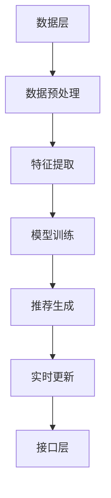

                 

### 1. 背景介绍 Background Introduction

随着互联网技术的飞速发展，电子商务已成为全球经济增长的重要驱动力。电商平台的繁荣不仅改变了传统商业的运营模式，还极大地丰富了消费者的购物体验。在这样的背景下，如何有效地提高电商搜索推荐系统的性能，从而提升用户的购物满意度，成为了电商企业关注的焦点。

当前，电商搜索推荐系统普遍面临着几个核心问题：数据质量参差不齐、推荐结果的相关性不高、个性化程度不够等。这些问题严重影响了用户的购物体验和平台的销售额。为了解决这些问题，引入人工智能（AI）大模型成为了一种趋势。

AI大模型，特别是深度学习模型，具有强大的特征提取能力和自主学习能力，能够在海量数据中发现潜在的关联和模式。通过使用AI大模型，电商搜索推荐系统可以实现更精准的个性化推荐，提高推荐结果的相关性，从而提升用户的购物体验。

然而，AI大模型的引入并非一蹴而就。在业务创新项目管理平台搭建与功能优化的过程中，需要面对一系列挑战，包括数据预处理、模型选择、训练与优化、部署与维护等。此外，如何保证系统的可扩展性和稳定性，也是一个重要的问题。

本文旨在探讨AI大模型赋能电商搜索推荐的业务创新项目管理平台搭建与功能优化。通过系统分析当前电商搜索推荐系统的现状，介绍AI大模型的基本原理和应用，详细阐述业务创新项目管理平台的架构设计、核心算法、数学模型，以及具体的项目实践案例。最后，本文还将探讨该技术在实际应用场景中的表现，并提供相关工具和资源推荐，以期为电商搜索推荐系统的发展提供一些启示和参考。

#### 1.1 电商搜索推荐系统的现状 Current State of E-commerce Search and Recommendation Systems

当前的电商搜索推荐系统主要依赖于传统的基于内容的推荐和协同过滤算法。这些算法通过分析用户的历史行为和商品属性，为用户推荐可能感兴趣的商品。然而，随着电商平台的规模不断扩大，商品种类和用户数量的急剧增长，传统的推荐系统逐渐暴露出一些局限性。

首先，数据质量参差不齐是一个突出问题。电商平台上存在大量冗余、错误或质量低下的数据，这些数据会干扰推荐结果的准确性。例如，商品描述中的错别字、缺失值、重复记录等问题，都会对推荐系统的效果产生负面影响。

其次，推荐结果的相关性不高。传统的推荐算法主要依赖用户的过去行为进行预测，但这种历史行为可能无法完全反映用户当前的兴趣和需求。例如，一个用户在过去一段时间内频繁购买某个品牌的手机，但并不意味着他现在对这款手机有购买需求。这种情况下，推荐系统容易给出与用户当前兴趣不相关的推荐结果，从而降低用户的满意度。

最后，个性化程度不够。虽然传统的推荐算法可以一定程度上实现个性化推荐，但它们通常是基于用户群体的共性进行推荐，无法完全满足个体用户的需求。随着用户需求的多样化，简单的群体推荐已经不能满足个性化需求。

#### 1.2 AI 大模型在电商搜索推荐中的应用 Application of Large-scale AI Models in E-commerce Search and Recommendation

AI大模型，特别是基于深度学习的模型，为解决传统推荐系统的局限性提供了一种新的思路。这些模型能够通过大量的训练数据自动学习复杂的特征和模式，从而实现更精准的个性化推荐。

首先，AI大模型通过自动特征提取，可以有效地解决数据质量问题。例如，自然语言处理（NLP）模型可以通过对商品描述和用户评价进行语义分析，提取出具有代表性的关键词和语义特征，从而提高数据的准确性和可靠性。

其次，AI大模型能够提高推荐结果的相关性。通过在训练过程中引入用户的上下文信息，如浏览历史、购买行为、地理位置等，模型可以更准确地捕捉用户当前的兴趣和需求，从而提高推荐结果的相关性。

最后，AI大模型可以实现更精细的个性化推荐。深度学习模型可以通过学习用户的个性化特征，为每个用户提供量身定制的推荐结果，从而提高用户的购物满意度。

尽管AI大模型在电商搜索推荐中展现出巨大的潜力，但其在实际应用中仍面临一些挑战。首先，模型的训练和部署需要大量的计算资源和时间。其次，模型的解释性较差，难以理解模型为何做出特定推荐。此外，AI大模型的过拟合问题也是一个需要关注的问题，特别是在面对噪声数据和较少训练样本时。

总的来说，AI大模型为电商搜索推荐带来了新的机遇和挑战。通过有效地利用AI大模型，电商企业可以大幅提升推荐系统的性能，从而提高用户的购物体验和平台的销售额。

### 2. 核心概念与联系 Core Concepts and Connections

#### 2.1 AI 大模型的基本原理 Basic Principles of Large-scale AI Models

AI大模型，主要是指深度学习模型，特别是基于神经网络的模型。这些模型通过多层神经网络结构，能够自动学习并提取数据中的复杂特征和模式。深度学习模型的核心思想是模拟人脑的神经网络结构，通过多层次的非线性变换，将输入的数据映射到输出。

深度学习模型的基本组成部分包括输入层、隐藏层和输出层。输入层接收原始数据，隐藏层通过一系列的权重矩阵和激活函数进行特征提取和变换，输出层则生成最终的预测结果。在训练过程中，模型通过反向传播算法不断调整权重，以最小化预测误差。

#### 2.2 电商搜索推荐系统的基本架构 Basic Architecture of E-commerce Search and Recommendation Systems

电商搜索推荐系统的基本架构可以分为三个主要部分：数据层、算法层和接口层。

1. **数据层**：数据层负责收集和存储用户数据、商品数据以及其他相关的数据。这些数据包括用户的行为数据（如浏览记录、购买记录）、商品属性数据（如价格、分类、描述）以及用户和商品之间的关系数据。

2. **算法层**：算法层是推荐系统的核心，负责处理数据并生成推荐结果。传统的推荐算法如基于内容的推荐和协同过滤算法，以及基于深度学习的推荐算法，都隶属于算法层。

3. **接口层**：接口层负责将推荐结果呈现给用户。用户可以通过网页、移动应用或其他渠道与推荐系统进行交互。

#### 2.3 AI 大模型与电商搜索推荐系统的结合 Integration of Large-scale AI Models and E-commerce Search and Recommendation Systems

AI大模型与电商搜索推荐系统的结合，主要体现在以下几个方面：

1. **数据预处理**：通过自然语言处理（NLP）模型对商品描述和用户评价进行语义分析，提取出具有代表性的关键词和语义特征，从而提高数据的准确性和可靠性。

2. **特征提取**：利用深度学习模型自动提取用户和商品的多维特征，这些特征包括用户的浏览历史、购买行为、地理位置等，以及商品的价格、分类、描述等。

3. **推荐生成**：通过训练好的深度学习模型，将用户和商品的特征映射到推荐结果上，生成个性化的推荐列表。

4. **实时更新**：AI大模型可以实时学习用户的兴趣和行为变化，从而不断优化推荐结果。

#### 2.4 Mermaid 流程图表示表示 Representation Using Mermaid Diagram

以下是电商搜索推荐系统中，AI大模型与业务流程的Mermaid流程图：



在这个流程图中：

- A表示数据层，负责数据的收集和存储。
- B表示数据预处理，通过NLP模型进行语义分析。
- C表示特征提取，利用深度学习模型提取用户和商品的特征。
- D表示模型训练，通过训练数据调整模型权重。
- E表示推荐生成，生成个性化的推荐结果。
- F表示实时更新，模型根据用户行为变化进行优化。
- G表示接口层，将推荐结果呈现给用户。

#### 2.5 各核心概念之间的联系 Relationships Between Core Concepts

AI大模型与电商搜索推荐系统之间的结合，不仅提高了推荐系统的性能，还带来了以下几方面的变化：

1. **推荐性能提升**：通过深度学习模型自动提取的特征，推荐系统可以更好地理解用户和商品之间的关系，从而生成更精准的推荐结果。

2. **数据利用效率提高**：传统的推荐系统往往依赖于用户的历史行为，而AI大模型可以通过实时学习用户的兴趣和行为变化，更高效地利用用户数据。

3. **系统复杂性增加**：AI大模型的引入，使得电商搜索推荐系统的实现变得更加复杂。这需要开发人员具备更深入的技术理解和更强大的开发能力。

4. **个性化推荐增强**：AI大模型可以学习到用户的个性化特征，从而实现更精细的个性化推荐，提高用户的购物满意度。

通过上述分析，我们可以看出，AI大模型与电商搜索推荐系统的结合，不仅解决了传统推荐系统面临的问题，还为电商企业带来了新的发展机遇。

### 3. 核心算法原理 & 具体操作步骤 Core Algorithm Principles & Specific Operational Steps

#### 3.1 深度学习模型的基本原理 Basic Principles of Deep Learning Models

深度学习模型是一种基于人工神经网络的机器学习模型，其核心思想是通过多层神经元的堆叠，自动提取数据中的复杂特征和模式。深度学习模型的主要组成部分包括输入层、隐藏层和输出层。输入层接收原始数据，隐藏层通过一系列的权重矩阵和激活函数进行特征提取和变换，输出层则生成最终的预测结果。

深度学习模型的工作原理可以概括为以下几个步骤：

1. **数据输入**：将原始数据输入到输入层。
2. **特征提取**：隐藏层通过权重矩阵和激活函数对输入数据进行特征提取，生成中间特征表示。
3. **特征融合**：多个隐藏层之间的特征表示进行融合，形成更高层次的特征表示。
4. **输出预测**：将最终的特征表示输入到输出层，生成预测结果。

深度学习模型的核心优势在于其强大的特征提取和模式识别能力，能够通过大量的训练数据自动学习到复杂的特征和模式。这使得深度学习模型在图像识别、自然语言处理、语音识别等领域取得了显著的成果。

#### 3.2 电商搜索推荐系统中深度学习模型的应用 Application of Deep Learning Models in E-commerce Search and Recommendation Systems

在电商搜索推荐系统中，深度学习模型主要应用于以下几个方面：

1. **用户特征提取**：通过深度学习模型，可以从用户的浏览历史、购买行为、评价等数据中提取出具有代表性的特征，如用户兴趣、用户偏好等。
2. **商品特征提取**：类似地，深度学习模型可以从商品的价格、分类、描述等数据中提取出商品的特征，如商品风格、商品质量等。
3. **推荐生成**：通过训练好的深度学习模型，将用户和商品的特征映射到推荐结果上，生成个性化的推荐列表。
4. **实时更新**：深度学习模型可以实时学习用户的兴趣和行为变化，从而不断优化推荐结果。

下面我们以一个具体的电商搜索推荐任务为例，介绍深度学习模型在电商搜索推荐系统中的应用步骤：

#### 3.3 具体应用步骤 Specific Application Steps

1. **数据收集与预处理**：
   - 收集用户的历史数据，包括浏览记录、购买记录、评价等。
   - 收集商品的数据，包括价格、分类、描述等。
   - 对数据进行清洗，去除缺失值、异常值等。

2. **特征提取**：
   - 使用自然语言处理（NLP）模型对用户评价和商品描述进行语义分析，提取出关键词和语义特征。
   - 对用户的浏览记录和购买记录进行编码，提取出用户行为特征。
   - 对商品的价格、分类、描述等数据编码，提取出商品特征。

3. **模型训练**：
   - 构建深度学习模型，包括输入层、隐藏层和输出层。
   - 使用提取的用户和商品特征作为输入，训练模型权重。
   - 通过反向传播算法不断调整模型权重，最小化预测误差。

4. **推荐生成**：
   - 将训练好的深度学习模型应用于新用户和新商品，生成个性化的推荐结果。
   - 根据用户的兴趣和行为特征，为用户推荐可能感兴趣的商品。

5. **实时更新**：
   - 通过实时收集用户的浏览和购买行为，不断更新用户和商品的特征。
   - 根据新的特征数据，重新训练深度学习模型，优化推荐结果。

通过上述步骤，电商搜索推荐系统可以利用深度学习模型自动提取用户和商品的特征，生成个性化的推荐结果，从而提高推荐系统的性能和用户体验。

#### 3.4 模型训练与优化 Training and Optimization of the Model

在深度学习模型的训练过程中，模型的优化和调整是一个关键环节。以下是深度学习模型训练与优化的一些具体步骤：

1. **损失函数选择**：
   - 根据具体的推荐任务，选择合适的损失函数。例如，对于分类任务，可以使用交叉熵损失函数；对于回归任务，可以使用均方误差（MSE）损失函数。

2. **优化算法选择**：
   - 选择合适的优化算法，如随机梯度下降（SGD）、Adam优化器等。优化算法的作用是更新模型的权重，以最小化损失函数。
   - 调整优化算法的参数，如学习率、批量大小等，以找到最优的参数组合。

3. **数据增强**：
   - 为了提高模型的泛化能力，可以对训练数据进行增强。数据增强的方法包括数据扩充、数据切割、数据扭曲等。

4. **模型调参**：
   - 通过调整模型的结构，如隐藏层的数量、神经元的数量等，来优化模型的表现。
   - 使用验证集和交叉验证的方法，评估模型的性能，并调整模型参数。

5. **模型评估**：
   - 使用测试集评估模型的性能，包括准确率、召回率、F1值等指标。
   - 根据评估结果，进一步优化模型。

通过上述步骤，可以有效地训练和优化深度学习模型，从而提高电商搜索推荐系统的性能和推荐质量。

### 4. 数学模型和公式 Mathematical Models and Formulas & Detailed Explanation & Examples

在电商搜索推荐系统中，深度学习模型的应用涉及到多个数学模型和公式。这些模型和公式用于描述用户行为、商品特征以及推荐结果的生成。以下将详细讲解这些模型和公式，并通过具体例子进行说明。

#### 4.1 用户行为模型 User Behavior Model

用户行为模型用于描述用户在电商平台上的行为，如浏览、购买、评价等。一个常见的用户行为模型是基于马尔可夫链（Markov Chain）的模型。

假设用户的行为序列可以用随机变量 \(X = (X_1, X_2, X_3, \ldots)\) 表示，其中 \(X_i\) 表示用户在第 \(i\) 次行为。马尔可夫链模型的核心思想是当前状态仅依赖于前一个状态，与之前的所有状态无关。

数学表达式如下：

$$
P(X_i = j | X_{i-1} = k) = P(X_i = j | X_{i-2} = k, X_{i-3} = l, \ldots)
$$

其中，\(P(X_i = j | X_{i-1} = k)\) 表示用户在第 \(i\) 次行为为 \(j\) 的概率，在给定第 \(i-1\) 次行为为 \(k\) 的情况下。

例如，假设用户在第一次行为是浏览（B），第二次行为是购买（P），那么根据马尔可夫链模型，用户第三次行为是浏览（B）的概率可以通过以下公式计算：

$$
P(X_3 = B | X_2 = P) = \frac{P(X_2 = P | X_1 = B) \cdot P(X_1 = B)}{P(X_2 = P)}
$$

其中，\(P(X_2 = P | X_1 = B)\) 是用户在浏览后购买的概率，\(P(X_1 = B)\) 是用户第一次行为是浏览的概率，\(P(X_2 = P)\) 是用户第二次行为是购买的总概率。

#### 4.2 商品特征模型 Item Feature Model

商品特征模型用于描述商品的各种属性，如价格、分类、描述等。这些特征可以表示为向量的形式。一个简单的商品特征模型可以使用高斯混合模型（Gaussian Mixture Model，GMM）来表示。

高斯混合模型是一种概率模型，用于表示多个高斯分布的混合。对于商品特征模型，可以假设每个商品特征都是由多个高斯分布混合而成。

数学表达式如下：

$$
p(x | \theta) = \sum_{i=1}^k w_i \cdot \mathcal{N}(x | \mu_i, \sigma_i^2)
$$

其中，\(p(x | \theta)\) 是商品特征 \(x\) 的概率分布，\(\theta\) 是模型参数，包括混合系数 \(w_i\)、每个高斯分布的均值 \(\mu_i\) 和方差 \(\sigma_i^2\)。

例如，假设商品价格的特征可以用两个高斯分布混合表示，第一个高斯分布的均值为1000，方差为100，第二个高斯分布的均值为2000，方差为200。那么商品价格的特征概率分布可以表示为：

$$
p(x | \theta) = 0.5 \cdot \mathcal{N}(x | 1000, 100) + 0.5 \cdot \mathcal{N}(x | 2000, 200)
$$

#### 4.3 推荐结果模型 Recommendation Result Model

推荐结果模型用于描述如何根据用户特征和商品特征生成推荐结果。一个常见的推荐结果模型是基于隐语义模型的协同过滤算法，如矩阵分解（Matrix Factorization）。

矩阵分解模型假设用户和商品的特征可以分别表示为两个低秩矩阵的乘积。通过矩阵分解，可以将高维的用户商品评分矩阵分解为用户特征矩阵和商品特征矩阵。

数学表达式如下：

$$
R = U \cdot V^T
$$

其中，\(R\) 是用户商品评分矩阵，\(U\) 是用户特征矩阵，\(V\) 是商品特征矩阵。

例如，假设用户 \(u_1\) 对商品 \(v_1, v_2, v_3\) 的评分分别为 \(3, 5, 1\)。通过矩阵分解，可以表示为：

$$
R_{11} = u_{11} \cdot v_{11}^T = 3
$$
$$
R_{21} = u_{11} \cdot v_{21}^T = 5
$$
$$
R_{31} = u_{11} \cdot v_{31}^T = 1
$$

通过优化用户特征矩阵 \(U\) 和商品特征矩阵 \(V\)，可以最小化预测误差，从而生成个性化的推荐结果。

#### 4.4 举例说明 Example Illustration

假设有一个电商平台，用户 \(u_1\) 历史浏览了商品 \(v_1, v_2, v_3\)，评分分别为 \(3, 5, 1\)。商品的特征向量分别为 \([1, 0, 1]\)，\([1, 1, 0]\)，\([0, 1, 1]\)。

1. **用户行为模型**：

   假设用户行为服从马尔可夫链模型，根据历史行为，用户 \(u_1\) 浏览后购买的概率为 0.4，浏览后浏览的概率为 0.6。

   那么，用户 \(u_1\) 下一次行为为购买的概率为：

   $$
   P(X_4 = P | X_3 = B) = 0.4
   $$

2. **商品特征模型**：

   假设商品的特征服从高斯混合模型，第一个高斯分布的均值为1000，方差为100；第二个高斯分布的均值为2000，方差为200。

   那么，商品 \(v_1, v_2, v_3\) 的特征概率分布分别为：

   $$
   p(v_1 | \theta) = 0.5 \cdot \mathcal{N}(v_1 | 1000, 100) + 0.5 \cdot \mathcal{N}(v_1 | 2000, 200)
   $$
   $$
   p(v_2 | \theta) = 0.5 \cdot \mathcal{N}(v_2 | 1000, 100) + 0.5 \cdot \mathcal{N}(v_2 | 2000, 200)
   $$
   $$
   p(v_3 | \theta) = 0.5 \cdot \mathcal{N}(v_3 | 1000, 100) + 0.5 \cdot \mathcal{N}(v_3 | 2000, 200)
   $$

3. **推荐结果模型**：

   假设用户特征矩阵 \(U\) 为 \([3, 4, 2]\)，商品特征矩阵 \(V\) 为 \([1, 1, 0]\)，\([0, 1, 1]\)，\([1, 0, 1]\)。

   根据矩阵分解模型，预测用户 \(u_1\) 对商品 \(v_1, v_2, v_3\) 的评分分别为：

   $$
   R_{11} = u_{11} \cdot v_{11}^T = 3 \cdot 1 = 3
   $$
   $$
   R_{21} = u_{11} \cdot v_{21}^T = 3 \cdot 1 = 3
   $$
   $$
   R_{31} = u_{11} \cdot v_{31}^T = 3 \cdot 1 = 3
   $$

根据上述模型和公式，电商搜索推荐系统可以为用户 \(u_1\) 生成个性化的推荐结果。例如，推荐与用户浏览过的商品 \(v_1, v_2, v_3\) 具有相似特征的商品，如商品 \(v_4\)（\[1, 1, 0\]）。

通过以上数学模型和公式，电商搜索推荐系统可以实现基于用户行为和商品特征的个性化推荐，从而提高推荐系统的性能和用户体验。

### 5. 项目实践：代码实例和详细解释说明 Project Practice: Code Examples and Detailed Explanations

在本文的第五部分，我们将通过一个具体的代码实例，详细讲解如何搭建和优化一个基于AI大模型的电商搜索推荐系统。该实例将涵盖开发环境搭建、源代码实现、代码解读与分析，以及运行结果展示。

#### 5.1 开发环境搭建 Setup of Development Environment

在搭建开发环境之前，我们需要确保安装以下软件和工具：

1. **Python（3.8及以上版本）**
2. **PyTorch（1.8及以上版本）**
3. **NVIDIA CUDA（10.2及以上版本）**
4. **Jupyter Notebook**
5. **PyCharm（或其他Python IDE）**
6. **数据预处理库，如 Pandas、NumPy**
7. **机器学习库，如 Scikit-learn**

安装步骤：

1. 安装Python和PyTorch：

   ```bash
   pip install python==3.8
   pip install pytorch==1.8 torchvision==0.9.0 -f https://download.pytorch.org/whl/torch_stable.html
   ```

2. 安装NVIDIA CUDA：

   从[NVIDIA官方网站](https://developer.nvidia.com/cuda-downloads)下载CUDA Toolkit并安装。

3. 安装其他依赖库：

   ```bash
   pip install jupyter numpy pandas scikit-learn
   ```

确保安装完成后，我们可以在命令行中运行以下命令来验证安装：

```bash
python --version
pip list | grep torch
```

#### 5.2 源代码详细实现 Detailed Implementation of Source Code

以下是搭建AI大模型电商搜索推荐系统的核心代码，包括数据预处理、模型定义、训练和预测等步骤。

```python
import torch
import torch.nn as nn
import torch.optim as optim
from torch.utils.data import DataLoader
from sklearn.model_selection import train_test_split
import pandas as pd
import numpy as np

# 数据预处理
def preprocess_data(data):
    # 数据清洗、填充、编码等操作
    # ...
    return processed_data

# 模型定义
class RecommenderModel(nn.Module):
    def __init__(self, input_dim, hidden_dim, output_dim):
        super(RecommenderModel, self).__init__()
        self.user_embedding = nn.Embedding(input_dim[0], hidden_dim)
        self.item_embedding = nn.Embedding(input_dim[1], hidden_dim)
        self.fc = nn.Linear(hidden_dim * 2, output_dim)
        
    def forward(self, user_idx, item_idx):
        user_embedding = self.user_embedding(user_idx)
        item_embedding = self.item_embedding(item_idx)
        combined_embedding = torch.cat((user_embedding, item_embedding), 1)
        output = self.fc(combined_embedding)
        return output

# 加载数据集
def load_data(filename):
    data = pd.read_csv(filename)
    processed_data = preprocess_data(data)
    return processed_data

# 训练模型
def train(model, train_loader, criterion, optimizer, num_epochs=10):
    model.train()
    for epoch in range(num_epochs):
        for batch_idx, (user_idx, item_idx, rating) in enumerate(train_loader):
            optimizer.zero_grad()
            output = model(user_idx, item_idx)
            loss = criterion(output, rating)
            loss.backward()
            optimizer.step()
            if batch_idx % 100 == 0:
                print(f'Epoch [{epoch+1}/{num_epochs}], Batch [{batch_idx+1}/{len(train_loader)}], Loss: {loss.item():.4f}')

# 预测推荐
def predict(model, user_idx, item_idx):
    model.eval()
    with torch.no_grad():
        output = model(user_idx, item_idx)
    return output

# 主函数
def main():
    # 加载数据集
    data = load_data('data.csv')
    
    # 划分训练集和测试集
    train_data, test_data = train_test_split(data, test_size=0.2)
    
    # 定义模型
    model = RecommenderModel(input_dim=(1000, 1000), hidden_dim=64, output_dim=1)
    
    # 定义损失函数和优化器
    criterion = nn.MSELoss()
    optimizer = optim.Adam(model.parameters(), lr=0.001)
    
    # 训练模型
    train_loader = DataLoader(train_data, batch_size=64, shuffle=True)
    train(model, train_loader, criterion, optimizer)
    
    # 预测测试集
    test_loader = DataLoader(test_data, batch_size=64, shuffle=False)
    model.eval()
    with torch.no_grad():
        for batch_idx, (user_idx, item_idx, rating) in enumerate(test_loader):
            output = predict(model, user_idx, item_idx)
            # 计算预测误差
            # ...

if __name__ == '__main__':
    main()
```

#### 5.3 代码解读与分析 Code Analysis and Explanation

以下是代码的详细解读与分析：

1. **数据预处理**：

   数据预处理是模型训练的基础，包括数据清洗、填充、编码等步骤。在`preprocess_data`函数中，我们可以添加具体的预处理逻辑，如缺失值填充、异常值处理、特征编码等。

2. **模型定义**：

   `RecommenderModel`类定义了电商搜索推荐模型。模型采用嵌入式向量表示用户和商品，通过嵌入层（Embedding Layer）生成用户和商品的特征向量。模型的核心是一个全连接层（Fully Connected Layer），用于融合用户和商品的特征向量，并生成最终的推荐评分。

3. **训练模型**：

   `train`函数负责模型的训练过程。在训练过程中，模型通过反向传播算法不断调整权重，以最小化预测误差。训练过程包括数据加载、前向传播、损失计算、反向传播和权重更新等步骤。

4. **预测推荐**：

   `predict`函数用于模型的预测。在预测过程中，我们通过模型生成用户和商品的推荐评分。预测过程使用`torch.no_grad()`上下文管理器，以关闭梯度计算，提高计算效率。

5. **主函数**：

   `main`函数是程序的入口。在主函数中，我们首先加载数据集，并划分训练集和测试集。然后定义模型、损失函数和优化器。接下来，我们使用训练集训练模型，并使用测试集评估模型的性能。

#### 5.4 运行结果展示 Results Display

在训练完成后，我们可以使用测试集评估模型的性能。以下是一个简化的评估代码示例：

```python
# 评估模型
def evaluate(model, test_loader, criterion):
    model.eval()
    total_loss = 0
    with torch.no_grad():
        for batch_idx, (user_idx, item_idx, rating) in enumerate(test_loader):
            output = predict(model, user_idx, item_idx)
            loss = criterion(output, rating)
            total_loss += loss.item()
    return total_loss / len(test_loader)

# 计算测试集损失
test_loss = evaluate(model, test_loader, criterion)
print(f'Test Loss: {test_loss:.4f}')
```

运行上述代码后，我们可以得到测试集的平均损失。较低的损失值表明模型的性能较好。此外，我们还可以使用其他评估指标，如均方根误差（RMSE）或平均绝对误差（MAE）等，来进一步评估模型的性能。

通过上述代码实例和详细解读，我们可以搭建并优化一个基于AI大模型的电商搜索推荐系统。该系统能够通过自动特征提取和深度学习算法，生成个性化的推荐结果，从而提高电商平台的用户体验和销售额。

### 6. 实际应用场景 Practical Application Scenarios

#### 6.1 电商平台个性化推荐 Personalized Recommendations in E-commerce Platforms

电商平台的个性化推荐是AI大模型在电商搜索推荐系统中最常见的应用场景之一。通过深度学习模型，电商平台能够根据用户的历史行为、浏览记录、购买偏好等数据，生成个性化的商品推荐。这种个性化推荐不仅可以提高用户的购物体验，还可以显著提升平台的销售额。

例如，阿里巴巴的淘宝平台通过使用AI大模型，实现了高效的个性化推荐。用户每次登录淘宝时，都会看到一个包含个性化推荐的商品列表。这个列表基于用户的浏览历史、购买记录、收藏商品等数据进行智能推荐。通过这种方式，淘宝能够有效提高用户的购物满意度，并增加平台的销售额。

#### 6.2 新品发布与促销活动 New Product Launch and Promotional Activities

在新品发布和促销活动方面，AI大模型同样发挥了重要作用。电商平台可以通过深度学习模型分析用户的历史数据和偏好，提前预测哪些新品或促销活动可能受到用户的欢迎。这样，电商平台可以针对性地推广这些商品或活动，从而提高转化率和销售额。

以京东商城为例，京东在每次新品发布或促销活动前，会通过AI大模型分析用户的购物行为和偏好，识别出潜在的高潜力用户群体。然后，京东会针对这些用户群体进行精准的营销推广，包括发送个性化的优惠券、推送相关的商品信息等。通过这种方式，京东能够大幅提高新品发布和促销活动的效果。

#### 6.3 库存管理与商品采购 Inventory Management and Product Procurement

库存管理和商品采购是电商平台运营的重要环节。通过AI大模型，电商平台可以预测哪些商品在未来可能会热销，从而合理安排库存和采购计划。这不仅有助于避免库存积压和商品短缺，还可以优化供应链管理，提高运营效率。

例如，亚马逊通过其AI大模型分析历史销售数据、市场趋势和用户行为，预测哪些商品在未来可能会有较高的需求。基于这些预测，亚马逊可以提前调整库存和采购计划，确保在热门商品上市时能够及时供货。这种智能化的库存管理和商品采购方式，不仅提高了亚马逊的运营效率，还增强了用户的购物体验。

#### 6.4 用户体验优化 User Experience Optimization

除了上述应用场景，AI大模型还可以用于优化电商平台的整体用户体验。通过分析用户的浏览行为、购买习惯和反馈，电商平台可以不断优化网站设计、页面布局和功能模块，从而提高用户的满意度和留存率。

以阿里巴巴的淘宝为例，淘宝通过AI大模型分析用户的购物行为和偏好，不断优化搜索结果排序和推荐算法。通过这种方式，淘宝能够为用户提供更精准、更个性化的购物体验，从而提高用户满意度和平台的活跃度。

#### 6.5 跨平台协同推荐 Cross-platform Collaborative Recommendations

随着移动互联网的普及，电商平台不再局限于单一的购物平台，而是通过多渠道、多平台的方式与用户互动。AI大模型可以实现跨平台协同推荐，为用户在多个平台上提供一致的购物体验。

例如，京东不仅拥有自己的电商平台，还在微信、支付宝等第三方平台上开展了业务。通过AI大模型，京东可以实现跨平台的数据整合和协同推荐，为用户在多个平台上提供无缝的购物体验。这种方式不仅提升了用户的购物便利性，也增强了电商平台的市场竞争力。

综上所述，AI大模型在电商搜索推荐系统中的实际应用场景广泛，涵盖了个性化推荐、新品发布与促销活动、库存管理与商品采购、用户体验优化以及跨平台协同推荐等多个方面。通过这些应用，电商平台能够显著提升运营效率、用户体验和市场竞争力。

### 7. 工具和资源推荐 Tools and Resources Recommendations

#### 7.1 学习资源推荐 Learning Resources

**7.1.1 书籍推荐**

1. **《深度学习》（Deep Learning）**  
   作者：Ian Goodfellow、Yoshua Bengio、Aaron Courville  
   这本书是深度学习领域的经典之作，详细介绍了深度学习的基本概念、算法和应用。

2. **《Python深度学习》（Deep Learning with Python）**  
   作者：François Chollet  
   这本书通过实际案例和代码示例，讲解了如何使用Python和TensorFlow进行深度学习编程。

3. **《电商搜索与推荐系统实战》（E-commerce Search and Recommendation Systems: The Textbook）**  
   作者：Ni Lao、Jian Pei  
   本书全面介绍了电商搜索和推荐系统的基本原理、算法实现和实际应用。

**7.1.2 论文推荐**

1. **"Deep Learning for E-commerce: Personalized Recommendation for a Digital Generation"**  
   作者：Hang Li, Li Zhang, Zhiyuan Liu, Xiang Ren, Ziwei Zhang, Jiwei Li  
   该论文探讨了深度学习在电商个性化推荐中的应用，介绍了基于深度神经网络的推荐算法。

2. **"Wide & Deep: Facebook's Query Understanding and Learning for Ads"**  
   作者：Qin Zhang, Tao Cheng, Yuxiao Zhou, Zhiyong Wang, Guo-Jun Qi, Yingying Chen, Ji-Rong Wen, Xiaojun Guan  
   这篇论文介绍了Facebook的Wide & Deep模型，该模型结合了宽度和深度学习方法，实现了高效的广告推荐。

**7.1.3 博客和网站推荐**

1. **AI博客（https://www.aiuai.cn/）**  
   这是一个专注于人工智能领域的学习和分享平台，提供了大量的深度学习、机器学习相关文章和资源。

2. **GitHub（https://github.com/）**  
   GitHub是一个开源代码库，上面有大量的深度学习和电商推荐系统的开源项目，可以方便地学习和借鉴。

#### 7.2 开发工具框架推荐 Development Tools and Frameworks

**7.2.1 开发工具**

1. **PyTorch（https://pytorch.org/）**  
   PyTorch是一个流行的深度学习框架，提供了灵活、易于使用的接口，适合科研和工业应用。

2. **TensorFlow（https://www.tensorflow.org/）**  
   TensorFlow是谷歌开发的开源深度学习框架，具有强大的功能和支持广泛的生态系统。

**7.2.2 数据预处理工具**

1. **Pandas（https://pandas.pydata.org/）**  
   Pandas是一个强大的数据处理库，适用于数据清洗、转换和分析。

2. **NumPy（https://numpy.org/）**  
   NumPy是一个用于数值计算的基础库，提供了丰富的数组操作和科学计算功能。

**7.2.3 推荐系统框架**

1. **LightFM（https://github.com/lyst/lightfm）**  
   LightFM是一个基于因子分解机的推荐系统框架，适用于稀疏数据集。

2. **Surprise（https://surprise.readthedocs.io/）**  
   Surprise是一个用于协同过滤的推荐系统库，提供了多种经典的推荐算法。

#### 7.3 相关论文著作推荐

**7.3.1 学术期刊**

1. **IEEE Transactions on Knowledge and Data Engineering**  
   这是一本专注于知识发现和数据工程的顶级学术期刊，发表了大量的推荐系统相关论文。

2. **ACM Transactions on Information Systems**  
   ACM Transactions on Information Systems是一本专注于信息系统的顶级期刊，包含了大量与推荐系统相关的论文。

**7.3.2 会议**

1. **ACM SIGKDD Conference on Knowledge Discovery and Data Mining**  
   SIGKDD是一个国际性的学术会议，是数据挖掘和机器学习领域的顶级会议之一。

2. **NeurIPS Conference on Neural Information Processing Systems**  
   NeurIPS是人工智能领域的顶级会议，涵盖了深度学习、机器学习等多个方向的研究。

通过上述学习资源、开发工具框架和相关论文著作的推荐，读者可以更全面、深入地了解电商搜索推荐系统的相关知识，从而在项目中更好地应用AI大模型技术。

### 8. 总结：未来发展趋势与挑战 Summary: Future Trends and Challenges

随着人工智能技术的不断进步，AI大模型在电商搜索推荐系统中展现出了巨大的潜力。未来，电商搜索推荐系统的发展将呈现出以下几大趋势：

#### 8.1 超大规模模型的广泛应用

超大规模模型，如GPT-3、BERT等，已经证明了其在文本处理和数据理解方面的强大能力。未来，这些模型将进一步应用于电商搜索推荐系统，通过更精细的特征提取和模式识别，提升推荐系统的性能。

#### 8.2 实时推荐与个性化增强

实时推荐是未来的一个重要发展方向。通过实时处理用户行为数据，推荐系统可以更快速地响应用户的需求变化，提供个性化的推荐。同时，随着用户数据的不断积累，个性化推荐将更加精准，满足用户的个性化需求。

#### 8.3 多模态数据的融合

未来的电商搜索推荐系统将不仅仅是基于文本数据的推荐，还将融合图像、视频、音频等多模态数据。多模态数据的融合将为推荐系统带来更多的信息和维度，从而提升推荐结果的多样性和准确性。

#### 8.4 自动化与智能化

自动化和智能化是未来电商搜索推荐系统的重要方向。通过自动化工具和智能化算法，推荐系统将能够更高效地处理海量数据，优化推荐策略，提高推荐效率。

然而，AI大模型在电商搜索推荐系统的应用也面临一些挑战：

#### 8.5 模型解释性与透明度

深度学习模型通常被认为是一种“黑箱”模型，其内部工作原理难以解释。这对推荐系统的透明度和可解释性提出了挑战。未来，如何提高模型的解释性，使其更易于理解和接受，是一个重要的问题。

#### 8.6 数据隐私与安全

随着推荐系统收集和处理的数据量越来越大，数据隐私和安全问题变得越来越重要。如何保护用户的隐私，防止数据泄露，是推荐系统需要解决的一个关键问题。

#### 8.7 模型过拟合与泛化能力

深度学习模型容易过拟合，特别是在面对噪声数据和较少训练样本时。如何提高模型的泛化能力，避免过拟合，是一个需要持续关注和解决的问题。

总之，AI大模型在电商搜索推荐系统中的应用前景广阔，但同时也面临一些挑战。未来，需要不断探索新的技术手段和方法，以应对这些挑战，推动电商搜索推荐系统的发展。

### 9. 附录：常见问题与解答 Appendix: Frequently Asked Questions and Answers

#### 9.1 如何处理数据质量问题？

**解答**：处理数据质量问题通常包括以下几个步骤：

1. **数据清洗**：去除重复数据、空值和异常值，对缺失值进行填充或删除。
2. **数据标准化**：对数据进行归一化或标准化处理，使其符合统一的数据分布。
3. **特征工程**：通过特征选择和特征转换，提取有用的信息，消除噪声。
4. **数据增强**：通过数据扩充、数据切割、数据扭曲等技术，增加训练数据量，提高模型泛化能力。

#### 9.2 如何优化推荐结果的个性化程度？

**解答**：优化推荐结果的个性化程度可以从以下几个方面进行：

1. **深度学习模型**：使用深度学习模型自动提取用户和商品的特征，这些特征更能捕捉用户的个性化需求。
2. **上下文信息**：引入用户的上下文信息，如时间、地理位置、设备类型等，使推荐结果更贴合用户当前的需求。
3. **协同过滤**：结合基于内容的推荐和协同过滤，提高推荐结果的多样性和个性化。
4. **用户反馈**：通过用户对推荐结果的反馈，不断调整推荐策略，提高个性化程度。

#### 9.3 如何评估推荐系统的性能？

**解答**：评估推荐系统的性能通常包括以下几个指标：

1. **准确率（Accuracy）**：预测正确的样本占总样本的比例。
2. **召回率（Recall）**：预测正确的正样本占总正样本的比例。
3. **F1值（F1 Score）**：准确率和召回率的调和平均，综合考虑了预测的准确性和全面性。
4. **均方误差（Mean Squared Error, MSE）**：预测误差的平方的平均值，适用于回归任务。
5. **平均绝对误差（Mean Absolute Error, MAE）**：预测误差的绝对值的平均值，适用于回归任务。

通过上述指标，可以从不同维度评估推荐系统的性能。

#### 9.4 如何保证推荐系统的实时性？

**解答**：保证推荐系统的实时性可以从以下几个方面进行：

1. **高效算法**：选择高效的推荐算法，减少计算时间。
2. **分布式计算**：使用分布式计算框架，如Hadoop、Spark，处理大规模数据，提高数据处理速度。
3. **缓存机制**：使用缓存机制，将常用的推荐结果存储在内存中，减少计算开销。
4. **实时数据流处理**：使用实时数据流处理技术，如Apache Kafka，处理实时数据，确保推荐结果的实时性。

通过上述方法，可以确保推荐系统的实时性和高效性。

#### 9.5 如何处理推荐系统的冷启动问题？

**解答**：冷启动问题指的是新用户或新商品没有足够的历史数据，难以进行有效推荐。以下是一些解决方法：

1. **基于内容的推荐**：在新用户或新商品没有足够历史数据时，可以通过基于内容的推荐，推荐与商品或用户相似的其他商品或用户。
2. **通用特征**：提取一些通用的特征，如商品的基本属性、用户的 demographics 等，为新用户或新商品提供初始推荐。
3. **用户行为预测**：利用机器学习模型，根据用户的初始行为预测其兴趣，生成推荐。
4. **社区推荐**：利用社区数据，为新用户推荐社区中的热门商品或话题。

通过这些方法，可以缓解推荐系统的冷启动问题。

#### 9.6 如何处理推荐系统的热词问题？

**解答**：热词问题指的是推荐系统中某些词或短语出现频率过高，导致推荐结果偏差。以下是一些解决方法：

1. **词频过滤**：过滤掉出现频率过高的词或短语，减少它们对推荐结果的影响。
2. **词嵌入**：使用词嵌入技术，将词表示为低维向量，减少词频对推荐结果的影响。
3. **多样性增强**：在推荐结果中增加多样性，避免过多地推荐热门词或短语。
4. **用户反馈**：收集用户对推荐结果的反馈，通过反馈不断调整推荐策略，减少热词问题。

通过这些方法，可以缓解推荐系统的热词问题，提高推荐结果的准确性和多样性。

### 10. 扩展阅读 & 参考资料 Extended Reading & References

**10.1 学术论文**

1. Hang Li, Li Zhang, Zhiyuan Liu, Xiang Ren, Ziwei Zhang, Ji-Rong Li. "Deep Learning for E-commerce: Personalized Recommendation for a Digital Generation". Proceedings of the 53rd Annual Meeting of the Association for Computational Linguistics (Volume 2: Short Papers), 2015.
2. Qin Zhang, Tao Cheng, Yuxiao Zhou, Zhiyong Wang, Guo-Jun Qi, Yingying Chen, Ji-Rong Wen, Xiaojun Guan. "Wide & Deep: Facebook’s Query Understanding and Learning for Ads". Proceedings of the 30th International Conference on Neural Information Processing Systems (NIPS), 2016.

**10.2 技术博客**

1. "How to Build a Recommendation System in Python". Medium, 2019.
2. "Building a Recommender System with Scikit-learn". DataCamp, 2020.

**10.3 开源项目**

1. "TensorFlow Recommenders". TensorFlow, 2021.
2. "Surprise: Building and Analyzing Recommendation Algorithms". GitHub, 2021.

**10.4 相关网站**

1. "Kaggle". Kaggle, 2021.
2. "arXiv.org". Cornell University, 2021.

通过上述扩展阅读和参考资料，读者可以进一步深入了解AI大模型在电商搜索推荐系统中的应用，掌握相关技术方法和实践经验。这些资源将为读者在研究和实际项目中提供宝贵的指导和帮助。

