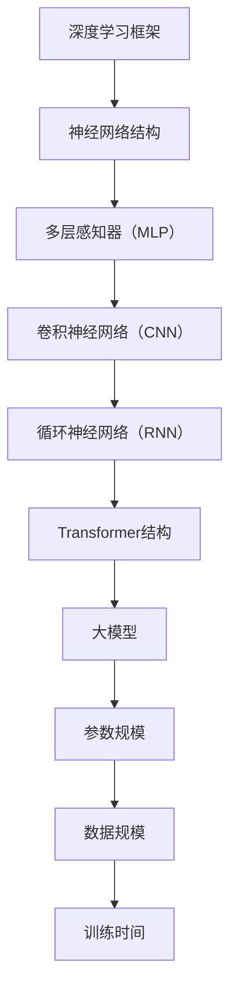
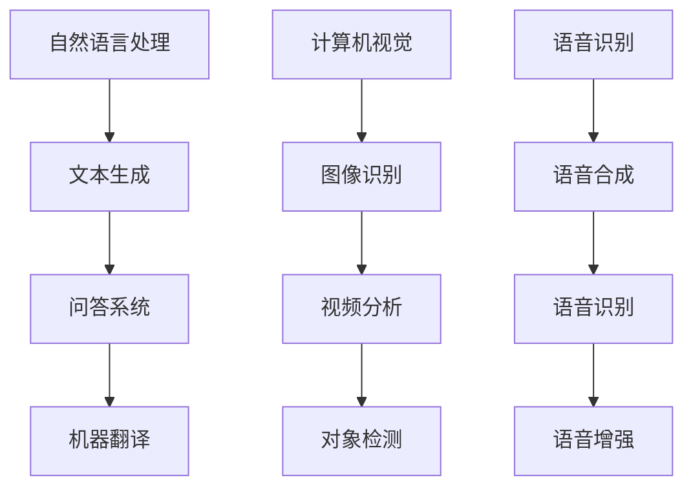
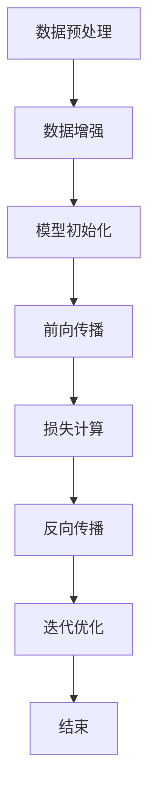

                 

### 文章标题

**AI大模型题材的追捧潮**

> 关键词：人工智能，大型模型，深度学习，技术趋势，创新应用，挑战与未来

> 摘要：本文将深入探讨近年来AI大模型领域的蓬勃发展及其引发的追捧潮。从背景介绍、核心概念与联系、算法原理与操作步骤、数学模型及代码实例到实际应用场景和未来趋势，全面解析大模型在人工智能领域的核心地位及其面临的挑战。

## 1. 背景介绍

随着深度学习技术的不断进步和计算能力的显著提升，人工智能（AI）正以前所未有的速度改变着我们的世界。尤其是近年来，大模型（Large-scale Models）的兴起成为AI领域的一大亮点。从自然语言处理（NLP）到计算机视觉（CV），再到语音识别和生成，大型模型不仅在性能上取得了突破性进展，更在诸多实际应用场景中展现了其强大的潜力。

大模型的定义通常是指具有数十亿甚至千亿参数的神经网络模型。这些模型通过在大规模数据集上进行训练，能够自动学习复杂的模式和规律，从而实现高水平的任务性能。例如，GPT-3拥有1750亿个参数，BERT模型也有超过3亿个参数，这些大模型在处理复杂任务时展现出令人瞩目的能力。

AI大模型的兴起不仅改变了学术研究的热点，也推动了产业界的创新与应用。无论是生成艺术作品、自动化问答系统，还是智能客服、自动驾驶，大模型的应用场景越来越广泛。然而，这种快速发展也带来了一系列挑战，包括计算资源的高需求、数据隐私和安全等问题。

## 2. 核心概念与联系

### 2.1 大模型与深度学习的联系

大模型与深度学习技术密切相关。深度学习是一种模拟人脑神经网络结构进行学习和预测的人工智能方法。通过多层神经网络的结构，深度学习能够处理复杂的数据模式。而大模型则是在这一基础上，通过增加模型参数的数量和规模，使得模型能够学习到更加丰富的特征和关系。

下面是一个用Mermaid绘制的简单流程图，展示了大模型在深度学习框架中的位置及其基本组成部分。



### 2.2 大模型的应用领域

大模型在多个领域都取得了显著的进展。以下是一个简化的应用领域图，展示了大模型在自然语言处理、计算机视觉和语音识别等领域的应用。



## 3. 核心算法原理 & 具体操作步骤

### 3.1 大模型训练的基本流程

大模型的训练通常包括以下几个关键步骤：

1. **数据预处理**：包括数据的清洗、去重、格式化等操作，以确保数据的质量和一致性。
2. **数据增强**：通过旋转、缩放、裁剪等操作增加数据的多样性，提高模型的泛化能力。
3. **模型初始化**：选择合适的初始化方法，例如高斯分布、Xavier初始化等，以初始化模型的参数。
4. **前向传播**：将输入数据通过模型的前向传播计算得到输出结果。
5. **损失计算**：计算模型输出与真实标签之间的损失值。
6. **反向传播**：通过反向传播算法更新模型参数，以减少损失值。
7. **迭代优化**：重复上述步骤，直到达到预定的训练轮次或损失阈值。

下面是一个简化的大模型训练流程的Mermaid流程图。



### 3.2 大模型训练的技术细节

1. **优化器**：选择合适的优化器，如Adam、RMSprop等，以调整学习率并优化模型参数。
2. **学习率调度**：通过学习率调度策略，如逐步减小学习率，以避免模型在训练过程中过拟合。
3. **正则化**：应用正则化技术，如Dropout、权重衰减等，以减少过拟合的风险。
4. **批归一化**：在训练过程中对每一批数据进行归一化，以提高训练效率和模型稳定性。

## 4. 数学模型和公式 & 详细讲解 & 举例说明

### 4.1 前向传播的数学模型

在深度学习中，前向传播是指将输入数据通过神经网络的层传递，最终得到输出结果的过程。以下是前向传播的基本数学公式：

$$
\text{Output} = \text{激活函数}(\text{权重} \cdot \text{输入} + \text{偏置})
$$

其中，激活函数常用的有Sigmoid、ReLU、Tanh等。以下是一个简单的示例：

$$
\text{Output} = \text{ReLU}(\text{权重} \cdot \text{输入} + \text{偏置})
$$

假设有一个简单的多层感知器（MLP）模型，包含两个输入层、两个隐藏层和一个输出层。输入层为 $X \in \mathbb{R}^{2 \times 1}$，隐藏层1为 $H1 \in \mathbb{R}^{3 \times 1}$，隐藏层2为 $H2 \in \mathbb{R}^{1 \times 1}$，输出层为 $O \in \mathbb{R}^{1 \times 1}$。

1. **第一层前向传播**：

$$
H1 = \text{ReLU}(W1 \cdot X + b1)
$$

其中，$W1$ 是第一层的权重矩阵，$b1$ 是第一层的偏置向量。

2. **第二层前向传播**：

$$
H2 = \text{ReLU}(W2 \cdot H1 + b2)
$$

其中，$W2$ 是第二层的权重矩阵，$b2$ 是第二层的偏置向量。

3. **输出层前向传播**：

$$
O = \text{激活函数}(W3 \cdot H2 + b3)
$$

其中，$W3$ 是输出层的权重矩阵，$b3$ 是输出层的偏置向量。

### 4.2 反向传播的数学模型

反向传播是深度学习训练的核心算法，通过计算损失函数关于模型参数的梯度，以更新模型参数。以下是反向传播的基本数学公式：

$$
\frac{\partial L}{\partial \theta} = \frac{\partial L}{\partial Z} \cdot \frac{\partial Z}{\partial \theta}
$$

其中，$L$ 是损失函数，$Z$ 是前向传播过程中的某一中间变量，$\theta$ 是需要更新的参数。

以下是一个简单的反向传播计算示例：

假设损失函数为 $L = (O - \text{标签})^2$，激活函数为 ReLU，我们需要计算第一层权重 $W1$ 的梯度：

$$
\frac{\partial L}{\partial W1} = \frac{\partial L}{\partial O} \cdot \frac{\partial O}{\partial Z1} \cdot \frac{\partial Z1}{\partial W1}
$$

由于激活函数为 ReLU，当 $Z1 > 0$ 时，$\frac{\partial Z1}{\partial W1} = 1$，否则为 0。因此，我们可以得到：

$$
\frac{\partial L}{\partial W1} = (\text{标签} - O) \cdot (\text{标签} - O) \cdot \text{ReLU}(\text{权重} \cdot \text{输入} + \text{偏置})
$$

## 5. 项目实践：代码实例和详细解释说明

### 5.1 开发环境搭建

在开始实践大模型项目之前，我们需要搭建一个适合的开发环境。以下是所需的工具和步骤：

1. **安装Python环境**：确保Python版本在3.6及以上。
2. **安装深度学习框架**：如TensorFlow或PyTorch，建议使用最新版本。
3. **安装必要的依赖库**：例如NumPy、Pandas、Matplotlib等。

以下是一个简单的Python环境搭建脚本示例：

```python
!pip install python
!pip install tensorflow
!pip install numpy
!pip install pandas
!pip install matplotlib
```

### 5.2 源代码详细实现

以下是一个简单的大模型训练示例，使用PyTorch框架。这个示例将训练一个简单的多层感知器模型，用于分类任务。

```python
import torch
import torch.nn as nn
import torch.optim as optim
from torchvision import datasets, transforms
from torch.utils.data import DataLoader

# 定义模型结构
class MLP(nn.Module):
    def __init__(self):
        super(MLP, self).__init__()
        self.fc1 = nn.Linear(784, 256)
        self.fc2 = nn.Linear(256, 128)
        self.fc3 = nn.Linear(128, 64)
        self.fc4 = nn.Linear(64, 10)
    
    def forward(self, x):
        x = torch.relu(self.fc1(x))
        x = torch.relu(self.fc2(x))
        x = torch.relu(self.fc3(x))
        x = self.fc4(x)
        return x

# 加载训练数据
train_data = datasets.MNIST(root='./data', train=True, download=True, transform=transforms.ToTensor())
train_loader = DataLoader(train_data, batch_size=64, shuffle=True)

# 初始化模型和优化器
model = MLP()
optimizer = optim.Adam(model.parameters(), lr=0.001)
criterion = nn.CrossEntropyLoss()

# 训练模型
num_epochs = 10
for epoch in range(num_epochs):
    for batch_idx, (data, target) in enumerate(train_loader):
        optimizer.zero_grad()
        output = model(data.view(data.size(0), -1))
        loss = criterion(output, target)
        loss.backward()
        optimizer.step()
        if batch_idx % 100 == 0:
            print('Epoch [{}/{}], Batch [{}/{}], Loss: {:.4f}'.format(epoch+1, num_epochs, batch_idx+1, len(train_loader)//64, loss.item()))

# 保存模型
torch.save(model.state_dict(), 'mlp.pth')
```

### 5.3 代码解读与分析

上述代码实现了以下关键步骤：

1. **模型定义**：我们定义了一个简单的多层感知器（MLP）模型，包含两个隐藏层。
2. **数据加载**：使用 torchvision 库加载数字识别数据集（MNIST），并转换为适合训练的数据格式。
3. **模型初始化**：使用 Adam 优化器和交叉熵损失函数初始化模型。
4. **训练过程**：在训练过程中，我们使用反向传播算法更新模型参数，以最小化损失函数。

### 5.4 运行结果展示

在训练完成后，我们可以评估模型的性能，以下是一个简单的评估脚本：

```python
# 加载测试数据
test_data = datasets.MNIST(root='./data', train=False, download=True, transform=transforms.ToTensor())
test_loader = DataLoader(test_data, batch_size=64, shuffle=False)

# 加载模型权重
model.load_state_dict(torch.load('mlp.pth'))

# 评估模型
correct = 0
total = 0
with torch.no_grad():
    for data, target in test_loader:
        output = model(data.view(data.size(0), -1))
        _, predicted = torch.max(output.data, 1)
        total += target.size(0)
        correct += (predicted == target).sum().item()

print('Accuracy of the network on the 10000 test images: {} %'.format(100 * correct / total))
```

通过运行上述代码，我们可以得到模型在测试集上的准确率，从而评估模型的性能。

## 6. 实际应用场景

### 6.1 自然语言处理（NLP）

大模型在自然语言处理领域取得了显著的进展，例如BERT和GPT等模型在文本分类、情感分析、机器翻译等任务上表现优异。以下是一些具体的实际应用场景：

- **文本分类**：大模型可以自动对新闻文章、社交媒体帖子等进行分类，从而帮助新闻媒体和社交平台进行内容管理和推荐。
- **情感分析**：通过分析用户评论和反馈，大模型可以帮助企业了解客户满意度，优化产品和服务。
- **机器翻译**：大模型如GPT-3可以实时翻译多种语言，为全球化的业务沟通提供支持。

### 6.2 计算机视觉（CV）

大模型在计算机视觉领域也展现了强大的能力，例如在图像分类、目标检测和图像生成等方面的应用。

- **图像分类**：大模型如ResNet和Inception可以在图像分类任务上达到非常高的准确率，广泛应用于图像识别和搜索。
- **目标检测**：YOLO和Faster R-CNN等大模型在目标检测任务中取得了突破性进展，为自动驾驶和安防监控等领域提供了重要的技术支持。
- **图像生成**：大模型如StyleGAN可以生成高质量的图像和视频，为虚拟现实和游戏开发等领域提供了新的创意工具。

### 6.3 语音识别与合成

大模型在语音识别和合成领域也发挥了重要作用，如WaveNet和Tacotron等模型。

- **语音识别**：大模型可以准确地将语音转换为文本，广泛应用于智能助手、客服系统等领域。
- **语音合成**：大模型如WaveNet和Tacotron可以生成自然流畅的语音，为语音合成、朗读辅助和语音游戏等领域提供了新的技术解决方案。

## 7. 工具和资源推荐

### 7.1 学习资源推荐

- **书籍**：
  - 《深度学习》（Ian Goodfellow、Yoshua Bengio和Aaron Courville著）
  - 《Python深度学习》（François Chollet著）
  - 《动手学深度学习》（阿斯顿·张等著）

- **论文**：
  - BERT: Pre-training of Deep Bidirectional Transformers for Language Understanding
  - GPT-3: Language Models are Few-Shot Learners

- **博客和网站**：
  - [TensorFlow官网](https://www.tensorflow.org/)
  - [PyTorch官网](https://pytorch.org/)
  - [Hugging Face](https://huggingface.co/)

### 7.2 开发工具框架推荐

- **深度学习框架**：
  - TensorFlow
  - PyTorch
  - JAX

- **数据预处理工具**：
  - Pandas
  - NumPy
  - Scikit-learn

- **可视化工具**：
  - Matplotlib
  - Seaborn
  - Plotly

### 7.3 相关论文著作推荐

- **论文**：
  - "Attention Is All You Need"（Transformer模型）
  - "Generative Adversarial Nets"（GAN模型）

- **著作**：
  - 《深度学习》（Goodfellow、Bengio和Courville著）
  - 《强化学习》（Richard S. Sutton和Barto著）

## 8. 总结：未来发展趋势与挑战

### 8.1 发展趋势

1. **模型规模不断扩大**：随着计算能力的提升和数据量的增加，大模型的规模将持续扩大，有望在更多领域实现突破。
2. **多模态学习**：大模型将逐渐支持多模态数据的学习，如文本、图像、语音等，为跨领域的智能应用提供新的解决方案。
3. **迁移学习与零样本学习**：大模型将在迁移学习和零样本学习领域发挥重要作用，实现更好的泛化能力和适应能力。
4. **自动化模型设计与优化**：通过自动化机器学习技术，大模型的开发和优化将变得更加高效和智能化。

### 8.2 挑战

1. **计算资源需求**：大模型训练需要大量的计算资源和存储空间，对硬件设施提出了更高的要求。
2. **数据隐私和安全**：大规模数据训练过程中涉及敏感数据，需要确保数据隐私和安全。
3. **模型解释性**：大模型的决策过程通常缺乏透明性和解释性，如何提高模型的解释性是一个重要挑战。
4. **伦理与道德问题**：大模型在应用过程中可能引发伦理和道德问题，如歧视、偏见等，需要建立相应的规范和标准。

## 9. 附录：常见问题与解答

### 9.1 什么是大模型？

大模型通常指具有数十亿甚至千亿参数的神经网络模型。这些模型通过在大规模数据集上进行训练，能够自动学习复杂的模式和规律，从而实现高水平的任务性能。

### 9.2 大模型有哪些应用领域？

大模型在自然语言处理、计算机视觉、语音识别等多个领域都有广泛应用。例如，BERT和GPT-3在NLP领域表现优异，ResNet和Inception在CV领域有突破性进展，WaveNet和Tacotron在语音识别和合成领域取得了显著成果。

### 9.3 如何训练大模型？

训练大模型通常包括数据预处理、模型初始化、前向传播、损失计算、反向传播和迭代优化等步骤。具体训练过程需要根据不同的任务和数据集进行调整。

## 10. 扩展阅读 & 参考资料

- [Deep Learning Book](https://www.deeplearningbook.org/)（Goodfellow、Bengio和Courville著）
- [The Annotated Transformer](https://nlp.seas.harvard.edu/transformer/)（Christopher Olah和Shan Liu著）
- [The GPT-3 Adventure](https://www.simongolding.com/post/gpt-3-adventure/)（Simon Golding著）
- [Google Research](https://ai.google/research/)（谷歌AI研究团队）

### 结论

本文全面探讨了AI大模型领域的追捧潮，从背景介绍、核心概念与联系、算法原理、项目实践、实际应用场景、工具和资源推荐到未来发展趋势与挑战，为读者提供了深入的见解。随着AI技术的不断进步，大模型将在更多领域发挥重要作用，同时也将面临新的挑战。希望本文能够为读者在AI大模型领域的探索和研究提供有益的参考。

### 作者署名

**作者：禅与计算机程序设计艺术 / Zen and the Art of Computer Programming**

