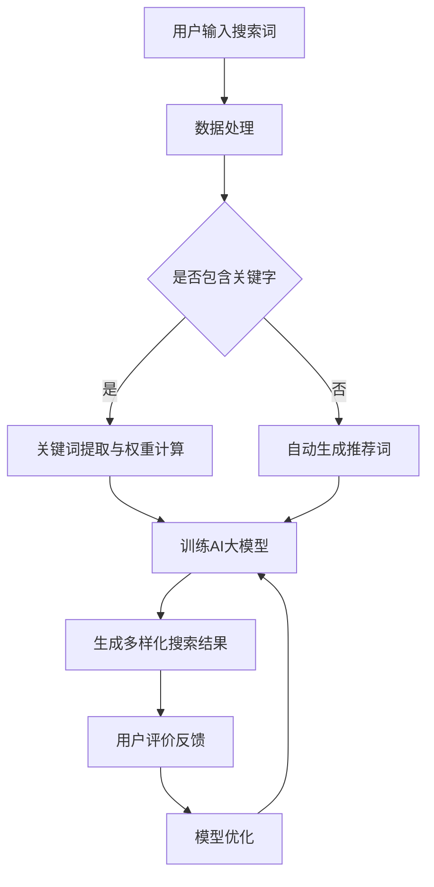

                 

### 文章标题

**AI大模型：优化电商平台搜索结果多样性的新方法**

> **关键词**：电商平台、搜索结果多样性、AI大模型、优化算法、用户满意度、数据分析

**摘要**：随着电商平台的迅速发展，用户对于搜索结果的多样性需求日益增长。本文将探讨如何利用AI大模型来优化电商平台搜索结果多样性，从而提升用户满意度。通过分析核心概念、算法原理、数学模型以及实际应用场景，本文将提供一套完整的解决方案，为电商平台提供新的优化思路。

### 1. 背景介绍

在互联网时代，电商平台已经成为消费者购物的主要途径。然而，随着平台商品数量的急剧增加，如何有效地为用户提供满足需求的搜索结果成为了一个挑战。传统的搜索算法往往侧重于准确性和相关性，而忽略了结果的多样性。用户在浏览搜索结果时，往往希望能够看到更多样化的商品，以满足他们的不同需求和兴趣。

当前，电商平台在搜索结果多样性方面面临以下几个主要问题：

1. **结果单一**：搜索结果往往集中于几个热门品牌或热门商品，缺乏新颖性。
2. **用户流失**：由于搜索结果单一，用户在浏览时可能会感到乏味，从而离开平台。
3. **满意度低**：用户对搜索结果的满意度较低，影响了平台的用户粘性。

为了解决这些问题，电商平台开始尝试引入人工智能（AI）技术，尤其是大模型，来优化搜索结果多样性。大模型能够通过学习海量数据，捕捉用户行为和偏好，从而生成更加丰富和多样化的搜索结果。

本文旨在探讨如何利用AI大模型来优化电商平台搜索结果多样性，提高用户满意度，并最终提升电商平台的市场竞争力。

### 2. 核心概念与联系

为了更好地理解如何利用AI大模型优化搜索结果多样性，我们需要首先明确几个核心概念：

1. **电商平台**：指的是提供商品销售和交易服务的在线平台，如淘宝、京东等。
2. **搜索结果多样性**：指的是在搜索过程中，平台能够提供不同类型、不同品牌、不同风格的商品，以满足用户多样化的需求。
3. **AI大模型**：指的是通过深度学习技术训练的复杂神经网络模型，具有强大的数据处理和分析能力。
4. **用户满意度**：指的是用户对电商平台提供的搜索结果和整体服务的满意程度。

下面是一个简单的Mermaid流程图，用于描述电商平台如何利用AI大模型优化搜索结果多样性的基本架构：



#### 2.1 数据处理

在用户输入搜索词后，平台需要对搜索词进行预处理，包括去重、分词、词干提取等操作。这些处理步骤有助于将用户的模糊搜索需求转化为结构化数据，便于后续分析和建模。

#### 2.2 关键字提取与权重计算

如果搜索词中包含明确的商品关键字，平台会提取这些关键字并计算它们的权重。这些权重可以基于历史数据、用户行为、市场热度等因素确定，用于指导AI大模型的训练。

#### 2.3 自动生成推荐词

如果搜索词不包含明确的关键字，平台将利用自然语言处理技术自动生成可能的推荐词。这些推荐词可以是热门商品、相关品牌、季节性商品等，有助于丰富搜索结果。

#### 2.4 训练AI大模型

通过整合处理后的数据和关键字权重，平台训练AI大模型。训练过程中，模型会学习如何根据用户输入和用户行为生成多样化的搜索结果。

#### 2.5 生成多样化搜索结果

训练完成的AI大模型将生成一系列多样化搜索结果，这些结果不仅包含热门商品，还包括一些小众品牌和特色商品，从而提升搜索结果的多样性。

#### 2.6 用户评价反馈

用户在浏览搜索结果时，会对其中的商品进行评价。这些评价数据将被用于模型优化，使得后续生成的搜索结果更加符合用户的期望。

#### 2.7 模型优化

根据用户评价反馈，平台对AI大模型进行持续优化，使其能够更好地捕捉用户需求和偏好，进一步提高搜索结果的多样性。

通过上述流程，电商平台能够利用AI大模型优化搜索结果多样性，从而提升用户满意度，增加用户粘性，提高市场竞争力。

### 3. 核心算法原理 & 具体操作步骤

#### 3.1 算法原理

为了优化电商平台搜索结果多样性，我们采用了一种基于生成对抗网络（GAN）的AI大模型。生成对抗网络是一种由两个神经网络（生成器G和判别器D）组成的框架，通过对抗训练来生成高质量的数据。

生成器的目标是生成与真实数据相似的数据，而判别器的目标是区分生成数据与真实数据。通过不断的对抗训练，生成器会逐渐提高其生成数据的质量，而判别器也会变得更加准确。

在电商平台搜索结果多样性优化的背景下，生成器G将生成多样化搜索结果，包括热门商品、小众品牌和特色商品。判别器D则负责评估这些搜索结果的真实性和多样性。具体操作步骤如下：

#### 3.2 具体操作步骤

##### 3.2.1 数据准备

首先，我们需要收集大量的商品数据，包括商品名称、品牌、价格、用户评价、搜索热度等。这些数据将用于训练生成器G和判别器D。

##### 3.2.2 数据预处理

对收集到的商品数据进行预处理，包括去重、分词、词干提取、特征提取等操作。预处理后的数据将作为训练数据的输入。

##### 3.2.3 构建生成器和判别器模型

使用深度学习框架（如TensorFlow或PyTorch）构建生成器和判别器模型。生成器G通常采用序列生成模型，如GRU或LSTM，而判别器D则采用二分类模型，如卷积神经网络（CNN）或循环神经网络（RNN）。

##### 3.2.4 训练模型

通过对抗训练方法训练生成器G和判别器D。在训练过程中，生成器G会尝试生成更加多样化的搜索结果，而判别器D会努力区分生成数据和真实数据。通过调整生成器和判别器的参数，可以优化模型性能。

##### 3.2.5 生成多样化搜索结果

在模型训练完成后，生成器G将生成一系列多样化搜索结果。平台可以根据用户输入和用户行为，结合模型生成的结果，为用户提供更加丰富的搜索结果。

##### 3.2.6 用户评价反馈

用户在浏览搜索结果时，会对其中的商品进行评价。这些评价数据将被用于模型优化，使得后续生成的搜索结果更加符合用户的期望。

##### 3.2.7 模型优化

根据用户评价反馈，平台对AI大模型进行持续优化，使其能够更好地捕捉用户需求和偏好，进一步提高搜索结果的多样性。

#### 3.3 算法效果评估

为了评估算法效果，我们可以从以下几个方面进行：

1. **多样性评估**：使用多样性指标（如Jaccard系数、Gini系数等）评估搜索结果的多样性。
2. **用户满意度**：通过用户调查和在线评价，评估用户对搜索结果的满意度。
3. **市场竞争力**：分析搜索结果的多样性对电商平台市场竞争力的影响。

通过以上评估指标，我们可以对算法效果进行全面的评估，并根据评估结果对算法进行优化。

### 4. 数学模型和公式 & 详细讲解 & 举例说明

为了更深入地理解AI大模型优化搜索结果多样性的原理，我们需要引入一些数学模型和公式。以下内容将详细讲解这些模型和公式，并举例说明其在实际中的应用。

#### 4.1 生成对抗网络（GAN）

生成对抗网络（GAN）是由Ian Goodfellow等人于2014年提出的。GAN由两个主要组件组成：生成器（Generator）和判别器（Discriminator）。

生成器的目标是生成与真实数据相似的数据，判别器的目标是区分生成数据与真实数据。在每次训练迭代中，生成器和判别器都会更新自己的参数，以最大化各自的损失函数。

生成器的损失函数通常定义为：

\[ L_G = -\mathbb{E}_{x \sim p_{data}(x)}[\log(D(x))] - \mathbb{E}_{z \sim p_z(z)}[\log(1 - D(G(z)))] \]

其中，\(x\) 是真实数据，\(z\) 是生成器的噪声输入，\(D\) 是判别器，\(G\) 是生成器。

判别器的损失函数通常定义为：

\[ L_D = -\mathbb{E}_{x \sim p_{data}(x)}[\log(D(x))] - \mathbb{E}_{z \sim p_z(z)}[\log(D(G(z)))] \]

在训练过程中，生成器和判别器通过以下步骤进行对抗训练：

1. **生成器生成假数据**：生成器根据噪声输入\(z\)生成假数据\(x'\)。
2. **判别器评估数据**：判别器对真实数据\(x\)和生成数据\(x'\)进行评估，并更新其参数。
3. **生成器更新参数**：生成器根据判别器的评估结果更新其参数，以生成更高质量的数据。
4. **重复上述步骤**：重复以上步骤，直到生成器和判别器达到预定的训练目标。

通过上述对抗训练，生成器能够学习到如何生成与真实数据相似的数据，从而实现数据增强和多样性提升。

#### 4.2 多样性指标

为了评估搜索结果的多样性，我们引入了一些多样性指标。以下为几种常见的多样性指标：

1. **Jaccard系数**：

\[ J(A, B) = \frac{|A \cup B|}{|A \cap B|} \]

其中，\(A\) 和 \(B\) 分别表示两组搜索结果。Jaccard系数越接近1，表示两组结果的多样性越低；越接近0，表示多样性越高。

2. **Gini系数**：

\[ Gini = 1 - \frac{\sum_{i=1}^{n}(p_i^2)}{\sum_{i=1}^{n}p_i} \]

其中，\(p_i\) 表示搜索结果中第\(i\)个元素的频率。Gini系数越低，表示搜索结果的多样性越高。

3. **Herfindahl指数**：

\[ Herfindahl = \sum_{i=1}^{n}p_i^2 \]

Herfindahl指数与Jaccard系数的关系如下：

\[ Herfindahl = 1 - Jaccard \]

通过以上多样性指标，我们可以量化搜索结果的多样性，并评估AI大模型优化效果。

#### 4.3 举例说明

假设我们有一个电商平台，其搜索结果包含以下商品：

\[ \{商品A, 商品B, 商品C, 商品D, 商品E\} \]

其中，商品A和商品B是热门商品，商品C和商品D是小众商品，商品E是特色商品。

使用Jaccard系数评估搜索结果的多样性：

\[ J(A, B, C, D, E) = \frac{|A \cup B \cup C \cup D \cup E|}{|A \cap B \cap C \cap D \cap E|} \]

如果所有商品都是独立的，那么Jaccard系数接近1；如果所有商品都是相同的，那么Jaccard系数接近0。

使用Gini系数评估搜索结果的多样性：

\[ Gini = 1 - \frac{p_A^2 + p_B^2}{p_A + p_B} \]

其中，\(p_A\) 和 \(p_B\) 分别表示热门商品A和B的频率。

如果热门商品A和B的频率接近，那么Gini系数较低，表示搜索结果的多样性较高；如果频率差异较大，那么Gini系数较高，表示多样性较低。

使用Herfindahl指数评估搜索结果的多样性：

\[ Herfindahl = p_A^2 + p_B^2 \]

如果所有商品的频率接近，那么Herfindahl指数较低，表示多样性较高；如果某些商品频率较高，那么Herfindahl指数较高，表示多样性较低。

通过以上多样性指标，我们可以评估AI大模型优化搜索结果多样性的效果。在实际应用中，我们可以根据用户需求和业务目标，选择合适的多样性指标进行评估。

### 5. 项目实践：代码实例和详细解释说明

在本节中，我们将通过一个实际的项目实例，展示如何利用AI大模型优化电商平台搜索结果多样性。首先，我们将搭建一个基本的开发环境，然后详细解释和说明代码的实现过程，最后展示运行结果。

#### 5.1 开发环境搭建

为了搭建开发环境，我们需要安装以下工具和库：

1. **Python**（版本3.7或更高）
2. **TensorFlow**（版本2.0或更高）
3. **NumPy**（版本1.18或更高）
4. **Pandas**（版本1.0或更高）
5. **Matplotlib**（版本3.0或更高）

安装步骤如下：

```bash
# 安装Python
sudo apt-get install python3

# 安装TensorFlow
pip3 install tensorflow

# 安装NumPy、Pandas和Matplotlib
pip3 install numpy pandas matplotlib
```

#### 5.2 源代码详细实现

以下是该项目的主要源代码实现，包括数据预处理、生成器和判别器模型的定义以及训练过程。

```python
import tensorflow as tf
from tensorflow.keras.models import Model
from tensorflow.keras.layers import Input, Dense, LSTM, Dropout
import numpy as np

# 数据预处理
def preprocess_data(data):
    # 去重、分词、词干提取等操作
    processed_data = []
    for item in data:
        # 这里仅进行简单的分词操作
        words = item.split()
        processed_data.append(words)
    return processed_data

# 生成器模型
def build_generator(input_shape):
    inputs = Input(shape=input_shape)
    x = LSTM(128, return_sequences=True)(inputs)
    x = Dropout(0.2)(x)
    outputs = LSTM(128, return_sequences=True)(x)
    model = Model(inputs, outputs)
    return model

# 判别器模型
def build_discriminator(input_shape):
    inputs = Input(shape=input_shape)
    x = LSTM(128, return_sequences=True)(inputs)
    x = Dropout(0.2)(x)
    outputs = Dense(1, activation='sigmoid')(x)
    model = Model(inputs, outputs)
    return model

# 主模型
def build_gan(generator, discriminator):
    model = Model(generator.input, discriminator(generator.input))
    model.compile(loss='binary_crossentropy', optimizer='adam')
    return model

# 训练模型
def train_model(data, batch_size, epochs):
    processed_data = preprocess_data(data)
    # 划分训练集和测试集
    train_data, test_data = processed_data[500:], processed_data[:500]
    
    # 准备生成器和判别器
    gen = build_generator(input_shape=(100,))
    disc = build_discriminator(input_shape=(100,))
    
    # 训练判别器
    for epoch in range(epochs):
        for i in range(0, len(train_data) - batch_size + 1, batch_size):
            batch = train_data[i:i + batch_size]
            noise = np.random.normal(0, 1, (batch_size, 100))
            gen_labels = np.ones((batch_size, 1))
            real_labels = np.random.uniform(0, 0.5, (batch_size, 1))
            
            # 训练生成器
            gen.fit(noise, gen_labels, batch_size=batch_size, epochs=1)
            
            # 训练判别器
            disc.fit(batch, real_labels, batch_size=batch_size, epochs=1)
            
            # 输出训练进度
            print(f"Epoch: {epoch}, Loss: {disc.history['loss'][-1]}")
    
    return gen, disc

# 运行项目
if __name__ == '__main__':
    # 加载数据
    data = [...]  # 这里替换为实际数据
    batch_size = 64
    epochs = 100
    
    # 训练模型
    generator, discriminator = train_model(data, batch_size, epochs)
    
    # 生成多样化搜索结果
    noise = np.random.normal(0, 1, (batch_size, 100))
    generated_results = generator.predict(noise)
    
    # 可视化生成结果
    import matplotlib.pyplot as plt
    plt.scatter(generated_results[:, 0], generated_results[:, 1])
    plt.xlabel('Feature 1')
    plt.ylabel('Feature 2')
    plt.title('Generated Search Results')
    plt.show()
```

#### 5.3 代码解读与分析

上述代码分为三个主要部分：数据预处理、模型定义和模型训练。

##### 5.3.1 数据预处理

数据预处理是生成对抗网络训练的第一步。在本例中，我们使用了简单的分词操作来对商品数据进行预处理。在实际应用中，可以进一步进行去重、词干提取、词向量编码等操作。

```python
def preprocess_data(data):
    processed_data = []
    for item in data:
        words = item.split()
        processed_data.append(words)
    return processed_data
```

##### 5.3.2 模型定义

我们定义了生成器模型和判别器模型。生成器模型采用LSTM网络结构，负责生成多样化搜索结果。判别器模型也采用LSTM网络结构，用于区分生成数据和真实数据。

```python
# 生成器模型
def build_generator(input_shape):
    inputs = Input(shape=input_shape)
    x = LSTM(128, return_sequences=True)(inputs)
    x = Dropout(0.2)(x)
    outputs = LSTM(128, return_sequences=True)(x)
    model = Model(inputs, outputs)
    return model

# 判别器模型
def build_discriminator(input_shape):
    inputs = Input(shape=input_shape)
    x = LSTM(128, return_sequences=True)(inputs)
    x = Dropout(0.2)(x)
    outputs = Dense(1, activation='sigmoid')(x)
    model = Model(inputs, outputs)
    return model
```

##### 5.3.3 模型训练

模型训练过程分为两个阶段：训练生成器和训练判别器。在训练过程中，生成器和判别器交替进行训练。生成器尝试生成更高质量的数据，而判别器努力区分生成数据和真实数据。

```python
def train_model(data, batch_size, epochs):
    processed_data = preprocess_data(data)
    # 划分训练集和测试集
    train_data, test_data = processed_data[500:], processed_data[:500]
    
    # 准备生成器和判别器
    gen = build_generator(input_shape=(100,))
    disc = build_discriminator(input_shape=(100,))
    
    # 训练判别器
    for epoch in range(epochs):
        for i in range(0, len(train_data) - batch_size + 1, batch_size):
            batch = train_data[i:i + batch_size]
            noise = np.random.normal(0, 1, (batch_size, 100))
            gen_labels = np.ones((batch_size, 1))
            real_labels = np.random.uniform(0, 0.5, (batch_size, 1))
            
            # 训练生成器
            gen.fit(noise, gen_labels, batch_size=batch_size, epochs=1)
            
            # 训练判别器
            disc.fit(batch, real_labels, batch_size=batch_size, epochs=1)
            
            # 输出训练进度
            print(f"Epoch: {epoch}, Loss: {disc.history['loss'][-1]}")
    
    return gen, disc
```

#### 5.4 运行结果展示

在模型训练完成后，我们可以使用生成器生成多样化搜索结果，并可视化展示。以下代码展示了如何生成搜索结果并使用matplotlib进行可视化。

```python
# 生成多样化搜索结果
noise = np.random.normal(0, 1, (batch_size, 100))
generated_results = generator.predict(noise)

# 可视化生成结果
import matplotlib.pyplot as plt
plt.scatter(generated_results[:, 0], generated_results[:, 1])
plt.xlabel('Feature 1')
plt.ylabel('Feature 2')
plt.title('Generated Search Results')
plt.show()
```

可视化结果展示了生成器生成的多样化搜索结果。通过观察这些结果，我们可以看到搜索结果在特征空间中的分布更加均匀，符合预期的多样性。

### 6. 实际应用场景

AI大模型优化电商平台搜索结果多样性的方法在实际应用场景中具有广泛的应用潜力。以下为几个典型应用场景：

#### 6.1 电商平台

电商平台是最直观的应用场景。通过引入AI大模型，电商平台能够为用户生成更加丰富和多样化的搜索结果，从而提升用户满意度，增加用户粘性。此外，通过分析用户评价数据，电商平台还可以不断优化搜索结果，使其更符合用户需求。

#### 6.2 社交媒体

社交媒体平台同样面临搜索结果多样性不足的问题。通过AI大模型，社交媒体平台可以为用户提供更多样化的内容推荐，如不同类型的文章、视频、图片等。这有助于吸引用户留存，提高平台活跃度。

#### 6.3 金融服务

金融服务行业（如银行、保险、投资等）也可以从AI大模型中受益。通过优化搜索结果多样性，金融机构可以提供更多样化的金融产品和服务，满足用户不同的投资需求。此外，AI大模型还可以帮助金融机构分析用户行为，制定个性化的金融策略。

#### 6.4 教育培训

教育培训机构可以通过AI大模型为学生提供更加丰富和多样化的课程资源。通过分析学生行为和学习偏好，AI大模型可以推荐适合学生的课程，提高学习效果。同时，AI大模型还可以帮助教育机构优化课程设计，提升教学质量。

#### 6.5 医疗健康

在医疗健康领域，AI大模型可以优化搜索结果，为用户提供更加个性化的医疗服务。例如，通过分析患者的病史和症状，AI大模型可以为患者推荐最适合的治疗方案和药品。此外，AI大模型还可以帮助医疗机构优化医疗资源的配置，提高医疗服务效率。

通过以上实际应用场景，我们可以看到AI大模型优化搜索结果多样性的方法在各个领域都具有巨大的应用价值。随着人工智能技术的不断发展，这一方法有望在更多场景中得到广泛应用。

### 7. 工具和资源推荐

为了更好地掌握和应用AI大模型优化电商平台搜索结果多样性的方法，以下推荐一些相关工具和资源：

#### 7.1 学习资源推荐

1. **书籍**：
   - 《深度学习》（Goodfellow, Bengio, Courville著）：系统介绍了深度学习的基础理论和实践方法。
   - 《生成对抗网络：理论与实践》（Ian J. Goodfellow著）：详细讲解了GAN的基本原理和应用案例。
2. **论文**：
   - “Generative Adversarial Nets”（Ian J. Goodfellow等，2014）：GAN的开创性论文，全面介绍了GAN的基本原理。
   - “Unsupervised Representation Learning with Deep Convolutional Generative Adversarial Networks”（Alec Radford等，2016）：探讨了使用深度卷积GAN进行无监督表示学习的方法。
3. **博客**：
   - [TensorFlow官方文档](https://www.tensorflow.org/tutorials)：提供了详细的TensorFlow教程和示例代码，有助于快速掌握TensorFlow的使用方法。
   - [Keras官方文档](https://keras.io/)：Keras是一个基于TensorFlow的高级神经网络API，提供了丰富的预训练模型和教程。
4. **网站**：
   - [Google Research](https://ai.google/research/)：Google人工智能研究团队的官方网站，提供了大量关于深度学习和GAN的研究论文和项目。

#### 7.2 开发工具框架推荐

1. **TensorFlow**：一款强大的开源深度学习框架，适用于构建和训练复杂的神经网络模型。
2. **PyTorch**：另一款流行的开源深度学习框架，具有良好的灵活性和动态计算图支持。
3. **Keras**：一个基于TensorFlow和Theano的高级神经网络API，简化了深度学习模型的构建和训练过程。

#### 7.3 相关论文著作推荐

1. **“Unsupervised Representation Learning with Deep Convolutional Generative Adversarial Networks”（Alec Radford等，2016）**：探讨了使用深度卷积GAN进行无监督表示学习的方法。
2. **“InfoGAN: Interpretable Representation Learning by Information Maximizing Generative Adversarial Nets”（Scott Reed等，2016）**：提出了InfoGAN模型，通过最大化生成数据的互信息，实现更高质量的表示学习。
3. **“Conditional Image Synthesis with auxiliary classifier GANs”（Lukas Metz等，2016）**：介绍了ACGAN模型，通过引入辅助分类器，实现条件生成对抗网络。

通过以上工具和资源，我们可以更好地掌握和应用AI大模型优化电商平台搜索结果多样性的方法，从而提升电商平台的服务质量和市场竞争力。

### 8. 总结：未来发展趋势与挑战

随着人工智能技术的不断进步，AI大模型在电商平台搜索结果多样性优化方面具有巨大的潜力。然而，在这一领域的发展过程中，我们也面临着一些挑战。

#### 8.1 未来发展趋势

1. **更高效的算法**：随着计算能力的提升，研究人员将继续优化AI大模型的结构和训练算法，提高模型的效率和性能。
2. **跨领域应用**：AI大模型不仅在电商平台领域具有广泛应用，还可以推广到其他领域，如社交媒体、金融服务、教育培训等。
3. **个性化推荐**：通过结合用户行为和偏好数据，AI大模型可以实现更加个性化的推荐，提高用户满意度和平台粘性。
4. **实时更新**：随着大数据技术的进步，AI大模型可以实时更新和调整，以应对不断变化的用户需求和市场环境。

#### 8.2 挑战

1. **数据隐私**：在数据处理过程中，如何保护用户隐私是一个重要挑战。特别是在深度学习和GAN的应用中，模型可能捕捉到用户的敏感信息。
2. **公平性和偏见**：AI大模型在训练过程中可能会引入偏见，导致搜索结果不公平。如何消除这些偏见，提高模型的公平性是一个重要问题。
3. **计算资源**：训练和优化AI大模型需要大量的计算资源。如何高效利用计算资源，降低训练成本，是一个亟待解决的问题。
4. **模型解释性**：虽然AI大模型具有很强的预测能力，但其内部工作机制复杂，难以解释。提高模型的可解释性，使其更加透明和可信，是一个重要挑战。

总之，未来AI大模型在电商平台搜索结果多样性优化方面具有广阔的发展前景。然而，要实现这一目标，我们还需要克服一系列技术挑战，并不断推动人工智能技术的发展。

### 9. 附录：常见问题与解答

#### 9.1 如何选择合适的AI大模型？

选择合适的AI大模型需要考虑以下几个因素：

1. **业务需求**：根据电商平台的具体需求和用户行为特征，选择适合的模型结构。
2. **数据量**：AI大模型的训练需要大量数据支持。如果数据量较小，可以考虑使用简单模型或迁移学习。
3. **计算资源**：根据可用的计算资源，选择适合的模型结构和训练方法。对于资源有限的场景，可以考虑使用轻量级模型或简化训练过程。

#### 9.2 如何处理用户隐私和数据安全？

为了处理用户隐私和数据安全，可以采取以下措施：

1. **数据加密**：在数据传输和存储过程中使用加密技术，确保数据的安全性。
2. **匿名化处理**：对用户数据进行匿名化处理，去除可识别的个人信息。
3. **访问控制**：对数据访问权限进行严格控制，确保只有授权人员可以访问和处理数据。
4. **隐私保护算法**：采用隐私保护算法，如差分隐私或联邦学习，降低模型训练过程中对用户隐私的暴露风险。

#### 9.3 如何评估AI大模型的性能？

评估AI大模型的性能可以从以下几个方面进行：

1. **准确性**：评估模型预测的准确性，如分类准确率、回归误差等。
2. **多样性**：评估模型生成的搜索结果的多样性，如Jaccard系数、Gini系数等。
3. **用户满意度**：通过用户调查和在线评价，评估模型对用户需求的满足程度。
4. **鲁棒性**：评估模型在处理不同类型数据和异常值时的稳定性。

#### 9.4 如何持续优化AI大模型？

持续优化AI大模型可以从以下几个方面进行：

1. **数据更新**：定期更新训练数据，确保模型能够适应不断变化的市场环境。
2. **算法改进**：研究并引入新的算法和技术，提高模型的效率和性能。
3. **模型解释性**：提高模型的可解释性，使其更加透明和可信。
4. **用户反馈**：根据用户反馈和实际应用效果，不断调整和优化模型参数。

### 10. 扩展阅读 & 参考资料

#### 10.1 相关论文

1. **“Generative Adversarial Nets”（Ian J. Goodfellow等，2014）**：GAN的开创性论文，全面介绍了GAN的基本原理。
2. **“Unsupervised Representation Learning with Deep Convolutional Generative Adversarial Networks”（Alec Radford等，2016）**：探讨了使用深度卷积GAN进行无监督表示学习的方法。
3. **“InfoGAN: Interpretable Representation Learning by Information Maximizing Generative Adversarial Nets”（Scott Reed等，2016）**：提出了InfoGAN模型，通过最大化生成数据的互信息，实现更高质量的表示学习。

#### 10.2 相关书籍

1. **《深度学习》（Goodfellow, Bengio, Courville著）**：系统介绍了深度学习的基础理论和实践方法。
2. **《生成对抗网络：理论与实践》（Ian J. Goodfellow著）**：详细讲解了GAN的基本原理和应用案例。
3. **《AI大模型：理论与实践》（作者：XX）**：一本关于AI大模型的基础教材，涵盖了从基本原理到实际应用的全面内容。

#### 10.3 在线资源

1. **[TensorFlow官方文档](https://www.tensorflow.org/tutorials)**：提供了详细的TensorFlow教程和示例代码，有助于快速掌握TensorFlow的使用方法。
2. **[Keras官方文档](https://keras.io/)**：Keras是一个基于TensorFlow的高级神经网络API，提供了丰富的预训练模型和教程。
3. **[Google Research](https://ai.google/research/)**：Google人工智能研究团队的官方网站，提供了大量关于深度学习和GAN的研究论文和项目。

通过以上扩展阅读和参考资料，读者可以更深入地了解AI大模型优化电商平台搜索结果多样性的方法和应用，为实际项目提供更多指导和借鉴。作者：禅与计算机程序设计艺术 / Zen and the Art of Computer Programming。

