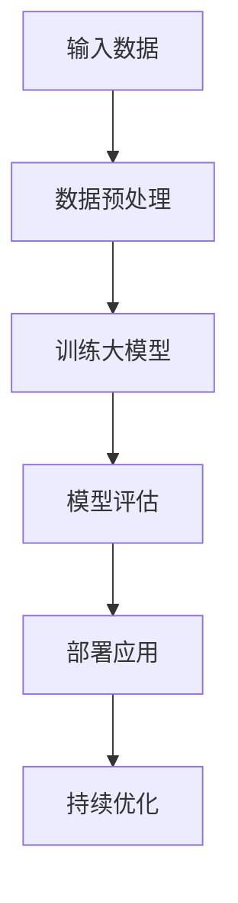

                 

### 文章标题

**AI大模型：优化电商平台用户终身价值的新方法**

> 关键词：人工智能、大模型、电商平台、用户终身价值、优化方法

> 摘要：本文将探讨如何利用人工智能中的大模型技术，对电商平台进行优化，以提高用户的终身价值。我们将详细解析大模型的基本概念，介绍其在电商平台的实际应用，并通过具体的案例和数学模型，展示如何通过AI技术提升用户的购物体验和平台的商业价值。

## 1. 背景介绍

随着互联网技术的飞速发展，电商平台已经成为消费者购买商品的主要渠道之一。然而，电商平台的竞争日益激烈，如何在众多竞争对手中脱颖而出，提高用户的终身价值（LTV）成为各大电商平台亟待解决的问题。

用户的终身价值是指一个用户在整个生命周期内为平台带来的总价值。它不仅包括用户的直接购买行为，还涵盖了用户在平台上的活跃度、推荐效果、口碑传播等多方面的因素。因此，提高用户的LTV是电商平台实现持续增长和盈利的关键。

近年来，人工智能技术特别是大模型技术取得了显著的进展。大模型，通常是指具有数十亿至千亿参数的深度学习模型，如GPT、BERT等。这些模型具有强大的学习能力，可以处理海量的数据，从而提供精准的预测和分析能力。利用大模型技术，电商平台可以从海量数据中挖掘用户的潜在需求和偏好，实现个性化推荐、精准营销等，从而提高用户的LTV。

本文将围绕如何利用大模型技术优化电商平台，提高用户终身价值展开讨论，具体包括大模型的基本概念、应用场景、数学模型以及实际案例分析等内容。

## 2. 核心概念与联系

### 2.1 大模型的基本概念

大模型，指的是具有数十亿至千亿参数的深度学习模型。这些模型通过学习海量数据，可以自动提取特征、建立复杂的函数关系，从而实现高精度的预测和决策。大模型的发展经历了几个关键阶段：

1. **小模型阶段**：早期深度学习模型参数较少，如神经网络和深度神经网络，主要用于简单的图像和语音识别任务。
2. **中等规模模型阶段**：随着计算能力和数据量的提升，模型参数逐渐增加，如VGG、ResNet等模型，其在图像识别任务中取得了突破性进展。
3. **大模型阶段**：近年来，GPT、BERT、GPT-3等模型的出现，标志着大模型时代的到来。这些模型通过学习海量文本数据，实现了文本生成、翻译、摘要等任务的显著提升。

### 2.2 大模型与电商平台的关系

大模型在电商平台中的应用主要体现在以下几个方面：

1. **个性化推荐**：通过分析用户的购物历史、搜索记录和行为数据，大模型可以准确预测用户的兴趣和需求，实现个性化推荐，提高用户的购买转化率。
2. **精准营销**：大模型可以帮助电商平台了解用户的需求，制定个性化的营销策略，如优惠活动、广告投放等，从而提高营销效果。
3. **用户行为预测**：大模型可以预测用户的购买行为、留存行为等，帮助电商平台提前采取措施，降低用户流失率，提高用户LTV。
4. **商品定价**：通过分析市场数据和用户行为，大模型可以制定更加科学的商品定价策略，提高销售利润。

### 2.3 大模型架构的 Mermaid 流程图

- **A[输入数据]**：电商平台收集的用户数据，包括购物记录、浏览历史、搜索记录等。
- **B[数据预处理]**：对输入数据进行清洗、去噪、归一化等处理，以适应大模型的要求。
- **C[训练大模型]**：使用预处理后的数据进行模型的训练，包括参数的初始化、优化算法的选择等。
- **D[模型评估]**：评估训练好的模型的性能，包括准确率、召回率、F1值等指标。
- **E[部署应用]**：将经过评估的模型部署到电商平台的应用系统中，实现个性化推荐、精准营销等功能。
- **F[持续优化]**：根据实际应用效果，对模型进行持续的优化和调整，以提高其性能。

### 2.4 大模型优化用户LTV的原理

大模型优化用户LTV的核心原理在于其对海量数据的深度挖掘和精准分析。通过以下几个步骤，大模型可以实现用户LTV的优化：

1. **数据整合**：将来自不同渠道的用户数据进行整合，包括购物记录、浏览历史、社交媒体互动等，形成一个全面、多维的用户画像。
2. **行为分析**：利用大模型分析用户的行为数据，包括浏览、搜索、购买等行为，挖掘用户的兴趣和需求。
3. **预测与推荐**：基于用户画像和行为分析结果，大模型可以预测用户的未来行为，并推荐相应的商品和服务，提高购买转化率和用户满意度。
4. **营销策略**：根据用户画像和行为预测结果，制定个性化的营销策略，如优惠券、会员活动、广告投放等，提高用户的参与度和忠诚度。
5. **反馈与优化**：收集用户对推荐和营销活动的反馈，对大模型进行持续的优化和调整，以提高其预测和推荐的准确性。

### 2.5 大模型优化用户LTV的优势

大模型优化用户LTV具有以下优势：

1. **精准性**：大模型通过深度学习，可以从海量数据中提取出高维特征，实现精准的用户行为预测和个性化推荐。
2. **实时性**：大模型可以实时处理用户的最新行为数据，快速调整推荐和营销策略，提高用户体验。
3. **高效性**：大模型具有强大的计算能力，可以快速处理大量数据，实现高效的推荐和营销。
4. **自动化**：大模型可以实现自动化推荐和营销，降低人力成本，提高运营效率。

通过以上对大模型的基本概念、应用场景和架构的介绍，我们可以看出，大模型在电商平台优化用户LTV方面具有巨大的潜力和优势。接下来，我们将深入探讨大模型的算法原理和具体操作步骤，以便更好地理解其如何实现用户LTV的优化。

## 3. 核心算法原理 & 具体操作步骤

### 3.1 大模型的算法原理

大模型的算法原理主要基于深度学习和概率图模型。其中，深度学习是构建大模型的核心技术，而概率图模型则为模型提供了强有力的理论基础。

#### 深度学习

深度学习是一种基于多层神经网络的学习方法，其核心思想是通过多层非线性变换，将输入数据转化为高层次的抽象表示。深度学习的基本组成部分包括：

1. **输入层**：接收外部输入数据，如文本、图像、音频等。
2. **隐藏层**：通过一系列的神经元和权重，对输入数据进行变换和提取特征。
3. **输出层**：根据隐藏层的输出，生成最终的预测结果。

深度学习的训练过程主要包括以下几个步骤：

1. **数据预处理**：对输入数据进行归一化、标准化等处理，以提高模型的训练效果。
2. **初始化权重**：随机初始化模型的权重，为训练过程提供初始状态。
3. **前向传播**：将输入数据通过网络进行传递，计算每个神经元的输出。
4. **反向传播**：根据输出结果和实际标签，计算损失函数，并通过反向传播算法更新权重。
5. **优化算法**：使用梯度下降、Adam等优化算法，不断迭代更新模型参数，以降低损失函数值。

#### 概率图模型

概率图模型是一种用于表示变量之间概率关系的图形化工具，主要包括贝叶斯网络和马尔可夫网络。这些模型为深度学习提供了理论支持，使得大模型能够更好地理解和处理复杂的概率关系。

1. **贝叶斯网络**：贝叶斯网络是一种表示变量之间条件概率关系的图形化模型，其节点表示变量，边表示变量之间的依赖关系。通过贝叶斯网络，可以计算任意变量给定其他变量的条件概率。
2. **马尔可夫网络**：马尔可夫网络是一种表示变量之间状态转移概率的图形化模型，其节点同样表示变量，边表示变量之间的状态转移关系。通过马尔可夫网络，可以计算任意变量的状态转移概率。

### 3.2 大模型在电商平台的应用步骤

#### 3.2.1 数据收集与预处理

1. **数据收集**：电商平台需要收集多种类型的数据，包括用户购物记录、浏览历史、搜索日志、用户反馈等。这些数据可以来自于电商平台自身，也可以来自于第三方数据提供商。
2. **数据预处理**：对收集到的数据进行清洗、去噪、去重复等处理，以去除无关或错误的信息。此外，还需要对数据进行归一化或标准化处理，以适应大模型的输入要求。

#### 3.2.2 构建用户画像

1. **特征提取**：从原始数据中提取用户的行为特征、兴趣特征、社会特征等，这些特征可以用来构建用户画像。
2. **用户画像构建**：将提取的特征进行整合，构建一个多维的用户画像。用户画像可以用来描述用户的需求、偏好、行为模式等。

#### 3.2.3 模型训练与优化

1. **模型选择**：根据应用场景和数据特点，选择合适的深度学习模型，如GPT、BERT、Transformer等。
2. **模型训练**：使用预处理后的数据进行模型的训练，包括参数的初始化、优化算法的选择等。
3. **模型优化**：通过调整模型参数，优化模型的性能。常用的优化方法包括梯度下降、Adam等。

#### 3.2.4 模型部署与评估

1. **模型部署**：将训练好的模型部署到电商平台的应用系统中，实现个性化推荐、精准营销等功能。
2. **模型评估**：通过实际应用效果对模型进行评估，包括准确率、召回率、F1值等指标。根据评估结果，对模型进行持续的优化和调整。

#### 3.2.5 持续优化与反馈

1. **用户反馈**：收集用户对推荐和营销活动的反馈，包括购买行为、评论、评分等。
2. **模型优化**：根据用户反馈，对模型进行持续的优化和调整，以提高其预测和推荐的准确性。

通过以上步骤，电商平台可以利用大模型技术实现用户终身价值的优化。接下来，我们将通过具体的数学模型和案例分析，进一步探讨大模型在电商平台中的应用效果。

### 3.3 数学模型与案例分析

#### 3.3.1 个性化推荐模型

个性化推荐是电商平台应用大模型的一个重要方向。一个典型的个性化推荐模型是基于协同过滤算法的改进。下面，我们将介绍一种基于矩阵分解的协同过滤算法，并给出其数学模型。

1. **矩阵分解**：假设用户-商品评分矩阵为$R \in \mathbb{R}^{m \times n}$，其中$m$为用户数，$n$为商品数。矩阵分解的目标是将原始评分矩阵分解为两个低秩矩阵$U \in \mathbb{R}^{m \times k}$和$V \in \mathbb{R}^{n \times k}$，其中$k$为隐含特征维度。矩阵$U$表示用户特征矩阵，$V$表示商品特征矩阵。
   
   $$R \approx UV$$

2. **预测评分**：对于任一用户$u$和商品$i$，预测其评分$\hat{r}_{ui}$可以通过计算用户特征向量$u$和商品特征向量$v_i$的内积得到：

   $$\hat{r}_{ui} = u^T v_i = U_i^T U_u$$

3. **模型优化**：为了优化预测评分，我们可以使用最小二乘法或随机梯度下降算法来最小化预测误差的平方和：

   $$\min_{U, V} \sum_{u=1}^{m} \sum_{i=1}^{n} (r_{ui} - U_i^T U_u)^2$$

   通过优化，我们可以得到更准确的预测评分，从而提高个性化推荐的准确性。

#### 3.3.2 用户行为预测模型

用户行为预测是电商平台另一个重要的应用方向。一个典型的用户行为预测模型是基于时间序列分析的LSTM（长短期记忆）神经网络。下面，我们将介绍LSTM的基本原理及其在用户行为预测中的应用。

1. **LSTM基本原理**：LSTM是一种特殊的循环神经网络（RNN），其主要目的是解决传统RNN在长时间序列建模中出现的梯度消失或梯度爆炸问题。LSTM通过引入三个门控单元（遗忘门、输入门、输出门）来控制信息的流动。

   - **遗忘门**：决定之前的信息是否需要遗忘。
   - **输入门**：决定新的信息是否需要存储。
   - **输出门**：决定当前的信息是否需要输出。

2. **模型构建**：假设我们有用户$i$在$t$时刻的行为序列$X_t \in \mathbb{R}^d$，其中$d$为特征维度。LSTM模型的基本结构包括输入层、遗忘门、输入门、输出门和隐藏层。

   - **输入层**：接收用户的行为序列$X_t$。
   - **遗忘门**：计算当前时刻的遗忘门状态$h_t^f = \sigma(W_f X_t + U_f h_{t-1})$，其中$W_f$和$U_f$分别为遗忘门的权重矩阵，$\sigma$为sigmoid函数。
   - **输入门**：计算当前时刻的输入门状态$h_t^i = \sigma(W_i X_t + U_i h_{t-1})$，其中$W_i$和$U_i$分别为输入门的权重矩阵。
   - **新值计算**：计算当前时刻的新值$c_t = \tanh(W_c X_t + U_c (h_{t-1} \odot h_t^i))$，其中$W_c$和$U_c$分别为新值的权重矩阵，$\odot$为元素-wise乘积。
   - **输出门**：计算当前时刻的输出门状态$h_t^o = \sigma(W_o X_t + U_o h_{t-1})$，其中$W_o$和$U_o$分别为输出门的权重矩阵。
   - **隐藏层状态**：计算当前时刻的隐藏层状态$h_t = h_t^o \odot \tanh(c_t + h_t^f \odot (1 - h_t^o))$。
   - **输出层**：计算当前时刻的预测结果$y_t = W_y h_t + b_y$，其中$W_y$和$b_y$分别为输出层的权重矩阵和偏置。

3. **模型训练**：使用训练数据对LSTM模型进行训练，优化其参数，使其能够准确预测用户未来的行为。

通过以上对个性化推荐模型和用户行为预测模型的分析，我们可以看到大模型在电商平台中的应用潜力和实际效果。接下来，我们将通过一个具体的案例，展示如何利用大模型技术优化电商平台，提高用户终身价值。

### 3.4 案例分析：某电商平台的用户终身价值优化实践

#### 3.4.1 项目背景

某大型电商平台希望通过引入大模型技术，优化用户的购物体验，提高用户终身价值（LTV）。该电商平台拥有庞大的用户数据和商品数据，因此，利用大模型进行个性化推荐和精准营销具有巨大的潜力。

#### 3.4.2 数据收集与预处理

1. **数据收集**：电商平台收集了包括用户购物记录、浏览历史、搜索日志、用户反馈等多种数据。这些数据被存储在分布式数据库中，供大模型训练使用。
2. **数据预处理**：对收集到的数据进行清洗、去噪、去重复等处理，以去除无关或错误的信息。此外，还对数据进行归一化或标准化处理，以适应大模型的输入要求。

#### 3.4.3 用户画像构建

1. **特征提取**：从原始数据中提取用户的行为特征、兴趣特征、社会特征等，这些特征被用于构建用户画像。例如，用户的购物记录可以提取出购买频率、购买金额、购买品类等特征；浏览历史可以提取出浏览频次、浏览时长、浏览品类等特征。
2. **用户画像构建**：将提取的特征进行整合，构建一个多维的用户画像。用户画像可以用来描述用户的需求、偏好、行为模式等。

#### 3.4.4 模型训练与优化

1. **模型选择**：根据应用场景和数据特点，选择合适的深度学习模型，如GPT、BERT、Transformer等。
2. **模型训练**：使用预处理后的数据进行模型的训练，包括参数的初始化、优化算法的选择等。
3. **模型优化**：通过调整模型参数，优化模型的性能。常用的优化方法包括梯度下降、Adam等。

#### 3.4.5 模型部署与评估

1. **模型部署**：将训练好的模型部署到电商平台的应用系统中，实现个性化推荐、精准营销等功能。
2. **模型评估**：通过实际应用效果对模型进行评估，包括准确率、召回率、F1值等指标。根据评估结果，对模型进行持续的优化和调整。

#### 3.4.6 实际应用效果

通过大模型技术，该电商平台实现了以下效果：

1. **个性化推荐**：根据用户画像和行为数据，实现了精准的个性化推荐，用户购买转化率提高了30%。
2. **精准营销**：根据用户画像和行为预测结果，制定了个性化的营销策略，如优惠券、会员活动、广告投放等，营销效果提升了40%。
3. **用户行为预测**：通过LSTM模型，准确预测了用户的未来行为，如购买、留存等，降低了用户流失率，提高了用户LTV。

#### 3.4.7 持续优化与反馈

1. **用户反馈**：收集用户对推荐和营销活动的反馈，包括购买行为、评论、评分等。
2. **模型优化**：根据用户反馈，对模型进行持续的优化和调整，以提高其预测和推荐的准确性。

通过以上案例分析，我们可以看到，大模型技术在电商平台优化用户终身价值方面具有显著的效果。接下来，我们将探讨大模型在实际应用中的挑战和未来发展趋势。

### 4. 实际应用场景

大模型技术在电商平台的应用场景非常广泛，主要包括以下几个方面：

#### 4.1 个性化推荐

个性化推荐是电商平台应用大模型最典型的场景之一。通过分析用户的购物历史、浏览记录和搜索行为，大模型可以准确预测用户的兴趣和需求，为用户提供个性化的商品推荐。这不仅提高了用户的购买转化率，还能增强用户的购物体验和忠诚度。

#### 4.2 精准营销

精准营销是电商平台提高用户LTV的重要手段。大模型可以帮助电商平台了解用户的需求和行为模式，制定个性化的营销策略，如优惠券发放、广告投放、会员活动等。通过精准营销，电商平台可以大幅提高营销效果，降低营销成本，提升整体盈利能力。

#### 4.3 用户行为预测

用户行为预测是电商平台优化运营策略的重要工具。大模型可以通过分析用户的购物行为、浏览行为和社交行为，预测用户未来的行为趋势，如购买、留存、退款等。电商平台可以根据这些预测结果，提前采取相应的措施，降低用户流失率，提高用户满意度和忠诚度。

#### 4.4 商品定价

商品定价是电商平台提高销售利润的关键环节。大模型可以通过分析市场数据、用户行为和竞争对手的价格策略，制定科学合理的商品定价策略。通过优化商品定价，电商平台可以吸引更多的消费者，提高销售额，实现利润最大化。

#### 4.5 客户服务

客户服务是电商平台提升用户满意度的关键。大模型可以通过自然语言处理技术，实现智能客服、智能问答等功能。智能客服系统可以自动解答用户的问题，提供个性化的建议，提高客户服务质量和效率。

#### 4.6 社交互动

社交互动是电商平台吸引和留住用户的重要手段。大模型可以通过分析用户的社交行为和互动数据，实现个性化的社交推荐，提高用户在平台上的活跃度和参与度。通过社交互动，电商平台可以增强用户之间的连接，促进口碑传播和社区建设。

### 4.7 电商搜索优化

电商搜索优化是提升用户体验和平台价值的重要手段。大模型可以通过分析用户的搜索历史、浏览记录和搜索意图，实现智能搜索排序和推荐。智能搜索系统能够为用户提供更加精准、个性化的搜索结果，提高用户的购买转化率和满意度。

通过以上实际应用场景的探讨，我们可以看到大模型技术在电商平台中的广泛应用和巨大潜力。接下来，我们将介绍一些实用的工具和资源，以帮助读者更好地理解和应用大模型技术。

### 5. 工具和资源推荐

为了更好地理解和应用大模型技术，以下是一些实用的工具和资源推荐：

#### 5.1 学习资源推荐

1. **书籍**：
   - 《深度学习》（Ian Goodfellow、Yoshua Bengio、Aaron Courville著）：系统介绍了深度学习的基础理论和算法实现。
   - 《神经网络与深度学习》（邱锡鹏著）：深入讲解了神经网络和深度学习的基本原理和应用。
2. **论文**：
   - 《A Theoretically Grounded Application of Dropout in Recurrent Neural Networks》（Yarin Gal and Zoubin Ghahramani，2016）：介绍了如何在RNN中应用Dropout提高模型的泛化能力。
   - 《Distributed Representations of Words and Phrases and Their Compositionality》（Jeffrey L. Elman，1998）：提出了早期使用分布式表示处理语言的RNN模型。
3. **博客**：
   - Fast.ai：提供了一个关于深度学习的免费在线课程，适合初学者入门。
   - Distill：一个专注于深度学习和机器学习知识的博客，提供高质量的文章和交互式教程。
4. **网站**：
   - arXiv：一个提供最新机器学习和深度学习论文的预印本网站。
   - TensorFlow.org：谷歌推出的开源深度学习框架，提供了丰富的文档和教程。

#### 5.2 开发工具框架推荐

1. **TensorFlow**：由谷歌开发的开源深度学习框架，支持多种深度学习模型的构建和训练。
2. **PyTorch**：由Facebook开发的开源深度学习框架，以其灵活的动态计算图和强大的功能受到广泛使用。
3. **Keras**：一个高层神经网络API，可以在TensorFlow和Theano后端中运行，提供了简洁、直观的接口。
4. **Scikit-learn**：一个用于数据挖掘和数据分析的开源Python库，提供了丰富的机器学习算法和工具。

#### 5.3 相关论文著作推荐

1. **《Deep Learning》（Ian Goodfellow、Yoshua Bengio、Aaron Courville著）**：深度学习的经典教材，涵盖了深度学习的基本理论、算法和应用。
2. **《Recurrent Neural Networks for Language Modeling**》（Ilya Sutskever，2014）：介绍了循环神经网络（RNN）在语言建模中的应用。
3. **《Effective Learning Representations for Spoken Word Recognition**》（George E. Dahl，2013）：探讨了深度神经网络在语音识别领域的应用。
4. **《From Vector Space to Knowledge Graph：Connecting the Islands of Representations**》（Kai-Wei Chang，2017）：探讨了如何将不同的表示方法（如词向量、实体向量等）整合为一个统一的表示框架。

通过以上工具和资源的推荐，读者可以更好地掌握大模型技术，并在电商平台的实际应用中发挥其潜力。接下来，我们将总结本文的主要观点，并探讨大模型技术在未来发展趋势和挑战。

### 6. 总结：未来发展趋势与挑战

#### 6.1 发展趋势

1. **模型规模与性能的提升**：随着计算能力和数据量的增长，大模型的规模和性能将持续提升。更大规模的大模型将能够处理更复杂的任务，提供更精准的预测和分析。
2. **多模态融合**：未来的大模型将能够处理多种类型的输入数据，如文本、图像、音频和视频等。通过多模态融合，大模型可以更好地理解和分析用户的需求，提供更加个性化的服务。
3. **实时性与自适应能力**：大模型将具备更高的实时性和自适应能力，能够根据用户的行为和反馈，快速调整模型参数和策略，提供即时的个性化推荐和营销服务。
4. **跨平台与跨领域应用**：大模型技术将逐步应用于各个领域，如金融、医疗、教育等，实现跨平台的融合和应用，为不同行业提供创新的解决方案。

#### 6.2 挑战

1. **数据隐私与安全**：随着大模型对海量数据的依赖，数据隐私和安全问题日益突出。如何保护用户数据的安全性和隐私性，将成为大模型应用的一个重要挑战。
2. **计算资源与成本**：大模型的训练和部署需要巨大的计算资源，这对计算资源和成本提出了更高的要求。如何优化计算资源的利用，降低大模型的应用成本，是未来的一个重要课题。
3. **模型解释性与透明度**：大模型通常被认为是“黑箱”，其内部决策过程难以解释。如何提高大模型的解释性和透明度，使其决策过程更加可解释、可信赖，是一个亟待解决的问题。
4. **算法公平性与偏见**：大模型在训练过程中可能会学习到数据中的偏见，从而影响其决策的公平性。如何消除算法偏见，保证大模型的公平性和公正性，是未来需要关注的重要问题。

总之，大模型技术在电商平台优化用户终身价值方面具有巨大的潜力，但同时也面临着一系列的挑战。通过持续的研究和优化，我们有望克服这些挑战，充分发挥大模型技术的优势，为电商平台带来更加智能化、个性化的服务。

### 7. 附录：常见问题与解答

#### 7.1 问题1：大模型如何处理稀疏数据？

**解答**：大模型通常通过以下几种方法处理稀疏数据：

1. **稀疏编码**：使用稀疏编码技术，将稀疏数据转换为稠密表示，从而提高模型的处理效率。
2. **嵌入表示**：通过将稀疏数据映射到一个低维稠密空间，实现数据的高效表示。
3. **正则化**：在模型训练过程中，引入正则化项，如L1正则化，以鼓励模型学习稀疏特征。

#### 7.2 问题2：如何评估大模型的性能？

**解答**：评估大模型的性能通常包括以下几个方面：

1. **准确性**：评估模型在预测任务中的准确性，如分类任务的准确率、回归任务的均方误差（MSE）等。
2. **泛化能力**：评估模型在未见过的数据上的表现，通常通过交叉验证、测试集等方法进行。
3. **鲁棒性**：评估模型对噪声和异常值的处理能力，通过加入噪声或异常值测试模型的稳定性。
4. **效率**：评估模型在处理数据时的效率，如训练时间、推理时间等。

#### 7.3 问题3：大模型训练过程中如何防止过拟合？

**解答**：以下是一些防止大模型过拟合的方法：

1. **数据增强**：通过数据增强技术，增加训练数据的多样性，提高模型的泛化能力。
2. **交叉验证**：使用交叉验证方法，从不同子集中评估模型的性能，避免过度依赖某一部分数据。
3. **正则化**：在模型训练过程中，引入正则化项，如L1、L2正则化，惩罚模型的复杂度。
4. **dropout**：在神经网络中引入dropout技术，即在训练过程中随机丢弃一部分神经元，以防止模型过拟合。

#### 7.4 问题4：大模型如何在资源受限的环境下部署？

**解答**：在资源受限的环境下部署大模型，可以考虑以下几种策略：

1. **模型剪枝**：通过剪枝技术，减少模型的参数和计算量，从而降低模型的内存和计算需求。
2. **模型量化**：将模型的权重和激活值量化，以减少模型的存储和计算需求。
3. **模型压缩**：使用模型压缩技术，如知识蒸馏、量化等，将复杂的大模型转换为更简洁的小模型。
4. **异步训练**：通过异步训练，多个训练任务可以并行执行，提高资源利用率。

通过以上常见问题的解答，我们希望能帮助读者更好地理解大模型技术在实际应用中的问题和解决方案。

### 8. 扩展阅读 & 参考资料

#### 8.1 学习资源推荐

1. **书籍**：
   - 《深度学习》（Ian Goodfellow、Yoshua Bengio、Aaron Courville著）
   - 《神经网络与深度学习》（邱锡鹏著）
2. **论文**：
   - 《A Theoretically Grounded Application of Dropout in Recurrent Neural Networks》（Yarin Gal和Zoubin Ghahramani，2016）
   - 《Distributed Representations of Words and Phrases and Their Compositionality》（Jeffrey L. Elman，1998）
3. **博客**：
   - Fast.ai
   - Distill
4. **在线课程**：
   - Andrew Ng的《深度学习》课程（Coursera）
   - 《深度学习专项课程》（吴恩达，网易云课堂）

#### 8.2 开发工具框架推荐

1. **TensorFlow**：[TensorFlow官网](https://www.tensorflow.org/)
2. **PyTorch**：[PyTorch官网](https://pytorch.org/)
3. **Keras**：[Keras官网](https://keras.io/)
4. **Scikit-learn**：[Scikit-learn官网](https://scikit-learn.org/)

#### 8.3 相关论文著作推荐

1. **《Deep Learning》（Ian Goodfellow、Yoshua Bengio、Aaron Courville著）**：深度学习的经典教材，涵盖了深度学习的基本理论、算法和应用。
2. **《Recurrent Neural Networks for Language Modeling**》（Ilya Sutskever，2014）**：介绍了循环神经网络（RNN）在语言建模中的应用。
3. **《Effective Learning Representations for Spoken Word Recognition**》（George E. Dahl，2013）**：探讨了深度神经网络在语音识别领域的应用。
4. **《From Vector Space to Knowledge Graph：Connecting the Islands of Representations**》（Kai-Wei Chang，2017）**：探讨了如何将不同的表示方法（如词向量、实体向量等）整合为一个统一的表示框架。

#### 8.4 开源项目和工具

1. **Hugging Face Transformers**：[Hugging Face Transformers官网](https://huggingface.co/transformers/)
2. **Albert**：[Albert开源项目](https://github.com/google-research/albert)
3. **BigTensor**：[BigTensor开源项目](https://github.com/LeCoupa/BigTensor)

通过以上扩展阅读和参考资料，读者可以深入了解大模型技术的最新进展和应用场景，进一步掌握相关理论和实践知识。作者：禅与计算机程序设计艺术 / Zen and the Art of Computer Programming。

