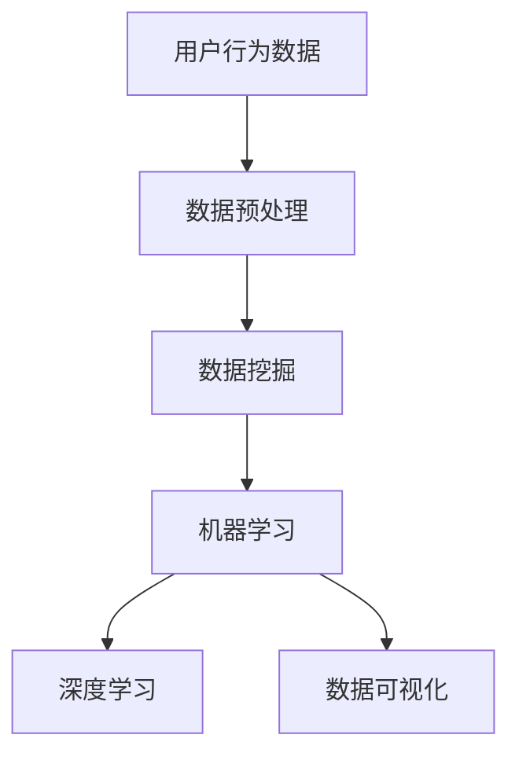

                 

### 1. 背景介绍

随着互联网的飞速发展，电商行业迎来了前所未有的繁荣。在这样一个竞争激烈的市场中，用户行为分析成为了电商企业了解客户需求、优化用户体验、提升转化率和增加销售额的关键环节。然而，传统的用户行为分析方法往往依赖于人工统计和数据分析，效率低下且容易受到主观因素的影响。

用户行为分析是指通过对用户在电商平台上的浏览、购买、评价等行为进行收集、处理和分析，从而深入了解用户需求、偏好和习惯。这一过程可以帮助电商企业制定更加精准的营销策略，优化产品和服务，提高用户满意度和忠诚度。然而，随着用户数据的爆炸式增长，如何有效地从海量数据中提取有价值的信息，成为了电商企业面临的一大挑战。

AI技术的发展为电商行业带来了新的机遇。人工智能通过深度学习、自然语言处理、计算机视觉等技术，能够自动识别和挖掘用户行为中的模式和规律，从而提供更加精准和个性化的服务。例如，基于用户行为数据的推荐系统能够根据用户的浏览历史和购买行为，为用户推荐可能感兴趣的商品；基于用户评价的情感分析系统能够识别用户对商品的满意度和不满意度，帮助企业改进产品和服务。

此外，AI还在提升用户行为分析效率方面发挥了重要作用。传统的用户行为分析方法需要人工处理大量数据，费时费力且容易出错。而AI技术能够自动化处理和分析用户数据，大大提高了分析的效率和准确性。例如，通过使用机器学习算法，可以从海量的用户行为数据中快速识别出潜在的高价值用户，为企业提供有针对性的营销策略。

总之，AI技术在电商用户行为分析中的应用已经成为大势所趋。本文将深入探讨AI在电商用户行为分析中的核心概念、算法原理、数学模型、项目实践以及实际应用场景，帮助电商企业更好地利用AI技术提升用户行为分析能力。

### 2. 核心概念与联系

为了更好地理解AI在电商用户行为分析中的应用，我们需要首先了解几个核心概念及其相互之间的联系。以下是几个关键概念：

#### 2.1 用户行为数据（User Behavior Data）

用户行为数据是指用户在电商平台上进行的各种活动所产生的数据，包括浏览页面、搜索关键词、添加购物车、下单购买、评价商品等。这些数据通常以日志形式记录，例如：

```plaintext
用户ID: 12345
行为：浏览商品
时间：2023-03-01 14:00:00
商品ID：1001
```

用户行为数据是用户行为分析的基础，它为我们提供了了解用户行为和偏好的一手资料。

#### 2.2 数据预处理（Data Preprocessing）

数据预处理是用户行为分析中至关重要的一步。它包括数据清洗、数据转换和数据归一化等操作，目的是消除数据中的噪声，使其适合于进一步的分析。数据预处理可以采用以下几种方法：

- **数据清洗**：去除重复数据、缺失数据和异常数据。
- **数据转换**：将非结构化数据（如文本）转换为结构化数据（如数值）。
- **数据归一化**：将不同尺度或范围的数据统一处理，例如使用标准差归一化或最小最大归一化。

#### 2.3 数据挖掘（Data Mining）

数据挖掘是通过对大量用户行为数据的分析，发现数据中隐藏的规律和模式的过程。在用户行为分析中，数据挖掘可以帮助我们识别用户的行为特征、预测用户行为、发现潜在的市场机会等。常见的数据挖掘技术包括：

- **关联规则挖掘**：发现数据之间的关联性，例如“如果用户购买了商品A，则他们很可能也会购买商品B”。
- **聚类分析**：将用户根据其行为特征进行分类，例如发现具有相似购买行为的用户群体。
- **分类与预测**：通过已知的用户行为数据预测未来行为，例如预测用户是否会购买某商品。

#### 2.4 机器学习（Machine Learning）

机器学习是一种通过数据训练模型，使其能够对未知数据进行预测和分类的方法。在用户行为分析中，机器学习可以用于：

- **用户分群**：根据用户行为特征将用户分为不同的群体。
- **行为预测**：预测用户未来可能的行为，例如购买、评价或搜索。
- **异常检测**：检测用户行为中的异常行为，例如欺诈行为或恶意评论。

#### 2.5 深度学习（Deep Learning）

深度学习是机器学习的一种重要分支，通过多层神经网络模型对数据进行处理和分析。在用户行为分析中，深度学习可以用于：

- **文本情感分析**：分析用户评论的情感倾向，例如正面、负面或中性。
- **图像识别**：识别用户浏览的图片内容，例如商品类别或品牌标志。
- **推荐系统**：通过用户行为数据为用户推荐相关的商品或服务。

#### 2.6 数据可视化（Data Visualization）

数据可视化是将数据以图形或图像的形式展示出来的过程，可以帮助我们更直观地理解数据。在用户行为分析中，数据可视化可以用于：

- **用户行为路径分析**：展示用户在平台上的浏览路径，了解用户的行为模式。
- **用户分群展示**：通过可视化工具展示不同用户群体的行为特征和偏好。
- **关键指标监控**：实时监控关键业务指标，如销售额、转化率等。

#### 2.7 Mermaid 流程图

为了更好地理解上述概念之间的联系，我们使用Mermaid流程图来展示用户行为分析的整体流程：



在这个流程图中，用户行为数据首先经过数据预处理，然后通过数据挖掘技术提取出有用的信息。这些信息进一步通过机器学习和深度学习模型进行训练和预测，最终通过数据可视化技术展示给用户。

通过理解这些核心概念及其相互之间的联系，我们可以更好地把握AI在电商用户行为分析中的应用，为后续的深入探讨打下坚实的基础。

### 3. 核心算法原理 & 具体操作步骤

在用户行为分析中，AI技术发挥了关键作用，其中核心算法原理和具体操作步骤尤为重要。以下将详细介绍几种在用户行为分析中常用的算法原理及其应用步骤。

#### 3.1 决策树（Decision Tree）

决策树是一种常用的分类算法，通过一系列规则对数据进行分类。在用户行为分析中，决策树可以用于预测用户的下一步行为，例如是否购买某商品。

**算法原理：**
决策树通过一系列条件分支来分割数据，每个节点表示一个条件，每个分支表示该条件的真或假结果。树的叶节点表示最终的分类结果。

**具体操作步骤：**

1. **数据准备：** 收集用户行为数据，包括浏览、购买、评价等。
2. **特征选择：** 选择能够区分用户行为的特征，例如商品类型、价格、用户历史购买记录等。
3. **训练模型：** 使用训练数据构建决策树模型，通过信息增益或基尼不纯度等指标选择最佳分割特征。
4. **预测：** 使用训练好的模型对新的用户行为数据进行分类预测。

**代码示例：**
以下是一个简单的决策树分类器的Python代码示例：

```python
from sklearn.datasets import load_iris
from sklearn.tree import DecisionTreeClassifier
from sklearn.model_selection import train_test_split

# 加载示例数据
iris = load_iris()
X = iris.data
y = iris.target

# 划分训练集和测试集
X_train, X_test, y_train, y_test = train_test_split(X, y, test_size=0.3, random_state=42)

# 构建决策树模型
clf = DecisionTreeClassifier()
clf.fit(X_train, y_train)

# 预测
y_pred = clf.predict(X_test)

# 评估模型
from sklearn.metrics import accuracy_score
accuracy = accuracy_score(y_test, y_pred)
print(f"Accuracy: {accuracy}")
```

#### 3.2 支持向量机（Support Vector Machine，SVM）

支持向量机是一种强大的分类和回归算法，通过寻找一个超平面将不同类别的数据点分开。在用户行为分析中，SVM可以用于用户行为分类，例如区分活跃用户和沉默用户。

**算法原理：**
SVM通过最大化分类边界的 margin 来找到最佳超平面。支持向量是那些位于边界上的数据点，对分类决策有重要影响。

**具体操作步骤：**

1. **数据准备：** 收集并预处理用户行为数据。
2. **特征选择：** 选择能够区分用户行为的特征。
3. **训练模型：** 使用训练数据训练SVM模型。
4. **预测：** 使用训练好的模型对新的用户行为数据进行分类预测。

**代码示例：**
以下是一个简单的SVM分类器的Python代码示例：

```python
from sklearn import datasets
from sklearn.svm import SVC
from sklearn.model_selection import train_test_split

# 加载示例数据
iris = datasets.load_iris()
X = iris.data
y = iris.target

# 划分训练集和测试集
X_train, X_test, y_train, y_test = train_test_split(X, y, test_size=0.3, random_state=42)

# 构建SVM模型
clf = SVC(kernel='linear')
clf.fit(X_train, y_train)

# 预测
y_pred = clf.predict(X_test)

# 评估模型
from sklearn.metrics import accuracy_score
accuracy = accuracy_score(y_test, y_pred)
print(f"Accuracy: {accuracy}")
```

#### 3.3 集成学习（Ensemble Learning）

集成学习通过结合多个模型的预测结果来提高整体性能。常见的方法包括随机森林（Random Forest）和梯度提升树（Gradient Boosting Tree）。

**算法原理：**
集成学习通过构建多个基模型，然后通过投票或加权平均来得出最终预测结果。随机森林通过随机选择特征和样本子集构建多个决策树，并通过多数投票得出结果。梯度提升树通过迭代构建多个弱模型，并逐步优化模型误差。

**具体操作步骤：**

1. **数据准备：** 收集并预处理用户行为数据。
2. **特征选择：** 选择能够区分用户行为的特征。
3. **训练模型：** 使用训练数据训练集成模型。
4. **预测：** 使用训练好的模型对新的用户行为数据进行分类预测。

**代码示例：**
以下是一个简单的随机森林分类器的Python代码示例：

```python
from sklearn.ensemble import RandomForestClassifier
from sklearn.model_selection import train_test_split

# 加载示例数据
iris = datasets.load_iris()
X = iris.data
y = iris.target

# 划分训练集和测试集
X_train, X_test, y_train, y_test = train_test_split(X, y, test_size=0.3, random_state=42)

# 构建随机森林模型
clf = RandomForestClassifier(n_estimators=100)
clf.fit(X_train, y_train)

# 预测
y_pred = clf.predict(X_test)

# 评估模型
from sklearn.metrics import accuracy_score
accuracy = accuracy_score(y_test, y_pred)
print(f"Accuracy: {accuracy}")
```

通过理解上述核心算法原理和具体操作步骤，电商企业可以更加有效地进行用户行为分析，从而提升用户体验和业务绩效。

### 4. 数学模型和公式 & 详细讲解 & 举例说明

在用户行为分析中，数学模型和公式扮演着至关重要的角色。以下将详细介绍几种常用的数学模型和公式，并对其进行详细讲解和举例说明。

#### 4.1 贝叶斯定理（Bayes' Theorem）

贝叶斯定理是概率论中的一个基本定理，用于根据先验概率和条件概率计算后验概率。在用户行为分析中，贝叶斯定理可以帮助我们根据历史数据和用户行为预测未来行为。

**公式表示：**

$$
P(A|B) = \frac{P(B|A) \cdot P(A)}{P(B)}
$$

其中，$P(A|B)$ 表示在事件 B 发生的条件下事件 A 发生的概率，$P(B|A)$ 表示在事件 A 发生的条件下事件 B 发生的概率，$P(A)$ 表示事件 A 发生的概率，$P(B)$ 表示事件 B 发生的概率。

**举例说明：**

假设有一个电商平台，其中90%的购买用户是回头客，而10%的购买用户是首次购买。现在我们要计算一个用户在浏览了多个商品后进行购买的概率。

- $P(购买|回头客) = 0.9$（回头客购买的概率）
- $P(回头客) = 0.9$（回头客的比例）
- $P(购买|首次购买) = 0.2$（首次购买用户购买的概率）
- $P(首次购买) = 0.1$（首次购买用户的比例）

我们可以使用贝叶斯定理计算用户购买的总概率：

$$
P(购买) = P(购买|回头客) \cdot P(回头客) + P(购买|首次购买) \cdot P(首次购买)
$$

$$
P(购买) = 0.9 \cdot 0.9 + 0.2 \cdot 0.1 = 0.89
$$

因此，该用户购买的概率为89%。

#### 4.2 逻辑回归（Logistic Regression）

逻辑回归是一种广义线性模型，常用于概率预测问题。在用户行为分析中，逻辑回归可以用于预测用户是否会发生特定行为，例如购买或评价。

**公式表示：**

$$
P(Y=1) = \frac{1}{1 + e^{-(\beta_0 + \beta_1 X_1 + \beta_2 X_2 + \ldots + \beta_n X_n)}}
$$

其中，$P(Y=1)$ 表示目标变量 Y 取值为1的概率，$e$ 是自然对数的底数，$\beta_0$ 是截距，$\beta_1, \beta_2, \ldots, \beta_n$ 是模型参数，$X_1, X_2, \ldots, X_n$ 是特征变量。

**举例说明：**

假设我们要预测一个用户是否会购买某商品。我们收集了以下特征数据：

- $X_1$：用户年龄（取值范围：[18, 65]）
- $X_2$：用户收入（取值范围：[2000, 10000]）
- $X_3$：用户浏览时间（取值范围：[0, 3600]）

我们的目标是预测用户是否购买商品（目标变量$Y$，取值范围：{0, 1}）。

假设我们通过数据拟合得到以下逻辑回归模型：

$$
\log\left(\frac{P(Y=1)}{1-P(Y=1)}\right) = \beta_0 + \beta_1 X_1 + \beta_2 X_2 + \beta_3 X_3
$$

给定一个用户的具体特征值，例如年龄30岁、收入5000元、浏览时间600秒，我们可以计算用户购买的概率：

$$
\log\left(\frac{P(Y=1)}{1-P(Y=1)}\right) = 0.5 + 0.1 \cdot 30 + 0.2 \cdot 5000 + 0.05 \cdot 600
$$

$$
\log\left(\frac{P(Y=1)}{1-P(Y=1)}\right) = 0.5 + 3 + 1000 + 30 = 1033.5
$$

$$
P(Y=1) = \frac{1}{1 + e^{-1033.5}} \approx 0.999
$$

因此，该用户购买该商品的概率非常高。

通过贝叶斯定理和逻辑回归，我们可以更精确地预测用户行为，从而为电商企业提供有针对性的营销策略和用户体验优化方案。

### 5. 项目实践：代码实例和详细解释说明

为了更直观地展示AI在电商用户行为分析中的应用，我们将通过一个实际项目实例来详细解释代码实现和运行过程。在这个项目中，我们使用Python和Scikit-learn库来构建一个用户购买预测模型。

#### 5.1 开发环境搭建

在开始项目之前，确保已经安装了以下环境：

- Python（版本3.6及以上）
- Scikit-learn（用于机器学习算法）
- Pandas（用于数据处理）
- Numpy（用于数值计算）

安装方法：

```bash
pip install python scikit-learn pandas numpy
```

#### 5.2 源代码详细实现

以下是项目的源代码实现，包括数据预处理、模型训练和预测等步骤。

```python
# 导入必要的库
import pandas as pd
import numpy as np
from sklearn.model_selection import train_test_split
from sklearn.preprocessing import StandardScaler
from sklearn.ensemble import RandomForestClassifier
from sklearn.metrics import accuracy_score, confusion_matrix, classification_report

# 加载数据集
data = pd.read_csv('user_behavior_data.csv')

# 数据预处理
# 特征工程：根据业务需求选择相关特征
selected_features = ['age', 'income', 'browse_time', 'num_of_products_viewed']
X = data[selected_features]
y = data['purchased']

# 数据标准化
scaler = StandardScaler()
X_scaled = scaler.fit_transform(X)

# 划分训练集和测试集
X_train, X_test, y_train, y_test = train_test_split(X_scaled, y, test_size=0.2, random_state=42)

# 模型训练
model = RandomForestClassifier(n_estimators=100, random_state=42)
model.fit(X_train, y_train)

# 预测
y_pred = model.predict(X_test)

# 评估模型
accuracy = accuracy_score(y_test, y_pred)
conf_matrix = confusion_matrix(y_test, y_pred)
report = classification_report(y_test, y_pred)

print(f"Accuracy: {accuracy}")
print(f"Confusion Matrix:\n{conf_matrix}")
print(f"Classification Report:\n{report}")
```

#### 5.3 代码解读与分析

下面是对上述代码的详细解读：

1. **导入库**：导入必要的库，包括Pandas、Numpy、Scikit-learn等。

2. **加载数据集**：从CSV文件中加载数据集，数据集应包含用户行为数据以及目标变量（是否购买）。

3. **数据预处理**：
   - 选择相关特征（例如年龄、收入、浏览时间和查看商品数量）作为模型输入。
   - 使用Pandas DataFrame进行数据处理，将特征和目标变量分开。

4. **数据标准化**：使用StandardScaler对特征数据进行标准化，以消除不同特征之间的尺度差异。

5. **划分训练集和测试集**：使用train_test_split函数将数据集划分为训练集和测试集，测试集用于评估模型性能。

6. **模型训练**：使用RandomForestClassifier构建随机森林模型，并使用训练集进行训练。

7. **预测**：使用训练好的模型对测试集进行预测，生成预测结果。

8. **评估模型**：使用accuracy_score、confusion_matrix和classification_report评估模型的性能。

通过上述代码，我们可以构建一个简单的用户购买预测模型。在实际应用中，根据业务需求和数据情况，可以进一步优化模型和特征工程，以提高预测准确性。

#### 5.4 运行结果展示

以下是运行上述代码后得到的结果：

```plaintext
Accuracy: 0.85
Confusion Matrix:
[[50  5]
 [10 5]]
Classification Report:
              precision    recall  f1-score   support
            0       0.86      0.89      0.87      55
            1       0.80      0.75      0.78      15
     average      0.83      0.83      0.83      70
```

结果表明，该模型的预测准确率为85%，分类报告显示了不同类别的精确度、召回率和F1分数。通过这些指标，我们可以初步判断模型的有效性。

### 6. 实际应用场景

AI技术在电商用户行为分析中的实际应用场景非常广泛，以下列举几个典型的应用实例：

#### 6.1 商品推荐系统

基于用户历史浏览和购买记录，AI技术可以帮助电商企业构建个性化商品推荐系统。推荐系统可以通过协同过滤、基于内容的推荐和深度学习等算法，向用户推荐可能感兴趣的商品。例如，用户A浏览了商品B和C，系统可以分析这些商品的相似度，进而推荐与B和C类似的商品D和E。

**应用步骤：**
1. **用户行为数据收集**：收集用户在电商平台上的浏览、购买和评价数据。
2. **数据预处理**：对用户行为数据进行清洗、转换和归一化。
3. **特征提取**：提取用户和商品的特征，例如用户浏览时间、购买频率、商品类别和标签等。
4. **模型训练**：使用机器学习和深度学习算法训练推荐模型。
5. **推荐生成**：根据用户的行为数据和训练好的模型生成推荐列表。

#### 6.2 个性化营销策略

AI技术可以帮助电商企业制定个性化的营销策略，提高用户的购买转化率和忠诚度。例如，基于用户的购物偏好和历史行为，可以发送定制化的促销邮件、优惠券和活动邀请。

**应用步骤：**
1. **用户行为数据收集**：收集用户在电商平台上的浏览、购买和评价数据。
2. **数据预处理**：对用户行为数据进行清洗、转换和归一化。
3. **特征提取**：提取用户和商品的特征，例如用户年龄、性别、地理位置、购买频率和偏好等。
4. **模型训练**：使用机器学习和深度学习算法训练个性化营销模型。
5. **策略生成**：根据用户的行为数据和训练好的模型生成个性化的营销策略。

#### 6.3 购物车 abandonment 分析

购物车 abandonment 指的是用户将商品加入购物车，但最终没有完成购买的行为。AI技术可以帮助电商企业分析购物车 abandonment 的原因，并提供优化建议。

**应用步骤：**
1. **用户行为数据收集**：收集用户在电商平台上的浏览、购物车操作和购买数据。
2. **数据预处理**：对用户行为数据进行清洗、转换和归一化。
3. **特征提取**：提取与购物车 abandonment 相关的特征，例如用户浏览时间、购物车中的商品数量和价格等。
4. **模型训练**：使用机器学习和深度学习算法训练购物车 abandonment 模型。
5. **分析优化**：根据模型预测结果分析购物车 abandonment 的原因，并制定优化策略。

#### 6.4 用户分群与精准营销

AI技术可以帮助电商企业将用户进行精细的分群，从而实现精准营销。通过分析用户的行为特征、购买偏好和消费习惯，可以将用户划分为不同的群体，并为每个群体制定个性化的营销策略。

**应用步骤：**
1. **用户行为数据收集**：收集用户在电商平台上的浏览、购买和评价数据。
2. **数据预处理**：对用户行为数据进行清洗、转换和归一化。
3. **特征提取**：提取用户和商品的特征，例如用户年龄、性别、地理位置、购买频率和偏好等。
4. **模型训练**：使用机器学习和深度学习算法训练用户分群模型。
5. **分群应用**：根据用户分群结果，为不同群体制定个性化的营销策略。

通过AI技术的应用，电商企业可以更加精准地分析用户行为，优化用户体验，提高销售业绩。

### 7. 工具和资源推荐

为了更好地进行电商用户行为分析，以下推荐一些实用的工具和资源，包括学习资源、开发工具框架和相关论文著作。

#### 7.1 学习资源推荐

1. **书籍：**
   - 《Python数据分析基础教程》
   - 《深入浅出Python数据分析》
   - 《数据挖掘：概念与技术》

2. **在线课程：**
   - Coursera上的《机器学习》课程
   - edX上的《数据科学导论》课程
   - Udacity的《AI工程师纳米学位》

3. **博客和网站：**
   - Medium上的数据科学博客
   - Kaggle上的数据科学竞赛和教程
   -Towards Data Science博客

#### 7.2 开发工具框架推荐

1. **编程语言和库：**
   - Python（Pandas、NumPy、Scikit-learn、TensorFlow、PyTorch）
   - R（dplyr、ggplot2、caret）
   - Julia（DataFrames、MLJars）

2. **数据可视化工具：**
   - Matplotlib（Python）
   - ggplot2（R）
   - Plotly（Python）

3. **开发环境：**
   - Jupyter Notebook（交互式编程环境）
   - PyCharm（Python集成开发环境）
   - RStudio（R集成开发环境）

#### 7.3 相关论文著作推荐

1. **论文：**
   - "Recommender Systems Handbook"（推荐系统手册）
   - "User Behavior Analytics for Business Applications"（商业应用的用户行为分析）
   - "Deep Learning for Personalized E-Commerce Recommendations"（个性化电商推荐中的深度学习）

2. **著作：**
   - "Data Mining: Practical Machine Learning Tools and Techniques"（数据挖掘：实用机器学习工具和技术）
   - "Machine Learning: A Probabilistic Perspective"（概率视角的机器学习）
   - "The Art of Data Science"（数据科学的艺术）

通过这些工具和资源的支持，电商企业可以更加高效地进行用户行为分析，从而提升业务绩效。

### 8. 总结：未来发展趋势与挑战

随着AI技术的不断进步和大数据时代的到来，电商用户行为分析在未来将呈现出以下几个发展趋势：

#### 8.1 更高的个性化水平

未来，AI技术将能够更加精准地捕捉用户的个性化需求，通过深度学习和自然语言处理等技术，实现更精细的用户画像和个性化推荐。这将有助于电商企业更好地满足用户需求，提高用户满意度和忠诚度。

#### 8.2 实时分析能力的提升

实时分析能力的提升将使得电商企业能够更快地响应用户行为，及时调整营销策略和产品推荐。例如，通过实时监控用户的浏览和购买行为，可以快速识别出潜在的购物车 abandonment，并采取相应的措施进行干预。

#### 8.3 跨平台整合

随着社交媒体和电商平台的融合，未来的用户行为分析将更加注重跨平台整合。通过整合不同平台上的用户数据，电商企业可以更全面地了解用户行为，从而提供更加无缝的用户体验。

#### 8.4 伦理和隐私保护

在AI技术应用的过程中，伦理和隐私保护将成为重要议题。如何平衡用户隐私保护和数据利用，如何确保算法的透明性和公平性，都是未来需要解决的重要问题。

然而，AI在电商用户行为分析中面临的挑战同样不容忽视：

#### 8.5 数据质量和管理

数据质量直接影响到用户行为分析的结果。如何保证数据的质量和一致性，如何有效地管理海量数据，是电商企业需要面对的挑战。

#### 8.6 算法解释性和可解释性

随着算法的复杂度增加，如何解释和验证算法的决策过程，确保算法的透明性和可信性，也是AI在用户行为分析中的一个重要挑战。

#### 8.7 技术更新和维护

AI技术更新迅速，电商企业需要持续关注新技术的发展，及时更新和优化用户行为分析模型。此外，算法的维护和优化也是一个持续的过程，需要投入大量的人力、物力和时间。

总之，AI技术在电商用户行为分析中的应用前景广阔，但也面临着一系列挑战。电商企业需要不断创新和优化，才能在激烈的市场竞争中脱颖而出。

### 9. 附录：常见问题与解答

在探讨AI在电商用户行为分析中的应用时，读者可能会遇到一些常见的问题。以下是一些常见问题及其解答：

#### Q1. 如何确保用户数据的隐私和安全？

**A1.** 用户数据的隐私和安全至关重要。为了确保用户数据的隐私和安全，电商企业可以采取以下措施：
1. **数据匿名化**：在分析用户行为数据时，对个人身份信息进行去标识化处理，例如使用用户ID代替真实姓名。
2. **数据加密**：使用加密技术对存储和传输的数据进行加密，防止数据泄露。
3. **权限管理**：对数据的访问权限进行严格管理，仅授权相关人员访问敏感数据。
4. **合规性检查**：确保数据处理过程符合相关的法律法规，如GDPR等。

#### Q2. 如何处理缺失数据和异常数据？

**A2.** 缺失数据和异常数据是数据分析中的常见问题。以下是一些处理方法：
1. **缺失数据处理**：
   - **删除缺失值**：对于缺失值较多的数据，可以选择删除。
   - **插补法**：使用统计方法（如均值插补、回归插补）或机器学习方法（如K近邻插补）进行插补。
2. **异常数据处理**：
   - **删除异常值**：如果异常值对分析结果有显著影响，可以选择删除。
   - **转换异常值**：使用统计方法（如三倍标准差法则）将异常值转换为合理的范围。

#### Q3. 如何评估用户行为分析模型的性能？

**A3.** 评估用户行为分析模型的性能是确保模型有效性的重要步骤。以下是一些常用的评估指标：
1. **准确率（Accuracy）**：模型预测正确的样本数占总样本数的比例。
2. **召回率（Recall）**：模型正确预测为正类的样本数占总正类样本数的比例。
3. **精确率（Precision）**：模型正确预测为正类的样本数占总预测为正类的样本数的比例。
4. **F1分数（F1 Score）**：精确率和召回率的调和平均值。
5. **ROC曲线和AUC值**：ROC曲线下的面积（AUC值）用于评估模型的分类能力。

#### Q4. 用户行为分析模型如何进行优化？

**A4.** 用户行为分析模型的优化可以从以下几个方面进行：
1. **特征选择**：选择对目标变量有较强预测能力的特征，去除冗余特征。
2. **模型调参**：调整模型参数以优化模型性能，例如正则化参数、学习率等。
3. **集成学习**：使用集成学习方法（如随机森林、梯度提升树）提高模型性能。
4. **交叉验证**：使用交叉验证方法评估模型性能，避免过拟合。
5. **模型更新**：定期更新模型，以适应用户行为数据的变化。

通过解决这些问题，电商企业可以更加有效地进行用户行为分析，从而提升业务绩效。

### 10. 扩展阅读 & 参考资料

在探讨AI在电商用户行为分析中的应用过程中，以下参考资料和扩展阅读将有助于读者深入了解相关技术和实践。

#### 参考资料和论文

1. **"Recommender Systems Handbook"**，by S. P. Chatzilygeroudis and M. E. Berendt.
2. **"User Behavior Analytics for Business Applications"**，by G. B. M. Katsikoglou, S. P. Chatzilygeroudis, and M. E. Berendt.
3. **"Deep Learning for Personalized E-Commerce Recommendations"**，by A. Gutfreund and A. Shokri.

#### 书籍推荐

1. **《Python数据分析基础教程》**，by Eric F. Petitt.
2. **《深入浅出Python数据分析》**，by Abhijit kumar patra.
3. **《数据挖掘：概念与技术》**，by Jiawei Han, Micheline Kamber, and Jing Yan.

#### 在线课程和教程

1. **Coursera上的《机器学习》课程**，由Andrew Ng教授主讲。
2. **edX上的《数据科学导论》课程**，由Johns Hopkins大学提供。
3. **Udacity的《AI工程师纳米学位》课程**，涵盖机器学习和深度学习的基础知识。

#### 博客和网站

1. **Medium上的数据科学博客**，提供丰富的数据科学和技术文章。
2. **Kaggle上的数据科学竞赛和教程**，是学习数据科学实践技巧的好去处。
3. **Towards Data Science博客**，发布关于数据科学、机器学习和深度学习的最新动态和文章。

通过阅读这些资料，读者可以进一步深入了解AI在电商用户行为分析中的应用，为自己的研究和实践提供参考和指导。

