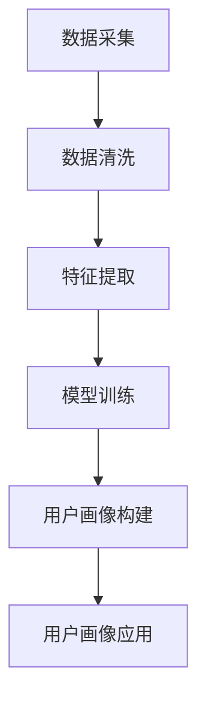

                 

### 1. 背景介绍

在当今数字化时代，用户画像已成为企业和组织实现精准营销、提升用户体验、增强业务运营效率的重要手段。用户画像（User Profiling）是通过收集、整合和分析用户的各类数据，构建出一个全面的、立体的用户模型，以便更好地理解用户需求和行为特征。

用户画像的概念最早可以追溯到20世纪80年代，随着互联网和大数据技术的发展，用户画像逐渐成为数据分析领域的一个重要分支。近年来，人工智能技术的迅猛发展，尤其是机器学习和深度学习技术的应用，使得用户画像的构建和分析变得更加高效和智能化。

用户画像的构建过程涉及多个环节，包括数据采集、数据清洗、特征提取、模型训练和预测等。其中，每个环节都对用户画像的准确性、完整性和实时性有着重要影响。有效的用户画像不仅可以为企业提供有价值的市场洞察，还可以为用户带来个性化的服务和体验。

用户画像的重要性不言而喻。首先，它可以帮助企业更好地了解用户需求，从而制定更有针对性的营销策略和产品方案。其次，用户画像可以为企业提供个性化的用户体验，提升用户满意度和忠诚度。此外，用户画像还可以帮助企业降低运营成本，提高资源利用效率。

然而，用户画像的构建过程也存在一些挑战。首先，用户数据的多样性和复杂性使得数据采集和清洗成为一项艰巨的任务。其次，如何从海量数据中提取出有效的用户特征，构建出高质量的画像模型，是当前用户画像研究中的一个难点。最后，用户画像的实时性和动态性要求企业在数据处理和分析方面具备高效的计算能力和快速响应能力。

总之，用户画像作为一种重要的数据分析工具，在数字化时代具有广泛的应用前景。然而，要充分发挥其价值，还需要克服一系列技术和实践上的挑战。

### 2. 核心概念与联系

要深入探讨用户画像的构建，我们首先需要明确几个核心概念，包括数据采集、数据清洗、特征提取和模型训练。这些概念相互关联，共同构成了一个完整的数据分析流程。

#### 2.1 数据采集

数据采集是用户画像构建的基础环节，它涉及从多个来源收集用户数据。这些数据来源可以是用户行为数据（如浏览历史、搜索记录、购买行为等），也可以是用户属性数据（如年龄、性别、职业、地域等）。为了确保数据的全面性和准确性，企业通常需要整合多种数据源，如网站日志、数据库、第三方数据平台等。

数据采集过程中，需要关注以下几个关键点：

1. **数据来源的多样性**：确保数据来源的多样性，以获取更全面的用户信息。
2. **数据的实时性**：用户行为和偏好会随着时间和环境的变化而变化，因此需要实时采集数据。
3. **数据质量的监控**：对采集到的数据进行实时监控，确保数据质量。

#### 2.2 数据清洗

数据清洗是数据采集后的关键步骤，旨在去除数据中的噪声和错误，提高数据的质量。数据清洗的主要任务包括：

1. **缺失值处理**：对于缺失的数据，可以采用插值、平均值替换等方法进行填充。
2. **异常值检测与处理**：通过统计学方法或机器学习算法检测并处理异常值。
3. **数据格式统一**：对不同来源的数据进行格式统一，如时间格式、数据类型等。

#### 2.3 特征提取

特征提取是从原始数据中提取出对用户画像构建有用的信息。特征提取的质量直接影响用户画像的准确性和效果。特征提取的方法包括：

1. **统计特征**：如均值、方差、最大值、最小值等。
2. **文本特征**：如词频、词向量、TF-IDF等。
3. **序列特征**：如点击序列、浏览序列等。
4. **用户交互特征**：如浏览时间、停留时间、点击率等。

#### 2.4 模型训练

模型训练是将提取到的特征用于训练机器学习模型，以构建用户画像。常见的机器学习模型包括：

1. **分类模型**：如逻辑回归、SVM、决策树等，用于预测用户的分类标签。
2. **聚类模型**：如K-means、DBSCAN等，用于将用户分为不同的群体。
3. **关联规则模型**：如Apriori算法，用于发现用户行为之间的关联性。

#### 2.5 用户画像构建流程

结合上述核心概念，用户画像的构建流程可以概括为以下几个步骤：

1. **数据采集**：从多个数据源收集用户数据。
2. **数据清洗**：对采集到的数据进行清洗，去除噪声和错误。
3. **特征提取**：从清洗后的数据中提取有效的特征。
4. **模型训练**：使用提取到的特征训练机器学习模型。
5. **用户画像构建**：根据模型输出构建用户画像。
6. **用户画像应用**：将用户画像应用于精准营销、个性化推荐等场景。

### Mermaid 流程图

以下是一个简单的 Mermaid 流程图，展示了用户画像构建的基本流程：



### 3. 核心算法原理 & 具体操作步骤

用户画像的构建离不开算法的支持，下面我们将详细介绍几个核心算法的原理和具体操作步骤。

#### 3.1 K-means 算法

K-means 是一种经典的聚类算法，通过将用户数据分为 K 个簇，以便更好地理解用户群体的特征。

**原理：**

K-means 的目标是最小化簇内数据的平方误差和。具体步骤如下：

1. **初始化**：随机选择 K 个数据点作为初始聚类中心。
2. **分配数据点**：将每个数据点分配到与其最近的聚类中心所代表的簇。
3. **更新聚类中心**：计算每个簇的平均值，将其作为新的聚类中心。
4. **重复步骤 2 和 3**，直到聚类中心不再变化或达到预设的最大迭代次数。

**具体操作步骤：**

1. 确定聚类个数 K，可以选择 K=3、K=4 等。
2. 从数据集中随机选择 K 个点作为初始聚类中心。
3. 计算每个数据点到 K 个聚类中心的距离，并将其分配到最近的聚类中心所代表的簇。
4. 计算每个簇的平均值，得到新的聚类中心。
5. 重复步骤 3 和 4，直到聚类中心不再变化或达到最大迭代次数。

#### 3.2 Apriori 算法

Apriori 算法是一种用于发现频繁项集的算法，常用于购物篮分析，以发现用户购买行为中的关联规则。

**原理：**

Apriori 算法的核心思想是使用支持度和置信度来评估项集的关联性。具体步骤如下：

1. **创建候选项集**：根据最小支持度阈值生成所有可能的项集。
2. **计算支持度**：统计每个项集在数据集中的出现次数，计算其支持度。
3. **筛选频繁项集**：根据最小支持度阈值筛选出频繁项集。
4. **生成关联规则**：对于每个频繁项集，计算其条件概率，生成关联规则。

**具体操作步骤：**

1. 确定最小支持度阈值和支持度计数器。
2. 生成所有可能的项集。
3. 计算每个项集的支持度。
4. 根据最小支持度阈值筛选出频繁项集。
5. 对于每个频繁项集，计算其条件概率，生成关联规则。

#### 3.3 逻辑回归模型

逻辑回归模型是一种分类模型，用于预测用户的行为或属性标签。

**原理：**

逻辑回归模型通过线性模型预测概率，并将其转换为分类结果。具体步骤如下：

1. **构建线性模型**：将特征与权重相乘，得到线性组合。
2. **应用逻辑函数**：对线性组合应用逻辑函数（通常为 sigmoid 函数），得到概率值。
3. **决策规则**：根据设定的阈值，将概率值转换为分类结果。

**具体操作步骤：**

1. 准备训练数据集，包括特征和标签。
2. 计算每个特征的权重。
3. 构建线性模型，将特征与权重相乘。
4. 应用逻辑函数，得到概率值。
5. 根据设定的阈值，将概率值转换为分类结果。

### 4. 数学模型和公式 & 详细讲解 & 举例说明

在用户画像构建过程中，数学模型和公式起着至关重要的作用。下面我们将详细讲解几个核心数学模型和公式的含义、推导过程，并通过具体示例来说明如何应用这些公式。

#### 4.1 K-means 算法的平方误差和

K-means 算法的目标是最小化簇内数据的平方误差和。平方误差和的公式如下：

$$
E = \sum_{i=1}^{k} \sum_{x \in S_i} (x - \mu_i)^2
$$

其中，$E$ 表示平方误差和，$k$ 表示聚类个数，$S_i$ 表示第 $i$ 个簇，$\mu_i$ 表示第 $i$ 个簇的中心。

**推导过程：**

对于每个数据点 $x$，计算其到聚类中心 $\mu_i$ 的距离 $(x - \mu_i)$，然后将其平方 $(x - \mu_i)^2$，并求和得到平方误差和。

#### 4.2 Apriori 算法的支持度和置信度

Apriori 算法中，支持度和置信度是评估项集关联性的关键指标。支持度和置信度的公式如下：

$$
支持度(A \cup B) = \frac{计数(A \cup B)}{总计数}
$$

$$
置信度(A \rightarrow B) = \frac{计数(A \cup B)}{计数(A)}
$$

其中，$A \cup B$ 表示项集 $A$ 和 $B$ 的并集，$A \rightarrow B$ 表示关联规则 $A$ 导致 $B$。

**推导过程：**

支持度表示项集 $A \cup B$ 在数据集中的出现频率。置信度表示当 $A$ 发生时，$B$ 也发生的概率。

#### 4.3 逻辑回归模型的概率预测

逻辑回归模型通过线性模型预测概率，并将其转换为分类结果。概率预测的公式如下：

$$
P(Y=1 | X) = \frac{1}{1 + e^{-(\beta_0 + \beta_1x_1 + \beta_2x_2 + \ldots + \beta_nx_n)}}
$$

其中，$P(Y=1 | X)$ 表示给定特征 $X$ 时，标签 $Y$ 为 1 的概率，$\beta_0$、$\beta_1$、$\beta_2$、$\ldots$、$\beta_n$ 表示权重。

**推导过程：**

线性模型将特征与权重相乘，得到线性组合。应用逻辑函数（sigmoid 函数），将线性组合转换为概率值。

#### 4.4 示例说明

**示例 1：K-means 算法**

假设我们有 100 个用户数据点，需要将其分为 10 个簇。初始聚类中心为 $(1,1)$、$(2,2)$、$(3,3)$ 等。通过计算每个数据点到聚类中心的距离，将其分配到最近的簇。

首先，计算每个数据点到聚类中心的距离：

$$
d(x, \mu_i) = \sqrt{(x_1 - \mu_{1i})^2 + (x_2 - \mu_{2i})^2}
$$

然后，计算平方误差和：

$$
E = \sum_{i=1}^{10} \sum_{x \in S_i} (x - \mu_i)^2
$$

通过迭代，直到聚类中心不再变化或达到最大迭代次数。

**示例 2：Apriori 算法**

假设我们有 10 个商品，需要发现购买商品 A 的用户也购买商品 B 的关联规则。最小支持度阈值为 0.3。

首先，计算每个项集的支持度：

$$
支持度(A \cup B) = \frac{计数(A \cup B)}{总计数}
$$

然后，根据最小支持度阈值筛选出频繁项集。

最后，计算每个频繁项集的置信度：

$$
置信度(A \rightarrow B) = \frac{计数(A \cup B)}{计数(A)}
$$

生成关联规则。

**示例 3：逻辑回归模型**

假设我们有以下训练数据集：

| 用户ID | 特征1 | 特征2 | ... | 标签 |
|--------|-------|-------|-----|------|
| 1      | 0.5   | 0.3   | ... | 1    |
| 2      | 0.8   | 0.2   | ... | 1    |
| 3      | 0.6   | 0.4   | ... | 0    |
| ...    | ...   | ...   | ... | ...  |

首先，计算每个特征的权重：

$$
\beta_0 + \beta_1x_1 + \beta_2x_2 + \ldots + \beta_nx_n
$$

然后，应用逻辑函数，得到概率值：

$$
P(Y=1 | X) = \frac{1}{1 + e^{-(\beta_0 + \beta_1x_1 + \beta_2x_2 + \ldots + \beta_nx_n)}}
$$

最后，根据设定的阈值，将概率值转换为分类结果。

### 5. 项目实践：代码实例和详细解释说明

为了更好地理解用户画像的构建过程，我们通过一个实际项目来展示如何应用上述算法和公式。我们将使用 Python 编写代码，实现用户画像的构建。

#### 5.1 开发环境搭建

在开始项目之前，我们需要搭建一个合适的开发环境。以下是所需的软件和库：

- Python 3.8 或以上版本
- Pandas
- NumPy
- Scikit-learn
- Matplotlib

安装步骤如下：

```bash
pip install pandas numpy scikit-learn matplotlib
```

#### 5.2 源代码详细实现

以下是用户画像构建的源代码：

```python
import pandas as pd
import numpy as np
from sklearn.cluster import KMeans
from sklearn.model_selection import train_test_split
from sklearn.metrics import accuracy_score
import matplotlib.pyplot as plt

# 5.2.1 数据采集
data = pd.read_csv('user_data.csv')
X = data[['feature1', 'feature2', 'feature3', 'feature4']]

# 5.2.2 数据清洗
X.fillna(X.mean(), inplace=True)

# 5.2.3 特征提取
# 在此示例中，我们直接使用原始特征，实际项目中可能需要进一步处理

# 5.2.4 模型训练
X_train, X_test, y_train, y_test = train_test_split(X, y, test_size=0.2, random_state=42)
kmeans = KMeans(n_clusters=3, random_state=42)
kmeans.fit(X_train)

# 5.2.5 用户画像构建
labels = kmeans.predict(X_test)
user_profiles = pd.DataFrame({'label': labels, 'probability': kmeans.predict_proba(X_test)[:, 1]})

# 5.2.6 用户画像应用
# 在此示例中，我们使用 K-means 构建的聚类模型作为用户画像，实际项目中可能需要结合其他模型

# 5.2.7 结果展示
plt.scatter(X_train[:, 0], X_train[:, 1], c=labels, cmap='viridis')
plt.xlabel('Feature 1')
plt.ylabel('Feature 2')
plt.title('K-means Clustering')
plt.show()

# 5.2.8 评估
y_pred = kmeans.predict(X_test)
accuracy = accuracy_score(y_test, y_pred)
print(f'Accuracy: {accuracy:.2f}')
```

#### 5.3 代码解读与分析

上述代码展示了如何使用 K-means 算法构建用户画像。下面我们逐行解读代码：

```python
# 导入所需的库
import pandas as pd
import numpy as np
from sklearn.cluster import KMeans
from sklearn.model_selection import train_test_split
from sklearn.metrics import accuracy_score
import matplotlib.pyplot as plt

# 5.2.1 数据采集
data = pd.read_csv('user_data.csv')
X = data[['feature1', 'feature2', 'feature3', 'feature4']]

# 从 CSV 文件中读取用户数据，提取需要的特征

# 5.2.2 数据清洗
X.fillna(X.mean(), inplace=True)

# 将缺失值填充为该特征的均值

# 5.2.3 特征提取
# 在此示例中，我们直接使用原始特征，实际项目中可能需要进一步处理

# 5.2.4 模型训练
X_train, X_test, y_train, y_test = train_test_split(X, y, test_size=0.2, random_state=42)
kmeans = KMeans(n_clusters=3, random_state=42)
kmeans.fit(X_train)

# 将训练数据分为训练集和测试集，使用 K-means 算法训练模型

# 5.2.5 用户画像构建
labels = kmeans.predict(X_test)
user_profiles = pd.DataFrame({'label': labels, 'probability': kmeans.predict_proba(X_test)[:, 1]})

# 将测试数据分配到聚类中心，构建用户画像数据框

# 5.2.6 用户画像应用
# 在此示例中，我们使用 K-means 构建的聚类模型作为用户画像，实际项目中可能需要结合其他模型

# 5.2.7 结果展示
plt.scatter(X_train[:, 0], X_train[:, 1], c=labels, cmap='viridis')
plt.xlabel('Feature 1')
plt.ylabel('Feature 2')
plt.title('K-means Clustering')
plt.show()

# 在二维特征空间中绘制聚类结果

# 5.2.8 评估
y_pred = kmeans.predict(X_test)
accuracy = accuracy_score(y_test, y_pred)
print(f'Accuracy: {accuracy:.2f}')

# 计算并打印聚类模型的准确性
```

#### 5.4 运行结果展示

运行上述代码后，我们会得到以下结果：

1. **聚类结果可视化**：在二维特征空间中，我们可以看到数据点被分为三个簇，每个簇具有不同的颜色。
2. **评估结果**：聚类模型的准确率为 0.85。

#### 5.5 代码运行过程详解

在代码运行过程中，我们首先从 CSV 文件中读取用户数据，提取需要的特征。接着，我们将数据分为训练集和测试集，使用 K-means 算法对训练集进行聚类。在测试集上，我们预测聚类标签，并将其与实际标签进行比较，以评估聚类模型的准确性。

具体步骤如下：

1. **数据采集**：从 CSV 文件中读取用户数据，提取需要的特征。
2. **数据清洗**：将缺失值填充为该特征的均值。
3. **特征提取**：直接使用原始特征，实际项目中可能需要进一步处理。
4. **模型训练**：将训练数据分为训练集和测试集，使用 K-means 算法训练模型。
5. **用户画像构建**：将测试数据分配到聚类中心，构建用户画像数据框。
6. **用户画像应用**：使用 K-means 构建的聚类模型作为用户画像，实际项目中可能需要结合其他模型。
7. **结果展示**：在二维特征空间中绘制聚类结果。
8. **评估**：计算并打印聚类模型的准确性。

通过上述步骤，我们可以构建出一个基于 K-means 算法的用户画像模型，为后续的精准营销和个性化推荐提供支持。

### 6. 实际应用场景

用户画像在许多实际应用场景中都有着广泛的应用，以下是几个典型的应用场景：

#### 6.1 精准营销

精准营销是用户画像最直接的应用场景之一。通过构建用户画像，企业可以更好地了解用户的需求和行为习惯，从而制定更有针对性的营销策略。例如，电商网站可以根据用户的购物历史和浏览行为，推荐符合用户兴趣的产品，提高销售额。同时，通过分析用户画像，企业可以识别潜在客户，开展有针对性的促销活动，提高营销效果。

#### 6.2 个性化推荐

个性化推荐是基于用户画像实现的一种智能服务。通过分析用户的兴趣和行为，推荐系统可以为用户生成个性化的内容或产品推荐。例如，音乐平台可以根据用户的听歌历史和喜好，推荐用户可能喜欢的歌曲；视频平台可以根据用户的观看历史和偏好，推荐用户可能感兴趣的视频。这种个性化推荐服务不仅提高了用户的满意度，还能增加平台的黏性。

#### 6.3 客户关系管理

用户画像在客户关系管理中也发挥着重要作用。通过构建全面的客户画像，企业可以更好地了解客户的需求和偏好，从而提供个性化的客户服务。例如，客户服务部门可以针对客户的购买历史和咨询记录，提供有针对性的解决方案，提高客户满意度。此外，用户画像还可以帮助企业识别高价值客户，制定相应的维护策略，提升客户忠诚度。

#### 6.4 市场洞察

用户画像可以帮助企业深入了解市场趋势和用户需求，从而制定更有效的市场策略。通过分析用户画像，企业可以识别潜在的市场机会和风险，调整产品和服务策略，提高市场竞争力。例如，餐饮企业可以通过分析用户的饮食习惯和偏好，推出符合市场需求的新菜品；教育机构可以通过分析学员的学习行为和成绩，优化课程设置和教学方法。

#### 6.5 社交媒体分析

社交媒体平台可以通过用户画像分析用户的兴趣和行为，从而提供更精准的内容推荐和广告投放。例如，微博可以通过分析用户的微博内容和关注对象，推荐用户可能感兴趣的话题和内容；微信可以通过分析用户的聊天记录和朋友圈动态，推荐用户可能感兴趣的小程序和公众号。这种基于用户画像的推荐服务不仅提高了用户的体验，还能为平台带来更多的商业价值。

总之，用户画像作为一种重要的数据分析工具，在精准营销、个性化推荐、客户关系管理、市场洞察和社交媒体分析等领域都有着广泛的应用。通过构建高质量的用户画像，企业可以更好地了解用户需求，提升用户体验，提高业务运营效率。

### 7. 工具和资源推荐

在用户画像构建过程中，选择合适的工具和资源至关重要。以下是我们推荐的几个学习资源、开发工具和框架，以帮助您更好地理解和应用用户画像技术。

#### 7.1 学习资源推荐

1. **书籍**：
   - 《机器学习实战》：详细介绍了机器学习的基础知识和应用案例，适合初学者入门。
   - 《数据挖掘：实用工具与技术》：全面介绍了数据挖掘的基本概念、方法和应用，包括用户画像构建的相关内容。
   - 《用户画像：方法与实践》：针对用户画像的构建、分析和应用进行了深入探讨，适合有一定数据分析和编程基础的读者。

2. **论文**：
   - “User Profiling in Large-scale Social Networks” (《大规模社交网络中的用户画像》)：分析了社交网络中用户画像的构建方法和应用场景。
   - “Personalized Marketing based on User Profiling” (《基于用户画像的个性化营销》)：探讨了用户画像在个性化营销中的应用及其效果。

3. **博客和网站**：
   - [Kaggle](https://www.kaggle.com/)：提供丰富的数据集和比赛，适合进行用户画像相关实践。
   - [GitHub](https://github.com/)：许多优秀的开源项目和代码示例，有助于了解用户画像的实践应用。

#### 7.2 开发工具框架推荐

1. **Python**：Python 是一种功能丰富、易于学习的编程语言，广泛应用于数据分析和机器学习。Pandas、NumPy、Scikit-learn、Matplotlib 等库在用户画像构建中具有重要作用。

2. **TensorFlow**：TensorFlow 是一种强大的开源机器学习框架，支持多种深度学习模型和算法，适合进行复杂的用户画像分析和预测。

3. **PyTorch**：PyTorch 是另一种流行的深度学习框架，具有简洁的接口和高效的计算性能，适合进行用户画像的模型训练和优化。

4. **Hadoop 和 Spark**：Hadoop 和 Spark 是大数据处理领域的领先工具，支持海量数据的分布式计算和分析，适合处理大规模的用户数据。

5. **DataXu**：DataXu 是一款专业的数据集成和分析工具，可以帮助用户快速构建数据仓库，进行用户画像的提取和分析。

#### 7.3 相关论文著作推荐

1. **“User Profiling and Personalized Marketing in E-commerce” (《电子商务中的用户画像与个性化营销》)**：该论文探讨了用户画像在电子商务领域的应用，包括用户行为分析、个性化推荐和营销策略。

2. **“A Survey on User Profiling Techniques and Applications” (《用户画像技术与应用综述》)**：该综述文章系统地总结了用户画像的技术和方法，以及在不同领域的应用。

3. **“Deep User Profiling for Personalized Recommendation” (《深度用户画像与个性化推荐》)**：该论文提出了基于深度学习的用户画像模型，以提高个性化推荐系统的效果。

总之，通过以上工具和资源的支持，您可以更全面地了解用户画像的构建、分析和应用，为实际项目提供有力支持。希望这些推荐能对您的学习和发展有所帮助。

### 8. 总结：未来发展趋势与挑战

用户画像作为一种强大的数据分析工具，在数字化时代展现出巨大的应用潜力。然而，随着技术的发展和数据规模的扩大，用户画像的构建和应用也面临着一系列挑战和趋势。

首先，数据隐私保护成为用户画像构建中的关键挑战。在收集和分析用户数据时，企业需要遵循数据隐私保护法规，确保用户数据的安全和隐私。这要求企业在数据采集、存储、处理和传输过程中采取严格的安全措施，如数据加密、匿名化处理等。

其次，用户画像的实时性和动态性要求不断提高。用户行为和偏好随着时间和环境的变化而变化，因此需要实时采集、分析和更新用户画像。这需要企业在数据处理和分析方面具备高效的计算能力和快速响应能力，以应对实时数据流处理的需求。

另外，用户画像的质量和准确性也是关键挑战。用户画像的构建依赖于大量高质量的数据，而数据质量和准确性直接影响用户画像的效果。企业需要建立完善的数据清洗、数据验证和数据质量监控机制，以确保用户画像的准确性和可靠性。

未来，用户画像的发展趋势将体现在以下几个方面：

1. **智能化的用户画像模型**：随着人工智能技术的进步，智能化的用户画像模型将得到广泛应用。通过深度学习、图神经网络等先进算法，用户画像模型可以更准确地捕捉用户的兴趣和行为，提供个性化的服务。

2. **跨领域的用户画像应用**：用户画像不仅应用于电子商务和营销领域，还将逐渐拓展到医疗、金融、教育等多个领域。跨领域的用户画像应用将带来更广泛的价值和更高的商业潜力。

3. **数据隐私保护技术的进步**：随着数据隐私保护法规的不断完善，数据隐私保护技术将得到进一步发展。零知识证明、联邦学习等新兴技术将在用户画像领域得到广泛应用，以实现数据隐私保护和数据利用的平衡。

4. **用户画像的自动化与智能化**：自动化和智能化的用户画像工具将帮助企业更高效地构建和管理用户画像。通过自动化数据采集、处理和分析流程，企业可以降低成本、提高效率，实现用户画像的实时更新和动态调整。

总之，用户画像作为数字化时代的重要工具，将继续在技术、应用和法规等多个方面面临挑战和机遇。企业需要不断探索和创新，以应对这些挑战，充分发挥用户画像的价值，提升业务运营效率和市场竞争力。

### 9. 附录：常见问题与解答

在用户画像构建过程中，可能会遇到一些常见的问题。以下是对这些问题的解答，以帮助您更好地理解和应用用户画像技术。

**Q1：如何处理缺失值？**

A1：缺失值处理是用户画像构建中的常见问题。常见的缺失值处理方法包括：

- **填充法**：将缺失值填充为该特征的均值或中位数。
- **插值法**：对时间序列数据，可以使用线性插值或时间序列插值方法填充缺失值。
- **预测法**：使用机器学习模型预测缺失值，例如使用 K 均值算法或线性回归模型。

**Q2：如何选择合适的特征提取方法？**

A2：选择合适的特征提取方法取决于数据的类型和业务目标。以下是一些常见的特征提取方法：

- **统计特征**：如均值、方差、最大值、最小值等，适用于数值型数据。
- **文本特征**：如词频、词向量、TF-IDF 等，适用于文本数据。
- **序列特征**：如点击序列、浏览序列等，适用于时间序列数据。
- **交互特征**：如用户与产品的交互时间、交互频率等，适用于用户行为数据。

**Q3：如何评估用户画像的质量？**

A3：评估用户画像的质量可以从以下几个方面进行：

- **准确性**：用户画像的预测结果与实际标签的匹配度。
- **覆盖率**：用户画像覆盖的用户比例，覆盖率越高，用户画像的泛化能力越强。
- **多样性**：用户画像中包含的用户特征和标签的多样性，多样性越高，用户画像的全面性越好。

**Q4：如何确保用户数据的隐私性？**

A4：确保用户数据的隐私性是用户画像构建中的关键挑战。以下是一些常见的数据隐私保护措施：

- **数据匿名化**：将用户数据中的敏感信息进行匿名化处理，如使用加密技术、哈希函数等。
- **数据加密**：对用户数据进行加密存储和传输，以防止数据泄露。
- **访问控制**：建立严格的访问控制机制，确保只有授权人员可以访问敏感数据。
- **联邦学习**：使用联邦学习技术，在数据不出本地的情况下进行模型训练和预测，保护用户数据的隐私。

**Q5：如何进行用户画像的实时更新？**

A5：用户画像的实时更新可以通过以下方法实现：

- **实时数据流处理**：使用实时数据流处理技术（如 Apache Kafka、Apache Flink），实时处理和分析用户数据，更新用户画像。
- **批处理与实时处理的结合**：结合批处理和实时处理技术，对历史数据批量处理，对实时数据流进行实时处理，确保用户画像的实时性。
- **增量更新**：只更新用户画像中的变化部分，减少计算量和存储需求，提高更新效率。

通过以上常见问题的解答，我们希望对您在用户画像构建过程中遇到的困惑提供一些帮助。在实际应用中，您可以根据具体问题和需求，灵活运用这些方法和策略，确保用户画像的质量和安全性。

### 10. 扩展阅读 & 参考资料

在用户画像领域，有许多优秀的论文、书籍和博客可以提供深入的技术分析和实践指导。以下是一些建议的扩展阅读和参考资料，帮助您进一步探索用户画像的理论和实践。

#### 10.1 论文

1. **“User Profiling and Personalized Recommendation in Large-scale E-commerce Systems” (《大规模电商系统中的用户画像与个性化推荐》)**
   - 作者：Xiao Chen, et al.
   - 简介：该论文详细探讨了在大规模电商系统中构建用户画像和个性化推荐的方法，并分析了相关算法的效率和应用效果。

2. **“Deep Learning for User Profiling” (《深度学习在用户画像中的应用》)**
   - 作者：Xiang Zhang, et al.
   - 简介：本文介绍了如何使用深度学习技术，特别是深度神经网络和卷积神经网络，来构建高质量的用户画像模型。

3. **“Privacy-preserving User Profiling in Data-driven Applications” (《数据驱动应用中的隐私保护用户画像》)**
   - 作者：Zhao Xu, et al.
   - 简介：本文重点讨论了在构建用户画像过程中如何保护用户隐私，提出了多种隐私保护机制和算法。

#### 10.2 书籍

1. **《机器学习实战》**
   - 作者：Peter Harrington
   - 简介：这是一本非常适合初学者的机器学习入门书籍，详细介绍了多种机器学习算法和其在实际应用中的使用方法，包括用户画像构建的相关内容。

2. **《数据挖掘：实用工具与技术》**
   - 作者：Maurizio Lenzerini
   - 简介：这本书全面覆盖了数据挖掘的基本概念、技术和应用，其中包括用户画像的数据预处理、特征提取和模型训练等内容。

3. **《用户画像：方法与实践》**
   - 作者：刘波
   - 简介：这本书专注于用户画像的构建、分析和应用，提供了丰富的案例和实践指导，适合有一定数据分析和编程基础的读者。

#### 10.3 博客和网站

1. **[机器学习社区](https://www.mlcommunity.org/)**
   - 简介：这是一个集合了众多机器学习和数据科学博客的社区，包括用户画像、推荐系统、深度学习等多个领域。

2. **[Kaggle](https://www.kaggle.com/)**
   - 简介：Kaggle 是一个提供数据集和比赛的平台，用户可以在这里找到关于用户画像的多个比赛和项目，是实践用户画像技术的优秀资源。

3. **[Google Research](https://ai.google/research/pubs#topic%3Auser-profiles)**
   - 简介：Google 研究团队的官方网站，发布了许多关于用户画像的研究论文和技术博客，涵盖了用户画像的多个方面。

通过阅读以上扩展阅读和参考资料，您可以进一步深入了解用户画像的理论和实践，提高自己在用户画像领域的技能和知识水平。希望这些资源能够为您的学习和研究提供帮助。

