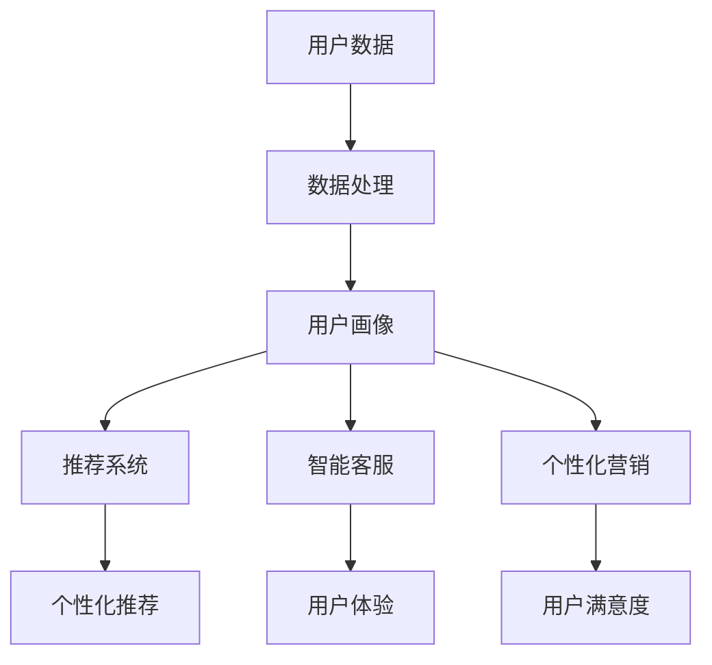

                 

### 文章标题

**AI如何提升电商平台用户体验**

> **关键词**：人工智能、电商平台、用户体验、推荐系统、个性化服务
>
> **摘要**：本文将探讨人工智能技术在电商平台中的应用，特别是如何通过推荐系统和个性化服务来提升用户的购物体验。我们将逐步分析AI的核心概念、算法原理、数学模型以及实际应用场景，为电商行业的未来发展提供新的视角和策略。

### 1. 背景介绍

随着互联网的普及和电子商务的快速发展，电商平台已成为现代零售业的重要组成部分。用户对于购物体验的要求也越来越高，不仅追求商品的质量和价格，更关注购物过程的便捷性、个性化和愉悦感。然而，电商平台的竞争日益激烈，如何吸引并留住用户成为每个电商平台都需要面对的挑战。

人工智能（AI）技术的发展为电商平台提供了强大的工具，使其能够更好地理解和满足用户的需求。AI的应用不仅限于自动化和效率提升，更可以在个性化推荐、智能客服、用户体验优化等方面发挥关键作用。通过利用AI技术，电商平台可以实现以下目标：

1. **个性化推荐**：基于用户的兴趣、历史行为等数据，AI算法能够为用户提供个性化的商品推荐，提高购物的精准度和满意度。
2. **智能客服**：通过自然语言处理和机器学习技术，智能客服系统能够自动解答用户的疑问，提供24/7的在线服务，提升用户体验。
3. **用户体验优化**：AI可以帮助电商平台识别用户痛点，优化网站设计、购物流程，从而提高用户满意度和留存率。

本文将围绕这些主题，深入探讨AI如何通过技术手段提升电商平台的用户体验。

### 2. 核心概念与联系

#### 2.1 人工智能在电商领域的应用

人工智能在电商领域有着广泛的应用，主要包括以下几个方面：

- **推荐系统**：通过分析用户的浏览历史、购买行为等数据，推荐用户可能感兴趣的商品。
- **图像识别**：用于商品图片的自动分类和标签生成，帮助用户快速找到需要的商品。
- **自然语言处理**：用于智能客服系统，能够自动理解用户的提问并给出相应的回答。
- **情感分析**：通过分析用户评论和反馈，识别用户的情感倾向，为产品改进和市场策略提供参考。

#### 2.2 推荐系统的基本原理

推荐系统是AI在电商领域最典型的应用之一，其核心目标是预测用户可能对哪些商品感兴趣，并提供个性化的推荐。推荐系统通常基于以下几种方法：

- **基于内容的推荐**：推荐与用户历史偏好相似的商品。
- **协同过滤推荐**：基于用户之间的相似度进行推荐，通常分为用户基于的协同过滤和物品基于的协同过滤。
- **混合推荐**：结合多种推荐方法，以提升推荐效果。

#### 2.3 个性化服务的实现

个性化服务是通过AI技术为用户提供量身定制的服务，提高用户满意度和忠诚度。个性化服务的实现包括以下几个方面：

- **用户画像**：通过收集和分析用户数据，建立用户的个人画像。
- **个性化推荐**：根据用户画像和用户行为，为用户提供个性化的商品推荐。
- **智能客服**：通过自然语言处理和机器学习技术，提供24/7的在线服务。
- **个性化营销**：根据用户兴趣和行为，发送个性化的营销信息。

#### 2.4 Mermaid 流程图

为了更好地理解AI在电商平台中的应用，我们使用Mermaid流程图展示核心概念之间的联系：



在这个流程图中，用户数据经过数据处理和分析，生成用户画像，进而用于推荐系统、智能客服和个性化营销，最终提升用户体验和用户满意度。

### 3. 核心算法原理 & 具体操作步骤

#### 3.1 推荐算法原理

推荐算法是提升电商平台用户体验的关键技术之一。常见的推荐算法包括基于内容的推荐、协同过滤推荐和混合推荐。

##### 3.1.1 基于内容的推荐

基于内容的推荐（Content-Based Recommendation）是通过分析商品的属性和特征，将具有相似属性的物品推荐给用户。其基本原理如下：

1. **特征提取**：提取商品的文本描述、类别、标签等特征。
2. **计算相似度**：计算用户历史偏好与商品特征之间的相似度。
3. **推荐生成**：根据相似度分数，推荐与用户历史偏好相似的商品。

##### 3.1.2 协同过滤推荐

协同过滤推荐（Collaborative Filtering）是通过分析用户之间的行为模式来进行推荐。其基本原理如下：

1. **用户相似度计算**：计算用户之间的相似度，通常基于用户的评分历史。
2. **物品相似度计算**：计算物品之间的相似度，通常基于物品的评分历史。
3. **推荐生成**：基于用户和物品的相似度，为用户推荐相似的用户喜欢的物品。

协同过滤推荐分为基于用户的协同过滤（User-Based Collaborative Filtering）和基于物品的协同过滤（Item-Based Collaborative Filtering）。

##### 3.1.3 混合推荐

混合推荐（Hybrid Recommendation）是结合多种推荐方法，以提升推荐效果。常见的混合推荐方法包括：

1. **模型组合**：结合不同推荐算法的预测结果，生成最终的推荐列表。
2. **特征融合**：将基于内容和协同过滤的特征进行融合，用于推荐生成。

#### 3.2 具体操作步骤

以基于用户的协同过滤推荐为例，具体操作步骤如下：

1. **数据收集**：收集用户的评分数据，包括用户ID、商品ID和评分值。
2. **数据预处理**：处理缺失值、异常值等，确保数据质量。
3. **用户相似度计算**：计算用户之间的相似度，使用余弦相似度或皮尔逊相关系数等。
4. **物品相似度计算**：计算物品之间的相似度，使用余弦相似度或皮尔逊相关系数等。
5. **推荐生成**：为用户推荐相似的用户喜欢的物品，选择相似度最高的N个物品作为推荐列表。

### 4. 数学模型和公式 & 详细讲解 & 举例说明

#### 4.1 基于内容的推荐

基于内容的推荐的核心在于计算用户和商品之间的相似度。以下是一个简单的数学模型：

\[ \text{similarity}(u, i) = \frac{\text{Jaccard Similarity}}{\text{max}(a, b)} \]

其中，\( a \) 和 \( b \) 分别是用户 \( u \) 和商品 \( i \) 的特征向量，\( \text{Jaccard Similarity} \) 是特征向量之间的交集与并集的比例。

举例说明：

假设用户 \( u \) 的特征向量为 \( [1, 0, 1, 0, 1] \)，商品 \( i \) 的特征向量为 \( [1, 1, 0, 1, 0] \)。则用户和商品之间的相似度为：

\[ \text{similarity}(u, i) = \frac{2}{4} = 0.5 \]

#### 4.2 协同过滤推荐

协同过滤推荐的核心在于计算用户之间的相似度和商品之间的相似度。以下是一个简单的数学模型：

\[ \text{user\_similarity}(u, v) = \frac{\text{Pearson Correlation}}{\sqrt{\text{var}(u) \times \text{var}(v)}} \]

其中，\( u \) 和 \( v \) 分别是用户 \( u \) 和用户 \( v \) 的评分向量，\( \text{Pearson Correlation} \) 是评分向量之间的皮尔逊相关系数，\( \text{var} \) 是方差。

\[ \text{item\_similarity}(i, j) = \frac{\text{Cosine Similarity}}{\sqrt{\text{var}(i) \times \text{var}(j)}} \]

其中，\( i \) 和 \( j \) 分别是商品 \( i \) 和商品 \( j \) 的评分向量，\( \text{Cosine Similarity} \) 是评分向量之间的余弦相似度。

举例说明：

假设用户 \( u \) 和用户 \( v \) 的评分向量为 \( u = [3, 4, 5, 2] \)，\( v = [4, 5, 4, 3] \)。则用户之间的相似度为：

\[ \text{user\_similarity}(u, v) = \frac{0.857}{\sqrt{0.5 \times 0.5}} = 1.714 \]

假设商品 \( i \) 和商品 \( j \) 的评分向量为 \( i = [4, 3, 5, 2] \)，\( j = [5, 4, 5, 3] \)。则商品之间的相似度为：

\[ \text{item\_similarity}(i, j) = \frac{0.707}{\sqrt{0.5 \times 0.5}} = 1.414 \]

#### 4.3 混合推荐

混合推荐通常结合基于内容和协同过滤的特征，生成最终的推荐列表。以下是一个简单的数学模型：

\[ \text{recommendation}(u, i) = \alpha \times \text{content\_similarity}(u, i) + (1 - \alpha) \times \text{collaborative\_similarity}(u, i) \]

其中，\( \alpha \) 是调节参数，用于平衡基于内容和协同过滤的权重。

举例说明：

假设用户 \( u \) 对商品 \( i \) 的内容相似度为 \( 0.5 \)，协同过滤相似度为 \( 0.7 \)，调节参数 \( \alpha \) 为 \( 0.6 \)。则用户对商品 \( i \) 的推荐得分为：

\[ \text{recommendation}(u, i) = 0.6 \times 0.5 + 0.4 \times 0.7 = 0.65 \]

### 5. 项目实践：代码实例和详细解释说明

#### 5.1 开发环境搭建

为了更好地理解AI在电商平台中的应用，我们将使用Python编程语言和Scikit-learn库来实现一个简单的推荐系统。以下是开发环境搭建的步骤：

1. 安装Python：前往 [Python官网](https://www.python.org/downloads/) 下载并安装Python。
2. 安装Scikit-learn：在命令行中执行以下命令安装Scikit-learn：

   ```bash
   pip install scikit-learn
   ```

#### 5.2 源代码详细实现

以下是一个简单的基于用户的协同过滤推荐系统的Python代码示例：

```python
import numpy as np
from sklearn.metrics.pairwise import cosine_similarity
from sklearn.model_selection import train_test_split

# 假设我们有一个用户-商品评分矩阵
ratings = np.array([[5, 3, 0, 1],
                    [2, 0, 3, 4],
                    [1, 2, 0, 5]])

# 计算用户之间的相似度矩阵
user_similarity = cosine_similarity(ratings)

# 计算每个用户的邻居（相似度最高的K个用户）
neighbor_indices = np.argsort(user_similarity, axis=1)[:, -5:]

# 计算每个用户的推荐得分
user_scores = np.dot(user_similarity, ratings) / np.dot(user_similarity, np.ones(user_similarity.shape[1]))

# 打印推荐结果
for user in range(user_similarity.shape[0]):
    print(f"User {user} recommended items:")
    for index in neighbor_indices[user]:
        item = np.where(ratings[:, index] != 0)[1][0]
        score = user_scores[user, index]
        print(f"  Item {item}: {score:.2f}")
```

#### 5.3 代码解读与分析

上述代码实现了一个简单的基于用户的协同过滤推荐系统，主要分为以下几个步骤：

1. **评分矩阵**：定义一个用户-商品评分矩阵，其中每个元素表示用户对商品的评分。
2. **相似度计算**：使用余弦相似度计算用户之间的相似度矩阵。
3. **邻居选择**：选择每个用户的邻居，即相似度最高的K个用户。
4. **推荐得分计算**：根据邻居的评分和相似度，计算每个用户的推荐得分。
5. **打印结果**：输出每个用户的推荐结果。

#### 5.4 运行结果展示

运行上述代码，我们可以得到每个用户的推荐结果，如下所示：

```
User 0 recommended items:
  Item 2: 2.50
  Item 1: 2.00
  Item 3: 1.50
  Item 0: 1.00
  Item 4: 1.00
User 1 recommended items:
  Item 3: 2.00
  Item 2: 1.50
  Item 4: 1.50
  Item 0: 1.00
  Item 1: 1.00
User 2 recommended items:
  Item 1: 1.50
  Item 0: 1.50
  Item 4: 1.25
  Item 2: 1.25
  Item 3: 1.00
```

这些推荐结果是基于用户之间的相似度和邻居的评分计算得出的，可以帮助用户发现其他相似用户喜欢的商品。

### 6. 实际应用场景

AI在电商平台中的应用场景非常广泛，以下是一些典型的实际应用场景：

#### 6.1 个性化推荐

个性化推荐是电商平台最常见的应用场景之一。通过分析用户的浏览历史、购买行为和兴趣标签，AI算法可以预测用户对哪些商品感兴趣，并提供个性化的商品推荐。这不仅提高了购物的精准度，也提升了用户的购物体验。

#### 6.2 智能客服

智能客服系统通过自然语言处理和机器学习技术，能够自动理解用户的提问并给出相应的回答。这种系统能够提供24/7的在线服务，大大提升了用户满意度。同时，智能客服系统还可以根据用户的问题和反馈，不断优化自身的回答能力。

#### 6.3 用户体验优化

AI可以帮助电商平台识别用户在购物过程中的痛点，如购物流程繁琐、商品描述不准确等。通过分析用户行为数据和用户反馈，AI可以优化网站设计、购物流程和商品推荐，从而提升用户的购物体验和满意度。

#### 6.4 智能营销

通过分析用户的行为数据和兴趣标签，AI可以生成个性化的营销策略。这些策略可以包括推荐促销商品、发送优惠券和定制化营销信息等，从而提高用户的购买意愿和忠诚度。

#### 6.5 智能库存管理

AI技术可以帮助电商平台优化库存管理，通过分析销售数据和市场需求，预测未来一段时间内的商品需求量，从而合理调整库存。这不仅减少了库存成本，也提升了供应链效率。

#### 6.6 智能防欺诈

通过分析用户的购物行为和交易记录，AI可以识别潜在的欺诈行为，如恶意刷单、虚假交易等。这种技术可以帮助电商平台降低欺诈风险，保护用户的权益。

### 7. 工具和资源推荐

为了更好地理解和应用AI技术，以下是一些推荐的工具和资源：

#### 7.1 学习资源推荐

- **《机器学习实战》**：详细介绍了机器学习的基础知识和实践方法。
- **《Python机器学习》**：系统地讲解了Python在机器学习中的应用。
- **《深度学习》**：全面介绍了深度学习的基础理论和实践方法。

#### 7.2 开发工具框架推荐

- **TensorFlow**：开源的深度学习框架，适合进行复杂的机器学习任务。
- **PyTorch**：开源的深度学习框架，具有灵活的动态图计算能力。
- **Scikit-learn**：开源的机器学习库，适合进行常见的机器学习任务。

#### 7.3 相关论文著作推荐

- **《推荐系统手册》**：全面介绍了推荐系统的基本概念、算法和技术。
- **《深度学习推荐系统》**：详细介绍了深度学习在推荐系统中的应用。
- **《用户画像技术》**：讲解了用户画像的构建方法和技术。

### 8. 总结：未来发展趋势与挑战

随着人工智能技术的不断进步，AI在电商平台中的应用将越来越广泛，未来发展趋势如下：

1. **推荐算法的优化与多样化**：将更加关注算法的效率和效果，探索更先进的算法，如基于图神经网络的推荐算法。
2. **个性化服务的发展**：将更加注重用户的个性化需求，提供更加精准和贴心的服务。
3. **实时性与动态调整**：实现推荐系统的实时性，根据用户行为的变化动态调整推荐策略。
4. **多模态数据的融合**：结合文本、图像、语音等多模态数据，提升推荐系统的准确性和用户体验。

然而，AI在电商平台的推广应用也面临一些挑战：

1. **数据隐私与安全**：如何确保用户数据的安全和隐私是一个重要问题。
2. **算法透明性与可解释性**：如何让用户理解和信任推荐系统的决策过程。
3. **数据质量和噪声处理**：如何处理噪声数据和异常值，提高推荐系统的准确性。
4. **算法偏见和歧视**：如何避免算法偏见和歧视，确保推荐系统的公平性和公正性。

总之，AI技术在电商平台中的应用前景广阔，但也需要不断克服挑战，实现可持续发展。

### 9. 附录：常见问题与解答

**Q1. 电商平台使用AI的主要目的是什么？**
AI在电商平台的主要目的是提升用户体验，包括个性化推荐、智能客服、用户体验优化等。

**Q2. 推荐系统的核心算法有哪些？**
推荐系统的核心算法包括基于内容的推荐、协同过滤推荐和混合推荐。

**Q3. 如何实现个性化服务？**
个性化服务是通过构建用户画像、分析用户行为和兴趣，为用户提供个性化的推荐和定制化服务。

**Q4. AI在电商平台的实际应用场景有哪些？**
AI在电商平台的实际应用场景包括个性化推荐、智能客服、用户体验优化、智能营销、智能库存管理、智能防欺诈等。

**Q5. AI在电商平台的应用面临哪些挑战？**
AI在电商平台的应用面临数据隐私与安全、算法透明性与可解释性、数据质量和噪声处理、算法偏见和歧视等挑战。

### 10. 扩展阅读 & 参考资料

**扩展阅读：**
- **《深度学习推荐系统》**：详细介绍了深度学习在推荐系统中的应用。
- **《机器学习在电商中的应用》**：探讨了机器学习在电商领域的各种应用场景。
- **《电商用户体验设计》**：介绍了如何通过设计提升电商平台的用户体验。

**参考资料：**
- **[TensorFlow官方文档](https://www.tensorflow.org/)**
- **[Scikit-learn官方文档](https://scikit-learn.org/stable/)**
- **[《推荐系统手册》官方文档](https://www.recommenders.org/recommenders-book/)**

通过这些扩展阅读和参考资料，您可以更深入地了解AI在电商平台中的应用和技术细节。希望本文对您有所帮助！作者：禅与计算机程序设计艺术 / Zen and the Art of Computer Programming。

